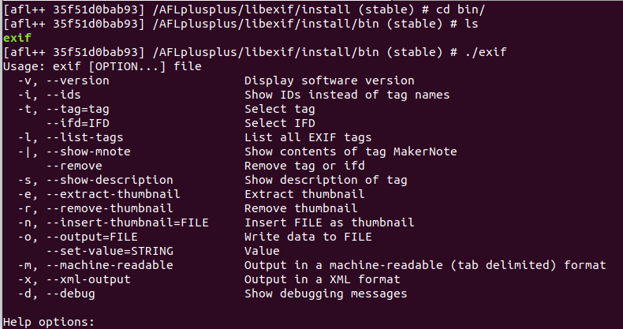
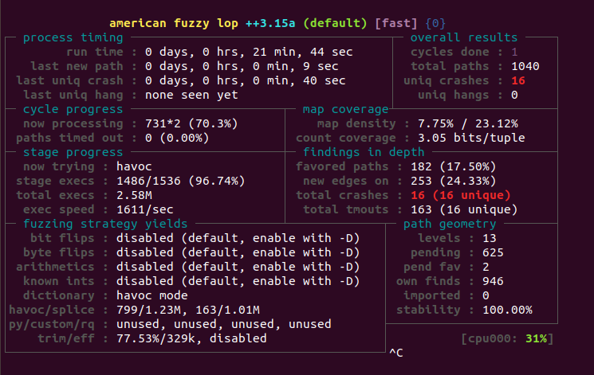
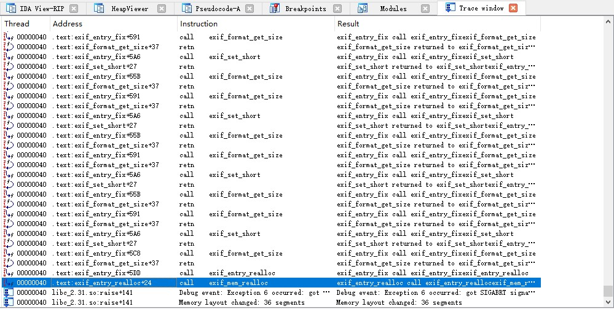
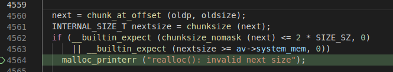

参考: [https://www.cnblogs.com/unr4v31/archive/2021/09/09/15247691.html](https://www.cnblogs.com/unr4v31/archive/2021/09/09/15247691.html)

# 安装libexif和exif
注: 以下在afl++的docker容器内测试
```sh
mkdir libexif
cd libexif

# 下载
wget https://sourceforge.net/projects/libexif/files/libexif/0.6.18/libexif-0.6.18.tar.gz
tar -zxvf libexif-0.6.18.tar.gz
wget https://github.com/libexif/exif/archive/refs/tags/exif-0_6_15-release.tar.gz
tar -xzvf exif-0_6_15-release.tar.gz

apt-get install autopoint libtool gettext libpopt-dev

# 下一个文件样本集
git clone https://github.com/ianare/exif-samples.git

cd ..
export LLVM_CONFIG="llvm-config-11"

# 编译libexif
autoreconf -fvi
CC=afl-clang-lto ./configure --enable-shared=no --prefix="libexif/install/"
make
make install

# 编译libexif
autoreconf -fvi
CC=afl-clang-lto ./configure --enable-shared=no --prefix="libexif/install/" PKG_CONFIG_PATH=libexif/install/lib/pkgconfig
make
make install

# 测试
afl-fuzz -i libexif/exif-samples/jpg/ -o libexif/out -s 123 -- libexif/install/bin/exif @@
```

exif成功安装后的运行如下所示:



# afl-fuzz的结果



# 分析
ida中函数追踪:



出错在`<malloc.c>:_int_realloc`函数, 其中`next`代表的堆块中`mchunk_size`字段值为0. 而这个`next`是`oldp`的地址加上自身`mchunk_size`得到.

使用`memcpy`进行大量拷贝的函数: 
* exif-loader.c: exif_loader_copy, exif_loader_write
* exif-data.c: exif_data_load_data_entry(207行)



# 源码分析记录
[EXIF格式](https://cloud.tencent.com/developer/article/1427939)

data->ifd这个数组中的每一项由函数`<exif-content.c>:exif_content_new_mem`生成.

libexif/exif-loader.c
* exif_loader_write (ExifLoader *eld, unsigned char *buf, unsigned int len)
    * 会将`buf`中的数据拷贝到`eld->buf`中
    * `exif_loader_write_file`会调用它