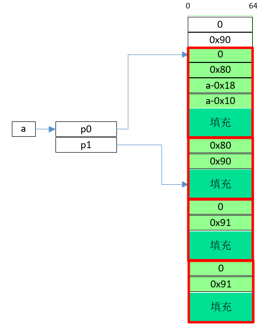

**前言**

类似于unsafe unlink, 也是利用free中后向合并时的赋值操作修改任意区域. 但unsafe unlink要在有溢出的情况下有用(此时可以修改块的头两个字段prev_size和size). double free可以不用溢出, 只要**能对块内地址进行free操作**即可.

**条件**

1. 由malloc返回的地址在对应块被free后没有被抹去, 仍可被free.
2. 已知存储malloc返回地址的变量的地址. 可能是固定的bss段内地址, 或者先通过其他方法泄漏出来. 下面称这个地址为a.

**方法**

1. 先申请两个小块, 返回地址分别为p0和p1(为了能进双向bin链而不是进fastbin或tcache, 每个块至少要比fastbin的块大, 如0x80), 将它们释放.
2. 申请一块足够大的块(图所示, p0即为malloc返回地址, 绿色部分为整个块可编辑的部分. 要能覆盖p1所指地址, 并要能在这连续做3个假块(每个块至少要比fastbin的块大, 如0x80)
3. 在新申请的块中伪造4个假块(图中4个红框): 
    
    第1个假块大小为0x80, fd和bk分别为a-0x18和a-0x10, 以绕过unlink检查.

    后3个假块大小为0x90. 第2个假块prev_size为0x80, prev_inuse位为0, 以标记上一个块为空闲块, 从而触发unlink.

    第3和第4个假块的prev_inuse位为1, 以通过前向合并的检查以及防止发生前向合并.
4. free(p1), 触发unlink操作, 将a所指处值由p0改为a, 之后便可编辑a所指的这一块的地址.

