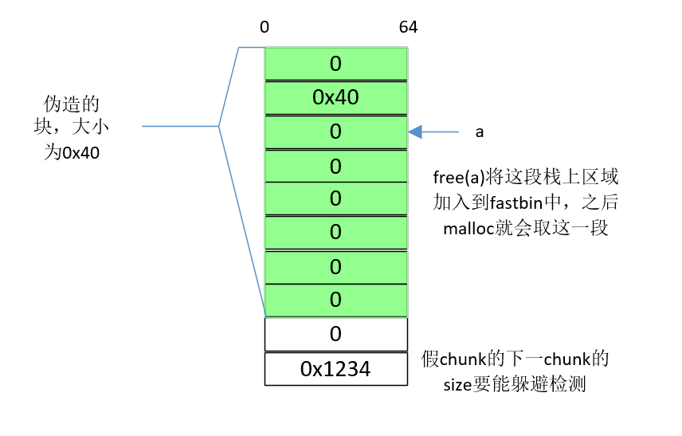
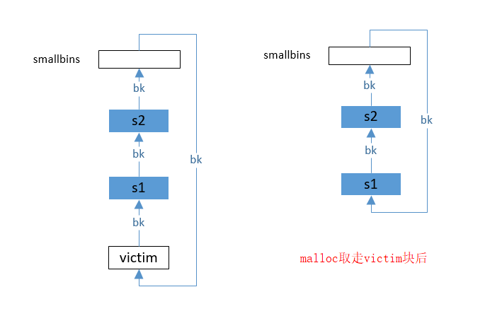
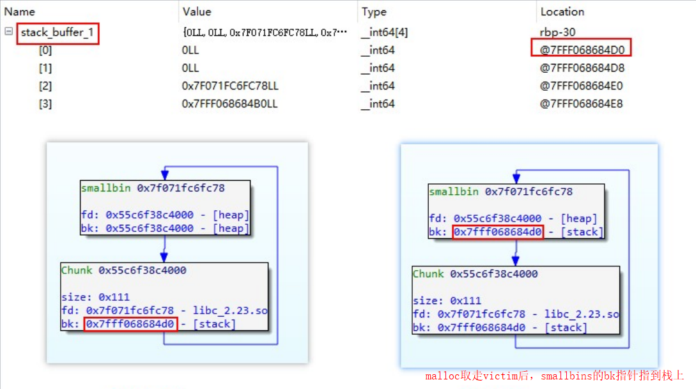
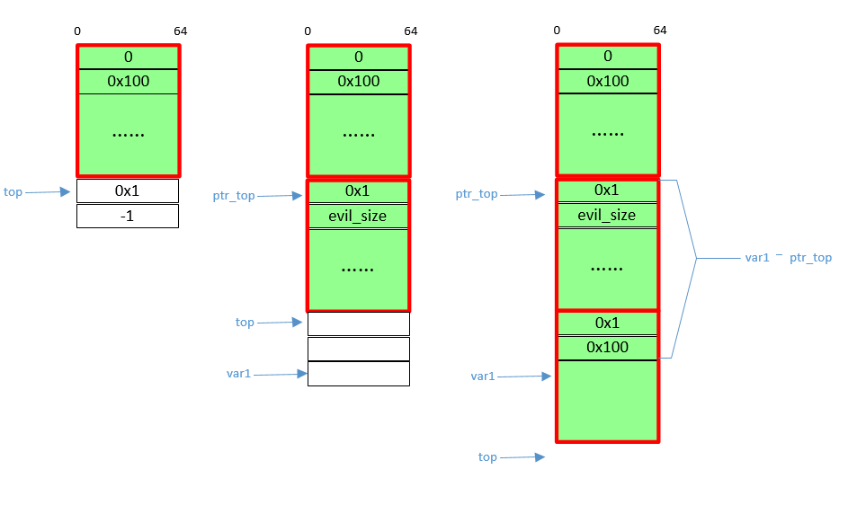
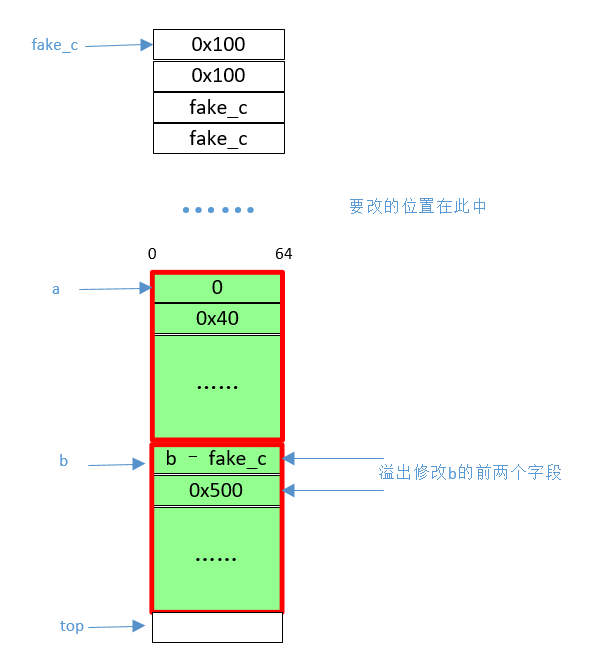
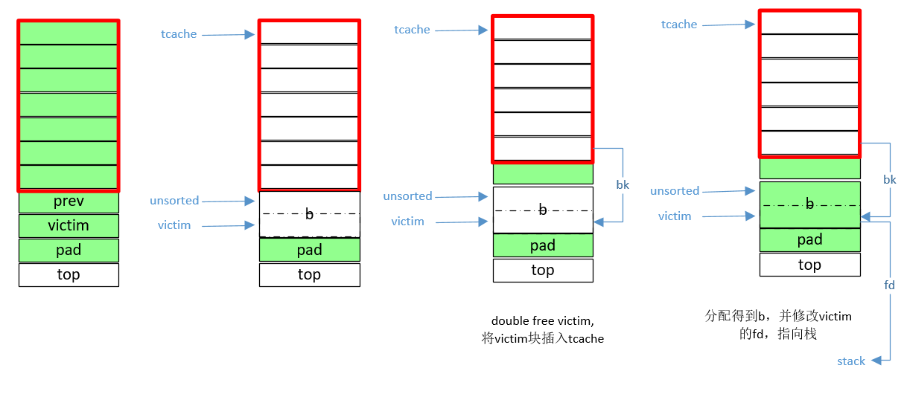
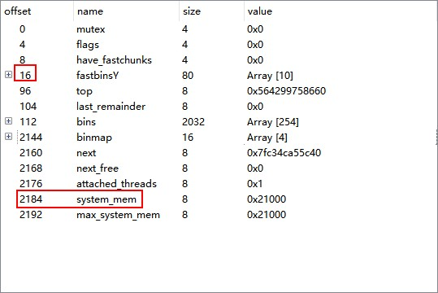
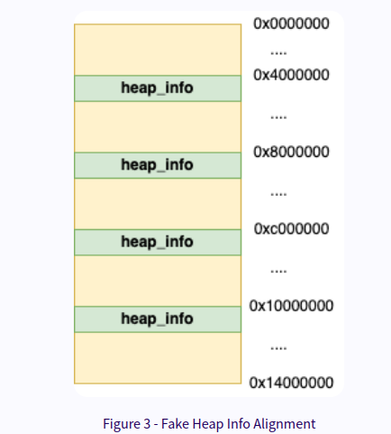
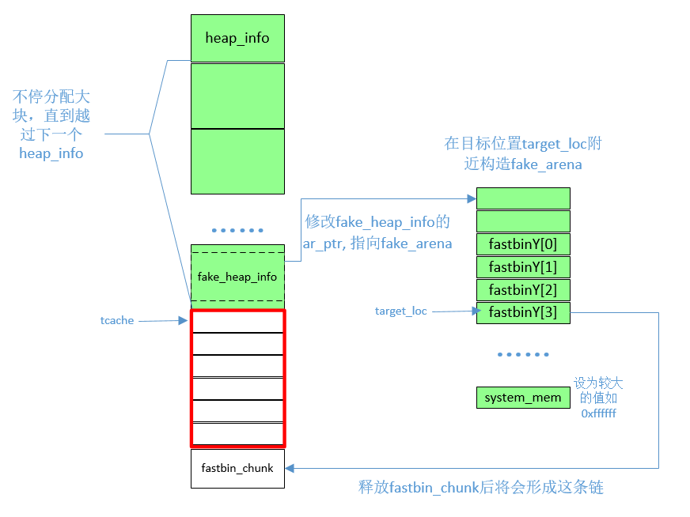

**前言**

    绿框代表使用中的内存空间, 白框代表空闲的内存空间, 蓝框为堆外的空间.

# house of spirit
`在栈上伪造堆块, 并对之进行free`, 让它进fastbin链, 之后malloc会得到栈上的区域.

**注意的点:**

1. 假块的size字段的值要`大于16小于128`, 以确保能进fastbin.
2. 假块的size字段的后面3个标志位: PREV_INUSE位因为不影响fastbin所以可以不理, 但IS_MMAPPED和NON_MAIN_ARENA要置零. 另外malloc得到的块的大小是要约的(如在x64, 0x30-0x38都要约成0x40).
3. 要让假块的下一堆块通过大小的完整性检查(nextsize integrity checks). 因此下一堆块的size字段要大于2*SIZE_SZ, 小于av->system_mem(main arena中默认为128kb)

    

# house of lore
`修改smallbins链上的块的bk指针, 将其指向栈上区域`, 使得之后连续第二次malloc时取得栈上区域.

注: 在how2heap的glibc 2.27中有house of lore示例, 但会报*Segmentation fault*的错. 

**条件**
* glibc 2.23
* 存在UAF
* 能暴露栈上地址.

**利用过程**
1. 申请一个小块victim; 再申请一个块, 以防victim被合并到top块.
2. 在栈上构造两个假块是s1和s2. s1的fd指向victim, bk指向s2; s2的fd指向s1. `构建s2是为了绕过malloc得到s1时smallbins的检查`.
3. 这时victim在unsorted bins上. 申请一个大块, `引起malloc_consolidate, victim转移到smallbins上`.
4. 释放victim, 之后将victim的bk指向s1.
5. 连续malloc两次. 结果是第一次malloc获得victim, 第二次获得s2, 即栈上区域.





# house of force
溢出覆盖top块, 使得malloc的来源内存空间极大, 并因此能获得目标地址.

**条件**
* glibc 2.27以下
* 有溢出

**利用过程**
1. 分配一个区块victim, 因此也会产生top块.
2. 溢出victim覆盖top块的size字段, 将其值改为-1, 即无符号的最大值.
3. 假设覆盖的目标为变量var1. `需要分配一个区块c1, 以覆盖var1以前的位置, 进而在下一次malloc分配的区块中会包含var1, 从而可改写var1.` 如下图右三, c1的大小应为var1地址减去分配victim后的top块地址, 再减去`4个头部字段的大小`.
4. 再次malloc, 得到的区域的起始地址即为var1.

    

注
* 实验观察到, 当要覆盖的var1的地址位于比堆区低的区段时, 该方法仍可成功, 此时

# house of einherjar
修改空闲块victim的prev_size大小, 让该值大到可以追溯到目标改写位置. 在后向合并时, 目标改写位置被合并到top块来, 下一次malloc时可获得该位置.

**条件**
* 有溢出

**利用过程**
1. malloc得到两个块a和b.
2. 在目标地址往前的位置构造假块fake_c, 其中的fd和bk字段值为fake_c的地址(以绕过unlink检查), size字段为`fake_c - b`.
3. 溢出a, 将b的prev_size值改为fake_c - b, 并将size字段中的prev_inuse位置零.
4. free(b), 引起fake_c向后合并.
5. malloc以获取对目标位置的修改权.

    

# house of botcake
tcache中毒, 有点像fastbin_dup. 通过double free将一个已经存在于unsortedbins链的块插入到tcache中, 并修改该块的fd指针, 指向任意可写地址, 之后连续第二次malloc获得该地址.

**条件**
* 可double free

**利用过程**
1. 申请7个小块(malloc(0x100))(用于后续填满tcache), 申请一个用于free时合并的成大块的prev块, 申请一个victim块, 再申请一个小块pad以防释放victim时被合并到top块.
2. 释放7个小块以填满tcache; 释放vicitm和prev, 它们会被合并(记为b)后放到unsortedbins中.
3. malloc从tcache取出一块, 再free(victim), 将该块插入tcache.
4. 申请一个较大块(malloc(0x120)), 确保从b块分出一个包含victim的头地址的块; 通过修改该块修改victim的fd字段, 使之指向任意可写地址.
5. 连续第二次malloc获得任意可写地址.

    

# house of mind fastbin
参考: [https://maxwelldulin.com/BlogPost?post=2257705984](https://maxwelldulin.com/BlogPost?post=2257705984)

在目标改写位置附近伪造arena. 通过将某个fastbin大小的块的N位置1并将其free, 使目标位置的值变为该块的地址.

**条件**
* 已泄漏堆地址(用于计算即将使用的假heap_info的位置)
* malloc的次数不限
* 堆块可溢出(为了修改块的size字段的N标志位)

**注意的点**
1. size的完整性检查
    ```c
    if next_chunk_size <= 0x10 or 
    next_chunk_size >= arena->system_mem
    ```
2. malloc有最大值限制
    ```c
	int MAX_SIZE = (128*1024) - 0x100; // MMap threshold: https://elixir.bootlin.com/glibc/glibc-2.23/source/malloc/malloc.c#L635
    ```

**利用过程**
1. 记目标修改位置为target_loc, 在target_loc之前一点的地方(如, 0x30, 则将利用malloc_state的fastbinsY[0x4]位置)构建假的malloc_state(记为fake_arena). 为了绕过对size的完整性检查. 需设置fake_arena[0x888]处(`system_mem字段`)的值, 尽量大(如0xffffff).

    
2. 根据heap的对齐方式, 利用一块新的heap_info(记为fake_heap_info). 计算该heap_info位置的方法如下. 因heap_info的首个字段`ar_ptr`记录对应的arena的位置, 所以需要修改fake_heap_info的前8个字节为fake_arena的地址.
    ```c
    heap_info = (target_loc + HEAP_MAX_SIZE) & ~(HEAP_MAX_SIZE - 1)
    ```
    
3. 为了获得对fake_heap_info位置的读写权, 可通过不断的malloc以达到该位置.
4. 先通过malloc和free把tcache填满. 分配一块fastbin大小的块fastbin_chunk(如malloc(0x50)), 并通过堆溢出`修改该块的size字段的N标志位为1`(表示该块属于non-main arena).
5. free(fastbin_chunk), 之后target_loc处的值将被改写为fastbin_chunk的地址

    

**一些利用场景**
1. 覆盖一些指定了"最大值"的字段, 使其值尽量大, 从而后续可进行更多越界的读写操作.
2. 如, 已有对某个长为0x200的字符串s的修改权限. 通过本方法覆盖变量s, 使其指向某个空闲的freebin块, 进而导致大的溢出.

# house of husk
参考 [https://maxwelldulin.com/BlogPost?post=3107454976](https://maxwelldulin.com/BlogPost?post=3107454976)

**用途**
1. 覆盖global_max_fast(该值指定fastbin块的最大大小), 可以让所有堆块被视为fastbin块