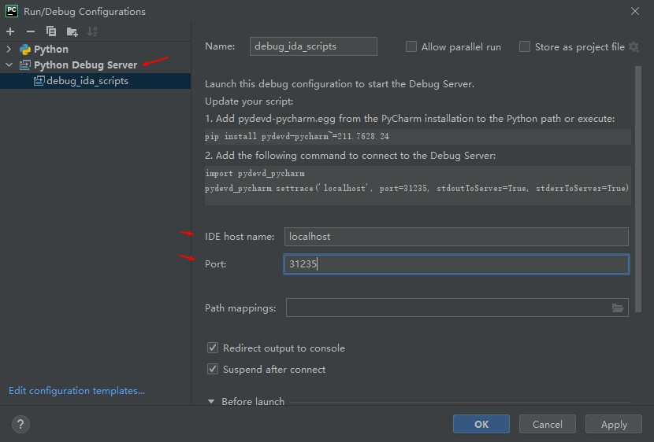
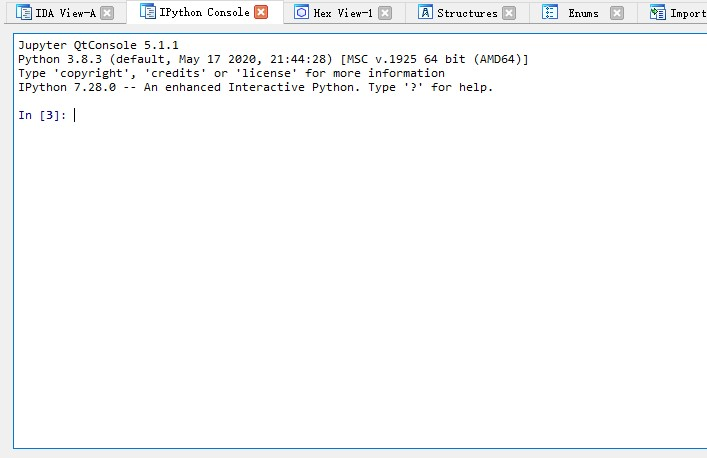

# 快捷键
f2: 可用于编辑内存数据

# 用pycharm调试ida插件
参考: https://www.cnblogs.com/zknublx/p/7654757.html

1. 使用ida安装路径下的python以及easy_install安装pycharm安装目录下的pydevd-pycharm.egg
```sh
E:\zbh\disasm\IDA7_5\Python38\python.exe E:\zbh\disasm\IDA7_5\Python38\Scripts\easy_install.exe  "E:\PyCharm 2021.1.3\debug-eggs\pydevd-pycharm.egg"
```

2. 在pycharm中新增`Python Debug Server`的配置, 填好服务IP地址和端口, 并F9启动调试服务.

    

3. 在要调试的文件中插入如下代码, **在需要中断的地方的前面都需要插入`pydevd_pycharm.settrace`这行代码,** **可以把这行代码视为断点**.
```py
import pydevd_pycharm
pydevd_pycharm.settrace('localhost', port=31235, stdoutToServer=True, stderrToServer=True)
```

4. 启动IDA, 则将命中断点.

注意:
1. 使用的ida是7.5版本; 使用pycharm企业版才有python debug server
2. 确保没有安装pydevd, 否则会有path mapping没有正确匹配路径的问题.
3. 重新加载并调试插件需要重启IDA(仅仅关掉一个项目并重新打开行不通)

# 一些报错
`Unexpected entries in the plt stub. The file might been modified after linking.`
    
这是在导入文件时报的错. 可执行文件中有.plt.sec节, 且

# IDAPython
注: 
* 从7.4开始使用的是python3.
* [接口变化](https://hex-rays.com/products/ida/support/ida74_idapython_no_bc695_porting_guide.shtml)

官方文档: [https://hex-rays.com/products/ida/support/idapython_docs/](https://hex-rays.com/products/ida/support/idapython_docs/)


```py

```

# 一些插件
**[ipyida](https://github.com/eset/ipyida)**

快捷键`shift+.`调出窗口, 或`ipython console --existing`在ida外打开.



# GDB
## 进入gdb后使用的命令
远程调试: `target remote 172.17.0.2:12345`