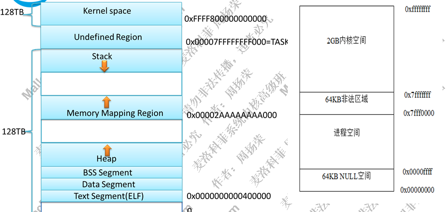
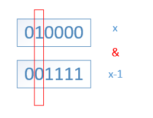
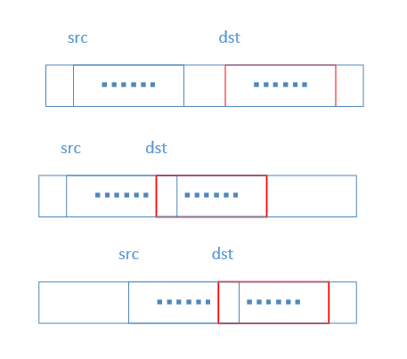

# 空指针
```cpp
// C
#define NULL (void*)0

// C++
#define NULL 0
```

# 格式字符串
%Z: ANSI
%wZ: Unicode
%2x: 

# 执行程序
* Console程序: 最先执行的是`mainCRTStartup`函数, 然后`main`. `mainCRTStartup`会用`CRTInit`完成C库, C的初始化函数, C++库, C++的初始化函数的初始化工作.
* 有windows界面的程序: `WinMainCRTStartup` -> `WinMain`
* 在`main`执行前执行自定义代码:
    * gcc: 使用`attribute`关键字, 声明 `constructor`和`destructor`函数: `__attribute((constructor)) void before() {}`
    * VC: 如下定义`.CRT$XIU`段, 链接器就会形成日下的C初始化函数表：

       [__xi_a, ..., before1(xiu), ..., __xi_z]

       以及C++初始化函数表：

       [__xc_a, ..., before2(xcu), ..., __xc_z]
        ```cpp
        void before_main () {}
        typedef void func();
        #pragma data_seg(".CRT$XIU")
        static func *before[] = { before_main };
        #pragma data_seg()
        ```
    * C++: 全局对象的初始化函数会在`main`前执行. 下面的`g_iValue`赋值也会先执行, 故而`func`先于`main`执行.
        ```cpp
        A a;
        int g_iValue = func();
        ```

# 数据长度(32位及64位系统)
|数据类型或数据|长度(字节)|
|-|-|
|char|1|
|short|2|
|long|4或8|
|int|4|
|float|4|
|double|8|
|double*|4或8|
|bool|1|
|"str"|4|
|100i64|8|

# 数据定义
* `const char *str = "abc";` `str`指向常量，`str`是变量
* `char const *str = "abc";` `str`是常量，相当于`char str[3] = "abc"`

# 对齐
结构体成员所在地址需是该成员大小的整数倍. 下面结构体大小: 16, 1 + 1 + 2(补齐给i) + 4 + 8
```c
struct a {
    char c1;
    char c2;
    long i;
    double f;
}
```
栈对齐: x86(4), x64(16, 入栈8字节).
如下表示按一字节对齐(如网络协议, 需要让总数据量较少, 以提高报文传播速度).
```c
#pragma pack(1)
``` 

# 变量存储位置
* 全局变量: 静态区(`.data`存已初始化变量, `.bss`存未初始化变量). 用了`static`关键字声明的变量不可被其它文件通过`extern`导入.
* 在函数中定义的局部变量: 
    * `char s1[] = "123";` `s1`和"123"都存在栈上, 因而`s1`的值将是栈上地址(指向"123"); 
    * `char *s2 = "123";` "123"存在`.rdata`中;
    * `static int c = 10;` 作用域为函数内, 类似于闭包中的变量(会在函数执行完后仍保留); 存于`.data`
* 局部变量的地址不可被返回(编译不通过)

```c
// 存储位置, 作用域, 生命周期
int a = 1;  // .data节, 整个项目, 程序执行期间
char *p1; // .bss节, 整个项目, 程序执行期间
static int x = 10; // .data节, 本文件, 程序执行期间
int main(void) 
{ 
    int b = 0; // 栈, main函数, main函数执行期间
    char s1[] = "123"; // 栈, main函数, main函数执行期间(栈上存了"123\0")
    char *p2; // 栈, main函数, main函数执行期间
    char *s2 = "123"; // 栈, main函数, main函数执行期间("123\0"存于.rdata节, s2指向之)
    static int c =10; // .data节, main函数, 程序执行期间
    p1 = (char *)malloc(128); 
    p2 = (char *)malloc(256); 
    free(p1); 
    free(p2); 
    return 0; 
} 
```

# 内存布局
* x86为32位寻址, 因此寻址空间上限为4GB, 也可通过PAE(Physical address extension)扩到36位(64GB)
* x64理论最大寻址2^64. Windows支持44位(16TB). Linux则48位(256TB)
* 栈大小: 
    *Windows: 应用栈默认1M(可用编译指令`/stack`指定). 内核栈: 12K(x86), 24K(x64)
    * Linux: 应用栈10M(`ulimit -s`查看或设置). 内核栈4K或8K

        
* 其他
    * `int a[1024*1024*1024] = {1};` 这样初始化数组会导致`.data`节大小为4G.

# 位运算
* 算术右移用符号位填充, 逻辑右移用0填充. 
* -1为二进制全1; 有符号数最大值为01111..., 最小值为10000...
```c
(char)(127<<1)+1    // -1
(char)(-1>>1)+1   // 0
1<<2+3  // 32
(15&240)+((2^100)%7)    // 2 (第二项: (2 * (1 + 7) ^ 33) % 7)
(char)(-128 * -1)   // -128 (0b10000000)
1^2^4^5^6^...^1024  // 1027 (1^2^3^4^5^6^...^1024)
0x12345678 | ~0xFFFEFFFF    // 0x12355678
```

# 函数传参
传值, 传指针, 传引用

```c
// x86

void fun(char c[]) 
{ 
    printf("%d\n" , sizeof(c));     // c是指针
}
void fun2(char &c) // 传引用, 就是实参本身
{ 
    printf("%d\n" , sizeof(c)); 
}
void fun3(char(&c)[9])  // 传数组引用, 好处是可及早在编译阶段发现下标溢出错误, 即调用fun3时传给它的数组大小若大于9则会出错
{ 
    printf("%d\n" , sizeof(c)); 
} 

void f(char *p);
void f1(char **p);
void f2(char *&p);  // 指针的引用
int main() 
{   
    int a = 0;
    int *p = &a; // p是实参
    f(p);   // 传的是a的地址, 因而可改变a的值
    char c[] = "12345678"; 
    printf("%d\n" , sizeof(c)); // 9
    fun(c); // 4
    fun2(*c); // 1(*c即c[0])
    fun3(c); // 9
    return 0; 
}
```

## 调用约定
* __stdcall: 参数从右往左入栈, 由被调用函数负责栈平衡(如ret 8, 意即esp加8)
* __cdecl: 参数从右往左入栈, 由调用者负责栈平衡(可支持变参函数)(如add esp, 8)
* __fastcall: 前二参数放入ecx, edx(x64则是rcx, rdx, r8, r9), 剩余参数从右往左入栈, 由被调用函数负责栈平衡

# 内存分配
```cpp
// C
char *p = (char *) malloc(1024);
if (p == NULL) return ;
memset(p, 0, 1024); // 用以清空潜在的恶意代码
free(p);
p = NULL;

// C++
char *p = new char[1024];
delete []p;

// 内核
char *p = (char *) kmalloc(1024);
kfree(p);
```

# 问题代码
```c
void GetMemory(char *p) 
{
    p = (char *)malloc(100);
} 
void Test(char *s) 
{ 
    char *str = NULL; 
    GetMemory(str); 
    strcpy(str, s); 
    printf(str); 
}

// 改进后
void GetMemory(char **p) 
{
    *p = (char *)malloc(100);
} 
void Test(char *s) 
{ 
    char *str = NULL; 
    GetMemory(&str); 
    strcpy(str, s); 
    printf("%s", str); 
    free(str);
}
```
* 问题
    * `GetMemory`是传值, 因而str的值不会改变, 因而`strcpy`会把值拷贝给NULL地址, 会崩溃. 
    * `GetMemory`还是会malloc一段内存, 之后没有free, 有内存泄漏. 
    * `strcpy`会有堆溢出.
    * `printf(str)`有格式化字符串漏洞.


```cpp
#include <stdio.h>
int main(int argc,char *argv[])
{
    char x,y,z;
    int i;
    int a[16];
    for(i=0;i<=16;i++)
    {
          a[i]=0;
         printf("\n");
   }
   return 0;
}
```
# 编程
* 参数检查
    * 指针是否为NULL
    * 参数中缓存长度是否在合理范围内
    * 用C++中的RTTI对参数类型进行检查
* 边界
    * 应考虑的特征：第一个/最后一个, 开始/完成, 空/满, 最慢/最快, 相邻/最远, 最小值/最大值, 超过/在内, 最短/最长, 最早/最迟, 最高/最低. 
* 出错
    * 类型
        * 文件打开失败
        * 分配内存返回NULL
        * 等等
    * 处理
        * if/goto
        * __try/__except
            * `__except(<过滤器表达式>)`:
            ```cpp
            __try {

            } __except(MyFilter(GetExceptionCode(), GetExceptionInformation())) {

            }

            int MyFilter(unsigned int code, struct _EXCEPTION_POINTERS* ep) {
                DbgPrint("code: %u", code);
                ep->ExceptionRecord->ExceptionAddress;
                return 1;
            }
            ```
            * 在__except的块中, 可以使用`GetExceptionCode`宏得到异常代码, 但不能使用`GetExceptionInformation`, 因为它指向的信息通常位于堆栈上, 并在控件传输到异常处理程序时被销毁. 
* 宏
```cpp
// 把宏参数拼接到字符串中: 
#define WARN(msg) printf("warning: " #msg "\n")

// 把宏参数拼接到另一个c语言token
#define COMMAND(name) cmd_##name // 如, COMMAND(ls)扩展为 cmd_ls

```

# 编码经验教训
* 内存, 指针, 字符串
    * 初始化时清零是好习惯(`memset`, `RtlZeroMemory`), 否则字符串可能不结束, 这样可能导致溢出. 
    * 涉及指针运算时, 比如`ptr->item`, `*ptr`, 要判断ptr是不是有效地址. 可以用__try__except捕获访问地址异常. 
    * 在使用系统的未导出结构体时, 如果如果只需要用到其中某个字段, 可以自定义一个结构体类型, 把其他字段笼统合为一个buffer. 
        ```cpp
        typedef struct _KPROCESS {
            BYTE NotUsed1[0x30];
            LIST_ENTRY ThreadListHead;
            BYTE NotUsed2[0x400 - 0x40];
        } KPROCESS, *PKPROCESS;

        ((PKPROCESS) ptr)->ThreadListHead;
        
        ```
    * 在内核编程中, 传参基本都是引用传递(即参数类型为指针类型)
* 数组
* 链表
    * 使用一个不存数据的头部, 可以少考虑很多事. 
    * 在fd和fd->next间插入节点nd: 
        ```cpp
            // 错误做法
            fd->next = nd;
            nd->next = fd->next;

            // 正确做法是交换上面两个表达式的顺序
        ```
* 同步, 异步, 互斥
    * 获取的资源要确保被释放
        * 注意goto, break, __try__except会不会导致释放步骤被跳过. 

# 算法
* 程序 = 算法(包括数据结构) + api调用 + "hello world" + 字符串处理 + 内存管理
* 时间复杂度
    * O(log n): 一个折半查找
    * O(n): 一个循环
    * O(n log n): 一个循环套一个折半
    * O(n^2): 嵌套循环
    * O(2^n): 
* 两个指针跑步法
    * 例子
        * 计算一个链表的中间节点
        * 判断单向链表是否有循环

## 例题
* 统计整数x的二进制形式中1的个数
    * 思路: 每次`x = x & (x - 1)` 可将x中一个1消去.

        

    * 代码
        ```c
        int i = 0;
        while (x != 0) {
            x &= (x-1);
            i ++;
        }
        ```
* 内存拷贝
    * 思路: 如果dst位置在src区域中, 则要从src的结尾开始逐字节拷到dst(也是末尾开始)

        

* 数值交换
    * 异或法
        ```cpp
        a = a ^ b;
        a = a ^ b;
        b = a ^ b;
        ```

* 判断系统是低位还是高位优先
    ```cpp
    int num = 1;
    char *p = (char *) &num;    // 若值是1, 则为低位优先
    ```

* 改变整数存储顺序
    ```cpp
    unsigned int num = 0x12345678;
    while (num > 0) {
        converted_num = (converted_num << 8) + (char) num;
        num >>= 8;
    }
    ```

* 字符串逆置
    1. 得到首尾字符位置, 分别赋予两个指针变量p, q
    2. p向后移动, q向前移动, 交换\*p和\*q字符

* 句子逆置("how are you ?" -> "? you are how")
    1. 将字符串逆置
    2. 将每个单词逆置

* 旋转字符串("hello"旋转两个字符: "llohe")
    1. 先把"he" "llo"逆置
    2. 再把字符串逆置