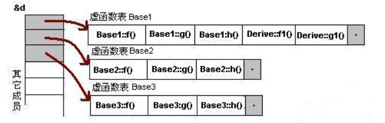

# 标准
* 参考: (ax3l/CXXdefaults.md)[https://gist.github.com/ax3l/53db9fa8a4f4c21ecc5c4100c0d93c94]
* `__STDC_VERSION__`常量与C标准的对应关系: 
    * undefined: earlier
    * 199409L: C95
    * 199901L: C99
    * 201112L: C11
    * 201710L: C18
    * TBD: C23
* `__cplusplus`常量与C++标准的对应关系: 
    * 199711L: C++98
    * 201103L: C++11
    * 201402L: C++14
    * 201703L: C++17
    * 202002L: C++20
    * TBD: C++23
* 查看当前编译器使用的默认C标准: 
    * gcc: `echo | gcc -E -dM -x c - | grep __STDC_VERSION__`
* 查看当前编译器使用的默认C++标准: 
    * g++: `echo | g++ -E -dM -x c++ - | grep __cplusplus` (gcc也可以)
# C语言
* 空指针
```cpp
// C
#define NULL (void*)0

// C++
#define NULL 0
```

## 格式字符串
* `%e, %E`: 以指数形式打印单双精度实数. 
* `%Z`: ANSI
* `%wZ`: Unicode
* `%zx`: 64位16进制
* `%zd`或`%I64d`: 64位10进制 
* `%u`: 无符号整数
* `%lu`: unsigned long, DWORD
* `%llu`: unsigned long long, QWORD
* `%hu`: unsigned short
* `%hhu`: unsigned char
* `%s`
    * `%ls`: 宽字符串
    * `%hs`: 窄字符串
    * `%10s`: 输出的字符串占10列. 不够则左边补空格. 
    * `%-10s`: 输出的字符串占10列. 不够则右边补空格. 
    * `%010s`: 输出的字符串占10列. 不够则左边补字符`0`. 
* `scanf("%[^\n]%*c", str);`
    * 可用于代替`gets`, 获取输入的完整字符串(因直接`scanf("%s", str)`会在遇到空字符就中断)
    * `%[^\n]`: 
    * `%*c`: 读入一个字符到缓冲区, 但是不向任何地方输入. 
        * 例如, `sscanf(buffer, "%*d %c", c1);` 会把buffer中第一个整数匹配到, 但是没赋值给任何变量; 把接下来匹配到的字符赋给c1. 

## 数据长度(32位及64位系统)

|数据类型或数据|长度(字节)|
|-|-|
|char|1|
|short|2|
|long|4或8|
|int|4|
|float|4|
|double|8|
|double*|4或8|
|bool|1|
|"str"|4|
|100i64|8|

* gcc编译器的数据类型长度
    
    |数据类型|长度(32位系统)|长度(64位系统)|
    |-|-|-|
    |char|1|1|
    |short|2|2|
    |int|4|4|
    |float|4|4|
    |double|8|8|
    |long|4|8|
    |long long|8|8|
    |long double|12|16|
    |complex long double|16|32|

## 数据定义
* `const char *str = "abc";` `str`指向常量, `str`是变量
* `char const *str = "abc";` `str`是常量, 相当于`char str[3] = "abc"`
* ` int (*ptr)(int, int);` 定义函数指针变量. 

## 结构体
* 对齐
    * 结构体成员所在地址需是该成员大小的整数倍. 下面结构体大小: 16, 1 + 1 + 2(补齐给i) + 4 + 8
        
        ```cpp
        struct a {
            char c1;
            char c2;
            long i;
            double f;
        }
        ```

    * 栈对齐: x86(4), x64(16, 入栈8字节).
    * 如下表示按一字节对齐(如网络协议, 需要让总数据量较少, 以提高报文传播速度).
        
        ```cpp
        // push和pop之间的代码保持1字节对齐; pop以后就按原来的字节对齐
        #pragma pack(push)
        #pragma pack(1) // 这两行可直接写成: #pragma pack(push, 1)
        struct {...}
        #pragma pack(pop)
        ```

* 位域
    * 参考: https://blog.csdn.net/qq_33270521/article/details/85058248
        
        ```cpp
        typedef struct {
            int a:2;	// 最低位
            int b:2;
            int c:1;    // 最高位
        } test;
        
        int main(void) {
            test t;
            t.a = 1;
            t.b = 3;
            t.c = 1;
            printf("%d, %d, %d\n", a, b, c); // 1, -1, -1
            return 0;
        }
        ```

        * 因为最高位视为符号位, 所以打印b和c得到了负数. 

## 运行时存储
* 全局变量: 静态区(`.data`存已初始化变量, `.bss`存未初始化变量). 用了`static`关键字声明的变量不可被其它文件通过`extern`导入.
* 在函数中定义的局部变量: 
    * `char s1[] = "123";` `s1`和"123"都存在栈上, 因而`s1`的值将是栈上地址(指向"123"); 
    * `char *s2 = "123";` "123"存在`.rdata`中;
    * `static int c = 10;` 作用域为函数内, 类似于闭包中的变量(会在函数执行完后仍保留); 存于`.data`
* 局部变量的地址不可被返回(编译不通过)

    ```cpp
    // 存储位置, 作用域, 生命周期
    int a = 1;  // .data节, 整个项目, 程序执行期间
    char *p1; // .bss节, 整个项目, 程序执行期间
    static int x = 10; // .data节, 本文件, 程序执行期间
    int main(void) 
    { 
        int b = 0; // 栈, main函数, main函数执行期间
        char s1[] = "123"; // 栈, main函数, main函数执行期间(栈上存了"123\0")
        char *p2; // 栈, main函数, main函数执行期间
        char *s2 = "123"; // 栈, main函数, main函数执行期间("123\0"存于.rdata节, s2指向之)
        static int c = 10; // .data节, main函数, 程序执行期间
        p1 = (char *)malloc(128); 
        p2 = (char *)malloc(256); 
        free(p1); 
        free(p2); 
        return 0; 
    } 
    ```

* 内存布局
    * x86为32位寻址, 因此寻址空间上限为4GB, 也可通过`PAE`(Physical address extension)扩到36位(64GB)
    * x64理论最大寻址`2^64`. Windows支持44位(16TB). Linux则48位(256TB)
    * 栈大小: 
        * Windows: 应用栈默认1M(可用编译指令`/stack`指定). 内核栈: 12K(x86), 24K(x64)
        * Linux: 应用栈10M(`ulimit -s`查看或设置). 内核栈4K或8K

            
    * 其他
        * `int a[1024*1024*1024] = {1};` 这样初始化数组会导致`.data`节大小为4G.
* 内存分配

    ```cpp
    // C
    char *p = (char *) malloc(1024);
    if (p == NULL) return ;
    memset(p, 0, 1024); // 用以清空潜在的恶意代码
    free(p);
    p = NULL;

    // C++
    char *p = new char[1024];
    delete []p;

    // 内核
    char *p = (char *) kmalloc(1024);
    kfree(p);
    ```

## 算术运算
* 位运算
    * 算术右移用符号位填充, 逻辑右移用0填充. 
    * -1为二进制全1; 有符号数最大值为01111..., 最小值为10000...

        ```cpp
        (char)(127<<1)+1    // -1
        (char)(-1>>1)+1   // 0
        1<<2+3  // 32
        (15&240)+((2^100)%7)    // 2 (第二项: (2 * (1 + 7) ^ 33) % 7)
        (char)(-128 * -1)   // -128 (0b10000000)
        1^2^4^5^6^...^1024  // 1027 (1^2^3^4^5^6^...^1024)
        0x12345678 | ~0xFFFEFFFF    // 0x12355678
        ```

## 函数
* 函数传参
    * 传值, 传指针, 传引用
        * 注: C语言没有引用传递, 这个是C++的概念. 故在C源码文件中如下`func2`的定义不通过. 

    ```cpp
    // x86

    void fun(char c[]) 
    { 
        printf("%d\n" , sizeof(c));     // c是指针
    }
    void fun2(char &c) // 传引用, 就是实参本身
    { 
        printf("%d\n" , sizeof(c)); 
    }
    void fun3(char(&c)[9])  // 传数组引用, 好处是可及早在编译阶段发现下标溢出错误, 即调用fun3时传给它的数组大小若大于9则会出错
    { 
        printf("%d\n" , sizeof(c)); 
    } 

    void f(char *p);
    void f1(char **p);
    void f2(char *&p);  // 指针的引用
    int main() 
    {   
        int a = 0;
        int *p = &a; // p是实参
        f(p);   // 传的是a的地址, 因而可改变a的值
        char c[] = "12345678"; 
        printf("%d\n" , sizeof(c)); // 9
        fun(c); // 4
        fun2(*c); // 1(*c即c[0])
        fun3(c); // 9
        return 0; 
    }
    ```

* 调用约定
    * 参考: https://en.wikipedia.org/wiki/X86_calling_conventions
    * `__stdcall`: 参数从右往左入栈, 由被调用函数负责栈平衡(如ret 8, 意即esp加8)
    * `__cdecl`: 参数从右往左入栈, 由调用者负责栈平衡(可支持变参函数)(如add esp, 8)
    * `__fastcall`: 前二参数放入ecx, edx(x64则是rcx, rdx, r8, r9), 剩余参数从右往左入栈, 由被调用函数负责栈平衡

* 不定长参数

    ```cpp
    void func(int var1, ...) {
        va_list vl;  
        va_start(vl, var1); // 使vl指向可选参数列表的第一个参数. var1是可选参数列表前的一个指针
        va_arg(vl, type); // 返回参数列表指针指向的参数, 类型为type, 并使vl指向下一个参数. 
        va_end(vl); // 清空参数列表, 并置参数指针vl为无效指针
    }
    ```

* 常用标准函数
    * 拷贝函数
        * `strcpy_s(dst, len, src)`: `len`的长度需为`strlen(src) + 1`. 如果用`strlen(src)`, 则`src`的第一个字符拷贝不到(对应位置是0)

## 错误/异常
* 类型
    * 文件打开失败
    * 分配内存返回NULL
    * 等等
* 处理
    * if/goto
    * __try/__except: 这个是windows独有的异常处理模型, 即结构化异常处理(SEH). 
        * `__except(<过滤器表达式>)`:
        ```cpp
        __try {

        } __except(MyFilter(GetExceptionCode(), GetExceptionInformation())) {

        }

        int MyFilter(unsigned int code, struct _EXCEPTION_POINTERS* ep) {
            DbgPrint("code: %u", code);
            ep->ExceptionRecord->ExceptionAddress;
            return 1;
        }
        ```
        * 在__except的块中, 可以使用`GetExceptionCode`宏得到异常代码, 但不能使用`GetExceptionInformation`, 因为它指向的信息通常位于堆栈上, 并在控件传输到异常处理程序时被销毁. 

## 宏
```cpp
    // 把宏参数拼接到字符串中: 
    #define WARN(msg) printf("warning: " #msg "\n")

    // 把宏参数拼接到另一个c语言token
    #define COMMAND(name) cmd_##name // 如, COMMAND(ls)扩展为 cmd_ls

    // 单字符化操作符#@
    #define simplech(b) #@b // 如, simplech(#) 扩展成 '#'

    // 可变参数宏(把...原封不动转到__VA_ARGS__位置)
    #define DEBUG(...) printf(__VA_ARGS__)
    // 用 ##__VA_ARGS__ , 则可以在没有可选参数时, 把多余的逗号去掉. 
    #define DEBUG2(format, ...) printf(format, ##__VA_ARGS__)

    #define A 1
    #undef A

    // 可在编译时打印信息
    #ifndef A
    #error A is not defined 
    #warning A is not defined 
    #endif

    // 可以判断条件
    #if ((defined A) && (!defined B))
    ...
    #elif
    ...
    #endif

    
    // 预编译选项
    #pragma execution_character_set("utf-8") // 告诉msvc编译器, 当前文件以utf8编码编译. 
    #pragma message("asdf") // 会在编译时打印字符串的内容(在确认`ifdef`或`ifndef`宏的代码块有没有被编译时有用处)
```

* 预定义宏
    |宏|描述|
    |-|-|
    |`__FILE__`|	这会在程序编译时包含当前文件名. |
    |`__LINE__`|	这会在程序编译时包含当前行号. |
    |`__FUNCTION__`|	这会在程序编译时包含当前函数名. |
    |`__DATE__`|	这会包含一个形式为 month/day/year 的字符串, 它表示把源文件转换为目标代码的日期. |
    |`__TIME__`|	这会包含一个形式为 hour:minute:second 的字符串, 它表示程序被编译的时间. |
    |`__builtin_return_address(LEVEL)`|	gcc支持, `LEVEL`为0时获取当前函数的返回地址. |


## 执行程序
* Console程序: 最先执行的是`mainCRTStartup`函数, 然后`main`. `mainCRTStartup`会用`CRTInit`完成C库, C的初始化函数, C++库, C++的初始化函数的初始化工作.
* 有Windows界面的程序: `WinMainCRTStartup` -> `WinMain`
* 在`main`执行前执行自定义代码:
    * gcc: 使用`attribute`关键字, 声明 `constructor`和`destructor`函数: `__attribute__((constructor)) void before() {}`
    * VC: 如下定义`.CRT$XIU`段, 链接器就会形成: 
        * C初始化函数表: 
            > `[__xi_a, ..., before1(xiu), ..., __xi_z]`
        * 以及C++初始化函数表: 
            > `[__xc_a, ..., before2(xcu), ..., __xc_z]`

        ```cpp
            void before_main () {}
            typedef void func();
            #pragma data_seg(".CRT$XIU")
            static func *before[] = { before_main };
            #pragma data_seg()
        ```
    * C++: 全局对象的初始化函数会在`main`前执行. 下面的`g_iValue`赋值也会先执行, 故而`func`先于`main`执行.
        ```cpp
        A a;
        int g_iValue = func();
        ```

## GCC扩展
* 参考
    * [C语言 GCC扩展特性](https://www.jianshu.com/p/755089d1304e)
* 注意, **源文件后缀必须是c, 不能是cpp**, 否则编译会报错. 

## 问题代码
* 
    ```cpp
        void GetMemory(char *p) 
        {
            p = (char *)malloc(100);
        } 
        void Test(char *s) 
        { 
            char *str = NULL; 
            GetMemory(str); 
            strcpy(str, s); 
            printf(str); 
        }

        // 改进后
        void GetMemory(char **p) 
        {
            *p = (char *)malloc(100);
        } 
        void Test(char *s) 
        { 
            char *str = NULL; 
            GetMemory(&str); 
            strcpy(str, s); 
            printf("%s", str); 
            free(str);
        }
    ```
        
    * 问题
        * `GetMemory`是传值, 因而`Test`函数中`str`的值不会改变, 因而`strcpy`会把值拷贝给NULL地址, 导致崩溃. 
        * `GetMemory`还是会malloc一段内存, 之后没有free, 有内存泄漏. 
        * `strcpy`会有堆溢出.
        * `printf(str)`有格式化字符串漏洞.
* 
    ```cpp
        #include <stdio.h>
        int main(int argc,char *argv[])
        {
            char x, y, z;
            int i;
            int a[16];
            for(i = 0; i <= 16; i++) {
                a[i] = 0;
                printf("\n");
            }
            return 0;
        }
    ```

## 编码经验
* 参数检查
    * 指针是否为NULL
    * 参数中缓存长度是否在合理范围内
    * 用C++中的RTTI对参数类型进行检查
* 边界
    * 应考虑的特征: 第一个/最后一个, 开始/完成, 空/满, 最慢/最快, 相邻/最远, 最小值/最大值, 超过/在内, 最短/最长, 最早/最迟, 最高/最低. 
    * 在循环体中使用`continue`前, 切记**检查是否有记得修改循环判断条件值, 不然可能陷入死循环**. 
* 内存, 指针, 字符串
    * 初始化时清零是好习惯(`memset`, `RtlZeroMemory`), 否则字符串可能不结束, 这样可能导致溢出. 
    * 涉及指针运算时, 比如`ptr->item`, `*ptr`, 要判断ptr是不是有效地址. 可以用__try__except捕获访问地址异常. 
    * 在使用系统的未导出结构体时, 如果如果只需要用到其中某个字段, 可以自定义一个结构体类型, 把其他字段笼统合为一个buffer. 
        ```cpp
            typedef struct _KPROCESS {
                BYTE NotUsed1[0x30];
                LIST_ENTRY ThreadListHead;
                BYTE NotUsed2[0x400 - 0x40];
            } KPROCESS, *PKPROCESS;

            ((PKPROCESS) ptr)->ThreadListHead;
            
        ```
    * 在内核编程中, 传参基本都是引用传递(即参数类型为指针类型)
* 数组
* 链表
    * 使用一个不存数据的头部, 可以少考虑很多事. 
    * 在fd和fd->next间插入节点nd: 
        ```cpp
            // 错误做法
            fd->next = nd;
            nd->next = fd->next;

            // 正确做法是交换上面两个表达式的顺序
        ```
* 同步, 异步, 互斥
    * 获取的资源要确保被释放
        * 要留意goto, break, __try__except会不会导致释放步骤被跳过. 

## 奇技淫巧
* 有时为了在捕获到错误时终止一段代码, 会用到大量if-else或goto语句. 可以如下用do-while: 
    ```cpp
        if (a) goto NEXT;
        ...
        if (b) goto NEXT;
        ...
        NEXT: ;

        // 替换写法
        do {
            if (a) break;
            ...
            if (b) break;
        } while (FALSE);
    ```

* 复合语句
```cpp
    char *a = ({
        unsigned int *p = __builtin_alloca(16);
        p[0] = 0x12345678;
        (char *)p; // 返回值
    });
```

* 结构体赋值
```cpp
    struct S1 *s;
    s = malloc(sizeof(s));
    *s = (struct S1) { // 实质是强制类型, 值传递
        .a = 1,
        .b = 2
    };
```

* 编译时打印宏参数的值
    ```cpp
        #define __PRINT_MACRO(x) #x
        #define PRINT_MACRO(x) #x"="__PRINT_MACRO(x)
        #pragma message(PRINT_MACRO(MYOPT))
    ```

* `typeof`
    * `typeof(func1)* f`: 可将指针`f`转为函数`func1`类型的函数指针.     

# C++
## Cling
* 一个基于LLVM的C++解释器.
* 下载已编译的工程: [https://root.cern.ch/download/cling/](https://root.cern.ch/download/cling/). 之后将其bin目录添加到PATH环境变量.
* 使用:
  * 直接运行cling.
  * 执行C++代码: `cling '#include <stdio.h>' 'printf("Hello World!\n")'`
  * 用Cling运行C++文件: `cat test.cpp | cling`
* 可在Jupyter Lab中使用, 需先安装kernel:
  ```sh
    cd share/cling/Jupyter/kernel/
    pip3 install -e .
    jupyter-kernelspec install [--user] cling-cpp17
  ```
* `xeus-cling`: 安装该工具将直接在conda环境中安装cling以及jupyter内核. jupyter中支持补全以及文档查询. 
    * 安装: `mamba install xeus-cling -c conda-forge`
## 数据类型
* 引用
    * `int& r = i;` r 是一个初始化为 i 的整型引用
    * 与指针的不同点
        * 不存在空引用. 
        * 必须在创建时被初始化. 
        * 一旦初始化为一个对象, 就不能指向另一个对象. 
* 类型转换
    * `static_cast <type-id> (expression)`: 主要用于非多态类型之间的转换. 
    * `dynamic_cast <type-id> (expression)`: `type-id`必须是类的指针, 类的引用或者是`void *`. `expression`的类型要与`type-id`对应. 
    * `const_cast <type-id> (expression)`: 用来将类型的`const`, `volatile`和`__unaligned`属性移除. 
    * `reinterpret_cast <type-id> (expression)`: 允许将任何指针类型转换为其它的指针类型. 

## 关键字
* `const`: 常量声明. 
    ```cpp
    int me;
    const int* p1 = &me; // p1可变, *p1不可变
    int* const p2 = &me; // p2不可变, *p2可变
    const int* const p3 = &me; // p2不可变, *p2也不可变
    ```
* `explicit`: 
    * 防止类构造函数的隐式自动转换. 
    * 其只对只有一个参数的类构造函数有效. 
        
        ```cpp
        MyClass c1(1); // 
        MyClass c1 = 1; // 隐式转换, 如果构造函数用了explicit声明, 则这句不会成功. 
        ```

* `implicit`: 隐式(默认). 

## 控制流
* range-for
    ```cpp
        vector<int> vec(10, 0);
        for (auto v : vec) {
            v;
        }
    ```

## 命名空间
* 示例代码
    ```cpp
    namespace namespace_name {
        // 代码声明
    }

    // 调用命名空间的函数或变量: 
    name::code;
    ```
* using指令
    * `using namespace std;` 可以在使用std命名空间的函数时不加命名空间名称. 
    * `using std::cout;` 只打算使用 std 命名空间中的 cout 部分时, 可以这么做. 
* 可以嵌套
    ```cpp
    namespace namespace_name1 {
        // 代码声明
        namespace namespace_name2 {
            // 代码声明
        }
    }

    using namespace namespace_name1::namespace_name2;
    ```

## 面向对象
* 示例
    ```cpp
    class C : public F {
        public: // 类的外部也可以访问公共成员
            int a;
            static int s; // 静态成员, 在所有对象中共享. 创建第一个对象时被初始化为0. 
            int func(); // 称为类成员函数, 可访问对象中的所有成员
            int func(int v1); // 函数重载, 各同名函数的参数列表不同
            static void sFunc(); // 静态成员函数
            C(int i); // 构造函数
            C(const C &obj); // 拷贝构造函数, 使用同类对象进行初始化
            ~C(); // 析构函数

            friend void frndFunc(C c); // 友元函数, 其不是成员函数
            friend class B; // B的所有成员函数都是类C的友元函数, 在B中可以访问C的所有成员

            virtual void vfunc();
            virtual void vfunc2() = 0; // 纯虚函数, 也叫抽象函数, 在基类中定义, 没有函数体. 

            // 运算符重载
            C operator+(const C &c2) {
                return this->a + c2.a;
            }

            // C++11特性: 函数删除声明
            C(const C &) = delete;
            C &operator=(const C &) = delete;
        
        protected: // 受保护成员在派生类中可以访问
        
        private: // 私有成员只有类和友元函数可以访问私有成员
    }

    int C::s; // 对于静态成员, 必须在类的声明外再定义一次. 否则在编译时可能出现`Undefined Reference`的错误

    void C::sFunc() {
        s; // 静态成员函数可以直接访问静态成员
    }

    // 定义构造函数
    C::C(int i) : F(i) { // F类的构造函数会先被调用
        a = i;
        this->a = i; // this指针指向本对象
    }

    // 使用初始化列表来初始化字段
    C::C(int i, int j) : a(i), b(j) { // 会自动把成员a的值赋值为i, b赋值为j

    }

    // 拷贝构造函数
    C::C(const C &obj) {
        a = obj.a;
    }

    int func() {return 0;}

    // frndFunc函数是C类的友元, 可以访问C类中任何成员
    void frndFunc(C c) {
        c.a;    
    }

    void main() {
        C c(1); // 栈上分配
        C::s++; // 访问静态成员
        auto pC = new C(1); // 堆中分配

    }
    ```
* 符号查找顺序
    1. 若有限定名(`myNameSpace::`), 则在myNameSpace中找. 
    2. 函数局部名字空间. 
    3. 类名字空间. 
    4. 向上至所有基类的名字空间. 
    5. 当前名字空间. 
    6. 递归向外至所有外层名字空间. 

* 私有成员和受保护成员不能直接用`.`运算符访问. 

* 继承
    * 三种继承方式
        * `public` 继承: 基类 `public` 成员, `protected` 成员, private 成员的访问属性在派生类中分别变成: `public`, `protected`, `private`
        * `protected` 继承: 基类 `public` 成员, `protected` 成员, `private` 成员的访问属性在派生类中分别变成: `protected`, `protected`, `private`
        * `private` 继承: 基类 `public` 成员, `protected` 成员, `private` 成员的访问属性在派生类中分别变成: `private`, `private`, `private`
        * 写法: `class C: public A {}` 即为`public`继承
    * 多继承
        * `class <派生类名>:<继承方式1><基类名1>,<继承方式2><基类名2>,… {}`

* 函数
    * 成员函数不能像C函数那样作为回调函数使用, 因为成员函数隐含一个this指针作为参数. 比如, `MyClass::func`会被转为`void func(MyClass *this)`. 
    
* 多态
    * 类型
        * 静态多态性: 函数重载, 模板. 
        * 动态多态性: 虚函数. 
    * 重载
        * 可重载运算符

            |类型|运算符|
            |-|-|
            |双目算术运算符|	+ (加), -(减), *(乘), /(除), % (取模) |
            |关系运算符|	==(等于), != (不等于), < (小于), > (大于), <=(小于等于), >=(大于等于) |
            |逻辑运算符|	||(逻辑或), &&(逻辑与), !(逻辑非) |
            |单目运算符|	+ (正), -(负), *(指针), &(取地址) |
            |自增自减运算符|	++(自增), --(自减) |
            |位运算符|	\| (按位或), & (按位与), ~(按位取反), ^(按位异或), << (左移), >> (右移)|
            |赋值运算符|	=, +=, -=, *=, /= , % = , &=, |=, ^=, <<=, >>= |
            |空间申请与释放|	new, delete, new[] , delete[]|
            |其他运算符|	()(函数调用), ->(成员访问), ,(逗号), [](下标) |
    * 虚函数
        * 当使用类的指针调用成员函数时, **普通函数由指针类型决定, 而虚函数由指针指向的实际类型决定.** 
        * 虚函数表
            * 整个类共有. 
            * 在对象最开始位置存一个指针vptr, 指向虚函数表. 
            * 创建时间: 类构造时. 
            * 父类的虚函数在子类的虚函数前面. 
            * 构造函数不能是虚函数, 因为在构造完成前vptr没有值. 
            * 析构函数可以是虚函数且推荐最好设置为虚函数. 
            * 执行子类构造函数之前一定会执行父类的构造函数; 执行子类的析构函数后, 一定会执行父类的析构函数. 
            
            

* C++接口(抽象类)
    * 如果**类中至少有一个函数被声明为纯虚函数**, 则这个类就是抽象类. 
    * 不能用于实例化. 需要继承并实现纯虚函数. 

* 单例类
    ```cpp
    class C {
        public: 
            static C* getInst() {
                if (_inst == nullptr) {
                    _inst = new C();
                }
                return _inst;
            }
        private: 
            C() {}
        static C _inst; // 单例
    }
    C* C::_inst = nullptr; // 注意要在类声明外再定义这个单例变量
    ```

* 动态内存
    * new运算符
        * 分配内存, 并创建对象(执行构造函数)
        * 返回的是对象类型的指针, 且无需进行类型转换. 
        * 内存分配失败时抛出`bac_alloc`异常, 不会返回`NULL`. 
    
    * 示例
        ```cpp
        double* pvalue  = NULL;
        pvalue  = new double;

        delete pvalue;

        C *c = new C(1); // 可以同时实例化成员

        // 动态分配数组
        char *pc = new char[20];
        delete [] pc;


        // 多维数组
        int **array;
        array = new int *[m];
        for( int i=0; i<m; i++ ) {
            array[i] = new int [n]  ;
        }
        //释放
        for( int i=0; i<m; i++ ) {
            delete [] array[i];
        }
        delete [] array;

        // 重载new运算符
        void * operator new(std::size_t size) throw(std::bad_alloc) {
            void *p;
            while ((p = ::malloc(size)) == 0) {
                std::new_handler nh = std::get_new_handler();
                if (nh) {
                    nh();
                } else {
                    throw std::bad_alloc();
                }
            }
            ...
            return p;
        }

        // placement new (定位new运算符), 让开发者指定需要使用的内存
        char *buf[128];
        int *p1 = new(buf) int[10];
        ```

## 文件和流
* `close`函数是fstream, ifstream 和 ofstream 对象的一个成员. 

    ```cpp
    char data[100] = "123";

    // 以写模式打开文件
    ofstream outfile;
    outfile.open("afile.dat");
    outfile << data << endl; // 向文件写入用户输入的数据
    outfile.close();

    // 以读模式打开文件
    ifstream infile; 
    infile.open("afile.dat"); 
    infile >> data; 

    // 定位到 fileObject 的第 n 个字节(假设是 ios::beg)
    fileObject.seekg( n );
    
    // 把文件的读指针从 fileObject 当前位置向后移 n 个字节
    fileObject.seekg( n, ios::cur );
    
    // 把文件的读指针从 fileObject 末尾往回移 n 个字节
    fileObject.seekg( n, ios::end );
    
    // 定位到 fileObject 的末尾
    fileObject.seekg( 0, ios::end );
    ```
    
## 异常处理

```cpp
    try {
        // 保护代码
        ...

        throw "Division by zero condition!"; // 抛出异常
    } catch ( ExceptionName e1 ) {
        // catch 块
    }

    struct MyException : public exception {
        const char * what () const throw () {
            return "C++ Exception";
        }
    };
```

* C++标准异常

    |异常|	描述|
    |-|-|
    |std::exception	| 该异常是所有标准 C++ 异常的父类. |
    |std::bad_alloc	| 该异常可以通过 new 抛出. |
    |std::bad_cast	| 该异常可以通过 dynamic_cast 抛出. |
    |std::bad_exception	| 这在处理 C++ 程序中无法预期的异常时非常有用. |
    |std::bad_typeid	| 该异常可以通过 typeid 抛出. |
    |std::logic_error	| 理论上可以通过读取代码来检测到的异常. |
    |std::domain_error	| 当使用了一个无效的数学域时, 会抛出该异常. |
    |std::invalid_argument	| 当使用了无效的参数时, 会抛出该异常. |
    |std::length_error	| 当创建了太长的 std::string 时, 会抛出该异常. |
    |std::out_of_range	| 该异常可以通过方法抛出, 例如 std::vector 和 std::bitset<>::operator[](). |
    |std::runtime_error	| 理论上不可以通过读取代码来检测到的异常. |
    |std::overflow_error	| 当发生数学上溢时, 会抛出该异常. |
    |std::range_error	| 当尝试存储超出范围的值时, 会抛出该异常. |
    |std::underflow_error	| 当发生数学下溢时, 会抛出该异常. |

## 信号处理
* 信号是由操作系统传给程序的中断. 
    ```cpp
    void signalHandler( int signum ) {
        cout << "Interrupt signal (" << signum << ") received.\n";
    
        // 清理并关闭
        // 终止程序  
    
        exit(signum);  
    }

    void main() {
        // 注册信号 SIGINT 和信号处理程序
        signal(SIGINT, signalHandler); 
        ...
        raise(SIGINT); // 生成信号
    }
    ```
* 可以被程序捕获的信号
    |信号|	描述|
    |-|-|
    |SIGABRT|	程序的异常终止, 如调用 abort. |
    |SIGFPE|	错误的算术运算, 比如除以零或导致溢出的操作. |
    |SIGILL|	检测非法指令. |
    |SIGINT|	程序终止(interrupt)信号. |
    |SIGSEGV|	非法访问内存. |
    |SIGTERM|	发送到程序的终止请求. |

## 模板
* 模板是泛型编程的基础. 
* 函数模板
    ```cpp
    template <typename T>
    inline T const& Max (T const& a, T const& b) { 
        return a < b ? b:a; 
    } 
    ```
* 类模板
    ```cpp
    template <class T>
    class Stack { 
    private: 
        vector<T> elems;     // 元素 
    
    public: 
        void push(T const&);  // 入栈
        void pop();               // 出栈
        T top() const;            // 返回栈顶元素
        bool empty() const {       // 如果为空则返回真. 
            return elems.empty(); 
        } 
    }; 
    
    template <class T>
    void Stack<T>::push (T const& elem) { 
        // 追加传入元素的副本
        elems.push_back(elem);    
    } 
    ```
### STL(标准模板库)
* 实现多种流行和常用的算法和数据结构, 如向量, 链表, 队列, 栈. 
    * 容器(Containers): 容器是用来管理某一类对象的集合. C++ 提供了各种不同类型的容器, 比如 deque, list, vector, map 等. 
        * 序列式容器
        * 关联式容器
            * 树形结构: 底层为平衡搜索树(红黑树). set, map, multiset, multimap. 
            * 哈希结构: 底层为哈希表, 哈希桶. unsorted_set, unsorted_map, unsorted_multiset, unsorted_multimap. 
    * 算法(Algorithms): 算法作用于容器. 它们提供了执行各种操作的方式, 包括对容器内容执行初始化, 排序, 搜索和转换等操作. 
    * 迭代器(iterators): 迭代器用于遍历对象集合的元素. 这些集合可能是容器, 也可能是容器的子集. 
* `std::vector`: 
    * 堆上分配. 内存连续, 可随机存取. 是对动态数组的封装. 
    * 示例: 
        ```cpp
        #include <vector>

        std::vector<int> vec; 
        std::vector<int> vec1(10, 0); // 10个元素都为0

        // 推入 5 个值到向量中
        for(int i = 0; i < 5; i++){
            vec.push_back(i);
        }

        vec.size();

        vec[i];

        // 使用迭代器 iterator 访问值
        std::vector<int>::iterator v = vec.begin();
        while( v != vec.end()) {
            cout << "value of v = " << *v << endl;
            v++;
        }

        // 排序
        #include <algorithm>
        sort(vec.begin(), vec.end(), [=](auto a, auto b) {
            return a < b;
        });
        ```
* `std::array`: 
    * 栈上分配. 
    * 是一个类模板, 其定义为: 
        ```cpp
        template <class T, size_t N>
        class array;
        ```
    * 示例: 定义和初始化, 操作. 
        ```cpp
        std::array <int, 10> arr = {1, 2};

        arr.fill(4); // 全部填充为4
        arr.size();
        arr[2];
        arr.at(2); // 超范围时抛出out_of_range异常
        ```

        * 注意: 定义数组时, 大小只能是常量. 
* `std::list`: 
    * 堆上分配. 
    * 其中每个元素都要包含一个指向下个元素的指针. 
* `std::map`
    * 内部是平衡二叉树
    * 默认值: 看元素类型
        * 整型: 0
        * `std::string`: ""
        * 结构体: 每个成员都赋予默认值(0或""等)

        ```cpp
        #include <map>

        struct myComp {
            bool operator() (const char *a, const char *b) {
                return std::strcmp(a, b) < 0;
            }
        }

        // 初始化
        std::map <std::string, int> myMap1;
        std::map <const char *, int, myComp> myMap2;
        std::map <int, std::string> myMap3 = {
            {1, "one"},
            {2, "two"},
        };

        myMap2["key1"] = 123;

        if (myMap2.find("key2") == myMap2.end()) ; // 成立则表示元素不存在
        if (myMap2.count("key2") == 0); // count函数返回1则键存在, 0则不存在
        ```
* `std::unordered_map`
    * 内部是哈希表. 
        ```cpp
        std::unordered_map <const char *, int, myHashKey, myComp> myMap;
        ```
* `std::string`
    * `string`类型参数: 最好传引用, 因为传值会拷贝内存. 写法是`void func(string& s) { s.c_str(); }`
    
    ```cpp
    #include <string>

    std::string s = "s";

    // 数字转字符串
    std::to_string(1234); 

    s = s.erase(1, 3); // 从第一个字符开始, 删除3个字符
    
    // 查找
    s.find(s1, 3); // 查找子串s1, 开始位置为3

    // stringstream
    #include <sstream>

    ```


## lambda表达式
* 参考: https://blog.csdn.net/u014711890/article/details/123441799
* `[]`标识一个Lambda表达式的开始, 这一部分是不可以忽略的. 函数对象参数只能使用到定义该Lambda表达式为止定义过的局部变量, 包括Lambda表达式所在类的成员变量. 函数参数有以下几种形式: 
    * 空: 代表不捕获Lambda表达式外的变量；
    * `&`: 代表以引用传递的方式捕获Lambda表达式外的变量；
    * `=`: 代表以值传递的方式捕获Lambda表达式外的变量, 即以const引用的方式传值；
    * `this`: 表示Lambda表达式可以使用Lambda表达式所在类的成员变量；
    * `a`或`=a`: 表示以值传递的方式传递变量a, 即`const int a`,在函数体内不可改变a的值；但是可以对Lambda表达式使用`mutable`修饰符修饰, 使得函数对象参数可以进行赋值, 但是该函数对象参数不是被修改为引用传递方式, 下面进行细说；
    * `&a`: 表示以引用传递的方式传递变量a, 在函数体内可以改变a的值；
    * `x, &y`: x为值传递方式, y为引用传值方式；
    * `=, &x, &y`: 除x, y为引用传递方式以外, 其他参数都为值传递方式进行传递；
    * `&, x, y`: 除x, y为值传递方式以外, 其他参数都为引用传递方式进行传递;
* lambda表达式会自动推断返回值类型. 
* 代码

    ```cpp
    int a = 0;
    auto f = [&] (string s) {
        cout << "Hello " << s << '\n';
        a++;
    };
    f();

    // lambda表达式作为参数
    void f(std::function<int<void>>& do_func);

    ```
* 注
    * 调试发现, 对非对象变量(如int变量), 要以值传递的形式捕获. 
    * 要将lambda转为C语言的函数指针, 则不能捕获表达式外变量. 

## 问题
* 编译时报错: 
    * `multiple definition of ...`, 即多重定义问题. 
        * 注意在头文件中使用namespace时, 不要在里头定义变量或函数, 只能声明. 
        * 如果是声明一个类的对象, 则在头文件中声明, 且声明为`static`变量. 

    * `undefined reference to 'vtable ...' `
        * 需要把声明的虚函数实现了. 
    
    * `无法解析的外部符号`
        * 在引用静态成员时出现此错误: 除了类内部声明, 在类外部应该对静态变量再定义一次. 

    * `C2712`   

