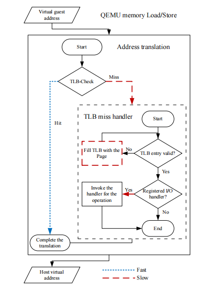

* 查看是否已开启`intel-vt`或`amd-v`: `grep flags /proc/cpuinfo|head -n1|grep -Eo '(vmx|svm)'`
* 添加内核模块: 
    > `modprobe kvm`
    > `modprobe kvm-intel`

# virtualbox
* 为防止安装系统时的意外错误, 需在配置中`system`处开启`UEFI`
* 挂载共享文件夹: `sudo mount -t vboxsf public_dir /mnt/shared `
* 启用嵌套VT-x/AMD-V
    * 如果这一项是灰色不可选的, 则需执行: `VBoxManage.exe modifyvm win7_x64 --nested-hw-virt on`
# vmware
* 合并vmdk
    * vmware-vdiskmanager.exe -r win7_x64.vmdk -t 0 win7_x64_1.vmdk
        * 第一个引号内为多个原vmdk文件所在路径+磁盘名称(去掉-s001之类).vmdk; 
        * 第二个引号内为生产单个文件的路径和名字。
* 共享文件夹
    * 在linux客户机里面执行: `sudo mount -t fuse.vmhgfs-fuse .host:/ /mnt/hgfs -o allow_other`, 之后可在`/mnt/hgfs`下看到共享目录. 
* 添加虚拟磁盘(新的vmdk镜像)(参考: [详解VMware虚拟机中添加新硬盘并挂载的方法](https://blog.csdn.net/weixin_50464560/article/details/115714884))
    * 添加之后, 在linux中通过`fdisk -l`可看到, 比如`/dev/sdb`
    * `fdisk /dev/sdb`: 使用fdisk进行格式化
    * `mkfs -t ext3 /dev/sdb`: 创建文件系统
    * 挂载: `sudo mount /dev/sdb my_dir`
* 网络
    * 使用桥接网卡后, 虚拟机并未得到路由器分配的地址: 
        * `编辑` -> `虚拟网络编辑器` -> `更改设置`, 找到桥接模式的网卡, 看`已桥接至(G)`的下拉列表中是否已选中正确的网卡. 
        * 如果物理机连了多个网络, 试一下把桥接的网卡之外的其它网卡禁用掉. 
* 磁盘扩容
    * 参考: https://blog.csdn.net/qq_34160841/article/details/113058756

* 内核调试
    * 修改vmx文件, 加上`debugStub.listen.guest64="TRUE"`
* 问题
    * `系统找不到指定文件`
        ```
            scsi0:0.fileName = "deleted_disk.vmdk"
            scsi0:0.present = "TRUE"
        ```
# cuckoo
* Locker文件: 
    1. 有的在behavior的generic的每个进程的summary中占不少空间(可接受), 如文件操作, 操作大量文件(如生成一堆名为'HOW TO DECRYPT FILE.txt'的文件)
    2. 有的会开启大量进程, 导致出现大量procmemory-regions节(能占到100万行); behavior的generic和processes节中项也很多(都能占到10万行)

# docker
## 知识点
* 文件默认在`/var/lib/docker`下
* 镜像可看成不包含系统内核(Linux内核)的操作系统. 
* 镜像是分层结构, 每一次`commit`操作后得到的新镜像都会比原镜像多一层.
* 快速示例: 以`aflpp_installed_pwndbg`为镜像, 启动一个容器, 名称为`zbh`, 映射端口`23946`和`12345`, 共享目录`/home/bohan/res/ubuntu_share/pwn_test/`(映射到容器的`/pwn_test`目录), 启动后运行`/sbin/init`. 
    ```sh
        docker run -it --name zbh --privileged=true -v /home/bohan/res/ubuntu_share/pwn_test/:/pwn_test -p 23946:23946 -p 12345:12345 aflpp_installed_pwndbg /sbin/init
    ```

## 常用命令
### 容器
* 列出所有容器: `docker ps -a --no-trunc`
* 打印docker容器信息: `docker inspect <容器id> <命令> <参数>`
    * 查看容器文件系统位置: `docker inspect --format='{{.GraphDriver.Data.MergedDir}}' <容器 ID>`
* 运行容器
    * `docker run <镜像名>`: 创建新容器并在其中运行一个命令. 
        * `--name <容器名>`
        * `-i`: 表示交互式操作
        * `-t`: 表示终端
        * `-v <宿主机目录>:<容器目录>`: 指定挂载目录. 
        * `-d`: 可使容器进入后台运行, 之后用`docker exec -it <容器id> /bin/bash`进入. 
        * `--privileged=true`: 赋予容器内进程以下权限/能力: 
            * 访问主机上所有设备的权限. 
            * 使用主机的所有内核功能. 
            * 使用主机上所有的文件系统. 
        * `--restart=always`: 重启docker时, 该容器同时重启. 
    * `docker start <容器名>`: 启动一个已经关闭的容器.
* 打印容器日志: `docker logs -f <容器id>`
* 停止容器: `docker stop <容器id>`
* 重启容器: `docker restart <容器id>`
* 删除容器: `docker rm -f <容器id>`
* 端口映射
    * 在run操作中添加参数, `-P`表示将所有容器端口映射到宿主机的随机端口, `-p [<宿主IP>:]<宿主端口>:<容器端口>`则是具体指定的映射. `docker port <容器id>`查看端口映射.
    * 运行后添加端口映射: `iptables -t nat -A  DOCKER -p tcp --dport <宿主机端口> -j DNAT --to-destination <容器IP>:<容器端口>`

    ```sh
        iptables -t nat -A PREROUTING -m tcp -p tcp --dport 23946 -j DNAT --to-destination 172.17.0.2:80
        iptables -t nat -A POSTROUTING -m tcp -p tcp --dport 80 -d 172.17.0.2 -j SNAT --to-source 192.168.0.104:23946
    ```
* 拷贝文件
    * 拷贝进容器: `docker cp <宿主机目录> <容器名>:<容器内目录>`. 也可从容器拷贝出到宿主机.
* 网络
    * 启动参数`--network`: 
        * `host`: 指定使用host模式, 和宿主机共享网络命名空间. 
        * `bridge`: 指定使用桥接模式(默认). 
        * `none`: 使用独立的网络命名空间. 
        * `container:<容器名或ID>`: 与另一个容器共享网络命名空间. 

### 镜像
* 列出镜像: `docker images`
* 将运行中的容器保存为新镜像: `docker commit <容器id> <镜像名>`(镜像名可以是原名, 直接替换原镜像)
* 查看镜像分层: `docker history <镜像名>`
* 删除镜像: `docker rmi <镜像id>`
* 重命名: `docker tag <镜像id> <新名>`
* Dockerfile构建镜像: 
    * 首先新建一个目录, 在其中新建文件`Dockerfile`, 写入内容如下(使用`centos`这个镜像为基础, 之后运行`yum`): 
        ```sh
            FROM centos # 指定原始镜像
            RUN yum install vim -y # `docker build`时运行bash命令 # RUN每执行一次都会新建一层. 要避免过多使用, 尽量合成一条命令
            COPY myfile /home/ # 拷贝文件到镜像 中
            ENV <key1>=<value1> <key2>=<value2> # 设置环境变量
            ARG <参数名>[=<默认值>] # 

            CMD ["<executeable>","<param1>","<param2>",...] # `docker run`时运行bash命令

            ENTRYPOINT ["<executeable>","<param1>","<param2>",...] # 类似`CMD`, 但不会被`docker run`的命令行参数指定的指令所覆盖. 如果运行`docke    r run`时使用了`--entrypoint`选项, 将覆盖`ENTRYPOINT`指令指定的程序
            CMD ["<param1>","<param2>",...]  # 该写法是为 ENTRYPOINT 指令指定的程序提供默认参数

            EXPOSE <端口1> [<端口2>...] # `docker run -P`时, 会自动随机映射这些端口
        ```
    * 之后运行`docker build -t <镜像名> .`
* `save`, `load`, `import`, `export`
    ```sh
        docker save -o my_image.tar <镜像名>
        docker load -i my_image.tar 
        docker export -o my_image.tar <容器名>
        docker import my_image.tar <容器名>
    ```
    * 区别: save的镜像再load后能查看分层信息, export的则不能.

### 查看信息
* 打印docker信息: `docker info`

## 常用配置
* 修改docker文件存放位置
    ```sh
        systemctl stop docker.service

        mv /var/lib/docker/ <新路径>

        # 在/lib/systemd/system/docker.service中修改:
        ExecStart=/usr/bin/dockerd --graph <新路径>

        # 重启docker 
        systemctl daemon-reload # 这个后面每次启动docker前可能都要执行一次
        systemctl restart docker.service

    ```
* `/var/docker/containers/<容器id>`目录下的`hostconfig.json`文件, 可改容器的某些配置:
    * `PortBindings`项可配置端口映射, 例如: `"23946/tcp":[{"HostIp":"","HostPort":"23946"}]`
* 更换镜像源: 编辑(新建)`/etc/docker/daemon.json`文件: 
    ```json
        {
            "registry-mirrors":["https://docker.1ms.run"]
        }
    ```
## 错误记录
* 在容器中使用systemctls时报错: `System has not been booted with systemd as init system`
    * 需要加上`--privileged=true`, 让容器内的root真正拥有root权限, 此外进入容器时运行的程序改为`/sbin/init`: 
        > `docker run -tid --name <容器名> --privileged=true <镜像> /sbin/init`
* docker容器网络不通的问题: 
    * 先`docker image <容器id>`看一下容器的`Networks`信息. 
    * `ifconfig`看一下docker网卡, 如果没配ip地址, 则配置IP(例如, `ifconfig docker0 172.17.0.1`)
    * 重启docker服务: `systemctl restart docker`

## 其他
* 更换apt源
    ```sh
    mv /etc/apt/sources.list /etc/apt/sources.list.bak

    cat <<EOF >/etc/apt/sources.list
    deb http://mirrors.ustc.edu.cn/debian stable main contrib non-free
    deb http://mirrors.ustc.edu.cn/debian stable-updates main contrib non-free
    EOF

    apt update

    # 若出现"The following signatures couldn't be verified because the public key is not available", 则:
    apt-key adv --keyserver keyserver.ubuntu.com --recv-keys <公钥编码>
    ```

* 移除\<none\>镜像: 
    * `docker rmi $(docker images -f "dangling=true" -q)`

# libvirt
* 启动及启用`libvirtd`服务
    > `systemctl start libvirtd`
    > `systemctl enable libvirtd`
* `virsh`: 命令行
    * 安装: `sudo apt install libvirt-clients`
    * 命令
        * `list`: 列出正在运行的虚拟机
            * `--all`: 列出所有虚拟机
        * `define my_vm.xml`: 通过xml配置新虚拟机
        * `undefine <虚拟机名称>`: 移除虚拟机
        * `edit <虚拟机名称>`: 编辑虚拟机的xml
        * `start <虚拟机名称>`: 启动虚拟机
        * `shutdown <虚拟机名称>`: 关闭虚拟机
        * `destroy <虚拟机名称>`: 强制关机
        * `console <虚拟机名称>`: 进入虚拟机的console
        * `dumpxml <虚拟机名称> > my_machine.xml`: 导出虚拟机的xml
* `virt-manager`: 图形界面程序
    * `sudo apt install virt-manager`
* `virt-install`: 
    * 参考: [虚拟化技术之kvm虚拟机创建工具virt-install](https://www.cnblogs.com/qiuhom-1874/p/13520939.html)

# Qemu
* 参考
    * [Welcome to QEMU’s documentation!](https://www.qemu.org/docs/master/)
    * [QEMU User Documentation](https://www.qemu.org/docs/master/system/qemu-manpage.html)
    * https://www.zhaixue.cc/qemu/qemu-param.html
    * [qemu user mode速记](https://wangzhou.github.io/qemu-user-mode%E9%80%9F%E8%AE%B0/)
    * [KVM虚拟化技术之使用Qemu-kvm创建和管理虚拟机 ](https://www.cnblogs.com/memphise/articles/6759043.html)
    * [基于qemu从0开始构建嵌入式linux系统](https://quard-star-tutorial.readthedocs.io/zh-cn/latest/index.html)
    * https://gist.github.com/sergev/1cb8abf6d64c63378cca1bed00bdd4d2 : 安装mips64的debian虚拟机
* 在Ubuntu中安装qemu
    * 参考: https://linux.cn/article-15834-1.html
    * 需确保开启了虚拟化: `LC_ALL=C lscpu | grep Virtualization`, 输出`Virtualization: AMD-V`或`Virtualization: VT-x`
    * `sudo apt install qemu qemu-kvm virt-manager bridge-utils`
    
* 手动编译qemu
    * `configure`: 运行后生成`config-host.mak`文件. 
        * `--enable-debug`: 加入调试符号
        * `--static`: 生成静态程序
        * `--target-list=`: 指定编译的目标. 可以用逗号隔开. 
            * `riscv64-softmmu`: 编译系统模式的针对riscv64架构的qemu
            * `riscv64-linux-user`: 编译linu用户模式的针对riscv64架构的qemu
* `qcow2`
    * 参考
        * [qcow2原理详解](https://royhunter.github.io/2016/06/28/qcow2/)
    * `qemu-img`
        * `qemu-img info <qcow2文件路径>`: 可查看磁盘大小, 快照信息等. 
        * `qemu-img convert win2kpro.vmdk -O qcow win2kpro.img`: 将一个vmdk文件转成qcow2文件
        * 将一个vdi文件转成qcow2文件: 
            > `VBoxManage clonehd --format RAW img.vdi img.raw`
            > `qemu-img convert -f raw ubuntu.img -O qcow2 ubuntu.qcow`
        * vmdk转qcow2
            > `qemu-img convert -f vmdk -O qcow2 source-name.vmdk target-name.qcow2 `
        * 快照`qemu-img snapshot`
            * `-l <qcow2文件路径>`: 列出快照信息. 
            * `-c <快照名> <qcow2文件路径>`: 创建快照. 
            * `-a <快照名> <qcow2文件路径>`: 恢复快照. 
            * `-d <快照名> <qcow2文件路径>`: 删除快照. 
    * 挂载qcow2镜像
        * `guestmount`
            * `-a myfs.qcow2 -m /dev/sda1 ./myfs`: 挂载
            * `guestunmount myfs`: 卸载
        * `qemu-nbd`
            * `sudo modprobe nbd max_part=8`: 确保加载了`nbd`(network block device)内核模块. 
            * `-c /dev/nbd0 myfs.qcow2`: 将qcow2镜像与设备`/dev/nbd0`连接. 
                * 之后就可以使用`fdisk -l /dev/nbd0`查看qcow2镜像的分区信息. 
                * 也可以通过`mount`将其中某个分区挂载到目录. 
            * `-d /dev/nbd0`: 卸载. 
    * 创建qcow2镜像
        * 方法一: 
            * `virt-make-fs --format=qcow2 --type=ext2 myfs myfs.ext2.qcow2`: 可将已有的目录`myfs`创建为qcow2镜像. 
        * 方法二
            * `qemu-img create -f qcow2 -o preallocation=off /root/q1.qcow2 10M`
                * `preallocation`
                    * `off`: 缺省预分配策略, 即不使用预分配策略. 
                    * `metadata`: 分配qcow2的元数据, 预分配后的虚拟磁盘仍然属于稀疏映像类型. 
                    * `full`: 分配所有磁盘空间并置零, 预分配后的虚拟磁盘属于非稀疏映像类型. 
                    * `falloc`: 使用`posix_fallocate()`函数分配文件的块并标示它们的状态为未初始化, 相对`full`模式来说, 创建虚拟磁盘的速度要快很多. 
* 运行
    * 运行一个linux内核
        ```sh
            qemu-system-x86_64 \
                -kernel <内核bzImage文件路径>
                -initrd <文件系统镜像的压缩文件(xx.img.gz)> # 作为初始的ram磁盘(ram disk)
                -append "root=/dev/ram init=/linuxrc" # 指定内核命令行
                -serial file:output.txt # 将串口重定向到主机的字符设备. (在图形解密模式中, 默认为vc; 在非图形解密模式中, 默认为stdio)
        ```
    * 针对不同架构: 
        * arm
            * `-machine`(`-M`): 需指定此参数, 可选如`virt`
* 挂载设备
    * `-drive`
        * `file=/kvm/images/winxp.qcow2,if=ide,meida=disk,format=qcow2`: 挂一个qcow2文件, 作为磁盘
        * `file=/root/winxp_ghost.iso,media=cdrom`: 挂一个CDROM
        * `if=ide,format=raw,file=/home/cmtest/image.raw`
    * `-fda file`, `-fdb file`: 使用指定文件(file)作为软盘镜像, file为`/dev/fd0`表示使用物理软驱
    * `-hda file`, `-hdb file`, `-hdc file`, `-hdd file`: 使用指定file作为硬盘镜像. 
    * `-cdrom file`: 使用指定`file`作为`CD-ROM`镜像, 需要注意的是`-cdrom`和`-hdc`不能同时使用; 将`file`指定为`/dev/cdrom`可以直接使用物理光驱. 
* 宿主机与虚拟机传文件
    * 方法1: 共享文件夹
        * 宿主机新建用于共享的目录(如`/mnt/shared`)
        * `-virtfs local,path=/mnt/shared,mount_tag=host0,security_model=passthrough,id=host0`
            * 通过使用9p网络协议, 使物理机中的目录可直接被虚拟机访问. 
            * `-virtfs`是`-fsdev -device virtio-9p-pci`的简化.  
            * `local`表示共享文件夹是本地文件夹, `path`指定了共享文件夹的路径, `mount_tag`指定了共享文件夹在虚拟机中的挂载点, `security_model`指定了安全模型, `id`是共享文件夹的标识符. 
        * 进入虚拟机后, 执行: 
            * `mkdir -p /mnt/shared`
            * `sudo mount -t 9p -o trans=virtio,version=9p2000.L host0 /mnt/shared`
                * `-t`选项指定了文件系统类型, `9p`是QEMU支持的文件系统类型, `trans`指定了传输协议, `version`指定了文件系统版本, `host0`是共享文件夹的标识符. 
        * 注: 另一种方式: 
            * `/usr/lib/qemu/virtiofsd --socket-path=test.sock -o source=test/`: 使用virtiofs服务, 挂载test目录. 
            * `qemu-system`加上参数: `-chardev socket,id=char0,path=test.sock -device vhost-user-fs-pci,chardev=char0,tag=host0`
            * 客户机中执行: `sudo mount -t virtiofs host0 /mnt`
    * 方法2: img镜像
        * 创建img镜像: `dd if=/dev/zero of=/home/shared.img bs=4M count=1k`
        * 格式化: `mkfs.ext4 /home/shared.img`
        * 创建共享文件夹并挂载镜像: 
            * `mkdir /home/shared`
            * `mount -o loop /home/shared.img /home/shared`
        * qemu仿真时加上参数以加载镜像: `-hdb shared.img`
        * 在虚拟机中挂载磁盘: 
            * `mkdir -p /mnt/shared`
            * `mount -t ext4 /dev/sdb /mnt/shared`
        * 问题: 修改无法同步. (宿主机对文件做的修改可在虚拟机中看到(需卸载后挂载), 反之则不行)
    * 方法3: ISO镜像
        * 生成一个与指定目录相关的ISO镜像: `genisoimage -o data.iso /home/data`
        * qemu仿真时加上参数以加载iso: `-cdrom data.iso`
        * 虚拟机内部挂载iso: 
            * `mkdir -p /mnt/iso`
            * `mount /dev/cdrom /mnt/iso`

* 网络
    * 如果没有指定, 默认为用户模式下的一张`Intel e1000 PCI`卡, 桥接到主机网络. 即等价于: 
        ```sh
            qemu -m 256 -hda disk.img -net nic -net user
            # 或
            qemu-system-i386 -m 256 -hda disk.img -netdev user,id=network0 -device e1000,netdev=network0,mac=52:54:00:12:34:56 
        ``` 
    * nic, tap, user三种类型网络
        ```sh
            -net nic[,vlan=n][,macaddr=mac][,model=type][,name=name][,addr=addr][,vectors=v] # 创建一个新的网卡设备并连接至vlan n中; PC架构上默认的NIC为e1000, macaddr用于为其指定MAC地址, name用于指定一个在监控时显示的网上设备名称; emu可以模拟多个类型的网卡设备, 如virtio, i82551, i82557b, i82559er, ne2k_isa, pcnet, rtl8139, e1000, smc91c111, lance及mcf_fec等; 不过, 不同平台架构上, 其支持的类型可能只包含前述列表的一部分, 可以使用"qemu-kvm -net nic,model=?"来获取当前平台支持的类型; 
            -net tap[,vlan=n][,name=name][,fd=h][,ifname=name][,script=file][,downscript=dfile] # 通过物理机的TAP网络接口连接至vlan n中, 使用script=file指定的脚本(默认为/etc/qemu-ifup)来配置当前网络接口, 并使用downscript=file指定的脚本(默认为/etc/qemu-ifdown)来撤消接口配置; 使用script=no和downscript=no可分别用来禁止执行脚本; 
            -net user[,option][,option][,...] # 在用户模式配置网络栈, 其不依赖于管理权限; 有效选项有: 
                # vlan=n: 连接至vlan n, 默认n=0; 
                # name=name: 指定接口的显示名称, 常用于监控模式中; 
                # net=addr[/mask]: 设定GuestOS可见的IP网络, 掩码可选, 默认为10.0.2.0/8; 
                # host=addr: 指定GuestOS中看到的物理机的IP地址, 默认为指定网络中的第二个, 即x.x.x.2; 
                # dhcpstart=addr: 指定DHCP服务地址池中16个地址的起始IP, 默认为第16个至第31个, 即x.x.x.16-x.x.x.31; 
                # dns=addr: 指定GuestOS可见的dns服务器地址; 默认为GuestOS网络中的第三个地址, 即x.x.x.3; 
                # tftp=dir: 激活内置的tftp服务器, 并使用指定的dir作为tftp服务器的默认根目录; 
                # bootfile=file: BOOTP文件名称, 用于实现网络引导GuestOS; 如: qemu -hda linux.img -boot n -net user,tftp=/tftpserver/pub,bootfile=/pxelinux.0

            -net bridge,br=br0 # 使用网桥br0
        ```
        * 注: 
            * 在较新的QEMU版本(2.12开始)中`-net`已被`-netdev`取代(参考`https://zhuanlan.zhihu.com/p/41258581`), 需与`-device`配合使用. 简化写法是使用`-nic`
            * 示例: 
                ```sh
                    qemu-system-x86_64 -netdev user,id=n1,ipv6=off -device e1000,netdev=n1,mac=52:54:98:76:54:32

                    # 简化写法: 
                    qemu-system-x86_64 -nic user,ipv6=off,model=e1000,mac=52:54:98:76:54:32
                ```
    * 端口转发
        * `-redir tcp:10023::23`: 将虚拟机的tcp 23端口映射到物理机的10023端口. 
    * TAP桥接: `-nic tap,ifname=tap-qemu,script=no`
    * 使用网桥: 
        * 若报错`bridge helper failed`, 则需创建文件`/etc/qemu/bridge.conf`(没有`/etc/qemu/`目录则先创建该目录), 在其中写入`allow <网桥名>`
* 其他参数: 
    * 注: 在参数后加`help`可以列出可用的值. 
    * `-m <内存大小>`
    * `-smp <虚拟内核数>`
    * `-M`: 指定要模拟的开发板, 比如`vexpress-a9`, `malta`, `virt`
    * `-cpu`: 指定cpu架构, 比如`cortex-a9`
        * `host`: 该cpu可使用宿主机CPU的所有特性
        * `max`: 该cpu可使用宿主机加速器的所有特性
    * `-E`: (用户模式)指定环境变量 
        * `LD_PRELOAD='<custom_lib.so>'`
    * `-enable-kvm`
    * `-s`: 相当于`-gdb tcp::1234`, 即在tcp端口1234上开启gdbserver服务. 
    * `-S`: 在启动时不运行CPU(需要在控制台按下`c`才会继续运行). 
* user模式
    * 参数: 
        * `-L <路径>`: 设置ELF解释器路径, 默认是`/etc/qemu-binfmt/%M`
        * `-d`: 可以在运行时打印中间码, guest和host反汇编, guest cpu的寄存器等值, 便于调试分析. 
            ```sh
                out_asm         显示为每个编译后的TB生成的宿主机汇编代码
                in_asm          显示每个TB的目标汇编代码
                op              显示每个TB的微操作码
                op_opt          显示优化后的微操作码
                op_ind          显示在`indirect lowering`前的微操作码
                int             以短小格式显示中断, 异常
                exec            在每个执行的TB前显示跟踪(注意会输出很多信息)
                cpu             在进入TB前显示寄存器信息(注意会输出很多信息)
                mmu             记录MMU相关的活动
                pcall           (仅限x86): 显示保护模式的远调用/返回/异常
                cpu_reset       在CPU返回前显示其状态
                unimp           记录未实现的函数
                guest_errors    在客户机进行非法操作时做记录(比如访问一个不存在的寄存器)
                page            在用户模式仿真刚开始时转储内存页
                nochain         不要链接编译的TB, 以让`exec`和`cpu`指令显示完整的执行踪迹
                trace:PATTERN   事件跟踪
            ```
        * `-strace`: 运行跟踪, 输出格式通`strace`工具. 
        * `-g <端口>`: 等待gdb连向端口. 
    * 快速示例: 运行一个32位arm程序. 
        * 安装arm交叉编译工具: `sudo apt install gcc-arm-linux-gnueabihf`
        * 编译一个helloworld程序(使用`--static`以进行静态链接). 
            > `arm-linux-gnueabihf-gcc helloworld.c --static -o helloworld`
        * 编译用户模式qemu(使用`--static`以进行静态链接). 
            > `CFLAGS="-O3 -ggdb" ./configure --disable-system --enable-linux-user  --disable-gtk --disable-sdl --disable-vnc --target-list="arm-linux-user" --enable-kvm --static`
            > `make`
        * 将helloworld和qemu放到同一目录, 然后执行: 
            > `sudo chroot . ./qemu-arm ./helloworld`
    * 示例: 运行动态链接的arm程序
        * `binfmt_misc`: 由它为目标程序指定要是有的elf解释器, 这样就不用在运行异架构程序时手打`qemu-<arch>`
            * `apt install binfmt-support`: 安装. 
            * `update-binfmts --display`: 查看所有解释器的启用状态以及解释器路径. 
                * 也可以: `cat /proc/sys/fs/binfmt_misc/qemu-<arch>`
        * 解决问题: `Could not open '/lib/ld-linux-armhf.so.3'`
            * `sudo ln -s /usr/arm-linux-gnueabihf/lib/ld-linux-armhf.so.3 /lib/ld-linux-armhf.so.3`
        * 解决问题: `error while loading shared libraries: libc.so.6`
            * 在目标程序的前面加上: `LD_LIBRARY_PATH=<动态链接库目录>`

* debian qemu虚拟机
    * [Debian ppc64el Installation](https://wiki.debian.org/ppc64el/Installation)
        * 流程
            0. 需下载内核镜像(`https://ftp.debian.org/debian/pool/main/l/linux/`, 找`linux-image-...`), `initrd.gz`
            1. 生成文件系统镜像, 进行格式化, 挂载, 然后用debootstrap对该镜像制作文件系统. 
            运行: 
            ```sh
                qemu-system-ppc64 \
                    -enable-kvm \
                    -M pseries -smp cores=1,threads=1 -m 2G \
                    -nographic -nodefaults -monitor pty -serial stdio \
                    -device spapr-vscsi -drive file=rootfs.ext4 \
                    -kernel vmlinux -append 'root=/dev/sda devtmpfs.mount=1'
                    -initrd initrd
            ```
    * 使用官方提供的qcow2镜像
        0. 安装`openbios-ppc`
        1. 从`https://people.debian.org/~aurel32/qemu/powerpc/`下载qcow2镜像. 
        2. 参考`https://wiki.qemu.org/Documentation/Platforms/PowerPC#Debian_10_(Buster)`: `qemu-system-ppc -L pc-bios -boot c -M mac99,via=pmu -m 1024 -hda debian_wheezy_powerpc_desktop.qcow2 -g 1024x768x32`
## 原理
* 参考
    * [QEMU internals](https://airbus-seclab.github.io/qemu_blog/)
    * https://binhack.readthedocs.io/zh/latest/virtual/qemu/index.html : 中文; 简洁易懂
* 二进制翻译
    * qemu将程序代码翻译为中间码(`Intermediate Representation (IR)`), 名为`Tiny Code Generator (tcg)`. 结果储存于翻译块`Translation Block (TB)`. 
* 代码生成
    * qemu从翻译块生成可执行代码, 存于代码缓存(`code cache`). 代码缓存本质上就是有可执行权限的内存页. 
* 缓冲表: 存放中间码和可执行代码. 之后在同一程序中运行代码时会先查询缓冲表. 
* 块链接
    * 上述代码翻译和生成的基本单元都是基本块(ida反汇编的流程图中所见的代码块)
    * 在翻译完连续块后, qemu会把它们链接起来组成一个迹(`trace`), 实现方式是在每个的结尾放一个跳转, 跳到下一个块. 一个trace可以运行到底, 而不会出现中途需要翻译而中断的情况. 
* 缓存无效化
    * 生成的代码可能因无效化而停止执行. 
    * 两个原因: 
        * 代码缓存已满. 
        * 代码发生修改, 因而之前生成代码不能重新运行. 
* `softMMU`
    * 将` Guest Virtual Addresses (GVA)`转换为`Host Virtual Address (HVA)`
    * 发生于客户机操作内存时. qemu为此生成了加载(load)和保存(store)中间码IR的操作: 
        * `op_qemu_ld`: 将某内存地址中的数据加载到寄存器. 
        * `op_qemu_st`: 将寄存器的内容保存到虚拟用户地址. 
    * 转译后备缓冲器(`Translation Look-aside Buffer (TLB)`)
        * 为CPU的一种缓存, 用于改进虚拟地址到物理地址的转译速度. 
        * 在qemu的软TLB中, 实际是`GVA`到`HVA`的转换. qemu确保所有客户机虚拟地址都能转译到qemu进程空间的地址中. 

        
* user mode
    * 如果是多线程, 会在每次创建一个线程时, 创建一个vCPU, 然后把线程函数放到创建的vCPU上运行. 如果是多进程程序, qemu直接`fork`新进程. 
