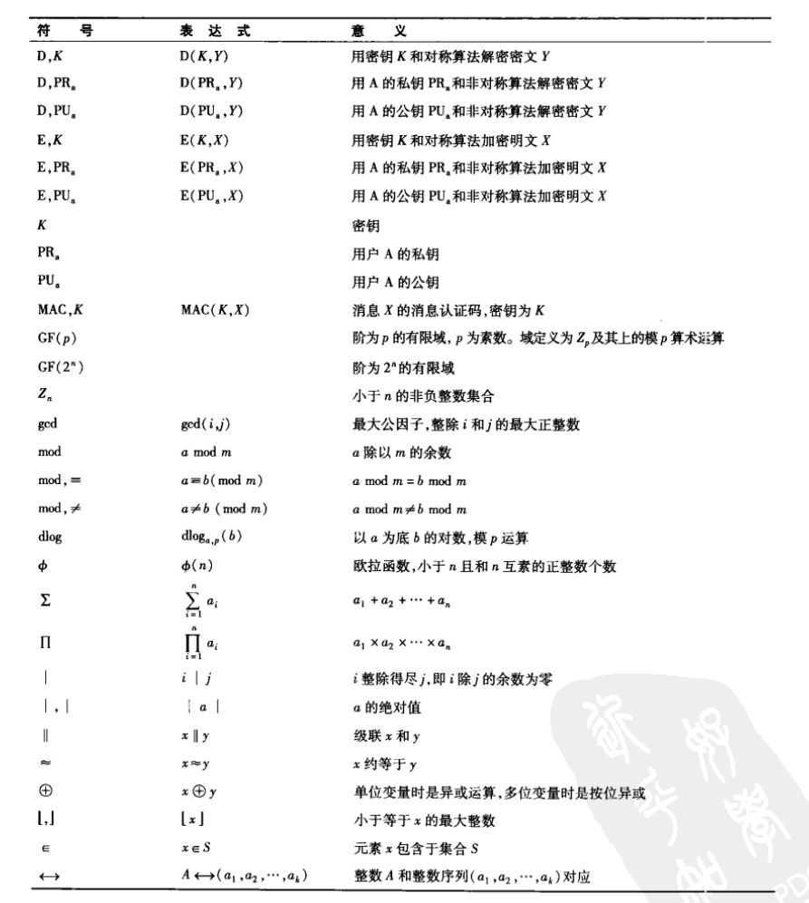
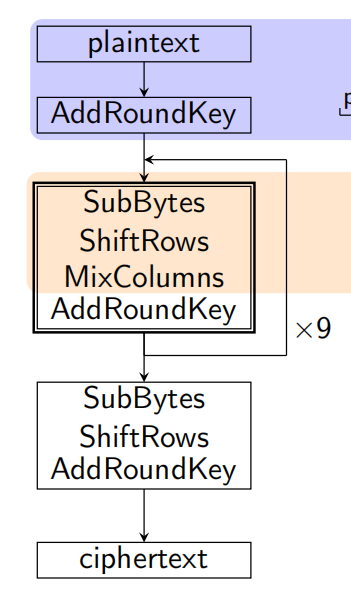

* 符号: 

    

# 数论
* 模幂运算(`Modular Exponentiation`): $x = b^d mod n$
* 模反元素: $a$ 与 $n$ 互质, 则必有 $b$ 使得 $ab \equiv 1 (mod\ n)$, $b$ 称为 $a$ 的模反元素. 此时有 $(ab - 1)$ 被 $n$ 整除. 
* 欧几里得算法(辗转相除法)
    * 用于求两个非负整数的最大公约数
    * 以除数和余数反复做除法运算, 当余数为 0 时, 取当前算式除数为最大公约数. 
    * 定理: 对于任意两个整数 $a, b$ 必存在整数 $x, y$ 使得 $ax + by = gcd(a,b)$ 成立. 
        * 推理过程: 如下, 辗转相除法得到余数为 $r_n$ . 用 $r_0, r_1$ 代替 $a, b$. 
        $$r_2 = r_0 - r_1x_1$$
        $$r_3 = r_1 - r_2x_2 $$
        $$... $$
        $$r_{n} = r_{n-2} - r_{n-1}x_{n-1} $$
        $$0 = r_{n-1} - r_{n}x_{n} $$
        * 由上有 $r_{n-1} = r_{n}x_{n}, r_{n-2} = r_{n} + r_{n}x_{n}x_{n-1}$, 于是最终 $a, b$ 都可用 $r_0$ 表示, 所以 $r_0$ 是 $a$ 和 $b$ 的线性组合. 
        * 引理: 对于任意两个互质整数 $a, b$ 必存在整数 $x, y$ 使得 $ax + by = 1$ 成立.
    * 裴蜀定理: 设两个正整数 $a, b$ , 则关于 $x, y$ 的方程 $ax + by = c$ 有解, 当且仅当 $c$ 是 $gcd(a, b)$ 的倍数. 
        * 等式 $ax + by = c$ 左右除以 $gcd(a, b)$ 得 $\frac{ax}{gcd(a, b)} + \frac{by}{gcd(a, b)} = \frac{c}{gcd(a, b)}$. 因为左式必是整数, 所以右式也是整数, 所以 $c$ 是 $gcd(a, b)$ 的倍数. 
    * 扩展欧几里得算法
        * 可用于求乘法逆元
        * 将 $ax + by = gcd(a,b)$ 表示为 $ax^{'} + by^{'} = kgcd(a,b)$, 其中 $x^{'} = kx, y^{'} = ky$. 求出 $x^{'}, y^{'}$ , 即可求出 $x, y$ .
        * $bx_0 + (a \mod b)y_0 = gcd(b, a \mod b)$, 因为 $gcd(a, b) = gcd(b, a \mod b)$ , 所以 $ax + by = bx_0 + (a \mod b)y_0 = bx_0 + (a - \lfloor{a/b}\rfloor b)y_0 = ay_0 + b(x_0 - \lfloor{a/b}\rfloor y_0)$, 根据恒等定理, 有 $x = y_0, y = (x_0 - \lfloor{a/b}\rfloor y_0)$
        * 代码
            ```cpp
            int exgcd(int a, int b, int &x, int &y)
            {
                if (b == 0) // 递归结束条件. 这时的a就是最大公约数
                {
                    x = 1;
                    y = 0;
                    return a;
                }
                int d = exgcd(b, a % b, x, y), x0 = x, y0 = y;
                x = y0;
                y = x0 - (a / b) * y0;
                return d;
            }
            ```
* 模 $m$ 的同余类: 指的是模 $m$ 余数相同的整数构成的集合.
* 完全剩余系(完系)
    * 在模 $m$ 的 $m$ 个同余类 $A_0, A_1, ..., A_{m-1}$ 中, 每一类 $A_i$ 中取一个数 $a_i$ , 则 $a_0, a_1, ..., a_{m-1}$ 叫做模的一个完系. 显然, 完系中的个数分别属于个不同的剩余类.
    * 最小非负完系: $0, 1, ..., m - 1$ 
    * 模 $m$ 的既约剩余系(缩系): $x_1, x_2, ..., x_s$, 若 $\forall j, s \in \mathbb Z, 1 \le j \le s, (x_j, m) = 1 $
* 欧拉函数 $F(n)$ : 
    * 对正整数 $n$ , 欧拉函数是小于 $n$ 的正整数中与 $n$ 互质的数的数目. (缩系中数字的个数)
    * 定理: 若 $n$ 是质数, 则 $F(n)$ 为 $n - 1$ . 
    * 乘积性定理: $m$ 与 $n$ 互质, 则 $F(m \times n) = F(m) \times F(n)$
        * 证明
            * 把1到 $mn$ 排成 $m$ 列 $n$ 行的矩阵. 
                $$1,              2, .............................................., m $$
                $$m+1,         m+2, ................................, m \times 2 $$
                $$2m+1, 2m+2,  ..........................., m \times 3 $$
                $$. $$
                $$. $$
                $$. $$
                $$(n-1)m+1, (n-1)m+2,  .............., m \times n $$
            * 每一行都是 $m$ 的一个完系; **根据定理4, 每一列也是n的一个完系, 因此每一列中有 $F(n)$ 个数与 $n$ 互质**. 
            * 设第一行中与 $m$ 互质的数集为 $A$ , $A$ 中的每个数记为 $a$ . 可知 $A$ 中的数字个数为 $F(m)$ . 则每个 $a$ 对应的那一列 $k \times m + a$ 都是与 $m$ 互质的数. 
            * 最后得到与 $mn$ 互质的数为 $F(m) \times F(n)$. 
* 欧拉定理: 互质且大于1的两个正整数 $a$ 和 $n$ 存在如下关系: 
    $$(a^{F(n)}) \% n = 1 $$
    * 证明(参考: https://bzc.idealand.xyz:8443/w/20727)
        * 把左式记为 $R$ . 要证 $R=1$. 设 $[1, n]$ 内与 $n$ 互质的数集为 $X$, 其中每个数用 $x$ 记. 
        * 根据定理2, 可知 $(a \times x) \% n$ 是 $[1, n)$ 范围内 $f$ 个两两不同且均与 $n$ 互质的数, 故得: $$((a \times x_1) \% n)   \times  .....    \times ((a \times x_f) \% n) = x_1 \times  ....   \times x_f$$
        * 把 $(x_1 \times  ....   \times x_f)\%n$ 记为 $k$. 上式两边模 $n$, 再按乘积定理化简, 可得: $$(R \times k)\%n = k$$
        * 接下来只要证明在这个等式中, $R$ 必须为1. 因为 $x$ 和 $n$ 互质, 所以 $x_1 \times x_2 \times ...x_f$ 和 $n$ 互质, 再根据定理1, 所以 $k$ 和 $n$ 互质. 
        * 根据定理2, $k \times 1, k \times 2, ..., k \times n$ 是模 $n$ 的完系. 又因为 $(1 \times k)\%n = k$, 所以完系中 $1 \times k$ 以外的其它数模 $n$ 都不会等于 $k$, 所以 $R$ 为1. 
    * 特例: 费马小定理, 若正整数 $a$ 与质数 $p$ 互质, 则: $$a^{p-1} \equiv 1 (\mod n)$$
    * 应用
        * 证明模反元素必然存在: $a \times a^{F(n) - 1} \% n = 1$

* 定理1: 如果 $a$ 与 $b$ 为互质的大于1的正整数, 则 $b$ 与 $a\%b$ 互质. 
    * 证明: 联想一下辗转相除求最大公约数. 
* 定理2: 如果 $m, n$ 为互质且大于1的整数, 则 $m \times 1, m \times 2, ..., m \times n$ 为 $n$ 的一个完全剩余系. 
    * 证明
        * 用反证法. 若存在 $m \times a$ 和 $m \times b$ 模 $n$ 同余, 则 $(m \times a - m \times b) \% n = 0$ 及 $m(a - b) \% n = 0$
        * 而 $a - b \in [1, n)$ , 参考下面的定理知不成立. 
* 定理3: 如果 $m, n$ 为互质的大于1的正整数, 则不存在 $[1, n)$ 内的数 $k$ 使得 $k \times m\%n=0$
    * 证明
        * $m, n$ 互质, 则 $m$ 不能分出一个因子来除 $n$
        * 而 $k$ 比 $n$ 小, 所以想让 $n$ 整除 $km$, 得让 $m$ 分一个因子来和 $k$ 结合(相乘)
* 定理4: 如果 $m,n$ 为大于1的互质的正整数, 则 $r, m+r, m \times 2+r, ..., m \times (n-1)+r$ 这 $n$ 个数对 $n$ 的模余是 $n$ 的一个完全剩余系, 其中 $r$ 为任意大于等于0的整数. 
    * 证明
        * 反证法, 假设这 $n$ 个数中存在两个模 $n$ 同余. 
        * 将它们相减, 可得 $(k \times m) \% n = 0$ . $k$ 在小于等于n的范畴内只能取0或 $n$ . 而定理中 $k \in [1, n)$, 所以矛盾. 

* 素数筛选
    * 平方根枚举: 对于数字n枚举小于等于sqrt(n)的所有数字, 如果n能够整除其中一个, 就能判断n不是素数, 时间复杂度大致是(n∗logn). 
    * 埃氏筛: 时间复杂度为nlglg(n)
    * 线性筛(欧拉筛)
    * 代码
    ```cpp
    // 平方根枚举
    bool isprime(int n)
    {
        int t;
        for(t=2;t<=sqrt(n);t++){
            if(!n%t){
                return false;
            }
        }
        return true;
    }

    // 埃氏筛选法
    int isprime[n+1];
    cnt = 0;
    bool prime[n+1];
    for(int t=1;t<=n;t++){
        prime[t]=true;
    }
    prime[0]=prime[1]=false;

    for(int t=2;t<=n;t++){
        if(prime[t]){
            isprime[cnt++]=t;
            for(int i=2;i*t<=n;i++){
                prime[i*t]=false;
            }
        }
    }

    // 线性筛
    #include<iostream>
    using namespace std;    
    const long N = 20;   
    long prime[N] = {0},num_prime = 0;    
    int isNotPrime[N] = {1, 1};   
    int main()    
    {  
        for(long i = 2 ; i < N ; i ++)       
        {            
            if(! isNotPrime[i])               
                prime[num_prime ++]=i;  
            //关键处1        
            for(long j = 0 ; j < num_prime && i * prime[j] <  N ; j ++)
                {               
                    isNotPrime[i * prime[j]] = 1;  
                if( !(i % prime[j] ) )  //关键处2                  
                    break;           
            }        
        } 
        
        for(int t=0;t<num_prime;t++){
            cout<<prime[t]<<' ';
        }       
        return 0;   
    }  
    ```

# 对称加密
## DES()
* 特征
    * 密钥长度56位, 理论安全强度为$2^56$. 

## AES(Advanced Encryption Standard)
* 参考: 
    * https://bbs.pediy.com/thread-253884.htm

        

* 特征: 
    * 使用Rijndael算法, 分组大小和密钥大小可以为128位(10轮), 192位(12轮)或256位(14轮). AES算法用128位(64字节). 

* 四个基本操作
    * 字节替代(SubBytes): 通过S盒对每个字节作映射. 将输入数据的每个字节的高四位作为第一个下标, 低四位作为第二个下标. 
    * 行移位(ShiftRows): 属于扩散层
    * 列混淆(MixColumns): 属于扩散层
    * 轮密钥加(AddRoundKey): 
    
    ```cpp
    // 字节代换
    PlainArray[i] = S_Table[PlainArray[i] >> 4][PlainArray[i] & 0x0F];

    // 逆字节代换
    CipherArray[i] = ReS_Table[CipherArray[i] >> 4][CipherArray[i] & 0x0F];

    // 行位移
    CipherArray[0] = CipherArray[0];
    CipherArray[1] = (CipherArray[1] << 8) | (CipherArray[1] >> 24); //第二行 右移8Bit
    CipherArray[2] = (CipherArray[2] << 16) | (CipherArray[2] >> 16); //第三行 右移16Bit
    CipherArray[3] = (CipherArray[3] << 24) | (CipherArray[3] >> 8); //第四行 右移24Bit
    ```

# 非对称加密
## RSA
* 算法描述
    1. 任意选取两个不同的大素数 $p$ 和 $q$ 计算乘积 $n = pq$ , 以及欧拉函数 $\varphi(n) = (p-1)(q-1)$.
    2. 任意选取一个大整数 $e$, 满足 $\gcd(e, \varphi(n)) = 1$. 整数 $e$ 用做加密钥(注意：$e$ 的选取是很容易的, 例如, 所有大于 $p$ 和 $q$ 的素数都可用. )
        * https://zhuanlan.zhihu.com/p/281086924 : 公钥指数是可以随意选取的, 但是为了提高RSA的加密速度实际使用中公钥指数最常用的三个值是3, 17, 65537(=2^16+1, 65537的二进制表示中只有两个1, 所以需要17次乘法来实现指数运算). PEM建议用3. PKCS#1建议用3或65537. X.509建议用65537. 这样选取主要是为了提高加密或签名验证的性能, 因为3, 17或65537分别只需要2或17次模乘运算, 而一个随机选择的e(假设n是1024-bit)则大约需要1000次模乘运算. 这种方法刻意把公钥指数选的小一点, 其对应私钥指数就会很大, 这么做的目的是节约公钥运算的时间. 因为正常使用中都是用公钥加密, 所以**需要节约大部分人的时间**. 而极少部分人也会选用私钥解密, 那么就只能少数服从多数了. 
    3. 确定的解密钥 $d$, 满足 $(de) \equiv 1 (\mod\ \varphi(n))$ (即 $d$ 是公钥指数$e$对$f$的一个模反元素), 即 $de = k\varphi(n) + 1, k \ge 1$ 是一个任意的整数.所以, 若知道 $e$ 和 $\varphi(n)$, 则很容易计算出 $d$ (用扩展欧几里得算法).
    4. 公开整数 $n$ 和 $e$, 秘密保存 $d$.
    5. 将明文 $m$ ( $m < n$, 是一个整数)加密成密文 $c$, 加密算法为
        > $c = E(m) = m^e \mod n$
    6. 将密文c解密为明文m, 解密算法为
        > $m = D(c) = c^d \mod n$
* 加解密证明: 
    * 若$m$与$n$互质: 
        $$(m^e \mod n)^d \mod n $$
        $$\Downarrow $$
        $$m^{ed} \mod n $$
        $$\Downarrow $$
        $$m^{k\varphi(n) + 1} \mod n $$
        $$\Downarrow $$
        $$(m^{\varphi(n)}...m^{\varphi(n)}m) \mod n $$
        $$\Downarrow $$
        $$((m^{\varphi(n)} \mod n)...(m^{\varphi(n)} \mod n)(m \mod n)) \mod n $$
        $$\Downarrow $$
        $$由欧拉定理得 m^{\varphi(n)} \mod n \equiv 1$$
        $$\Downarrow $$
        $$m \mod n$$
        $$\Downarrow $$
        $$m $$
    * 若$m$与$n$不互质: 
        * 则 $m = jp$ 或 $m = jq$. 假设为前者. 显然$j < q$, 故有$j$与$q$互质. 
        $$m^{k\varphi(n) + 1} \mod n $$
        $$\Downarrow $$
        $$(jp)^{k\varphi(n) + 1} \mod pq $$
        $$\Downarrow $$
        $$(j^{k\varphi(n) + 1} p^{k\varphi(n)}) \mod q $$
        $$\Downarrow $$
        $$((j^{k(p-1)(q-1) + 1} \mod q) ((p^{k(p-1)})^{(q-1)} \mod q)) \mod q $$
        由欧拉定理: 
        $$\Downarrow $$
        $$(((j^{k(p-1)})^{(q-1)}j \mod q) * 1) \mod q $$
        $$由欧拉定理: $$
        $$\Downarrow $$
        $$j \mod q $$
        $$\Downarrow $$
        $$jp \mod pq $$
        $$\Downarrow $$
        $$m \mod n $$
        $$\Downarrow $$
        $$m $$

        * https://zhuanlan.zhihu.com/p/561733119 的证法: 
            * 首先: 
            $$m^{k(p-1)(q-1) + 1} \mod q $$
            $$\Downarrow $$
            $$(m^{k(p-1)})^{q-1} * m \mod q $$
            $$\Downarrow $$
            $$显然m^{k(p-1) + 1}与q互质, 由欧拉定理得: (m^{k(p-1)})^{q-1} \mod q = 1 $$
            $$\Downarrow $$
            $$m \mod q $$
            
            * 所以 $m^{k(p-1)(q-1) + 1} - t_1q  = m - t_2q$, 所以 $m^{ed} = m + tq, t \in N^*$
            * 又有: 
            $$m^{ed} \mod p = 0 $$
            $$\Downarrow $$
            $$(m + tq) \mod p = 0 $$
            $$\Downarrow $$
            $$m + tq \mod p = 0 $$
            $$\Downarrow $$
            $$t = rp, r \in N^* $$
            * 所以: 
            $$m^{ed} \mod n $$
            $$\Downarrow $$
            $$(m + rpq) \mod n $$
            $$\Downarrow $$
            $$m \mod n $$
            $$\Downarrow $$
            $$m $$
* 安全性: 
    * 需要计算私钥$d$, 则要将$n$分解为$p$和$q$, 从而求得$\varphi(n)$, 再通过扩展欧几里得算法算出$d$. RSA的安全性依赖于大数因子分解的困难性, 至今还没有一个多项式时间的方法来实现大数因子分解. 
* RSA数字签名
    * 用私钥签名: $c = m^d \mod n$
    * 用公钥验证签名: $m = c^e \mod n$

## ECC(椭圆曲线加密算法)
