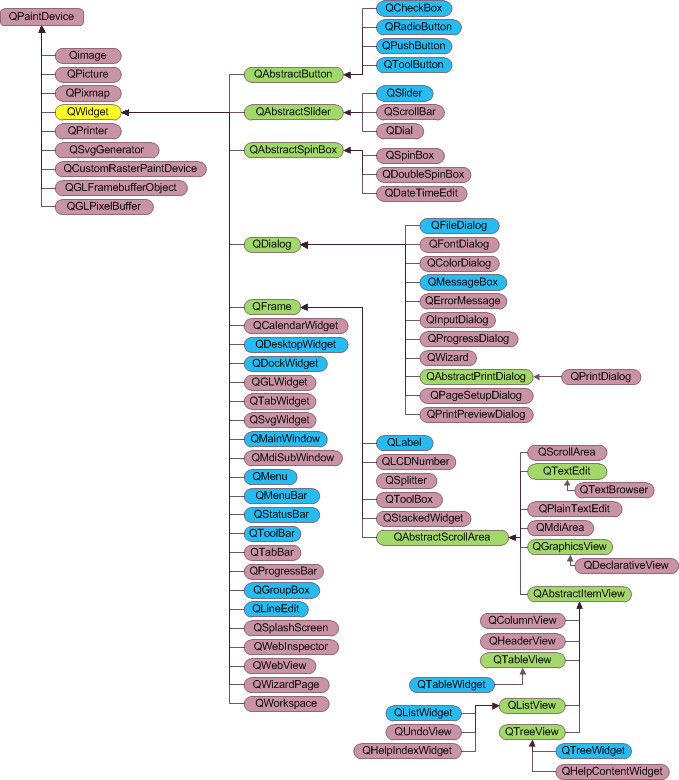

# QT
## 信息
* 要素/特点
    * 跨平台: Linux, Windows
    * QML: 类似HTML, 可用JS交互, 用CSS操纵样式. 
    * 元对象编译器(MOC)
        * 一个预处理器, 程序编译前会先将带有Qt特性的程序转为标准C++兼容的格式. 
        * QtCore模块是QT类库的核心. 
        * 比如, 使用了信号机制的类, 都会有一个`Q_OBJECT`宏. 
    * 元对象系统
        * 三个基础
            * `QObject`类是所有使用元对象系统的类的基类. 
            * 在类的private部分声明`Q_OBJECT`, 则类可以使用元对象的特性, 包括动态属性, 信号和槽. 
            * MOC为每个`QObject`的子类提供必要的代码来实现元对象系统的特性. 
        * API
            * `QObject::metaObject()`: 返回类关联的元对象(即`QMetaObject`对象)
            * `QMetaObject::className()`: 返回类名. 
            * `QMetaObject::newInstance()`: 创建类的一个新实例. 
            * `QObject::inherits(const char* className)`: 判断一个实例是否是名为`className`的类的实例. 
            * `QObject::tr()`, `QObject::trUtf8()`: 可翻译字符串, 用于多语言界面设计. 
            * `QObject::setProperty()`, `QObject::property()`: 可通过属性名称动态设置属性和获取属性. 
            * `qobject_cast`: 动态映射, 类似于C++的`dynamic_cast`, 只是其不需要RTTI的支持, 而且可以跨越动态链接库的边界. 
                ```cpp
                QObject *obj = new QMyWidget;
                QWidget *widget = qobject_cast<QWidget *>(obj); // obj原先是指向QMyWidget类的, 将其投射为QWidget
                ```
    * 属性系统
        * 基于元对象系统实现
        * 
        ```cpp
        Q_PROPERTY(type name // 分别指明返回值类型和属性名称
            (READ getFunc [WRITE setFunc] | MEMBER memberName [(READ getFunc | WRITE setFunc)]) // MEMBER指定一个成员变量与属性关联
            [RESET resetFunc] // 指定函数, 用于设置缺省值
            [NOTIFY notifyFunc] // 设置一个信号, 属性值发生变化时, 包含该属性的对象会发送发射此信号(要设置MEMBER)
            [REVISION int]
            [DESIGNABLE bool] // 表示属性是否能在Qt Designer中可见. 默认为true
            [SCRIPTABLE bool]
            [STORED bool]
            [USER bool]
            [CONSTANT] // 表示属性值是一个常数(不能有WRITE和NOTIFY)
            [FINAL] // 表示所定义的属性不能被子类重载
        )

        // 例
        Q_PROPERTY(bool enabled READ isEnabled WRITE setEnabled)

        bool enabled;
        ```

        * 注: 
            * `NOTIFY`指定的信号只在`setProperty`时触发, 直接用等号赋值不会触发. 
    * `Q_CLASSINFO`: 
        * 可为类的元对象添加`名称-值`的附加信息, 如`Q_CLASSINFO("author", "Tom")`. 
        * 获取元信息: `QMetaObject::classInfo(int index)`, 返回`QMetaClassInfo`对象, 其中有`name()`和`value()`两个函数可用. 

* .pro文件
    * `LIBS += -L路径 -l库名`: 添加库. 对于系统库, 在QT已设好环境变量的情形中, 则不需要`-L路径`
    * `CONFIG += console thread`: 在运行程序时打开控制台窗口. 
    * `CONFIG += exceptions_off`: 可屏蔽系统异常引起的弹框. 在使用windows的`__try__except`时有用. 

* 文件目录
    * .pro文件: 项目文件
    * .h文件和.cpp文件一般一一对应, 前者声明, 后者实现 

* 使用技巧
    * `alt + enter`: 在头文件声明函数后, 通过此快捷键可在对应的cpp文件中添加函数定义. 
    * 为Release版本添加调试信息: 
        * `Projects` -> `Build`, `Edit build configuration`选`Release`, 在`Build Steps`的`qmake`中, 点`Details`, 勾选`Generate separate debug info`. 
    * 静态编译
        * 需要先下载qt源码, 然后构建, 并在qtcreator的kits集中新增新构建的静态版qmake

## 环境配置
* QTCreator
    * 远程调试
        * windows
            * 调试机
                * 把`Tools\QTCreator\lib\qtcreatorcdbext64`文件夹拷贝到调试机, 将环境变量`_NT_DEBUGGER_EXTENSION_PATH`设为该文件路径. 
                * 环境变量`_NT_SYMBOL_PATH`也可以设一下, 这个是cdb的符号查找路径. cdb命令行的用法同windbg. 
                * 把项目生成的exe和pdb文件都拷贝到调试机
            * 启动调试
                * 在调试机中运行cdb启动调试服务器: `cdb.exe -server tcp:port=999 myTest.exe`
                * 在开发机的QTCreator中, 选择 `调试` -> `开始调试` -> `挂接到一个CDB会话`, 输入`tcp:server=192.168.233.128, port=999`, 其中IP地址和端口号都是调试机的cdb服务的. 
            * 调试过程
                * 要在qtcreator中打断点, 需要先在调试机的cdb中`ctrl + c`中断, 然后在qtcreator的源文件中打断点. 目前发现在qtcreator的变量窗口中不显示变量, 只能在cdb中使用命令来查询. 
    * 问题
        * 编辑器中没有解析符号, 且报错`Clang Code Model: Error: The clangbackend executable ... could not be started`: 
            * `帮助` -> `关于插件`, 把 `C++` -> `ClangCodeModel`后的勾去掉, 重启qtcreator. 

## 编程
* 控件

    

    * `QWidget`: 所有控件的父类
        * 窗口关闭处理
            * 须在子窗口的构造函数中加一句`setAttribute(Qt::WA_DeleteOnClose)`, 这样关闭子窗口时才会执行析构函数. 
            * `void closeEvent(QCloseEvent *event)`: 实现该虚函数, 以捕获窗口关闭事件
                * `event->ignore()`: 执行该句, 则窗口不会关闭. 
        * 接口
            * `show`: 在new一个窗口后, 调用该方法以显示窗口. 
            * `setWindowModality(type)`: 设置模态, 以禁止其他界面响应. 
                * `type`: 
                    * `Qt::NonModal`
                    * `Qt::WindowModal`: 阻塞父窗口, 父窗口的父窗口, 兄弟窗口. 
                    * `Qt::ApplicationModal`
            * `setVisible(bool)`: 设置组件是否可见. 
            * 在组件中绑定数据
                * `Q_DECLARE_METATYPE(<数据类型>)`: 必须先将相关数据类型(包括结构体)用此宏做声明, 才能使用`setData`. 
                * `setData(int role, const QVariant &value)`: 绑定数据
                * `setData(int column, int role, const QVariant &value)`: 绑定数据(`QTableWidgetItem`和`QTreeWidgetItem`)
                * `data(int role)`: 获取数据
                * `data(int column, int role)`: 获取数据(`QTableWidgetItem`和`QTreeWidgetItem`)
    * `QLayout`: 
        * `QSplitter`: 分割器
            ```cpp
            // 设置初始化时两侧窗口占比
            ui->mySplitter->setStretchFactor(0, 1); // 0表示第0个格子. 占比为1
            ui->mySplitter->setStretchFactor(1, 2); // 1表示第1个格子. 占比为2
            ```
    * `QMainWindow`: 自带工具栏, 菜单栏, 状态栏
        * QT Creator生成的MainWindow主类中, 有一个`ui`成员. 在成员函数中, 可直接用`ui->myWidgetName`的方式, 通过使用给组件命的名称, 获得组件的指针. 
    * `QDialog`: 
        * `QDialog::show()`: 非模态, 非阻塞的. 
        * `QDialog::exec()`: 模态, 阻塞, 整个系统阻塞掉. 
        * `QDialog::open()`: 窗口模态, 只会阻塞一个窗口. 
    * 右键菜单: 
        ```cpp
        this->setContextMenuPolicy(Qt::CustomContextMenu);
        tabMenu = new QMenu(ui->myTable); // 指定在ui->myTable右键时弹出菜单

            QAction *act1 = new QAction("do sth", this);
            tabMenu->addAction(act1);
            connect(act1, SIGNAL(triggered(bool)), this, SLOT(handel_act1)); // 绑定slot

        connect(ui->myTable, SIGNAL(customContextMenuRequested(QPoint)), this, SLOT(my_show_tabMenu(QPoint))); // 绑定slot, 以在点击位置弹出菜单

        void MyWidget::my_show_tabMenu(QPoint) {
            tabMenu->exec(QCursor::pos());
        }
        ``` 
    * `QButton`: 
        * 示例: 
            ```cpp
            QWidget widget; // 添加窗口
            QPushButton But("按钮控件",&widget); // 定义一个按钮, 它位于 widget 窗口中
            But.setGeometry(10,10,100,50); // 设置按钮的位置和尺寸
            ```
    * `QTableWidget`: 表格组件
        * 行号从0开始. `QTableWidgetItem::row()`, `QTableWidget::selectRow(int rowNum)` 等函数都基于此前提. 
        * 属性
            * `sortingEnabled`: 设置是否可按列排序.  
            * `horizontalHeaderStretchLastSection`: 设置最后一列宽度占满表格. 对于单列表格有用. 
        * 示例: 
            ```cpp
            // 解决点击表格时表头变粗的问题
            ui->myTableWidget->setHighlightSections(false);

            // QTableWidget ui->myTableWidget; 
            int rowNum = ui->myTableWidget->rowCount(); // 获取当前行数
            ui->myTableWidget->clearContents(); // 清空表格内容
            ui->myTableWidget->setRowCount(0); // 清空表格行

            // 设置列宽
            ui->myTableWidget->horizontalHeader()->resizeSection(0, 150); // 设置第0列的宽度为150
            ui->myTableWidget->horizontalHeader()->setResizeMode(QHeaderView::ResizeToContents); // 设置列宽按内容变化. 

            ui->myTableWidget->insertRow(rowNum); // 在第rowNum行前插入新行. 若参数大于当前表格最大行号, 则在表格末尾插入. 这里的写法就是末尾插入. 

            // 在行中插入新的单元格
            QTableWidgetItem* pQTableWidgetItem1 = new QTableWidgetItem(); 
            ui->myTableWidget->setItem(rowNum, 0, pQTableWidgetItem1); // 在第0列插入

            // 在列中插入控件(比如按钮)
            ui->myTableWidget->setCellWidget(row, 0, myButton); 

            // 清空表格
            ui->myTableWidget->clearContents(); // 不会去除表头
            ui->myTableWidget->setRowCount(0);
            ```
        * 问题
            * 排序后, 对item获取的行号可能不正确. 
                * 解决方法: 每次`setItem`前先关闭排序功能. 
                ```cpp
                ui->myTableWidget->setSortingEnabled(false);
                ... // 调用setItem插入单元
                ui->myTableWidget->setSortingEnabled(false);
            ```
    * `QTreeWidget`: 树组件
        * 示例: 
            ```cpp
            QTreeWidget* qTree; 
            QTreeWidgetItem* qItem; 

            qDeleteAll(qTree.takeChildren()); // 清空节点下所有子节点
            qItem->setChildIndicate(QTreeWidgetItem::ShowIndicator);

            qItem->child(i); // 获取第i个子节点
            qTree->topLevelItem(i); // 获取第i个顶层节点

            auto newItem = new QTreeWidgetItem(qItem); // 在qItem下创建新的子节点
            qTree->addTopLevelItem(new QTreeWidgetItem); // 

            ui->myTreewidget->editItem(qItem, 0);
            ```
    * 输入组件
        * `QCombobox`: 下拉框
            * `setCurrentText(const QString &text)`: 如果列表中有匹配的文本, 则`currentIndex`会被设置为相应的索引. 
        * `QTextEdit`: 文本框
            * 接口
                * 追加内容
                    * `append(sth)`: 会换行
                    * `insertPlainText(sth)`, `insertHtml(sth)`: 不会换行
                * 光标
                    * `tc = textCursor()`: 获取光标
                    * `tc.insertText(sth)`: 光标处插入内容
        * `QPlainTextEdit`: 也是文本框
            * 渲染html的性能比`QTextEdit`好. 
                * `appendHtml(sth)`: 不会换行
    * `QtFileDialog`: 文件选择对话框
        * `QString d = QFileDialog::getExistingDirectory();`
        * `QString d = QFileDialog::getOpenFileName();`
    * `QLable`
        * 设置图标: 
            * `QMovie`: 可在`QLable`组件中设动图
                ```cpp
                QMovie *m = new QMovie(":/image/loading.gif");
                ui->myLable->setMoive(m);
                movie->setScaledSize(ui->myLabel->size()); // 设置和label一样大小
                movie->start();
                ```
* 事件
    * 一个 Qt 界面程序要想接收事件, main() 函数中就必须调用 `exec` 函数, 它的功能就是使程序能够持续不断地接收各种事件. (?)
    * `QEventLoop`
        ```cpp
        void XXX::slot1() {
            QDialog dlg;
            dlg.show(); // 若直到这一行就结束, 则弹窗一下就关闭了
            QEventLoop loop;
            connect(&dlg, SIGNAL(finished(ini)), &loop, SLOT(quit()));
            loop.exec(QEventLoop::ExcludeUserInputEvents); // 启动事件循环, 等待弹框的finished信号
        }
        ```

* 信号和槽机制
    * 信号函数
        * 如, "按钮被按下"这个信号可以用`clicked`函数表示
        * 用`signals`关键字修饰
        * 只需声明一个函数, 无需定义
    * 槽函数
        * 对信号作出响应的函数
        * 如, "窗口关闭"这个槽可以用`close`函数表示
        * 用 `public slots`, `protected slots` 或者 `private slots` 修饰
        * 需声明和定义. 若命名为`on_<子对象名>_<事件名>`, 则无需再写一行`connect`, 因为构建的时候会自己生成. 
    * `connect(&But, SIGNAL(clicked()), &widget, SLOT(close()));` 将But按钮的信号函数clicked和widget窗口的槽函数close关联起来. 
        * 现在(QT5以后)不用SIGNAL和SLOT宏, 改成如`&QButton::clicked`这样的. 
        * 第5参数: 
            * `Qt::AutoConnection`: 若发射和接收信号是同一线程, 则相当于`DirectConnection`, 否则相当于`QueuedConnection`. 
            * `Qt::DirectConnection`: 
            * `Qt::QueuedConnection`: 
            * `Qt::BlockingQueuedConnection`: 同`DirectConnection`, 但会阻塞到槽函数返回. (若发射和接收信号是同一线程, 则不可使用它, 否则会死锁)
            * `Qt::UniqueConnection`: 可以用or与上面的几个选项组合使用. 若设置了它, 当连接已存在时, `connect`会失败. 
    * 在程序中触发信号: `emit mySignalFunc();` `mySignalFunc`是本类中一个信号成员函数. 
    * `Cannot send events to objects owned by a different thread`: 在Qt中, ui的操作不能在别的线程里. 
    * 阻塞信号: `myWidget->blockSignals(true)` (设为false则解除阻塞)
* 定时器
    * 
* 线程
    * 使用事件循环
        1. 子类化QThread
        2. 重载run, 在其中调用`QThread::exec()`方法
        3. 相关成员函数:
            * `start`: 启动
            * `quit`: 在`run`函数中调用之, 可主动结束线程. 
            * `exit`: 
            * `wait`: 
            * `terminate`: (暴力)结束线程
    * `QtConcurrent`: 可以以lambda的形式启动新线程. 
        ```cpp
        #include <QtConcurrent/QtConcurrent>

        int a = 10;
        QFuture future = QtConcurrent::run([&] () {
            while (a--) { 
                ... 
                emit this->mySignal(ssize_t param1); // 注意, 要在组件初始化时执行 qRegisterMetaType<ssize_t>("ssize_t"); 不然槽函数接收不到信号
            }
        });
        future.waitForFinished(); // 阻塞当前线程, 等待子线程返回结果
        ```
    * `QThreadPool`
        * `::globalInstance()`: 全局`QThreadPool`对象. 
    * `QRunnable`
        * 需要借助`QThreadPool`启动. 
    * 线程同步
        * 使用`QWaitCondition`和`QMutex`
            ```cpp
            // 主线程
            mutex.lock();
            Send(&packet);
            condition.wait(&mutex); // 会阻塞
            if (m_receivedPacket) {
                HandlePacket(m_receivedPacket); // 另一线程传来回包
            }
            mutex.unlock();

            // 通信线程
            m_receivedPacket = ParsePacket(buffer);  // 将接收的数据解析成包
            mutex.lock();
            condition.wakeAll();
            mutex.unlock();
            ```

            * `QWaitCondition::wait(QMutex* mutex)`: 会阻塞线程, 直到调用`wakeAll`或`wakeOne`. 官方说法, `wait`会释放`mutex`并作等待. 此外, `mutex`会"返回到相同的锁定状态"(可能是指又返回到lock状态). 这个函数做的工作是从锁定状态到等待状态的原子转换. 
    * 注意
        * 启动一个QThread子线程, 并在子线程中调用主线程生成的组件的渲染函数(如, 对`QTextEdit`组件调用`append`函数), 会导致程序崩溃退出(`0xC0000005`)

* 数据
    * `QString`
        ```cpp
        QString str;
        QString s = "hello";

        // 操作
        str.sprintf("%d", 1); // 格式化字符
        str.simplified(); // 去除首尾空格
        str.mid(pos, len); // 截取字符串, 从pos位置开始, 截取出len个字符
        str = s + "\n"; // 拼接字符串

        // 取值
        str.back(); 


        QString::number(1);

        QString::fromWCharArray(L"宽字符串");
        QString::fromStdString;
        QString::fromStdWString;
        ```
    * `QByteArray`: 字节数组. 
        * 数据会以'\0'结尾. 
        ```cpp
        QByteArray ary("1234");

        ary.size(); // 4
        ary.data(); // 得到指向底层数据的指针
        ary.resize(10); // 调整大小
        
        ary[0];
        ary.at(0); // 比ary[0]快, 因为它不会深拷贝. 

        ary.append("abcd"); // 结尾附加数据
        ```
    * `QVariant`: 在组件上保存数据和传输数据时用该类
        ```cpp
        // 自定义的结构体数据
        struct MyStruct {
            int id; 
        }
        Q_DECLARE_METATYPE(MyStruct)

        // 保存结构体数据到组件
        MyStruct ms = {0};
        pMyWidget->setData(0, QT::UserRole, QVariant::fromValue(ms)); // 一参事数据的索引

        // 取回数据
        MyStruct ms2 = pMyWidget->data(0, QT::UserRole).value<MyStruct>();
        ```
    
    * `QVariantList`: 该列表类型可以保存`QVariant`类型
        ```cpp
        QVariantList qvList;
        qvList.append();
        ```

* 文件和目录
    * 获取程序工作目录: `QDir::currentPath()`
    * 获取程序文件所在目录: `QCoreApplication::applicationDirPath()`
    * `QDir`
        ```cpp
        QDir dir("./mydir");
        (dir.removeRecursively())
        ```
    * `QFile`
        * 打开方式
            |||
            |-|-|
            |QIODevice::ReadOnly|以只读方式打开文件|
            |QIODevice::WriteOnly|只写方式|
            |QIODevice::ReadWrite|读写方式|
            |QIODevice::Append|追加模式打开，新写入文件的数据添加到文件尾部|
            |QIODevice::Truncate|截取方式打开文件，文件原有的内容全部被删除|
            |QIODevice::Text|文本方式打开文件，读取时“\n”被自动翻译为换行符|
        * 例
            ```cpp
            // 参考: https://blog.csdn.net/ligare/article/details/124494533
            QFile file("./f1");
            if(!file.open(QIODevice::Append)) {
                return 0;
            }

            // 读文件
            while(!file.atEnd()) {
                //方式1
                QByteArray array2 = file.readLine();
                qDebug() << array2;

                //方式2
                char buf[1024];
                qint64 lineLength = file.readLine(buf, sizeof(buf));
                if (lineLength != -1)
                {
                    // the line is available in buf
                    qDebug() << "行" << buf;
                }
            }
            // 方式3
            QTextStream in(&file);
                while (!in.atEnd()) {
                QString line = in.readLine();        
            }

            // 写文件
            //方式1
            QByteArray ba1 = "1236546";
            file.write(ba1);//叠加调用并不会换行
            //方式2
            QTextStream aStream(&file); //用文本流读取文件
            QString str="xsx";//叠加调用并不会换行
            aStream<< endl << str; //写入文本流,在字符的前面会换行

            ```
* 其他
    * 时间
        * `QDateTime::currentDateTime().toString()`: 获取当前日期
* 问题
    * 在另一个线程中动态添加新建的控件时, 新控件要以new的形式创建, 不能是局部作用域中的变量. 
    * `Cannot send events to objects owned by a different thread. `
