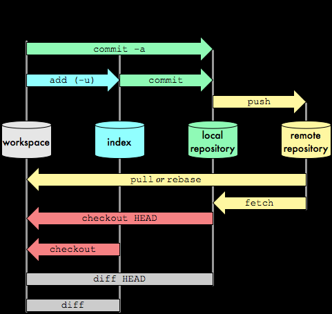
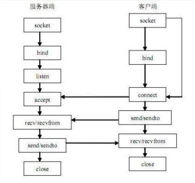
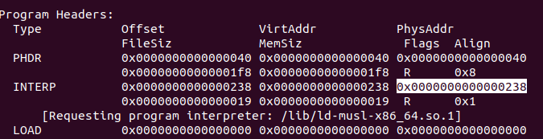

# Linux系统目录及文件
* `/proc`: 每个进程在此目录下都有一个文件. 
    * `/<pid>`
        * `/fd`: 其下文件都是数字(代表文件描述符). 各个文件都链接到实际文件, 比如设备, 套接字等. 
        * `/map`: 文件保存了一个进程镜像的布局(可执行文件, 共享库, 栈, 堆和 VDSO 等)
    * `/iomem`: 与`/proc/<pid>/maps`类似, 不过它是跟**系统内存**相关的
    * `/kcore`: Linux 内核的动态核心文件. 
    * `/kallsyms`: 内核符号. 如果在 `CONFIG_KALLSYMS_ALL` 内核配置中指明, 则可以包含内核中全部的符号. 
    * `/modules`: 内核模块信息. 
    * `/net`
        * `/tcp`: 记录tcp连接信息. `nethogs`会用到. 
    * `/sys`
        * `/kernel`
            * `/core_pattern`: 系统产生的coredump文件将以此文件的格式化字符串为准进行命名. 
            * `/random`
                * `uuid`: 用`cat`打印这个文件, 将生成一个随机的uuid
            * `/randomize_va_space`: 设为0, 可关闭地址随机化
        * `/net`
            * `/ipv4`: 这下面有tcp, ip等协议的选项. 
* `/boot`:
    * `/grub`
        * `/grub.cfg`
            * 其中`menuentry`处有启动项. 
    * `/initrd.img-<内核版本号>`: initrd的目的就是在kernel加载系统识别cpu和内存等核心信息之后, 让系统进一步知道还有那些硬件是启动所必须使用的
    * `/System.map`: 内核符号. 
* `/dev`
    * `/input`
        * `/event<数字>`: 键盘等输入设备的实时数据可从这些文件读取. 
    * `/loop`: loop设备是一种仿真设备, 其将一个文件模拟成一个块设备, 使得该文件能够像真正的磁盘或光盘一样被使用和管理. 使用前需先将一个loop设备与一个文件关联(`losetup`命令)
    * `/urandom`: 随机数据. 
    * `/shm`: 共享内存. 
* `/lib`
    * `/udev`: 
* `/etc`
    * `/default`
        * `/grub`: 
            * 修改该文件并运行`update-grub`, 将更新`/boot/grub/grub.cfg`. 如果在centos中, 运行`grub2-mkconfig -o /boot/grub2/grub.cfg`. 
            * `GRUB_DEFAULT`对应默认启动项. 
            * `GRUB_CMDLINE_LINUX`: 启动命令行. 
                * `nokaslr`: 关闭内存地址随机化. 
    * `/resolv.conf`: 配置dns服务器. 
* `/usr`
    * `/local`: 存安装的软件. 
        * `/src`: 源码. 

# 开发
* code blocks
    1. `sudo apt install codeblocks`: 
    2. `sudo apt install build-essential`: 
    3. `sudo apt install valgrind`: 用于探测内存泄露的调试组件
    3. `sudo apt install codeblocks-contrib`: 安装codeblocks常用插件
* 静态库: (https://blog.csdn.net/hexf9632/article/details/100985400)
    * 编译生成静态库
        * `gcc -Wall -O2 -fPIC -I./ -c -o mylib.o mylib.c`
        * `ar crv libmylib.a mylib.o`
    * 编译引用了静态库的程序(不需要头文件)
        * `gcc test.c -o test ./libmylib.a`
        * `gcc test.c -o test -L. -lmylib `
        * `gcc test.c -o test -L. libmylib.a`
* 动态库
    * `__attribute__((constructor))`指定加载函数, 被它修饰的函数会在main函数开始前执行. `__attribute__((destructor))`加载卸载函数. 
    * 隐式加载
        * 编译生成动态库
            * `gcc -o2 -fPIC -shared mylib.c -o libmylib.so`
                * `-fPIC`: 表示生成位置无关代码
                * `-shared`: 表示动态库
        * 编译引用了动态库的程序(不需要头文件)
            * `gcc -o2 -Wall -L. -lmylib test.c -o test`
        * 这时对test程序使用ldd, 会看到`libmylib.so => ./libmylib.so`
            * 这时候需要修改`LD_LIBRARY_PATH`, 否则找不到动态库. 
    * 显式加载
        ```cpp
        #include <stdio.h>
        #include <dlfcn.h>

        #define LIB "./libmylib.so"

        int main(void)
        {
            /*
            * 二参: 
            *   RTLD_NOW: 将共享库中的所有函数加载到内存 
            *   RTLD_LAZY: 会推后共享库中的函数的加载操作, 直到调用dlsym()时方加载某函数
            */
            void *dl = dlopen(LIB, RTLD_LAZY); // 打开动态库

            if (dl == NULL)
                fprintf(stderr,"Error:failed to load libary.\n");

            char *error = dlerror(); // 检测错误
            if (error != NULL)
            {
                fprintf(stderr,"%s\n",error);
                return -1;
            }

            /*
            * 一参: 
            *   dlopen打开的句柄
            *   RTLD_NEXT: 将会找第一个匹配了函数符号的动态库 
            */
            void (*func)() = dlsym(dl, "mylib"); // 获取函数地址
            error = dlerror(); // 检测错误
            if (error != NULL)
            {
                fprintf(stderr,"%s\n",error);
                return -1;
            }

            func(); // 调用动态库中的函数

            dlclose(dl); // 关闭动态库
            error = dlerror(); // 检测错误
            if (error != NULL)
            {
                fprintf(stderr,"%s\n",error);
                return -1;
            }

            return 0;
        }

        ```
## 编译链接工具
* `gcc`
    * 编译: 
        * 下载源码: https://mirrors.nju.edu.cn/gnu/
        * 执行: `./configure --prefix=/usr --enable-multilib --enable-languages=c,c++ -disable-multilib`
        * 执行`make`, 时间比较长. 
        * 问题: 
            * 在ubuntu22中编译gcc 7.5时报错`error: size of array 'assertion_failed__1150' is negative ... typedef char IMPL_PASTE(assertion_failed_##_, line)[2*(int)(pred)-1]`
                * 解决: 将`./gcc-7.5.0/libsanitizer/sanitizer_common/sanitizer_platform_limits_posix.cc`中`CHECK_SIZE_AND_OFFSET(ipc_perm, mode); `注释掉. 
    * 参数
        * `-c <源程序文件名>`: 编译成`.o`文件(不链接)
        * `-o <输出文件名>`
        * `-g`: 带上调试符号. 
        * `-static`: 静态编译. 
        * `-I<头文件目录>`
        * `-L<库文件目录绝对路径>`
        * `-Wl,`: 其后紧接的参数是传给链接器ld的. 
            * `-Map=<map文件路径>`: 生成map文件. 
            * `-Bstatic -l<库名>`: 指定静态链接库. 
            * `-Bdynamic -l<库名>`: 指定动态链接库. 
            * `--as-needed`: 可忽略不被依赖的库, 进而加快程序的启动. 
        * `-xc xxx`: 以编译C语言代码的方式编译xxx文件. 
        * `-T`: 指定链接器脚本. 
        * `-shared`: 产生一个共享object, 这个对象后面可以跟其他对象链接以组成一个可执行文件. 
        * 安全相关的编译选项
            * `NX(DEP)`: 将数据所在内存页标识为不可执行. 
                * `-z execstack`: 禁用NX保护
                * `-z noexecstack`: 开启NX保护
            * `RELRO`: read only relocation. GOT保护. 
                * `-z norelro`: 关闭. 
                * `-z lazy`: 部分开启. 此时对GOT表仍有写权限. 
                * `-z now`: 全部开启. 
            * `PIE(ASLR)`
                * `-fpic`: 生成位置无关代码(适用于共享库). 动态加载器会在程序开始时解析GOT表. 
                * `-fPIC`: 生成位置无关代码. 
                * 下面选项仅能用于编译可执行程序, 不能用于编译库: 
                    * `-fpie -pie`: 生成位置无关代码. (强度为1, 半随机, 包括code, data, stack, mmap, vdso的随机化)
                    * `-fPIE -pie`: 生成位置无关代码. (强度为2, 随机, 在1的基础上加上对heap地址的随机化)
            * `CANARY`: 使用cookie的栈保护. 
                * `-fno-stack-protector`: 禁用
                * `-fstack-protector`: 开启
                * `-fstack-protector-all`: 完全开启
            * `FORTIFY`: 生成了一些附加代码, 通过对数组大小的判断替换`strcpy`, `memcpy`, `memset`等函数名, 达到防止缓冲区溢出的作用. 
                * `-D_FORTIFY_SOURCE=1`: 较弱的检查(只在编译时进行检查)
                * `-D_FORTIFY_SOURCE=2`: 在1的基础上, 对栈变量进行检测, 且会在运行时进行检查. 
                * `-D_FORTIFY_SOURCE=3`: 在2的基础上, 可以对`malloc`出来的内存进行检测(gcc 12以上)

    * 链接器脚本(lds文件)
        * 参考: 
            * `https://www.codenong.com/cs109007373/`
        * 示例
        
        ```
        SECTIONS
        {
            . = 0×10000;
            .text : { *(.text) }

            .data : {
                tbl = .;
                *(.data.tbl)
                tbl_end = .;
            }
        }
        ```

        * 把定位器符号置为`0×10000`(若不指定, 则该符号的初始值为0).
        * 在C程序的全局空间中声明`extern char tbl[], tbl_end; `, 即可使用`.data`节中的这两个地址. 
        * 声明变量时, 使用`__attribute__((section(".data.tbl")))`, 即可将变量放到`.data.tbl`处. 
    * `__attribute__`: 用于声明函数属性, 变量属性, 类型属性
        ```cpp
        __attribute__((constructor)) static void fun1(); // 这个函数会在main函数前执行

        __attribute__((stdcall)) void f2(); // 指定函数的调用约定

        __attribute__((regparm(3))) void f3(); // 调用函数的时候参数不是通过栈传递, 而是直接放到寄存器里, 被调用函数直接从寄存器取参数

        __attribute__((alias("func"))) void f4(); // 调用f4即相当于调用func

        // 给结构体变量s指定属性
        struct my_struct
        __attribute__((unused)) // 表示可能不会用到
        __attribute__((aligned(1))) // 表示1字节对齐
        __attribute__((section("my_sec"))) // 表示s被分配到my_sec节中
        s = { ... };
        ```
    * `__builtin_expect`: 
        * gcc 2.96以后支持, 其将分支转移的信息提供给编译器, 这样编译器可以对代码进行优化, 以减少指令跳转带来的性能下降. 
        * 编译时, 可能性更大的代码紧接前面的代码. 
        * `likely`和`unlikely`的判断作用一样, 只有编译结果上的区别. 
            ```cpp
                #define likely(x)       __builtin_expect((x),1) // x为真的可能性更大时用这个
                #define unlikely(x)     __builtin_expect((x),0) // x为假的可能性更大时用这个
            ```
* `make`
    * 参考
        * `https://www.zhaixue.cc/makefile/makefile-intro.html`
    * 指定`make install`的安装位置: 先执行`./configure --prefix=<目标路径>`
    * `-C $(DIR) M=$(PWD)`: 跳转到源码目录`$(DIR)`下, 读其中的Makefile. 然后返回到`$(PWD)`目录. 
    * Makefile
        ```makefile
            MAKE=make

            include ../.config # 可使用其他.config文件中的配置

            all: haha.text target1

            # 可以将一些宏参数传给目标(在目标代码中会用到这些宏)
            target1: CFLAGS+=-DNAME=\"$(CFG_NAME)\" -DDEBUG=$(CFG_IS_DEBUG)

            # 目标: 依赖文件集
            #   命令1
            #   命令2
            # 命令前加个@, 可以阻止终端打印这条命令. 
            target1: 
                @ $(MAKE) -C /lib/modules/5.4.0-42-generic/build M=/home/u1/output src=/home/u1/codes
            
            # 使用条件语句, 如ifdef, ifeq ($(a), $(b))
            target2: 
            ifdef DEBUG
                ...
            else
                ...
            endif

            %.o:%.c
                gcc -o $@ $<
            
            # 可使用循环语句: 
            fortest: 
                for arch in arm aarch64 mips powerpc ; do \
                    echo $$arch ; \
                done
            
            # 自定义函数
            define func
                @echo $(0), $(1)
            endef
            $(call func, 参数1, 参数2)

            ########################################################################################################################
            # 示例: 构建一个动态库
            libmy.so: add.o sub.o
                gcc -shared -o $@ $^

            %.o: %.c
                gcc -fPIC -c $<

            # 示例: 构建一个静态库
            libmy.so: add.o sub.o
                ar -rc $@ $^

            %.o: %.c
                gcc -c $<
            
        ```

        * 默认执行第一个目标(在上面的文件中, 指`all`). 
        * `-C <目录>`: 指定跳转目录, 读取那里的`Makefile`. 
        * `M=<工作目录绝对路径>`: 在读取上述`Makefile`后, 跳转到`工作目录`, 继续读入`Makefile`. `M`是内核头文件目录下的`Makefile`中会用到的一个变量(`KBUILD_EXTMOD := $(M)`)
        * 注意上述选项后面接的路径都**必须是完整路径**. 
        * `-DVAR1=${VAR1}`: 可传递宏变量`VAR1`. 
            * 若有传参, 则不过`${VAR1}`是否为空, 代码中`#ifdef VAR1`都会为真. 
        * 常量
            * `BASH_SOURCE`: 当前文件路径. 
                * `dirname BASH_SOURCE[0]`: 可获得当前文件所在目录的路径. 
            * `$@`: 表示目标文件. (也就是紧跟在`make`指令后面的字符串)
            * `$^`: 表示所有依赖文件. 
            * `$<`: 表示第一个依赖文件. 
            * `$?`: 表示比目标还新的依赖文件列表. 
        * 符号
            * 赋值符号
                * `=`: 给变量赋值. 会在整个`Makefile`展开后, 再决定变量的值. 
                * `:=`: 表示变量的值取决于它在`Makefile`中的位置, 而不是整个`Makefile`展开后的最终值
                * `?=`: 如果没有被赋值过就赋予等号后面的值. 
                * `+=`: 添加等号后面的值. 
                * `override VAR:= $(VAR)_blabla`: 使用`override`关键字, 可对已经赋值的变量追加赋值. 
        * 预定义函数: 
            * `$(shell command)`: 执行`shell`命令函数, 执行`command`命令并返回其输出结果. 
            * `$(wildcard pattern)`: 查找文件名函数, 返回匹配`pattern`模式的所有文件名. 
            * `$(subst from,to,text)`: 字符串替换函数, 将`text`中所有的`from`替换为`to`. 
            * `$(patsubst pattern,replacement,text)`: 模式字符串替换函数, 将`text`中所有匹配模式`pattern`的字符串替换为`replacement`. 
            * `$(abspath path)`: 获取`path`的绝对路径. 
* `cmake`
    * 用法: 
        * 基本流程: 
            1. 编辑`CMakeLists.txt`
            2. 在源码目录下新建一个目标目录, 比如叫`build`. 
            3. 进入`build`目录, 执行`cmake ..`, 将会在该目录下生成`Makefile`. 
            4. 执行`make`
        * 启用调试: 
            * 在`CMakeLists.txt`添加: `add_definitions("-Wall -g")`
            * 或者: `cmake -DCMAKE_BUILD_TYPE=Debug ..`
* `ar`
    * `-r`: 将 objfile 文件插入静态库尾或者替换静态库中同名文件
    * `-x`: 从静态库文件中抽取文件 objfile
        * `-x mylib.a`: 将`.a`文件中所有obj文件导出. 
        * `-xv mylib.a obj1.o`: 只导出其中一个对象文件. 
    * `-t`: 打印静态库的成员文件列表
    * `-d`: 从静态库中删除文件 objfile
    * `-s`: 重置静态库文件索引
    * `-v`: 创建文件冗余信息
    * `-c`: 创建静态库文件

## 项目管理
* git
    * 工作流: 
        
        

    * 释义: 
        * `origin`: 远程服务器. 
        * `master`: 主分支. 
    * 基本指令
        * `git add .`: 将所有修改放入暂存区即index. 
        * `git log`: 查看提交历史. 
            * `--online`: 
            * `--graph`: 
            * `--reverse`: 
            * `--author=<用户名>`: 
            * `(--before|--since|--until|--after)=({1.weeks.ago}|{2022|11|22})`: 
    * 提交
        * `git log <某次提交操作对应的哈希值>`: 查看提交信息
        * `git show <某次提交操作对应的哈希值> --name-only`: 只列出涉及的文件
        * 去除某个文件的历史提交记录: 
            1. `git filter-branch -f --index-filter 'git rm -rf --cached --ignore-unmatch <目标文件相对项目根目录的路径>' HEAD`
            2. `git push origin --force --all`
        * 将一个分支的提交合并到另一个分支. 
            1. 首先checkout到目标分支. 
            2. `git cherry-pick <commit的哈希值>`
        * 在拉取前先暂存代码, 之后再应用回自己的修改: 
            1. `git stash`
            2. `git pull`
            3. `git stash pop`
    * 放弃修改及回滚:
        * `checkout`
            * 会导致`HEAD detached`
            * 放弃本地所有修改: `git checkout .`
            * 放弃对某个文件的修改: `git checkout <file>`
        * `reset --hard`
        * `reset <某次提交的hash>`: 回退到某次提交. 
            * `--mixed`: 默认选项, 重置暂存区到某次提交. 
            * `--soft`: 用于回退至某个版本. 
            * `--hard`: 重置暂存区和工作区到某次提交, 并删除之前所有提交. 
                * `--hard origin/master`: 回退至和服务器保持一致. 
        * `revert <某次提交的hash>`: 放弃某些提交. 会创建一个新的提交, 以撤销hash指定的提交. 
    * 分支
        * `branch` 
            * `<分支名>`: 创建新分支. 
            * `-d <分支名>`: 删除分支. 
            * `-D <分支名>`: 强制删除分支. 当开发者希望删除所有提交记录时可用该选项. 
            * `<分支名> -m <新分支名>`: 重命名分支. 
            * `-a`: 列出所有远程分支. 
        * `checkout <分支>`: 切换到分支. 
        * `push --set-upstream origin <新分支名>`: 将分支推送到服务器
        * `pull origin <远程分支名>[:<本地分支名>]`: 拉取指定分支
        * `clone -b <分支名> <git地址> <仓库新名称>`: 拉取指定分支
    * 将本地已有git仓库推送到git服务器
        * `git remote add origin <项目url>` 将本地仓库与远程仓库关联
        * `git push --set-upstream origin master`
        * `git push -u origin master` 将本地项目推送到远程仓库
    * 把别人的git仓库push到自己的服务器上: 
        * `git remote remove origin`: 把原来的origin删掉
        * 在服务器上新建仓库
        * `git push --set-upstream origin master`
        * `git remote add origin <项目url>`
        * `git remote set-url --push origin <项目url>`
* 库管理
    * `dpkg`
        * `-i`: 安装deb包. 
        * `--instdir=<安装路径>`: 
        * `dpkg-query -l`: 列出已安装包. 
        * `-P`: 卸载包. 
        * `--get-selections | grep linux-image`: 查看已安装内核. 
    * `apt`
        * ``
    * 打印ansi彩色字体
        * `echo -e "\033[33m彩色\033[0m"`
    * 设置UTC时间
        * `sudo cp /usr/share/zoneinfo/UTC /etc/localtime`, 之后执行`date`命令可看到效果. 


# 调试
## GDB
* 安装
    * 源码: http://ftp.gnu.org/gnu/gdb
    * 安装过程中可能会更新系统自带的python, 导致与原有gdb使用的python不同, 会造成不少问题. 需要在更新python后, 使用gdb的源码重新编译和构建gdb.
    * 安装过程中会自动下载相关pip包, 可以先按 https://www.runoob.com/w3cnote/pip-cn-mirror.html 设置指定默认的pip源. 
* 远程调试: `target remote 172.17.0.2:12345`
* 启动参数: 
    * `-tui`: 同时打开源程序
    * 设置程序运行参数
        * `gdb --args <程序路径> <程序参数>`
        * 在进入gdb后, 可以`run <程序参数>`
        * 在进入gdb后, 可以`set args <程序参数>`
* `coredump`: 
    * 设置coredump文件限制大小为无限大: `ulimit -c unlimited`
    * 设置coredump文件生成路径(以root身份): `echo "/my_dir/core-%e-%t-%s-%p" > /proc/sys/kernel/core_pattern`, 其中: 
        * `%e`: 进程名
        * `%t`: 时间戳
        * `%s`: 引起coredump的signal号
        * `%p`: 进程id
    * `gdb <可执行文件> <coredump文件>`
* 基本命令
    * `attach <pid>`: 附加进程
    * `start`: 运行程序, 停在第一行
    * `r`: 运行. 
    * `c`: 继续运行. 
    * `n`: 单步跳过
    * `s`: 步入
        * `si`: 执行单条指令
    * `j <地址>`: 将执行流转到新的地址. 
    * `until`: 运行到退出循环体
    * `finish`: 运行到函数返回
    * `return <返回值>`: 跳出函数(函数剩余部分不会执行)
    * `bt`: 调用栈
    * `l`: 查看源代码
        * `<行号>`: 列出第`<行号>`行代码
        * `<函数名>`: 
    * 打印数值
        * `display a`: 显示变量a的值
        * `x/<FMT> <addr>`
            * 例: `x/10xw &a`: 以16进制的格式, 打印变量a的地址开始后的10个四字节数据. 
            * 格式可选: 
                * `o`: 8进制
                * `x`: 16进制
                * `d`: 十进制
                * `u`: 无符号十进制
                * `t`: 二进制
                * `f`: 浮点   
                * `a`: 地址
                * `i`: 指令
                * `c`: 字符
                * `s`: 字符串
                * `z`: 左侧零填充的16进制
            * 大小可选: b(1字节), h(2), w(4), g(8)
    * 打印信息
        * `i`: 
            * `breakpoints`: 显示所有断点
            * `locals`: 显示所有局部变量
            * `registers`: 显示所有寄存器
            * `sh`: 显示所有共享库
            * `inferior`: 可查看调试的进程的信息, 包括pid和路径等. 
            * `sharedlibrary`: 查看导入的库. 
        * `shell <bash命令>`: 可执行bash命令
    * 断点
        * `b` 
            * ` *<地址>|*<寄存器>`: 指令地址断点
            * ` <filename>:<function name>`: 函数断点
            * 条件断点
                * `if cnt==10`
        * `watch`
            * ` *<地址>`: 数据断点
            * ` &<变量>`: 数据断点
        * `d n`: 删除第n个断点
        * `tb`: 零时断点. 用法同`b`, 只使用一次. 
    * `call <func>(<args>)`: 调用函数(如程序或libc库的函数). 结果保存在历史值中(`$`). 
    * 界面
        * `layout`: 
            * `src`: 源程序
            * `asm`: 汇编. 此时得用`ctrl + p`, `ctrl + n`在cmd中切换上一条或下一条命令. 
            * `split`: 源程序和汇编各一个窗口
        * `focus`: 切换窗口
            * `prev|next`: 切换
            * `cmd`: 切换到命令行
            * `asm`: 切换到汇编窗口
            * `src`: 切换到源码窗口
            * `regs`: 切换到寄存器窗口
        * `ctrl+x, <数字>`: 切换窗口
        * `tui enable`: 源程序界面. 可以用`ctrl+x, a`切换. 
    * 设置
        * `set follow-fork-mode child`: 设置gdb在fork之后跟踪子进程. 
        * `set detach-on-fork off`: 可防止gdb在有fork执行之后就从父进程中分离. 
        * `set var a = 1`: 设置变量a的值为1
        * `set var $r1 = 1`: 设置寄存器r1的值为1
## 其他
* 调用图
    ```sh
        cd /sys/kernel/debug/tracing

        # 打印调用栈
        echo nop > current_tracer           # 清空跟踪器
        echo 要跟踪的内核函数 > set_ftrace_filter   # 设置跟踪函数为drm_open
        echo function > current_tracer      # 设置当前跟踪器
        echo 1 > options/func_stack_trace   # 跟踪函数调用栈
        echo 1 > tracing_on                 # 开始跟踪
        echo 0 > tracing_on                 # 关闭跟踪

        # 打印调用图
        echo nop > current_tracer
        echo function_graph > current_tracer
        echo 要跟踪的内核函数 > set_graph_function
        echo 1 > options/funcgraph-tail  # 增加函数尾部注释
        echo > set_ftrace_filter         # 清空, 否则无法显示调用栈
        echo 1 > tracing_on 
        echo 0 > tracing_on

        # 输出结果
        cat trace
    ```
# 字符串
* api
    * `char *strtok(char s[], const char *delim);` 当发现`delim`中包含的分隔符时, 会将该字符改为`\0`. 首次调用时, 参数`s`是目标字符串, 后面调用时直接设为NULL. 直到`strtok`返回NULL, 则说明分割结束了. 
    * `bzero(buf, len)`: 将缓冲区`buf`的`len`个字节清零. 

# 进程
* api
    * `FILE * popen(const char *command , const char *type );`
        * 创建一个管道, 调用`fork`产生一个子进程, 执行`command`命令. 管道须由`pclose`关闭. 
        * `type`: 'r'则返回进程的标准输出流, 'w'则为标准输入流. 
    * `getpid`: 获取本进程id
    * `getppid`: 获取父进程id
    * `fork`: 创建子进程, 其从调用`fork`之后的地方开始执行.     
        * 返回值
            * 负值: 创建子进程失败. 
            * 零: 返回到新创建的子进程. (即若返回值为0, 表明此时在子进程中)
            * 正值: 返回父进程. 该值包含新创建的子进程的进程ID. (即若返回值大于0, 表面此时在父进程中)
    * `int kill(pid_t pid, int sig);` 向`pid`进程发送`sig`信号. 
    * `signal(int sig, void (*func)(int))`: 设置`func`函数, 来等待`sig`信号. 
        * 头文件: `<signal.h>`
        * 一些常用信号
            |信号常量|信号含义|
            |-|-|
            |SIGABRT|	(Signal Abort) 程序异常终止. (执行`abort`函数; 执行`assert`函数); 多次`free`; |
            |SIGFPE|	(Signal Floating-Point Exception) 算术运算出错, 如除数为 0 或溢出（不一定是浮点运算）. |
            |SIGILL|	(Signal Illegal Instruction) 非法函数映象, 如非法指令, 通常是由于代码中的某个变体或者尝试执行数据导致的. |
            |SIGINT|	(Signal Interrupt) 中断信号, 如 ctrl-C, 通常由用户生成. |
            |SIGSEGV|	(Signal Segmentation Violation) 非法访问存储器, 如访问不存在的内存单元. |
            |SIGTERM|	(Signal Terminate) 发送给本程序的终止请求信号. |
            |SIGPIPE|	网络异常时, 使用socket相关函数如`send`等会触发此信号(提示`Broken Pipe`). |
    * `int sigaction(int signum, const struct sigaction *act, struct sigaction *oldact);` 
        * 参数
            * `signum`: 不可以是`SIGKILL`或`SIGSTOP`. 
            * `act`: 
                ```cpp
                // #include <signal.h>
                struct sigaction {
                    union {
                        void (*sa_handler)(int); 
                        void (*sa_sigaction)(int, siginfo_t *, void *); // 若设置了SIGINFO_T, 则用这个函数
                    } __sigaction_handler; // 新的信号处理函数

                    // 在处理信号时会暂时将 sa_mask 指定的信号集搁置
                    sigset_t sa_mask;

                    // 用来设置信号处理的其他相关操作
                    // A_NOCLDSTOP: 如果参数signum为SIGCHLD, 则当子进程暂停时并不会通知父进程
                    // SA_ONESHOT/SA_RESETHAND: 当调用新的信号处理函数前, 将此信号处理方式改为系统预设的方式
                    // SA_RESTART: 被信号中断的系统调用会自行重启
                    // SA_NODEFER : 一般情况下,  当信号处理函数运行时, 内核将阻塞该给定信号. 但是如果设置了 SA_NODEFER标记,  那么在该信号处理函数运行时, 内核将不会阻塞该信号
                    int sa_flags;

                    void (*sa_restorer)(void);
                }
                ```
            * `oldact`: 用于保存原来对信号的处理. 
        * 返回: 0成功, -1失败. 
    * `int sigqueue(pid_t pid, int sig, const union sigval value);` 类似`kill`, 主要针对**带参的信号**. `value`为传递的参数. 
        * 例: 
            ```cpp
            pid_t pid = atoi(argv[1]);
            union sigval v;
            v.sival_int = 100;
            sigqueue(pid, SIGINT, v);

            void my_handler(int sig, siginfo_t *info, void *ctx) {

            }
            ```
    * `pid_t waitpid(pid_t pid, int * status, int options)`: 暂停进程, 等待信号到来或pid子进程结束. 
    * `pid_t wait(int * status)`
        * 判断子进程返回的状态: `if (WEXITSTATUS(*status) == 0)`
    * `int daemon(int nochdir, int noclose)`: 将本进程作为守护进程运行. 
        * 参数
            * `nochdir`: 为0时, 更改进程运行目录为`/`. 
            * `noclose`: 为0时, 将3个stdin, stdout, stderr重定向到`/dev/null`. 
    * `exec`系列: **将执行从原进程转到新进程**. 若成功则原进程不再执行. (成功则不返回, 失败则返回-1)
        
        ```cpp
        int execl(const char *path, const char *arg, ...);
        int execlp(const char *file, const char *arg, ...);
        int execle(const char *path, const char *arg,..., char * const envp[]);
        int execv(const char *path, char *const argv[]);
        int execvp(const char *file, char *const argv[]);
        int execvpe(const char *file, char *const argv[],char *const envp[]);
        ```
    * `system`: 执行bash命令. 如果不是运行为后台进程, 则要等进程结束该函数才返回. 返回退出码(错误返回-1)

# 线程
* 头文件: `<pthread.h>`
* gcc编译时需加上: `-lpthread`
* 示例
    ```cpp
    void* func(void* params) {

    }

    void main() {
        int pid;
        void *params;
        pthread_t tid;
        ...
        if (pthread_create(&tid, NULL, func, params) != 0) { // 二参是线程属性
            printf("error\n");
        }
    }
    ```
* 同步
    * 互斥体: 
        ```cpp
        #include <pthread.h>

        // 初始化mutex. 这种方法无需销毁
        pthread_mutex_t mutex = PTHREAD_MUTEX_INITIALIZER;

        // 也可以: 
        pthread_mutex_init(&mutex, NULL);

        // 销毁. 若互斥量处于已加锁的状态, 或正在和条件变量配合使用, 则该函数会返回EBUSY错误码. 
        pthread_mutex_destroy(&mutex);

        pthread_mutex_lock(&mutex);
            // 临界区
        pthread_mutex_unlock(&mutex);

        // 非阻塞版本.  
        /*********************************/
        if (pthread_mutex_lock(&mutex) == 0) { // 尝试获取锁
            ...
            pthread_mutex_unlock(&mutex);
        } else {
            ...
        }

        ```
        
        * `int pthread_mutex_init(pthread_mutex_t *restrict mutex, const pthread_mutexattr_t *restrict attr);`

    * 条件变量: `thread_cond_t`
        * 条件变量本质也是一个全局变量, 它的功能是阻塞线程, 直至接收到"条件成立"的信号后, 被阻塞的线程才能继续执行. 
        * 一个条件变量可以阻塞多个线程, 这些线程会组成一个等待队列. 
        * 为了避免多线程之间发生"抢夺资源"的问题, 条件变量在使用过程中必须和一个互斥锁搭配使用. 
        * 初始化: 
            * 静态分配: `pthread_cond_t cond = PTHREAD_COND_INITIALIZER;`
            * 动态分配: `int pthread_cond_init(pthread_cond_t *cond, const pthread_condattr_t *attr);`
            * **不能用一个条件变量对另一个条件变量赋值.**
        * 销毁: 动态分配的条件变量需要销毁. 
            * `int pthread_cond_destroy(pthread_cond_t *cond);`
        * 使用: 
            ```cpp
            pthread_mutex_t myMutex = PTHREAD_MUTEX_INITIALIZER;
            pthread_cond_t myCond = PTHREAD_COND_INITIALIZER;

            pthread_mutex_lock(&myMutex); // 先获取互斥锁
                pthread_cond_wait(&myCond, &myMutex); // 等待条件成立. myMutex会被释放, 因此其它线程可以获取它. 
                // 得到信号后, 会再次获取myMutex, 因此后面需要释放它. 
                // ...
            pthread_mutex_unlock(&myMutex); 


            // 另一个线程
            pthread_mutex_lock(&myMutex); // 先获取互斥锁
                pthread_cond_signal(&myCond); // 发出条件成立的信号, 唤醒线程
            pthread_mutex_unlock(&myMutex); 

            pthread_cond_broadcast(&myCond); // 同时唤醒多个 调用pthread_cond_wait在等待的线程

            // 有超时的wait
            // https://blog.csdn.net/wteruiycbqqvwt/article/details/99707580
            /************************************************************/
            struct timeval now;
            gettimeofday(&now, NULL);

            // 在now基础上, 增加ms毫秒
            struct timespec outtime;
            outtime.tv_sec = now.tv_sec + ms / 1000;

            // us的值有可能超过1秒
            uint64_t  us = now.tv_usec + 1000 * (ms % 1000); 
            outtime.tv_sec += us / 1000000; 

            us = us % 1000000;
            outtime.tv_nsec = us * 1000;

            int ret = pthread_cond_timedwait(&signal->cond, &signal->mutex, &outtime);

            ```

            * `pthread_cond_wait`被调用时, **会释放其绑定的互斥体**, 并阻塞线程(所以前面有个获取互斥体的操作); 收到信号后, 会返回并对绑定的互斥体上锁, 所以最后又会有一个解锁操作. 

# PTrace
* 要点
    * 用于获取另一个进程的控制权. 
    * `gdb`, `strace`都用到了`ptrace`. 
    * 可用在进程注入(**动态库注入**)中. 
    * 可用于**反调试**. 
    * 在进程中用`ptrace`跟踪自身会失败. 


# 内存
* 内存检测工具
    * `valgrind`: 可检测目标程序中引起内存泄露的代码. 

# 文件
* 头文件
    * `<sys/types.h>`
    * `<sys/stat.h>`
    * `<fcntl.h>`
    * `<poll.h>`: `poll`. 
* 文件类型: 
    * 普通文件(`-`)
    * 目录(`d`)
    * 字符设备文件(`c`)
    * 块设备文件(`b`)
    * 本地域套接字(`s`)
    * 有名管道(`p`)
    * 符号链接(`l`)
* api
    * `int fd = open(const char *pathname,int flags, mode_t mode);` 
        * 参数
            * `flags`
                * 主类: 
                    * `O_RDONLY`: 只读   
                    * `O_WRONLY`: 只写   
                    * `O_RDWR`: 读写
                * 副类: 
                    * `O_CREAT`: 文件不存在则创建文件
                    * `O_EXCL`: 用了`O_CREAT`但文件存在, 则返回错误消息
                    * `O_NOCTTY`: 若文件为终端设备, 则不会将该终端机当成进程控制终端机
                    * `O_TRUNC`: 若文件已存在, 删除文件中原有数据
                    * `O_APPEND`: 以追加的方式打开. 需要跟`O_WRONLY`结合用, 不然会出现`bad file descriptor`
            * `mode`: 文件访问权限的初始值. 
        * 返回值: 大于0则打开文件成功. 
            * -1: 失败
    * `int ftruncate(int fd, off_t length);`: 将fd指定的文件大小改为参数`length`指定的大小. `fd`需是以写入的模式打开. 
    * `off_t lseek(int fd, off_t offset, int whence)`: 在读写文件前, 将文件指针移动到`offset`指定的位置. 
        * 参数
            * `whence`
                * `SEEK_SET`: 相对起始位置. 
                * `SEEK_END`: 相对结束位置. 
                * `SEEK_CUR`: 相对当前位置. 
        * 返回值: 若成功, 返回设置后文件指针的位置. 
            * 可获取文件大小: `lseek(fd, 0, SEEK_END);`

    * `ssize_t write(int fd, const void * buf,size_t count);` 
        * 参数: 
            * `buf`: 存放要写入的内容
            * `count`: 要写入的字节数
        * 返回值: 成功则返回写入的字节数, 失败则返回-1. 
    * `ssize_t read(int fd, void *buf, size_t count);`
        * 返回值: 成功则返回读取的字节数, 到达文件末尾则返回0, 失败则返回-1. 
    * `int dup(int fd)`: 复制现有的文件描述符fd, 返回新描述符. 
    * `int dup2(int fd, int fd2)`: 同`dup`, 但是可以用`fd2`指定新描述符, 如果`fd2`已打开, 则会先将其关闭. 
    * `int fileno(FILE *stream)`: 获得文件流所使用的文件描述符. 
    * `fd_set`: 这个结构体的变量用于存放文件描述符. 
        * `FD_ZERO(fd_set*)`: 清空一个fd_set. 
        * `FD_SET(int, fd_set*)`: 将一个fd加入到一个fd_set中. 
        * `FD_CLR(int, fd_set*)`: 将一个fd从一个fd_set移除. 
        * `FD_ISSET(int, fd_set*)`: 检测一个fd是否在一个fd_set中, 是则返回true. 
    * `int select(int maxfdp, fd_set* readfds, fd_set* writefds, fd_set* errorfds, struct timeval* timeout)`
        * 用于监视文件描述符的变化情况(读写或异常). 比如检查套接字是否有数据可读了. 这个函数会将未准备好的描述符位清零. 
        * 参数: 
            * `maxfdp`: 最大fd值加一
            * `readfds`: 用于检查可读性. 如果想检查一个套接字集合`fd_set`是否有可读套接字, 就将这个参数设为`fd_set`
            * `writefds`: 用于检查可写性
            * `errorfds`: 用于检查异常
            * `timeout`: 用于决定`select`等待I/O的最长时间, 在此期间`select`函数会阻塞. 为`NULL`则无限等待. 
                * `timeout->tv_sec`或`timeout->tv_usec`不为0时, 等待指定的时间. (前者为秒, 后者为微秒)
        * 返回值
            * 满足要求的描述符的个数
            * -1: 出错
            * 0: 超时
        * 示例: 读一个socket
            ```cpp
            while(1) {
                fd_set set; 
                FD_ZERO(&set); // 将set清空 
                FD_SET(s, &set); // 将套接字s加入set
                select(s + 1, &set, NULL, NULL, NULL); // 检查set集合中的套接字是否可读(会阻塞)
                if(FD_ISSET(s, &set)) { // 检查s是否在set中(即s是否被唤醒)
                    recv(s, buf, len, 0); // 四参是flags, 一般设为0
                }
            }
            ```
    * `int poll(struct pollfd* fds, nfds_t nfds, int timeout);`
        * 参考: https://blog.csdn.net/weixin_43389824/article/details/124731063
        * 类似于`select`, 用于在文件描述符上等待可IO操作. 
        * 原理: 内核将用户的`fds`结构体数组拷贝到内核中. 当有事件发生时, 再将所有事件都返回到`fds`结构体数组中, `poll`只返回已就绪事件的个数, 所以用户要操作就绪事件就要用轮询的方法. 
        * 参数
            * `fds`: 一个`pollfd`数组. 
                ```cpp
                struct pollfd
                {
                    int fd; // 文件描述符
                    short events; // 请求的事件
                    short revents; // 返回的事件
                };
                ```
                * `events`可取值: 
                    |事件标识|解释|
                    |-|-|
                    |`POLLIN`|	数据可读|
                    |`POLLPRI`|	文件出现异常条件. 包括: TCP套接字上有带外数据; 使用包模式的伪终端的master在slave上观测到状态变化; `cgroups.events`文件被修改.  |
                    |`POLLOUT`|	数据可写|
                    |`POLLRDHUP`|	流套接字的对端关闭了连接, 或者关闭写. |
                    |`POLLERR`|	发生错误|
                    |`POLLHUP`|	挂起|
                    |`POLLNVAL`|	无效请求: `fd`未打开. |
                    |`POLLRDNORM`|	同`POLLIN`|
                    |`POLLRDBAND`|	高优先级数据可读(Linux中一般用不到)|
                    |`POLLWRNORM`|	同`POLLOUT`|
                    |`POLLWRBAND`|	高优先级数据可写|
            * `nfds`: `fds`数组中结构体的数量. 
            * `timeout`: 超时时间, 单位为毫秒. 
        * 示例
            ```cpp
            #include <stdio.h>
            #include <unistd.h>
            #include <poll.h>

            int main()
            {
                struct pollfd poll_fd;
                poll_fd.fd = 0;
                poll_fd.events = POLLIN;
                while(1)
                {
                    int ret = poll(&poll_fd, 1, 20000);
                    if(ret<0)
                    {
                        perror("poll");
                        continue;
                    }
                    if(ret==0)
                    {
                        printf("poll timeout\n");
                        continue;
                    }
                    if(poll_fd.revents == POLLIN)
                    {
                        char buf[1024];
                        read(0, buf, sizeof(buf)-1);
                        printf("msg:%s", buf);
                    }
                }
            }

            ```


# 终端
* api
    * `int isatty(int desc)`: 判断文件描述符指向的文件是否是终端. 
    * `perror(char *s)`: 将上一个函数发生错误的原因输出到stderr. `s`所指向的字符串会先被打印. 
    * `termios.h`
        * `int tcgetattr(int fd, struct termios *termios_p);` 获取终端参数, 保存于`termios`结构体. 
    * `int openpty(int *amaster, int *aslave, char *name, struct termios *termp, struct winsize *winp); `
        * 作用: 创建一个虚拟终端. 创建一个控制端(master)和一个数据端(slave). 控制端用于向虚拟终端写入数据和从中读数据; 数据段用于应用程序和虚拟终端的交互. 
        * 参数: 
            * `amaster`: 保存控制端的文件描述符. 
            * `aslave`: 保存数据端的文件描述符. 
            * `name`: 如不为NULL, 则会接收slave pty的路径. 
            * `termp`: 如不为NULL, 则会接收`struct termios`数据. 
            * `winp`: 如不为NULL, 则会接收`struct winp`数据. 
        * 示例: 
            ```cpp
            #include <unistd.h>
            #include <pty.h>
            #include <stdio.h>
            #include <stdlib.h>
            #include <fcntl.h>
            #include <sys/wait.h>

            int main() {
                int master, slave;
                pid_t pid; 

                if (openpty(&master, &slave, buf, N3ULL, NULL) == -1) {
                    return -1;
                }

                pid = fork();
                if (pid == -1) {
                    return -1;
                }

                if (pid == 0) { // 子进程中
                    close(master); // 子进程不需要读主控端的数据, 所以关闭master
                    dup2(slave, STDOUT_FILENO);
                    dup2(slave, STDERR_FILENO);
                    execlp("ls", "ls", "-l", NULL);
                } else {
                    close(slave); // 父进程不需要写入数据端, 所以关闭slave. 
                    int n = read(master, buf, sizeof(buf));
                    write(STDOUT_FILENO, buf, n); // 打印
                    wait(NULL); // 阻塞, 等待子进程结束
                }
            }
            ```

# 网络
* 知识点
    * `recv`只是从网卡缓冲区读取数据. 
    * `send`只是向网卡缓冲区写入数据, 就算它成功了, 数据也不一定就从网卡发送出去了. 
* api
    * 大小端顺序转换
        * `htons`: 短整型转端口值
        * `ntohs`: 端口值转短整型
        * `htonl`: 整型(4字节)转IPv4值
        * `ntohl`: IPv4值转整型(4字节)
    * `int socket(int domain, int type, int protocol);`
        * 头文件: `<sys/socket.h>`
        * 参数
            * `domain`: 协议族
                * `AF_INET`(Address Family, 也可写成`PF_INET`)
                * `AF_INET6`. 
                * `PF_PACKET`: 使用原生套接字时, 提供该选项, 则接收的数据包从以太网协议头部开始. 
            * `type`: 传输方式, 字节流`SOCK_STREAM`, 数据报`SOCK_DGRAM`, 原始套接字`SOCK_RAW`
            * `protocol`: 使用的协议, 通常有`IPPROTO_TCP`, `IPPROTO_UDP`, `IPPROTO_ICMP`, `IPPROTO_IP`
                * `IPPROTO_RAW`: 如果用了这个参数, 则**这个socket只能用来发IP包, 不能接收任何数据**. 
        * 返回值: 返回一个文件描述符, 如果失败, 则返回-1
        * 注: 
            * 使用小于1024的端口需要root权限
            * 普通用户使用`原始套接字`时会权限不允许的问题. 
    * `int setsockopt(int sockfd, int level, int optname, const void *optval, socklen_t optlen);`
        * 设置套接字选项. `recv`函数默认为阻塞模式, 没有数据来就会一直阻塞. 这时就可以用`setsockopt`设置超时. 
        * 参数
            * `optname`
                * `SO_RCVTIMEO`: 设置接收超时时间. 
                * `SO_SNDTIMEO`: 设置发送超时时间. 
                * `SO_RCVBUF`: 为接收确定缓冲区大小. 
                * `SO_SNDBUF`: 指定发送缓冲区大小. 
                * `SO_REUSEADDR`: 一般来说, 一个端口释放后会等待两分钟之后才能再被使用. 这个选项让端口释放后立刻可用. 
            * `optval`: 可设为一个`struct timeval*`值, 以指定超时时间. 
                * `setsockopt(fd, SOL_SOCKET, SO_RCVTIMEO, &tv_out, sizeof(tv_out))`
    * `int bind(int sockfd, const struct sockaddr *addr,socklen_t addrlen);` 将网络地址和端口与套接字绑定. 
    * `int listen(int sockfd, int backlog);` 监听向套接字`sockfd`发来的连接. 
        * 参数
            * `backlog`: 队列长度, 超过这个长度后, 后续的连接请求都被取消. (`cat /proc/sys/net/ipv4/tcp_max_syn_backlog`, `vim /etc/sysctl.conf`)
    * `int accept(int sockfd, struct sockaddr *addr, socklen_t *addrlen);` 
        * 阻塞, 等待新连接. 
        * 参数
            * `addr`: 用于接收新连接的对端IP和端口等信息. 
            * `addrlen`: 传入`sizeof(sockaddr)`; 返回时得到真正接收到地址结构体的大小. 
        * 返回值
            * 成功: 返回一个新的套接字, 用于和客户端通信. 这个socket在此次通信结束后就关闭, 而监听的socket还一直处于开启中. 
            * 失败: 返回-1, 设置errno
    * `ssize_t send(int sockfd, const void *buf, size_t len, int flags);`
        * 用于TCP协议发送数据
        * 参数
            * `sockfd`: 套接字
            * `buf`: 要发送的数据
            * `len`: 数据长度
            * `flags`: 一般设为0(发送不成功则会阻塞)
                `MSG_DONTROUTE`: 不要使用网关来发送封包, 只发送到直接联网的主机. 这个标志主要用于诊断或者路由程序. 
                `MSG_DONTWAIT`: 操作不会被阻塞. 
                `MSG_EOR`: 终止一个记录. 
                `MSG_MORE`: 调用者有更多的数据需要发送. 
                `MSG_NOSIGNAL`: 当另一端终止连接时, 请求在基于流的错误套接字上不要发送SIGPIPE信号. 
                `MSG_OOB`: 发送out-of-band数据(需要优先处理的数据), 同时现行协议必须支持此种操作. 
        * 返回值: 发送的字节数. -1则表示发送失败. 
    * `ssize_t send(int sock, const void *buf, size_t len, int flags);`
    * `ssize_t recv(int sockfd, void *buf, int len, int flags)`: 
        * 返回值: 
            * 大于0: 接收的数据的字节数. 
            * 0: **远端关闭连接.** 
            * -1: 失败. 
    * `ssize_t sendto( int s , const void * msg, int len, unsigned int flags, const struct sockaddr * to , int tolen) ;`
    * `ssize_t recvfrom(int sockfd, const void *buff, size_t nbytes, int flags, const struct sockaddr *from, socklen_t *addrlen);`
    * `int close(int fd);`
        * 关闭套接字. 会发送一个FIN. 
    * `int shutdown(int sockfd,int howto);` 
        * 参数: 
            1. `SHUT_RD`: 值为0,关闭连接的读这一半. 
            2. `SHUT_WR`: 值为1,关闭连接的写这一半. 
            3. `SHUT_RDWR`: 值为2,连接的读和写都关闭. 

        
    
    * `int getpeername(int s, struct sockaddr *name, socklen_t *namelen)`: 获取socket的对方地址. 

    * 例子: 
        ```cpp
        #include <sys/types.h> 
        #include <sys/socket.h>

        // tcp
        socket(AF_INET, SOCK_STREAM, 0);

        // udp 
        int server_fd = socket(AF_INET, SOCK_DGRAM, 0); 
        struct sockaddr_in server_addr;
        ser_addr.sin_family = AF_INET;
        ser_addr.sin_addr.s_addr = htonl(INADDR_ANY); // IP地址
        ser_addr.sin_port = htons(SERVER_PORT);  // 端口
        int ret = bind(server_fd, (struct sockaddr*)&ser_addr, sizeof(ser_addr)); // 服务端(开监听端口的一方)需要调用bind, 另一方无需
        // 接收数据
        struct sockaddr_in clent_addr; // 用于接收发送数据的对端的IP地址和端口
        int len = sizeof(clent_addr);
        int count = recvfrom(fd, buf, BUFF_LEN, 0, (struct sockaddr*)&clent_addr, &len); // 阻塞等待数据

        // icmp
        socket(AF_INET, SOCK_RAW, IPPROTO_ICMP); 
        ```

# ELF文件
* 参考
    * [ELF 文件](https://ciphersaw.me/ctf-wiki/executable/elf/elf_structure/)
* 工具
    * [XELFViewer](https://github.com/csky6688/xelfviewer)
* `DT_DEBUG`
    * https://blog.csdn.net/weixin_30416493/article/details/116879798 
    * 通过got表第一项`_DYNAMIC`指向的地方的`DT_DEBUG`的值指向的结构体(其中的第二项`r_map`指向的结构体的第一项的值是ELF文件载入内存的偏移值), 在linux下获取模块基址. 实验发现, 开启了RELRO时got表的第一项是无效的, 该方法也没用了.
* 显式链接和隐式链接
    * 指定加载动态库的方式. 
    * 隐式: 
        * 编译后, ELF文件中只保存链接库名字, 不带路径. 
        * 库的搜索顺序: `/lib` -> `ld.so.conf` -> `LD_LIBRARY_PATH`
    * 显式: 
        * `gcc`编译时指定: 
            * `-Wl,--dynamic-link=<ld库路径>`: 会将elf文件的`Sections`中`.interp`节的`Interpreter`值改成`<ld库路径>`
            * `-Wl,--rpath=<glibc目录路径>`: 指定优先搜索路径. 
        * 例: 
            * `gcc -Wl,--dynamlic-link=./my_lib/ld-2.31.so -Wl,--rpath=./my_lib/`
            * 注意`./my_lib/`必须是目标运行环境中的合法路径. 所以这里需把程序依赖的libc库拷到目标机, 和目标可执行文件放到同一目录下, 并命名为`mylib`. 
* 相关数据结构
```cpp
#define EI_NIDENT 16 
typedef struct{ 
    unsigned char e_ident[EI_NIDENT]; 
    uint16_t e_type; 
    uint16_t e_machine; 
    uint32_t e_version; 
    ElfN_Addr e_entry; 
    ElfN_Off e_phoff; // 程序头偏移量
    ElfN_Off e_shoff; 
    uint32_t e_flags; 
    uint16_t e_ehsize; 
    uint16_t e_phentsize; 
    uint16_t e_phnum; 
    uint16_t e_shentsize; 
    uint16_t e_shnum; 
    uint16_t e_shstrndx; 
}ElfN_Ehdr;

typedef struct { 
    uint32_t p_type; (段类型) 
    Elf32_Off p_offset; (段偏移) 
    Elf32_Addr p_vaddr; (段虚拟地址) 
    Elf32_Addr p_paddr; (段物理地址) 
    uint32_t p_filesz; (段在文件中的大小) 
    uint32_t p_memsz; (段在内存中的大小) 
    uint32_t p_flags; (段标识, execute|read|write) 
    uint32_t p_align; (段在内存中的对齐值) 
} Elf32_Phdr;

// 动态段的结构体
typedef struct{ 
    Elf32_Sword d_tag; 
    union{ 
        Elf32_Word d_val; 
        Elf32_Addr d_ptr; 
    } d_un; 
} Elf32_Dyn; 
extern Elf32_Dyn_DYNAMIC[];

typedef struct { 
    uint32_t sh_name; // shdr名称在shdr字符串表中的偏移 
    uint32_t sh_type; // shdr类型, 即SHT_PROGBITS
    uint32_t sh_flags; // shdr标识, SHT_WRITE|SHT_ALLOC 
    Elf32_Addr sh_addr; // 节其实地址 
    Elf32_Off sh_offset; // shdr在文件中的偏移
    uint32_t sh_size; // 节在磁盘文件中的大小 
    uint32_t sh_link; // 指向另一个节 
    uint32_t sh_info; // interpretation depends on section type 
    uint32_t sh_addralign; // 节地址的对齐量
    uint32_t sh_entsize; // 节中每个入口的大小
} Elf32_Shdr;
```
* ELF 文件类型
    * `ET_NONE`: 未知类型. 
    * `ET_REL`: 重定位文件(目标文件). 通常是还未被链接到可执行程序的一段位置独立的代码. 
    * `ET_EXEC`: 可执行文件. 
    * `ET_DYN`: 共享目标文件. 即共享库(动态的可链接的文件). 
    * `ET_CORE`: 核心文件. 
* 程序头
    * 可执行文件(包括共享库)中的段及其类型. 
    * 类型: 
        * `PT_LOAD`: 如`text`和`data`
        * `PT_DYNAMIC`: 动态段的Phdr. 
        * `PT_NOTE`: 可能保存了与特定供应商或者系统相关的附加信息. 
        * `PT_INTERP`: 存放程序解释器位置(一个NULL结尾的字符串, 其中有位置和大小信息). 
        * `PT_PHDR`: 程序头表本身的位置和大小. 
* 节头
    * 每个段中, 会有代码或者数据被划分为不同的节. 
    * 每个 ELF 目标文件都有节, 但是不一定有节头. (默认有节头, 但去掉也不会影响运行, 且会影响gdb, objdump等, 因为它们需要节头来读取符号)
    * `.text`: (`SHT_PROGBITS`类型)
    * `.rodata`: 只读数据. 只能在`text`段找到该节. (`SHT_PROGBITS`类型)
    * `.plt`: 过程链接表(Procedure Linkage Table, PLT). (`SHT_PROGBITS`类型)
    * `.data`: 存放初始化的全局变量和动态链接信息. (data段) (`SHT_PROGBITS`类型)
    * `.bss`: 存放未初始化的全局变量. (data段) (`SHT_NOBITS`类型)
    * `.got.plt`: 全局偏移表. 动态链接器在运行时进行修改. (`SHT_PROGBITS`类型)
    * `.dynsym`: 保存了从共享库导入的动态符号信息. (text段) (`SHT_DYNSYM`类型)
    * `.dynstr`: 保存了动态符号字符串表. 
    * `.rel.*`: 保存了重定位相关的信息. (`SHT_REL`类型)
    * `.hash`(`.gnu.hash`): 保存了一个用于查找符号的散列表. 使用如下散列算法查询. 

        ```cpp
        uint32.t 
        dl_new_hash(const char *s) 
        { 
            uint32_t h = 5381; 
            for(unsigned char c = *s; c != '\0'; c = *++s) 
            h = h * 33 + c; 
            return h; 
        }
        ```
* 符号
* 重定位
* 动态链接
* 编码 ELF 解析器
            

* 问题
    * 运行elf文件时提示"无此文件"
        * 运行`readelf -a <文件>` 查看文件头, 发现如下信息, 提示缺少musl库(一个轻量级标准C库, 类似于glibc, 多见于嵌入式系统). 执行`sudo apt-get install musl`.

            


# Bash

## Bash编程
* 参数
    * `$0, $1, $2, ...`: 获取传给脚本的参数. 
        * 注意: `$0`是脚本文件路径
    * `$*`: 参数列表, 即`$0, $1, $2, ...`. 
    * `$@`: 类似`$*`.
        * 区别: 在加上双引号的时候两者的区别便显现出来, `"$@"`仍是数组. `"$*"`更像空格隔开的字符串. 
    * `$#`: 参数个数. 
    * `$?`: 若上一条指令执行成功, 则此值为0. 函数的返回值也存于此. 
    * `$$`: 脚本运行的当前进程的id号. 
    * `$!`: 后台运行的最后一个进程的id号. 
    * `shift n`: 将参数列表左移n个. 相当于移除`$@`列表中前n个参数, 而`$#`的大小也会减去n. 
        * **可基于此法获取除去前几个参数后的所有剩余参数.**
* `$(cmd)`: 表示执行`cmd`后输出的字符串. 
* `$[a+1]`: 获取算术运算结果. 
* `${a}`: 得到变量a的值(作为字符串)
* 间接变量: 可使用一个变量的值拼接得到另一个变量的名称. 
    ```sh
        my_var=123
        b=my_var
        echo ${!b} # 123
    ```
* 字符串变量操作: 
    * `${#a}`: 获取字符串a的长度. 
    * `${str:0:2}`: 字符串分割, 0是下标, 2是长度. 
        * 下标可以用负数, 但必须先将负数赋予一个变量, 再将变量作为下标. 
    * `${str,,}`: 转全小写
    * `${str^^}`: 转全大写
    * `${str-expr}`: 判设置. 若`str`变量未设置, 则返回字符串"expr", 否则返回`$str`. 
    * `${str:-expr}`: 判空. 为空或未设置, 返回"expr", 否则返回`$str`. 
    * `${str+expr}`: 判设置. 若未设置, 返回空字符串, 否则返回"expr". 
    * `${str:+expr}`: 判空. 为空或未设置, 返回空字符串, 否则返回"expr". 
    * `${str=expr}`: 判设置. 若未设置, 则设置`str`变量值为"expr". 返回`$str`. 
    * `${str:=expr}`: 判空. 为空或未设置, 则设置值为"expr". 返回`$str`. 
    * `${str?expr}`: 判设置. 若未设置, 则打印"expr"到stderr. 返回`$str`. 
    * `${str:?expr}`: 判空. 为空或未设置, 则打印"expr"到stderr. 返回`$str`. 
* `>`是直接覆盖文件, `>>`是追加到文件尾. 
* `<<`: 表示传给命令的stdin的内容从这里开始是一个文档. 
    ```sh
        cat <<EOF
        This is a document
        EOF
    ```
* `<<<`: 表示传给命令的stdin的内容从这里开始是一个字符串, 如: `cat <<<"aaa"`, `grep -e "^123" <<< "1234"`. 
* `cat < <(echo "12345")`: 意思是把echo命令的输出结果写入一个临时文件, 然后重定向给cat命令. 
* 重定向: 
    * `my_proc 2>&1`: 将标准错误输出重定向到标准输出. 
    * `tee [OPTION]... [FILE]`: 将标准输入流输出到文件和标准输出流(可接收管道数据). 
        * 例: `ls -l | tee /dev/tty | xargs echo`, 效果是在终端打印两次`ls -l`的结果(`echo`打印的数据在后)
* 赋值
    ```sh
        a=1 # `=`两边不能有空格, 否则两边都会被认为是命令
        a=$a+1 # 结果是a被赋值为"1+1"

        a=1
        a=$[a+1] # 结果是a被赋值为2
    ```
* `xargs`: 接收管道数据并执行命令. 基本用法: `cmd1 | xargs cmd2`, 将`cmd1`的执行结果传递给`cmd2`. 
    * `-I <占位符>`: `cmd2`中出现占位符的地方都会替换成管道数据. 如, `cmd1 | xargs -I {} sh -c 'strings {}'`
    * `-0`: 将`\0`作为定界符(而非空白符)
* `test <文件>`: 对文件进行测试
    * `-d`: 是否目录
    * `-f`: 是否文件
    * `-e`: 是否存在
    * `-x`: 是否可执行
* `[]`: 判断符号, 同`test`. 注意中括号内侧要有空格. 
    * `[ -z "$HOME" ]`: 字符串为空则true. 
    * `[ -e "$HOME" ]`: 文件存在则true. 
    * `[ 10 -gt 3 ]`: 数字大小比较. 有`-eq`, `-lt`, `-le`, `-gt`, `-ge`, `-ne`等. 
    * `=`用于字符串比较. 在bash中也可写成`==`
* `[[]]`: 是bash等才有的对`[]`的增强. 
    * 可使用布尔操作符(`&&`, `||`)和字符串大小比较符合(`>`, `<`)
    * 处理空字符串的效果更好: 用`if [[ -f $file ]]`替代`if [ -f "$file" ]`
    * 用于正则匹配: `[[ $answer =~ ^y(es)?$ ]]`
    * 用通配符: `if [[ $ANSWER = y* ]]`
* `return`: 函数可用之返回整数值, 一般0表示成功. 调用函数后, 通过`$?`获取函数返回值. 
    * 状态码: 
        * 0: 表示命令执行成功. (**为0时表示True, 这时&&后的命令才会被执行**)
        * 1: 特指与通常意义上的失败相对应的错误码. 例如, 命令执行遇到一般性错误. 
        * 2: 通常表示命令执行遇到非法或无效的命令参数. 
        * 126: 表示命令无法执行. 通常是由于命令的权限不足或执行的文件不存在等原因导致无法执行. 
        * 127: 表示命令没有找到. 通常是由于命令不存在或命令路径错误等导致的. 
        * 128-255: 通常表示由信号终止的进程. 例如, `128 + 信号编号`
    * 注意: 
        * 圆括号包围的代码块是一个子shell, **其中的`return`语句并不能让代码块所在函数返回**. 
* `eval`: 将其后的参数作为命令执行. 
* `alias <别名>="<指令>"`: 为指令创建别名. 
* `declare`: 用于声明 shell 变量. 
    * `-f <函数名>`: 打印函数的定义
    * `-p`: 打印变量的声明语句
    * `-g`: 声明为全局变量
    * `-r`: 声明为只读变量
    * `-i`: 声明整数型变量
    * `-a `: 声明数组
        * `declare -a my_array=(1 2 3)`
    * `-A`: 声明关联数组
        * `declare -A my_assoc_array[a]=1 my_assoc_array[b]=2`
    * `-x`: 声明变量为`export`
    * `-n`: 声明引用变量
        * `declare -n ref_var=var_name`: 则`$ref_var`和`$var_name`被捆绑, 一个的值发生改变, 另一个也一起变
    * `-l`: 值转小写
        * `declare -l lower_var="HELLO"`
    * `-u`: 值转大写
* `local <变量>`: 用于将函数内的变量声明为局部变量. 
* `unset <变量>`: 取消变量定义. 
* `source`: 导入其他sh文件. 可嵌套引入变量/函数定义等. 
    * 注: `alias`定义的变量无法嵌套引入. 
* 数组
    * `my_array=(A B "C" D)`
    * `${my_array[0]}`
    * `${#my_array[@]}`: 获取数组长度. 
    * `${my_array[@]:2}`: 获取从下标2开始之后的所有元素. 
        * 注意: 如果将子数组赋予一个新变量, 写法是`new_ary=(${my_array[@]:2})`. **如果不加圆括号, 值会是一个字符串.** 
    * `${my_array[@]:1:2}`: 获取从下标1开始之后的两个元素. 
    * `${@:2}`: 获取函数参数数组从下标2开始之后的所有元素. 
* 关联数组: 
    * 定义: `declare -A site=(["google"]="www.google.com" ["runoob"]="www.runoob.com" ["taobao"]="www.taobao.com")`
    * `site["runoob"]="aaa.xyz"`
    * `echo ${site["runoob"]}`
    * `echo ${!site[@]}`: 获取关联数组的所有键
        * `for key in ${!site[@]}; do echo $key, ${site[$key]}; done`
* 追踪和调试
    * `sh`
        * `-n`: 仅检查语法
        * `-v`: 每运行一个语句, 打印这个语句, 然后打印结果(有`echo`的话)
        * `-x`: 运行时, 将使用到的部分显示. 
    * `set`
        * `-x`: 执行此命令后, 之后每条指令在执行前都会先打印出来. 
        * `-u`: 遇到不合适的变量的时候, 忽视此变量. 
        * `-e`: 发生错误就终止. 
        * `-eo pipefail`: 发生错误(包括用了管道的命令)就终止. 
* 示例
    ```sh
        # 判断语句
        if [ 条件表达式 ]; then
            ...
        fi

        # switch语句
        case $OS in
            "Android"|"android")
                statements
                ;;
            "Windows"|"windows")
                statements
                ;;
            *)
                statements
                ;;
        esac

        # while循环
        a=1 # 等号两边不能有空格
        while [ $a -gt 0 ]; do
            a=$[$a - 1]
            echo $a
        done

        # until循环, 格式同while循环, 但是在条件判断为false时才结束循环

        # 遍历数组
        # for var in ${arr[*]}
        for var in con1 con2 con3; do 
            echo $var
        done

        # 遍历数组, 同时获取下标
        for((i=0;i<${#tmp_arr[@]};i++)); do
            echo ${tmp_arr[i]}
        done

        # 遍历数组, 批量定义方法
        functions=("my_func_1" "my_func_2" "my_func_3" "my_func_4" "my_func_5")
        for func_name in "${functions[@]}"; do # `@`或`*`都可获取整个数组. `${functions}`只能获取第一个元素
            eval "$func_name() { echo \"This is function $func_name, args: \$* \"; }" # 动态定义方法. 注意获取参数时, `$*`中的$要进行转义, 防止被提前解析. 
        done

        # 遍历目录
        for f in ${MY_DIR}/*; do
            echo $f
        done

        # for循环
        for ((i=0; i<5; i=i+1)); do
            echo $i
        done

        # for循环, 10..0为范围, 1为步长
        for num in {10..0..1}
        do
            echo $num
        done

        # 定义函数
        func1() {
            echo ${1}
            return 0
        }

        func1 "test" # 调用函数

        # 读文件
        file_content=$(<$1)
        echo $file_content

        # 逐行读文件
        while read -r line; do
            echo "$line"
        done < $file_path
    ```

## 系统指令, 工具
* 快捷键
    * 移动光标: 
        * `ctrl + a`: 移动到行首. 
        * `ctrl + e`: 移动到行尾. 
        * `alt + b`: 向后移动一个单词. 
        * `alt + f`: 向前移动一个单词. 
        * `ctrl + xx`: 当前位置与行首间切换. 
    * 编辑: 
        * 删除: 
            * `ctrl + u`: 删除光标到行首内容. 
            * `ctrl + k`: 删除光标到行尾内容. 
            * `ctrl + w`: 删除光标前一个单词. 
            * `alt + d`: 删除光标后一个单词. 
            * `ctrl + h`: 删除光标前一个字母. 
            * `ctrl + d`: 删除光标后一个字母. 
        * 大小写转换: 
            * `alt + c`: 将当前字母转大写, 并移动光标到单词尾. 
            * `alt + u`: 将当前单词转大写. 
            * `alt + l`: 将当前单词转小写. 

        * `alt + t`: 交换当前单词与上一个单词. 
        * `ctrl + y`: 粘贴上一次删除的文本. 
    * 历史命令:  
        * `ctrl + p`: 上一条命令. 
        * `ctrl + n`: 下一条命令. 
        * `ctrl + r`: 搜索历史命令. 
        * `ctrl + g`: 退出搜索. 
        * `alt + .`: 上条命令的最后一个单词. 
    * 终端命令: 
        * `ctrl + l`: 清屏. 
            * `ctrl + alt + l`: 真正清屏. 
        * `ctrl + s`: 停止输出. 
        * `ctrl + q`: 继续输出. 
* 环境变量
    * `LD_PRELOAD`: 指定动态链接优先搜索的库路径
    * `LD_SHOW_AUXV`: 通知程序加载器来展示程序运行时的辅助向量. 
        * 辅助向量: 是放在程序栈(通过内核的 ELF 常规加载方式)上的信息, 附带了传递给动态链接器的程序相关的特定信息. 
        * 示例: `LD_SHOW_AUXV=1 whoami`
    * 
        ```sh
            # 设置代理
            export http_proxy=user:pass@192.158.8.8:8080
            export https_proxy=socks5://10.0.0.52:1080
            export no_proxy="*.aiezu.com,10.*.*.*,192.168.*.*,*.local,localhost,127.0.0.1"
        ```

### 用户
* `id`: 查看当前用户信息(uid, gid, 所属组). 
* `groups`: 查看当前用户所属组. 
### 权限
* `chmod`: 修改文件的rwx权限. 
    * 权限数字: <特殊权限位>rwx
    * 特殊权限: 
        * `s`: 
            * 数字为4. 意为在运行时设置用户或组id. 
            * 赋予(可执行)文件s权限, 文件在执行时具有文件所有者的权限(免了sudo). 
        * `t`: 
            * 数字为1. 意为限制删除位或黏着位. 
            * 常用于共享文件夹. 
            * 如果一个目录的权限为777, 并赋予了t权限, 则用户可以在这个目录下创建和删除自己创建的文件, 不能删除其他人创建的文件. 
* `setcap`
    * 
* 修改登录口令策略
    1. 安装`libpam-cracklib`
    2. 打开`/etc/pam.d/common-password`
    3. 把有`pam_cracklib.so`那一行注释掉
    4. 把有`pam_unix.so`那一行改成: `password [success=1 default=ignore] pam_unix.so minlen=1 sha512`, 表示最短口令长度为1
* `chroot <新的根目录> <启动的程序>`
    * 在 linux 系统中, 系统默认的目录结构都是以/, 即是以根 (root) 开始的. 而在使用 chroot 之后, 系统的目录结构将以指定的位置作为/位置
    * 例: `chroot /home/test //home/test/busybox`
### 进程
* `ps`: 查看进程信息. 
    * `-ef`: 查看所有进程. (使用标准语法)
    * `-eLf`: 查看线程信息. 
    * `-ejH`: 打印进程树. 
    * `aux`: 查看所有进程. (使用bsd语法)
    * `-eo pid,args,psr`: 可以查看分配给各个进程的逻辑cpu(即`psr`列)
* `pidof <进程名>`: 按名称, 列出进程及其父进程的pid
* `top`
* `jobs`: 查看后台进程的工作状态. 
    * `-l`: 同时列出pid
    * `-r`: 列出run的
    * `-s`: 列出stop的
* `kill -<信号码> %<工作号>或pid`
    * `-l`: 列出所有信号码. 
    * `-9`: 强制退出. 
* `killall <命令>`: 将系统中以某个命令启动的进程全杀. 
* `fuser`: 找出正在使用某个文件或目录的进程. 
    * `fuser -v <文件名>`
* `pkexec --user <用户名> <可执行文件>`: 允许以其他用户身份执行程序. 未指定用户, 则以root运行. 
* `strace`: 跟踪进程的调用和信号. 
    * `-f -p <pid> -o <输出文件>`: 通过`-p`可追踪指定进程. `-f`表示要追踪该进程的所有子进程. 
        * `> /dev/null 2>&1`: 加上这条, 可以不打印`strace`以及被追踪进程的标准输出流中的数据. 
    * `-s <长度>`: 对于字符串参数, 最大打印长度. 默认为32. 
    * `-e trace=<调用类型>`: 跟踪特定类型的接口, 这些类型有: 
        * `%file`: 文件相关调用
        * `%process`: 进程管理相关调用, 如`fork`, `exec`, `exit_group`
        * `%network`: 网络通信相关调用, 如`socket`, `sendto`, `connect`
        * `%signal`: 信号相关调用, 如`kill`, `sigaction`
        * `%desc`: 文件描述符相关调用, 如`write`, `read`, `select`, `epoll`
        * `%ipc`: 进程通信相关调用, 如`shmget`等. 
    * `-e read=3`: 查看读入到文件描述符3中的所有数据. 
* `pidof <程序名>`: 列出正在运行的该程序的进程号. 
* `pmap <进程id>`
    * `-x`: 加上该选项, 展示更多信息. 
* `trap`: 对捕获到的SIGNAL, 改变原有的处理action为新的action
    * `-l`: 列出支持的信号
    * `trap 'echo -e "\nCTRL_C PRESSED"' SIGINT`: 表示处理`ctrl+c`产生的`SIGINT`信号. 这时将执行echo. 
* `ipcs`: 获取进程间通信信息
    * `-m`: 获取共享内存信息. 
    * `-q`: 获取消息队列. 
    * `-s`: 获取信号量. 
### 文件和目录
* `nautilus`: 打开文件管理器(gnome)
* `zip`
    * `zip -q -r mypack.zip .`: 将当前目录打包为`mypack.zip`
* `ls`
    * `-F`: 后缀表示文件类型
        * `/`: 目录
        * `*`: 可执行文件
        * `@`: 符号链接
        * `=>`: 目录
        * `|`: 目录
* `lsof <文件路径>`: list opened files, 可以查看打开该文件的进程. 
    * 在查找`fork`产生的孤儿进程时有用. 
    * `-p <pid>`: 可以查看进程中打开的文件描述符的详细信息, 包括大小, 类型等. 
* `ln <参数> <源文件或目录> <软链接名字>`
* `find <目录>`: 在目录下寻找符合条件的文件
    * `-name <通配符表达式>`: 查找符合名称的文件
    * `-print0`: 打印所有文件
    * `-type <文件类型>`: 
        * `f`: 普通文件
        * `l`: 符号链接
    * `-xtype l`: 列出指向不存在的文件的符号链接
* `truncate`: 用于将文件缩小或扩展到指定的大小. 
    * 用来清除日志文件中的内容: `truncate -s 0 /var/log/yum.log`
    * 扩展文件: `truncate -s +200k file.txt`
* `dd`: 转换, 拷贝文件
    * `if=<输入文件>`
    * `of=<输出文件>`
    * `bs=bytes`: 同时设置读入/输出的块大小为`bytes`个字节. 
    * `skip=blocks`: 从输入文件开头跳过blocks个块后再开始复制. 
    * 例
        * 连接两个文件为新文件: 
            ```sh
                # 步骤1：写入file1的前8KB
                dd if=file1 of=output bs=8K count=1

                # 步骤2：从output的8KB位置开始写入file2
                dd if=file2 of=output bs=8K seek=1 conv=notrunc
            ```
* `mount <设备路径> <目标目录>`
    * `-o loop=/dev/<loop设备>`: 
        * 如果要访问img文件中的内容, 可使用该选项. 其将loop设备指向img文件, 然后mount该loop设备到目标目录
        * 可以直接`-o loop`, 则系统会使用一个空闲的loop设备. 
* `losetup`: 设置及操作loop设备. 
* `kpartx <设备文件>`: 从`partx`发展来的. 从指定设备中读取分区表, 并为所有检测到的分区创建映射的设备. 
    * `-a`: 添加分区映射. 
    * `-d`: 删除分区映射. 
    * `-s`: 同步模式, 在成功创建分区前不要返回. 
* 挂载一个镜像文件: 
    ```sh
        # 使用kpartx挂载镜像
        losetup -f # 查看空闲的loop设备
        sudo losetup /dev/loop0 xxx.img # 将loop0设备和一个img文件关联
        sudo kpartx -av /dev/loop0 # 会在`/dev/mapper`目录下出现`loop0p1`等文件, 代表img文件中的文件系统分区
        mkdir /vmdisk1 
        sudo mount /dev/mapper/loop0p1 /vmdisk1 # 把第一个分区挂载到/vmdisk1
        mkdir /vmdisk2
        sudo mount /dev/mapper/loop0p2 /vmdisk2 # 把第二个分区挂载到/vmdisk2

        # 卸载镜像
        sudo umount /vmdisk
        sudo kpartx -dv /dev/loop0
        sudo losetup -d /dev/loop0
    ```
* `fdisk < /dev 目录下的设备文件 | 镜像文件>`: 磁盘分区工具
    * `-l`: 查看分区表详细信息
* `mknod <设备路径> <设备类型> <主设备号> <次设备号>`: 创建设备文件和对应的inode
    * 例子: `mknod /dev/hello c 520 0`
* `lspci`: 列出整个系统的PCI接口. 
* `lsusb`: 列出各USB端口的状态. 
* 内核模块
    * `modinfo <模块名>`
    * `lsmod`
    * `insmod`
    * `rmmod <模块名>`
        * `-f`: 强删
        * `-w`: 用完再删
    * `modprobe <模块名>`: 相比`insmod`, 提供了模块的依赖性分析, 错误检查, 错误报告等功能. 
        * `-c`: 列出系统所有模块
        * `-f`: 强制删除
        * `-r`: 删
* `e4defrag`
    * `sudo e4defrag /`: 整理
* `dd`
    * `if=<文件名>`: 输入文件名. 
    * `of=<文件名>`: 输出文件名. 
    * `ibs=bytes`: 指定一个块大小为`bytes`个字节. 
    * `obs=bytes`: 指定输出一个块的大小为`bytes`个字节. 
    * `bs=bytes`: 同时设置读入/输出的块大小为`bytes`个字节. 
    * `cbs=bytes`: 指定转换缓冲区大小为`bytes`个字节. 
    * `skip=blocks`: 从输入文件开头跳过`blocks`个块后再开始复制. 
    * `seek=blocks`: 从输出文件开头跳过`blocks`个块后再开始复制. 
    * `count=blocks`: 仅拷贝`blocks`个块, 块大小等于`ibs`指定的字节数. 
    * `conv=<关键字>`, 关键字可以有以下11种: 
        * `conversion`: 用指定的参数转换文件. 
        * `ascii`: 转换`ebcdic`为`ascii`. 
        * `ebcdic`: 转换`ascii`为`ebcdic`. 
        * `ibm`: 转换`ascii`为`alternate ebcdic`. 
        * `block`: 把每一行转换为长度为`cbs`, 不足部分用空格填充. 
        * `unblock`: 使每一行的长度都为`cbs`, 不足部分用空格填充. 
        * `lcase`: 把大写字符转换为小写字符. 
        * `ucase`: 把小写字符转换为大写字符. 
        * `swap`: 交换输入的每对字节. 
        * `noerror`: 出错时不停止. 
        * `notrunc`: 不截短输出文件. 
        * `sync`: 将每个输入块填充到`ibs`个字节, 不足部分用空(`NUL`)字符补齐. 
### 网络 
* 重启网络
    * `service network-manager restart`
    * `nmcli networking on`
    * 问题: 
        * 复制虚拟机后, 无法识别网卡: 
            ```sh
                sudo service NetworkManager stop
                sudo rm /var/lib/NetworkManager/NetworkManager.state
                sudo service NetworkManager start
            ```
* `ss`: 类似`netstat`
    * `-t`: 打印TCP连接
    * `-u`: 打印UDP连接
* `nc`: netcat
    * `-lk -p 80`: 监听本机的80端口
        * `-p`: 表示源端口
        * `-l`: 表示监听
        * `-k`: 表示保持开启(可接收)
    * `-nvv 192.168.x.x 80`: 连到 192.168.x.x 的 TCP 80 端口
    * `-U <unix套接字文件>`
    * 注意: 
        * Linux和Windows下netcat参数不同. 
        * 每次请求连接建立后都会关闭(单次连接). 
* `socat`: netcat加强版, 可称为`nc++`. 
    * `socat tcp-l:<本地端口>,reuseaddr,fork tcp:<目的地址>:<目的端口>`: 端口转发
* `ncat`: 连接, 重定向套接字
    * `ncat --sh-exec "ncat <目的地址> <目的端口>" -l <本机端口> --keep-open`: 端口转发
* `tcpdump`
    * `-d <规则>`: 生成bpf规则(类汇编指令代码)
    * `-dd <规则>`: 生成bpf规则(C语言, `struct sock_filter`结构体数组)
    * `-i <网卡名称>`
    * `-c <捕获的包的数量>`
    * 过滤表达式
        * `host <ip地址>`
        * `port <端口>`
        * 协议: ether, ip, ip6, arp, rarp, tcp, udp等
        * `ip[x:y]`: 表示从ip头部的下标x开始, y个字节. 
            * `ip[0] & 0x0f > 5`: ip头部第一个字节的后半部大于5
* `ssh`
    * 反向代理: 让远端开启端口, 把远端端口数据转发到本地. 可用于让外网访问内网服务器. 
        1. 在内网本地机中执行, `ssh -R HostC:PortC:HostB:PortB user@HostC`: 把 远端端口`HostC:PortC`的数据转发到`HostB:PortB`端口
            * 比如, 在虚拟机中, 执行`ssh -R 22222:localhost:22 user@myhost`, 把宿主机的22222端口的数据转发到虚拟机22端口. 
        2. 在远端机器执行`ssh -p PortC user@HostC`, 访问自己的`HostC:PortC`端口, 实际将访问`HostB:PortB`. 
            * 在宿主机中执行`ssh -p 22222 user@myhost`, 访问自己的22222端口(`user`为虚拟机中的账号), 实际即访问虚拟机的22端口. 
    * 问题
        * 远程登录时提示`no matching host key type found. Their offer: ssh-dss`
            * `ssh -oHostKeyAlgorithms=+ssh-dss root@192.168.8.109`
* `tunctl`: 创建, 管理`TUN`/`TAP`接口(作为虚拟网络设备, `TAP`模拟数据链路层设备(有MAC地址, 更接近物理网卡), `TUN`模拟网络层设备). 
    * `-u <user>`: 指定用户
    * `-t <tapname>`: 指定接口名称
    * `-d <tapname>`: 将网卡设置为非持续的
    * 创建完成后, 即可像其他网络接口一样配置: 
        * `ifconfig tap0 192.168.1.100 up`: 为`tap0`设置ip地址并启动
        * `route add -host 192.168.0.1 dev tap0`: 添加路由
* `ip`:
    * `tuntap`:
        ```sh
            ip tuntap add dev tap0 mod tap # 创建tap网卡
            ip tuntap add dev tun0 mod tun # 创建tun网卡
            # 除了`add`, 还有`del`, `show`, `list`

            ip link set tun0 up # 启动tun0网卡
        ```
    * `netns`: 网络命名空间. 能创建多个隔离的网络空间, 它们有独自网络栈信息. 
        * `list`: 列出名称空间
        * `add NAME`: 添加名称空间
        * `attach NAME PID`: 进入名称空间
        * `set NAME NETNSID`: 设置名称空间
        * `[-all] delete <NAME>`: 删除名称空间
        * `monitor`: 监控
        * `exec <NAME> <CMD>`: 在`<NAME>`命名空间执行命令查看其信息. 
            * 例子: `ip a`: 查看`<NAME>`命名空间的网卡信息
    * `address`, `a`: 网卡操作(网络层)
        * `show <DEVICE>`
        * `add 192.168.10.10/24 dev <DEVICE>`: 向网卡添加一个临时ip地址
        * `del 192.168.10.10/24 dev <DEVICE>`: 删除网卡的临时ip地址
    * `route`, `r`: 路由操作
        * `add 192.168.10.0/24 dev <DEVICE> [src <IP_ADDR>]`: 目的地址段为`192.168.10.0/24`(直连网络)的数据包将通过`<DEVICE>`网卡发出. 如果该网卡上有多个IP, 可指定要用的源IP. 
        * `add 192.168.10.0/24 via 172.17.0.1 dev <DEVICE> [src <IP_ADDR>]`: 目的地址段为`192.168.10.0/24`(非直连网络)的数据包将通过`<DEVICE>`网卡发出, 且下一跳为`172.17.0.1`. 
        * `ip r add default via 172.17.0.1`: 指定默认网关为`172.17.0.1`. 
    * `link`, `l`: 网卡操作(链路层)
        * `set <DEVICE>`
            * `up`: 开启网卡. 
            * `down`: 关闭网卡. 
    * `neigh`, `n`: 操作ARP表. 
        * `add 192.168.1.1 lladdr 1:2:3:4:5:6 dev ens33`: 在`ens33`的ARP表中新增记录, 指定IP地址和对应的MAC地址. `lladdr`意思是链路层地址. 
        * `del 192.168.1.1 dev ens33`: 删除条目. 

### 系统信息
* `uname`
    * `-r`: 查看内核版本. 

### 文本
* `echo`
    * 要将一个多行字符串变量输出到一个文件且保持换行, 要这样写: `echo "$str1" > myfile`, **一定要加双引号才会换行**. 
* `grep`
    * `-q`: 安静模式
    * `-v <字符串>`: 反向查找, 即查找不包含`<字符串>`的行. 
    * `-a`: 将二进制文件作为文本文件来查. 
    * `-c`: 仅打印匹配的次数
    * `-i`: 忽略大小写
    * `-n`: 同时打印行号
    * `-e`: 使用正则表达式
    * `-E`: 使用扩展的正则表达式
    * `-A<行数>`: 同时打印匹配行的后数行
    * `-B<行数>`: 同时打印匹配行的前数行
    * 例子
        * `grep -dnw my_dir/ -e "my pattern"`: 在指定目录下进行全文搜索. 
* `wc`: 统计文本. 可接收管道的输出进行统计. 
    * `-c`: 统计字节数
        * `echo | wc -c`结果为1, 因为有换行符. 
    * `-m`: 统计字符数
    * `-w`: 统计单词数
    * `-l`: 统计行数
* `tr`: 用于转换或删除文件中的字符. 
    * 基本用法: 
        * `tr <opt> s1 file1`
        * `tr s1 s2 file1`: 用字符`s2`替换字符`s1`
        * 注: 
            * `s1`和`s2`都可以包含多个字符, 如此则命令会对每个字符做操作(**在替换操作中, `s1`和`s2`中的每个字符一一对应**)
    * 参数
        * `-d s1`: 删除字符`s1`
        * `-s s1`: 将连续字符替换成单个字符`s1`
        * ``: 
        * ``: 
* `sed`: stream editor
    * 参考: 
        * [sed 基础教程](`https://www.twle.cn/c/yufei/sed/sed-basic-index.html`)
        * [sed](`https://wangchujiang.com/linux-command/c/sed.html`)
    * 参数
        * `-e`: 默认参数, 后面接的代码叫脚本. 
        * `-n`: 仅显示处理后的结果(可防重复打印)
        * `-i`: 编辑文件
    * 动作
        * `p`: 打印
        * `s`: 替换
        * `d`: 删除
    * 用例
        ```sh
            # 仅对第2行至末行进行删除操作
            sed -n '2,$d'

            # s 命令: 
            sed -i 's/<pattern1>/<pattern2>/g' myfile # 将myfile文件所有<pattern1>替换成<pattern2>

            # p 命令: 
            sed -n '/<pattern1>/,/<pattern2>/p' myfile # 过滤出两个模式的匹配行及它们之间的内容

            # r命令: 
            sed -e "/_r_/{r run_temp" -e "d}" myfile > myfile2 # 用run_temp文件的内容替换'_r_'标签
            sed -e "/_r_/{
                r run_temp
                d
            }" myfile > myfile2 # 也可以这么写
        ```
* `awk`: 
    * 要点
        * 每读一行数据, 将各列依次放进$1, $2, ... 默认按空格和tab分隔. 
        * 基本用法: `awk options 'pattern {action}' file`
    * 参数
        * `-F <分隔符>`
        * `-v <变量名>=<值>`: 设置内部变量值
        * `-f <awk脚本文件>`
    * 内建变量
        * `NF`: 一条记录的字段的数目
        * `NR`: 行号
        * `FS`: 当前分隔符
        * ``: 
    * 例
        ```sh
            awk '{print $1}'

            awk 'BEGIN{ORS=" "}{print $1}' # ORS指定使用的分隔符

            awk 'NR == 1 {print $1}' # 当行号为1时执行操作
        ```
* `watch`
    * `watch -n 1 <命令>`: 每隔1秒执行一次`命令`, 并回显
* `tail <文件>`: 默认显示文件后10行. 
    * `<> | tail -20`
* `head <文件>`: 打印文件的前面部分
    * `-c 4`: 前4个字节
    * `-n 4`: 前4行
* `hexdump`
    * `'-e "%x"'`: 指定使用格式字符串打印数据. 
* `diff`
    * 例: 
        * `diff -Naur f_old f_new > f.patch`: 生成补丁
* `patch`
    * 例: 
        * `patch -p0 < f.patch`: 会给老文件打补丁
        * `patch -p0 f_old f.patch`: 同上

### ELF工具
* `strings`: 搜索字符串
    * `-a`: 搜索整个文件, 而非只搜数据段
    * `-t ()`: 
    * ``: 
* `strip <可执行文件>`: 将可执行文件中的调试信息去除. 
* `dress`
* `patchelf`
    * `--set-rpath RPATH`: 设置程序的`rpath`
* `readelf`: 显示elf文件的信息
    * `-h`: 打印头部
    * `-e`: 打印elf文件头数据
    * `-s`: 列出符号表
    * `-S`: 打印节头表
    * `-l`: Phdr表(段及节)
    * `-r`: 查询重定位数据
    * `-d`: 查询动态段
* `ldd`
    * `--version`: 可得到glibc版本
    * `<可执行程序>`: 看目标程序依赖的库的名称及路径. 
* `ldconfig`: 在默认搜寻目录`/lib`和`/usr/lib`以及动态库配置文件`/etc/ld.so.conf`内所列的目录下, 搜索出可共享的动态链接库, 进而创建出`ld.so`所需的连接和缓存文件. 缓存文件默认为`/etc/ld.so.cache`. 
    * 在编译新的动态库并安装到系统库目录(如`/usr/local/lib`)后, 记得`sudo ldconfig`, 不然后面使用此动态库的程序时会报错`cannot open shared object file: No such file or directory`. 
    * `-p`: 打印出当前缓存文件所保存的所有共享库的名字. 
* `xdd`
    * 查看16进制
* `objdump <elf文件>`: 反编译ELF文件, 其依赖ELF头. 
    * `-D`: 反汇编
    * `-d`: 只反汇编代码部分
    * `-tT`: 打印所有符号(-T表示也打印动态库的符号)
    * `-x`: 打印头部所有信息
    * `-f`: 只打印文件头
    * `-h`: 打印节头
    * `-s`: 打印节内容
    * `-S`: 打印汇编代码
* `objcopy <infile> <outfile>`: 把一种目标文件中的内容复制到另一种类型的目标文件中. 可以用来分析和修改任意类型的ELF目标文件, 还可以修改ELF节, 或将ELF节复制到ELF二进制中(或从ELF二进制中复制ELF节). 
    * `–only-section=.data`: 将`.data`节从一个ELF文件复制到另一个文件中. 
    * `-j .text`: 指定提取`.text`节. 
    * `-O `: 指定转换后的格式. 
        * `binary`: 转成bin文件(可看到elf文件头没了, 新文件从代码节开始). 
* `ltrace`: 会解析共享库, 即一个程序的链接信息, 并打印出用到的库函数. 
    * `<elf文件> -o <输出文件>`
* `ftrace`: https://github.com/elfmaster/ftrace
* `nm xx.so`: 列出object文件的符号
    * `-c`: 查看导出函数表
    * `-D`: 查看动态库的符号

### 其他
* `bc`
    * `obase=16; 65536`: 输出65536的十六进制格式

# 软件
* 远程桌面
    * `xrdp`
        ```sh
            # 安装并启动, 将监听3389端口
            apt install xrdp
            systemctl enable xrdp --now
        ```

        * 默认不支持多会话, 若要远程登录, 需先注销原登录账户. 
    * 系统装个tightvncserver
* 桌面系统
    * 参考
        * [为云服务器添加图形化桌面并通过VNC连接](https://xdcsy.github.io/Text/Section0032.xhtml)
        * [Ubuntu 20.04安装桌面XFCE](https://blog.csdn.net/qq_39879126/article/details/138459611)

* busybox
    * 参考
        * [arm64 linux+busybox 内核编译](https://blog.csdn.net/weiwenzem/article/details/139501481)
    * 问题记录
        * 错误提示缺少`rpc.h`
            * `sudo apt install libntirpc-dev`
            * 在`make menuconfig`时, 找到`Build Options`下`CFLAGS`相关选项, 填入`-I/usr/include/tirpc/`
        * `date.c(.text.rdate_main+0xe4): undefined reference to 'stime'`
            * 从glibc 2.31 开始, 已不支持`stime()`
        * 在ubuntu22上交叉编译arm64版本: 
            * 1.21.1: 错误提示缺少`rpc.h`, 且通过`sudo apt install libntirpc-dev`安装对应库也未能解决此问题. 
            * 1.36.1: 可完成编译
            * 1.37.0: 错误提示`‘sha1_process_block64_shaNI’ undeclared`

* musl
    * 问题
        * 报错: `./configure: error: unsupported long double type`
            * `./configure --target=powerpc-linux-gnu CFLAGS="-mlong-double-64"`
# 设置
* `sudo`
    * 运行`visudo`(将会编辑`/etc/sudoers`)
    * 设置`sudo`无需密码
    > 找到`%admin ALL=(ALL) ALL`和`%sudo ALL=(ALL) ALL`, 改为`%admin ALL=(ALL) NOPASSWD: ALL`和`%sudo ALL=(ALL) NOPASSWD: ALL`. 
    * 添加sudo用户
    > 添加一行: `test ALL=(ALL) ALL`, `test`为用户名
