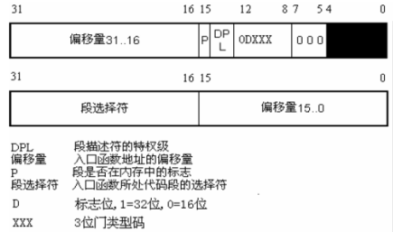
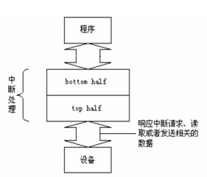
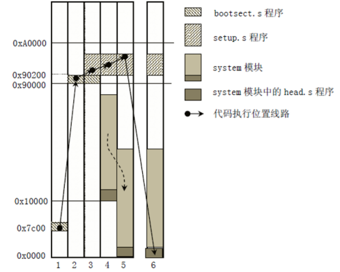
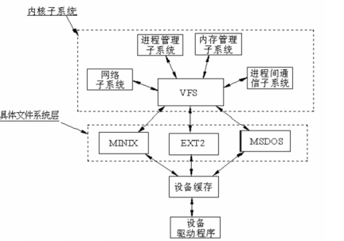
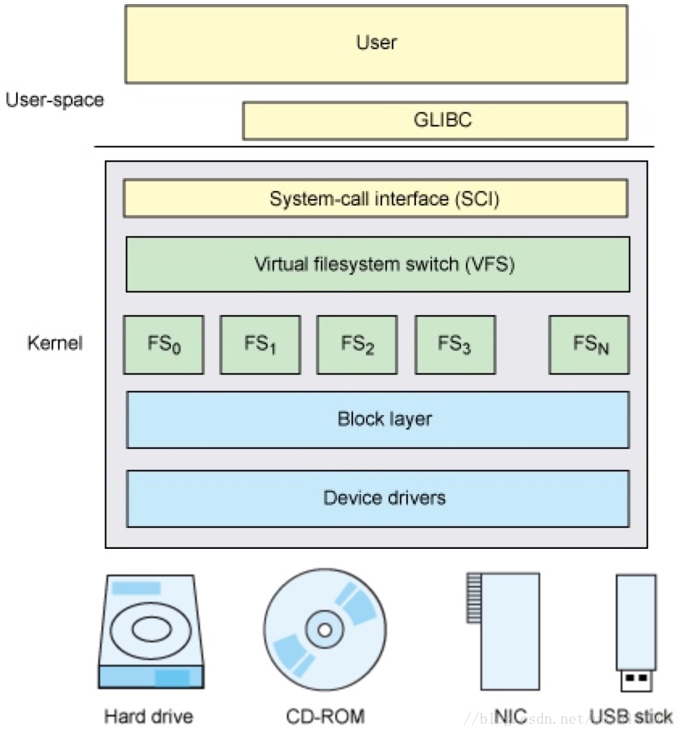
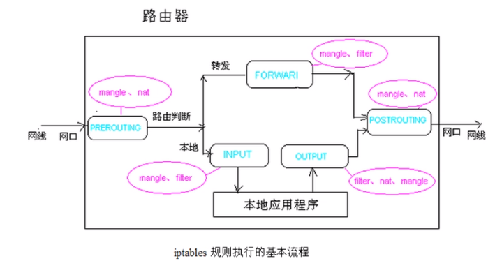
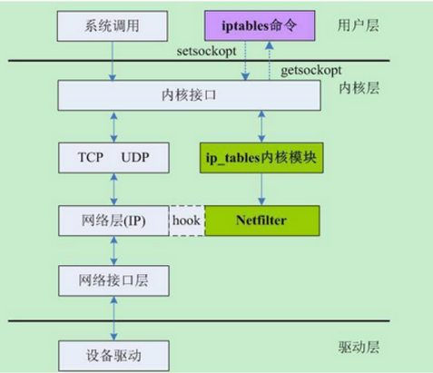
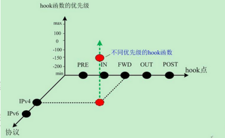
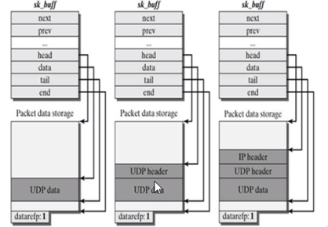

# 内核开发
* 要点
    * 不能访问C库和标准C头文件
    * 必须使用GNU C
    * 内核编程缺乏像用户空间那样的内存保护机制
    * 难以进行浮点运算
        * 用户空间中做浮点运算时, 内核会捕获陷入, 并完成从整数操作到浮点数操作的模式转换. 但内核本身不能陷入. 在内核中使用浮点数时, 除了要人工保存和恢复浮点寄存器, 还有其他琐碎的事情要做. 
    * `没有内存保护机制`, `内存不分页`. 
    * 内核给每个进程只有很小一个定长堆栈. 
        * 在x86上, 在编译时设置栈大小, 可以是4K或8K. 
        * 在历史上, 内核栈大小是两页(32位是8K, 64位是16K)
    * 由于内核支持异步中断, 抢占和SMP(多处理), 因此要时刻注意同步和并发, 保证不出现竞争条件(常用到自旋锁和信号量). 
* 内核源代码
    * 内核头文件: `/usr/src/linux-headers-$(uname -r)`
    * 目录树
        * init: 初始化
        * arch: 架构
            * `<arch>/include/asm`
        * drivers: 驱动程序
        * fs: 文件系统
        * net: 网络
        * mm: 内存管理模块
        * ipc: 通讯
        * kernel: 内核运行时库(字符串操作等)
        * include: 内核开发需要的头文件
        * scripts: 
            * `extract-vmlinux`: 用来将vmlinuz等文件解析为vmlinux
* 名词
    * LKM(Loadable Kernel Module): 可加载内核模块

## 内核基础理论
* 进程
    * 写时拷贝: `fork`的时候, 只复制父进程的页表
    * 在内核中获取当前用户进程PID: 
        * `pid = current->pid;`
        * `pid = task_pid_nr(current);`

* 中断机制
    * 中断向量表(256项)
        * `异常`: 
            * 要点
                * cpu内部的中断, IF标志保持不变, 不关. 
                * 在产生时必须考虑与处理器的时钟同步. (因此异常也被称为`同步中断`)
            * 类型
                * `故障`(fault): `除零`, `缺页`, `越界`, `堆栈段错误`. 
                * `陷阱`(trap): int 3, 溢出等(有意为之). 用于系统调用. 
        * `中断`: 
            * 要点
                * cpu外的其它硬件中出现, `IF标志清零, 关中断`. `要求中断处理要快`, 不然性能低. 
                * 不用与处理器的时钟同步, 随时都可以产生. 
            * 类型
                * `非屏蔽中断`: 计算机内部硬件出错引起异常
                * `屏蔽中断`
        * 中断向量编号
            * 0-31: 异常和非屏蔽中断
            * 32-47: 由i/o设备引起的中断, 分配给屏蔽中断
            * 48-255: 软中断. 0x80为系统调用, 执行`int 0x80`后cpu切换到内核态, 执行`system_call`内核函数. 
    * 中断描述表IDT
        * 门: IDT表中的每一项(8字节)
            * 3位的门类型码
                * `中断门`: 110, DPL-0, 关中断
                * `陷阱门`: 111, DPL-0, 不关中断
                * `系统门`: 010, DPL-3 (向量号3, 4, 5, 0x80)

            

    * 中断上半部和下半部
        * 上半部: 快, 关中断. 硬件中断. 
        * 下半部: 开中断. 可以延后执行的任务. 可以被中断打断. 
            * `BH`(2.4之前): 对bh函数执行严格串行化. 一次只有一个cpu执行. 
            * `softirp`: 
                * 产生后不是马上可以执行, 必须等待内核的调度. 
                * 软中断不能被自己打断, 只能被硬件中断打断. 
                * 同一个软中断可运行在不同cpu. 所以软中断必须涉及为可重入的函数(允许多个cpu同时操作), 因此需要使用**自旋锁**来保护其数据结构. 
                * 软中断是静态分配的, 内核编译好后就不能改变. 添加后要重新编译内核. 
            * `tasklet`: 同一个tasklet不能运行在不同cpu, 多个不同类型的tasklet则可以并行运行在多个cpu上. 

                ```cpp
                static void tasklet_handler(unsigned long value) {
                    ......
                    // 开中断, 即可以响应其它中断
                    // 在tasklet_handler中分配内存或拿互斥体的时候, 不能睡眠
                }

                tasklet_struct my_tasklet;
                static unsigned long data = 0;
                tasklet_init(&my_tasklet, tasklet_handler, data); 
                tasklet_schedule(&my_tasklet); // 放到调度队列中等待调度

                // 处在中断上下文, 不能睡眠
                ```
            * `workqueues` 工作队列: 
                * 也在内核态运行
                * 不在中断上下文中, 因此可以睡眠
                * 能在不同进程间切换, 以完成不同工作
                * 私有工作队列: 

                    ```cpp
                    void my_func(struct work_struct *work) {
                        ......
                    }

                    struct workqueue_struct *my_queue;
                    my_queue = create_workqueue("my_queue");
                    struct work_struct my_work;
                    INIT_WORK(&my_work, my_func);
                    queue_work(my_queue, &my_work);
                    destroy_workqueue(my_queue);
                    ```

                * 共享工作队列: 

                    ```cpp
                    schedule_work(&my_work);
                    ```

        * 需要放在中断处理程序中执行的任务
            * 任务对时间非常敏感
            * 和硬件相关的任务
            * 要保证不被其它中断打断的任务

        
    
* 进程上下文和中断上下文
    * 上下文context: 包括寄存器变量, 进程打开的文件, 内存信息等. 
        * 用户级上下文: 正文, 数据, 用户堆栈, 共享存储区
        * 寄存器上下文: 通用寄存器, 程序寄存器, 处理器状态寄存器, 栈指针
        * 系统级上下文: 进程控制块(`task_struct`), 内存管理信息(`mm_struct, vm_area_struct, pgd, pte`), 内核栈
    * 中断上下文
        * 硬件传递过来的参数和内核需要保存的一些其它环境(主要是当前被中断的进程环境)
        * 中断上下文无关特定进程
        * 运行在中断上下文的代码不能做以下事情: 
            * 睡眠或放弃cpu. 内核在进入中断前会关闭进程调度, 一旦睡眠或放弃cpu, 系统会死机. 
            * 尝试获得信号量, 因为若没有获取信号量, 代码会睡眠, 结果同上. 
            * 执行耗时任务, 因为内核要响应大量服务和请求, 占用cpu太久会严重影响系统性能. 
            * 访问用户空间的虚拟地址. 
* 内核启动过程
    * 加电, 复位. 
    * bios启动: 上电自检, 然后对系统内的硬件设备进行检测和连接, 把测试所得数据存放到bios数据区. 从磁盘读入boot loader, 将控制权交给它. 
    * boot loader
    * os初始化
    
    

* linux文件系统
    * vfs提供一个统一接口(`file_operation`)

    
    <br>
    


* 微内核与宏内核(单一内核)
    * 微内核系统
        * windows nt, minix, mach
        * 每个模块对应一个进程, **模块之间通过消息传递机制进行通信**. 系统启动后, kernel, mm, fs系统进程在各自空间运行main函数循环等待消息. 
    * 宏内核系统
        * unix, linux
        * 内部也分模块, **模块间通信方式是一个模块调用另一个模块的导出函数**. 

## 开发
* 参考文档
    * 内核API参考文档
        * [kernelAPI](cs.bham.ac.uk/~exr/lectures/opsys/13_14/docs/kernelAPI/)
* 内联函数
    * 消除函数调用和返回带来的开销, 但会增加内存开销
    * 用于对时间要求较高的代码
    * 用`static`加`inline`限定
* 汇编
    |Intel|AT&T|
    |-|-|
    |`mov al, bl`|`movb %bl, %al`|
    |`mov ax, bx`|`movw %bx, %ax`|
    |`mov eax, ebx`|`movl %ebx, %eax`|
    |`mov eax, dword ptr [ebx]`|`movl (%ebx), %eax`|
    |`mov eax, [ebx + 20h]`|`movl 0x20(%ebx), %eax`|
    |`add eax, [ebx + ecx * 2h]`|`addl (%ebx, %ecx, 0x2), %eax`|
    |`lea eax, [ebx + ecx]`|`leal (%ebx, %ecx), %eax`|
    |`sub eax, [ebx + ecx * 4h - 20h]`|`subl -0x20(%ebx, %ecx, 0x4), %eax`|
    |立即数: 8|立即数: $8|

    * linux内核嵌入式汇编
        * `__asm__ __volatile__("<asm routine>", : output : input : modify);`
        
            ```cpp
            void f(long seg) {
                long __lm;
                __asm__ __volatile__("lsll %1, %0" : "=r" (__lm) : "r" (seg));
            }

            // 对应的汇编代码如下
            // movl seg, %ebx
            // lsll %ebx, %eax
            // movl %eax, __lm
            ```
        
        * 分析汇编
            * '='表示输出; '&'表示寄存器不能重复; 字母含义如下表. 

                |字母|含义|
                |-|-|
                | m, v, o | 表示内存单元 |
                | R | 表示任何通用寄存器 |
                | Q | 表示寄存器eax, ebx, ecx,edx之一 |
                | I, h | 表示直接操作数 |
                | E, F | 表示浮点数 |
                | G | 表示“任意” |
                | a, b, c, d | 表示要求使用寄存器eax/ax/al, ebx/bx/bl,  ecx/cx/cl或edx/dx/dl |
                | S, D | 表示要求使用寄存器esi或edi |

            * 寄存器`%0`, `%1`依次从`output`, `input`中用到的寄存器开始编码(如上面的代码, 则是将`__lm`变量值存到`%0`寄存器, 将`%1`寄存器的值存到`seg`变量)
            * `jne 2f`中, `2`是汇编代码段的编号(作为跳转目标), `f`表示向前(在它下面的代码), `b`表示向后(在它上面的代码). 每行汇编指令后面有`\n\t`, `\n`换行, `\t`是为了gcc把嵌入式汇编代码翻译成汇编代码时能保证换行和留有一定空格. 
        * `asm volatile("rdtsc": "=a" (low), "=d" (high));` // 调用rdtsc指令, 返回64位时间戳(`tsc`寄存器), 低32位和高32位分别存于low和high变量

* hello world

    ```cpp
    /*************** hello.c ***************/
    #include <linux/init.h>
    #include <linux/module.h>
    #include <linux/kernel.h>
    #include <linux/moduleparam.h>
    MODULE_LICENSE("Dual BSD/GPL");
    MODULE_AUTHOR("reversefish@mallocfree.com");
    MODULE_DESCRIPTION("This is hello module");
    MODULE_ALIAS("A simple example");

    unsigned int hello_data=100;
    EXPORT_SYMBOL(hello_data);  // 导出符号. 其它地方用extern int hello_data 导入之

    static int times = 5;
    static char *who = "world";
    module_param(times, int, S_IRUSR); // 作为模块参数: insmod hello.ko times=5
    module_param(who, charp, S_IRUSR);

    static int hello_init(void)
    {
        printk(KERN_ALERT "Hello, world!\n");
        return 0;
    }

    static void hello_exit(void)
    {
        printk(KERN_ALERT "Goodbye, My Dear World!\n");
    }

    module_init(hello_init); // 注册初始化函数
    module_exit(hello_exit); // 注册退出函数

    ```
* 应用层代码

    ```cpp
    #include <stdio.h>
    #include <unistd.h>
    #include <fcntl.h>

    int main(void)
    {
        int fd, i;
        int data;
        fd = open("/dev/hello", O_RDONLY);
        if (fd < 0)
        {
            printf("open /dev/hello error\n");
            return 0;
        }
        for(i = 0; ; i++)
        {
            read(fd, &data, sizeof(data));
            printf("read /dev/hello is %d\n",data);
            sleep(1);
        }
        close(fd);
        return 0;
    }

    ```
* Makefile生成

    ```shell
    EXTRA_CFLAGS := -g
    obj-m = hello.o
    hello-objs := file1.o file2.o # 有多个源文件时加此行
    KVERSION = $(shell uname -r) # 内核版本号

    # 如果引用了hello2中导出的符号, 则需: 
    KBUILD_EXTRA_SYMBOLS=/mnt/hgfs/blabla/hello2/Module.symvers

    all: 
        make -C /lib/module/$(KVERSION)/build M=$(PWD) modules
    clean:
        make -C /lib/modules/$(KVERSION)/build M=$(PWD) clean
    ```

    * make以后生成`hello.ko`
    * 模块相关命令
        * `sudo insmod hello.ko`: 加载ko文件
        * `sudo rmmod hello.ko`: 卸载ko文件
        * `lsmod`: 可列出系统模块
        * `modinfo hello`
        * `dmesg | tail`: 打印最近内核输出

* ubuntu中模块自启动
    * 把模块文件放到lib目录: `/lib/modules/2.6.32.65/kernel/test/hello.ko`
    * `sudo vim /etc/modules`并添加模块名hello

* 字符设备驱动
    * `sudo insmod hello.ko`
    * `cat /proc/devices`查看安装驱动生成的设备主功能号(如251)
    * `sudo mknod /dev/hello c <主功能号> 0`创建设备节点, 这样就会在`/dev`目录下创建设备文件. 
        * `mknod [OPTION] NAME TYPE [MAJOR MINOR]`
            * `TYPE`
                * `c`: 表示字符设备
    * 编译运行客户端程序

* 部分常用API
    * 数据传递
        * 在内核层不能直接操作用户层地址的数据, 需要拷贝. 相关API如下: 
            * `copy_from_user(to, from, len)`: 
            * `strncpy_from_user(to, from, max_len)`: 
        * 内核层函数对用户层变量的声明一般要加一个`__user`标识. 
    * `kallsyms_lookup_name(const char* name)`: 根据所给符号名称, 获取符号地址. 比如传入`sys_call_table`, 可获取系统调用表的地址. 
    * `call_usermodehelper`: 用于在内核层中执行用户态程序或系统命令. 

* linux内核调试
    * oops
        * 两种可能: `killed`, `panic`
        * 设置`panic`
            * `etc/sysctl.conf`(改完后用`sudo sysctl -p`或`sudo echo 1 > /proc/sys/kernel/panic_on_oops`使之生效)
                * `kernel.panic_on_oops=1`
                * `kernel.panic=20`: panic error中自动重启, 等待20秒
        * oops错误码
            |-|第2位|第1位|第0位|
            |-|-|-|-|
            |0|内核|读|没有找到页|
            |1|用户模式|写|保护错误|
        * 将oops保存为文件
            * 用apt安装`kexec-tools`和`linux-crashdump`
            * 编辑`/etc/default/kexec`: `LOAD_KEXEC=true`, 重启
            * `sudo /etc/init.d/kdump start`
            * `sudo echo "c" > /peoc/sysrq-trigger`
            * `ls /var/crash/vmcore`
            * 下载和`uname -a`的版本信息匹配的内核符号: http://ddebs.ubuntu.con/pool/main/l/linux/
            * `dpkg -i linux-image-2.6.32-65-generic-dbgsym_2.6.32-65.131_amd64.ddeb` 将在`/usr/lib/debug/modules/$(uname -r)/`下生成用于调试的vmlinux
            * `sudo crash /usr/lib/debug/boot/vmlinux-2.6.32-65-generic/var/crash/vmcore`
            * 运行`bt/ps/log`查看信息
    * printk
        * `printk(KERN_DEBUG "Here I am: %s:%i\n", __FILE__, __LINE__);`
        * 日志级别
            * `KERN_EMERG`: 紧急事件消息, 系统崩溃前提示, 表示系统不可用
            * `KERN_ALERT`: 报告消息, 表示必须立即采取措施
            * `KERN_CRIT`: 临界条件, 通常涉及严重的硬件或软件操作失败
            * `KERN_ERR`: 错误条件, 驱动程序常用之来报告硬件的错误
            * `KERN_WARNING`: 警告条件, 对可能出现问题的情况进行警告
            * `KERN_NOTICE`: 正常但又重要的条件, 用于提醒
            * `KERN_INFO`: 提示信息, 如驱动程序启动时, 打印硬件信息
            * `KERN_DEBUG`: 调试级别的信息
        * `/var/log/messages`
        * 若`klogd`没有运行, 消息不会传递到用户空间, 只能查看`/proc/kmsg`
        * `echo 8 > /proc/sys/kernel/printk`: 修改控制台的日志级别(0-8, 如果是8的话, 0-7的消息都可以显示在控制台上)
        * 实时打印`dmesg`信息: 
            * `sudo cat /proc/kmsg`
            * `tail -f /var/log/dmesg`: (在ubuntu中会说找不到这个文件)
            * `watch "dmesg | tail -20"`
    * gdb
        * 无法在内核中修改数据, 加断点, 单步调试, 只能查看信息
    * kdb: 只能在2.6版旧内核使用, 需要打上补丁; 优点是不需要两台机器进行调试, 直接在本机进行操作
    * kgdb
        * ubuntu内核已开启KGDB选项: `cat /boot/config-$(uname -r) | grep -i "GDB"`
        * vmlinux
            * `/boot/`
            * 内核镜像, 也是ELF
            * 有`.text`和`.data`
            * 没有符号表, 可以用[kdress](https://github.com/elfmaster/kdress). `kdress`会从 `System.map` 文件或者`/proc/kallsyms` 中获取符号相关的信息, 会根据这两种方式的可读性优先选取一种. 然后通过为符号表创建节头, 将获取到的符号信息重建到内核可执行文件中. 
    * strace
    * 内核配置项
        * `CONFIG_DEBUG_KERNEL`: 用于使其它调试选项可用. 

* linux内核数据结构
    * `file_operation`结构体: 是把系统调用和驱动程序关联起来的关键数据结构. 
    * 链表
        * `<linux/list.h>`
            ```c
            struct list_head {
                struct list_head *next;
                struct list_head *prev;
            };

            // 在自定义结构体重加上list_head结构体成员
            struct myStruct {
                int i;
                struct list_head list;
            };

            // 初始化方法1
            struct myStruct s = {
                .i = 0,
                .list = LIST_HEAD_INIT(s.list)
            }
            // 初始化方法2
            INIT_LIST_HEAD(&s.list)

            // 遍历
            struct list_head *p;
            struct myStruct *pS;
            list_for_each(p, &s.list) {
                pS = container_of(p, struct list_head, list);
            }
            // 或者: 
            list_for_each_entry(pS, &s.list, list) {
                ... 
            }
            // list_for_each_entry_reverse, 反向遍历

            // 需要在遍历的时候删除: 
            list_for_each_entry_safe(pS, next, &s.list, list) {
                // 删除节点
            }
            ```
        * `container_of(ptr, type, member)`: 获取`ptr`指向的`type`型结构体中的`member`成员. (相当于windows内核中的`CONTAINING_RECORD`宏)
        * `list_add(struct list_head *new, struct list_head *head)`: 在head节点后插入new节点. 
        * `list_add_tail(struct list_head *new, struct list_head *head)`: 在head节点前插入new节点. 
        * `list_del(struct list_head *entry)`: 删除entry节点. 
        * `list_del_init(struct list_head *entry)`: 删除entry节点. 如果还需要继续使用entry, 则可以用这个函数将entry从链表中移除. 
        * `list_move(struct list_head *list, struct list_head *head)`: 将list节点移到head节点后面. 
        * `list_move_tail(struct list_head *list, struct list_head *head)`: 将list节点移到head节点前面. 
        * `list_empty(struct list_head *head)`: 若链表为空, 返回非零值. 
        * `list_splice(struct list_head *list, struct list_head *head)`: 将list节点指向的链表插入到head节点后面. 
        * `list_splice_init(struct list_head *list, struct list_head *head)`: 同上, 不过list指向的链表要被重新初始化. 
    * 队列`kfifo`
        * 
* linux内核内存
    * 分类
        * DMA-capable: 在x86, 是内存的前16M空间, 给ISA设备用. 新的PCI设备没有此限制. 
        * 普通内存
        * 高地址内存: 在内核中不能直接访问, 需要映射. 
    * `void *kmalloc(size_t size, int flags); `
        * `flags`
            * `GFP_KERNEL`: 空闲内存较少时, 可能进入睡眠, 等待一个页面. 使用它来分配内存的函数必须可重入, 且不能在原子上下文(即中断上下文)中运行. 
            * `GFP_ATOMIC`: 在中断上下文或其它非进程上下文中分配内存时使用之. 
            * `GFP_USER`: 为用户空间分配内存, 可能睡眠. 
            * `GFP_HIGHUSER`: 类似`GFP_USER`, 若有高端内存, 就从高端内存分配. 
            * `__GFP_DMA`: 若指定之, 则只在DMA中分配内存. 
            * `__GFP_HIGHMEM`: 三个内存区域都用来分配内存. 

        ```cpp
        #include <linux/slab.h>
        char *ptr = (char *) kmalloc(1024, GFP_KERNEL);
        memset(pre, 0, 1024);
        kfree(ptr);
        ```

    * `vmalloc`: 在虚拟空间分配. 

        ```cpp
        #include <linux/vmalloc.h>
        char *ptr = (char *) vmalloc(1024);
        if (ptr == NULL) return 0;
        memset(pre, 0, 1024);
        vfree(ptr);
        ```

    * `__get_free_pages`: 分配页

        ```cpp
        // 分配2的3次方个内存页
        char *ptr = (char *) __get_free_pages(GFP_KERNEL, 3); 
        if (ptr == NULL) return 0;
        memset(pre, 0, PAGE_SIZE << 3);
        free_pages((unsigned long) ptr, 3);
        ```
    
    * `kmem_cache_alloc`

    * 区别和选择
        * `kmalloc`, `__get_free_pages`申请的虚拟内存位于物理内存映射区域(`<=896M`), 而且在物理上也是连续的, 它们与真实物理地址只有一个固定的偏移, 因此存在简单的转换关系. 
        * `kmalloc`最小32或64字节, 最大128K字节; 速度快, 但不清零; 分配太多时, 可能降低系统的响应速度(因为swap); 
        * `vmalloc`分配的一般>896M; 无法在原子上下文使用; 需要分配页表. 
        * `kmem_cache_alloc`: 用于分配大量相同大小的对象. 
        * `__get_free_pages`: 分配大块. 适用于以页为单位分配内存的情况. 

* linux内核多线程和中断处理
    * `kthread_run` 和 `kthread_stop`

        ```cpp
        tatic struct task_struct * MyThread = NULL;

        static int MyPrintk(void *data)
        {
            char *mydata = kmalloc(strlen(data)+1,GFP_KERNEL);
            memset(mydata,'\0',strlen(data)+1);
            strncpy(mydata,data,strlen(data));
            while(!kthread_should_stop()) // kthread_stop后该函数返回true
            {
                SLEEP_MILLI_SEC(1000);
                printk("%s\n",mydata);
            }
            kfree(mydata);
            return 0;
        }
        static int __init init_kthread(void)
        {
            MyThread = kthread_run(MyPrintk,"hello world","mythread");
            return 0;
        }
        static void __exit exit_kthread(void)
        {
            if(MyThread)
            {
                printk("stop MyThread\n");
                kthread_stop(MyThread);
            }
        }
        module_init(init_kthread);
        module_exit(exit_kthread);
        ```

    * `kernel_thread`(无法运行)
    * 内核同步和互斥
        * struct semaphore
            * `DEFINE_SEMAPHORE(name)`
            * `sema_init(struct semaphore *sem, int val)`
            * `down(struct semaphore *sem)`: 拿不到会一直等
            * `down_interruptible(struct semaphore *sem)`: 试图拿, 拿不到时可被打断, 不再等待. 
            * `down_trylock(struct semaphore *sem)`: 试图拿, 拿不到就走了, 不会睡眠. 所以可用在中断上下文(前两个不可). 
        * struct mutex (2.6.16后)
            * `mutex_init(struct mutex *mutex)`
            * `DEFINE_MUTEX(mymutex)`
            * `mutex_lock(&mymutex)`: 不可唤醒
            * `mutex_unlock(&mymutex)`: 
            * `mutex_lock_interruptible(&mymutex)`: 
            * `mutex_trylock(&mymutex)`: 
        * struct completion (类似于event, 用于同步)
            * `struct completion my_completion`: 
            * `init_completion(&my_completion)`: 
            * `wait_for_completion(&my_completion)`: 
            * `complete(&my_completion)`: 唤醒一个线程
            * `complete_all(&my_completion)`: 唤醒所有线程
        * spinlock_t
            * `spinlock_t my_lock = SPIN_LOCK_UNLOCKED;`
            * `spin_lock_init(&my_lock)`
            * `spin_lock(&my_lock)`
            * `spin_unlock(&my_lock)`
        * rwlock_t
        * atomic variables 原子操作
            * `atomic_t v`: 
            * `atomic_t v = ATOMIC_INIT(0)`: `v = 0` 
            * `atomic_set(atomic_t *v)`: `v = i`
            * `int x = atomic_read(atomic_t *v)`: `x = v`
            * `atomic_add(i, atomic_t *v)`: `v += i`
            * `atomic_sub(i, atomic_t *v)`: `v -= i`
            * `atomic_inc(atomic_t *v)`: `v++`
            * `atomic_inc(atomic_t *v)`: `v--`
            * `set_bit(nr, void *addr)`: `*addr |= nr`
            * `clear_bit(nr, void *addr)`: `*addr &= ~(nr)`
        * timer 计时器
            * `timer_list s_timer`
            * `init_timer(&s_timer)`
            * `s_timer.function = &timer_handler`
            * `s_timer.expires = jiffies + HZ` `jiffies`记录着从开机到当前的时钟中断次数, `HZ`一般是一秒钟中断产生的次数, 两者相加表示一秒钟
            * `add_timer(&s_timer)`
            * `mod_timer(&s_timer, jiffies + HZ)`
            * `del_timer(&s_timer)`
        * RCU(Read-Copy Update)
            * 参考
                * https://blog.csdn.net/qq_35399548/article/details/122846896
            * 限制
                1. RCU只能保护动态分配的数据结构, 并且必须是通过指针访问该数据结构
                2. 受RCU保护的临界区内不能sleep
                3. 读写不对称, 对writer的性能没有特别要求, 但是reader性能要求极高. 
                4. reader端对新旧数据不敏感. 

* 网络防火墙Netfilter
    * iptables

        
    
    * 规则: `iptables -t filter -A INPUT -s 172.16.0.0/16 -p udp --dport 53 -j DROP`
        * `-t filter`: 表示指定filter表
            * `filter`: 
            * `nat`: 
            * `mangle`: 
        * `-A`: 追加
            * `-R`: 替换
            * `-D`: 删除
            * `-P`: 设置默认规则
            * `-F`: 清空
        * `INPUT`: 链
            * `PREROUTINE`
            * `FORWARD`
            * `POSTROUTINE`
            * `OUTPUT`
        * `-s`: 指定源地址
        * `-p`: 指定协议
        * `--dport`: 指定目的端口
        * `-j DROP`: 指定如何处理
            * `REJECT`
            * `ACCEPT` 

        
    
    * nf_hooks
        * `struct list_head nf_hooks[NPROTO][NF_MAX_HOOKS]`: 一个全局变量, 是一个二维数组, 第一维指定协议族, 第二维指定hook类型. 
        * 注册一个netfilter hook就是在上述数组的链表中添加一个新节点. 
            ```cpp
            struct nf_hook_ops ipprint_ops = {
                .list =  {NULL,NULL},
                .hook = ipprint_func,   // 处理函数
                .pf = PF_INET, // ipv4
                //.hooknum = NF_INET_PRE_ROUTING,
                .hooknum = NF_INET_LOCAL_IN,
                .priority = NF_IP_PRI_FILTER+2 // 优先级
            };

            static int __init ipprint_init(void) {
                nf_register_hook(&ipprint_ops); // 注册钩子
                return 0;
            }


            static void __exit ipprint_exit(void) {
                nf_unregister_hook(&ipprint_ops);
            }

            ```

            * `hooknum`
                * `NF_INET_PRE_ROUTINE`: 完整性校验后, 选路确定前
                * `NF_INET_LOCAL_IN`: 选路确定后, 且数据包的目的地是本地主机
                * `NF_INET_FORWARD`: 目的地是其它主机的数据包
                * `NF_INET_LOCAL_OUT`: 来自本机进程的数据包在其离开本地主机的过程中
                * `NF_INET_POST_ROUTINE`: 在数据包离开本地主机"上线"之前. 

            

        * sk_buff
            * `head`: 缓冲区头部
            * `end`: 缓冲区尾部
            * `data`: 数据头部
            * `tail`: 数据尾部
            
            

* rootkit
    
    * HOOK
        * 除非禁用寄存器 cr0 的写保护位或者修改 PTE, 否则不能够对内核的 text 段进行修改
        * `sys_call_table`
            * 获取其地址的方法: 
                * `cat /proc/kallsyms | grep sys_call_table`
                * `cat /boot/System.map-<内核版本号> | grep sys_call_table`
                * `kallsyms_lookup_name("sys_call_table")`
            * 这个表有写保护, 需要放开写保护. 
                * 改写cr0寄存器. 
                    ```cpp
                        write_cr0(read_cr0() & (~0x10000));

                        // 改sys_call_table中的表项
                        
                        write_cr0(read_cr0() | 0x10000);
                    ```
                * 在Ubuntu18以后版本测试时, 发现上述代码会引发错误. 因此可用另一种方法: 
                    ```cpp
                        unsigned int level;
                        pte_t* pte = lookup_address((unsigned long) sys_call_table, &level);
                        set_pte_atomic(pte, pte_mkwrite(*pte));

                        // 改sys_call_table中的表项
                        
                        set_pte_atomic(pte, pte_clear_flags(*pte, _PAGERW));
                    ```
                * gdb中查看`sys_call_table`的某一项(如, 第一项): `x/gx &sys_call_table+1`
        * 函数蹦床
            * 将原函数的前5~7个字节改成跳转指令跳到钩子. 
            * 
            ```x86asm
            push $address 
            ret
            ```
                
# 错误记录
* 驱动编译错误记录
    * `error: ISO C90 forbids mixed declarations and code [-Werror=declaration-after-statement]`
        1. 
            ```cpp
            int a;
            void func() {
                a = 2;
                int c; // 因为在定义c之前使用了已定义变量a, 所以编译不通过
            }
            ```
        2. 在定义变量前使用了`printk`也会编译不通过. 
    * `error: too many arguments for format`
    > 检查`printk`中格式符有没有和变量一一对应. 

* 驱动异常记录
    * `error_code(0x0001) - permissions violation`
    > 在内核层直接对用户层变量调用`printk`或`str`系列函数时会有此错误. (但是`printk`打印用户层变量的**地址**(即使用`%p`)则无此问题)
    > 应该先调用`copy_from_user`等函数将用户层的数据拷到内核层, 再进行操作. 