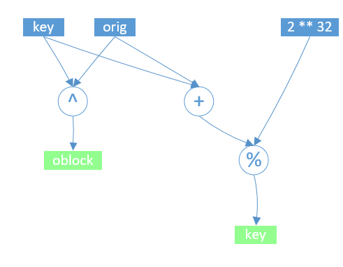

# 标记
    * a -> b: 表示方法a调用了方法b
    * a => b: 表示先调用方法a再调用方法b
    * a -> b => c: 表示在方法a的实现中, 依次调用了b和c
    * a => {...}: 花括号中是Ruby语句
    * M1::C1#f1: 表示模块M1下的C1类的实例方法f1
    * M1::C1.f1: 表示模块M1下的C1类的类方法f1

# pry调试方法
* 在要分析的地方加一行`binding.pry`, 即加上一个断点
* 指令
    * `backtrace`: 栈跟踪
    * `whereami`: 显示当前执行行
    * `up`: 沿着调用栈回溯到上一个调用的上下文
    * `down`: 反之
    * `next`: 执行下一行代码
    * `finish`: 运行至函数返回
    * `break`: 列出所有断点
        * `break SomeClass#run`: 在`SomeClass#run`方法开始处中断.
        * `break Foo#bar if baz?`: 当`baz?`为true时在`Foo#bar`方法处中断.
        * `break app/models/user.rb:15`: 在`user.rb`的15行设置断点.
        * `break 14`: 在当前文件的第14行设置断点
        * `break --condition 4 x > 2`: 给断点4设置条件.
        * `break --condition 3`: 移除断点3处的条件.
        * `break --delete 5`: 删除断点5.
        * `break --disable-all`: 禁用所有断点
        * `break --show 2`: 打印断点2的详情         

# 自定义exploit中的`exploit`函数的调用栈
* `Msf::ExploitDriver.job_run_proc(ctx#Array)`  (`lib/msf/core/exploit_driver.rb`): 其中执行了`exploit.exploit`. 变量`exploit, payload`分别是编码后和编码前的payload对象. (执行`payload.generate`可得到原始payload的字符串)
* `Msf::ExploitDriver.run`  (`lib/msf/core/exploit_driver.rb`): 调用了`start_bg_job`, 其中以回调的方式调用了`job_run_proc`, 并把编码前和编码后的payload对象放在`ctx`变量中传过去

# 载荷的生成过程分析
* 编码器: 用于消除载荷中的坏字节(如'\x00'), 以及为载荷编码(去除坏字节的方式即是进行编码)
* `lib/msf/core/encoded_payload.rb`文件: `Msf::EncodedPayload#generate` -> [`generate_raw` => `encode` => `generate_sled` => {`self.encoded = (self.nop_sled || '') + self.encoded`}], 最终载荷的组成是**nop雪橇 + 解码器存根(除去最后的0-4个字节, 这些拼到payload中来对齐) + 编码后的payload**
    * `Msf::EncodedPayload#generate_raw` -> `generate_complete` -> `Msf::Payload::Windows::ReverseTcp.generate` -> `generate_reverse_tcp`: 产生汇编代码, 并通过`Metasm::Shellcode.assemble(Metasm::X86.new, combined_asm).encode_string`进行汇编得到字节码. 
    * `Msf::EncodedPayload#encode`: 如果没有指定encoder, 这个方法会依次尝试符合指定的cpu架构和平台架构的各个编码器. 每个编码器都可能对载荷进行反复编码(用户可指定迭代次数). 如果编码成功了(载荷中没有坏字节, 且载荷的大小(包含nop滑板)大于要求的最小字节数), 则停止编码. 
        * `Msf::Encoder#encode` -> `do_encode` -> [`MetasploitModule#decoder_stub` => `MetasploitModule#encode_block`]. 后面这两个方法产生的字符串拼接起来得到编码后的payload. 各个编码器都会覆写这两个方法. 不同编码器会实现一个`MetasploitModule`类. 下面以`x86/shikata_ga_nai`编码器为例: 
            * `decoder_stub`: 生成**解码器存根**. 各个编码器会独立实现该方法. 在该方法的上下文中, `state.orig_buf`为未编码payload, `state.buf`最后会保存编码后的payload. 
                * `generate_shikata_block`: 
                    * 创建了大量`Rex::Poly::LogicalBlock`实例: 
                        * 每个这类实例中有`@perms`列表(实例初始化的时候, 二参及以后的参数形成的列表转为`@perms`), 列表中的每一项代表一条可选的指令. 
                        * `@perms`的元素既可以是代表机器码的字符串, 也可以是`Proc`实例(它们可通过调用`Proc#call`返回代表机器码的字符串). 
                        * 使用`Rex::Poly::LogicalBlock#rand_perm`方法可随机选`@perms`中的一条指令. 
                        * `Rex::Poly::LogicalBlock#depends_on`使这些实例关联起来. 其中一个实例为loop_inst, 而代码行`loop_inst.generate(block_generator_register_blacklist, nil, state.badchars)`则是用它生成"多态缓存"(polymorphic buffer), 在generate中该实例以及通过`depends_on`关联起来的实例都会被用到. 
                    * `Rex::Poly::LogicalRegister`实例: 用于代表特定cpu架构下的寄存器编码. 
                        * 初始化: `count_reg = Rex::Poly::LogicalRegister::X86.new('count', 'ecx')`, 其中二参`'ecx'`会传给`Rex::Arch::X86.reg_number`, 这个方法将`'ecx'`先转为大写, 然后传给Ruby的原生方法`Object#const_get`, 这个方法会查询`Rex::Arch::X86`模块中定义的常量, 最终找到`Rex::Arch::X86::ECX`常量, 其值即为ecx寄存器编码. 
                        * 在block实例中调用`regnum_of(<Rex::Poly::LogicalRegister实例>)`, 可得到对应的寄存器编码. 
                    * `loop_inst.generate`: 反复执行`Rex::Poly::Permutation#do_generate`, 直到其返回值`buf`中没有坏字节. 
                        * `generate_block_list(state, level)`: 采用递归的方法生成一个`state.block_list`列表. 
                            1. 对当前block实例的`@depends`列表中的每个block调用`generate_block_list`方法, 把得到的结果附加到`state.block_list`列表. 
                            2. 把`[ self, perm ]`附加到`state.block_list`列表. `self`是本block变量, `perm`是用`rand_perm`生成的. 
                            3. 同1, 不过`@depends`变为`@next_blocks`. 
                        * 迭代上一步得到`block_list`列表, 把每一项中的`perm`转成对应的指令机器码, 拼接到`state.buffer`, 得到解码器存根的机器代码. 
                * 解码器存根的后几个字节会被切出, 放到`state.buf`开头. 其目的是使`state.buf`以4字节对齐. 
            * 解码器存根中有`"XORK"`的标志, 把它替换成一个真实key, 即一个在`encode`函数中生成的, 不带坏字节的key. 这个key是在编码中加密用的. 
                * 将生成的存根(替换上`real_key`之后)反汇编, 可看到如下汇编代码: 
                    ```x86asm
                        mov esi,0xbf9f2758 ; 第二个操作数为real_key
                        fcmovu st5 ; 目的是将FPUDataPointer填充到上述结构体. (执行任意fpu指令都可达到此目的)
                        fnstenv [esp-0xc] ; 把FpuSaveState结构体保存到栈上的esp-0xC处, 则栈顶会保存FPUDataPointer, 即上面fcmovu指令的地址
                        pop ebx ; 
                        sub ecx,ecx ; ecx置零, 作为循环计数器
                        mov cl,0x4b

                        ; 偏移0x10, 循环体的开始处
                        xor [ebx+0x12],esi ; 0x12即是上面fcmovu指令的地址到这段存根的下一个字节的地址的距离, 所以这条指令即是对编码部分的前4个字节开始解码
                        add ebx,byte +0x4
                        db 0x03
                        ; 这段存根少了loop指令, 会在上面xor后还原出来, 如下:
                        ; add esi, [ebx + 0x12] ; 原始数据和第一个key相加, 得到下一个key
                        ; loop 0x10 ; 机器码是\xe2\xf5, \xf5应该是表示从loop指令的下一条指令的地址开始减去11, 得到的地址即为循环头部
                    ```
                    * 如下为28字节的FPU环境变量结构体(引用自: https://www.boozallen.com/insights/cyber/shellcode/shikata-ga-nai-encoder.html)
                    ```
                        ESP[0]: FPUControlWord;
                        ESP[4]: FPUStatusWord;
                        ESP[8]: FPUTagWord;
                        ESP[0x0c]: FPUDataPointer; // 指向上一条FPU指令
                        ESP[0x10]: FPUInstructionPointer;
                        ESP[0x14]: FPULastInstructionOpcode;
                    ```
            * 将原始payload按4个字节一个block, 使用`encode_block`进行编码(不够4字节时在末尾用0填充). 
                * `encode_block`: 使用的是`Msf::Encoder::XorAdditiveFeedback`中的编码方法. 算法如下图所示. `orig`是原始字节(4字节). `oblock`是输出的编码后的4字节. 将`key`和`orig`相加后截取低4个字节, 作为下一轮编码用的key. 

                    
                
    * `Msf::EncodedPayload#generate_sled`: 生成nop雪橇, 会加在编码后的payload前面. 
        * `modules/nops/x86/single_byte.rb`
            * 从一堆无用指令中取一定数量指令, 比如: `nop`; `xchg eax,edi`; `cdq`; `dec ebp`; `inc edi`; `aaa`; `daa`; `das`; `cld`; `std`; `clc`; `stc`; `cmc`; `cwde`; `lahf`; `wait`; `salc`等

# nop雪橇生成器