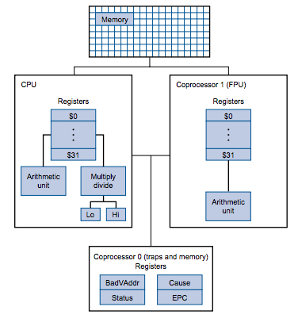
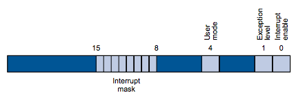
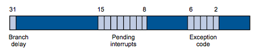

* MIPS: **Microprocessor without interlocked piped stages architecture**, 无内部互锁流水级的微处理器. 
* 参考资料
    * (MIPS 通用寄存器)[https://e-mailky.github.io/2017-02-14-mips-registers]
    * (MIPS32寄存器详解)[https://www.cnblogs.com/justin-y-lin/p/15010301.html]
    * https://binhack.readthedocs.io/zh/latest/assembly/mips.html
    * (MIPS32 指令集)[https://elearning.ecnu.edu.cn/bbcswebdav/courses/COMS0031131014.02.2017-20182/MIPS%E6%8C%87%E4%BB%A4%E9%9B%86.pdf]
    * (MIPS教程)[https://www.xiaoaimi.net/mips/teach.html]
    
# 处理器
    

* 协处理器
    * 协处理器0(CP0)是`系统控制协处理器`, 主要实现`CPU配置`, `高速缓存控制,` `异常和中断控制`, `定时器`, `事件计数器`, `奇偶校验`, `错误检测`等功能. 
    * 协处理器1是`浮点协处理器`, 是浮点运算单元. 
    * 协处理器2偶尔用于定制的ISA扩展或者在几个SoC应用中提供专用的寄存器. 
    * 协处理器3是`浮点指令处理器`, 主要处理浮点运算指令, 即浮点运算的控制单元.

# 寄存器
* 通用寄存器
    * `$0`(`$zero`): 常量0(constant value 0)
        * 为0这个有用常数提供了一个简洁的编码形式. 
        * `move $zero, $ra`: nop操作
    * `$1`(`$at`): 保留给汇编器(Reserved for assembler)
        * 加载大常数时, 编译器需要把大常数拆开, 然后重新组合到寄存器里. 汇编程序必需一个临时寄存器来重组大常数. 
    * `$2-$3`(`$v0-$v1`): 函数调用返回值(values for results and expression evaluation)
        * 存放一个子程序(函数)的非浮点运算的结果或者返回值, 如果这两个寄存器不够存放需要返回的值, 则通过内存完成. 
    * `$4-$7`(`$a0-$a3`): 函数调用参数(arguments)
        * 用于传递前四个参数给子程序, 不够的用栈
    * `$8-$15`(`$t0-$t7`): 临时寄存器
    * `$16-$23`(`$s0-$s7`): 保存寄存器(如果用, 需要`SAVE`/`RESTORE`的)
        * 在过程调用过程中需要保留(被调用者保存和恢复, 其他还有`$fp`和`$ra`)
        * MIPS 提供了临时寄存器和保存寄存器, 这样就减少了寄存器溢出(`spilling`, 即将不常用的变量放到存储器的过程). 
        * 编译器在编译一个叶过程(不调用其它过程的过程)的时候, 总是在临时寄存器分配完了才使用需要保存寄存器
    * `$24-$25`(`$t8-$t9`): 临时寄存器
    * `$26-$27`(`$k0-$k1`): 异常或者中断处理程序使用
    * `$28`(`$gp`): 全局指针(Global Pointer)
        * 指向静态数据区
        * 上下32KB范围
    * `$29`(`$sp`): 栈指针(Stack Pointer)
    * `$30`(`$fp`): 帧指针(Frame Pointer)
    * `$31`(`$ra`): 返回地址(return address)
        * 例如调用程序把参数放到`$a0~$a3`, 然后`jal X`跳到X过程, 被调过程完成后把结果放到`$v0,$v1`,然后使用`jr $ra`返回. 
* CP0寄存器
    * `SR`(12)(status register)(状态寄存器): 一个读写寄存器, 用于启用或禁用各种类型的中断
        
        

    * `Cause`: 异常原因寄存器
        
        

        * 各个位: 
            * `interrupt enable`: 为1则允许中断. 启动时为1. 
            * `exception level`: 通常为0, 但在异常发生后设置为1. 当该位为 1 时, 中断被禁止, 并且如果发生另一个异常, EPC 也不会更新. 该位可防止异常处理程序受到中断或异常的干扰, 但在处理程序完成时应将其重置. 
            * `user mode`: 为1时则在用户模式, 否则在内核模式. 启动时为1. 
            * `interrupt mask`: 含6个硬件级中断位和2个软件级中断位. 每个位对应一个级别. 启动时为全1. 
                * 硬件级别: 
                    * 0: 发送器(终端的输出)
                    * 1: 接收器(键盘中断)
                    * 5: 计时器

        * 异常代码
            * 0(`Int`, Interrupt (hardware)): 中断(硬件)
            * 4(`AdEL`, Address Error exception (Load or instruction fetch)): 地址错误异常(加载或取指令)
            * 5(`AdES`, Address Error exception (Store)): 地址错误异常(存储)
            * 6(`IBE`, Instruction fetch Buss Error): 取指令总线错误
            * 7(`DBE`, Data load or store Buss Error): 数据加载或存储总线错误
            * 8(`Sys`, Syscall exception): 系统调用异常
            * 9(`Bp`, Breakpoint exception): 断点异常
            * 10(`RI`, Reversed Instruction exception): 反向指令异常
            * 11(`CpU`, Coprocessor Unimplemented): 协处理器未实现
            * 12(`Ov`, Arithmetic Overflow exception): 算术溢出异常
            * 13(`Tr`, Trap)
            * 14(`FPE`, Floating Point Exception): 浮点异常
    * `EPC`(14)(exception program counter)(异常程序计数器)
        * 用于保存造成异常的那条指令的地址, 异常处理结束后通过`jr`指令调回来继续执行. 
    * `Timer`
        * `Count`(9): 该值由硬件连续增加. 
        * `Compare`(9): 
            * 该值可设置. 当值与`Count`相同时, 产生中断(第15位)
            * 为了产生定时器中断, `Compare`保存了时间片(量子(`quantum`)). 时间片越小, 中断频率越高. 
    * 操作: 
        * 写CP0寄存器: 
            * `mtc0 s, <n>`: 把CPU通用寄存器s的值写入CP0寄存器n中. 
            * 当MIPS刚问世时, 最多可以支持32个CP0寄存器, 但是后续的MIPS32/64最多可以支持256个CP0寄存器. 为了保持指令向前兼容, 通过在CP0寄存器号(实际上是指令中以前编码为0的域)后附加3位的. `select域`来实现. 这样就出现了`CP0 12.1`这种写法的寄存器, 访问方式如下: 
                * `mtc0 s, $12, 1`: 把CPU通用寄存器s的值写入CP0寄存器12.1中
        * 读CP0寄存器: 
            * `mfc0 d, <n>`: 从CP0寄存器n取值写入CPU通用寄存器d中
     