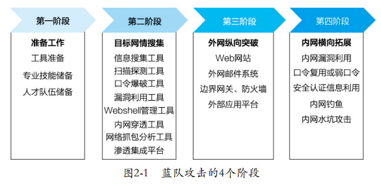

* 参考:《红蓝攻防》

* 红队攻击的4个阶段: 
    

    * 准备工作
        * 信息收集工具
            * `Whois`: 一个用来查询域名是否已经被注册, 注册域名详细信息(如域名所有人, 域名注册商)的数据. 
                * APNIC: 亚太互联网络信息中心
                * CNNIC: 中国互联网络信息中心
            * `nsloopkup`
            * `DIG`(Domain Information Groper, 域名信息搜索器): Linux下用. 
            * `OneForAll`: 集成证书透明度, 网络爬虫, 常规检查, DNS数据集, DNS查询与搜索引擎6个模块. 
        * 扫描探测工具
            * `Nmap`: 
                * 在线主机探测(检测存活在网络上的主机)
                * 端口服务探测(检测主机上开放的端口和应用服务)
                * 设备指纹探测(监测目标系统类型和版本信息)
                * 漏洞探测(借助Nmap脚本对目标脆弱性进行扫描和检测)
            * `Nessus`
                * 采用集成技术帮助执行物理和虚拟设备发现及软件安全审核, 通过插件库实现功能拓展和最新漏洞补丁检测. 
            * `AWVS(Acunetix Web Vulnerability Scanner)`
                * Web网络漏洞扫描工具, 利用网络爬虫原理来测试Web网站的安全性. 
            * `Dirsearch`: 目录扫描工具
            * `Nikto`: Web安全扫描工具. 
        * 口令爆破工具
            * 超级弱口令检查工具
            * `Medusa`: 对登录服务进行爆破的工具. 
            * `Hydra`: 可对多种协议执行字典攻击, 包括RDP, SSH（v1和v2）, Telnet, FTP, HTTP, HTTPS, SMB, POP3, LDAP, SQLServer, MySQL, PostgreSQL, SNMP, SOCKS5, Cisco AAA, Ciscoauth, VNC等. 
            * `Hashcat`: 基于CPU的最快的密码破解工具. 
                * 支持各种散列算法, 包括LM Hashes, MD4, MD5, SHA系列, UNIX Crypt格式, MySQL, Cisco PIX. 
                * 支持各种攻击形式, 包括暴力破解, 组合攻击, 字典攻击, 指纹攻击, 混合攻击, 掩码攻击, 置换攻击, 基于规则的攻击, 表查找攻击和Toggle-Case攻击
        * 漏洞利用工具
            * WebLogic全版本漏洞利用工具
                * WebLogic是基于Java EE架构的中间件, 被用于开发, 集成, 部署和管理大型分布式Web应用, 网络应用和数据库应用的Java应用服务器. 
            * Struts2综合漏洞利用工具
            * sqlmap
                * 支持的数据库有MySQL, Oracle, PostgreSQL, SQL Server, Access, IBMDB2, SQLite, Firebird, Sybase和SAP MaxDB（
            * vSphere Client RCE漏洞(CVE-2021-21972)利用工具
                * 蓝队可以通过开放443端口的服务器向vCenter Server发送精心构造的请求, 写入Webshell, 控制服务器
            * Windows Print Spooler权限提升漏洞(CVE-2021-1675)
                * Windows Print Spooler是Windows系统中用于管理打印相关事务的服务. 
            * Exchange Server漏洞组合利用(CVE-2021-26855(ssrf) & CVE-2021-27065(任意文件写入漏洞))
                * Exchange Server是微软公司的一套电子邮件服务组件

        * webshell管理工具
            * 冰蝎
            * 中国蚁剑
            * 哥斯拉(Godzilla)
        * 内网穿透工具: 实现外网到内网的跨边界跳转访问, 借助端口转发, 隧道技术等手段对内网目标实现转发访问或将目标内网IP映射到外网, 并在远控客户端和被攻击目标终端之间建立一个安全通信通道
            * `FRP`: 一款高性能反向代理工具, 
            * `ngrok`: 开源的反向代理工具. 
            * `reGeorg`: 是一款利用Web进行代理的工具, 可用于在目标服务器在内网或做了端口策略的情况下连接目标服务器内部开放端口, 利用Webshell建立一个SOCKS代理进行内网穿透, 将内网服务器的端口通过HTTP/HTTPS隧道转发到本机, 形成通信回路. 
            * `SSH`: 支持socks代理和端口转发
            * `Netsh`: Windows系统自带的网络配置命令行脚本工具, 可用来通过修改本地或远程网络配置实现端口转发功能. 
            * `HTran`
        * 网络抓包工具: 
            * `Wireshark`
            * `Fiddler`
            * `tcpdump`
        * 开源集成工具平台: 
            * `Kali`
            * `Commando VM`: 基于Windows
            * `Cobalt Strike(CS)`: 采用Metasploit为基础的渗透测试GUI框架. 
            * `Burp Suite`: 集成了Web访问代理, Web数据拦截与修改, 网络爬虫, 枚举探测, 数据编解码等一系列功能
    * 专业技能
        * 工具开发
        * 漏洞挖掘
            * 尤其是与蓝队攻击密切相关的互联网边界应用, 网络设备, 办公应用, 移动办公, 运维系统, 集权管控等方面的漏洞挖掘技能
        * 代码调试
        * 侦破拓展
            * 作为攻击者, 可以从防守者的角度思考问题, 能快速定位防守弱点和突破口
            * 能根据不同攻击目标快速确定攻击策略和战法, 针对性开展攻击工作
            * 三是对渗透工具的高效运用, 能快速根据攻击策略实现对各类工具的部署应用, 能够快速将攻击思路转化为实践, 高效开展攻击工作. 
    * 网情搜集
        * 目的: 快速定位薄弱点和采取正确的攻击路径
        * 途径
            * [Shodan](https://www.shodan.io): 收集联网的服务器, 摄像头, 打印机, 路由器
            * [FOFA网络空间测绘](https://fofa.info/)
            * [Censys](https://censys.io): 与Shodan相比, 其优势在于它是一款由谷歌提供支持的免费搜索引擎
            * [ZoomEye](https://www.zoomeye.org)
            * [FOFA](https://fofa.so): 网络空间资产检索系统
            * [APNIC](https://www.apnic.net): 提供全球性的支持互联网操作的分派和注册服务. 可对公共APNIC Whois数据库进行查询, 获取目标网络IP地址, 域名网络服务提供商, 国家互联网登记等相关信息. f
            * [CNNIC](http://www.cnnic.net.cn): 负责国家网络基础资源的相关信息维护管理, 可提供Whois相关查询服务. 
    * 外网纵向突破
        * Web网站
            * 以漏洞利用为主, 包括SQL注入, 跨站脚本攻击, 未加密登录请求, 弱口令, 目录遍历, 敏感文件泄露与文件上传漏洞等.另外, 存在较多漏洞的是一些Web平台组件, 比如WebLogic, WebSphere, Tomcat, Apache, Nginx, IIS和Web脚本平台等
        * 外部邮件系统
            * 利用邮件系统安全认证缺陷, 利用邮件系统组件漏洞, 口令暴力破解, 系统撞库, 网络数据监听与社工等手段
        * 边界网络设备
            * 利用这些互联网接口防火墙, 边界网关和路由支持开放的HTTP, HTTPS, Telnet, FTP, SSH与网络代理服务, 通过远程溢出, 远程执行漏洞, 安全规则配置不当, 口令猜破与社工手段, 对一些开放的重要服务和端口进行渗透.
            * 比较典型的例子有VPN网关仿冒接入突破.
        * 外部应用平台
            * 比如业务系统, OA, 报表系统, 微信公众号平台, 大数据平台等, 利用其基础构件, 网络代理组件, 应用后台数据库或平台应用程序本身
    * 内网横向拓展(lateral movementz)
        * 目的
            * 实现控制权限最大化. 
        * 内网信息搜集

* 密码破解
    * Windows登录密码
        * 离线破解hydra
        * 在用户已登录的情况下, 使用`getpass`从内存中提取用户密码.
            * 适用于windows7及以下版本. 
        * 使用`quarkpwdump`导出windows用户密码hash值.
        * `mimikatz`
            * 命令
                * `privilege::debug`: 提权
                * `sekurla::logonpasswords full`: 获取系统账户的明文口令. 
                * `sekurla::minidump <dmp文件>`: 使用dmp文件. 可从任务管理器中获取`lsass.exe`进程的dmp文件, 然后将该文件导入mimikatz作解析, 并获取口令. 
                * `ts::multirdp`: rdp多开. 
                * `ts::logonpasswords`: 开启了远程桌面服务的情况下, 可使用该命令窃取口令. 
                * `ts::mstsc`: 被控端使用了远程桌面工具登录其他系统时, 可使用该命令窃取口令. 
    * Linux登录密码
        * hydra
        * 得到shadow文件, 使用`john the ripper`暴力破解.