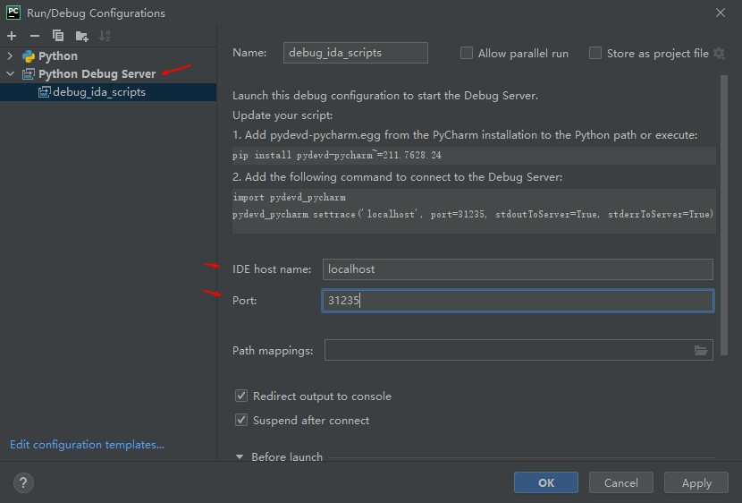
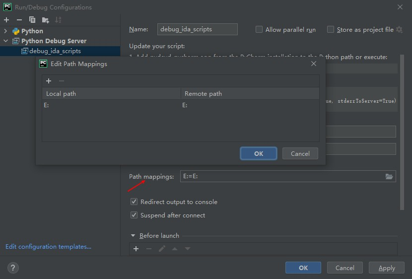
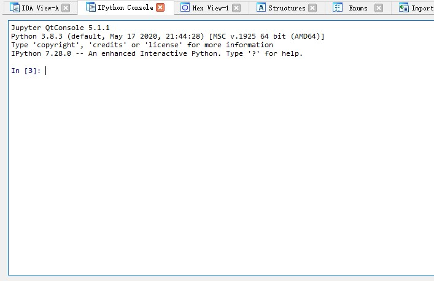

# 文章
* [【干货分享】恶意样本分析手册——常用方法篇](https://bbs.huaweicloud.com/blogs/109534)
* [rootkits-investigation-procedures.pdf](https://www.sans.org/media/score/checklists/rootkits-investigation-procedures.pdf)
* [网络靶场实战-加密固件分析](https://blog.csdn.net/We8__/article/details/137859910)
* [Unpacking, Patching, and Repacking a zImage file](https://github.com/Caesurus/CTF_Writeups/blob/main/2024-04-zImageKernelPatch/README.MD)

# 网站
* https://opensecuritytraining.info/MalwareDynamicAnalysis.html
* https://github.com/topics/bypass-antivirus

# 机器码笔记
* `mov`
    * `mov <寄存器>, <操作数>`: 前三字节是操作码, 后4字节代表的DWORD数值是操作数, 寄存器得到的值是`该指令的下一条指令的地址加上操作数`. 
* `call <函数>`
    * 操作码为`e8`
    * 其下一条指令的地址加上DWORD类型的操作数, 得到函数地址
* `jmp <地址>`
    * 操作码为`e9`

# 软件破解笔记
* source insight 4.0
    * 参考: https://www.cnblogs.com/lixuejian/p/15117744.html

# 调试技术
* 调试`CreateRemoteThread`创建的线程: 
    * 在主进程创建svchost进程后, 执行`CreateRemoteThread`前, 打开新的od并附加创建的svchost, 之后来到注入的代码的入口点, 打下断点. 然后在主进程那边执行了`CreateRemoteThread`, 另一个OD中就会断在注入代码入口点处. 

# 代码混淆
* 混淆技术
    * 基于数据的混淆技术
        * 常量展开
            * 常量折叠是编译器的优化手段之一, 其把源代码中可以算出结果的部分直接计算出, 用结果替代算式. 
            * 常量展开则是把简单的赋值替换成一个能得到这个赋值结果的计算过程. 
        * 数据编码方案
            * 同态加密
        * 插入死代码
        * 恒等运算替换
            * `xor eax, 0FFFFFFFFH`: 相当于not运算符, 对数字的每一位取反
            * `~x + 1`: 相当于`-x`, 即二进制补码
            * `(x << y) | (x >> bits(x) - y)`: 相当于`rcl x, y`, 将x循环左移y位. 循环右移以此类推. 
            * `~-x`: `x - 1`
            * `~-x`: `x - 1`
        * 基于模式的混淆
            * 比如, 把`push reg32`替换为`push imm32`, `mov dword ptr [esp], reg32`, 其结果也是将数值reg32放到栈顶. 
    * 基于控制的混淆技术
        * 标准静态分析的假定: 
            0. 
                * 顺序局部性: 单个基本块编译后的指令是顺序排列的
                * 时间局部性: 编译器的优化工作会把彼此相关的基本块放在一起, 减少分支跳转的数量. 
            1. call只用于函数调用, 且调用目标就是函数起始地址
            2. ret和retn意味着函数的边界
            3. 分支两侧都可能被执行, 分支两侧都是代码而非数据
            4. 很容易确定间接跳转的目标地址
            5. 间接跳转和调用只对应switch和函数指针调用
            6. 所有控制转移的目标地址都是代码, 而非数据
            7. 异常的使用是可以预测的
        * 违反上述假定的混淆
            1. 使用内联函数(把子函数的代码合并到调用代码中), 外联函数(把函数的一部分提取出来构成独立函数)
            2. 破坏顺序局部性/时间局部性
                * 引入无条件分支: 用jmp把顺序代码混淆成意面代码
            3. 基于处理器的控制间接化
                * 用push-ret代替jmp
                * 用call代替jmp
            4. 基于操作系统的控制间接化
                1. 混淆后代码触发一个异常(无效指针, 无效运算, 无效指令)
                2. 系统调用异常处理函数
                3. 异常处理函数根据其内部逻辑分发指令流, 然后把程序设置到正常状状态
            5. 不透明谓词(opaque predicate): 一个特殊条件结构, 其求值总为 true或false
                * 给CFG(控制流图)增加一条新的边. 这条假分支要看着真实. 
                * 可通过计算复杂度很高的算术问题实现. 
        * 同时使用以上两者
        * 插入垃圾代码: 在两块有效代码块间插入死代码. 其中要么有无效指令, 要么有跳转到无效地址的跳转指令. 
        * 控制流图展平: 把所有控制结构用一个switch语句(分发器)替代.
            * 可把它看成只针对控制流的部分虚拟化. 
        * 虚拟机
           * 有性能开销, 故通常只对选定的部分进行虚拟化. 
        * 白盒加密
        * 基于栈的混淆
    * 使用不常用指令, 如rcl, sbb, pushf, pushad

# 常见算法
* 参考
    * [数据压缩与信息熵](https://www.ruanyifeng.com/blog/2014/09/information-entropy.html)
    * [超级简单的数据压缩算法—LZW算法](https://www.cnblogs.com/mcomco/p/10475329.html)
    * [zlib压缩原理](https://blog.csdn.net/dovakejin/article/details/129096962)
* 理论
    * 压缩原理: 所谓"压缩"就是找出文件内容的概率分布, 将那些出现概率高的部分代替成更短的形式. 所以, 内容越是重复的文件, 就可以压缩得越小. 
    * 步骤: 
        1. 得到文件内容的概率分布, 哪些部分出现的次数多, 哪些部分出现的次数少; 
        2. 对文件进行编码, 用较短的符号替代那些重复出现的部分. 
    * 压缩极限
        * 假设均匀分布. 若文件共有`n`个不同字符, 则表示一个字符至少需要 `log2(n)` 个二进制位. 
        * 反过来, 每个字符出现的概率为`p = 1/n`, 表示一个字符至少需要 `log2(1/p)` 个二进制位. 
        * 推广到一般情况, 假定文件有`n`个部分组成, 每个部分的内容在文件中的出现概率分别为`p1, p2, ...pn`. 那么, 替代符号占据的二进制最少为: 
            > `log2(1/p1) + log2(1/p2) + ... + log2(1/pn) = ∑ log2(1/pn)`
        * 上式除以`n`, 得到平均每个符号至少应占用的二进制位, 等价于下面的公式: 
            > `p1*log2(1/p1) + p2*log2(1/p2) + ... + pn*log2(1/pn) = ∑ pn*log2(1/pn) = E( log2(1/p) )`
        * `p`越大, 则压缩后体积越小. 
* Lzw数据压缩算法
* LZ77压缩算法
    * 核心思想: 对字符串进行扫描, 对于前面已经出现过的子字符串, 用`(偏移量, 匹配的字符串的长度)`进行编码(后者将构成一个短语字典). 
    * 步骤
        1. 逐字符扫描前向缓冲区, 在滑动窗口中找出前向缓冲区中能匹配的最长子串(注意是**从前向缓冲区头开始的子串**), 如果找到, 则执行步骤2, 否则执行步骤3.  
        2. 对前向缓冲区中匹配的字符串进行编码并输出, 编码的格式为`(前向缓冲区中匹配开始位置距离滑动窗口中匹配开始位置的偏移量, 匹配的长度)`, 将匹配的字符串移入滑动窗口中, 继续执行步骤1
        3. 将当前字符编码为`(0,0,当前字符值)`并输出, 表示滑动窗口中没有出现过该字符, 并将该字符移入到滑动窗口中, 继续执行步骤1
    * 示例
        * 原文: ABABCBABABCAD
        * 算法参数设置: 滑动窗口大小为8, 前向缓冲区大小为4. 
        * 编码: (0,0,A), (0,0,B), (2,2), (0,0,C), (4,3), (6,3), (5,1), (0,0,D)
        * 解码过程: 
        ```
            (0,0,A)->A
            (0,0,B)->AB
            (2,2)->ABAB
            (0,0,C)->ABABC
            (4,3)->ABABCBAB
            (6,3)->ABABCBABABC
            (5,1)->ABABCBABABCA
            (0,0,D)->ABABCBABABCAD
        ```
* 哈夫曼算法
    * 以各字符出现的频率, 构建哈夫曼树, 使用哈夫曼编码代替各字符. 
    * 哈夫曼编码的特点: 某个字符的编码不会成为另一个字符的编码的前缀. 
    * 效果是, 出现的频率更高的字符将使用更短的01编码. 

## VMProtect
* 万用门`NOR(a, b)`, 用来扩展到所有逻辑运算: 
    ```cpp
        NOR(a, b) = ~(a | b)= ~a & ~b
        Not(a) = NOR(a, a)
        And(a, b) = NOR(NOR(a, a), NOR(b, b))
        Or(a, b) = NOR(NOR(a, b), NOR(a, b)
        Xor(a, b) = NOR(NOR(NOR(a, a), NOR(b, b)), NOR(a, b))
    ```
* 除此之外VMProtect使用vAdd Handler来模拟执行`add`, `sub`, `adc`, `sbb`, `cmp`, `inc`, `dec`等指令的操作在刚出现的时候也着实让人大开眼界. 通过vAdd指令同时可以算出与sub等指令一样的标志位操作. 
    ```cpp
    vAdd(a,b) = a + b
    Sub = Not(vAdd(Not(a),b))
    sub_flag(a, b) = and(~(0x815). not_flag(not(a) + b)) + and(0x815, add_flag(not(a). b))
    ```
* 其他的还有: 虚拟寄存器轮转算法, 寄存器加密, 栈混乱代码随机生成, VM寄存器随机化, 原始栈开辟新的执行空间解决多线程等等. 

# 解密
* 明文攻击
    * PKCrack: 
        * 项目地址: https://github.com/keyunluo/pkcrack
        * 使用: 
            * ` pkcrack -C encrypted.zip -c ciphertext.txt -P plaintext.zip -p plaintext.txt -d decryptedtext.txt -a`: 
                * `encrypted.zip`: 加密的zip包
                * `ciphertext.txt`: 加密的zip包中的明文文件的名字
                * `plaintext.zip`: 压缩后的明文文件
                * `plaintext.txt`: 压缩的明文文件中明文文件的名字
                * `decryptedtext.txt`: 输出的文件

# 技巧
* 字符串搜索和过滤: 
    ```sh
        # 利用strings, 从当前目录下所有文件搜索字符串
        find . -type f -print0 | xargs -0 -I {} sh -c 'strings "{}" | grep "要搜索的字符串" |  xargs -I _ echo -n "\"_\": " | tee /dev/tty | if [ $(wc -c) -gt 0 ]; then echo {}; fi'

        # 方法二
        # 递归扫描文件并处理
        find . -type f -print0 | while IFS= read -r -d '' file; do
            # 提取字符串并匹配模式，输出格式：文件名:匹配字符串
            strings "$file" | grep -E --color=never "$pattern" | \
            awk -v file="$file" '{print file ": " $0}'
        done
    ```
* 二进制文件对比
    * bindiff: 可对两个ida数据库文件进行对比, 从而获取两个原始二进制文件的代码差异. 
    * `cmp 1.bin 2.bin`: 可获知差异位置
    * `diff <(hexdump -C 1.bin) <(hexdump -C 2.bin)`: 可获知差异位置和差异数据
* 按名字快速结束进程: `( ps aux | grep <进程名> | grep -v 'grep' | awk '{print $2}' ) | xargs kill -9`
* 定时查询指定进程信息: 
    ```sh
        while [ 1 ]; do
            clear
            ps aux | grep 进程名 | grep -v 'grep' | awk '{print NR, $0}'
            sleep 2
        done
    ```
* 查找涉及80端口的进程: `netstat -anop | grep -E "(\.((2(5[0-5]|[0-4][0-9]))|[0-1]?[0-9]{1,2})){3}\:80" | awk '{print $7}'`
# 固件
* 参考
    * [看雪2018峰会回顾_智能设备漏洞挖掘中几个突破点(内有十种固件提取方法和首次公开uboot提取固件方法)](https://bbs.kanxue.com/thread-230095.htm)
## 固件提取
* 官网或联系售后索取升级包
* 在线升级, 抓包获取下载地址
* 逆向升级软件, 软件内置解包和通讯算法
* 从硬件调试接口: `JTAG/SWD`, 利用调试工具的任意地址读取功能
* 拆Flash, Sd卡, TF卡, 硬盘等, 用编程器或对应设备读固件
* 用硬件电路的调试事口和固件的bootloader获取固件
* 通过利用网页和通讯漏洞获取固件敏感信息
* 用逻辑分析仪监听`flash.xam`获取信息
* 从硬件串口获取系统权限后, 用 `tar`, `nc`, `dd`, `echo`, `vi` 等命令提取固件

# 工具
## capstone
* 反汇编引擎
* python
    ```py
        from capstone import *

        CODE = b"\x55\x48\x8b\x05\xb8\x13\x00\x00"

        md = Cs(CS_ARCH_X86, CS_MODE_64)
        for i in md.disasm(CODE, 0x1000):
            print("0x%x:\t%s\t%s" % (i.address, i.mnemonic, i.op_str))

    ```
## keystone
* 汇编引擎
    * python
    ```py
        from keystone import *

        # separate assembly instructions by ; or \n
        CODE = b"INC ecx; DEC edx"
        
        try:
            # Initialize engine in X86-32bit mode
            ks = Ks(KS_ARCH_X86, KS_MODE_32)
            encoding, count = ks.asm(CODE)
            print("%s = %s (number of statements: %u)" % (CODE, encoding, count))
        except KsError as e:
            print("ERROR: %s" %e)
    ```
## lief
* 参考: [Welcome to LIEF’s documentation!](https://lief.re/doc/latest/index.html)
* 基本信息
    * 支持: ELF, PE, Mach-O, android程序(OAT, DEX, VDEX, ART) 


## unicorn
* 基本信息
    * 基于qemu的仿真框架
    * 支持细粒度插桩
* 参考
    * [Unicorn Engine Reference (Unofficial)](https://hackmd.io/@K-atc/rJTUtGwuW?type=view#Unicorn-Engine-Reference-Unofficial)
* 示例
    ```py
        from unicorn import *
        from unicorn.x86_const import *

        def read(name):
            with open(name,"rb") as f:
                return f.read()
        
        def hook_code(uc, address, size, user_data):
            print('>>> Tracing instruction at 0x%x, instruction size = 0x%x' %(address, size))
            print("[+] RIP=0x%x RAX=0x%x RBX=0x%x RCX=0x%x RDX=0x%x" % (uc.reg_read(UC_X86_REG_RIP), uc.reg_read(UC_X86_REG_RAX), uc.reg_read(UC_X86_REG_RBX), uc.reg_read(UC_X86_REG_RCX), uc.reg_read(UC_X86_REG_RDX)))
        
        BASE_ADDRESS = 0x400000
        STACK_ADDR = 0x0
        STACK_SIZE = 1024*1024

        # 初始化 Unicorn 引擎和内存空间
        mu = Uc(UC_ARCH_X86, UC_MODE_64)
        mu.mem_map(BASE_ADDRESS, 1024*1024)
        mu.mem_map(STACK_ADDR, STACK_SIZE)

        # 设置 RIP 和 RSP
        mu.mem_write(BASE_ADDRESS, read("/home/cmtest/Desktop/ctest/t2"))
        mu.reg_write(UC_X86_REG_RSP, STACK_ADDR + STACK_SIZE - 1)

        # 注册hook函数
        mu.hook_add(UC_HOOK_CODE, hook_code)
            # 定义: def hook_add(self, htype: int, callback: UC_HOOK_CALLBACK_TYPE , user_data: Any=None, begin: int=1, end: int=0, arg1: int=0, arg2: int=0)

        # 开始模拟执行. 
        #   `count`: 表示执行的指令条数. 默认为0, 表示无限
        mu.emu_start(begin=0x0000000000401149, until=0x0000000000401169, timeout=10, count=10)
    ```
* 内存映射
    ```py
        # 列出已映射的内存
        for region in mu.mem_regions():
            print(f"  0x{region[0]:x} - 0x{region[1]:x} (Size: 0x{region[1] - region[0]:x})")
    ```
* hook
    * 类型
        * 指令执行类
            * `UC_HOOK_INTR`: 中断, 系统调用
            * `UC_HOOK_INSN`: 指令(仅支持很少一部分)
            * `UC_HOOK_CODE`: 一个范围内的代码
            * `UC_HOOK_BLOCK`: 基本块
            * `UC_HOOK_EDGE_GENERATED`: 产生了新的边(在程序分析中有用)
                * 和`UC_HOOK_BLOCK`的差异: 
                    1. 在执行指令前调用. 
                    2. 仅在有产生新的边时调用. 
            * `UC_HOOK_TCG_OPCODE`: 执行tcg op指令时. 
            * `UC_HOOK_TLB_FILL`: tlb fill请求. 在tlb缓存中不包含地址时触发. 
        * 内存访问类
            * `UC_HOOK_MEM_READ`: 内存读. 
            * `UC_HOOK_MEM_WRITE`: 内存写. 
            * `UC_HOOK_MEM_FETCH`: 在指令执行事件中获取内存数据(`memory fetch`, 指cpu周期中的取指令操作). 
            * `UC_HOOK_MEM_READ_AFTER`: 成功读取内存后. 
        * 异常处理类
            * `UC_HOOK_INSN_INVALID`: 执行非法指令产生的异常
            * `UC_HOOK_MEM_READ_UNMAPPED`: 读取未映射的内存
            * `UC_HOOK_MEM_WRITE_UNMAPPED`: 非法写内存
            * `UC_HOOK_MEM_FETCH_UNMAPPED`: 在指令执行事件中, 非法获取内存数据(意即PC寄存器指向了未映射的内存). 
            * `UC_HOOK_MEM_READ_PROT`: 读取有读保护的内存
            * `UC_HOOK_MEM_WRITE_PROT`: 写入有写保护的内存
            * `UC_HOOK_MEM_FETCH_PROT`: 从不具备可执行权限(non-executable)的内存中获取数据(意即PC寄存器指向了不可执行的区域)
        * 对以上hook类型进行结合的有用的宏: 
            * `UC_HOOK_MEM_FETCH_INVALID`: (`UC_HOOK_MEM_FETCH_PROT` + `UC_HOOK_MEM_FETCH_UNMAPPED`)(还有读和写相关的, 类推)
            * `UC_HOOK_MEM_UNMAPPED`: 所有对未映射内存区域的非法操作(`UC_HOOK_MEM_READ_UNMAPPED` + `UC_HOOK_MEM_WRITE_UNMAPPED` + `UC_HOOK_MEM_FETCH_UNMAPPED`)
            * `UC_HOOK_MEM_PROT`: 所有对保护性内存区域的非法操作(`UC_HOOK_MEM_READ_PROT` + `UC_HOOK_MEM_WRITE_PROT` + `UC_HOOK_MEM_FETCH_PROT`). 
            * `UC_HOOK_MEM_INVALID`: (`UC_HOOK_MEM_UNMAPPED` + `UC_HOOK_MEM_PROT`)
            * `UC_HOOK_MEM_VALID`: 
    * 各个hook回调函数的原型: 
        ```py
            def _hook_tcg_op_cb(self, handle, address, arg1, arg2, user_data)
            def _hook_edge_gen_cb(self, handle, cur, prev, user_data)
            def _hookcode_cb(self, handle, address, size, user_data)
            def _hook_mem_invalid_cb(self, handle, access, address, size, value, user_data)
            def _hook_mem_access_cb(self, handle, access, address, size, value, user_data)
            def _hook_intr_cb(self, handle, intno, user_data)
            def _hook_insn_invalid_cb(self, handle, user_data)
            def _hook_insn_in_cb(self, handle, port, size, user_data)
            def _hook_insn_sys_cb(self, handle, reg, pcp_reg, user_data)
            def _hook_insn_out_cb(self, handle, port, size, value, user_data)
            def _hook_insn_syscall_cb(self, handle, user_data)
            def _hook_insn_cpuid_cb(self, handle: int, user_data: int) -> int
        ```
    
* 其他
    * 环境变量`LIBUNICORN_PATH`可指定`libunicorn.so`的搜索路径. 
## qiling
* 参考
    * https://docs.qiling.io/en/latest/
    * (2020 看雪SDC议题回顾 | 麒麟框架：现代化的逆向分析体验)[https://bbs.kanxue.com/article-14181.htm]
* 基本信息
    * 基于unicorn的仿真框架
    * 相比unicorn, 多了如下功能: 
        * 解析多种格式文件: PE, MachO, ELF, COM, MBR
        * 支持多种系统内核模块(利用`Demigod`): Windows(.sys), Linux(.ko), MacOS(.kext)
        * 多个级别的细粒度插桩: 指令, 基本块, 内存访问, 异常, 系统调用, IO
        * 内置调试器, 用于逆向分析
        * 支持热补丁
* 安装和配置
    * `pip install qiling`
    * 下载各操作系统的必要文件: 
        * `git clone https://github.com/qilingframework/qiling`
        * `git submodule update --init --recursive`: 会下载到`examples/rootfs`目录下. 
        * 收集windows系统的必要文件: 在windows中以管理员运行`examples/scripts/dllscollector.bat`. 
* 初始化及运行: 
    ```py
        Qiling(
            argv: Sequence[str] = [], # 目标程序以及其命令行参数(字符串)
            rootfs: str = r'.', # 目标文件系统目录
            env: MutableMapping[AnyStr, AnyStr] = {}, # 目标系统中的环境变量
            code: Optional[bytes] = None, # 要运行的代码
            ostype: Optional[QL_OS] = None,
            archtype: Optional[QL_ARCH] = None,
            verbose: QL_VERBOSE = QL_VERBOSE.DEFAULT,
            profile: Optional[Union[str, Mapping]] = None, # 指定profile文件, 做一些系统层面的配置. 参考`profiles`目录下的ql文件. 
            console: bool = True,
            log_file: Optional[str] = None, # 日志文件目录, 不设置的话会直接在stdout打印出来 
            log_override: Optional['Logger'] = None,
            log_plain: bool = False,
            multithread: bool = False, # 开启多线程支持
            filter: Optional[str] = None,
            stop: QL_STOP = QL_STOP.NONE, # 值可为`QL_STOP.STACK_POINTER`(栈指针为负数时结束), `QL_STOP.EXIT_TRAP`(运行到exit陷阱时)或它们的或值
            *,
            endian: Optional[QL_ENDIAN] = None,
            thumb: bool = False,
            libcache: bool = False
        )

        # 例一
        ql = Qiling(
            [r'examples/rootfs/x86_windows/bin/wannacry.bin'],
            r'examples/rootfs/x86_windows'
        )
        ql.run()
        
        # 例二
        ql = Qiling(
            code=shellcode,
            rootfs=r'examples/rootfs/x8664_windows',
            archtype=QL_ARCH.X8664, ostype=QL_OS.WINDOWS,
            verbose=QL_VERBOSE.DEBUG
        )
        ql.run()
    ```
* 信息: 
    * `ql.os.entry_point`: 实际为ld库的入口地址
    * `ql.loader.elf_entry`或者`ql.os.elf_entry`: 程序的主入口地址
* 内存操作
    * 栈: 
        * `ql.arch.stack_pop()`: 弹栈
        * `ql.arch.stack_push(<val>)`: 压栈
        * `ql.arch.stack_read(<offset>)`: 读栈(`<offset>`相对于栈顶)
        * `ql.arch.stack_write(<offset>, <val>)`: 写栈
    * `ql.mem`: 
        * `.read(addr, size)`: 读内存地址数据. 返回`bytes`类型数据. 
        * `.read_ptr(addr, size: int = 0)`: 从内存地址读一个整数(指针大小). `size`可取值为0(表示使用CPU架构的指针大小), 1, 2, 4, 8
        * `.string(addr: int, value=None, encoding='utf-8')`: 读写字符串. 当`value`为字符串时写入字符串. 
        * `.write(addr, buf)`: 写数据到内存地址. `buf`是`bytes`类型数据. 
        * `.write_ptr(addr: int, value: int, size: int = 0)`: 向内存地址写一个整数. 
        * `.get_formatted_mapinfo()`: 获取仿真程序的内存分段信息.
    * `ql.patch(addr, buf)`: 在内存打补丁. 实际会在`ql.run()`之后才改内存. 
* 寄存器
    * `ql.arch.regs`
        * `.<寄存器>`: 得到寄存器值
        * `.register_mapping`: 这个字典存放所有寄存器值
        * `.arch_pc`: 通用, 计数器
        * `.arch_sp`: 通用, 栈指针
* 文件路径映射: 将虚拟机访问的文件路径映射到宿主机文件路径. 
    * `ql.add_fs_mapper(ql_path, real_dest)`: `ql_path`是虚拟机访问路径, `real_dest`是宿主机访问路径
* 劫持/挂钩
    * `ql.hook_address(callback, address, user_data=None)`: 执行到`address`时会调用`callback`函数. 
        * `callback`的参数是ql实例. 
    * `ql.hook_block(ql_hook_block_disasm)`: 每次执行到基本块前会调用回调函数. 
        * 回调函数: `ql_hook_block_disasm(ql, address, size)`
    * posix `libc函数钩子`和`系统api钩子`:
        ```py
            from qiling.const import *
            from qiling.os.const import *

            # 设置libc函数钩子
            def my_puts(ql: Qiling):
                params = ql.os.resolve_fcall_params({'s': STRING})
                s = params['s']
                ql.log.info(f'my_puts: got "{s}" as an argument')
                print(s)
                return len(s)
            ql.os.set_api('puts', my_puts, QL_INTERCEPT.CALL) # libc函数钩子
                # QL_INTERCEPT.CALL: 直接用钩子函数覆盖原函数
                # QL_INTERCEPT.ENTER: 进入原函数前执行钩子. 不会覆盖原函数
                # QL_INTERCEPT.EXIT: 退出原函数前执行钩子. 不会覆盖原函数
            
            # `set_api`的原理参考`os/linux/function_hook.py:FunctionHook`类中的`add_function_hook_relocation`和`add_function_hook_mips`方法

            # 设置系统api钩子
            def my_recv(ql: Qiling, sockfd: int, buf: int, length: int, flags: int):
                os_syscalls = ql_get_module(f'.os.{ql.os.type.name.lower()}.syscall')
                posix_syscalls = ql_get_module(f'.os.posix.syscall')
                syscall_hook = getattr(os_syscalls, 'ql_syscall_recv', None) or getattr(posix_syscalls, 'ql_syscall_recv', None) # 获取`os/posix/socket.py`中定义的`ql_syscall_recv`函数. 
                try: 
                    return syscall_hook(ql, sockfd, buf, length, flags) # 调用原始的`ql_syscall_recv`函数
                except:
                    pass
            ql.os.set_syscall('recv', my_recv_write, QL_INTERCEPT.CALL) # 系统api钩子
            # 调试发现hook类型为`QL_INTERCEPT.ENTER`时, 命中钩子时, PC寄存器的值为syscall指令的下一条指令的地址(可能意味着此时syscall指令"正在执行"). 
        ```
* 快照
    ```py
        # save(self, reg=True, mem=True, hw=False, fd=False, cpu_context=False, os=False, loader=False, *, snapshot: Optional[str] = None)
            # 参数: 
                # snapshot: 指定快照文件的路径
        
        ql.save(snapshot="snapshot.bin") # 保存快照
        ql.restore(snapshot="snapshot.bin") # 恢复快照
    ```
    * 坑点: 
        * 恢复快照不会重新打开原先的fd. 这会导致后续`select`等函数调用的错误(`Bad file descriptor`)
* 调试
    * gdb远程调试
        * `ql.debugger = True`
        * 运行仿真后, 会出现一行`gdb> listening on 127.0.0.1:9999`, 这时可运行`gdb-multiarch`, 然后执行`set remotetimeout 100`, `target remote 127.0.0.1:9999`附加调试. 
        * 其他写法: 
            * `ql.debugger = "gdb::9999"`: GDB server
            * `ql.debugger = "gdb:127.0.0.1:9999"`: GDB server
            * `ql.debugger = "idapro:127.0.0.1:9999"`: IDA pro server
    * Qdb
        * `ql.debugger = "qdb`
        * `ql.debugger = "qdb:0x1030c"`: 在`0x1030c`处设置断点(即`init_hook`)
        * `ql.debugger = "qdb:./my_qdb_script"`: 使用qdb脚本文件
        * 命令
            * `s`: 单步
            * `p`: 单步往回(需要设置`ql.debugger = "qdb::rr"`)
            * `c`: 继续
            * `b <addr>`: 断点
            * `x <addr> <len>`: 查看数据
* 打印
    * `ql.log`
        * `.print`
    * 打印仿真信息
        ```py
            ql.os.emu_error() # 打印CPU上下文(寄存器), 内存映射信息

            for entry in ql.os.stats.summary(): # 打印syscall统计数据, 内存字符串统计信息
                ql.log.debug(entry)

            ql.arch.utils.disassembler(ql, ql.loader.elf_entry + 0x10, 64) # 反汇编内存中的代码. 二参为内存地址, 三参为要反汇编的内存范围
        ```
    * 过滤器
        * `ql.filter = '^open'`: 表示仅显示以"open"为开头的信息. 
* 工具
    * `qltool`: 在终端仿真程序. 
        * `qltui`: 交互式配置仿真信息并运行仿真. 
    * `qiling.utils`
        ```py
            from qiling.utils import ql_get_module, ql_get_module_function

            os_syscalls = ql_get_module(f'.os.{ql.os.type.name.lower()}.syscall')
            posix_syscalls = ql_get_module(f'.os.posix.syscall')
            syscall_hook = getattr(os_syscalls, 'ql_syscall_recv', None) or getattr(posix_syscalls, 'ql_syscall_recv', None)
        ```
    * `qiling.os.utils`
        ```py
            ql.os.utils.read_string(addr, 'ascii') # 读取仿真内存中的字符串
        ```
    * unicornafl
        ```py
            ql_afl_fuzz(ql: Qiling,
                input_file: str, # afl使用mmap传递测试用例的时候有用. 如果是用共享内存, 则这个参数无意义. 
                place_input_callback: Callable[["Qiling", bytes, int], bool], # 默认返回True, 表示接受数据
                exits: List[int],
                validate_crash_callback: Callable[["Qiling", int, bytes, int], bool] = None,
                always_validate: bool = False,
                persistent_iters: int = 1)

            ql_afl_fuzz_custom(ql: Qiling,
                input_file: str,
                place_input_callback: Callable[["Qiling", bytes, int], bool],
                fuzzing_callback: Callable[["Qiling"], int],
                exits: List[int] = [],
                validate_crash_callback: Callable[["Qiling", bytes, int], bool] = None,
                always_validate: bool = False,
                persistent_iters: int = 1)                
        ```

        * `ql_afl_fuzz_custom`多了一个`fuzzing_callback`参数. `ql_afl_fuzz`调用了`ql_afl_fuzz_custom`, 其`fuzzing_callback`会调用`ql.uc.emu_start(pc, 0, 0, 0)`继续从当前的pc运行虚拟机. 
        * 这两个函数在`afl-fuzz`运行的过程中返回就意味着子进程结束, 所以**在它们后面的python代码不会执行**. 
* 其他接口
    * `ql.os`
        * `.fcall`: `QlFunctionCall`实例
            * `.cc`: `QlCC`实例. `CC`即`Call Convention`
                * `getRawParam(self, index: int, argbits: int = 0)`: 获取当前函数栈帧中的第`index`个参数的值. 其先读取寄存器, 再读栈. 
* 踩坑
    * 若仿真程序监听了小于1024的端口时, qiling会将端口值加上8000. 见`os/posix/syscall/socket.py:ql_syscall_bind`函数. 
    * 在posix系统, 要区分**针对系统api的钩子(用`ql.os.set_syscall`)和针对libc函数的钩子(用`ql.os.set_api`)**. 比如对`recv`函数, 要用`set_syscall`设置钩子. 
    * 使用`afl-fuzz`时的问题: 
        * `ValueError: not allowed to raise maximum limit`: 
            * 仿真程序中调用了`setrlimit`系统调用. 
            * 以root运行`afl-fuzz`则无此问题. 以普通用户单纯运行python程序亦则无此问题. 
    * bug
        * 开启`multithread`后, 目标程序的路径须在文件系统路径和目标程序相对路径间多一条`/`, 否则报错`UC_ERR_MAP`. 比如, `/home/xxx/firmwares/netgear/netgear_r6220//bin/mini_httpd`
* 源码分析
    * syscall钩子
        * `os/posix/syscall`目录下多个py模块, 实现了各类syscall. 
        * `QlOsPosix#__get_syscall_mapper`
            * `QlOsPosix`实例初始化时有: `self.syscall_mapper = self.__get_syscall_mapper(self.ql.arch.type)`, 这个`syscall_mapper`字典指明了所有syscall的处理函数. 
        * uc在程序使用int之类的中断指令后, 命中`UC_HOOK_INTR`类钩子. 逐步来到`QlOsPosix#load_syscall`函数. 这个函数先尝试从`posix_syscall_hooks`字典中获取enter, call, exit三类钩子. 若没有设置钩子, 则会直接调用`os/posix/syscall`目录下实现的syscall, 否则一次调用各钩子. 
    * api钩子(`set_api`)
        * 基本原理: 
            * 在程序完成加载后, 修改程序的got表, 将需要hook的api对应的表项改成一个指向`[hook_mem]`段的地址(原始got表项也存于此处)
            * 用`hook_address`函数设置一个给上述地址钩子. 当执行此处地址的指令, 即可执行钩子函数. 
        * posix的`set_api`函数中有一行`self.function_hook.add_function_hook(target, handler, intercept)`, 其中`add_function_hook`根据CPU架构的不同, 被指派为`FunctionHook`类中相应的`add_function_hook_xxx`函数. 
        * `os/linux/function_hook.py`
            * `FunctionHook`类: 
                ```py
                    class FunctionHook:
                        def __init__(self, ql, phoff, phnum, phentsize, load_base, hook_mem): # elf中, `hook_mem`被设为`mem_end`
                            ...
                            # 根据不同CPU架构设置: 
                            if self.ql.arch.type == QL_ARCH.MIPS:
                                # ref: https://sites.uclouvain.be/SystInfo/usr/include/elf.h.html
                                self.GLOB_DAT = 51
                                self.JMP_SLOT = 127
                                # add $t9, $t9, $zero
                                ins = b' \xc8 \x03' # 用于填充`[hook_mem]`段
                                self.add_function_hook = self.add_function_hook_mips
                            ...
                            self.ql.mem.map(hook_mem, 0x2000, perms=7, info="[hook_mem]") # 将会在紧跟着内存elf文件的地方创建一个叫`[hook_mem]`的段, 大小为0x2000. 根据后面的操作知, 该段前半部分存冗余指令(用于触发hook), 后半部分存原始got表项. 
                            self.ql.mem.write(hook_mem, ins * (0x1000 // len(ins))) # 填充这块内存

                            self._parse() # 解析字符串, 符号表, 重定向数据(rela, rel, plt_rel)等

                            self.rel_list += (self.rela + self.plt_rel)
                            self.free_list = [_ for _ in range(0, 0x1000, 0x10)] # 0, 16, 32, 48, 64, 80, 96, ... 取其中一个值并与`[hook_mem]`基址相加, 得到一个用于hook got表项的地址, 这个地址会存一条冗余指令. 
                            self.use_list = {}
                            self.hook_list = {} # 用于保存hook函数({函数名: HookFunc实例})
                ```
            * `HookFuncMips`类(专用于mips架构程序的api hook)
                ```py
                    class HookFuncMips(HookFunc):
                        def _hook_got(self):
                            self.ori_data = self.ql.mem.read(self.got + self.load_base + self.gotidx * self.ql.arch.pointersize, self.ql.arch.pointersize) 

                            self.ql.mem.write_ptr(self.got + self.load_base + self.gotidx * self.ql.arch.pointersize, self.hook_fuc_ptr) # 修改got表项
                            self.ql.mem.write(self.hook_data_ptr, bytes(self.ori_data)) # 在`[hook_mem]`段中保存原来的got表项
                        
                        def enable(self):
                            if self.got == None or self.hook_fuc_ptr == None or self.hook_data_ptr == None:
                                raise

                            self.ql.os.register_function_after_load(self._hook_got) # `self._hook_got`函数会在elf完成加载后才执行(在emu_start和do_lib_patch之后)
                            
                            self.exit_addr = self.hook_fuc_ptr + 8

                            self.ql.hook_address(self._hook_fuc_enter, self.hook_fuc_ptr) # got表项现在存的是`self.hook_fuc_ptr`值, 所以一旦调到此值表示的地址(这个地址存了一条无意义的指令, 见`FunctionHook`初始化中的`inst`变量), 就执行hook函数
                            self.ql.hook_address(self._hook_fuc_exit, self.hook_fuc_ptr + 8)

                    class FunctionHook:
                        def add_function_hook_mips(self, funcname, cb, pos, userdata = None): # pos参数是intercept类型
                            self.add_function_hook_relocation(funcname, cb, userdata)

                            for symidx in range(self.mips_gotsym, self.mips_symtabno):
                                tmp_name = self.strtab[self.symtab[symidx].st_name]
                                if tmp_name == funcname.encode():
                                    fn = tmp_name
                                    if fn in self.hook_list.keys():
                                        self.hook_list[fn].add_hook(cb, pos, userdata)
                                        return

                                    hf = HookFuncMips(self.ql, fn, self.plt_got, symidx - self.mips_gotsym + self.mips_local_gotno, self.load_base)
                                    hf.add_hook(cb, pos, userdata)

                                    if len(self.free_list) == 0:
                                        raise
                                    
                                    hf.idx = self.free_list[0]
                                    del self.free_list[0]

                                    hf.hook_fuc_ptr = hf.idx * 0x10 + self.hook_mem # hook_fuc_ptr只想的地址会填入hf对应的函数的got表项
                                    hf.hook_data_ptr = hf.idx * 0x10 + self.hook_mem + 0x1000

                                    self.use_list[hf.idx] = hf
                                    self.hook_list[fn] = hf

                                    hf.enable()
                ```
    * 系统套接字管理
        * `os/posix/posix.py:QlOsPosix#__init__`中有一行`self._fd = QlFileDes()`, `QlFileDes`实例的初始化中有`self.__fds = [None] * NR_OPEN`(`NR_OPEN`为1024). 后续每个套接字对应的IO对象都放在`QlFileDes`实例的`__fds`列表中, 套接字值对应下标. 
        * 获取打开的资源的: `ql.os.fd`. 其中每一项为`ql_file`或`ql_socket`实例. 
            * `ql_file`:
                * `os/filestruct.py`
            * `ql_socket`: 
                * `os/posix/filestruct.py`
            * `ql_pipe`:
                * `os/filestruct.py`
        * 在当前进程打开新的qiling实例时, **先前的qiling实例占用的端口并没有释放**. 

## pandare
* 参考: 
    * [Package pandare](https://docs.panda.re/)
    * [Time-Travel Debugging in PANDA](https://raywang.tech/2018/11/14/Time-Travel-Debugging-in-PANDA/)
* 基本信息
    * 使用流程
        1. 捕获一个完整系统的运行记录. 
        2. 以插件的形式写分析代码, 在恰当的点(比如执行基本块, 内存读等操作)注册回调函数. 
    * 系统特性
        * 记录和重放
            * 利用ND(non-determinism)日志, 记录`IN`(从端口进入CPU的数据), `INT`(硬件中断及其参数), `DMA`(访问外设时写入内存的数据). 
            * 在记录输入数据的同时也会记录轨迹点(trace point), 用于决定重放输入的时机. 轨迹点的组成: 程序计数器, 从开始记录之后执行的指令数, 循环变量(如x86下的ecx寄存器). 
            * Panda在重放时不会执行任何设备代码. 
            * 于大部分调试器对比: 
                * 大部分调试器无法重放, 为了观察程序之前的状态, 需要重启程序. 这样会导致堆栈地址的变化(在缺乏符号的情况下, 意味着要手动找数据地址)
                * Panda的重放功能使其每一次都保持相同的堆地址. 
        * 插件架构
            * 使用共享库的形式. 可在客户机运行的任意时间加载插件. 
            * 加载插件时执行其`init_plugin`函数, 卸载插件或panda退出时执行`uninit_plugin`函数. 
            * 核心api: 
                * 读写内存
                * 刷新翻译代码的缓存
                * 转换命令行参数
                * 内存插桩
                * 精准的程序计数器追踪
            * 插件间交互
        * 架构无关
            * 其他动态污点分析方法都是需要为每条指令提供额外的分析(有的是为每条指令实现一个符号执行模型), 以跟踪内存或寄存器的标签. 
        * 支持安卓
    * 插件基础以及已有的插件
        * `TZB`(Tappan Zee (North) Bridge)
            * tap点: 用户可从这些点获取有用信息. `TZB`会定位tap点. 
            * 相关插件: 
                * `stringsearch`: 可以在内存中搜索感兴趣的字符串(如果在执行过程中出现过, 即在tap点被读写)
        * `syscalls`插件
            * 省视x86或arm客户机的系统调用. 
            * 使用了已知的操作系统的系统调用的应用接口以及其原型, 因此能在插件的回调函数中获取系统调用的参数列表. 
            * 从系统调用返回时也会触发回调函数. 
        * `shadow callstack`(`callstack`插件)
            * 在每个基本块重放执行时, 会检查其是否以`call`指令结尾, 若是则将返回地址压入影子栈上. 
            * 在每个基本块执行前, 检查其是否匹配调用栈上某个返回地址, 若是, 则可知当前函数已返回, 可将其弹栈. 
        * `scissors`插件
            * 由于重放和分析操作太耗时, 所以可利用此插件, 结合TZB, 仅对小部分代码执行耗时操作. 
        * `taint analysis`
            * 对数据(文件内容, 网络输入, RAM以及寄存器)进行打标签. 标签存储于`影子内存`(其中会将被污染的物理地址, 寄存器, I/O缓冲区与标签集关联起来). 
            * 标签的传播由一个虚拟的污点处理器处理. 
            * 要点: 
                * 全系统: 不同进程间的污点流动也会被跟踪. 不关心共享内存, 因为影子内存是物理内存的形式. 
                * I/O支持: 影子内存包括硬件驱动, 网卡, 以及相关的I/O缓存, 可便于观察系统底层的数据流动. 
                * 基于重放: 污点分析十分耗时, 因此污点插件仅能在重放时运行. 
                * 详细且精准: 比如, 对于一个文件, 其中每个字节都有标签. 
                * 性能: 性能开销大. 
                * 接口: 污点标签可通过回调函数或插件api查询. 
    * 场景示例
        * 逆向星际争霸(starcraft)CD密钥验证算法
            * 方法一
                * 记录安装程序的运行过程(知道输入错误密钥并提示). 
                * 将错误密钥以及提示文本提供给tzb的字符串搜索插件, 在重放时进行搜索. 
                * 利用qemu在重放结束时导出物理内存, 结合volatility框架, 提取安装程序. 
                * ida反编译出源码. 
            * 方法二
                * 使用`tzb`为cd密钥打上污点标签. 计算污点数据相关计算的计算量. 
                * 密钥解密以及位扩散的相关代码区域的计算量会很大, 借此定位相关代码区域. 
* 编译和安装
    * 参考
        * [PANDA安装及使用记录](https://x3h1n.github.io/2019/12/21/PANDA%E5%AE%89%E8%A3%85%E5%8F%8A%E4%BD%BF%E7%94%A8%E8%AE%B0%E5%BD%95/)
    * 可直接运行`./panda/scripts/install_ubuntu.sh`(联网环境下)
    * ubuntu 22(离线环境下(参考`install_ubuntu.sh`脚本))
        * 安装apt依赖: 记录在`/panda/dependencies/ubuntu_${version}_build.txt`和`/panda/dependencies/ubuntu_${version}_base.txt`文件中. 
        * 安装`capstone`: 下载`v5`分支, 编译并安装. 
        * 安装`libosi`: `https://github.com/panda-re/libosi/releases/download/v0.1.7/libosi_22.04.deb`
        * 问题: 
            * 无法解析`index.crates.io`域名(rust包的来源)
    * 联网编译安装(运行`install_ubuntu.sh`脚本)
        * 问题: 
            * `can't find crate for inline_python_macros`
                * 改python 3.8后无此问题. 
    * 可直接安装deb包(在release页面下载)
        * 安装后, 会在`/usr/local/bin/`目录下有`libpanda-<arch>.so`动态库, 而`panda-system-<arch>`使用了这些动态库. 
* 插件
    * 用法
        * 命令行基本用法: `-panda 'stringsearch;callstack_instr;llvm_trace:base=/tmp,foo=6'`
            * 用分号隔开多个插件名称(及其参数)
    * `stringsearch`: 
        * 用法
            * 在`${NAME}_search_strings.txt`文件中写入感兴趣的字符串(如`"interesting string"`)或字节串(如`01:02:03:04`, 表示`0x1, 0x2, 0x3, 0x4`四个字节)
            * 会在`${NAME}_string_matches.txt`文件中记录结果, 包括调用栈, 程序计数器, 地址空间, 命中次数. 
        * 命令行示例: `$PANDA_PATH/x86_64-softmmu/panda-system-x86_64 -replay foo -panda callstack_instr -panda stringsearch:name=jpeg`
            * 参数
                * `str`: 可选. 要搜索的ascii字符串. 
                * `callers`: 每命中一次字符串时记录的调用栈的数量. 默认是16. 
                * `name`: 即配置项`NAME`的值. 
## binwalk
* `binwalk <bin文件>`
* 参数
    * 提取
        * `--extract=./my_extract.conf`: 指定配置文件(否则使用默认的预定义配置文件`extract.conf`)
        * `-e`: 从固件中提取文件. 
        * `-m ./foobar.mgc`: 使用魔术签名文件. 
        * `-M`: 在签名扫描期间, 递归扫描提取的文件. (使用`-e`或`-dd`时有效)
    * 反汇编扫描
        * `-Y`: 通过使用`capstone`, 从文件中识别CPU架构. 
    * 熵
        * `-E`: 计算文件熵. 
        * `-F`: 快速但细节少的熵分析. 
        * `-Q`: 生成图例. 
            * 熵图的纵坐标为熵(最大值为1, 可能是做过类似归一化的处理), 横坐标为文件偏移. 
            * 熵值越高, 代表此部分越有可能经过加密处理(各字节值的分布比较均匀). 熵值为0时, 说明此处仅有单一字节值. 
        * `-J`: 保存为png. 
        * `-H`: 判断得到的熵值分类数据块是压缩的还是加密的. 
    * 二进制比对
        * `-W <文件1> <文件2> <文件3>`: 对多个bin文件进行字节比较. 可与`--block`, `--length`, `--offset`, `--terse`等一起使用. 
    * `--enable-plugin=zlib`: 使用指定插件扫描固件, 如`zlib`. 
    * ``: 
## x64dbg
* 插件
    * 插件集合: https://github.com/A-new/x64dbg_plugin

    * `ret-sync`
        * 功能: 用于在动态调试时联动ida和od/x64dbg/windbg等调试器
        * 安装方法参考: https://bbs.pediy.com/thread-252634.htm
        * 下载: 
            * https://github.com/bootleg/ret-sync#x64dbg-usage
            * (已编译的项目(od/x64dbg/windbg))[https://dev.azure.com/bootlegdev/ret-sync-release/_build/results?buildId=109&view=artifacts&pathAsName=false&type=publishedArtifacts]
        * 安装(ida和x64dbg)
            * 将Syncplugin.py 和 retsync文件夹拷贝到ida的插件目录
            * 将x64dbg_sync.dp64放到x64dbg的插件目录
        * 启动
            * ida加载目标exe后, `edit` -> `plugins` -> `ret-sync`, 点击restart
            * x64dbg运行exe, 并点击 `插件` -> `SyncPlugin` -> `Enable sync`, 或直接在命令行运行`!sync`

    * `sharpOd`
        * 反反调试插件. SharpOD x64向wow64进程, 注入纯64位code, 并且hook ntdll64 api. 

    * `MapoAnalyzer`
        * 让x64dbg拥有和IDA一样的函数识别, 反编译功能. 
        * 参考: https://bbs.pediy.com/thread-268502.htm

## IDA
* 快捷键
    * `f2`: 
        * 在hex窗口中, 可编辑内存数据. 再按下`f2`完成编辑, 这时可按`ctrl-z`撤销刚才的编辑操作. 
    * `f5`: 反编译
    * `esc`: 返回上一处
    * `ctrl + enter`: 重回下一处
    * `g`: 跳转到地址(对当前所在节做偏移运算)
        * 如果
    * `x`: 交叉引用
    * `n`: 重命名
    * `d`: 转为数据(多按几次, 依次转为byte, word, dw, qw类型)
    * `a`: 转为字符串
    * `c`: 转为指令
    * `u`: 转为数据(取消解析)
    * `;`: 在ida view窗口中, 可为指令添加注释. 
    * `/`: 在伪代码窗口中, 可添加注释. 
    * `y`: 在伪代码窗口中, 可修改函数声明. 
* 反编译的伪代码窗口: 
    * `Synchronize with`: 可以与反汇编窗口和hex窗口同步, 以确定C语句对应的汇编指令. 
    * 修改变量类型: 
        * `Set lvar type`: 指定变量类型为其它基本类型. 
        * `Convert to struct *`: 指定变量类型为某结构体指针类型. 
    * `Map to another variable...`: 可用于消除中间变量. 
    * 折叠代码: 
        1. 点击要折叠的代码块的关键字, 比如`if`, `while`
        2. 输入数字键盘的`-`, 或在右键菜单中点击`Collapse item`
    * 修改函数声明
        * 修改调用约定, 使ida将正确的寄存器识别为函数参数: 
            * 参考: [Custom calling conventions](https://hex-rays.com/blog/igors-tip-of-the-week-51-custom-calling-conventions)

            ```c
                {return type} __usercall funcname@<return argloc>({type} arg1, {type} arg2@<argloc>, ...);

                // 例: ida识别为windows x64的调用约定. 强行让ida识别为Linux x64的调用约定: 
                __int64 *__usercall sub_6E88F0@<rax>(__int64 a1@<rdi>, _BYTE *a2@<rsi>, __int64 a3@<rdx>, unsigned __int64 a4@<rcx>)
            ```
    * 使字符串变量显示为字符串值(参考: [String literals in pseudocode](https://hex-rays.com/blog/igors-tip-of-the-week-56-string-literals-in-pseudocode))
        * 字符串值显示为变量名的原因: 字符串所在的段是可写的. 
        * 方法1: 
            * 跳转到字符串所在段. 
            * `alt + s`修改段属性: `Segment permissions` -> `Write`, 去掉该选项的勾选. 
        * 方法2: 修改字符串变量的声明, 加上关键字`volatile`或`const`
        * 方法3: 
            * `Edit` -> `Plugins` -> `Hex-Rays Decompiler` -> `Analysis options 1` -> `Print only constant string literals`, 去掉该选项的勾选. 
* 调试
    * windows内核调试
        * 设置pdb符号路径: 在ida的`cfg`目录下的`pdb.cfg`文件, 有一个`_NT_SYMBOL_PATH`项, 赋值: `srv*D:\win_symbols*http://msdl.microsoft.com/download/symbols`
        * 调试器选`windbg debugger`
        * `process options` -> `connection string`, 填`com:port=\\.\pipe\my_pipe,baud=115200,pipe`
        * `debugger options` -> `set specific options`, 选中`kernel mode debugging`
    * [Using IDA's GDB debugger with QEMU emulator](https://hex-rays.com/hubfs/freefile/debugging_gdb_qemu.pdf)
* IDAPython
    * 从7.4开始使用的是python3.
    * 参考资料
        * [idapython官方指导](https://docs.hex-rays.com/developer-guide/idapython/idapython-getting-started)
        * [官方文档](https://hex-rays.com/products/ida/support/idapython_docs/)
        * [参考手册](https://python.docs.hex-rays.com/index.html)
        * [接口变化](https://hex-rays.com/products/ida/support/ida74_idapython_no_bc695_porting_guide.shtml)
        * https://github.com/ExpLife0011/IDAPython_Note
        * https://gist.github.com/icecr4ck/7a7af3277787c794c66965517199fc9c
        * [IDA系列教程：IDA Python](https://www.yunyawu.com/2020/06/28/ida-python%E5%AD%A6%E4%B9%A0/#5_%E6%8C%87%E4%BB%A4)
    * 安装目录下有一个`idapyswitch.exe`程序, 运行会检查系统中可用的python, 并让用户选择要用哪个python. (测试时不成功, 出现`No Python installations were found`)
    * 设置所使用的python的几种方法: 
        1. 设置环境变量, 添加`PYTHONHOME`, 值为要使用的python所在的目录. 
            * 注: 因为将`PYTHONHOME`设置为非conda安装目录时, 会导致conda出现`module 'conda' not found`, 而要用的python可能不是conda的python, 所以不用该方法. 
        2. [参考](http://scz.617.cn:8/python/202011182246.txt). 将嵌入式python中的 `python3.dll`, `python39.dll`, `python39.zip`, `python39._pth`, `_ctypes.pyd`, `libffi-7.dll`放到ida的根目录下. 
            * ida会优先找根目录下的python. 
            * 也可以将嵌入式python放到单独目录, 设置环境变量`PATH`, 将该目录路径加到`PATH`前部. 可在一个bat文件中作设置, 并在其中运行`ida.exe`. 
        3. `idapyswitch --force-path <python.dll的路径>`. 会在注册表的`HKEY_CURRENT_USER\Software\Hex-Rays\IDA`下添加一个`Python3TargetDLL`键, 值为指定的路径. 
            * 有问题, 会导致ida无法启动. 
    * 开发
        * 参考
            * https://gist.github.com/icecr4ck/7a7af3277787c794c66965517199fc9c
            * [How to create a plugin?](https://docs.hex-rays.com/developer-guide/idapython/how-to-create-a-plugin)
        * ida提供的三个模块: 
            * `idc`: 提供原idc脚本使用的接口. 
                * 光标
                    * `here()`: 获取光标当前所在文件虚拟地址偏移. 
                    * `jumpto(ea)`: 使光标跳转到地址偏移. 
                * 段
                    * `get_segm_name(ea)`: 获取`ea`地址所属段的名称. 
                    * `get_segm_start(ea)`: 获取`ea`地址所属段的起始地址. 类似的有`get_segm_end`. 
                    * `get_first_seg()`: 获取程序第一个段的起始地址. 
                    * `get_next_seg(ea)`: 获取`ea`所在段的下一个段的起始地址. 
                * 函数
                    * `get_name_ea_simple(name)`: 根据所给符号名, 获取其地址. 
                    * `set_name(ea, name, flags=idc.SN_CHECK)`: 设置`ea`地址处函数的名称. (原`MakeName`)
                        * `flags`: `GENDSM_flags`或0. 
                    * `create_insn(ea, out=None)`: 在指定地址创建一条指令. (原`MakeCode`)
                    * `add_func(ea1, ea2=idc.BADADDR)`: 在指定地址新建一个函数. 若`ea2`为`BADADDR`, 则其内部会调用`find_func_bounds`来决定函数的结束地址. (原`MakeFunction`)
                    * `del_func(ea)`: 
                * 指令
                    * `generate_disasm_line(ea, flags)`: 反汇编`ea`地址处的指令. 
                    * `print_insn_mnem(ea)`: 打印`ea`地址处的指令的助记符. 
                    * `print_operand(ea, n)`: 打印`ea`地址处的指令的第n个操作数.  
                    * `prev_head(ea)`: `ea`位置的上一条指令的位置. 
                    * `next_head(ea)`: `ea`位置的下一条指令的位置. 
                * 获取/修改数据
                    * `get_db_byte(ea)`: 获得从addr开始的一字节. 其它类似函数: `get_wide_word`, `get_wide_dword`, `get_qword`
                    * `get_bytes(ea, size, use_dbg)`: 从`ea`地址处获取`size`个字节. `use_dbg`为True则表示目标为调试器的内存. 
                    * `patch_byte(ea, value)`: 将addr处的一字节改成value. 其它类似函数: `patch_word`, `patch_dword`, `patch_qword`
                * 注释
                    * `get_cmt(ea, repeatable)`: 获取注释
                    * `get_func_cmt(ea, repeatable)`: 获取函数注释
                    * `set_cmt(ea, comment, repeatable)`: 设置注释
                    * `set_func_cmt(ea, comment, repeatable)`: 设置函数注释
                * `auto_mark_range(start, end, type)`: 将一个范围内的地址放到一个队列中. 
                    * `auto_mark_range(x, (x)+1, AU_CODE)`: 可用于将`x`地址处的数据转为代码. 
                * `ida_ida`
                    * `inf_get_xxx`, `inf_set_xxx`: 获取, 设置文件基本信息
                        * `inf_get_min_ea()`: 获取最小地址. (即模块的加载基址)
                        * `inf_get_max_ea()`: 获取最大地址. 
                        * `inf_get_procname()`: 获取处理器名称. (如`PPC`)
                * `ida_bytes`
                    * `get_max_strlit_length(ea, strtype, options=0)`: 获取`ea`处字符串的长度. 
                        * `strtype`
                            * `ida_nale.STRTYPE_C`: C语言的字符串
                    * `get_strlit_contents(ea, len, strtype)`: 获取`ea`处的字符串. `len`为长度, 包含NULL终止符. 
                    * `create_struct(ea, length, tid, force=False)`: 可将结构体类型应用于一个地址, 将此处数据解析为结构体. 
                        * `tid`: 可为结构体的id(`idaapi.get_struc_id("<结构体名>")`)
                    * `create_dword(ea, length, force=False)`: 将`ea`地址处数据解析为dword类型. `length`是解析数据的总长度. 
                        * 其它类似的有`create_byte`, `create_word`, `create_qword`. 
                * `ida_struct`
                    * `get_max_offset(struc)`: 获取结构体的大小. 
                * `ida_dbg`: 
                    * `start_process("/path/to/exe", "-q 1", "/path/to")`
                    * 断点
                        * `get_bpt_qty()`: 获取断点的数量. 
                        * `getn_bpt(n, bpt)`: 获取第n个断点的信息(保存到`bpt`). 
                        * `add_bpt(ea, size=0, type=ida_idd.BPT_DEFAULT)`: 添加断点. 
                            * `ea`: 地址. 根据cpu架构, 硬件断点可被设置为任一地址. 
                            * `size`: 断点的大小(跟软件断点, 只有数据断点会用到). 
                            * `type`: 
                                * `BPT_DEFAULT`: 相当于`BPT_SOFT | BPT_EXEC`, 设置指令断点. 若当前不支持软件断点, 则会设置硬件断点. 
                                * `BPT_SOFT`: 软件断点
                                * `BPT_EXEC`: 断点
                                * `BPT_WRITE`
                                * `BPT_READ`
                                * `BPT_RDWD`
                    * 调试
                        * `continue_process()`: 继续运行程序
                        * `exit_process()`: 退出程序
                        * `step_into()`: 单步步入执行一条指令
                        * `step_over()`: 单步执行一条指令
                        * `srcdbg_step_into()`: 
                        * `srcdbg_step_over()`: 
                        * `step_until_ret()`: 运行至返回
                        * `read_dbg_memory(ea, buffer, size)`: 读取内存数据
                        * `write_dbg_memory(ea, py_buf, size=size_t(-1))`: 
                        * `refresh_debugger_memory()`: 

            * `idautils`
                * `Heads(start=None, end=None)`: 获取一个head的生成器(head指指令或者数据项), 用于每次取一条指令的地址
                * `XrefsTo(ea, flags=0)`: 获取一个交叉引用的生成器(对每个交叉引用, 调用`frm`函数, 得到其地址)
            * `idaapi`
                * `get_byte(ea)`: 获取`ea`处的字节
                * `get_bytes(ea, size)`: 获取从`ea`处开始`size`个字节. 
                * `get_word(ea)`: 获取`ea`处的2个字节
                * `get_dword(ea)`: 获取`ea`处的4个字节
                * `get_qword(ea)`: 获取`ea`处的8个字节
                * `patch_byte(ea, byte)`: 写入字节. 
                * `patch_bytes(ea, bytes)`: 写入一段字节. 
                * `get_name(ea)`: 获取`ea`地址所属函数的名称
                * `get_func(ea)`: 获取`ea`地址所属函数
                * `get_name_ea(_from, name)`: 从`_from`地址开始, 搜索名为`name`的函数. 
        * 插件的主文件需要定义`PLUGIN_ENTRY`函数. ida启动时加载插件时会寻找这个函数. 在该函数中, 返回一个实例(比如下面定义的`MyPlugin`类的实例)
        * 自定义插件
            ```py
                import idaapi
                class MyPlugin(idaapi.plugin_t): 
                    def __init__(self): 
                        pass
                    def run(self): 
                        pass
                    def term(self): 
                        pass
            ```
        * 动态加载模块: `idaapi.require('<模块名>')`. 如果是子模块, 需要把模块路径打完整, 否则不会重载子模块下的类和函数. 
        * 获取基本信息:
            ```py
                info = idaapi.get_inf_structure()
                info.start_ip # 文件加载地址
                info.is_64bit()
                info.is_dll()
            ```
        * 搜索
            ```py
                # 搜索特征串可以如下
                pattern = "<16进制的特征串>"
                addr = idc.ida_ida.inf_get_min_ea()
                while addr < idc.ida_ida.inf_get_max_ea(): 
                    addr = idc.find_binary(addr, SEARCH_DOWN, pattern)
                    if addr != idc.BADADDR: 
                        print(hex(addr), idc.GetDisasm(addr))
            ```

            * `find_binary(ea, flag, searchstr, radix=16, from_bc695=False)`
                * `flag`: 
                    * `SEARCH_UP`: 0, 向上搜索. 
                    * `SEARCH_DOWN`: 1, 向下搜索. 
                    * `SEARCH_NEXT`: 2, 跳过起始地址进行搜索. 只对`search()`, `bin_search2()`, `find_reg_access()`有用. 
                    * `SEARCH_CASE`: 4, 区分大小写. 
                    * `SEARCH_REGEX`: 8, `pattern`为正则表达式.       
                    * `SEARCH_NOBRK`: 16, 用户无法打断搜索. 
                    * `SEARCH_NOSHOW`: 32, 不显示搜索进度, 不刷新屏幕. 
                    * `SEARCH_UNICODE`: 64, 将所有搜索字符串视为Unicode
                    * `SEARCH_IDENT`: 128, 
                    * `SEARCH_BRK`: 256, 
        * 处理节
            ```py
                # 遍历节
                for s in idautils.Segments():
                    start = idc.get_segm_start(s)
                    end = idc.get_segm_end(s)
                    name = idc.get_segm_name(s)
                    data = ida_bytes.get_bytes(start, end - start)

                # 添加节
                max_ea = idaapi.inf_get_max_ea() # 获取最后一个节的结束地址
                idaapi.add_segm(0, start_ea, end_ea, name, sclass) # sclass可取值: "CODE", "DATA", "BSS", "STACK", "XTRN", "CONST", "ABS" or "COMM"
            ```
        * 结构体
            ```py
                # 创建结构体
                name = "my_super_structure"
                struct_id = idc.add_struc(0, name, 0)

                # 获取结构体
                struct_id = idaapi.get_struc_id(name) # 通过名字获取id
                if struct_id == idaapi.BADADDR:
                    print("Structure {} does not exist".format(name))
                struct = idaapi.get_struc(struct_id) # 通过id获取结构体

                # 结构体信息
                for m in struct.members:
                    m.get_soff() # m.soff, 成员的偏移

                # 向结构体添加一个dword类型成员
                # 4参: flag
                # 5参: mt, 成员类型的附加信息. 
                # 6参: nbytes, 如果为0,则结构体是varstruct. 此时, 该成员必须是结构体的最后一个成员. 
                idc.add_struc_member(struct_id, member_name, member_offset, idaapi.FF_DWORD, -1, 4) 

                # 设置结构体成员类型
                tinfo = idaapi.tinfo_t()
                ... # tinfo操作
                member = idaapi.get_member_by_name(struct, member_name)
                if idaapi.set_member_tinfo(struct, member, 0, tinfo, 0) == idaapi.SMT_OK:
                    print("Member type successfully modified !")

                # 在一个地址ea上应用结构体
                idaapi.apply_tinfo(ea, tinfo, idaapi.TINFO_DEFINITE)
            ```
        * 函数
            ```py
                # 在一个函数中找到所有调用函数的指令
                f = ida_funcs.get_func(ea)
                for ea in idautils.Heads(f.start_ea, f.end_ea): # 遍历函数的每一条指令
                    insn = idaapi.insn_t()
                    length = idaapi.decode_insn(insn, ea) # 解析一个地址处的指令
                    if insn.itype == ida_allins.NN_call: # 判断指令类型
                        print("Call at %x" % ea)
                
                    # 另一种写法: 
                    if ida_idp.is_call_insn(insn):
                        print("Call at %x" % ea)
                    
                    if insn.itype == ida_allins.NN_mov: # 判断是否为mov指令
                        if insn.ops[1].type == ida_ua.o_mem: # 判断第一个操作数的类型
                            print("Data is moved at addr %x" % insn.ops[1].value) # 获取第一个操作数的值
                            # o_void: 无操作数
                            # o_reg: 寄存器
                            # o_mem: 已知的地址
                            # o_phrase, o_displ: 指针
                            # o_imm: 常量

                    # 搜索指令`xor ecx, ecx`
                    if insn.itype == ida_allins.NN_xor and insn.ops[0].reg == idautils.procregs.ecx and insn.ops[1].reg == idautils.procregs.ecx:
                        print("Found at addr %x" % ea)

                # 获取导入函数的原型
                # get import function prototype
                import_prototype = idaapi.get_named_type(None, 'WriteFile', 0)

                # deserialize import function prototype
                import_tif = idaapi.tinfo_t()
                import_tif.deserialize(None, import_prototype[1], import_prototype[2])

                # create a pointer to the import function type
                ptr_import_tif = idaapi.tinfo_t()
                ptr_import_tif.create_ptr(import_tif)
            ```
        * 调试
            ```py
                # 读取寄存器的值
                # 方法一: 
                rv = ida_idd.regval_t()
                ida_dbg.get_reg_val("ECX", rv) # 若成功获取ecx的值, 则返回True
                print(hex(rv.ival))

                # 方法二: 
                print(hex(idautils.cpu.ecx))

                # 按地址读取内存信息
                idc.read_dbg_memory(<ea>, <size>)

                # 调用被调试进程中的函数
                # test check_passwd(char *passwd) -> int
                passwd = ida_idd.Appcall.byref("MyFirstGuess")
                res = ida_idd.Appcall.check_passwd(passwd)
                    if res.value == 0:
                        print("Good passwd !")
                    else:
                        print("Bad passwd...")
            ```
        * 节点图
            * 参考
                * [GraphViewer Class Reference](https://python.docs.hex-rays.com/8.4/d5/d64/classida__graph_1_1_graph_viewer.html#a531f62f82e360cbb85429cf82c2c27ed)
                * 范例: https://github.com/pfalcon/idapython/blob/master/examples/ex_graph.py
        * `ida_kernwin`
            * 参考
                * API: https://nvwo.github.io/idapython_docs/ida_kernwin-module.html
* 插件
    * 用pycharm调试ida插件
        * 参考: https://www.cnblogs.com/zknublx/p/7654757.html
        * 步骤
            1. 使用ida安装路径下的python以及easy_install安装pycharm安装目录下的pydevd-pycharm.egg
                ```sh
                E:\zbh\disasm\IDA7_5\Python38\python.exe E:\zbh\disasm\IDA7_5\Python38\Scripts\easy_install.exe  "E:\PyCharm 2021.1.3\debug-eggs\pydevd-pycharm.egg"
                ```
            2. 在pycharm中新增`Python Debug Server`的配置, 填好服务IP地址和端口, 并F9启动调试服务.

                

                

            3. 在要调试的文件中插入如下代码, **在需要中断的地方的前面都需要插入`pydevd_pycharm.settrace`这行代码,** **可以把这行代码视为断点**.
                ```py
                import pydevd_pycharm
                pydevd_pycharm.settrace('localhost', port=31235, stdoutToServer=True, stderrToServer=True)
                ```
            4. 启动IDA, 则将命中断点.
        * 注意:
            1. 使用的ida是7.5版本; 使用pycharm企业版才有python debug server
            2. 确保没有安装pydevd, 否则会有path mapping没有正确匹配路径的问题.
            3. 重新加载并调试插件需要重启IDA(仅仅关掉一个项目并重新打开行不通)
    * ipyida
        * https://github.com/eset/ipyida
        * 原理: 在ida中使用`qtconsole`库, 显示一个终端窗口, 这个窗口调用`ipykernel`以打开ipython会话. 
        * 问题: 使用ida7.5, 按官网安装步骤可能不成功, 最后会出现`[WARN] Could not load IpyIDA plugin`. 
        * 联网安装: 
            * 打开ida后, 在python命令行中执行: `import urllib.request; exec(urllib.request.urlopen('https://github.com/eset/ipyida/raw/stable/install_from_ida.py').read())`
        * 手动安装: 
            * 首先自己装一个python3.8(可用虚拟环境, 如conda). 
            * `pip install ipyida`
            * 将虚拟环境的`lib/site-packages`目录下相关的包拷贝到`ida`任一个保存库文件的路径(可在idapython中通过`print(sys.path)`获知)
        * 快捷键`shift+.`调出窗口, 或`ipython console --existing`在ida外打开.
        * 用法同jupyter, 比如可用`%matplotlib inline`(需安装`matplotlib`)

            

    * keypatch
        * 安装: 
            * `pip install keystone`, `pip install six`
            * 找到这个项目`https://github.com/keystone-engine/keypatch`, 下载其中的`keypatch.py`文件, 放到ida的`plugins`目录下. 
        * 使用: 
            * 在汇编窗口中, 右键要修改的指令, 选`keypatch`, 在弹窗中修改指令, 确定后此插件将对指令进行反汇编并打补丁. 

    * idaref
        * https://github.com/nologic/idaref
        * 作用
            * 提供汇编指令使用手册, 方便跳转查阅. 
    * LazyIDA
        * https://github.com/L4ys/LazyIDA
        * 作用
            * 
    * deREferencing
        * https://github.com/danigargu/deREferencing
        * 作用
            * 可递归解引用寄存器和栈的数据. 
    * idacode
        * https://github.com/ioncodes/idacode
        * 作用
            * 可在vscode中开发ida插件. 可方便地调试. 
        * 安装
            * 需分别安装插件到ida和vscode
        * 用法
            * ida启动(并加载工程)后, 在插件选项中点击`IDACode`, 开启监听
            * vscode中, `ctrl + shift + p`, 选`Connect and attach a debugger to IDA`
            * 可在插件脚本中下断点: 
                ```py
                    name = idc.get_segm_name(segment)
                    dbg.bp(name==".text", f"found {name} at {segment}") # 条件断点

                    # 或者原始的
                    breakpoint()
                ```
            * 注意:
                * 不能在VSCode工作环境中打开多个目录. 

    * lighthouse
* 问题
    * `Unexpected entries in the plt stub. The file might been modified after linking.`
        * 这是在导入文件时报的错.
    * `LoadLibrary(...\IDA\plugins\idapython3.dll) error: 找不到指定的模块. `
        * 启动ida7.5时出现. 命令行没有python解释器可用. 
        * 参考: http://scz.617.cn:8/python/202011182246.txt
    * `DLL load failed while importing sip: 找不到模块`
        * 在`from PyQt5 import QtGui, QtWidgets, QtCore`时出现. ida版本为7.5. 
        * 分析: `sip`包是`PyQt`使用的api绑定. 在`python/3/PyQt5`目录下有`python_3.4`和`python_3.8`, 这两个目录下都有`sip.pyd`文件. 
        * 解决方法: 改用python3.8. 
    * `No module named 'pkg_resources'`
        * 再使用嵌入式python的pip时有此问题. 
        * 在ida中的python命令行中打印`sys.path`, 可看到idapython的库路径. 将需要的pip包拷贝到其中一个路径下即可. 
### IDA 9
* teams
    * 参考
        * [\[原创\] IDA Pro 9 SP1 安装和插件配置](https://bbs.kanxue.com/thread-285604.htm)
        * [Teams server](https://docs.hex-rays.com/admin-guide/teams-server)
    * 使用
        * 运行`hvui.exe`即可运行teams客户端
        * 服务端
            * 参考
                * [\[分享\]hexvault server 90 食用方法](https://bbs.kanxue.com/thread-283783.htm)
                * [Ubuntu 18.04 出现GLIBC_2.28 not found的解决方法](https://blog.csdn.net/glen_cao/article/details/129832834): 解决ubuntu18.04的libc版本(2.27)问题. 
            * 升级libc版本到2.28
                ```sh
                    echo "deb http://security.debian.org/debian-security buster/updates main" >> /etc/apt/sources.list
                    apt-key adv --keyserver keyserver.ubuntu.com --recv-keys 112695A0E562B32A 54404762BBB6E853
                    apt update
                    apt install libc6 libc6-dev -y

                    strings /lib/x86_64-linux-gnu/libc.so.6 | grep GLIBC_ # 看是否有`GLIBC_2.28`
                ```
            * 运行服务器(在ubuntu18.04上测试)
                ```sh
                    cd /opt/hexvault
                    cp .../path/to/hexvault.crt .
                    cp .../path/to/hexvault.key .
                    cp .../path/to/hexvault.lic .
                    chown hexvault:hexvault hexvault.crt hexvault.key hexvault.lic
                    chmod 640 hexvault.crt hexvault.key hexvault.lic # 这一步很重要, 如果这些文件可被其他非授权用户访问, 则hexvault服务器会拒绝启动并提示"world-accessible" file, exits"

                    ./vault_server --config-file hexvault.conf --vault-dir ./files --recreate-schema # 初始化数据库

                    ./vault_server --config-file hexvault.conf --certchain-file vault_server.crt --privkey-file vault_server.key --license-file vault_server.lic --vault-dir ./files
                ```
        * 客户端
            * 创建用户: `hv.exe -h192.168.14.128:65433 -ujane -psecr3t info`
            * 显示用户列表: `hv.exe -h192.168.14.128:65433 -ujane -psecr3t users`
* lumina
    * 参考
        * [Lumina Server v9.0搭建记录](https://nobb.site/2024/08/13/0x8E/)
* 问题
    * `failed to load Python runtime: skipping IDAPython plugin`
        * 可能原因
            * 系统装的是虚拟环境(如miniconda), 双击`ida.exe`运行可能识别不到
        * 方法一: 用`idapyswitch.exe --force-path <python.dll路径>`指定python后, 在cmd中运行`ida.exe`打开. 
## radare2
* 参考
    * [Radare2手册](https://heersin.gitbook.io/radare2)
* 架构
    * radare2: 整个框架的核心, 通过命令行交互. 
    * rabin2: 提取二进制文件信息. 
    * rasm2: 汇编和反汇编. 
    * rahash2: 基于块的哈希工具. 
    * radiff2: 二进制文件或源代码差异性比对. 
    * rafind2: 在二进制文件中查找字符串. 
    * ragg2: 轻量级编译器. 
    * rarun2: 配置运行环境并运行程序. 
    * rax2: 不同格式数据的转换. 
* 运行
    `r2 <二进制文件>`: 
        `-A`: 分析
        `-d`: 开启调试器
        `-w`: 加上该选项后可编辑文件
        `-p <工程>`: 加载r2工程
* 配置
    * `~/.radare2rc`
* 命令
    * `e <变量>=<值>`: 设置环境变量
        * `anal.`: 主要和函数分析有关. 
        * `search`: 搜索设置
            * `.in`: 设置搜索范围. 默认是`io.maps`
                * `=io.maps.x`: 表示仅在有x权限的内存中搜索. 其它的还有r, w以及它们的组合. 
    * `a`: 分析(analyze)
        * `aa`: 分析文件
        * `f`: 函数信息
            * `l`: 列出分析得到的函数信息
            * `i`: 显示地址所在函数的信息
        * `x`: 列出交叉引用
            * `t <函数>|<字符串>|<数据>`: 查看交叉引用
        * `g`: 图
            * `f`: 函数基本块图
            * `c`: 函数调用图
    * `i`: 文件信息(information)
        * `a`: 全部信息
        * `I`: 系统架构, 保护措施(canary, nx等)等
        * `h`: 头部
        * `i`: 导入表
        * `E`: 导出表
        * `s`: 符号表
        * `S`: 节表
        * `r`: 重定位表
        * `R`: 资源表
        * `l`: 链接库
        * `ee`: 入口点和出口点
        * `z`: 数据节中的字符串
        * `t`: 文件哈希(md5, sha1, sha256), 可用于判断两个文件是否一致. 
    * `s`: 搜索(seek)
        * 可打印出当前地址
        * `<地址|符号名>`: 跳转到地址
        * `- [n]`: 撤销seek操作, n表示操作次数
        * `+ [n]`: 重做seek操作, n表示操作次数
        * ``: 
        * `o ([[-]N])`: 向下/上跳N条指令
    * `p [arg|len] [@addr]`: 打印(print)
        * `x`: 16进制
        * `i`: 指令
            * `pi 16`: 表示打印16条指令
        * `I`: 将一定数量的字节反汇编为指令. 
            * `pI 0x1010 - 0x1000 @ 0x1000`: 这样写便可将`0x1000`处直到`0x1010`处的16个字节打印为指令. 
        * `F [len]`: 解码
            * `a`: ASN1/DER
            * `A`: 安卓二进制xml
            * `b`: 原生原型缓存(如, json)
            * `B`: IOS二进制PLIST
            * `o`: ASN1 OID
            * `p`: PKCS7
            * `x`: X509(数字证书标准, 规定了数字证书的格式)
            * `X`: xz
        * `(d|D) [N]`: 反汇编(d则N条指令, D则N个字节)
            * `f`: 反汇编函数. (前提是先用`a`命令对整个文件进行分析)
    * `d`: 调试(debug)
        * `b`: 断点(breakpoint)
            * `<addr>|<sym>`: 设置断点
            * `c <addr> <cmd>`: 命中断点时运行cmd命令
            * `i <idx>`: 对第idx个断点作设置
                * `.`: 列出断点
                * `-`: 移除断点
                * `x [expr]`: 条件断点
            * `t`: 显示调用栈
                * `v`: 显示局部变量
                * `t`: json格式
                * `a`: ascii图格式
        * `c`: 开始或继续运行(continue)
            * ` <pid>`: 继续运行pid进程
            * ` -<pid>`: 停止运行pid进程
    * `v`: 平板模式(panel)
        * `m`: 打开菜单
    * `V`: 可视模式(visual)
    * `w [@addr]`: 可用于打补丁
        * 注
            * 运行r2时加上`-w`参数, 或者进入后执行`oo+`, 即可对文件打补丁
            * 执行`e io.cache=true`, 即可以缓存模式打补丁
        * `<字符串>`: 写入字符串
        * `a <汇编指令>`: 用汇编指令打补丁
            * 如果要汇编多条指令, 应使用`'wa`, 如: `'wa mov eax, 1; ret`
        * `x <16进制串>`: 写入16进制串
        * `z <字符串>`: 写入以NULL结尾的字符串
        * `w <宽字符串>`: 写入以NULL结尾的宽字符串
        * `c`: 列出当前缓存层(layer)的所有修改
            * `f <文件>`: 将打补丁后的文件保存为新文件. 
            * `r`: 撤销缓存中的所有修改. 
            * `d`: 以汇编代码的形式打印修改状况. 
            * `u`: 撤销上一次修改. 
    * `/`: 搜索. 
        * `/ <字符串>`: 搜索字符串. 如, `/ foo\x00`
            * `/i`: 忽略大小写. 
            * `/w`: 搜索宽字符串. 
            * `/e`: 使用正则表达式. 如, `/e /my regexp/i`
                * 注: 在`libr`库的使用中有问题. 
        * `/x 68656c6c6f`: 按十六进制格式搜索. 
        * `/R <指令>`: 搜索ROP gadgets, 用`;`分隔. 
* python编程
    * `r2pipe`
        * 安装: `pip install r2pipe`
        * 编码
            ```py
                import r2pipe

                r = r2pipe.open('binary') # 加载
                # r = r2pipe.open('binary', flags=['-2']) # 可以传参给radare2. `-2`表示关闭stderr

                r.cmd('doo; db main; dc') # 执行多条命令, 返回打印的结果(字符串)

                json = r.cmdj('iij') # `j`命令生成json结果, `cmdj`方法对json进行转换生成对象
            ```
    * `r2libr`
        * 要点
            * 安装: `pip install r2libr`
            * 无需安装radare2
        ```py
            from typing import *
            import libr, ctypes, json

            def r2_cmd(r2c, cmd: str) -> str: # 执行命令, 获取字符串结果
                r = libr.r_core.r_core_cmd_str(r2c, ctypes.create_string_buffer(cmd.encode("utf-8")))
                return ctypes.string_at(r).decode("utf-8")

            def r2_cmdj(r2c, cmd: str) -> Union[Dict, List[Dict]]: # 执行命令, 获取执行结果的json字符串并转成字典
                return json.loads(r2_cmd(r2c, cmd + "j"))

            obj_path = b"test_program" # 目标二进制程序的路径. 注意是bytes类型数据. 
            r2_proj_path = b"r2_test.proj" # 工程文件路径. 注意是bytes类型数据. 

            r2c = libr.r_core.r_core_new() # 初始化r2工程实例
            libr.r_core.r_core_file_open(r2c, obj_path, UC_PROT_READ | UC_PROT_EXEC, load_addr) # 打开文件. load_addr
            libr.r_core.r_core_bin_load(r2c, obj_path, (1<<64) - 1) # 载入二进制文件. 三参指定基地址

            libr.r_core_project_save(r2c, r2_proj_path) # 保存工程
            libr.r_core_project_open(r2c, r2_proj_path) # 打开工程
        ```
* 插件
    * `r2dec`
        * 安装: `r2pm -i r2dec`
        * 使用: `pdd`
            * `a`: 展示汇编和对应的伪代码. 
* 问题
    * 部分没有符号的函数识别不到
        * 参考: [Finding all the Functions](https://radare.org/advent/03.html)
        * 使用`aap`, 分析函数前序列(比如`push ebp; mov ebp, esp`), 以鉴别函数. 
## cutter
* 要点
    * 基于radare2
    * 逆向工具, 可以逆elf文件. 
    * 可以像od那样调试. 可以像ida那样反汇编, 反编译, 并查看各类信息. 

## ghidra
* 插件
    * BinAbsInspector
        * https://github.com/KeenSecurityLab/BinAbsInspector
        * 用处: 扫描多种CWE类型漏洞

## bindiff
* 要点
    * 二进制文件对比工具. 可独立使用, 也可在ida或ghidra中使用. 
    * 对于ida, 版本要对应. ida 7 就用bindiff 7. 
    * 置信度: 数值越高, 说明对比的结果越可信. 

## angr
* 基本信息
    * 符号执行框架
* angr-management: 图形界面, 近似ida
    * 安装: `pip install angr-management`
        * 需要: `apt-get install libxcb-cursor-dev`


## frida
* 一款基于python + java 的hook框架, 可运行在android, ios, linux, win, osx等各平台, 主要使用动态二进制插桩技术. 
* 例: 
    ```sh
        # 附加到lsass进程. (cmd中失败, powershell则可)
        frida lsass.exe

        # 加载脚本
        frida lsass.exe -l <xx.js>

        # 跟踪函数
        frida-trace lsass.exe -i RtlCompareMemory

        # 追踪库中的函数. 会在当前目录下新建一个`msv1_0.DLL/__handlers__`目录, 目录下各个js文件对应被hook的函数, 其中的onEnter和onLeave回调函数在被修改后会立刻生效. 
        frida-trace lsass.exe -I msv1_0.DLL
    ```
* 分析
    * 观察到frida注入到目标进程的模块有: `frida-agent.dll`, `ole32.dll`, `psapi.dll`, `shell32.dll`, `shlwapi.dll`, `winmm.dll`

## api monitor

## dnspy

## jeb

## jd

## 问题
* 在附加时找不到进程
    * 确保`选项` -> `选项` -> `引擎` -> `获取调试特权`已勾选
    * 需要以管理员权限运行x64dbg

# 病毒分析