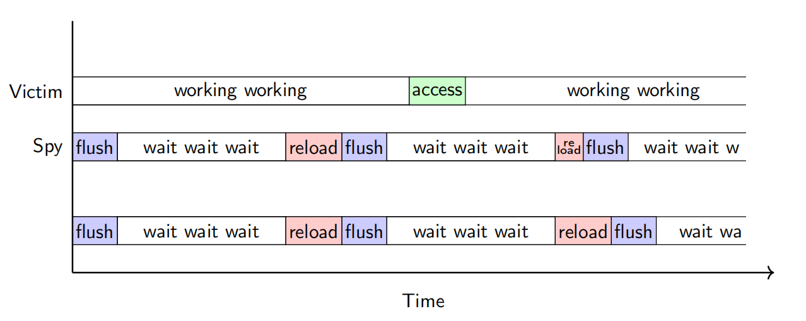

* 参考
    * [基于边信道的硬件攻击小综述(20191216)](https://www.cnblogs.com/sctb/p/12050547.html)
    * [The Mechanism behind Measuring Cache Access Latency](https://www.alibabacloud.com/blog/the-mechanism-behind-measuring-cache-access-latency_599384)

# 缓存
* 局部性: 
    * 时间局部性: 一个被引用的内存位置在不久的将来很可能继续被访问. 
    * 空间局部性: 一个内存位置被引用, 其周围的附近位置很可能不久被访问. 
* 检测数据是否在缓存中. 
    * 命中: 从缓存中取数据. 
    * 否则: 从内存中取数据并放入. 
* 共享缓存: 可改善多核处理器的性能. 
* 缓存行(Cache Line): 
    * 目前主流CPU Cache的Cache Line大小都是64字节. 
* 内存和缓存可能不连续. 
    * 解决方法: 刷新缓存. 

# Prime+Probe
* 步骤
    1. Prime: 访问所有缓存行(方法是用攻击数据填充缓存)
    2. 等待victim执行完. (可能会逐出(`evict`)部分缓存行)
    3. Probe: 测量缓存行的时间: 
        * 缓慢: 缓存行被逐出.   
        * 快速: victim未访问缓存. 


# Flush+Reload
* 步骤
    1. spy程序刷新缓存行. 
    2. 等待victim执行完, 将数据从内存加载到缓存. 
    3. spy测量缓存行的时间: 
        * 缓慢: victim未访问缓存
        * 快速: victim访问了缓存
    4. 重复1至3

        

    ```x86asm
    mfence ; ensure in-order execution
    rdtscp ; 获取开始时间
    mov %eax, %esi ; 保存系统启动时间
    mov (%ebx), %eax ; 访问内存
    rdtscp ; 获取结束时间
    sub %esi, %eax ; 开始和结束时间相减(eax - esi)
    clflush 0 (%ebx) ; 刷新缓存行
    ```
