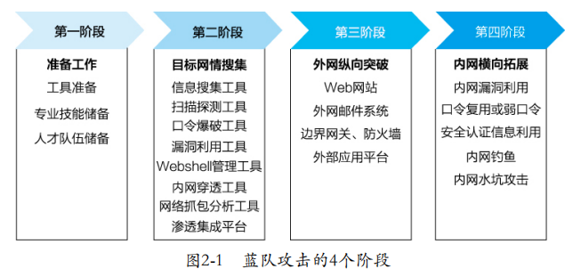

# 红蓝攻防
* 蓝队攻击的4个阶段: 
    

    * 目标网情收集
        * 信息收集工具
            * Whois: 一个用来查询域名是否已经被注册、注册域名详细信息(如域名所有人, 域名注册商)的数据. 
                * APNIC: 亚太互联网络信息中心
                * CNNIC: 中国互联网络信息中心
            * nsloopkup
            * DIG(Domain Information Groper，域名信息搜索器): Linux下用. 
            * OneForAll: 集成证书透明度、网络爬虫、常规检查、DNS数据集、DNS查询与搜索引擎6个模块. 
        * 扫描探测工具
            * Nmap: 在线主机探测（检测存活在网络上的主机）、端口服务探测（检测主机上开放的端口和应用服务）、设备指纹探测（监测目标系统类型和版本信息）和漏洞探测（借助Nmap脚本对目标脆弱性进行扫描和检测）

# sql注入和拖库, xml, json注入

# xss攻击

# csrf

# 文件上传

# 文件包含

# 命令执行

# 代码执行漏洞

# 点击劫持

# 认证(session劫持)

# 逻辑漏洞
* 水平, 垂直越权
* 密码找回    
* 支付逻辑
* 账户攻击
* 羊毛党薅羊毛

# java, json(fastjson, jackson)反序列化安全漏洞

# 暴力破解
* md5碰撞
* 彩虹表

# 旁注攻击(跨库查询, 目录越权)

# 数据库提权

# 钓鱼挂马

# dos攻击