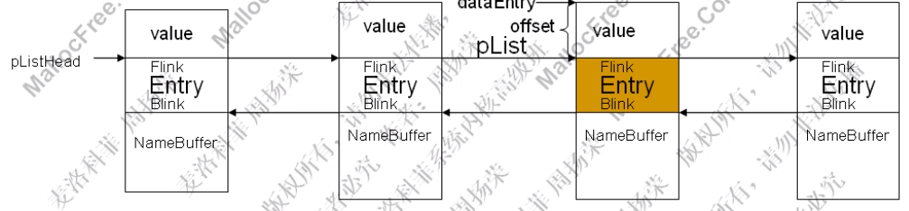
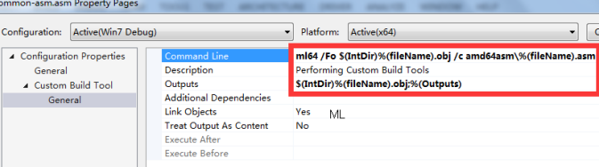

# Windows内核调试
## 虚拟机中新增用于调试的引导项
* 以管理员运行cmd, 执行:
    ```bat
        bcdedit  /dbgsettings serial baudrate:115200 debugport:1

        <!-- 产生新引导项DebugEntry, 执行后会打印新的guid -->
        bcdedit  /copy {current} /d DebugEntry

        bcdedit  /displayorder {current} {<新guid>}
        bcdedit  /debug {<新guid>} ON

        <!-- 如果要用网络调试, 则:  -->
        bcdedit /dbgsettings net hostip:<调试机的IP> port:50000 key:1.2.3.4
    ```
    * 可通过`Windows+R`运行`msconfig`看到引导设置.
    * 若是用串口通信, 则虚拟机需要添加串口, 选com1口, 并添加管道文件路径.

## 开发和调试工具设置
* vs2019
    * 添加设备(即目标虚拟机). 

        

    * 附加到进程, 然后按暂停键. 

        

        
    
    * 可在驱动的源码中打断点. 之后在虚拟机中用`instdrv`启动驱动程序, 则程序将中断.

        

    * 添加驱动程序项目开发支持(wdm)
        * 在安装wdk后, 到`C:\Program files (x86)\Windows Kits\10\Vsix\VS2019\`下, 运行`WDK.vsix`文件

* windbg
    * `File->Kernel Debugging->COM`, 如下图配置.

        

    * 配置符号, `File -> Symbol File Path`, 填写: `<自己写的驱动编译后产生的pdb文件的路径>;srv*D:\win_symbols*http://msdl.microsoft.com/download/symbols`. 其他符号链接: http://sym.ax2401.com:9999/symbols

* 用vscode开发驱动程序(替代visual studio)
    * 参考: [VSCode搭建轻量驱动开发环境](https://bbs.pediy.com/thread-260380.htm)
    * 需要安装: wdk, sdk, [FindWdk](https://github.com/SergiusTheBest/FindWDK.git), 还有Visual Studio 生成工具(即从vs_buildtools安装的东西, 在 https://visualstudio.microsoft.com/zh-hans/downloads/ 找)
    * 需要安装vscode插件: cmake, cmake tools
    * `cmakelist.txt`文件
        ```sh
        list(APPEND CMAKE_MODULE_PATH "../FindWdk/cmake") # 指向FindWdk.cmake文件所在目录
        project(test2022) # 项目名
        find_package(WDK REQUIRED)
        wdk_add_driver(ExploitMe # 子项目名
            ./vulerabilities/demo/9kernel/ExploitMe/exploitme.c # 要编译的文件的路径
        )
        # 编译exe文件
        add_executable(test 
            ./test.cpp
        )
        ```
        

* 配置vscode以开发windows程序
    * 参考: https://code.visualstudio.com/docs/cpp/config-msvc
        * `Terminal` -> `Configure Default Build Task` -> `cl.exe build active file`, 生成`task.json`文件, 各个配置项的含义: 
            * `type`:
                * `cppbuild`
                * `shell`: 使用cmd
                    * 若`cl.exe`等工具没有预先添加到系统路径, 可添加如下选项预先运行`VsDevCmd`: 
                    ```json
                    "options": {
                        "cwd": "${fileDirname}",
                        "shell": {
                            "executable": "cmd.exe",
                            "args": [
                                "/C \"D:/vs_tools/Common7/Tools/VsDevCmd.bat\" && ",
                                "echo %cd% && ",
                                "(if not exist ${fileBasenameNoExtension}_debug mkdir ${fileBasenameNoExtension}_debug) && ", // 若没有目录, 则生成目录
                                "cd /d ${fileDirname}/${fileBasenameNoExtension}_debug && ",
                            ]
                        }
                    },
                    ```
            * `command`: 要运行的程序(如`cl.exe`)
            * `args`: 传给`cl.exe`的参数
                * `${file}`: 活动文件
                * `${fileDirname}`: 当前目录的**完整路径**
                * `${fileBasenameNoExtension}`: 生成的exe文件的名字
            * `group`: 
                * `"isDefault": true`: 表示该任务会在按`ctrl+shift+b`时运行
            * `options`: 
                * `cwd`: 指定工作目录
                * `env`: 配置环境变量
                * `shell`: 
                    * `executable`: 指定要用的shell程序(如`cmd.exe`)
                    * `args`: 参数列表
            * ``: 
        * 按f5时, 若没有`launch.json`, 则会生成
            * `program`: 指定要调试的程序
        * `c_cpp_properties.json`: 配置c/c++扩展
            * 这个文件在vscode的编译中不起作用, vscode找的是`tasks.json`中的配置

## 其他
* 需要禁用驱动程序强制签名
    * Win7: 
        * 开机时按f8, 然后选"禁用驱动程序强制签名"
        * 运行`gpedit.msc`, 用户配置 -> 管理模板 -> 系统 -> 驱动程序安装 -> 设备驱动程序代码签名, 选'未配置'或'已禁用', 或'已启用', 并在下面的下拉框选'忽略'

    * Win10: 开始菜单, 按`shift`并点击重启按钮(或者开机选择引导项时进入'其他选项'). 找到问题修复->高级选项->启动设置, 并选择"禁用驱动程序强制签名".

    * 网上关于永久禁用驱动强制签名, 一般都是说执行`bcdedit /set testsigning on` (可能需要重启, 之后会看到右下角有"测试模式"的水印)和`bcdedit /set nointegritychecks on`.

* Windows平台普通程序开发
    * [配置vscode](https://code.visualstudio.com/docs/cpp/config-msvc)

# NT驱动框架
* 驱动调用流程: 

    
    
* 驱动框架: R3操作一个文件: `Create` -> `Read/Write/DeviceIoControl `-> `Clean` -> `Close`

    

* 驱动运行流程<a id="driverProgress"></a>
    * (在R3层)创建一个服务
        * 注册表项: `HKEY_LOCAL_MACHINE\SYSTEM\CurrentControlSet\Sevices\<服务名>`
        * 启动的GROUP与`StartType`决定了驱动启动方式. `StartType`值越小越早启动. `StartType`值相同则按GroupOrder顺序启动(`HKEY_LOCAL_MACHINE\SYSTEM\CurrentControlSet\Control\GroupOrderList`). `StartType`值如下:
            * 0(`SERVICE_BOOT_START`): 由核心装载器装载. 在内核刚初始化之后, 加载的都是系统核心有关的重要驱动程序(如磁盘驱动)
            * 1(`SERVICE_SYSTEM_START`): 由I/O子系统装载. 
            * 2(`SERVICE_AUTO_START`): 自动启动. 在登录界面出现的时候. 
            * 3(`SERVICE_DEMAND_START`): 手工启动.
            * 4(`SERVICE_DISABLED`): 禁止启动.
    * (在R3层)对象管理器生成驱动对象(`DriverObject`), 将之传递给`DriverEntry`函数, 执行之.
    * 创建控制设备对象(`IoCreateDevice`, 设备名形如`"\\device\\myDrv"`. 创建的设备对象被赋予其一参)
    * 创建控制设备符号链接(R3可见)(`IoCreateSymbolicLink`, 符号链接名形如`"\\dosdevices\\myDrv"`)
    * 若是过滤驱动, 创建过滤设备对象, 绑定
    * 注册分发函数
    * 其他初始化
    * 应用程序打开驱动的设备对象(`CreateFile`, 一参为形如`"\\\\.\\myDrv"`的设备路径(也是符号链接名), 得到一个`Handle`), 向驱动设备对象发送各种请求(`IRP`)
* 应用层调用驱动的相关接口
    * 安装驱动: `OpenSCManager`打开服务控制管理器, `CreateService`安装驱动, `OpenService`打开驱动服务, `StartService`启动服务. 关闭管理器和驱动服务的句柄用`CloseServiceHandle`.
    * 卸载驱动: 先`OpenSCManager`, `OpenService`; 用`ControlService`(带`SERVICE_CONTROL_STOP`参数)停止驱动; `DeleteService`卸载驱动.
* 设备对象接收IRP(I/ORequest Packets))
    * 可以理解为: 
        * 一个放置 I/O 请求的容器
        * 一个与线程无关的调用栈
    * API
        * `IoMarkIrpPending(pIrp)`: 挂起Irp请求(驱动程序的分发函数中则返回`STATUS_PENDING`)
        * `IoSetCancelRoutine(Irp, CancelRoutine)`: 若二参是NULL, 则取消Irp请求. 如果Irp有设置了取消例程, 则返回该取消例程(`Irp->CancelRoutine`), 否则返回NULL.

* 驱动创建的所有设备对象会放在一条链上(`NextDevice`); 所有设备对象都会指向该驱动对象.
* 分发函数: `(PDEVICE_OBJECT pObj, PIRP pIrp)`
    * `read`: 应用层从内核层读取数据: 从`pIrp`拿缓存的地址和长度; 读写; 完成IRP.
    * `write`: 应用层向内核层写数据: 分配缓存(`ExAllocatePoolWithTag`), 拷贝数据(`RtlCopyMemory`).
    * `ioCtl`: 拿到应用层传来的控制码(控制码自己定义), 判断并执行相关操作.
        * 自定义CTL_CODE: `#define MY_CODE_1 CTL_CODE(DeviceType, Function, Method, Access)`
            * `MY_CODE_1`: 生成的IRP的`MinorFunction`
            * `DeviceType`: 设备对象的类型.
            * `Function`: 自定义的IO控制码, 取0x800到0xFFF. (0x0到0x7FF为微软保留)
            * `Method`: 数据的操作模式(`DeviceObject->Flags`域)
                * `缓冲区模式`: `METHOD_BUFFERED`. 用户的输入输出都经过`pIrp->AssociatedIrp.SystemBuffer`来缓冲. (输入缓冲区中的数据被复制到系统缓冲区, 驱动写到系统缓冲区的数据则又会被复制到用户缓冲区.) `pIrp->UserBuffer` 为用户模式的输出缓冲区地址.  `IoGetCurrentIrpStackLocation (Irp)` 得到io栈位置`lpIrpStack`, `lpIrpStack->Parameters.DeviceIoControl`中的`InputBufferLength`和`OutputBufferLength`分别为输入和输出缓冲区的长度. 在内核模式上操作对用户数据的拷贝.  
                    * 仍可能存在安全问题: IO 管理器并不会在发出请求前对输出缓冲区做清零初始化. 驱动程序要以`Irp->IoStatus.Information`指定的长度对输出缓冲清零或写入合法数据, 不然可能返回内核模式下的私有数据(来自其他用户的数据)
                * `直接模式`: 
                    * **系统依然对Ring3的输入缓冲区进行缓冲, 但没对Ring3的输出缓冲区进行缓冲, 而是在内核中进行锁定, 这样Ring3输出缓冲区在驱动程序完成IO请求前, 都是无法访问的.** 
                    * 通过内存描述元列表(`MDL`(Memory Descriptor List), 由`Irp->MdlAddress`指出)以及内核模式的指针直接访问用户数据. 这个MDL列出了**用户的输入/输出缓冲区**的虚拟地址和尺寸, 连同相应缓冲区中的物理页表. IO管理器会在将请求发送给驱动之前锁定这些物理页(**用户缓冲区被锁定, 操作系统将这段缓冲区在内核模式地址再映射一遍. 这样, 用户模式缓冲区和内核模式缓冲区指向的是同一块物理内存**), 并在请求完成的过程中解锁. 
                    * 驱动程序调用`MmGetSystemAddressForMdlSafe(pIrp->MdlAddress, NormalPagePriority)` 来得到 MDL 所描述的缓冲区的内核指针(这个宏将指定 MDL 描述的物理页面映射到系统地址空间中的虚拟地址). `Irp->AssociatedIrp.SystemBuffer`保存请求发出者的缓冲区的内核模式拷贝.
                    * `METHOD_IN_DIRECT`: 直接写模式. IO 管理器读取上述缓冲区给驱动去读. 
                    * `METHOD_OUT_DIRECT`: 直接读模式. IO 管理器获取上述缓冲区给驱动去写.
                * `Neither模式`: `METHOD_NEITHER`. 通过用户模式的指针访问用户数据. 
                    * `irpStack->Parameters.DeviceIoControl.Type3InputBuffer` 为输入缓冲区的地址. 
                    * `pIrp->UserBuffer` 为输出缓冲区地址. 因为这个缓冲区在用户地址空间上, 驱动程序必须在用之前使相应的地址合法化. 
                        * 驱动程序在 try/except 块里调用 `ProbeForRead`(检查一个用户模式缓冲区地址是否真的是Ring3中的地址, 并且是否正确对齐) 或者 `ProbeForWrite`(在ProbeForRead的基础上, 再检查是否可写) 函数来合法化特定的指针. 
                        * 驱动还必须在应用数据之前将它拷贝到池或堆栈里一个安全的内核模式地址. 将数据拷贝到内核模式缓冲区确保了用户模式的调用者不会在驱动已经合法化数据之后再修改它. 
                * 更多关于通信: https://www.cnblogs.com/lsh123/p/7354573.html
            * `Access`: 访问权限, 可取值有: 
                * `FILE_ANY_ACCESS`: 表明用户拥有所有的权限
                * `FILE_READ_DATA`: 表明权限为只读
                * `FILE_WRITE_DATA`: 表明权限为可写
            
* 驱动函数分类<a id="Kernel_Func"></a>
    * `ExXxx`: Executive, 管理层
    * `KeXxx`: Kernel
    * `HALXxx`: Hardware Abstraction Layer, 硬件抽象层
    * `IoXxx`: IO
    * `MmXxx`: Memory
    * `ObXxx`: Object
    * `PsXxx`: Process
    * `FsXxx`: File System
    * `SeXxx`: Security
    * `CcXxx`: Cache, 文件缓存管理
    * `CmXxx`: Configuration Manager, 系统配置管理
    * `PpXxx`: PnP, 即插即用管理
    * `RtlXxx`: Runtime Library
    * `ZwXxx`: 和`NtXxx`一样, 不过在内核编程中调用的都是`ZwXxx`. `ZwXxx`会先将Previous Mode设置为Kernel Mode, 再调用相应的`NtXxx`.
        * 在x64中Zw函数的汇编如下, 其中有一条`syscall`

            ```x86asm
                mov     rax, rsp
                cli     
                sub     rsp, 10h
                push    rax
                pushfq  
                push    10h
                lea     rax, [ntkrnlmp!KiServiceLinkage (fffff80261dfb700)]
                push    rax
                mov     eax, 23h ; ssdt索引
                jmp     ntkrnlmp!KiServiceInternal (fffff80261e08d40) ;     
                ret   
            ```
    * `FltXxx`: MiniFilter框架
    * `NdisXxx`: Ndis框架
    * 部分常用函数(引用自`windows内核安全与驱动开发`)

        

* 在R0中可用和不可用的函数
    * 不可用: `printf, scanf, fopen, fclose, fwrite, fread, malloc, free`
    * 可用: `sprintf, strlen, strcpy, wcslen(返回宽字符串中的字符数), wcscpy, memcpy, memset`

* 防范内核漏洞<a id="Kernel_Vul"></a>
    * 不要使用 `MmIsAddressValid` 函数, 这个函数对于校验内存结果是不可靠的. 
        * 攻击者只需要传递第一个字节在有效页, 而第二个字节在无效页的内存就会导致系统崩溃, 例如 0x7000 是有效页, 0x8000 是无效页, 攻击者传入 0x7fff. 
        * 分页中的异常
            * `page in`: 从磁盘读回物理内存
            * `page out`: 从物理内存写到磁盘
            * 导致分页异常的几种情况: 
                * 访问没有锁定在内存中的分页池
                * 调用可分页(pageable)的例程
                * 在用户线程的上下文中访问没有被锁定的(unlocked)用户缓存
            * 几种分页异常:
                * `hard page fault`: 
                    * 访问的内存不在虚拟地址空间, 也不在物理内存中.
                    * 需要从swap分区写回物理内存也是此异常.
                * `minor page fault`(`soft page fault`): 访问的内存不在虚拟地址空间, 但在物理内存中, 只需MMU建立物理内存和虚拟地址空间的映射关系. 比如多个进程访问同一共享内存, 某些进程还没建立映射关系.
                * `invalid fault`(`segment fault`): 访问的内存地址不在虚拟空间内, 属于越界访问.
    * 在 `try_except` 内完成对于用户态内存的任何操作(包括`ProbeForRead`, `ProbeForWrite`等函数, 检查用户模式缓冲区是否实际驻留在地址空间的用户部分,并正确对齐)
    * 留心长度为 0 的缓存, 为 NULL 的缓存指针和缓存对齐
        * `ProbeForRead`, `ProbeForWrite`等函数的二参`Length`参数为0时, 它们不工作, 可导致绕过. 
        * 缓存指针为空. 不可放行此类空指针. 不要用`if (userBuffer == NULL) {goto pass_request;}`这样的代码来判断用户态参数, 因为windows运行用户态申请地址为0的内存. 
        * 缓存对齐. `ProbeForRead`的三参`Alig`, 比如为2以上的值时, 就有像上面`MmIsAddressValid`的问题.
    * 不正确的内核函数调用引发的问题, 如何防范
        * `ObReferenceObjectByHandle` 未指定类型(第三参数)
        * 不正确的 `ZwXXX` 函数调用不能将任何用户态内存通过调用 ZwXXX 函数传递给内核, 用户态内存未经过校验, 传递给 ZwXXX 会让系统忽略内存检查(因为 ZwXXX 被调用时认为已经处在内核模式) 
        * 不要接受任何用户输入的内核对象给内核函数. 接受用户输入的内核对象意味着可以轻易构造内核任意地址写入漏洞, 不要在设备控制中接受任何用户输入的内核对象并将其传递给内核函数. 
            * 如下面的代码, 实际上是将`Mutex`对象从一个双向链表中移除, 会有两次内存写入操作, 有可能出现类似unsafe unlink的堆溢出漏洞. 
                ```cpp
                if(IoControlCode==IOCTL_RELEASE_MUTEX) {
                    KeReleaseMutex((MY_EVT_INFO)(Irp->AssociatedIrp->SystemBuffer)->Mutex);
                }
                ```
    * 驱动提供给应用层的功能性接口(控制码), 要小心其被利用. 
    * 设备控制尽量使用`BUFFERED IO`, 而且一定要使用 `SystemBuffer`,如果不能用`BUFFERED IO`,对于 `UserBuffer` 必须非常小心地 `Probe`,同时注意 `Buffer` 中指针, 字符串引发的严重问题, 如果可能, 尽量禁止程序调用自己的驱动. 
    * 使用 `verifier`(内核校验器, windows自带, 将驱动添加到其中, 设置检查选项, 一旦发生异常, 就蓝屏)和 Fuzz 工具检查和测试驱动. 对于挂钩内核函数的驱动, 可以使用 `BSOD HOOK` 一类的 FUZZ 工具, 来检查内核函数的缺陷和漏洞.

* WDM(Windows Driver Model)驱动模型<a id="WDM"></a>
    * `IoCreateDevice`
        * 指定R3和R0间读写的通信协议, `pDeviceObject->Flags = ...`
            * `DO_BUFFERED_IO`: 优点安全, 缺点效率低
            * `DO_DIRECT_IO`: 内存映射, 内核层和应用层操作同一块物理内存
            * `DO_NEITHER_IO`: R0直接访问R3处内存的数据. 可能产生提权漏洞.
        * 创建符号链接`IoCreateSymbolicLink`
        * `pDeviceObject->MajorFunction[...] = ...`, 注册分发函数.
        * `pDeviceObject->DriverUnload = ...`, 注册卸载函数. 
            * 要清除设备对象(`IoDeleteDevice`).

* WDF(windows driver foundation)<a id="WDF"></a>
    * 在WDM(windows driver model)的基础上发展而来, 支持面向对象, 事件驱动的驱动程序开发. WDF框架管理了大多数与操作系统相关的交互, 实现了公共的驱动程序功能(如电源管理, PnP支持). 分KMDF(内核模式驱动程序框架)和UMDF(用户模式驱动程序框架). 
    * 框架定义的主要对象: 
        * `WDFDRIVER`: 对应`DRIVER_OBJECT`. 其为根对象, 其他对象都是其子对象. 
        * `WDFDEVICE`: 对应`DEVICE_OBJECT`. 
        * `WDFREQUEST`: 对IRP的封装. 
        * `WDFQUEUE`: 与一个`WDFDEVICE`对象关联, 描述一个特殊的IO请求队列. 有一系列事件处理回调函数, 当IO请求进入队列时, 框架将自动调用驱动程序中对应的callback. 
            * 根据网上说法, 将
        * `WDFINTERRUPT`: 表示设备中断. 
    * 引用计数
        * WDF框架维护每个对象的引用计数. 
            * 创建对象时引用计数为1. 
            * 调用`WdfObjectReference`时引用计数加1. 
            * 调用`WdfObjectDereference`时引用计数减1. 
    * 卸载驱动时的取消操作
        * 参考: https://www.osr.com/nt-insider/2017-issue2/handling-cleanup-close-cancel-wdf-driver/
        * 应用调用`CloseHandle`关闭驱动句柄, 驱动调用`EvtFileCleanup`回调, 并对还在WDFQUEUE中的request发起取消操作. 
            * 一般不应该自己实现`EvtFileCleanup`. 
        * 当文件对象的引用计数减到零时(**意味着已经没有pending的io操作了**), windows会产生close请求, WDF会在`EvtFileCleanup`之后调用`EvtFileClose`函数. 
        * `EvtFileClose`在passive级别, 同时是在随机的进程/线程上下文中被调用. 
        * 对于人工io队列, 当应用层调用`CancelIo`时, 若队列设置了`EvtIoCanceledOnQueue`回调, 其会被调用. 
        * 如果要对已经标记为`cancelable`的请求执行`WdfRequestComplete`, 需要先调用`WdfRequestUnmarkCancelable`. 

# Windbg
* 屏蔽无用的调试信息: `ed nt!Kd_SXS_Mask 0`, `ed nt!Kd_FUSION_Mask 0`
* 进程
    * `!process`
        * `/m <名称加通配符>`
        * `!process 0 0`: 系统所有进程(简). 第一个0可替换为别的进程ID(16进制). 后面可以加要查找的程序的全称.
        * `!process -1`: 当前进程信息(包括所有线程的基本信息).
        * `!process 0 7`: 系统所有进程(详).
        * `!process <EPROCESS> 7`: 进程详细信息.
        * `!process @$proc 0x1f`: 进程详细信息, 包括其中所有线程的线程栈A.
    * `.process /p <EPROCESS>`: 进入进程上下文. (`<EPROCESS>`表示进程的EPROCESS块的地址)
    * `!peb`: 查看当前进程的peb. 
    * `!irql`: 显示当前进程的irql. 
    * `!token <addr>`: 获取分配给进程的安全令牌(token)的详细信息. 
        * 使用`!process <pid> 1`获取的信息中就有token的地址. 
    * `!handle <句柄值>`: 查看句柄信息
    * `!cs`: 查看关键区信息
        * `-l`: 仅列出已锁定的关键区信息. 
* 线程
    * `.attach <pid>`: 附加到进程
    * `.detach`: 断开调试
    * `~*`: 显示所有线程
    * `~<数字>`: 显示第<数字>个线程
    * `~<数字>s`: 切换到第<数字>个线程
    * `~.`: 显示活动线程
    * `~#`: 显示引起异常的线程
    * 注: `~`相关指令用户模式在用户模式下是切换线程, 在内核模式下则是切换处理器, 如`~0`
    * `!runaway`: 扩展显示有关每个线程使用的时间的信息
    * `!thread <ETHREAD>`: 查看线程.
        * `!thread @$thread 0x1f`: 获取线程信息, 其中包括一个从线程开始运行到切换上下文(`SwapContext`或通过`syscall`进入R0时发生上下文切换)之前的线程栈. 
    * `.thread <ETHREAD>`: 进入线程上下文. 
* 内存和寄存器
    * `dt [nt!]_EPROCESS [<字段>] [<addr>]`: 查看`nt`模块的`_EPROCESS`结构. 加`-r`参数可以递归打印. 带`<addr>`则用该结构打印某地址块. 带`<字段>`则只打印该字段.
    * `<db(1字节)|dw(2)|dd(4)|dq(8)|dp|dD|df> <addr> <L20>`: 打印数字, 打印0x20个单位. 在`db`等前面加感叹号, 即`!db`, 则后面可接物理地址. 
    * `<da|du|ds|dS> <addr>`: 打印字符
    * `<dpa|dpu|dps|dpp> <addr>`: 打印指针指向的数据. 第二个字符: d(32位指针), q(64位指针), **p(标准指针大小, 取决于处理器架构)**. 第三个字符: p(DWORD或QWORD), a(ascii), u(unicode), s(symbol).
    * 修改内存: 把d改成e, 如`eb <addr> <val>`.
        * `e[a|u] <地址> <字符串>`: 
        * `e[za|zu] <地址> <字符串>`: 会在字符串末尾加上0
        * `f <地址> L<数量> <模式>`: 用给定模式反复填充一定数量的字节到内存. 
    * `s`: 内存搜索. 
        * `<范围> [L<长度>] <模式>`: 在内存中搜索指定模式. 
        * `-sa`: 搜ascii
        * `-su`: 搜unicode
    * `c <addr1> <addr2>`: 比较两端内存区域. 
    * `.dvalloc <大小>`: 在调试器进程空间中分配内存. 
        * `.dvfree <基址> <大小>`: 释放`.dvalloc`分配的内存. 
    * `.readmem <文件名> <范围>`: 将一个文件从磁盘读入被调试程序的内存. 
    * `.writemem <文件名> <范围>`: 将被调试程序的内存写入磁盘文件. 

    * `k`指令: 打印线程的栈帧. 后面加数字可以指定显示多少行. 
        * `kv`或`kb`: 查看调用栈, 显示栈帧的ebp, 返回地址, 函数在源代码的位置(可以点击跳转).
        * `kd`: 查看栈, 从ebp处开始打印.
        * 若要从栈顶开始查看栈数据, 可用`dds esp L<行数>`
    * `!pool <addr>`: 显示地址的信息. 若指定-1, 则显示进程中所有堆的信息.
    * `!vad <addr>`: 列出VAD树. `addr`是由`!process <进程id> 1`列出的`VadRoot`地址. 
    * `!dh <addr>`: 打印PE头部.
    * `r`: 显示寄存器
        * `rm`: 寄存器掩码
            * `rm 2|4|8`: 设置默认掩码
        * `rM1ff`: 打印所有寄存器
        * `rF`: 打印浮点寄存器
        * `rX`: 打印xmm寄存器
        * `r <寄存器>:[f|d|ub|uw|ud|uq]`: 以 浮点|双精度浮点|字节|字|双字|四字 形式打印寄存器值. 
    * `dg [cs|ds|ss|gs|fs]`: 显示段选择符信息
* 调试
    * alt + del: 中断, 进入调试器. 
    * `g`: 继续运行
        * `gu`: go up, 执行当前函数直到结束, 返回到调用者. 
    * `p`: 执行一条指令(如果打开了source mode, 则执行一行源码)
        * `pc`: 单步跳过, 直到遇到call
        * `ph`: 单步跳过, 直到遇到分支
        * `pt`: 单步跳过, 直到遇到ret
        * `pct`: 单步跳过, 直到遇到call或ret
    * `pa <addr>`: 执行到addr处
    * `pc`: 执行到下一个函数调用处停下
    * `t <次数>`: 多次单步执行, **遇到函数会进入**
    * 断点
        * `bl <*|n|n1-n2>`: 列出断点
        * `bc <*|n|n1-n2>`: 清理断点
        * `bd <*|n|n1-n2>`: 禁用断点
        * `be <*|n|n1-n2>`: 启用断点
        * `bp <addr|model!func|<文件名>:<行号>>`: 设置断点. `bp`要求模块已加载, 失败则转化为`bu`断点. 
            * `/p <eprocess>`: 设置只有对应进程能触发此断点. 
            * `/t <ethread>`: 设置只有对应线程能触发此断点. 比如使用`@$thread`, 则只会在当前线程触发该断点. 
            * 注意 **bp \`src.c\`:66** , 文件名要用反引号包起来. 
        * `bu model!func`: u是unresolved.
        * `bm model!fu*c`: 
        * `ba <w4|r4|e4|i4> <addr>`: 内存断点(数据断点, 处理器断点). 读, 写, 执行, IO(端口, 寄存器). 地址可以写成0x8100xxxx这样.
        * `<bp|ba> </p|/t> <proc> <addr|func>`: 进程/线程断点, 只有该进程或线程执行到这个地方时才中断.
        * 条件断点(注意后面的条件表达式用的是默认语法masm)
            * `bp <addr> "j (poi(var1) = 0n123) ''; 'gc'"`: 若`var1`为123, 则中断, 否则继续运行. 
            * `bp <addr> ".if (@eax != 5) { gc; }"`, eax寄存器值为5时中断, 否则继续运行. 后面还可以接`else`, `elsif`
            * `gc`: 从断点恢复执行. 
        * 在达到条件时中断(无需指定断点地址)
            * `.if (@rax == 0x1234) {.echo 1234} .else { p "$<eaxstep" }`
                * 将文件命名为`eaxstep`
                * 当`rax`值不为`0x1234`时, 这行代码执行`p "$<eaxstep"`, 即单步跳过并再次调用本脚本文件. 
                * 速度较慢. 
    * `z(<条件>)`: 作为循环条件使用
        * `reax = eax - 1; z(eax)`: 对eax作清零. 当eax不为0时, 重复执行分号前的表达式. 
* 监控调试事件和异常
    * `sx`: 列出所有事件. 下面`<e>`表示事件名称或事件代码数字
        * `sxe <e>`: 为该事件打开断点
            * `sxe ld:myDriver.sys`: 在该驱动程序加载的时候中断
        * `sxd <e>`: 为该事件关闭断点
        * `sxr <e>`: 只为该事件打开输出
        * `sxi <e>`: 忽略该事件
        * `sx- -c <cmd> <e>`: 将某个命令与事件相关联. 如`sx- -c "k" ld`, 在每一次加载模块的时候打印栈
* 驱动和设备相关命令
    * `!drvobj <驱动名称, 如\Driver\AFD>`: 打印驱动对象的详情
    * `!devobj`: 
    * ``: 
* 其他命令
    * `.ofilter /! <通配符表达式>`: 在windbg控制台中隐藏不想输出的内容
    * `.expr`: 查看使用的表达式求值语法(MASM还是C++)
        * `.expr /s c++`: 指定使用c++
    * `.printf "%d", @eax`: 打印, 与printf函数类似
        * `%p`: 指针
        * `%d, %x, %u`: 整型
        * `%ma, %mu`: 打印指针处的ascii/unicode字符串
        * `%msa, %msu`: 打印指针处的ansi_string/unicode_string
        * `%y`: 打印指针处的符号名称
    * `lm`: 列出加载的模块
        * `lm m sth*`: 按名称列出加载的模块
        * 参数v: verbose模式, 列出模块更多信息
    * `.reload`: 加载符号表. `/user`则只加载用户层的符号. `f`可以强制加载(而非延迟加载).
        * `.reload <可执行文件名>`: 直接加载可执行文件对应的符号文件. 注意要加'.exe'等文件后缀. 
        * `.reload /i:` 忽略pdb文件和sys文件时间戳的不同, 强制加载符号文件
    * `x nt!kes*des*table`: ssdt表
    * 查看shadowSsdt表: 先切换到进程上下文, 然后`x nt!kes*des*table`, 拿第一行的地址, 对其用`dd`, 打印出来的第二行的前4个字节即是该表地址.
    * `u <addr1> <addr2>`: 查看`<addr1>`到`<addr2>`的汇编. 如果只有`u`, 则显示当前汇编. 
        * `uf`: 反汇编整个函数的代码. 
            * `/c`: 只显示出现的call指令. **可用于看一个函数调用了哪些api**. 
            * `/D`: 结合上面的`/c`参数, 显示调用的api的链接. 
        * `ub`: 往前打印汇编(需要指定起始地址)
        * `u @eip`
    * `.open -a <函数名>+<偏移>`: 调出源文件
    * `!pte <虚拟地址>`: 将虚拟地址转为物理地址
    * `!vtop <进程基地址> <虚拟地址>`: 将虚拟地址转为物理地址
    * `!idt`: 查看cpu的中断向量描述符表
    * `!pcr`: 查看当前的处理器控制欲(processor control region)
    * `!gle`: 返回最后的错误码
    * `#`: 搜索某个反汇编模式
    * `.cls`: 清理调试器输出窗口
    * `.echo myVar`: 如果`myVar`是已赋值的别名, 则打印其值, 否则打印"myVar". 
    * `.symopt`
        * `.symopt +0x40`: `SYMOPT_LOAD_ANYTHING`, 跳过pdb文件的GUID检查. 
    
* 其他语法
    * 数值: 不加前缀时, 默认是十六进制
        * `0n123`: 十进制
        * `0x123`: 十六进制
        * `0t123`: 八进制
        * `0y10101`: 二进制
        * `!abc`: 表示二进制数abc, 而非符号abc
    * 表达式: 
        * `? <默认语法表达式>`: 
        * `?? <c++表达式>`: 注意不能直接接数字
            * `? @@c++(<c++表达式>) + @@masm(<masm>)`
                * 直接使用`@@`则后面接C++表达式(因为默认是masm)
        * `.expr /s c++`: 切换windbg表达式语法为c++

        * masm
            * `poi(MyVar)`: 对MyVar作解引用, 得到MyVar的值. 
        * C++
            *  `? @@c++(@$peb->ImageSubSystemMajorVersion)`: 箭头运算符
            * sizeof
            * `#FILED_OFFSET(<结构体名>, <成员名>)`: 查看结构体成员的偏移值
            * 三元操作符
            * 类型转换
        
    * 伪寄存器
        * 预定义伪寄存器(以$开始, 再加上前缀@等于告诉解释器这个标识符不是一个符号(但有时这样做会影响速度?))
            * `$csp`: 当前调用栈指针
            * `$ip`: 当前指令指针
            * `$exentry`: 当前进程第一个可执行体的入口地址
        * 自定义伪寄存器
            * `$t0` ~ `$t19`, 使用r命令为它们赋值: `r? $t0 = 1`
    * 别名(alias)
        * 用户命名别名
            * 创建和管理用户命名别名
                * `as myAlias lm;vertarget`: 注意是小写s, 大写的话会在分号结束. 等价命令是`aS myAlias "lm;vertarget"`
                * `aS`
                    * `/f myAlias c:\temp\line.txt`: 为别名myAlias赋予**文件内容**. 
                    * `/x myAlias <expr>`: 将**expr表达式(不是指令)**求得的值(64位)赋予别名myAlias. 
                    * `/c myAlias <command>`: 将**command指令**得到的结果赋予别名myAlias. 
                    * `/e myAlias envVar`: 将**环境变量envVar的值**赋予别名myAlias. 
                    * `/m[a|u|sa|su] myAlias <addr>`: 将addr地址处的NULL结尾的ascii字符串|Unicode字符串|ASCII_STRING类型数据|UNICODE_STRING类型数据赋予别名myAlias. 
                * `al`: 列出已命名别名
                * `ad [/q] [<aliasName>|*]`: 删除指定别名或所有别名. 使用/q开关的话, 如果没找到别名, 不会报错. 
            * 用户命名别名解释执行
                * `.printf "myAlias value is ${myAlias}"`
                * `${/d:myAlias}`: 若myAlias已定义, 则返回1, 否则0. 
                * `${/f:myAlias}`: 若myAlias未定义, 返回空字符串. 
                * `${/n:myAlias}`: 若myAlias未定义, 则保持原样, 即"${/n:myAlias}"; 若已定义, 则为值为"myAlias". 
                * `${/v:myAlias}`: 禁止别名求值, 保持原样, 即"${/v:myAlias}". 
            * 注意
                * `aS myVar 0n123; .printf "v=%d", ${myVar}`: 会出错. **不能在指定别名的同一行中使用别名**. 可在新块使用别名, `aS myVar 0n123; .block { .printf "v=%d", ${myVar}; }`
                * 如果要给一个别名重新赋值(即更新别名的值):
                    * 错误写法: `aS myVar 0n123; .block { aS /x myVar ${myVar}+1; }`, 会得到一个名为0n123, 值为0n124的别名. 
                    * 正确写法: `aS myVar 0n123; .block { aS /x ${/v:myVar} ${myVar}+1; }`
        * 固定名称别名
            * $u0 ~ $u9 十个别名. 如: 
                * `r $.u0 = .printf`
                * `r $.u1 = hello world`
                * `$u0 "$u2\n"`
            * 固定名称别名替换的优先级高于用户命名别名. 
        * 自动别名
            * 类似于预定义的伪寄存器, 不同之处在于它们可以使用${}语法. 
            * 有如下: 
                * `$ntnsym`: 
                * `$ntwsym`: 
                * `$ntsym`: 
                * `$CurrentDumpFile`: 
                * `$CurrentDumpPath`: 
                * `$CurrentDumpArchiveFile`: 
                * `$CurrentDumpArchivePath`: 
            * 一个例子
                * `cdb -cf av.wds -z m:\xp_kmem.dmp`
                * `av.wds`如下: 
                    ``` 
                    .logopen @"${$CurrentDumpFile}.log" $$ 打开一个与当前dmp文件同名且后缀为.log的日志文件
                    !analyze -v
                    .logclose
                    .printf "finished"
                    q
                    ```
    * 语言
        * 注释: 
            * `$$ 注释 ;` 分号可作为注释的结束标志. 
            * `* 注释 ` 星号后面的内容都不会被执行. 它和前面的命令间应该有分号隔开, 不然报语法错误 
        * 字符, 字符串
            * 同C语言
            * 原始字符串: `@"C:\temp"`, 加`@`标识**字面值字符串**
        * 块: `.block {...}`
        * 条件语句: `.if, .elsif, .else`
            ```
            .if '${var1}' == 'hello' {
                .printf "equal\n"
            }
            ```
            * 注意上边的字符串对比中, 两边都得用单引号包围, **不能用双引号**. 
        * 类似C的三元操作符: `j (poi(var1) = 0n123) ''; 'gc'` 注意这个表达式不返回值. 
        * 脚本错误处理: 如下, 会在出错后跳出. 
            ```
            .catch {
                <非法命令>
                .printf "reached\n"
            }
            ```

            * 在`.catch`块中使用`.leave`可跳出块. 
        * 重复结构
            * 作用域
                * 调试发现, 一个`.block`块里是一个作用域, 其中的变量(别名)跟块外的同名变量的值可能会不一致. 
            * `.for (r $t0=0; 1; r $t0=@$t0+1) {...}`
            * 有`.break` `.continue`
            * `.while (<condition>) {...}`
            * `.do {...} (<condition>)`
            * `reax = eax - 1; z(eax)` 重复z命令前的指令
            * foreach循环
                * `/pS <数值>`: 初始跳过的令牌个数
                * `/ps <数值>`: 每个迭代中要跳过的令牌个数
                * `.foreach /s (myVar "ntdll kernel32 kernelbase") { x ${myVar}!*CreateFile* }` 字符串分词. 如这条指令, 是在字符串指定的三个模块中找形如`*CreateFile*`的函数. 
                * `.foreach /pS 5 (myVar {.dvalloc 0x1000}) { r $t0 = ${myVar}; .break }` 命令输出结果分词. 如这条指令, 把`.dvalloc 0x1000`指令产生的前5个token跳过, 取最后一个值, 赋予$t0. 
                * `.foreach /f (line "<文件路径>") {.printf "${line}\n"}` 文件分词. 读取文件的每一行. 
                * 扩展的`.foreach`
                    * `!for_each_frame`: 为当前线程栈的每个帧执行命令. 
                    * `!for_each_function`: 对给定模块作模式匹配, 对其中匹配到的每个函数执行命令. 
                    * `!for_each_local`: 为当前帧的每个局部变量执行命令. 
                    * `!for_each_module`: 为每个加载的模块执行命令. 
                    * `!for_each_process`: 为每个进程执行命令. (内核调试时)
                    * `!for_each_thread`: 为每个线程执行命令. (内核调试时)
                    * 例: `!for_each_function -m:ntdll -p:*File* -c:.echo @#SymbolName`: 
        * 模式匹配
            * `$spat("c:\dir\name.txt", "*name*")`: 返回匹配到的位置(从1开始). 若未匹配到, 返回0. 
            * `$scmp`: 字符串比较(大小写敏感)
            * `$sicmp`: 字符串比较(大小写不敏感)
    * 脚本文件
        * 打开脚本文件(注意文件路径和`$$><`等前缀间不能有空格)
            * `$$><test.wds`: 会把所有换行符替换成分号, 所有内容连成一个命令块
                * `$$>a<test.wds <参数1>`: 可向脚本传参, 在脚本中$arg1为第一个参数($arg0包含脚本的名字)
            * `$$>test.wds`: 会将脚本文件里的每一行**逐行在windbg里运行**并打印结果. 如果有控制流命令, 有花括号换行时, 这样执行会报错(因为每一行不是完整可执行的命令)
            * `.if $${/d:$arg1} `

* 快捷键
    * `alt + delete`: 中断
    * `f5`: 继续运行
    * `f9`: 断点
    * `f10`: 单步执行
    * `f11`: 单步步入

* 使用经验记录
    * 调试物理机应用层程序时不能下断点: 
        * 方法: 以管理员运行windbg
    * 调试虚拟机的应用程序, 第一次可以进断点, 后面某一次进不了
        * 方法: 目前看来只能重启windbg
    * 调试时切换栈帧, 发现寄存器的值并没有随着变化. 

* 反调试
    * `EPROCESS`结构中的`DebugPort`成员为调试端口, 将之清零以防止调试
    * `KdDisable`
    * HOOK以下函数: 
        * `NtOpenThread`:
        * `NtOpenProcess`:
        * `KiAttachProcess`:
        * `NtReadVirtualMemory`: 该函数未导出, 应用层有一个`ReadProcessMemory`函数. 
        * `NtWriteVirtualMemory`:
* 反反调试
* 花指令
    * OLLVM
        * 控制流平展模式
        * 指令替换模式
        * 控制流伪造模式

# 蓝屏分析
* 系统崩溃后产生DUMP文件. 设置: `电脑 -> 系统属性 -> 启动和故障恢复`: 1. 把`系统自动重启`的勾去掉; 2. `写入调试信息`选`核心内存转储`
* windbg分析dump文件
    * open crash dump
    * 设置符号文件路径
    * `!analyze -v`
        * `STACK_TEXT`调用栈信息.
    * `<kv|kp|kb>`
    * `.open -a <模块名>!<函数名>+<偏移>`
* 常见原因
    * 关闭了无效HANDLE
    * 在没有`ObReferenceObject(pFileObject)`的情况下`ObDereferenceObject(pFileObject)`
    * 引用NULL指针
    * 内存访问越界
    * 高中断级访问了缺页内存

* 例子

    ```cpp
        UNICODE_STRING uStr = {0};
        uStr.Buffer = ExAllocatePoolWithTag(PagedPool, wcslen(L"Nice to meet u")+sizeof(WCHAR), 'POCU');
        if (uStr.Buffer == NULL) return;
        RtlZeroMemory(uStr.Buffer, wcslen(L"Nice to meet u")+sizeof(WCHAR));
        RtlInitUnicodeString(&uStr, L"Nice to meet u"); // 会直接将L"Nice to meet u"的地址赋给uStr.Buffer, 而该地址在静态常量区
        DbgPrint("%wZ\n", &uStr);
        ExFreePool(uStr.Buffer); // 导致蓝屏
    ```

# 字符串
* Unicode字符串数据类型(https://blog.csdn.net/aishuirenjia/article/details/88996228). L表示long, P表示指针,C表示constant, T表示指针指向的字符占的字节数取决于Unicode是否定义, W表示wide, STR就是string的意思. 
    * `LPSTR`: 32bit指针 指向一个字符串, 每个字符占1字节. 相当于　`char * `
    * `LPCSTR`: 32-bit指针 指向一个常字符串, 每个字符占1字节. 相当于　`const char * `
    * `LPTSTR`: 32-bit指针 每字符可能占1字节或2字节, 取决于Unicode是否定义 
    * `LPCTSTR`:32-bit指针 指向一个常字符串,每字符可能占1字节或2字节, 取决于Unicode是否定义 
    * `LPWSTR`: 32-bit指针, 指向一个unicode字符串的指针,每个字符占2字节. 
    * `LPCWSTR`:32-bit指针, 指向一个unicode字符串常量的指针,每个字符占2字节. 
* 定义常量UNICODE_STRING: `UNICODE_STRING str = RTL_CONSTANT_STRING(L”my first string”);`

    ```cpp
    typedef struct _UNICODE_STRING {
        USHORT Length; // Buffer中字符串的字节数(不含结尾的NULL)
        USHORT MaximumLength; // Buffer的大小(字节数)
        PWSTR Buffer; // PWSTR等价于WCHAR *
    } UNICODE_STRING, *PUNICODE_STRING;
    typedef struct _STRING {
        USHORT Length; 
        USHORT MaximumLength;
        PCHAR Buffer; 
    } ANSI_STRING, *PANSI_STRING;

    // 初始化方式1
    UNICODE_STRING uStr = {0};
    WCHAR *sz = L"Hello";
    RtlInitUnicodeString(&uStr, sz);
    // 或
    DECLARE_CONST_UNICODE_STRING(uStr, L"Hello")

    // 初始化方式2: 栈上buffer
    UNICODE_STRING uStr = {0};
    WCHAR sz[512] = L"Hello";
    // PWCHAR sz = (PWCHAR) ExAllocatePoolWithTag(NonPagedPool, 512 * 2, 'TSET');
    uStr.Buffer = sz;
    uStr.Length = wcslen(L"Hello");
    uStr.MaximumLength = sizeof(sz);

    // 打印
    DbgPrint("%wZ\n", &uStr);
    ```

* 常用API

    ```cpp
    UNICODE_STRING uStr1 = {0};
    WCHAR buff[100] = "Hello";
    uStr1.Length = 10;
    uStr1.Buffer = buff;

    WCHAR *str1 = "world";

    UNICODE_STRING uStr2 = {0};
    uStr1.Length = 10;
    uStr1.Buffer = str1;

    // 常用API
    RtlInitUnicodeString(&uStr1, str1); // 会根据字符串str1, 设置uStr1的Length属性为其长度, MaximumLength属性为其长度加2
    RtlCopyUnicodeString(&uStr1, &uStr2);
    RtlAppendUnicodeToString(&uStr1, str2);
    RtlAppendUnicodeStringToString(&uStr1, &uStr2);
    RtlCompareUnicodeString(&uStr1, &uStr2, TRUE/FALSE); // 三参表示是否忽略大小写
    RtlAnsiStringToUnicodeString(&uStr1, &aStr1, TRUE/FALSE); // 三参TRUE则由系统分配内存.有溢出风险.
    RtlFreeUnicodeString(&uStr1); // 三参TRUE则由系统分配内存

    // 安全函数, 能检测溢出
    #include <ntstrsafe.h>
    RtlUnicodeStringInit(&uStr1, str1);
    RtlUnicodeStringCopy(&uStr1, &str1);
    RtlUnicodeStringCat(&uStr1, &str1);

    // 将char字符数组转为w_char字符数组
    NTSTRSAFEDDI RtlStringCbPrintfW( // 用于替代swprintf_s函数
        [out] NTSTRSAFE_PWSTR  pszDest,
        [in]  size_t           cbDest,
        [in]  NTSTRSAFE_PCWSTR pszFormat,
        ...              
    );
    ```

* UNICODE_STRING常见问题
    * 计算length时, 少了`*sizeof(WCHAR)`
    * 计算字符数时, 少了`/sizeof(WCHAR)`
    * 使用了`wcscmp, wccscpy`等函数操作

# 文件
* 文件的表示
    * 文件
        * 应用层: `"c:\\doc\\a.txt"`
        * 内核: `L"\\??\\c:\\a.txt"` -> `"\\device\\harddiskvolume3\\a.txt"`, 前面问号是卷设备对象的符号链接名.
            * 注意: 实验发现, **反斜杠不能多!**
    * 设备(驱动程序)
        * R3: 设备名: `L"\\\\.\\xxDrv"`
        * R0: 
            * 设备名: `L"\\device\\xxDrv"`; 
            * 符号链接名: `"\\dosdevices\\xxDrv"` 或 `"\\??\\xxDrv"`
* 内核文件操作API
    * 参考: 
        * 异步读写文件: https://blog.actorsfit.com/a?ID=01250-c1a81826-93fe-49ff-8f3a-3c95f78ca582
    * 打开文件获得handle -> 基于handle读写查删 -> 关闭
    * `InitializeObjectAttributes`宏: 初始化一个`OBJECT_ATTRIBUTES` 结构体
    * `ZwCreateFile`: 打开文件
        ```cpp
        NTSTATUS ZwCreateFile(
            _Out_     PHANDLE FileHandle, // 得到的文件句柄
            
            // 申请的权限
            // FILE_WRITE_DATA: 打开写文件内容,  
            // FILE_READ_DATA: 读文件内容,  
            // DELETE: 删除文件或文件改名, 
            // FILE_WRITE_ATTRIBUTES: 设置文件属性,  
            // FILE_READ_ATTRIBUTES: 读文件属性 
            // SYNCHRONIZE: 同步操作
            _In_      ACCESS_MASK DesiredAccess, // 

            // 属性, 包含文件路径
            _In_      POBJECT_ATTRIBUTES ObjectAttributes, // 

            // 其中的status保存文件操作结果状态
                // FILE_CREATED
                // FILE_OPENED
                // FILE_OVERWRITTEN
                // FILE_SUPERSEDED
                // FILE_EXISTS
                // FILE_DOES_NOT_EXIST
            _Out_     PIO_STATUS_BLOCK IoStatusBlock, // 

            _In_opt_  PLARGE_INTEGER AllocationSize, // 设为NULL即可

            _In_      ULONG FileAttributes, // 新建的文件的属性. 一般设为FILE_ATTRIBUTE_NORMAL
            
            _In_      ULONG ShareAccess, // 本程序打开这个文件的时候, 允许别的程序同时打开这个文件所持有的权限, 包括FILE_SHARE_READ, FILE_SHARE_WRITE, FILE_SHARE_DELETE

            // 本次打开文件需要做的操作
                // FILE_CREATE: 新建文件. 如果文件已经存在, 则这个请求失败. 
                // FILE_OPEN: 打开文件. 如果文件不存在, 则请求失败. 
                // FILE_OPEN_IF: 打开或新建. 如果文件存在, 则打开. 如果不存在, 则新建文件. 
                // FILE_OVERWRITE: 覆盖. 如果文件存在, 则打开并覆盖其内容. 如果文件不存在, 这个请求返回失败. 
                // FILE_OVERWRITE_IF: 新建或覆盖. 如果要打开的文件已存在, 则打开它, 并覆盖其内存. 如果不存在, 则简单的新建新文件. 
                // FILE_SUPERSEDE: 新建或取代. 如果要打开的文件已存在. 则生成一个新文件替代之. 如果不存在, 则简单的生成新文件. 
            _In_      ULONG CreateDisposition, // 

            // FILE_DIRECTORY_FILE: 打开目录文件
            // FILE_RANDOM_ACCESS: 意味着文件能随机读取(因此系统不会执行线性预读(sequential read-ahead))
                // 线性预读: 以extend为单位的. 通过判断当前的extend中的数据是否是连续访问的, 并以此来预测是否有必要把下一个extend提前从磁盘文件中读取出来, 加载到buffer pool中
                // 随机预读: 针对的是当前extend, 通过判断当前extend中的page被读取的次数, 来预测是否有必要把当前extend的数据加载到buffer pool中
            // FILE_SYNCHRONOUS_IO_NONALERT: 对该文件的所有操作都是同步执行的(意味着不会出现pending状态). 要求DesiredAccess必须有SYNCHRONIZE
            _In_      ULONG CreateOptions, // 
            _In_opt_  PVOID EaBuffer, // 设备驱动中必须设为NULL
            _In_      ULONG EaLength // 须设为0
        );

        // 新建文件夹(若不存在)
        HANDLE hTmpFile;
        IO_STATUS_BLOCK statusBlk = { 0 };
        OBJECT_ATTRIBUTES objAttr;
        UNICODE_STRING uTmpDumpPath;
        RtlInitUnicodeString(&uTmpDumpPath, L"\\??\\C:\\myDir");
        InitializeObjectAttributes(&objAttr, &uTmpDumpPath, OBJ_CASE_INSENSITIVE | OBJ_KERNEL_HANDLE, NULL, NULL);
        status = ZwCreateFile(
            &hTmpFile,
            FILE_READ_ATTRIBUTES, // SYNCHRONIZE | GENERIC_READ,
            &objAttr,
            &statusBlk,
            NULL,
            FILE_ATTRIBUTE_NORMAL,
            FILE_SHARE_READ | FILE_SHARE_WRITE,
            FILE_OPEN_IF,
            FILE_DIRECTORY_FILE,
            NULL,
            0
        );
        ```
    * `ZwWriteFile`
        * 官方文档中有这么一段话: 
            > 文件和事件句柄只有在创建句柄的进程上下文中才合法. 为了避免安全问题, 驱动应在系统进程而非驱动所在进程上下文中创建要传给`ZwWriteFile`函数的文件或事件句柄. 
            
    * `ZwReadFile`
    * `ZwQueryInformationFile`读取文件属性, `ZwSetInformationFile`: 可用于删文件
        * 第五参
            * `FileBasicInformation`
            * `FileStandardInformation`
            * `FileRenameInformation`: 重命名文件时用
            * `FileDispositionInformation`: 删文件时用
    * `ZwQueryFullAttributesFile`: (irp_mj_set_information). 可删除和重命名文件
    * `ZwClose`
    * `ZwQueryDirectoryFile`: 遍历文件夹
    * `RtlVolumnDeviceToDosName(fileObject->DeviceObject, &DosDeviceName)`: 得到文件所属设备的名称(如`C:`)
    * `IoQueryFullDriverPath(drvObj, &fullPath)`: 获取驱动程序文件完整路径. 
* 其他知识点
    * 8个扇区 == 1个簇

## 强删文件
* R0层关句柄
    * 打开文件: `IoCreateFile`(比`ZwCreateFile`更底层)
    * 删除独占文件
        * 从全局句柄表找到打开这个文件的进程和文件的句柄
            * `ZwQuerySystemInformation( SystemHandleInformation, buf, size, NULL )`. 因为没法得到全局句柄表的大小, 所以要逐渐递增buf大小. 注: `ZwQuerySystemInformation`这个函数在ntdll中, 内核层编程时可在头文件声明一下, 声明头加上`NTSYSAPI`和`NTAPI`. `SystemHandleInformation`值为16.
        * 把句柄拷贝过来: `ZwDuplicateObject`, `DUPLICATE_CLOSE_SOURCE`则表示同时在目标进程中把文件句柄关掉
        * 再次打开文件, 得到handle
        * 通过handle得到fileObject(用`ObReferenceObjectByHandle`)
        * `IoGetRelatedDeviceObject(fileObject)`得到设备对象deviceObject
        * 初始化事件`KeInitializeEvent`; 初始化用来删除文件的Irp
        * 为Irp设置一个例程(回调)(`IoSetCompletionRoutine`), 当下层驱动完成文件的删除时, 会通知执行该例程.
        * 下发Irp(交给下层的文件系统驱动处理): `IoCallDriver(DeviceObject, Irp)`
        * 等待完成: `KeWaitForSingleObject`
    * 删除正在运行的exe文件
        * 系统会检查`fileObject->SectionObjectPointer`中的`ImageSectionObject`和`DataSectionObject`, 都不为0则表示exe正在运行. 
        * 因此强删的方法是先把上述两项设为0, 欺骗系统.

* R3层关句柄
    * 原理与R0层类似
    * 用线程处理死锁
        * `NtQueryObject`会导致某些句柄hang住
        * `GetFileType(hFile)`也是

# 系统引导和磁盘分区
* BIOS和MBR
    * 流程
        * 启动电源, 硬件初始化检查.
        * 根据`CMPS`的设置, BIOS加载启动盘, 将`MBR`的引导代码载入内存, 然后启动过程由`MBR`来执行.
        * 搜索`MBR`中的分区表`DPT`, 找到活动分区, 将其`VBR`中的引导代码载入内存`0x07c00`处.
        * 引导代码检测当前使用的文件系统, 查找`ntldr`文件, 启动之.
        * BIOS将控制权转交给`ntldr`, 由它完成操作系统的启动. (Win7是`BootMgr`) (Linux则是`GRUB`)
    * `MBR`: 物理硬盘第一扇区0柱面0磁头.
    * `VBR`: 卷引导记录, 为每个非扩展分区及逻辑分区的第一个扇区.
    * `DBR`(DOS Boot Record): 操作系统进入文件系统后可以访问的第一个扇区. 包括一个引导程序和一个被称为`BPB`(BIOS Parameter Block)的本分区参数记录表.
    * `EBR`(Extended Boot Record): 扩展分区的每个逻辑驱动器的类似MBR的引导记录.
    * `LBA`(logical block address 32位): 一个扇区512字节(2^9), 最大支持分区: 2^32 * 2^9 = 2T

        

* `UEFI`(Unified Extensible Firmware Interface, 统一的可扩展固件接口)和GPT
    * `LBA`(64位), 分区数量无限制, MS128个分区.
    * `UEFI`相当于一个微型操作系统. 具备文件系统的支持, 能直接读取`FA`T分区中的文件, 可开发处直接在UEFI下运行的应用程序(以`efi`结尾). 可将windows安装程序做成`efi`程序, 然后把它放任意分区中直接运行.
    * 不需要主引导记录, 不需要活动分区, 只要复制一个安装文件到一个`FAT32`(主)分区或U盘中, 然后从中启动.
    * `PMBR`的作用: 使用不支持`GPT`的分区工具时, 整个影片将显示为一个受保护的分区, 以防分区表及硬盘数据遭到破坏.
    * `SecureBoot`(防恶意软件): 主板出厂的时候, 可内置一些可靠的公钥. 任何要在这块主板上加载的操作系统或硬件驱动, 都要用对应的私钥签署过.

        

# 注册表
* 路径
    * `"\\Registry\\Machine\\software"` -> HKEY_LOCAL_MACHINE
    * `"\\REGISTRY\\User\\"` -> HKEY_USERS
* 数据类型
    * `REG_SZ`: 字符串
    * `REG_BINARY`: 二进制数据
    * `REG_DWORD`: 4字节无符号整数
    * `REG_EXPAND_SZ`: 扩展字符串, 其中带环境变量, 如"%systemtoor%\c.doc". 应用层函数`ExpandEnvironmentStrings`可展开之.
    * `REG_MULTI_SZ`: 多字符串(每个字符串间用NULL隔开)
        * 构造: `sprintf(buf, "%s%c%s%c%c%", "1.1.1.1", 0, "1.1.1.1", 0, 0)`
        * 用于删除和重命名: `MoveFileEx(szTemp, NULL, MOVEFILE_DELAY_UNTIL_REBOOT)`, 重启后`szTemp`文件会被替换为二参表示的文件. (二参为NULL则表示删除文件) 比如替换dll文件. 每次调用, 一参和二参会被写到`\\Registry\\Machine\\SYSTEM\CurrentContrilSet\Control\Session Manager\PendingFileRenameOperations`.
        * UNC(Universal Naming Convention, 通用命名规则)
            * 用于局域网共享文件夹
            * `\HKEY_LOCAL_MACHINE\SYSTEM\CurrentControlSet\Services\LanmanServer\Shares` 记录本机共享的文件夹的信息. 
* 存储
    * HIVE文件
        * 由多个巢箱(BIN)组成
        * 注册表解析: https://www.52pojie.cn/thread-41492-1-1.html
        * 缺省放在`%systemroot%/System32/config`下, 6个文件: DEFAULT, SAM, SECURITY, SOFTWARE, USERDIFF, SYSTEM
* 注册表操作
    * 参考: http://www.lcx4.com/?post=112
    * 创建: `ZwCreatKey`. `InitializeObjectAttributes`时, 其四参指定父键的handle(可由`ZwOpenKey`获得)
    * 查询: `ZwQueryKey`查询键下子键, `ZwQueryValueKey`查询键下的某个键值对的值(传入参数包括键的句柄, 键值对的键名)
    * 枚举: 
        <!-- * `ZwEnumerateKey`: 枚举子键
        * `ZwEnumerateValueKey`: 枚举键下的键值对 -->
        * 先调用一次`ZwQueryKey`获得数据长度(三参设为NULL)
        * 再次调用`ZwQueryKey`获得数据(三参设为`ExAllocatePoolWithTag`分配得到的buffer, 记为pfi). for循环以`pfi->SubKeys`为总数时, 循环体中`ZwEnumerateKey`获得子键的信息. `pfi->Values`则对应`ZwEnumerateValueKey`.
        * `ZwQueryValueKey`, `ZwEnumerateKey`, `ZwEnumerateValueKey`同理
    * 删除: `ZwDeleteKey`, `ZwDeleteValueKey`
    * 设置: `ZwSetValueKey`新增键值对

# 线程的IRQL(Interrupt Request Level)
* 如果某个中断产生了, 且IRQL <= 目前处理器的IRQL, 那么将不会影响目前程序的运行; 否则执行中断程序.
* 中断: 硬件产生的一个电信号
    * 异常: 由CPU产生. IF(中断标志位, 用来开关中断)维持不变, 不会关闭中断
        * 故障(FALT): 除零, 缺页, 越界, 堆栈段错误等
        * 陷阱(TRAP): 程序员用的, 如int 3, 溢出
    * 中断: IF标志清零, 关中断
        * 非屏蔽中断: 计算机内部硬件出错引起的异常
        * 屏蔽中断: 外围设备产生
    * 中断描述符表`IDT`

        

        * `idtr`寄存器: 记录`idt`的位置和大小. 通过`lidt`和`sidt`加载和存储. 在x86中是48位, x64中是80位.  
            ```cpp
            IA32_IDT_INFO idt_info;
            __asm sidt idt_info
            ```
        * 中断门描述符(interrupt_entry)(256项): 即`idt`中每个表项(8字节), 含中断向量或异常的服务例程地址. 

            

            * 0~31: 异常和非屏蔽中断
            * 32(0x20)~47(0x2f): IO引起的屏蔽中断
            * 48(0x30)~255(0xff): 软中断, 如linux的0x80系统调用`system_call`进入内核
    * 中断优先级: 在同一处理器上, 线程只能被更高级别IRQL的线程中断
        * 相关文章
            * [Windows DPC, APC的作用和区别](https://osfva.com/20210810000027-windows_dpc_apc%E7%9A%84%E4%BD%9C%E7%94%A8%E5%92%8C%E5%8C%BA%E5%88%AB/)
            * [Windows APC mechanism & alertable thread waiting state](https://blog.fireheart.in/a?ID=00550-4b95f022-ecfd-415b-8b3b-20b03a4d17fe)
            * [IRQL interrupt request level and APC_LEVEL discussion](https://blog.actorsfit.com/a?ID=00300-d2276e30-b233-4de0-a814-ad5d63f6b827)
        * 无中断
            * `PASSIVE_LEVEL`(0): **用户模式的代码**及**大多数内核模式下的操作(比如和文件, 注册表读写相关的操作)**运行在该级别上. 可访问分页内存. 在这个级别, 对所有中断都作出响应(没有中断会被屏蔽)
        * 软中断
            * `APC_LEVEL`(1): 
                * **异步过程调用**和**缺页故障**发生在该级别上. 
                * 屏蔽APC中断. **可访问分页内存**. **分页调度管理**就运行在这个级别上.
                * 关于APC(Asynchronous Procedure Call): 
                    * APC是附属于线程的, 一个线程有一个APC队列. 
                    * 相关api: 
                        * `KeInitializeApc`: 初始化一个`KAPC`对象
                        * `KeInsertQueueApc`: 将APC插入队列
                    * 用户APC被插入队列后, 要等到线程变成可警告状态(alertable state)时它才会被线程调用. 
                        * alertable: 
                            * 表示可警告, 可唤醒的. 如果当前线程没事干, 就是这个状态. 这时候它就会去调用apc函数. 
                            * 如果线程设置了这个状态, 那么线程睡眠时可被唤醒. 
                        * `SleepEx`, `SignalObjectAndWait`, `MsgWaitForMultipleObjectsEx`, `WaitForMultipleObjectsEx`, `WaitForSingleObjectEx`, 线程调用了它们后就会进入`alertable wait`状态, APC队列中的就会被调用. 
                        * `ReadFileEx`, `SetWaitableTimer`, `SetWaitableTimerEx`, `WriteFileEx`, 它们的实现方式就是用APC作为完成通知例程. 
                    * 优先级: 特殊APC > 普通APC > 用户APC. 
                        * 前两者是内核APC
                        * 特殊APC运行在APC级别, 后两者运行在Passive级. 
                * 编程: 
                    * 实验发现, 在APC级别中调用`ZwReadFile`会不返回. 相同的代码在Passive级别下运行没问题. 事实上, 官方文档中这些文件操作函数都要求在Passive级别下使用. 
            * `DISPATCH_LEVEL`(2): 
                * **线程调度**和**DPC例程**运行在该级别上. 
                * 屏蔽DPC(Deferred Procedure Call)及以下级别中断. **不能访问分页内存**. 因线程调度由时钟中断来保证, 所以该级别中断就是调度中断.
                * 内核为每一个处理器保持一个**DPC队列**, 并且在相应的处理器的IRQL降低到`DISPATCH_LEVEL`之下时运行DPC. 
                * 在任务管理器有一个伪线程`系统中断`(`interrupts`), 可显示花费在 IRQL >= 2 时的CPU时间. 
                * DPC: 
                    * 硬件驱动程序通过DPC来处理设备中断. 
        * 硬中断
            * `DIRQL`(Device IRQL): 设备中断请求级. 在该级别上, 所有中断均被忽略.
            * `PROFILE_LEVEL`: 配置文件定时器
            * `CLOCK2_LEVEL`: 时钟
            * `SYNCH_LEVEL`: 同步级
            * `IPI_LEVEL`: 处理器之间中断级
            * `POWER_LEVEL`: 电源故障级
        * 遵守中断级别要求
            * `PASSIVE`级别可访问任何函数和内存
            * `DISPATCH`级别只能访问运行在DISPATCH级别的API和非分页内存(`NONPAGEDPOOL`)
            * `NONPAGEDPOOL`可在任何级别使用
            * `PAGEDPOOL`只能在PASSIVE和APC级别使用
                * 在这两个级别的代码中用`PAGED_CODE`宏(其调用`KeGetCurrentIrql`), 其会检测当前代码IRQL是否高于APC, 是则异常.
            * 补充
                * 系统在APC_LEVEL处理缺页中断, 所以, 执行在>=APC_LEVEL上的代码必须存放在NON-PGAE内存中
                * 许多具有复杂功能的内核api都运行在passive级, 只有比较简单的函数能在dispatch级运行.
        
        |调用源|一般的运行中断级|运行环境|
        |-|-|-|
        |`DriverEntry`, `DriverUnload`|Passive级|单线程|
        |各种分发函数`DispatchXxx`|Passive级|多线程|
        |完成函数|Dispatch级|多线程|
        |各种NDIS回调函数|Dispatch级|多线程|
* 多线程
    * 内核创建多线程: `PsCreateSystemThread`, 创建一个内核模式的线程, 没有TEB
        ```cpp
        NTSTATUS
        PsCreateSystemThread(
            OUT PHANDLE  ThreadHandle, //新创建的线程句柄
            IN ULONG  DesiredAccess, //创建的权限
            IN POBJECT_ATTRIBUTES  ObjectAttributes  OPTIONAL,//线程的属性, 一般设为NULL
            IN HANDLE  ProcessHandle  OPTIONAL,//指定创建用户线程还是系统线程. 如果为NULL, 则为系统进程, 如果该值是一个进程句柄, 则新创建的线程属于这个指定的进程. DDK提供的NTCurrentProcess可以得到当前进程的句柄. 
            OUT PCLIENT_ID  ClientId  OPTIONAL,
            IN PKSTART_ROUTINE  StartRoutine,//新线程的运行地址
            IN PVOID  StartContext //新线程接收的参数
        );
        ```
    * 同步(A告诉B发生了什么事)
        * KEVENT: 用于线程同步
            * Event两个状态: Signaled, Non-signaled
            * Event两个类别: 
                * `NotificationEvent`(不自动恢复, 比如从Signaled转为Non-Signaled要手动设置). 
                * `SynchronizationEvent`(自动恢复). **如果有多个线程在等待这个事件, 则只会有一个线程恢复执行**. 
            * 在windbg中查看event是否为signaled状态: `dt myEvent`得到事件的Header, 点击Header找到`SignalState`成员. 
            * 代码
                ```c
                // 线程A
                KEVENT waitEvent;

                // 初始化事件, 三参为FALSE表示事件初始时为non-signaled状态
                KeInitializeEvent(&waitEvent, NotificationEvent, FALSE);

                // 内核中创建自命名事件则如下
                RtlInitUnicodeString(&EventName, L"\\BaseNamedObjects\\ProcEvent");
                PKEVENT Event = IoCreateNotificationEvent(&EventName, &Handle); // 生成的事件的句柄放到Handle中
                KeClearEvent(Event); // 将事件设为non-signaled状态

                // 触发事件. 三参如果为TRUE, 则后面必须接KeWaitXxx函数
                KeSetEvent(&waitEvent, IO_NO_INCREMENT, FALSE); 

                // 线程B
                
                KeWaitForSingleObject(&waitEvent, Executive, KernelMode, FALSE, NULL); // NULL无限等待, 0立即返回
                ... 
                KeClearEvent(&waitEvent); // 将事件设为non-signaled状态
                KeResetEvent(&waitEvent);

                // 应用层等待事件则如下
                HANDLE hProcessEvent = ::OpenEventW(SYNCHRONIZE, FALSE, L"Global\\ProcEvent");  // 注意得到的句柄为0时会让下面的代码死循环, 所以要判断0, 为0就不要进入下面的语句了, 直接退出程序
                while (true) {
                    ::WaitForSingleObject(hProcessEvent, INFINITE)
                    ...
                }
                ```
        * `KeWaitForSingleObject`, `KeWaitForMultiObjects`
            * `KeWaitForSingleObject`:
                * **如果timeout参数是NULL或不为0, 则调用者的IRQL要小于等于APC级别, 且在非任意线程上下文中 **. 
            * 可等待的对象: `KEVENT`, `KMUTEX/KMUTANT`, `KPROCESS`, `KQUEUE`, `KSEMAPHORE`, `KTHREAD`, `KTIMER`(它们都带dispatcher header). 
            * 不可等待: `fileobject`/`driverobject`
                * 微软不建议对一个文件句柄调用`XxWaitForSingleObject`, 因为当该文件上有很多`pending`的IO操作时, 任何一个操作的完成都会让文件对象变成`signaled`状态. (参考 https://stackoverflow.com/questions/775014/waitforsingleobject-on-a-file-handle) . 
        * R0到R3同步通信
            * 内核层
                * 创建Event: `IoCreateNotificationEvent`, `L"\\BaseNamedObjects\\ProcEvent"`
                * (z: 1:24)
            * 应用层
                * 事件名: `L"Global\\ProcEvent"`
    * 互斥(A和B只能一个访问)
        * KSPIN_LOCK: 自旋锁
            * 代码
                ```cpp
                KIRQL OldIrql;
                KSPIN_LOCK mySpinLockProc; // 需要定义为静态变量或全局变量, 或在堆中分配, 这样才能确保所有访问临界区代码的线程共用一个自旋锁

                KeInitializeSpinLock(&mySpinLockProc);

                // 获得自旋锁. KeAquireSpinLock会提高当前中断级别, 旧的中断级别则暂存于OldIrql
                KeAquireSpinLock(&mySpinLockProc, &OldIrql);
                
                
                // 访问数据, 这里一次只有一个线程执行, 其它线程等待
                g_i++;

                // 释放
                KeReleaseSpinLock(&mySpinLockProc, OldIrql);

                // 如果线程已经在dpc级别, 则调用如下函数, 以避免性能损失
                KeAquireSpinLockAtDpcLevel(&mySpinLockProc);
                KeAquireSpinLockFromDpcLevel(&mySpinLockProc);
                ```
            * 注意事项
                * 多CPU共享安全
                * 自旋锁常用于**IRQL大于Dispatch级时**的数据和资源共享中. 
                * **提升IRQL到DPC**
                * 禁止访问分页内存
                * 获得时间越短越好
            * 队列自旋锁
            * 和Mutex的区别: 

                |SpinLock|Mutex|
                |-|-|
                |忙等, 不会睡眠(不阻塞). 忙等线程会占着CPU, 一直轮询. 适用于等待时间不长的情况(如小于25微秒)|会阻塞请求线程. 若要长时间串行化访问一个对象, 应首先考虑使用互斥量而非自旋锁|
                |SpinLock请求成功之后, CPU的执行级别会提升到Dispatch级别. DL及以下级别可请求SpinLock|Mutex通常在PL请求, 在DL上Timeout要设为0|
                |非递归锁(不能递归获得该锁)|递归锁|
                |主要用于多CPU, 但效率不高, 使用ERESOURCE较好|-|

        * ERESOURCE(读写共享锁)(2:14)
            ```cpp
            // 获取独占锁. 
            // lpLock是 ERESOURCE* 变量. 二参为True, 则调用者会一直等待, 直到资源可被获取, 为False则直接返回(无论有没有获取资源). 
            // 如果获得资源, 则函数返回True
            ExAcquireResourceExclusiveLite(lpLock, TRUE);

            // 释放
            ExReleaseResourceLite(lpLock);

            // 获取共享锁. 二参为TRUE, 则当无法获得锁时, 线程会一直等待
            ExAcquireResourceSharedLite(lpLock, TRUE); 

            ExReleaseResourceLite(lpLock);
            ```
            * **独占锁**是指同一时刻只能被一个线程持有, 也叫**写锁**. **共享锁**则可被多个线程同时持有, 也叫**读锁**. 
            * 根据官方文档, 这些获取和释放锁的操作只能在APC及以下级别中访问. 

        * FAST_MUTEX
            * 用于互斥
            * APC级别
            * 非递归锁
            * 代码
                ```c
                FAST_MUTEX fm;
                ExInitializeFastMutex(&fm);
                ```

        * KSEMAPHORE(信号量)(2:24)
            * 相当于资源池
            * 代码
                ```cpp
                KSEMAPHORE ks;
                KeInitializeSemaphore(
                    &ks,
                    1, // 信号量的初始值, 资源数
                    2 // 信号量的最大值
                );
                
                LARGE_INTEGER waitTime = {0};
                waitTime.QuadPart = -1 * 10000000i64;
                KeWaitForSingleObject(&ks, Executive, KernelMode, FALSE, &waitTime); // 0立即返回, 
                KeReleaseSemaphore(&ks, IO_NO_INCREMENT, 1, FALSE); // 0立即返回, 
                ```
        * R0同步互斥总结
            * Dispatch级别: SpinLock
            * APC/PASSIVE级别:
                * 互斥: ERESOURCE/FAST_MUTEX
                * 同步: KEVENT/KSEMAPHORE
            * R3和R0同步通信: KEVENT
            * 整数增减: `InterlockedExchanged`, `Interlockedincrement(&i)`可对整数i进行原子性加
            
        * critical_section(临界区)(2:50)
        ```cpp
        typedef struct _RTL_CRITICAL_SECTION {
            PRTL_CRITICAL_SECTION_DEBUG DebugInfo;
            LONG LockCount; // 初始为-1, 大于等于0时表示被临界区占用. 它跟RecursionCount的差值表示有多少其他线程在等待获得临界区
            LONG RecursionCount; // 所有者线程递归获取的次数
            HANDLE OwningThread;        // 所有者线程的id ClientId->UniqueThread
            HANDLE LockSemaphore; // 这是一个自复位事件而非信号量. 用于通知操作系统, 临界区已空闲. 临界区被占时, 若有另一个线程尝试获取, os会创建之. 最后要用DeleteCriticalSection释放.
            ULONG_PTR SpinCount;        // 仅用于多处理器. 若临界区不可用, 调用线程将在对与该临界区相关的信号执行等待操作前, 选择SpinCount次. 若期间临界区变为可用, 调用线程就避免了等待操作. 默认为0.
        } RTL_CRITICAL_SECTION, *PRTL_CRITICAL_SECTION;
        RTL_CRITICAL_SECTION cs;
        EnterCriticalSection(&cs);
            ...
            //   操作dwTime
            ...
        LeaveCriticalSection(&cs);
        ```

        * 用临界区实现CAutoClock(自动锁)
        ```c
        class CLock
        {
        public:
            CLock()
            {
                InitializeCriticalSection(&m_cs);
            }
            ~CLock()
            {
                DeleteCriticalSection(&m_cs);
            }
            void Lock()
            {
                EnterCriticalSection(&m_cs);
            }
            void UnLock()
            {
                LeaveCriticalSection(&m_cs);
            }

        private:
            CRITICAL_SECTION m_cs;

        };
        class CAutoLock
        {
        public:
            CAutoLock(CLock *pLock):m_pLock(pLock)
            {
                m_pLock->Lock();
            }
            ~CAutoLock()
            {
                m_pLock->UnLock();
            }
        private:
            CLock *m_pLock;
        };

        CLock g;
        {
            CAutoClock a(&g);

            // 从这个单元出去后a的析构函数被调用, 即可解锁
        }
        ```
        
        * 死锁
            * Dijkstra哲学家用餐问题解决方法
                * 服务生同意才能拿
                * 资源分级: 筷子编号, 每个哲学家总是先试图拿编号最小的筷子
            * windbg检测死锁
                * `!deadlock`
                * `!locks`: 列出锁的信息, `LockCount`大于0的锁对应的线程比较可疑.
                * 用 `~` 列出线程, `~<tid> kb` 查看调用栈, 找到`RtlWaitForCriticalSection`之类的函数的参 数

# 内核数据结构
* LIST_ENTRY结构体(构成双向循环链表)
    * 在结点结构体中添加该结构体类型的成员
    * `CONTAINING_RECORD(addr, type, field)`: 返回一个结构实例的基地址, 该结构的类型和结构所包含的一个域(成员)地址已知
        ```c
        #define CONTAINING_RECORD(address, type, field) ((type *)( \
        (PCHAR)(address) - \
        (ULONG_PTR)(&((type *)0)->field)))
        ```

        * 例子: `CONTAINING_RECORD(p, MY_STRUCT, listNode)`, 即已知某个`MY_STRUCT`类型结构体变量中成员`listNode`的地址为`p`, 通过该宏可计算出该结构体的首地址. 
    * 使用方法
        * `LIST_ENTRY`结构体: 其中有`Flink`(指向下一个节点)`Blink`(指向上一个节点)
        * `PLIST_ENTRY`: 头结点
        * `InitializeHeadList`: 初始化链表
        * `InsertHeadList(listHead, entry)`: 结点头插入(操作的是`PLIST_ENTRY`型变量), 将`entry`插入到`listHead`前面. 
        * `InsertTailList`: 结点尾插入
        * `RemoveHeadList(PLIST_ENTRY listHead)`: 移除`listHead->Flink`, 并将其返回. 
        * `RemoveEntryList(PLIST_ENTRY listEntry)`: 移除`listEntry`, 返回True则表示删除entry后列表为空. 
        * `RemoveTailList(PLIST_ENTRY listTail)`: 移除`listTail->Blink`, 并将其返回. 
        * `IsListEmpty`: 判空
        * 可用确保线程安全的函数: 在remove, insert等函数前加前缀`ExInterlocked`, 并添加一个自定义的自旋锁`&sLock`作为三参. 

    

* HASH表
    * 应用
        * FileMon存储: fileobject -> 文件名
        * SwapContext: EPROCESS -> 进程数据
        * O(1)

* TREE, 平衡树
    * `RTL_AVL_TABLE`
    * `RtlInitializeGenericTableAvl`

* LookAside结构: 用于在频繁申请相同大小的情形中, 防止内存碎片化的机制
    * 类别
        * `PAGED_LOOKASIDE_LIST`
        * `NPAGED_LOOKASIDE_LIST`
    * `ExInitializeNPagedLookasideList`: 
        ```cpp
        void ExInitializeNPagedLookasideList(
            IN PNPAGED_LOOKASIDE_LIST Lookaside,
            IN PALLOCATE_FUNCTION Allocate,
            IN PFREE_FUNCTION Free,
            IN ULONG Flags,
            IN SIZE_T Size,
            IN ULONG Tag,
            IN USHORT Depth
        );
        ```
        1. 初始化一个`PNPAGED_LOOKASIDE_LIST`结构. 
        2. 将`Lookaside->L.ListEntry`插入到全局的look aside 表ExNPagedLookasideListHead中. 
    * `ExAllocateFromNPagedLookasideList(PNPAGED_LOOKASIDE_LIST Lookaside)`: 分配内存. 其会在`Lookaside`中找一个空闲节点, 如果找不到, 则使用`Lookaside->L.Allocate`指定的分配函数分配一块内存. 
    * `ExFreeToNPagedLookasideList(IN PNPAGED_LOOKASIDE_LIST Lookaside, IN PVOID Entry)`: 释放内存, 放到`Lookaside`

# 强杀进程
* `NtTerminateProcess` -> `PsTerminateProcess`(系统未导出) -> `PspTerminateProcess`  ->`PspTerminateThreadByPointer` -> `PspExitThread` 
* 暴力搜索未导出函数`PsTerminateProcess`
    * 获取特征值
        * windbg中, 加载上系统符号, dd <函数名> L4, 获得前16个字节的特征值
    * 内核地址空间
        * `NtQuerySystemInformation`(win8以后不支持了)或`AnuKlibQueryModuleInformation`: 查内核起始地址

# 进程相关API
* `PsGetCurrentProcessId`: 获取当前线程所属进程的pid. 在DispatchIoControl函数中实际是获得向驱动发出请求的进程的id.
* `PsGetCurrentProcess`宏: 即`IoGetCurrentProcess`函数, 返回当前进程的EPROCESS结构的指针.
* `PsLookupProcessByProcessId(pid, &pEProcess)`: 根据pid获取指向进程EPROCESS结构的指针. 
* `KeStackAttachProcess(pEProcess, &ApcState)`: 将当前线程附加到目标进程的地址空间. 对应函数`KeUnstackDetachProcess(&ApcState)`. `ApcState`直接初始化为`{0}`, 或者`PKAPC_STATE pApcState = (PKAPC_STATE)ExAllocatePool(NonPagedPool, sizeof(PKAPC_STATE)); ApcState = *pApcState;`. `KeAttachProcess(pEProcess)`是旧方法.
* `ZwQueryInformationProcess(<进程句柄>, ProcessImageFileName, lpBuffer, nSize, &nSize)`: 得到进程路径(`\device\harddiskvolumn1\Xxx`). 可先将三四参设为NULL调用一次, 得到`nSize`, 并分配`lpBuffer`. `lpBuffer`接收`UNICODE_STRING`结构的进程路径. 注意, 这个函数现在可以通过包含头文件`winternl.h`来调用. 
* `NtCurrentProcess()`宏: 返回表示当前进程的特殊句柄值
* `ZwOpenProcess(&hProcess, PROCESS_ALL_ACCESS, &objAttr, &cliendId)`: 根据进程id获取进程句柄. 
    * `objAttr`: 可设为`{0}`. 
    * `clientId`: `CLIENT_ID`结构体变量. 其中`UniqueProcess`设为进程id, `UniqueThread`可设为0. 
* ``: 

# 线程
* TLS(thread local storage): 

    

    * 一个进程中所有线程共享它们所属进程的虚拟地址空间(其中包含静态变量和全局变量), 若线程要独享某些变量, 则可用TLS来存储. 
    * 使用索引来找存储在TLS的变量
    * `TLS_MINIMUM_AVAILABLE`: 指定每个进程可使用的TLS索引的最小数目(至少64, 最大则是1088). 
    * API
        * 首先, 在程序声明一个全局变量, 如`DWORD dwIndex`. 
        * `(dwIndex = TlsAlloc()) == TLS_OUT_OF_INDEXES`: 分配得到新的tls索引
        * `TlsFree(dwIndex)`: 释放tls索引
        * `lpvData = (LPVOID) LocalAlloc(LPTR, 256)`: 
        * `TlsSetValue(dwIndex, lpvData)`: 设置变量`lpvData`
        * `lpvData = TlsGetValue(dwIndex)`: 获取变量`lpvData`

* 系统工作者线程(system worker threads)
    * 若驱动有需要延迟执行的程序(delayed processing), 则可以使用工作项(work item, 其中有一个指向回调例程的指针). 驱动将工作项入队，系统工作者线程则会从队列中取出工作项并执行. 系统维护了一个存放系统工作者线程的池，其中每个线程一次执行一个工作项. 
    * workitem写法
    ```cpp

    ```

* 线程相关API
    * `PsGetContextThread(pThread, &ctx, <mode>)`: 返回指定线程的用户模式上下文. 
    * `PsGetCurrentThread()`: 获取指向当前线程的EThread的指针. 
    * `PsLookupThreadByThreadId(thrdId, &pEthread)`: 给定线程id, 获取线程的EThread. 

# 运行时API(RtlXxx)
* `RtlLookupFunctionEntry([in] PcValue, [out] BaseOfImage)`: 获取所给地址`PcValue`所在的模块的基址, 放到`BaseOfImage`, 并返回该基址. 

# 一些全局变量
* `KeLoaderBlock`: 该指针指向一个由OS的加载器构造的一个"加载器参数块". 

# 其他API
* 时间
    * `VOID KeQueryTickCount(OUT PLARGE_INTEGER TickCount);`: 系统自启动后的时间计数. `TickCount->QuadPart * <每个计数所需百纳秒数> / 10000`可得到系统启动后经过的毫秒时间. 
    * `VOID KeQueryTimeIncrement();`: 一个计数所需时间, 单位为100纳秒(nanosecond). 
    * 获取时间:
    ```cpp
    KeQuerySystemTime(&GelinTime); // 得到格林威治时间
    ExSystemTimeToLocalTime(&GelinTime, &LocalTime); // 转成本地时间
    RtlTimeToTimeFields(&LocalTime, &NowFields);
    KdPrint(("系统当前时间 : %4d年%2d月%2d日 %2d:%2d:%2d\n",
        NowFields.Year, 
        NowFields.Month,
        NowFields.Day,
        NowFields.Hour,
        NowFields.Minute,
        NowFields.Second));
    ```
* object: 
    * `ObOpenObjectByPointer`: 获取所给对象的句柄
    * `ObReferenceObject(pObj)`: 对象的引用计数加一. (引用计数为0时, 内核组件可以将对象移出系统)
    * `ObDereferenceObject(pObj)`: 对象的引用计数减一. 

* 事件
    * `ZwCreateEvent`, `KeInitializeEvent`: 前者只能在passive级别调用. 后者则可在任意irql中使用. 
        ```cpp
        NTSYSAPI NTSTATUS ZwCreateEvent(
            OUT          PHANDLE            EventHandle, // 用于保存返回的事件句柄

            // 访问类型. 
            // EVENT_QUERY_STATE:	查询事件对象的状态.
            // EVENT_MODIFY_STATE:	修改事件对象的状态.
            // EVENT_ALL_ACCESS:	所有对事件对象的操作权限.
            IN           ACCESS_MASK        DesiredAccess,

            IN OPTIONAL POBJECT_ATTRIBUTES ObjectAttributes, // 包含对象名称和安全描述符. 可以为NULL
            IN           EVENT_TYPE         EventType, // SynchronizationEvent或NotificationEvent.
            IN           BOOLEAN            InitialState // 事件的初始状态
        );
        
        ```
    * `ZwWaitForSingleObject`, `KeWaitForSingleObject`: 
        * 前者只能在passive级别调用. 
        * 后者: 运行的IRQL <= DPC; 若timeout指针为NULL或timeout值不为0, 运行的IRQL <= APC
        ```cpp
        NTSTATUS
        KeWaitForSingleObject (
            PVOID Object,
            KWAIT_REASON WaitReason, // 在驱动中, 其一般设为Executive, 除非它代表用户工作, 并且在用户线程上下文中运行, 此时设为UserRequest
            KPROCESSOR_MODE WaitMode, // KernelMode或UserMode. 低层和中间层驱动设为KernelMode. 若给定对象是mutex, 则也是设为KernelMode
            BOOLEAN Alertable,
            PLARGE_INTEGER Timeout // 以100纳秒为单位, 负数表示相对于当前时间, 正数则相对于1601/01/01,  0则不等待, 若提供了NULL指针, 则无限等待. 
        );
        ```

# 内存
* [官方文档](https://docs.microsoft.com/en-us/windows-hardware/drivers/kernel/managing-memory-for-drivers)
* 内存分配: 
    * PagedPool
        * 分页内存. 物理内存不够时, 这片内存会被移到磁盘上. 总量多. 通常可申请一大片来存数据.
    * NonPagedPool
        * 总量有限(物理内存). 
        * 如果代码和数据总量大于等于4K(即一页的大小), 则要将节设置为`paged`. 
        * 如果可以的话, 应该将可分页代码或数据和`有时可能分页但有时又要锁定的代码或数据`分开放到不同节, 因为如果放到一块的话, 在锁定的时候就会有更多内存空间被锁定. 不过如果代码和数据总量小于4K, 那就放到同一个节, 没问题. 
   
* 虚拟地址空间的分区
    * 空指针赋值分区: `0x00000000 - 0x0000ffff`. 若线程读写该区域, 会引发访问违规. 
    * 用户模式分区: 
        |cpu|地址区间|分区大小|
        |-|-|-|
        |x86|0x00010000 - 0x7ffeffff|~2GB|
        |x86w/3GB|0x00010000 - 0xbffeffff|~3GB|
        |x64|0x00000000\`00010000 - 0x000007ff\`fffeffff|~8192GB|
        |IA-64|0x00000000\`00010000 - 0x000006fb\`fffeffff|~7152GB|

    * 空指针赋值分区: 

* VAD(virtual address descriptor, 虚拟地址描述符)
    * 参考: https://www.cnblogs.com/revercc/p/16055714.html
    * 应用层调用`VirtualAlloc`, 传入的参数`flAllocationType`的值为reserved保留, 这时windows操作系统也会构造并增加一个VAD结点来描述这块内存块. 这样预留了一块虚拟地址, 后面需要使用时再分配PTE页表等结构为其映射实际的物理内存. 
    * 遍历VAD树: 通过驱动程序获取进程`EPROCESS`并遍历`ActiveProcessLinks`链表找到需要处理的进程(通过断此链可以实现进程隐藏), 获取到对应进程的`EPROCESS`后获得其`VADRoot`根结点并进行遍历VAD树. 
    * VAD隐藏: `_MMVAD.StartingVpn = _MMVAD.EndingVpn`

* 分页和非分页内存
    * 记法: 分页对应物理内存, 非分页对应虚拟内存. 
    * 驱动程序的全局变量放在`.data`节, 在测试中发现这些全局变量可能处于分页内存中(因为多次在dpc级别中出现访问这些全局变量而引起的蓝屏, bsod错误码为`IRQL_NOT_LESS_OR_EQUAL`)

* api
    * `ExAllocatePoolWithTag(PoolType,NumberOfBytes,Tag)`: `Tag`是四个字节的数据(形如'TSET'), 用来防止溢出(溢出时其会被覆盖).
    * `ExAllocatePoolZero`: 同`ExAllocatePoolWithTag`, 但会初始化为全零. 
    * `RtlCopyMemory`: 同`memcpy`. 
    * `MmAllocateContiguousMemory`: 分配的是非分页内存, 且保证在物理内存中连续. 
    * `NtQueryVirtualMemory`: 查询进程中某个地址所在的内存分区的信息. **枚举进程中的内存分区信息可以用这个方法**. 注意在内核层应该调用`ZwQueryVirtualMemory`而非`NtQueryVirtualMemory`, 后者会报错(0xC0000005, 越界访问), 前者有`syscall`/`KiServiceInternal`(用于先进入`KernelMode`, 再跳转到对应的Nt函数)
        ```cpp
        NTSTATUS NTAPI NtQueryVirtualMemory (
            HANDLE ProcessHandle, // 进程句柄
            PVOID BaseAddress, // 内存页的基址
            MEMORY_INFORMATION_CLASS MemoryInformationClass, // 内存信息类型
            PVOID MemoryInformation, // 用于接收结果的缓存
            SIZE_T MemoryInformationLength, // 缓存的长度, 比如sizeof(MEMORY_BASIC_INFORMATION)
            PSIZE_T ReturnLength); // 返回的结果的长度

        // 内存信息类型
        typedef enum _MEMORY_INFORMATION_CLASS {
            MemoryBasicInformation // 内存基本信息(MBI)
        #if DEVL
            ,MemoryWorkingSetInformation
        #endif
            ,MemoryMappedFilenameInformation
            ,MemoryRegionInformation
            ,MemoryWorkingSetExInformation
        } MEMORY_INFORMATION_CLASS;

        // MemoryBasicInformation类型返回数据是如下结构体
        typedef struct _MEMORY_BASIC_INFORMATION {  
            PVOID       BaseAddress;           // 内存页区域的基址
            PVOID       AllocationBase;        // VirtualAlloc分配的内存页所属分区的基址. BaseAddress包含在AllocationBase指向的内存区域中. 
            DWORD       AllocationProtect;     // 内存区域初始分配时的保护属性. 为0则是无权限, 否则就是PAGE_EXECUTE, PAGE_READONLY, PAGE_READWRITE, PAGE_GUARD, PAGE_NOCACHE等各权限
            SIZE_T      RegionSize;            // 从BaseAddress开始, 具有相同属性的内存页的大小, (?)
            DWORD       State;                 // 内存页的状态, 值为MEM_COMMIT, MEM_FREE或MEM_RESERVE
            DWORD       Protect;               // 内存页的属性, 取值范围与AllocationProtect相同
            DWORD       Type;                  // 该内存块的类型, 有三种可能值：MEM_IMAGE, MEM_MAPPED和MEM_PRIVATE
        } MEMORY_BASIC_INFORMATION, *PMEMORY_BASIC_INFORMATION;

        // 调用VirtualAlloc时指定的分配类型: 
        // MEM_COMMIT: 为指定地址空间提交物理内存. 提交已经提交的内存页不会导致失败. 
        // MEM_RESERVE: 保留指定地址空间, 不分配物理内存
        // MEM_FREE: 空闲区域
        ```

        * 分区的三种类型
            * `MEM_IMAGE`: 分区内的内存页都被映射到了一个镜像节的视图(即exe, dll, sys)
            * `MEM_MAPPED`: 分区内的内存页都被映射到了一个视图
            * `MEM_PRIVATE`: 分区内的内存页都是私有的(即其他进程不可访问)
    * ``: 
    * `VirtualMemoryEx`: `NtQueryVirtualMemory`的R3版本. 

* 其他
    * `DeviceIoControl`
        ```cpp
        BOOL WINAPI DeviceIoControl(
            _In_ HANDLE hDevice,    // 设备句柄
            _In_ DWORD dwIoControlCode, // 设备控制码, 在驱动中通过 IoGetCurrentIrpStackLocation Irp)->Parameters.DeviceIoControl.IoControlCode 得到
            _In_opt_ LPVOID lpInBuffer, // 传给驱动程序的输入缓冲区的地址
            _In_ DWORD nInBufferSize, // 输入缓冲区的大小
            _Out_opt_ LPVOID lpOutBuffer, // 输出缓冲区, 用于接收驱动返回的数据. 一定不能为空!
            _In_ DWORD nOutBufferSize, // 输出缓冲区的大小
            _Out_opt_ LPDWORD lpBytesReturned, // 驱动实际返回的数据量(注意, 如果驱动层有往缓冲区写入数据, 在Win10中这里可以传NULL, 但在Win7中一定要传一个变量/地址进去, 否则会引发`C0000005`(访问异常)问题)
            _Inout_opt_ LPOVERLAPPED lpOverlapped
        );
        ```
    * 应用层异步读文件
        * `ReadFile`
            ```cpp
            OVERLAPPED Overlapped;
            HANDLE g_hOverlappedEvent = CreateEvent(NULL, FALSE, FALSE, NULL);
            Overlapped.hEvent = g_hOverlappedEvent;
            ReadFile(gh_Device, &OpInfo, sizeof(OP_INFO), &ulBytesReturn, &Overlapped);
            ...
            WaitForSingleObject(Overlapped.hEvent, INFINITE);

            // 在IO调用还没完成时(驱动返回STATUS_PENDING), Overlapped.hEvent会被系统设为nonsignaled状态
            // 当驱动程序完成IO, 调用IoCompleteRequest后, 上面Overlapped.hEvent会被激发, WaitForSingleObject会返回
            ```
        * `ReadFileEx`: 可以指定完成例程(即异步操作的回调函数). 
    * 应用层的完成端口(实现类似于异步回调的功能)
        * `CreateIoCompletionPort(__in HANDLE FileHandle, __in_opt HANDLE ExistingCompletionPort, __in ULONG_PTR CompletionKey, __in DWORD NumberOfConcurrentThreads);`: 创建完成端口, 或绑定文件句柄和完成端口
            * 文件句柄必须是overlapped方式打开的
            * `NumberOfConcurrentThreads`表示工作者线程数量. 0则表示有多少个处理器就开多少个线程. 
        * `BOOL GetQueuedCompletionStatus(HANDLE CompletionPort, LPDWORD lpNumberOfBytes, PULONG_PTR lpCompletionKey, LPOVERLAPPED *lpOverlapped, DWORD dwMilliseconds)`: 尝试从完成端口的队列中取出一个IO完成包. 若无, 则等待pending操作的完成. 
        * 示例
            ```cpp
            // 初始化完成端口
            CompletionPort = CreateIoCompletionPort(INVALID_HANDLE_VALUE, NULL, 0, 0);

            // 创建工作者线程
            CreateThread(NULL, 0, WorkerThread, CompletionPort, 0, &dwThreadId);
            
            ...

            //将新到来的客户套接字和完成端口绑定到一起. 
            CreateIoCompletionPort((HANDLE)sClient, CompletionPort, ( DWORD)sClient, 0);

            // 工作者线程的例程
            DWORD WINAPI WorkerThread(LPVOID CompletionPortID) {
                HANDLE                   CompletionPort=(HANDLE)CompletionPortID;
                DWORD                    dwBytesTransferred;
                SOCKET                   sClient;
                LPPER_IO_OPERATION_DATA lpPerIOData = NULL;
                while (TRUE)
                {
                    GetQueuedCompletionStatus( //遇到可以接收数据则返回, 否则等待
                    CompletionPort, // 完成端口
                    &dwBytesTransferred, //返回的字数
                    (LPDWORD)&sClient,           //是响应的哪个客户套接字？
                    (LPOVERLAPPED *)&lpPerIOData, //得到该套接字保存的IO信息
                    INFINITE);     // 无限等待

                    ... 
                }
            }
            ```
        
    * 同步非阻塞: 虽然和同步阻塞一样IO不会立即返回, 但它是有数据时才IO. 实现方式包括IO多路复用.


# 主防
* 弹窗
    * R3某进程发生某操作
        * 对象: 文件, 注册表, 驱动, 进程
        * 动作: 创建, 删除, 修改, 重命名, 启动
    * 获取进程全路径的步骤
        * 通过pid得到eprocess
        * 执行`KeStackAttachProcess`进入进程上下文
        * 执行`ZwQueryInformationProcess`(`2参为ProcessImageFileName`)得到`\\device\\harddiskvolume1\\Xxx`
        * 使用上面得到路径, 执行`ZwCreateFile`, 得到文件handle
        * 对该文件handle执行`ObReferenceObjectByHandle`得到对应的fileObject
        * `RtlVolumeDeviceToDosName(fileObject->DeviceObject, &DosDeviceName)`得到盘符("C:"), 放到`DosDeviceName`中.
        * `ZwQueryInformationFile`(5参为`FileNameInformation`)得到文件相对路径
        * 把盘符和文件相对路径拼接起来得到完整路径.
    * 获取目标对象全路径
        * 先有对象的handle
        * `ObReferenceObjectByHandle`
        * `IoQueryFileDosDe]viceName`, `ObQueryNameString`
    * 短名转长名: 
        * 短名例子: `DLV~1`, 实际名称(长名)可能是`DLVBLABLA`. 查看的方法是dos命令: `dir /x`
        * 先`ZwCreatFile`打开父目录, 得到其句柄, 然后将句柄和子目录的短名(作为倒数第二个参数)传给`ZwQueryDirectoryFile`, 其buffer参数即得到完整长名
        * 按上述步骤逐步得到文件完整目录
    * 符号链接名和设备名的转换
        * `\\??\C:` <--> `\\device\\harddiskvolume1`
        * 符号链接名转设备名: `ZwOpenSymbolicLinkObject`, `ZwQuerySymbolicLinkObject`
        * 设备名转符号链接名: 枚举A-Z盘符对应的设备名看是否和目标盘符一致
    * 模式匹配
        ```c
        FsRtlIsNameInExpression(
            Expression,
            Name,
            IgnoreCase, //如果这里设置为TRUE,那么Expression必须是大写的
            NULL
        ); 
        ```
        * 保存规则: 放到一个.dat文件中, 加密
    * 放行
        * 内核模式的: 判断: `ExGetPreviousMode() == KernelMode`或`Irp->RequestorMode == KernelMode`
        * 本进程的: 在`DeviceIoctrlFilter`中记录`PsGetCurrentProcessId`
        * 系统进程的: `DriverEntry`里`PsGetCurrentProcessId`拿到的就是; `KeGetCurrentIrql() > APC_LEVEL`; 白名单中的.
        * 如何放行
            * HOOK直接调用原API
            * IRP: `IoSkipCurrentIrpStackLocation(IpIrp)`, `IoCallDriver()`

# x86hook
* (24: 00): 各种hook对应的函数名在调用栈中的示例
* 调用链:
    * API -> Kernel32.dll -> ntdll.dll -> sysenter -> Nt*
    * Zw* -> Nt*: 内核层程序一般不直接调用`Nt*`函数. `Zw*`会把`kthread`中的`PreviousMode`设为`KernelMode`, `Nt*`中则没这一步.
* hook三步
    * 找到该函数
    * 实现一个新的函数替换之
    * 恢复该函数
* ssdt(system service dispatch table) hook
    * 在windbg中打印
        * `dps KeServiceDescriptorTable`: 可以得到ssdt表的元数据, 包括其基址和表项数目
        * `dps KiServiceTable`: 打印ssdt表项(在x64下不显示, 因为在x64下KeServiceDescriptorTable表不导出, 而且**表项不是直接存地址, 而是存相对ssdt的偏移**)
        * `.foreach /ps 1 /pS 1 ( offset {dd /c 1 nt!KiServiceTable L poi(nt!KeServiceDescriptorTable+10)}){ r $t0 = ( offset >>> 4) + nt!KiServiceTable; .printf "%p - %y\n", $t0, $t0 }`: 打印所有ssdt表项(x64下用)
    * 导入服务描述表: `__declspec(dllimport)  ServiceDescriptorTableEntry_t KeServiceDescriptorTable;` `KeServiceDescriptorTable`是由`ntoskrnl.exe`导出的.
    * 获取`Zw*`索引号: `NtReadFile index = *(DWORD *) ((unsigned char *) ZwReadFile + 1)`, 因为`Zw*`函数的第一条指令是`mov eax, <索引号>`, 这条指令5个字节, 操作码1个字节, 后4个字节是操作数.
    * 得到ssdt表中函数的地址
        * x86: `KeServiceDescriptortable + 4 * index`
        * x64: `KeServiceDescriptortable + ((KeServiceDescriptortable + 4 * index) >> 4)`
            * 一个x64的ssdt表项长为4字节, 其中前28位才是例程相对ssdt基址的偏移地址, 后4位为对应例程的参数个数. 
    * 或者用这个宏根据Zw函数获取Nt函数的地址: `#define SYSTEMSERVICE(_function) KeServiceDescriptorTable.ServiceTableBase[ *(PULONG)((PUCHAR)_function+1)]`. `_function`是NtXxx对应的ZwXxx. `(PUCHAR)_function+1`的目的是取ZwXxx函数开始处的第二个字节(注意ZwXxx函数的第一条指令是`mov eax, <索引号>`), 这个数字即是其在ssdt中的序号.
    * 用`typedef`定义一个目标Nt函数的原型, 然后声明一个函数指针变量, 存放原Nt函数.
    ```cpp
    #define SDT SYSTEMSERVICE

    typedef NTSTATUS (*ZWOPENPROCESS)(
        OUT PHANDLE            ProcessHandle,
        IN ACCESS_MASK          AccessMask,
        IN POBJECT_ATTRIBUTES  ObjectAttributes,
        IN PCLIENT_ID          ClientId );

    static ZWOPENPROCESS OldZwOpenProcess;


    NTSTATUS Hook_ZwOpenProcess(
        OUT PHANDLE            ProcessHandle,
        IN ACCESS_MASK          AccessMask,
        IN POBJECT_ATTRIBUTES  ObjectAttributes,
        IN PCLIENT_ID          ClientId )
    {
        NTSTATUS rc;

        rc = OldZwOpenProcess(ProcessHandle,AccessMask,ObjectAttributes,ClientId);
        return rc;
    }

    // 下面的方法在多核环境下不安全
    void StartHook (void) {
        __asm { // x86才能这么写(x64中要写在单独asm文件中: https://www.mallocfree.com/basic/asm/asm-4-x64.htm)
            push eax
            mov eax, CR0
            and eax, 0FFFEFFFFh // CR0寄存器的第16位是对内核的写保护标志(为1则不能改内核)
            mov CR0, eax
            pop eax
        }

        // 通过InterlockedExchange把SDT中的函数地址替换成自己的钩子函数. 返回旧的函数地址.
        // 注意OldZwOpenProcess的值其实是NtOpenProcess的地址
        OldZwOpenProcess = (ZWOPENPROCESS)InterlockedExchange((PLONG)&SDT(ZwOpenProcess), (LONG)Hook_ZwOpenProcess);

        //关闭
        __asm {
            push eax
            mov eax, CR0
            or eax, NOT 0FFFEFFFFh
            mov CR0, eax
            pop eax
        }
    }

    // 移除钩子则如下(前后仍要加如上的asm代码)
    // 多核环境下不安全, IRP包可能被挂起, 没返回, 这时若卸载钩子时IRP返回并执行SSDT中自定义的钩子函数(已不存在), 可能引起蓝屏
    InterlockedExchange( (PLONG) &SDT (ZwOpenProcess), (LONG) OldZwOpenProcess);
    // 可以设置一个引用计数, 其值为0时才允许卸载钩子

    // 安全的方法
    NTSTATUS RtlSuperCopyMemory(IN VOID UNALIGNED *Dst,
    IN CONST VOID UNALIGNED *Src,
    IN ULONG Length)
    {
        // MDL(memory descriptor list)是一个对物理内存的描述, 负责把虚拟内存映射到物理内存
        // IoAllocateMdl分配一块足以匹配缓存大小的内存(Dst, Length分别是缓存的地址和大小)
        PMDL pmdl = IoAllocateMdl(Dst, Length, 0, 0, NULL);
        if(pmdl==NULL)
            return STATUS_UNSUCCESSFUL;
        // MmBuildMdlForNonPagedPool更新创建在非分页内存上的MDL
        MmBuildMdlForNonPagedPool(pmdl); 
        unsigned int *Mapped = (unsigned int *)MmMapLockedPages(pmdl, KernelMode); // 锁死内存页, 防止被修改
        if(!Mapped)
        {
            IoFreeMdl(pmdl);
            return STATUS_UNSUCCESSFUL;
        }

        KIRQL kirql = KeRaiseIrqlToDpcLevel();

        RtlCopyMemory(Mapped, Src, Length);

        KeLowerIrql(kirql);

        MmUnmapLocked((PVOID)Mapped,pmdl);
        IoFreeMdl(pmdl);

        return STATUS_SUCCESS;
    }
    Rtlsupercopymemory(&SDT(ZwOpenProcess), &Hook_ZwOpenProcess, 4);
    Rtlsupercopymemory(&SDT(ZwOpenProcess), &OldZwOpenProcess, 4);
    ```
    * 应用
        * 监控进程创建: `NtCreateSection`.
            * 其最后一个参数是进程的文件handle, 使用`ObReferenceObjectByHandle`得到fileObject, 再使用`IoQueryFileDosDeviceName`得到完整文件路径.
        * 进程保护: `NtTerminateProcess`, `NtOpeneProcess`.
        * 驱动加载监控: 
            * `NtLoadDriver`
            * `NtSetSystemInformation`
            * 设置回调: `PsSetLoadImageNotifyRoutine`
                ```cpp
                UCHAR f[] = "\xB8\x22\x00\x00\xC0\xC3";
                VxkCopyMemory(DriverEntry, f, sizeof(f));
                // 相当于把DriverEntry开头换成如下两条指令, 直接返回status_access_denied
                // mov eax, 0xc0000022
                // ret
                ```
            * 问题: 用`instDrv.exe`加载驱动时, 得到的当前进程是`services.exe`
                * 原因: 通过`NdrClientCall`来发送RPC请求给 `Services.exe`
                * 解决: 挂钩`NtAlpcSendWaitReceivePort`. instDrv.exe会通过该函数向`service.exe`发LPC请求.
        * 注册表监控
        * 锁主页
            * `HKEY_CURRENT_USER\Software\Microsoft\Internet Explorer\Main`, `"Start Page"="http://www.hao123.com"`
            * 各种方法(按效果从高到低排列, 查杀越来越难)
                * 改hosts文件
                * hook winsock
                * hook进程创建api
                * hook用户层注册表查询api
                * hook `KiFastSystemCall`
                    * 360思路: 系统调用99%最终会调用`KiFastSystemCall`, hook这个函数, 从中对注册表查询下手
                * hook ssdt
                    * 可hook`ZwOpenKey, ZwQueryValueKey, ZwSetValueKey, ZwClose`
            * 其他方法
                * hook `GetCommandLineW`: 这个函数在进程创建时被调用. 可改`peb->ProcessParameters->CommandLine.Buffer`, 放入主页网址.
                * 在内核层, 可通过`PsSetCreateProcessNotifyRoutine`的回调函数拿到PEB, 然后同上.
                * 在内核层对DNS协议下手: TDI获取浏览器进程名, NDIS修改IP进行DNS过滤, 目的端口53, UDP协议
                    * TDI和NDIS通过MDL共享内存通信, TDI获得NDIS建立的共享内存地址.


* shadow ssdt: 多为和图形相关的函数
    * 窗口保护

        

    * 安全输入(2:54)
        * `NtUserSendInput`: 模拟按键
        * `NtUserGetAsyncKeyState`: 获取键盘按键状态
        * `NtUserOpenDesktop`: 打开安全桌面
        * `NtUserTranslateMessage`: 虚假按键还原成真实的按键
        * `NtUserSetWindowsHookEx`: 保护键盘钩子
    * 防截屏: `NtGdiStretchBlt`, `NtGdiBitBlt`
    * hook shadow表
        * 获取shadow表地址
            * 用硬编码: 它和ssdt表挨着, `KeServiceDescriptorTable - 0x40 + 0x10` (winxp), `KeServiceDescriptorTable + 0x40 + 0x10` (win7)

                

            * 注: 可用`dd`或`dps`指令查看`KeServiceDescriptorTable`和`KeServiceDescriptorTableShadow`. 这两个表每一项的长度都是16个字节(前4个字节是对应的`服务表`的基址), 且它们的第一项相同, 都是`KiServiceTable`(即所谓ssdt表)的信息. 而`KeServiceDescriptorTableShadow`表的第二项则是`win32k`表的相关信息.

        * 找到csrss进程并进入其上下文: system进程并没有载入`win32k.sys`, 也就没有shadowssdt表. 所以, 要访问shadowssdt表, 必须先`KeStackAttachProcess`到一个有GUI线程的进程中, 如csrss.exe进程(管理windows图形相关任务). 之后shadowssdt才有值可拿, 并可进行修改(`InterlockedExchange`).
            * 找到该进程的方法: 句柄表中, 有这样一个句柄, 它的`ObjectTypeNumber`值为21(win7是0x24), 
        * 通过硬编码的index值找到目标函数的地址: `&KeServiceDescriptorTableShadow->ServiceTableBase[index]`

    * shadowssdt和ssdt的区别: 
        * 参考 https://blog.csdn.net/liujiayu2/article/details/72874928. ssdt主要处理 `Kernel32.dll`中的系统调用, 如`openProcess`,`ReadFile`等, shadowssdt主要处理 `user32.dll`, `GDI32.dll`中调用的函数, 如`postMessage`, `SendMessage`, `FindWindow`, 主要在`win32k.sys`中实现. 微软未给出`win32k`代码.
        * ssdt只包含`ntoskrnl.exe`中的导出函数, shadowssdt包含`ntoskrnl.exe`和`win32k.sys`中的导出函数.


* inline hook

    

    * 步骤
        * 获得要inline hook的函数在内存中的地址
            * 未导出函数: 暴力搜索
            * 导出函数: 直接引用; 用`MmGetSystemRoutineAddress`
        * 实现T_MyFunc和MyFunc函数, 在T_MyFunc函数中将原函数中的参数压栈并调用MyFunc处理.
            * naked call: 编译器不会给这种函数添加初始化和清理代码, 不能用return返回返回值, 只能插入汇编返回结果
        * hook: 保存函数开头的指令到某个内存中, 并在该内存末尾附加JMP指令跳到开头指令后面的指令. 将开头指令替换为 `JMP <T_MyFunc地址>`
        * 在T_MyFunc执行完MyFunc后, 调用保存的指令, 跳回去.
* irp
* sysenter
* idt
* object
* r3
    * dll开发和劫持
        * win32系统保证内存只有一份dll. 其先被调入win32系统的全局堆. 通过文件映射, 给多个进程使用.
        * 工程生成的文件
            * dll文件: 包含实际的函数和数据
            * lib文件: 包含被dll导出的函数的名称和位置. exe程序可使用之链接到dll文件.
        * 开发dll
            ```cpp
            // 导出函数的定义形式, 注意顺序, 名称都不能写错. 
            extern "C" _declspec(dllexport) int myFunc1(int v) {
                return v + 1;
            }
            ```
        * 调用dll
            * 隐式链接(可直接调用函数)
                * 把dll文件拷贝到exe的目录下
                * `#include "myDll.h"`
                * `#pragma comment(lib, "myDll.lib")`
            * 显式链接
                * 定义函数指针类型: `typedef int (*MYFUNC)(void);`
                * `HMODULE hMod = LoadLibrary(_T("myDll.dll"));`
                * `if(hMod) {MYFUNC myFunc = (MYFUNC)GetProcess(hMod, "fnMyFunc"); myFunc();}`
                * 注意  
                    * 如果dll是cpp编译, 注意name mangling(c++为支持函数重载, 会改函数名), 这时直接使用原名会拿不到函数. 需要在dll的源文件的函数声明头部加`extern "C"`, 告诉编译器不要改名.
                    * `LoadLibrary`使用的是相对路径, windows会按一定顺序找目录, 有劫持漏洞. 
                        * 搜索顺序: 
                            * 程序所在目录
                            * **加载dll时所在当前目录**
                            * system32
                            * windows
                            * PATH环境变量中目录
                        * 可构造一个同名dll, 执行恶意代码后再执行原始代码. 可用于提权(绕过UAC).
                        * 防范
                            * 启用安全DLL查找模式: 设置`HKEY_LOCAL_MACHINE\System\CurrentControlSet\Control\Session Manager\SafeDllSearchMode`, 会把"加载dll时所在当前目录"的搜索优先级降到第4.
                            * 规定只能在system32中加载的dll: `\HKEY_LOCAL_MACHINE\SYSTEM\CurrentControlSet\Control\Session Manager\KnownDLLs`. 但`ExcludeFromKnownDlls`可排除部分DLL, 不从system32加载.
                            * 使用绝对路径
                            * 白名单, 签名
                            * `SetDllDirectory()`把当前目录从搜索范围内去掉. 打KB2533623补丁的系统才可用.
    * 全局钩子
        * 用`SetWindowsHookEx`监控一些消息
            * `HHOOK SetWindowsHookEx( int idHook, HOOKPROC lpfn,HINSTANCEhMod,DWORD dwThreadId );` 参数: 钩子类型, 回调函数, 包含lpfn的实例句柄, 线程ID(0则监控所有线程)
                * 钩子类型
                    * `WH_CALLWNDPROC`和`WH_CALLWNDPROCRET`: 
                    * `WH_DEBUG`: 这个类型的钩子会在调用其它钩子前被调用
                    * `WH_KEYBOARD_LL`: 低级键盘钩子, 在系统处理前处理
                    * `WH_KEYBOARD`: 在系统处理后处理
                    * `WH_MOUSE_LL`: 
                    * `WH_KEYBOARD`: 
                    * 其他
                * 回调函数原型: `LRESULT CALLBACK ShellProc( int nCode, WPARAM wParam, LPARAM lParam );`
                * 回调函数处理完消息后, 用`CallNextHookEx(g_Hook, nCode, wParam, lParam);` `g_hook`是前面`SetWindowsHookEx`的返回值
                * 代码
                ```cpp
                #include "stdafx.h"
                #include<iostream>
                #include<windows.h>
                using namespace std;

                HHOOK g_Hook;
                LRESULT CALLBACK LowLevelKeyboardProc(INT nCode, WPARAM wParam, LPARAM lParam)
                {
                    KBDLLHOOKSTRUCT *pkbhs = (KBDLLHOOKSTRUCT *)lParam;
                    BOOL bControlKeyDown = 0;
                    
                    switch (nCode)
                    {
                    case HC_ACTION:
                        {
                            // Check to see if the CTRL key is pressed
                            bControlKeyDown = GetAsyncKeyState (VK_CONTROL) >> ((sizeof(SHORT) * 8) - 1);

                            //Disable CTRL+ESC
                            if (pkbhs->vkCode == VK_ESCAPE && bControlKeyDown)
                                return 1;
                            if(wParam == WM_KEYUP)
                                printf("%c", pkbhs->vkCode);

                            break;
                        }
                    }
                    return CallNextHookEx(g_Hook, nCode, wParam, lParam); 
                }


                int _tmain(int argc, _TCHAR* argv[])
                {
                    MSG msg;
                    g_Hook=(HHOOK)SetWindowsHookEx(WH_KEYBOARD_LL,
                        (HOOKPROC)LowLevelKeyboardProc, GetModuleHandleW(0),0); 
                    while(GetMessageW(&msg,0,0,0))DispatchMessageW(&msg);
                    return 0;
                }
                ```
            * 防护
                * shadow ssdt中的`NtUserSetWindowsHookEx`
                
    * 示例: Robert Kuster的libspy(dll注入), hookspy(通过`SetWindowsHook`注入), winspy(直接代码注入)
    * dll注入: 强制目标进程调用`LoadLibrary`, 载入目标dll
        * PE共享节: 其中变量可供同一PE文件的多个实例访问. 可在**不同进程间传数据**. 在dll注入中, 可利用共享节的技术, 把窃取的数据存到其中

            ```cpp
            #pragma data_seg(".shared")
            ULONG g_ulNum;
            #pragma data_seg()
            #pragma comment(linker, "/SECTION:.shared,RWS")
            ```

        * 直接注入dll: (LibSpy项目的`OnMouseMove`和`InjectDll`)
            * `OpenProcess`打开目标进程(一参为`PROCESS_CREATE_THREAD|PROCESS_QUERY_INFORMATION|PROCESS_VM_OPERATION|PROCESS_VM_WRITE| PROCESS_VM_READ`, 后面`CreateRemoteThread`才能执行)
                * 需要**给进程提权, 得到SeDebug权限**. 
                    0. 注: **准确地说不是提权, 而是将访问令牌中禁用的权限启用**. 成功使用下面这些函数的前提是进程具备该权限, 只是访问令牌中没有启用该权限. 而如果进程没有该权限, 则使用下面的函数后再调用`GetLastError`会返回`ERROR_NOT_ALL_ASSIGN`. 
                    1. 先用`LookupPrivilegeValue(NULL,SE_DEBUG_NAME,&luid)`得到用户的debug权限. 
                    2. 然后用`OpenProcessToken(GetCurrentProcess(),	 TOKEN_ADJUST_PRIVILEGES,&hToken)`获取进程的令牌句柄. 
                    3. 最后用`AdjustTokenPrivileges`启用特权.
                * 若要打开关键进程(`csrss.exe`等), 需在驱动中打开, 去掉关键进程的`EPROCESS`中的`PsIsProtectProcess`标志位, 并`关闭dll签名策略`. (参考开源项目`blackbone`)
            * 获取待注入的dll路径, 在目标进程内分配一块内存(`VirtualAllocateEx`), 将路径拷贝到该内存中(`WriteProcessMemory`)
            * 获取kernel32中的`LoadLibraryA`地址(如果dll路径是宽字符串, 则)
            * 调用`CreateRemoteThread`, 在目标进程中执行`LoadLibrary`及dll动作
                * 注意, 因为`VirtualAllocEx`返回的是虚拟地址, 默认情况下`CreateRemoteThread`函数的`lpStartAddress`参数使用该地址是没问题的. 但是若注入器是32位而被注入程序是64位, 则可能导致`CreateRemoteThread`失败而返回NULL. 参考: https://stackoverflow.com/questions/60687458/createremotethread-returns-null-while-trying-to-use-it-to-inject-dll
            * DllMain执行(hook, 拷贝一些进程数据)
            * 释放分配的目标进程内存
            * 获取kernel32中`FreeLibrary`地址
            * 调用`CreateRemoteThread`, 在目标进程中执行`FreeLibrary`及dll动作
        * 通过memload注入dll(内存注入, 反射式注入(reflective injection))
            * 自己实现LoadLibrary: 解析PE, 构建内存节, 重定位修复, 导入表, IAT表初始化, 如果该dll文件调用了其它dll则需`LdrLoadDll`加载那些dll, 最后执行dllmain.
                1. 将dll头部(包括`DOS头`, `PE头`, `区块表`)逐字节写入新开辟的内存. 
                2. 
            * 将自己实现的LoadLibrary功能函数保存为shellcode. 
                * 注: 在shellcode中使用的系统api都要事先通过`GetProcAddress`获取(使用`GetModuleHandleA`获取模块句柄, 传入的模块名不用后缀), 并作为参数传进去. 
                * 注意注入器保存的shellcode是否是真实的函数体. 调试发现在vs2019中, 按默认选项编译**得到的函数地址处一条跳转到实际函数体的jmp指令**. 因此`需要使用jmp指令的操作数计算实际函数地址`.
                * 注: 可用0xCCCCCCCCCCCCCCCC作为函数体结束识别标识.
                * 问题: 用windbg调试远程线程, 发现远程线程中出现地址访问冲突:
                    * 原因1: 出问题的地方试图读取`__security_cookie`
                    * 解决: 编译时关闭/GS选项, 禁用栈保护.
                    * 原因2: 远程线程中试图调用一些不可用的函数, 包括`__CheckForDebuggerJustMyCode`, `_RTC_CheckStackVars`
                    * 解决: 禁用/JMC选项, /RTC选项, 其他的如果是必要使用的动态库函数, 则需要用`LoadLibrary`和`GetProcAddress`获取, 且要确保目标进程已载入相应dll.
            * 在目标进程中开辟新内存, 写入: 
                * 要注入的dll的文件内容
                * shellcode
                * 传给shellcode的参数, 主要是shellcode需要的系统api的函数地址. 
            * 创建远程线程, 执行shellcode, 由shellcode载入dll. 
        * dll镂空(dll hollowing): 注入一个合法dll, 然后修改dll入口点处代码为自己想执行的代码. 
            * 首先, 如普通的dll注入, 但是是将一个合法dll注入到进程. 
            * `EnumProcessModules`枚举进程模块, `GetModuleBaseNameA`得到每个模块的名称, 从而找到注入的dll. 
            * 本进程分配0x1000的内存空间(可用`malloc`或`HeapAlloc`), 然后将找到的dll的PE头部内容读进来. 
            * 由PE头中的optional头得到dll的入口地址, 加上枚举模块时得到的dll
            的基址, 得到实际dll入口地址, 并向该地址写入shellcode. 
                * 如同反射式dll注入, 生成shellcode的方法也是在注入器中定义shellcode函数并获取其机器码. 需要注意, **shellcode函数中不要用字符串常量, 因为在vs2019中调试发现这些字符串总是存在注入器进程的数据区而非栈上, 这样一来shellcode在运行时无法获取字符串(毕竟注入并运行的shellcode在目标进程而非注入器进程)**
            * 创建远程线程, 并以dll入口地址为线程执行地址. 
        * 通过驱动注入
    * r3跨进程hook
        * 现有引擎: nthookengine, mhook, Detour(微软的)
        * 总体流程
            * 一个dll文件, 调用hook引擎hook目标api
            * 一个hooker(监控软件)负责把dll文件注入到目标进程
            * 一个hookee程序, 获得其pid并被hooker成功打开, 被hooker注入dll
        * r3为什么需要dll注入才能hook其它进程
            * r3进程是私有地址空间, 在自己进程hook了api, 无法影响其它进程中的api. 

# 文件过滤驱动
* 分层驱动框架和过滤
    * IRP经过: 文件过滤驱动设备 -> 文件卷设备 -> 磁盘设备
    * 过滤: 在上述分层驱动中再加一层, 对它们之间的数据或行为进行安全控制.
        
        

* 设备栈绑定: `PDEVICE_OBJECT IoAttachDeviceToDeviceStack(IN PDEVICE_OBJECT SourceDevice, IN PDEVICE_OBJECT TargetDevice );` 将驱动生成的设备对象`SourceDevice`绑定到目标设备上, 返回在绑定之前目标设备所在设备栈的最顶层设备.
* 设备对象类型
    * 控制设备
        * DriverEntry中创建
        * 接收自己客户端的IRP
    * 过滤设备
        * 绑定时创建
        * 在设备栈上接收其它R3程序的IRP
        * 区分自己的进程和其它进程
            ```cpp
            #define IS_MY_DEVICE_OBJECT(_devObj) \
                (((_devObj) != NULL) && \
                ((_devObj)->DriverObject == gSFilterDriverObject) && \
                ((_devObj)->DeviceExtension != NULL))
            
            // gSFilterControlDeviceObject是自己创建的控制设备
            #define IS_MY_CONTROL_DEVICE_OBJECT(_devObj) \
                (((_devObj) == gSFilterControlDeviceObject) ? \
                        (ASSERT(((_devObj)->DriverObject == gSFilterDriverObject) && \
                                ((_devObj)->DeviceExtension == NULL)), TRUE) : \
                        FALSE)
            ```
        * 对应于分发函数DispatchXxx, 这里叫过滤分发函数FilterXxx
        * 简单放行(对irp没任何改动)如下:
            ```cpp
            IoSkipCurrentIrpStackLocation( Irp ); // 这个宏相当于 (Irp)->CurrentLocation++;
            IoCallDriver( ((PSFILTER_DEVICE_EXTENSION) DeviceObject->DeviceExtension)->NLExtHeader.AttachedToDeviceObject,
                        Irp ); // 会将(Irp)->CurrentLocation减1
            ```
        * 另一种下发方式: 如果需要知道irp的结果, 则`IoCopyCurrentIrpStackLocationToNext(pIrp)` + 完成例程
        * 注意
            * 过滤设备对象的通信方式要和目标设备一致
            * 用`ClearFlag`清除初始化标志
* irp注意事项
    * 直接下发irp后, 本层无权再访问irp了.
    * 下发irp后(`IoCallDriver`后), 如果后续想再次访问irp, 需要在下发前用`IoSetCompletionRoutine`设置的完成例程中, 返回`STATUS_MORE_PROCESSING_REQUIRED`, 以将irp的所有权返回给分发例程. 
* 文件系统过滤框架
    * `Filemon`
    * `Sfilter`
        * 总体流程
            * 创建控制设备
            * 创建控制设备符号链接
            * 过滤分发函数
                * `FilterCreate`: 创建
                * `FilterRead`: 一般不拦, 除非防别人读隐私文件, 另外隐私保护器的话则有加解密.
                * `FilterWrite`: 修改; 加解密
                * `FilterSetInfo`:
                    * `IRP_MJ_SET_INFORMATION`: 删; 重命名
                * `FilterClose`: 一般不拦
                * `FilterClean`: 写完文件后关闭等操作 
            * `fastio`
            * 过滤与绑定
                * 生成一个过滤设备
                * `IoRegisterFsRegistrationChange( DriverObject, SfFsNotification );` 文件系统设备绑定
                * `DriverObject->MajorFunction[IRP_MJ_FILE_SYSTEM_CONTROL] = SfFsControl;` 卷设备绑定. `IRP_MJ_FILE_SYSTEM_CONTROL`对应mount irp请求
    * `Minifilter` 
        * 特性
            * 可卸载(不用重启电脑)
            * 不怕patch guard
        * 安装和启动
            * inf文件
            * `net start <服务名>`
        * altitude标识符(高度值)(20000~429999)
            * 定义一个minifilter驱动加载时在I/O栈中相对其它minifilter驱动的位置
            * 值越小, 栈中位置越低
            * 反病毒: 320000~329999, 在文件i/o期间探测并杀毒的过滤驱动
            * 加解密: 140000~149999, 在文件i/o期间加解密数据的过滤驱动
        * minifilter架构
        ```cpp
        const FLT_REGISTRATION MiniMonitorRegistration = {
            sizeof( FLT_REGISTRATION ),         //  Size
            FLT_REGISTRATION_VERSION,           //  Version
            0,                                  //  Flags
            MiniMonitorContext,					//  ContextRegistration, 上下文
            MiniMonitorCallbacks,               //  Operation callbacks, 结构体数组, 存回调函数
            MiniMonUnload,						//  FilterUnload, 卸载时调用
            MiniMonInstanceSetup,				//  InstanceSetup, 实例绑定到卷设备对象上时使用, 可在其中将卷设备的一些属性存到一个缓存(上下文)中
            NULL,								//  InstanceQueryTeardown
            MiniMonInstanceTeardownStart,       //  InstanceTeardownStart
            NULL,                               //  InstanceTeardownComplete
            NULL,                               //  GenerateFileName
            NULL,                               //  GenerateDestinationFileName
            NULL                                //  NormalizeNameComponent
        };
        ```
        * 返回状态
            * 在PreXxx函数中的返回值:
                * `FLT_PREOP_SUCCESS_WITH_CALLBACK`: 后续要调用PostXxx函数 
                * `FLT_PREOP_SUCCESS_NO_CALLBACK`: 
                * `FLT_PREOP_COMPLETE`: 完成后不下发
                * `FLT_PREOP_PENDING`: 挂起
                * `FLT_PREOP_DISALLOW_FASTIO`: 禁用fastio
                * `FLT_PREOP_SYNCHRONIZE`: 同步
            * 在PostXxx函数中的返回值:
                * `FLT_POSTOP_FINISHED_PROCESSING`
                * `FLT_POSTOP_MORE_PROCESSING_REQUIRED`: 一般发生在post操作的irql比较高时(如dispatch级别), 这时要开一个工作者线程
        * 判断Data是什么操作的宏
            * `FLT_IS_IRP_OPERATION`: 
            * `FLT_IS_FASTIO_OPERATION`: 
            * `FLT_IS_FS_FILTER_OPERATION`: 
        * API
            * FltXxx: 如FltCreateFile
            * `FltGetFileNameInformation`: 获取文件或目录的名称信息
            * `FltParseFileNameInformation`: 引用计数加一
            * `FltReleaseFileNameInformation`: 引用计数减一
            * ``: 
        * 回调函数的IRQL
            * pre操作的回调函数在passive或apc级. (通常为前者)
            * 若pre操作的回调函数返回FLT_PREOP_SYNCHRNIZE, 则相应的post操作的回调函数在<=apc级, 与pre操作处于同一线程上下文.
            * 若post操作的回调函数处理fast io, 则其在passive级, 与pre操作处于同一线程上下文.
            * post-create的回调函数是在passive级, 和初始化IRP_MJ_CREATE的线程处于同一上下文.
        * Minifilter上下文
            * 附着在某个对象上的一段内存, 缓存相关数据. `FltAllocateContext`, `FltReleaseContext`
            * 类型
                * Stream Context(流上下文): `FltGetStreamContext`, `FltSetStreamContext`
                * Stream Handle Context(流句柄上下文): File Object的上下文, 一个文件可对应多个FO
                * Instance Context(实例上下文): 过滤驱动在文件系统的设备栈上创建的一个过滤器实例. `FltGetInstanceContext`, `FltSetInstanceContext`
                * Volume Context(卷上下文): 一般情况下一个卷对应一个过滤器实例对象, 实际应用中常用Instance Context 代替 Volume Context
                * (文件上下文): 
        * 通信
            * `FilterSendMessage`, `FilterGetMessage`, `FilterReplyMessage`
            ```cpp
            FltCreateCommunicationPort( 
                gp_Filter,
                &g_pServerPort,
                &oa,
                NULL,
                HandleConnectFromClient,
                HandleDisconnectFromClient,
                HandleMessageFromClient, // 处理从R3来的消息
                1
            );
            ```
        * 沙盒
            * Sandboxie
            * 目录
                * 沙盒根目录: `\device\harddiskvolume1\sandbox`
                * 文件源路径: `\device\harddiskvolume2\doc\hi.txt`
                * 文件内部路径: `\device\harddiskvolume1\sandbox\harddiskvolume2\doc\hi.txt`
                * 文件删除标记: `\device\harddiskvolume1\sandbox\harddiskvolume2\doc\hi.txt.del`
            * 判断自己是否被沙盒
                * 用长名, 让沙盒重定向后的路径超过`MAX_PATH`, 便会创建失败
    * Filespy

# 防火墙
* 概要
    * hook, 过滤, 回调监控
    * 在各个接口处获得数据包
    * 获得地址和端口: IP/Port (协议解析)
    * 下发自定义规则: ip/port:allow/deny
    * 将地址和端口与规则相匹配
    * 阻止, 允许
    * 深入数据部分: 加解密, 病毒扫描
* windows服务器端网络五种IO模型
    1. 选择
    2. 异步选择
    3. 事件选择
    4. 重叠I/O
    5. 完成端口
    * 性能: 1 < 用事件通知实现的4 < 3 < 用完成例程实现的4 < 完成端口

* windows网络防火墙技术

    

* tdi

    

    * 连接socket和协议驱动
    * 功能
        * 进程连接控制
        * 进程流量监控
    * `IRP_MJ_CREATE`, `IRP_MJ_DEVICE_CONTROL`, `IRP_MJ_INTERNAL_DEVICE_CONTROL`, 用来响应socket, bind, connect, listen, accept, send, recv等. 
    * 协议驱动设备: `\device\tcp`, `\device\udp`, `\device\RawIp`

    * tdifw (用于tdi二次开发, 修改`events.c` `dispatch.c`)
        * `tdi_fw.c`: `DriverEntry`在这里. 生成3个过滤设备对象, 分别与上述3个协议驱动设备绑定. 
            * `c_n_a_device(theDriverObject, &g_tcpfltobj, &g_tcpoldobj, L"\\Device\\Tcp");` 表示生成新的过滤设备对象(赋值予`g_tcpfltobj`), 并将其与目标设备`L"\\Device\\Tcp"`绑定(目标设备对象的指针赋予`g_tcpoldobj`). 
        * `dispatch.c`: 定义了一个全局数组`g_tdi_ioctls`, 其中保存次功能号. 在对主功能号`IRP_MJ_INTERNAL_DEVICE_CONTROL`的处理过程中会遍历这个数组
        * `events.c`: 异步处理. 
        * `filter.c`: `quick_filter`. 规则匹配. 
        * `tdifw.conf`: 规则配置文件.
            ```
            [<name>]
            ALLOW|DEBY TCP|UDP|RawIp|* IN|OUT|* FROM <addr> TO <addr> [NOLOG|COUNT]
            ```
        * 添加规则流程
            * R3: `tdifw_svc.c`中的`load_config`
            * R0: `DeviceDispatch`中由控制设备处理添加规则
        * 测试
            * 运行`install.bat`

            * `net start tdifw`
* ndis(network driver interface specification)
    * 层次
        * 协议驱动: 绑定在所有网卡上, 所以能截获接收到的包, 但无法截获发送的包. 
        * 中间层驱动: (P部分)绑定在了所有的小端口驱动上;  (M部分)也被所有协议驱动绑定. 收发都能拦截
        * 小端口驱动: 网卡驱动

            

    * passthru

* WFP(windows filtering platform)

    

    

    * 概念
        * Layers
            * 把规则分成若干组
            * 用户态用128位的GUID表示, 内核态用64位的LUID表示
            * 分层是一个容器, 其中可包含多个过滤器. 
                * 分层的后缀`v4`和`v6`分别代表ipv4和ipv6协议栈. 
                * `FWPS_Xxx`: Runtime Filter Layer Identifiers, 用于内核层的callout驱动. 
                * `FWPM_Xxx`: Management Filtering Layer Identifiers. 既可用于应用层也可用于内核层. 
                * 根据TCPIP通讯协议栈来分,  WFP框架分成死层固定过滤层: (参考: https://cdmana.com/2021/02/20210228170513237w.html)
                    * 数据流层和ALE
                        * `Stream Data`: 数据流层接收应用层的原始数据包, 已经去掉个TCPIP各种头信息
                        * `ALE(Application Layer Enforcement)`: `bind`, `connect`, `accept`, `listen`等控制信息. 
                            * WFP的内核模式层的集合. 用于有状态的过滤. 
                            * **其会跟踪网络连接的状态, 且只允许匹配了已有连接的数据包(通过).**
                            * 如果要在callout的classifyfn函数中通过`PsGetCurrentProcessId`获取收发包进程的id, 则**必须在ALE层完成此操作**. 
                                * 参考: 
                                    * https://social.msdn.microsoft.com/Forums/Lync/en-US/328134d6-1dd3-4c57-95ab-ffdc64efab7a/thread-context-of-classifyfn?forum=wfp
                    * `transport layer`: 传输层, 接收发送的TCP, UDP数据包, 已经包含TCP, UDP等协议头. 
                    * `fowarding layer`: 网际层, 接收发送IP数据包, 已经包含IP协议头. 
                    * 链路层, 包含以太网卡MAC地址的链路层数据包. 

            * 子层
                * 开发者可给子层指定权重(Weight), 权重大的子层先获得数据
            * 部分分层: 
                * `FWPM_LAYER_STREAM_V4`: `send`, `sendto`等函数发的包的内容会被它拦截. 接收到的包经过协议栈层层剥开后得到的应用层数据也会到这里处理.   
                * `FWPM_LAYER_INBOUND_TRANSPORT_V4`: 捕获网卡接收到的包. 
                    * 在这一层的callout函数中, `layerData`指向的是应用层数据. 根据`https://stackoverflow.com/questions/75720734/ndisgetdatabuffer-returns-null`的说法, 要得到传输层头部, 需要通过`inMetaValues->transportHeaderSize`获取其大小, 然后在每次用`NdisGetDataBuffer`获得一个IP分片的缓冲区指针(其指向应用层头部)后, 通过偏移得到传输层头部, 再把数据拷贝处理. 
                * `FWPM_LAYER_OUTBOUND_TRANSPORT_V4`: 拦截网卡接发出的包. 
                * `FWPM_LAYER_ALE_AUTH_CONNECT_V4`: 若不允许, 则`connect`函数会失败. 
                * `FWPM_LAYER_ALE_CONNECT_REDIRECT_V4`: 可以在建立连接前修改IP地址. 对于实现代理服务器很有用. 
                * `FWPM_LAYER_ALE_AUTH_RECV_ACCEPT_V4`: 作为服务端(调用`listen`)接收到TCP第一次握手的syn包, 会经过该层. 
                * `FWPM_LAYER_ALE_FLOW_ESTABLISHED_V4`: TCP第三次握手的ack包, 会经过该层.
        * Filters
            * 用于处理包的一些规则和动作的集合. 
            * 要为过滤器指定分层(给`layerKey`分层的GUID, 给`subLayerKey`赋值子层的GUID)
            * 同一分层内, 不同过滤器的权重不能相同. 
            * 过滤器一般会关联一个callout接口. (也就是把callout的guid赋予过滤器`action.calloutKey`)
        * Shims
            * 垫片. 解析网络堆栈中的流, 包, 事件. 调用过滤引擎并根据规则评估数据, 或进一步调用callout, 最后决定对包的最终处理. 
        * Callouts函数
            * 由驱动暴露的一组接口函数, 负责进一步分析或修改包. **当数据包命中某过滤器的规则并且过滤器指定一个callout时, 该callout内的回调函数即被调用.** 如classify数据处理函数. 可返回一组permit, block, continue, defer, needmoredata等. 
            * Classify
                * 利用规则过滤包的过程. 将包的各种属性与规则中的conditions进行比较. 
        
    * 整体工作流程
        1. 数据包到达网络栈
        2. 网络栈寻找并调用垫片
        3. 垫片在特殊层中调用分类程序
        4. 在分类的时候, 匹配过滤器, 并执行操作, 产生结果(如同tdi的`quick_filter`)
        5. 若在分类的时候, 有匹配的callout过滤器, 则调用相应的callout
        6. 垫片(如, 丢包)(垫片是关键角色)
    * WFP程序整体思路
        * 根据需要确定要过滤的层
        * 实现并注册callout(s)
        * 添加callout(R0/R3皆可, 设置layer)
        * 添加filter规则(R0/R3皆可, 设置layer, callout, conditions)
        * 实现classifyFn函数, 处理网络数据包
    * 注意事项
        * 运行时过滤层标识符(`FWPS_XXX`)被内核模式的callout驱动使用. 管理器过滤层标识符(`FWPM_XXX`)被`FwpmXxx`函数(`FwpmFilterAdd0`)使用(这些函数是跟基础驱动引擎(BFE)交互的)
        * `FWPS_XXX`常量是enum, `FWPM_XXX`常量是GUID. 
    * 编程
        * 示例
            
            ```cpp
            FWPS_CALLOUT_CLASSIFY_FN0 MyFwpsCalloutClassifyFn0;

            void MyFwpsCalloutClassifyFn0(
                // 保存数据包中的各协议数据域, 如IP地址和端口等. 通过引用incomingValue成员
                const FWPS_INCOMING_VALUES0 *inFixedValues,

                // 指向的结构体包含一些元数据, 如进程id
                const FWPS_INCOMING_METADATA_VALUES0 *inMetaValues,

                // 指向一个描述原始数据的结构体
                // 对于数据流层, 其指向FWPS_STREAM_CALLOUT_IO_PACKET0结构体
                // 对于其他层, 则指向NET_BUFFER_LIST结构
                void *layerData,

                // 指向一个FWPS_FILTER0结构体
                const FWPS_FILTER0 *filter,

                // 与数据流关联的上下文. 若无关联, 则该值为0
                UINT64 flowContext,

                // 其指向的结构体包含了要返回给调用者的数据
                IN OUT FWPS_CLASSIFY_OUT0 *classifyOut
            ) {
                inFixedValues->incomingValue[FWPS_FILED_OUTBOUND_TRANSPORT_V4_IP_LOCAL_ADDRESS].value.unint32; // 获取本地ip

                // 判断元数据中进程id域是否有设置
                if (FWPS_IS_METADATA_FIELD_PRESENT(inMetaValues, FWPS_METADATA_FIELD_PROCESS_ID)) {
                    inMetaValues->processId;
                }

                classifyOut->actionType = FWP_ACTION_PERMIT;
            }
            ```
        * 获取数据
            * 一条由`NET_BUFFER_LIST`结构体链接成的链表. 一般情况下, 链表只有一个节点, 除非以下两种情形: 
                * 在数据流层
                * 当callout分类对象是IP包分段, 其中每个`NET_BUFFER_LIST`代表一个ip片段. 
            * 虽然`NET_BUFFER_LIST`描述了整个数据包, 但在不同类型的分层中, 它的偏移(以IP头为基址)可能不同. 
                * 在network层, 指向了IP头之后. 
                * 在transport层, 指向了transport头之后. 
                    * 根据实验, 在`FWPM_LAYER_OUTBOUND_TRANSPORT_V4`层, 得到的偏移是TCP头开始处. 
            * 使用`FWPS_INCOMING_METADATA_VALUES0`的`ipHeaderSize`和`transportHeaderSize`得到数据的起始偏移. 
            * 微软提供的示例代码中, `WFPSampler`中有个`HelperFunctions_NetBuffer.cpp`文件, 其中的`KrnlHlprNBLCopyToBuffer`函数实现了从一个`NET_BUFFER_LIST`拷贝数据到一个缓冲区的功能. 
                * `NdisGetDataBuffer`: 
                    * 返回值: 返回连续数据的起始地址或NULL. 
                        * 若`NetBuffer->DataLength`小于`BytesNeeded`, 则返回NULL. 
                        * 若数据在缓存中是连续的, 则返回由NDIS提供的指针. 
                        * 若数据不连续, 则NDIS如下使用使用`Storage`参数: 
                            * 若`Storage`非NULL, NDIS将数据拷贝到`Storage`, 返回值是存放到`Storage`中的指针. 
                            * 若`Storage`为NULL, 则返回值为NULL.
                        * 若系统资源不足, 也可能返回NULL. 
                
                    ```cpp
                        PVOID
                        NdisGetDataBuffer(
                            IN PNET_BUFFER  NetBuffer,
                            IN ULONG  BytesNeeded,

                            // 这个缓冲的大小必须比BytesNeeded大. 
                            // 若Storage非NULL, 且请求的数据不连续, 则NDIS将请求的数据拷贝到Storage指向的区域
                            IN PVOID  Storage, 

                            IN UINT   AlignMultiple,
                            IN UINT   AlignOffset
                        );
                    ```

# VT技术
* 概念
    * 硬件虚拟化技术, 在硬件级别上完成计算机的虚拟化(增加了一些寄存器)
    * Intel vt-x, Amd-v(SVM)
    * 一句话总结: vt是一个驱动(.sys文件), 由os加载运行后, 运行在每个cpu内核上, 推翻(subvert)原来的os(加载它的os, 然后os和app-r0和r3退化为guset), 建立特权层(host, vmm, hypervisor, root, -1), 监控(欺骗)guest(os, 应用程序, non-root, 0, 3)的执行. 
* 意义
    * 简化虚拟机开发
    * 中断hook, 软件调试, ssdt hook
* 基本原理
    * -1层, 特权层: VMM, 
        * vt使得cpu进入一个全新的特殊模式(**VMX模式**), 在这个模式下, cpu处于VMM-root层(-1)或VMM-nonroot层(0, 3)
        * 处于VMM-nonroot下的r0, r3都被监控. 因此, 将VMM运行于VMX root操作状态, 可轻松监控管理客户操作系统(即虚拟机中的OS)和客户应用程序. 

            

    * guset/host
        * vt出现之前, vmware用的是进程虚拟机, 以软件模拟硬件
        
    * vt处理器额外指令集(VMX)
        * VMCS区域管理指令: 
            * `VMPTRLD`(`__vmx_vmptrld`): 激活当前VMCS(关键结构体, VT host/guest对应的上下文), 并加载内存数据到VMCS指针. 参数是保存VMCS指针的物理地址. 
            * `VMCLEAR`(`__vmx_vmclear`): 将launch状态的VMCS设置为clear状态(非激活状态), 与VMPTRLD相反
            * `VMPTRST`(`__vmx_vmwrite`): 存储当前VMCS指针数据到内存. 参数是保存当前VMCS指针的物理地址, 
            * `VMREAD`(`__vmx_vmread(Field, *FieldValue)`): 读取VMCS中的数据, 保存到`FieldValue`指向的地址. 返回0表示操作成功, 1表示失败且在`VM-instruction error`域有返回的状态码, 2表示失败且没有返回的状态码
            * `VMWRITE`(`__vmx_vmwrite`): 在当前VMCS中向某个域写入值(一参指定域, 二参指定值), 返回值同上
        * VMX管理指令: 
            * `VMLAUNCH`: 启动VMCS虚拟机(guest机), 之后CPU处于non-root模式
            * `VMRESUME`: 从host中恢复VMCS的虚拟机, 同`VMLAUNCH`, 也是进入non-root下的guest机
            * `VMXON`: 进入VMX ROOT模式
            * `VMOFF`: 退出VMX ROOT模式
            * `VMCALL`: 关闭VT时让虚拟机主动发生退出事件( )
    * 无条件, 有条件陷入指令

        

        

    * x64四级页表寻址和vt双层地址翻译
        * 确定下一条指令的地址: CS(代码段寄存器) + eip
        * x86:

            

            x86 PAE(物理地址扩展)时如下. cr3寄存器指向**pdptr表**的基址, 该表只有4项(由第30, 31位指定项索引), 每项指向一个**页目录表**, 页目录表每一项指向一个页表, **页表**每一项记录一个物理内存页的起始地址. 再通过地址的0至11位则指定的索引, 在**物理内存页**找到目的地址. 

            

        * x64: 用了低48位, 每级页表占9位, 共4级, 缩写分别为PML4, PDPT, PD, PT. cr3指向顶级页表的基址. 
            
            虚拟地址结构如下. 

            

            

        * 虚拟机双层地址翻译(intel ept)
            * 虚拟机地址 -> (通过gpt页表)虚拟机物理地址 -> (通过ept页表)真机物理地址
            * cr3寄存器指向gpt(guest page table)
            * eptp寄存器指向ept(extended page table)
            * 过程
                1. 根据ept页表, 将cr3所指gpt顶级地址翻译为真实物理地址, 从而可以找到gpt的真实内容
                2. 根据gpt页表, 将虚拟机线性地址翻译为虚拟机物理地址
                3. 检查该虚拟机物理地址的访问权限
                4. 根据ept将虚拟机物理地址翻译到真实物理地址

                
            
        * windbg命令
            * `!pte <vaddr> `: 查看地址翻译过程
            * `!vtop `: 直接将虚拟地址转换为物理地址
    
    * x64汇编, 调用约定
        * x64寄存器
            * 新增r8\~r15寄存器
            * rax, rcx, rdx, r8, r9, r10, r11是"易挥发"的, 不用push备份. 其余寄存器(如rbx)则需要. 
            * r8(64), r8d(32), r8w(16), r8b(8)
        
        * 代码示例

            ```x86asm
            EXTERN	HvmSubvertCpu:PROC ;引用外部函数
            .data
            GuestESP dword ?

            .CODE

            HVM_SAVE_ALL_NOSEGREGS MACRO ; 定义宏
                push r15
                push r14
                push r13
                push r12
                push r11
                push r10
                push r9
                push r8        
                push rdi
                push rsi
                push rbp
                push rbp	; rsp
                push rbx
                push rdx
                push rcx
                push rax
            ENDM

            VmxVmCall PROC ; 定义函数
                vmcall;See vmx.c handler for vmcall
                ret
            VmxVmCall ENDP
            

            END

            ```
        * vs配置

            

            
        * x64 fastcall
            * 用xmm0, 1, 2, 3进行浮点数传参
            * 参数入栈, 会对齐到8个字节
            * 函数前4个参数存放到rcx, rdx, r8, r9(栈上会为它们留出4个位置, 叫shadow space)
            * 由调用者负责栈平衡
            * 栈整体要被16整除
            * 形参部分空间的分配和初始化由调用者完成
            * 局部变量空间由调用者分配

                
* VT框架
    * 初始化和启动
        * 检查是否支持vt, 是否已开启vt
            * `cpuid`返回的`ecx`中的第5位(从0位开始数)`vmx`是否为1
                ```cpp
                ULONG32 eax, ebx, ecx, edx; 
                GetCpuIdInfo (0, &eax, &ebx, &ecx, &edx); // 这个自定义函数使用cpuid指令, 传入参数0
                return (ecx & (1 << 5));
                ```
            * `cr4`第13位`vmxe`是否为1, 是则表示vt已开启, 此次不能开启
            * `MSR_IA32_FEATURE_CONTROL`寄存器第0位`Lock`位是否为1, 是则表示支持vt操作(且已经开启); 第二位是否为1, 不为1则`vmxon`不能执行
        * 分配VMX内存区域: 
            * `vmxon`内存: 申请连续4k对齐内存空间
                ```cpp
                pCpu->OriginaVmxonR = MmAllocateContiguousMemory(2*PAGE_SIZE, PhyAddr);
                RtlZeroMemory (pCpu->OriginaVmxonR, 2*PAGE_SIZE);

                // 写入vmcs的版本号
                *(ULONG64 *) pCpu->OriginaVmxonR = (__readmsr(MSR_IA32_VMX_BASIC) & 0xffffffff); 

                PhyAddr = MmGetPhysicalAddress(pCpu->OriginaVmxonR);
                __vmx_on (&PhyAddr); // 开启虚拟机模式, 此后不要再访问这个区域
                ```
            * host-vmm栈区域
                * 空递减栈: 栈顶指针所指为空, push时先存值指针再上移
                * 多核支持: `g_VMXCPU[128]`

                ```cpp
                // 为Host分配内核栈(按页分配), 大小与GUEST相同
                pCpu->VMM_Stack = ExAllocatePoolWithTag (NonPagedPool, 8 * PAGE_SIZE, MEM_TAG);

                VMM_Stack = (ULONG_PTR)pCpu->VMM_Stack + 8 * PAGE_SIZE - 8; // 栈由高地址向低地址增长, 指向空位

            	__vmx_vmwrite(HOST_RSP, (SIZE_T)Cpu); // 设置vmcs区域的host rsp域

                ```
            * `vmcs`区域: (类似进程的EPROCESS) 
                * VMCS 是一个4K的内存区域在逻辑上, 虚拟机控制结构被划分为 6 部分:
                    * GUEST-STATE 域: 虚拟机从root进入non-root时, 处理器所处的状态. 
                    * HOST-STATE 域: 虚拟机从non-root退出到root时, 处理器所处的状态. 即该域用于恢复主机cpu的状态. 
                    * VM 执行控制域: 虚拟机在non-root运行的时候, 控制处理器non-root退出到root. 以下为其部分功能, 参考自 https://zhuanlan.zhihu.com/p/49257842 : 
                        * 控制vCPU在接收到某些中断事件的时候, 是否直接在vCPU中处理掉, 即虚拟机直接处理掉该中断事件还是需要退出到VMM中, 让VMM去处理该中断事件. 
                        * 是否使用EPT功能. 
                        * 是否允许vCPU直接访问某些I/O口, MSR寄存器等资源. 
                        * vCPU执行某些指令的时候, 是否会出发VM Exit.
                    * VM 退出控制域: 虚拟机从non-root下退出时, 需要保存的信息.
                    * VM 进入控制域: 虚拟机从root进入non-root时, 需要读取的信息(需要保存和恢复哪些MSR寄存器).
                    * VM 退出信息域: 虚拟机从non-root退出到root时, 将退出(VM Exit)的原因保存到该域中. 
                * 保存到vmcs的值:
                    * guest寄存器(`cr0`, `cr3`, `cr4`, `dr7`, `idtr`, `es`, `cs`, `ss`, `ds`, `fs`, `gs`, `ldtr`, `tr`)
                    * host寄存器(基本同上)
                    * guest的`rsp`, `rip`, `rflag`
                    * host的`rsp`, `rip`(rsp为分配的`VMM_STACK`, rip为`VmxVmexiHandler`)
                ```cpp
                pCpu->OriginalVmcs = MmAllocateContiguousMemory(PAGE_SIZE, PhyAddr); // 为VMCS结构分配空间
                RtlZeroMemory (pCpu->OriginalVmcs, PAGE_SIZE);

                *(ULONG64 *) pCpu->OriginalVmcs  = (__readmsr(MSR_IA32_VMX_BASIC) & 0xffffffff);

                // 配置VMCS 
                PhyAddr = MmGetPhysicalAddress(pCpu->OriginalVmcs);
                __vmx_vmclear (&PhyAddr);  // 取消当前的VMCS的激活状态
                __vmx_vmptrld (&PhyAddr);  // 加载新的VMCS并设为激活状态
                #pragma warning(disable:4152)
                VMM_Stack = (ULONG_PTR)pCpu->VMM_Stack + 8 * PAGE_SIZE - 8;

                // 在VmxSetupVMCS这个自定义函数中设置GuestRip,GuestRsp
                if ( VmxSetupVMCS (VMM_Stack, CmGuestEip, GuestRsp) )
                {
                    KdPrint (("VmxSetupVMCS() failed!"));
                    __vmx_off ();
                    clear_in_cr4 (X86_CR4_VMXE);
                    return STATUS_UNSUCCESSFUL;
                }
                ```
                
                

            * 分配vmxcpu结构(一个cpu一个, 保存前述3个结构)
        * 设置cr4.vmxe为1, 表示vt已被占用
        * 初始化vmxon结构; 使用vmxon命令开启vt
        * 初始化vmcs区域
        * vmlaunch
            * `__vmx_vmlaunch(); // 不返回`
            * 使cpu进入虚拟机状态(guest)
            * root和non-root寄存器上下文状态切换
                * 再进入root模式下时, 会通过push(HVM_SAVE_ALL_NOSEGREGS宏)把guest非seg的寄存器传给root的exithandler使用
                * 在root模式下处理完后, 进入non-root模式时, 需要设置non-root的rip并恢复guest寄存器的值
                * root模式的rip和rsp固定, 不用修改
        * 关闭vt
            1. `VmxVmCall(NBP_HYPERCALL_UNLOAD);` 主动引发一个vmcall 的exit事件`EIXIT_REASON_VMCALL`. 
            2. __vmx_off
            3. trampoline弹簧床, 其中的汇编指令将host寄存器状态恢复成和guest完全一样
            4. guest_rip + len 进入普通模式

            
    * MSR hook
        * msr寄存器 
            * 一组64位寄存器, 可通过`rdmsr` `wrmsr`指令进行读写(需先在ecx写入msr的地址). 
            * `rdmsr`: 读取msr寄存器的64位内容, 高32位放到edx寄存器, 低32位放到eax寄存器(若是64位系统, 则rax和rdx的高32位都清零). 
            * 用于设置cpu的工作环境和提示cpu的工作状态(温度控制, 性能监控等)
            * `LSTAR`存放着`syscall`指令调用的`KiSystemCall64`的地址(`syscall`是应用层进入内核层时调用的指令)
            * 存放ssdt的入口, patchguard通过`rdmsr`指令定期检查该寄存器, 发现改动则蓝屏
            * **通过vt欺骗patchguard**: patchguard每次调用`rdmsr`, 引起vmexit事件, 可被vt监控到, 从而可进行欺骗. 

                

        * x64 ssdt hook
            * x64下nt函数调用流程: 

                

            * 为了绕过patchguard, 需要: 
                * 修改msr寄存器中的lstar
            * 拿到ssdt表`KeServiceDescriptorTable`(未导出)
                * 通过`readmsr`得到`KiSystemCall64`地址, 从此地址向下搜索0x100左右, 得到`KeServiceDescriptorTable`地址
                * 找到目标nt函数的索引号: 在对应的zw函数处找`mov eax, <nt函数索引>`指令
                * `KeServiceDescriptortable + ((KeServiceDescriptortable + 4 * index) >> 4)` ( x64中ssdt表每一项存放的是: (函数绝对地址 - ssdt表首地址) << 4 )
                * 备份: `NtSyscallHandler = (ULONG64)__readmsr(MSR_LSTAR);`
                * 构造自己的ssdt表数组
                    * `SyscallPointerTable[4096]`: 存放函数地址
                    * `SyscallHookEnabled[4096]`: 记录函数是否被hook
                    * `SyscallParamTable[4096]`: 存放函数参数个数
                * 汇编实现一个`SyscallEntryPoint`替换`KiSystemCall64`
                * `__writemsr(MSR_LSATR, GuestSyscallHandler);`完成msr寄存器中handler的替换
                * 在patchguard使用`readmsr`引发的vt exit事件中, 返回备份的`NtSyscallHandler`, 欺骗系统的`readmsr`, 并禁止别人再`writemsr`
            * 注意
                * `syscall`是直接获取lstar中的ssdt表地址值. 而patchguard通过`readmsr`获取. 
                * 先hook, 再启动vt (不然启动vt后msr被禁用, 不能hook)
                * 卸载驱动时, 先停止vt(因为此时msr被禁用, 还不能改回来), 再卸载hook
    * EPT hook
        * 原理: 客户机转宿主机期间发生权限异常(rwx), 客户机发生`vmexit`事件, 控制权回到宿主机, 设置`guestrip`, 跳到hook函数
        * 优点: 能真正实现无痕
        * 缺点: 控制粒度太大(一页4kB), 严重影响性能
        * 例子: https://gitee.com/MR_JACKill/Syscall-Monitor
        * 方式一: 单页权限互斥
            * 将原函数所在物理页的执行权限去除, 执行时即抛出异常, 陷入vt特权层
            * 判断发生异常的线性地址是否为hook位置, 是则恢复物理页的可执行权限, 并将客户机的rip寄存器设置为hook函数地址, 设置MTF标志(监视器陷阱标志, 会引起vmexit事件, 用于单步调试), 以便返回到客户机执行完这句指令后再次返回宿主机中将该物理页的可执行权限去除. 

                

        * 方式二: 双页权限互斥
            * vt引擎设置原函数所在物理页为可读可写, 拷贝页为可执行. 
            * 发生异常, vt引擎将宿主机物理页映射成拷贝页, 去执行拷贝页, 拷贝页中jmp到hook函数, hook函数执行完jmp回拷贝页
            * 读写函数内容时, 如果函数的hostPA(即宿主机物理地址)映射成拷贝页(无读写权限), 也会发生异常, vt引擎将函数的hostPA映射成原函数所在的物理地址页(完成隐藏). 

                
    * 嵌套vt 
        1. guest机抛出异常, root vmm捕获
        2. root vmm模拟一个vmexit, 继续抛出异常
        3. 嵌套vmm捕获到异常
        4. 嵌套vmm执行vmresume, 回到root vmm
        5. root vmm执行vmresume, 回到guest机

            

    * 补充知识点: patchguard
        * 被patchguard禁止的修改包括: 
            * 对系统服务描述表(ssdt)进行修改或挂钩(Hook)
            * 修改系统调用表
            * 修改中断描述表(Interrupt descriptor table)
            * 修改全局描述表(Global descriptor table)
            * 使用未由内核分配的内核堆栈
            * 修改或修补内核本身, 硬体抽象层(HAL)或网络驱动程式介面规范(NDIS)内核库中包含的代码[5]
        

# 错误记录
* vs构建wdm项目时出现`Device driver does not install on any devices, use primitive driver if this is intended`
    > 把项目的`inf`文件中`[Manufacture]`节下面的内容删了(`[Manufacture]`得保留)

* 编译报错: `LNK2019 无法解析的外部符号 DriverEntry, 该符号在函数 FxDriverEntryWorker 中被引用`
    > 1. 驱动函数一般采用__stdcall约定: 函数定义前加`extern "C"` <br>
    > 2. 把cpp文件改为c文件(即改文件后缀名)
    > 3. 这是链接错误, 有可能是因为缺少需要的`.lib`文件. 在`项目` -> `链接器` -> `输入` -> `附加依赖项`, 添加

* WinDbg中, `!process`时出现`NT symbols are incorrect, please fix symbols`
    > .symfix D:\win_symbols <br>
    > .reload /o

* `DriverEntry`中执行`IoCreateSymbolicLink`时出现错误码`C000003A`: 

    > 注意字符串格式: <br>
    > DosDevicename格式为 `L"\\DosDevices\\暴露的符号名"` <br>
    > DeviceName格式为 `L"\\Device\\内部驱动名"` <br>

* vs中代码出错`"const char *" 类型的实参与 "char *" 类型的形参不兼容`

    > `项目属性` -> `C/C++` -> `语言` -> `符合模式`, 选`否` <br>

* vs中代码出错`无法从“char*转换为“LPCWSTR”`

    > `工程属性` -> `高级` -> `字符集`, 改为`未设置` <br>

* vscode 中 `warning C4819: 该文件包含不能在当前代码页(936)中表示的字符`
    > 在`task.json`中给`cl.exe`添加参数: `"/source-charset:utf-8"` (该方法不行)

* `error LNK2001: 无法解析的外部符号 __imp__RegEnumKeyExA@32`
    > 代码中添加依赖库: `#pragma comment (lib,"Advapi32.lib")`

* windbg不能在源文件设置断点

    > 先`lm`看看对应的模块的pdb载入了没有(要确保文件已在虚拟机中打开运行, 比如驱动程序, 要已经在虚拟机中安装和运行). 要确保已经用`.reloa`d载入符号文件. (在驱动已载入(即已存在于image list)后, 可 `.reload Xxx.sys` 来载入驱动的符号(前提是符号路径已经正确设置)). 可以运行 `!sym noisy` 打印详细信息, 看看reload时寻找的路径是否正确. <br><br>
    > 对于用户层文件, 要先把程序跑起来, 然后中断, 在windbg通过 `.process /p` 进入进程上下文, 再执行 `.reload /f /user` 来把用户层程序的pdb加载进来.

* windbg内核模式下, 能在用户层设断点, 但进去不

    > 经过反复尝试, 需严格执行以下每个步骤: <br>
    > 1. `!prcess <pid> 0`, (进程id可用process hacker查看, 比较方便. 记得转成 16进制) 列出要调试的进程的信息, 得到其eprocess的地址. <br>
    > 2. `.process /p /i <eprocess地址>`, 切换进程上下文. 记得执行`g`命令完成切换. <br>
    > 3. 设置好应用层程序的符号路径, 然后 `.reload /f /user` 或者 `.reload <要调试的模块名称, 如mytest.dll>` <br>
    > 4. 用`lm`命令看应用层程序符号加载了没有 <br>
    > 注: 需要确保程序加载的PE模块与其pdb文件对应(**即二者由编译器同时生成**). 如果对不上, windbg进不了断点. 
    > 注: 需要确保windbg中当前进程上下文为目标进程的上下文(`!process -1 0`), 因为有时候执行了上面的`.process`命令后, 发现上下文还是`System`进程的上下文. 

* vs2019编译的程序无法运行, 报`0xc000007b`的错

    > `配置属性` -> `高级` -> `使用调试库` -> `否`

* 在windbg中, 无法对vs2019编译的程序的源代码设置断点

    > `配置属性` -> `C/C++` -> `常规` -> `调试信息格式` -> `程序数据库(/Zi)`

    * 提示`Warning: Unable to verify checksum for xxx`
        
        > `配置` -> `链接器` -> `高级` -> `设置校验和`, 选择`是`

* 运行程序时提示缺少某dll文件(如`ucrtbased.dll`, `vcruntime140d.dll`等)

    > 到网上下载相应dll文件, 并放到 `C:\\Windows\\System32 `目录. 如果放到这个目录后还是找不到文件, 就先在控制台 echo %PATH% 打印出系统搜索库的路径, 找一个合适的用户目录(或者自己建一个, 然后加到PATH变量中), 把dll文件放里面.

* windbg执行 `~` 相关命令出现"语法错误"的提示

    > 这个是R3调试时用线程命令, 在调试内核时用不了.

* windbg中`.reload`时出现`Unable to enumerate user-mode unloaded modules`

    > 要用 `.process /p <进程id>` 转入进程上下文, 再 `.reload /f /user` 加载用户层符号.

* DbgPrint没有打印出来(DbgView)

    > 字符串末尾要有"\n"换行符.

* vs工具编译的exe无法在winxp中运行(提示"不是有效的win32程序")

    > vs是2022. 用exescope可看到编译得到的exe文件的主版本号是6:
        
    
    
    > 需要安装对xp的开发支持: 

    

    > 但是官网说vs2019及以后的版本已经不支持构建winxp程序. 所以以上方法无用. 

* 用vmware时windbg连不上虚拟机

    > 按网上的说法, 将虚拟机中启动项的高级选项中的调试端口改为 COM2: .

* 安装驱动后启动时蓝屏(发生位置是`_IMPORT_DESCRIPTOR_ntoskrnl`, 报Access violation异常)

    > 在编译驱动前, 检查一下工程属性中, `Driver Settings` -> `Target OS Version`, 确保目标操作系统选对了. 

* vs使用git时报错: `未能正确加载"SccProviderPackage"包`
    > * 可能要用`visual studio installer`修复vs
    > * 网上的另一种方法, 曾经有效: 
    >   * 找到`C:\Users\<用户名>\AppData\Local\Microsoft\VisualStudio\14.0\ComponentModelCache`, 删除`Microsoft.VisualStudio.Default.cache`文件. 

* vs中某些常量或头文件无法跳转(`在当前源文件的目录或生成系统路径中未找到文件xxx`)
    > `配置属性` -> `常规` -> `windows sdk版本`, 如果有 `$(LatestTargetPlatformVersion)`, 而实际上又没安装最新版本, 就会找不到文件. 点击选择已安装版本号. 

* 调用`StartService`失败, 使用`GetLastError`得到错误码为2(表示文件不存在), 但驱动文件已存在相应路径中. 
    > 在vs中调试时出现这个问题. 是路径问题, 要先看vs用调试程序时`CreateService`在注册表保存驱动的路径(`HKEY_LOCAL_MACHINE\SYSTEM\CurrentControlSet\Sevices\<服务名>`, 找到`ImagePath`键), 然后把编译得到的驱动文件放到这个路径. 

* vs编译错误(`C2338: windows headers require the default packing option. ...`)
    * `属性` -> `C/C++` -> `代码生成` -> `结构成员对齐`: 如果该值设为了`1字节(/Zp1)`, 改成默认设置. 

# DDK开发安全事项 

1. 一定不要在没有标注 I/O 请求数据包 (IRP) 挂起 (`IoMarkIrpPending`) 的情况下通过调度例程返回 `STATUS_PENDING`.  
2. 一定不要通过中断服务例程 (ISR) 调用 `KeSynchronizeExecution`.  它会使系统死锁.  
3. 一定不要将 `DeviceObject->Flags` 设置为 `DO_BUFFERED_IO` 和 `DO_DIRECT_IO`.  它会扰乱系统并最终导致致命错误.  而且, 一定不要在 `DeviceObject->Flags` 中设置 `METHOD_BUFFERED`, `METHOD_NEITHER`,  `METHOD_IN_DIRECT` 或 `METHOD_OUT_DIRECT`, 因为这些值只在定义 IOCTL 时使用.  
4. 一定不要通过页面缓冲池分配调度程序对象.  如果这样做, 将会偶尔导致系统故障检测 (Bugcheck).  
5. 当运行于 IRQL >= `DISPATCH_LEVEL` 时, 一定**不要通过页面缓冲池分配内存, 或访问页面缓冲池中的内存**. 这是一个致命错误.  
6. 一定不要在 IRQL >= `DISPATCH_LEVEL` 上等候核心调度程序对象出现非零间隔.  这是一个致命错误.  
7. 在 IRQL >= `DISPATCH_LEVEL` 上执行时, 一定不要调用任何导致调用线程发生直接或间接等待的函数.  这是一个致命错误.  
8. 一定不要把中断请求级别 (IRQL) 降低到低于您的顶级例程被调用的级别.  
9. 如果没有调用过 `KeRaiseIrql()`, 则一定不要调用 `KeLowerIrql()`.  
10. 一定不要使处理器 (`KeStallExecutionProcessor`) 停止运转的时间超过 50 微秒.  
11. 一定不要使旋转锁 (`Spin Lock`) 保持锁定状态的时间超过您的需要.  要使系统获得更好的总体性能, 请不要使任何系统范围内有效的旋转锁的锁定时间超过 25 微秒.  
12. 当 IRQL 大于 `DISPATCH_LEVEL` 时, 一定不要调用 `KeAcquireSpinLock` 和 `KeReleaseSpinLock`, 或 `KeAcquireSpinLockAtDpcLevel` 和 `KeReleaseSpinLockFromDpcLevel`.  
13. 一定不要通过调用 `KeReleaseSpinLockFromDpcLevel` 来释放 `KeAcquireSpinLock` 所获取的旋转锁, 因为这会使原始 IRQL 无法被还原.  
14. 一定不要在 `ISR` 或 `SynchCritSection` 例程中调用 `KeAcquireSpinLock` 和 `KeReleaseSpinLock` 或者其它任何使用可执行旋转锁的例程.  
15. 当您在例程中而不是在 `DriverEntry` 中创建设备对象时, 一定不要忘记清除 `DO_DEVICE_INITIALIZING` 标记.  
16. 一定不要同时在不同处理器的多个线程中将延时过程调用 (DPC) 对象添加到队列中(使用 `KeInsertQueueDpc`).  这会导致致命错误.  
17. 一定不要通过 `CutomerTimerDPC` 例程释放周期定时器.  您可以通过 DPC 例程释放非周期定时器.  
18. 一定不要将相同的 DPC 指针传递给 `KeSetTimer`, 或者 `KeSetTimerEx` (CustomTimerDpc) 和 `KeInsertQueueDpc` (CustomDpc), 因为这将导致竞争.  
19. 旋转锁锁定时, 一定不要调用 `IoStartNextPacket`.  这将使系统死锁.  
20. 旋转锁锁定时, 一定不要调用 `IoCompleteRequest`.  这将使系统死锁.  
21. 如果您的驱动程序设置了完成例程, 那么一定不要在没有把完成例程设置为 NULL 的情况下调用 `IoCompleteRequest`.  
22. 调用 `IoCompleteRequest` 之前, 一定不要忘记设置 IRP 中的 I/O 状态区.  
23. 在将 IRP 添加到队列中或将它发送到另一个驱动程序 (`IoCallDriver`) 之后, 一定不要调用 `IoMarkPending`.  在驱动程序调用 `IoMarkPending` 之前, IRP 可能已经完成, 由此可能发生故障检测.  对于包含完成例程的驱动程序, 如果设置了 `Irp->PendingReturned`, 则完成例程必须调用 `IoMarkPending`.  
24. 一定不要在已经对某个 IRP 调用 `IoCompleteRequest` 之后再去访问该 IRP.  
25. 一定不要对不属于您的驱动程序的 IRP 调用 `IoCancelIrp`, 除非您知道该 IRP 还没有完成.  
26. 在您的调度例程返回到调用者之前, 一定不要对您的调度例程正在处理的 IRP 调用 `IoCancelIrp`.  
27. 一定不要从中间驱动程序调用 `IoMakeAssociatedIrp` 来为较低的驱动程序创建 IRP.  在中间驱动程序中所获得的 IRP 可能是已被关联的 IRP, 而您不能将其它 IRP 关联到已经被关联的 IRP.  
28. 一定不要对使用缓冲 I/O 而设置的 IRP 调用 `IoMakeAssociatedIrp`.  
29. 一定不要简单地将指向设备 I/O 寄存器的虚拟指针解除引用并访问这些指针.  始终使用正确的硬件抽象层 (HAL) 函数来访问设备.  
30. 如果 IRP 或设备对象可能在 DISPATCH 级别被修改, 那么一定不要通过 ISR 来访问 它.  在对称多处理器系统中, 这会造成数据损坏.  
31. 正在高级 IRQL 中运行时, 如果数据可能被低级 IROL 代码写入, 那么一定不要修改该数据.  应当使用 KeSynchronizeExecution 例程.  
32. 在获取系统范围的取消旋转锁 (IoAcquireCancelSpinLock) 之前, 一定不要在您的 DispatchCleanup 例程中获取驱动程序自己的旋转锁(如果有的话).  要避免可能出现的死锁, 一定要在驱动程序中遵循一致的锁定获取层次结 
构. 33. 一定不要在取消例程中调用 IoAcquireCancelSpinLock, 因为该例程被调用时已经获取了系统级的取消旋转锁.  
34. 在从取消例程返回之前, 一定不要忘记调用 IoReleaseCancelSpinLock.  
35. 一定不要使用基于 IRQL 的同步, 因为它只对单处理器系统有效.  提高单处理器上的 IRQL 将不会掩蔽在其它处理器上的中断.  
36. 一定不要对重叠的内存地址范围使用 RtlCopyMemory.  应当使用 RtlMoveMemory.  
37. 一定不要假定页面大小是常量, 即使是用于给定的 CPU.  为了保持可移植性, 应当使用 PAGE_SIZE 以及在头文件中所定义的其它页面相关常量.  
38. 一定不要从引导\系统初始化阶段加载的驱动程序的 DriverEntry 例程中访问除 Registry\Machine\Hardware 和 Registry\Machine\System 以外的任何注册表项.  
39. 一定不要为了加载驱动程序而在驱动程序的注册表项 (Registry\Machine\System\CurrentControlSet\Services) 下创建 Enum 项.  系统将动态地创建该项.  
40. 如果没有先在注册表中申请必需的与总线相关的 I/O 端口, 内存范围, 中断或直接内存访问 (DMA) 通道/端口等硬件资源, 一定不要初始化物理设备.  
41. 一定不要在您的 DriverEntry 例程调用 IoRegisterDriverReinitialization, 除非重初始化例程返回了 STATUS_SUCCESS.  
42. IRQL 为 PASSIVE_LEVEL 时, 一定不要从被页面调度的线程或驱动程序例程中在 Wait 参数被设置为 TRUE 的情况下调用 KeSetEvent.  如果碰巧在调用 KeSetEvent 和 KeWait..Object(s) 之间您的例程被页面调度出去, 这类调用 就会导致致命的页面错误.  
43. 与上例相同的条件下, 同样不能调用 KeReleaseSemaphore .  
44. 与上例相同的条件下, 同样不能调用 KeReleaseMutex .  
45. 一定不要通过零售的 Windows NT 驱动程序调用 KeBugCheckEx 或 KeBugCheck 来停止系统的运行, 除非您遇到的是破坏系统内存并最终导致系统进入故障检测的重要错误.  应当始终巧妙地处理错误条件.  
46. 一定不要假定 IoTimer 例程将会准确地在一秒边界处被调用, 因为任何特定 IoTimer 例程的调用间隔最终取决于系统时钟.  
47. 一定不要从核心模式的设备驱动程序调用 Win32 应用程序编程接口 (API).  
48. 一定不要使用会导致堆栈溢出的递归函数, 因为调用线程的核心模式堆栈不能动态增长.  
49. 在处理多个中断的 ISR 例程中, 一定不要使用中断对象指针 (PKINTERRUPT) 来标识中断, 因为您在 ISR 中所获得的中断对象地址不会始终与您通过 IoConnectInterrupt 所获得的地址相同.  要想识别当前发生中断的设备, 应当 仅使用您在 IoConnectInterrupt 中所指定的 ServiceContext 值.  
50. 如果没有清零 CustomTimerDpc (KeCancelTimer), 一定不要卸载驱动程序.  如果在卸载驱动程序后启动 DPC, 它可能调用不存在的代码, 并导致系统进入故障检测查.  
51. 如果 IRP 中设置了某个驱动程序的 I/O CompletionRoutine, 那么一定要等到所有这些 IRP 完成之后, 才能卸载该驱动程序.  如果卸载驱动程序后, IRP 被更低级的驱动程序完成, 那么系统会试图执行不存在的代码, 并导致系 统崩溃.  
52. 一定要等到驱动程序准备好要处理某个设备中断时, 才能启用该设备中断.  应当只在完成驱动程序初始化之后才启用它, 执行 ISR 和 DPC 时, 系统才能安全的访问设备对象的若干私有成员.  
53. 在旋转锁锁定时, 一定不要调用驱动程序以外的代码, 因为这会引起死锁.  
54. 如果您的驱动程序通过 IoBuildAsynchronousFsdRequest/IoAllocateIrp 创建了一个 IRP, 那么, 一定不要从您的 I/O CompletionRoutine 为这个 IRP 返回 STATUS_MORE_PROCESSING_REQUIRED 以外的任何状态, 因为该 IRP 没 有为与完成有关的 I/O 管理器的处理后工作做好准备.  这样的 IRP 应当被驱动程序显式地释放 (IoFreeIrp).  如果本来没有打算重用 IRP, 可以在返回状态 STATUS_MORE_PROCESSING_REQUIRED 之前, 在 CompletionRoutine 中 将它释放.  
55. 一定不要在任意的线程上下文中使用 IoBuildSynchronousFsdRequest/IoBuildDeviceIoControlRequest 来分配 IRP, 因为该 IRP 依然与该线程保持关联 (Irp->ThreadListEntry), 直到它被释放.  
56. 如果已经使用 IoAllocateIrp 在 ChargeQuota 参数被设置为 TRUE 的情况下分配了某个 IRP, 那么一定不要对该 IRP 调用 IoInitializeIrp.  如果在 ChargeQuota 设置为 TRUE 的情况下分配 IRP, 则 I/O 管理器将把它为该 IRP 分配 内存时所用的缓冲池的相关信息保存在该 IRP 的内部标记中.  如果对这样的 IRP 调用 IoInitializeIrp, 那么, 当该函数盲目地清零整个 IRP 时, 分配池信息将会丢失.  当您释放 IRP 时, 这将导致内存被破坏.  同时, 一定不要重用来自 IO 管理器的 IRP.  如果要重用 IRP, 应当使用 IoAllocateIrp 分配您自己的 IRP.  
57. 如果在调用线程的堆栈中分配了对象, 就一定不要在 KeWaitForSingleObject/KeWaitForMultipleObjects 中将 WaitMode 指定为 UserMode.  这样做的结果是, 如果被等候的对象是在函数堆栈中创建的, 那么您必须将 WaitMode 指定为 KernelMode 才能防止线程被页面调度出去.  
58. 在没有对关键节中的代码加以保护的情况下, 一定不要在用户模式线程的上下文中获取诸如 ERESOURCES 和 FastMutex(Unsafe) 这类资源. 