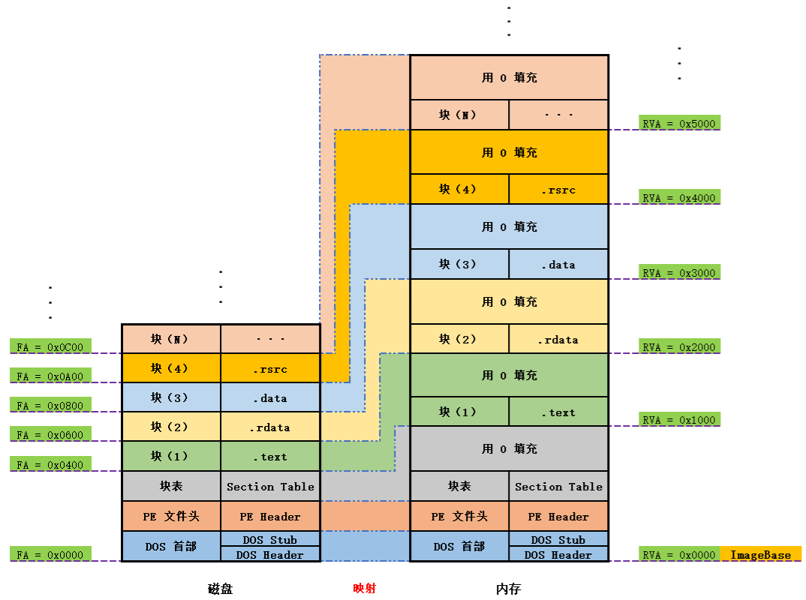
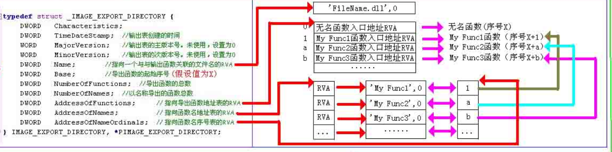
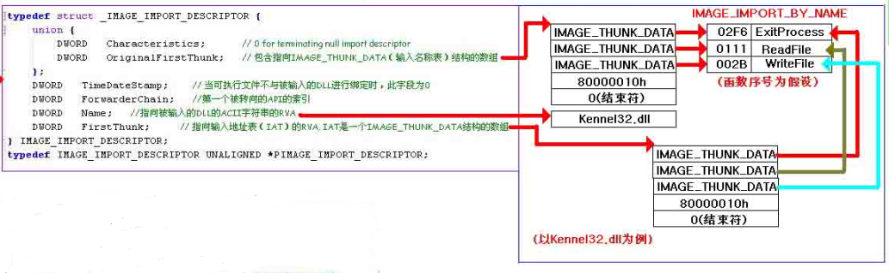
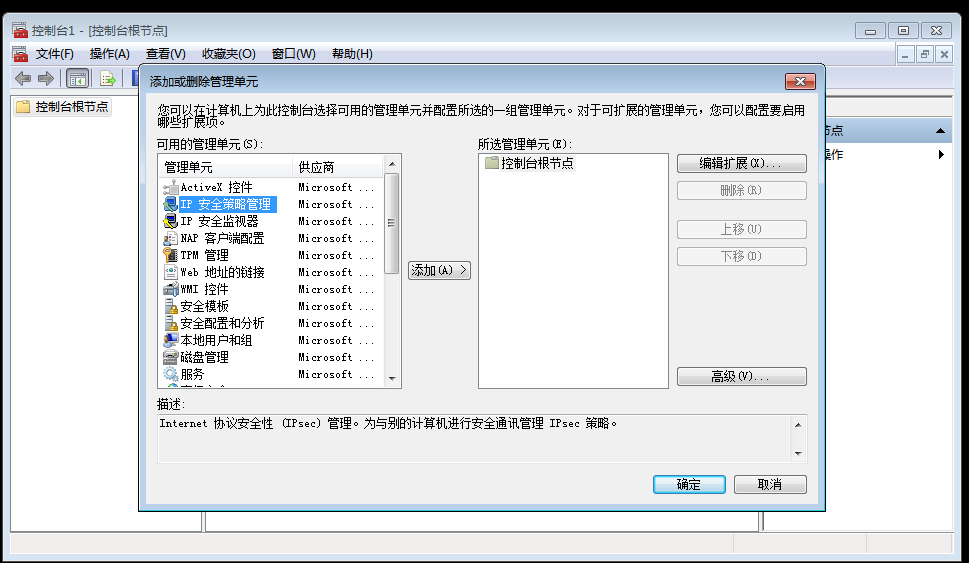

# MFC
* 项目类型
    * 基于对话框
    * 单文档: 文本编辑器 
    * 多文档: word
* 消息映射
    * 事件 -> 消息 -> 消息处理函数
    * 双击控件, 添加或跳转到消息处理函数. 也可右键添加. 也可在控件属性窗里面找到事件名并添加.
    * `BEGIN_MESSAGE_MAP宏`: 将消息处理函数添加到一个全局映射中w
    * 右键控件 -> 添加变量, 类别可选"值". 完成之后会在对话框类中添加一个成员变量, 空间的值存于其中.
    * `UpdataData(TRUE);`: 调用该函数后, 控件中的值才同步到成员变量中. `FALSE`则从程序更新到界面.
* 控件
    * `CLabel`
    * `CEdit`
        * 若要文本能换行:
            * 换行符是"\r\n"
            * `Mutilines`, `Want return`, `Vertical Scroll`设为true
    * `CCheckbox`
    * `CRadiobox`
    * `CListctrl6`
    * `CTabctrl`
    * `CRadioButton`
        * `Group`属性设为true
        * 最后一个选项的下一个控件的`Group`属性也要设为true
        * 变量类型设为int, 后面设置最小值和最大值
    * `CCombobox`
        * 在`data`属性初始化下拉框数据, 每一项用分号隔开
        * 代码
            ```cpp
            CComboBox *pCombo = (CComboBox *)GetDlgItem(IDC_COMBO_TEST1); // 拿到控件指针
            pCombo->InsertString(1, _T("台湾")); // 插入数据
            pCombo->SetCurSel(1); // 设置当前选中行
            Ctring szProvince;
            pCombo->GetLBText(pCombo->GetCurSel(), szProvince); // 获取当前选中的项的文本
            ```
    * `CListControl`: 表格
        * `view`属性改为report
        * 代码
            ```cpp
            // 插入列
            m_listCtrl.SetExtendedStyle(LVS_EX_FULLROWSELECT);
            m_listCtrl.InsertColumn(0, _T("列1"), LVCFMT_LEFT, 85);
            m_listCtrl.InsertColumn(1, _T("列2"), LVCFMT_LEFT, 85);
            m_listCtrl.InsertColumn(2, _T("列3"), LVCFMT_LEFT, 85);

            // 插入行
            int iLine = m_listCtrl.GetItemCount();
            m_listCtrl.InsertItem(iLine, _T("值1"));
            m_listCtrl.SetItemText(iLine, 1, _T("值2"));
            m_listCtrl.SetItemText(iLine, 2, _T("值3"));

            // 清空列表
            while (m_listCtrl.DeleteItem(0)) ;

            // 左键选中行
            // 在对选中行事件NM_CLICK的处理中:
            int istat = m_listCtrl.GetSelectionMark();

            // 按列排序
            // 定义排序函数, 要把它声明为静态, m_sortColumn和m_bAs也都声明为静态变量
            int CALLBACK CMyMFCDlg::SortByColumn(LPARAM lParam1, LPARAM lParam2, LPARAM lParamSort) {
                int iCompRes;
                CListCtrl* pListCtrl = (CListCtrl*)lParamSort;
                CString szComp1 = pListCtrl->GetItemText(lParam1, m_sortColumn);
                CString szComp2 = pListCtrl->GetItemText(lParam2, m_sortColumn);

                switch (m_sortColumn) {
                default:
                    iCompRes = szComp1.Compare(szComp2);
                    break;
                }
                iCompRes = m_bAs ? iCompRes : -iCompRes;
                return iCompRes;
            }

            // 在监听LVN_COLUMNCLICK消息的函数中:
            LPNMLISTVIEW pNMLV = reinterpret_cast<LPNMLISTVIEW>(pNMHDR);

            NM_LISTVIEW* pNMListView = (NM_LISTVIEW*)pNMHDR;
            m_sortColumn = pNMListView->iSubItem;
            m_bAs = !m_bAs;

            int count = m_listCtrl.GetItemCount();
            for (size_t i = 0; i < count; i++) {
                m_listCtrl.SetItemData(i, i);
            }
            m_listCtrl.SortItems((PFNLVCOMPARE)SortByColumn, (LPARAM) &m_listCtrl);
            ```
    * `CMenu`
        * 可作为右键弹出的菜单. 在资源视图中新增
        * 代码
            ```cpp
            // 弹出右键菜单
            CMenu m_Menu;
            m_Menu.LoadMenu(IDR_MENU1); // 加载菜单
            CMenu *nMenu = m_Menu.GetSubMenu(0); // 得到子菜单
            POINTxxpos;
            GetCursorPos(&pos); // 获取鼠标位置
            nMenu->TrackPopupMenu(TPM_LEFTALIGN, pos.x, pos.y, this);
            ```
* 其他
    * ctrl+d 显示tab顺序
* 线程
    `AfxBeginThread(MyThreadFunction, pParam)`: 线程的入口函数声明: `UINT MyThreadFunction( LPVOID pParam )`, `pParam`是传给线程的参数.

# winsock
## 一个简易tcp服务
```cpp
    #include<iostream.h>
    #include<winsock2.h>
    #pragma comment(lib, "ws2_32.lib")
    void msg_display(char * buf)
    {
        char msg[200];
        strcpy(msg,buf);// overflow here, copy 0x200 to 200
        cout<<"********************"<<endl;
        cout<<"received:"<<endl;
        cout<<msg<<endl;
    }
    void main()
    {
        int sock, msgsock, lenth, receive_len;
        struct sockaddr_in sock_server,sock_client;
        char buf[0x200]; // 
        
        WSADATA wsa;
        WSAStartup(MAKEWORD(1,1), &wsa); // 一参高位字节指定小版本号, 低位字节指定主版本号. 输出的信息存放到wsa. 
        if((sock = socket(AF_INET, SOCK_STREAM, 0)) < 0) { // 新建一个套接字
            cout << sock << "socket creating error!" << endl;
            exit(1);
        }

        // 设置协议族, 地址, 端口
        sock_server.sin_family = AF_INET;
        sock_server.sin_addr.s_addr = htonl(INADDR_ANY);
        sock_server.sin_port = htons(7777);

        char host_name[MAXBYTE];
        gethostname(host_name, MAXBYTE); // 获取主机名称
        cout << host_name << endl;
        hostent *lv_pHostent;
        lv_pHostent = (hostent *) malloc(sizeof(hostent));
        if( NULL == (lv_pHostent = gethostbyname(host_name))) { // 根据主机名称获取主机IP地址
            printf("get Hosrname Fail \n");
            return ;
        }
        // cout<<lv_pHostent<<endl;
        
        memcpy(&sock_server.sin_addr.S_un.S_addr, lv_pHostent->h_addr_list[0], lv_pHostent->h_length);
        cout << inet_ntoa(sock_server.sin_addr) << endl; // inet_ntoa将网络地址转为点分十进制字符串

        if(bind(sock, (struct sockaddr*)&sock_server, sizeof(sock_server))) { // 将套接字和地址端口绑定
            cout << "binging stream socket error!" << endl;
        }
        cout << "**************************************" << endl;
        cout << "     exploit target server 1.0	   " << endl;
        cout << "**************************************" << endl;
        listen(sock, 4); // 开始监听端口
        lenth = sizeof(struct sockaddr);
        do {
            msgsock = accept(sock, (struct sockaddr*) &sock_client, (int*)&lenth); // 接收新的TCP连接
            if(msgsock == -1) {
                cout<<"accept error!"<<endl;
                break;
            } else 
                do {
                    memset(buf, 0, sizeof(buf));
                    if((receive_len = recv(msgsock, buf, sizeof(buf), 0)) < 0) {
                        cout << "reading stream message erro!" << endl;
                        receive_len = 0; 
                    }
                    msg_display(buf);//trigged the overflow
                } while(receive_len);
                closesocket(msgsock);
        } while(1);
        WSACleanup();
    }
```

* 问题
    * `‘inet_addr’: Use inet_pton() or InetPton() instead or define _WINSOCK_DEPRECATED_NO_WARNINGS to disable deprecated API warnings libharmorobotservice`
        * 方法一: 换用新函数`inet_pton`. 需要导入头文件`WS2tcpip.h`
        * 方法二: 工程属性 -> c/c++ -> sdl检查, 改为否

# PE文件
* 参考资料
    * https://docs.microsoft.com/en-us/windows/win32/debug/pe-format

* 编程
    * 头文件
        * 在应用层时, 导入`Windows.h`
        * 在内核层时, 导入`ntimage.h`

* 转储内存中的PE镜像
    * 使用微软提供的windows sysinternal中的`procdump`

* PE文件中的大小值
    * 磁盘PE文件的dos头, pe头, 节表的总大小记录在optional头部的`SizeOfHeaders`字段

* 文件载入内存前后的情况

    

    * 根据RVA计算某个项在文件中的偏移
        1. 已知该项的rva, 该项所属的节的节头部
            * 获取节表地址: 使用宏`IMAGE_FIRST_SECTION`, 传入的宏参数为nt头部的地址. 
        2. 从节头获取节的RVA以及节在文件中的偏移`PoiterToRawData`
        3. 计算: `PoiterToRawData` + (项rva - 节rva)

* 数据目录表(data directory): 位于`IMAGE_OPTIONAL_HEADER`结构体的最后, 是一个`IMAGE_DATA_DIRECTORY`数组. 
    ```cpp
    typedef struct _IMAGE_DATA_DIRECTORY {
        DWORD VirtualAddress;
        DWORD Size;
    } IMAGE_DATA_DIRECTORY, PIMAGE_DATA_DIRECTORY;
    ```

    |偏移 (PE/PE32+)|Field|解释|
    |-|-|-|
    |96/112|导出表(Export Table) | `.edata`.|
    |104/120|导入表(Import Table) | `.idata`.|
    |112/128|资源表(Resource Table) | `.rsrc`.|
    |120/136|异常表(Exception Table) | `.pdata`.|
    |128/144|(Certificate Table) | `Attribute Certificate Table`.|
    |136/152|重定位表(Base Relocation Table) |  `.reloc`.|
    |144/160|Debug | `.debug`.|
    |152/168|Architecture | 保留, 须为0. |
    |160/176|Global Ptr | 要保存在全局指针寄存器的值的RVA. 其`size`成员的值要设为0. |
    |168/184|线程局部存储器(TLS Table) | thread local storage (TLS), `.tls`. 用来保存变量或回调函数.  |
    |176/192|(Load Config Table) | The load configuration table address and size. see The Load Configuration Structure.|
    |184/200|Bound Import | The bound import table address and size.|
    |192/208|IAT | 导入地址表.|
    |200/216|Delay Import Descriptor | The delay import descriptor address and size. see `Delay-Load Import Tables`.|
    |208/224|CLR Runtime Header | The CLR runtime header address and size. see The `.cormeta` Section (Object Only).|
    |216/232| 保留, 须为0. | 

    * 导出表

        

        * 数据目录表的第一项. 
        * 两种方法获取某导出函数地址
            * 通过函数名获取函数地址
                1. 遍历`AddressOfNames`. 当在`AddressOfNames`找到匹配的名称时, 在`AddressOfNameOrdinals`数组拿到它对应的序号.
                2. 以序号为索引在`AddressOfFunctions`数组中找到函数地址(这些地址是RVA, 即相对于模块在内存地址的偏移). 
            * 通过序号获取函数地址: 省掉上一种方法的第一步. 
    
    * 导入表

        

        * `OriginalFirstThunk`字段指向导入名称表INT. 
            * INT的每一项如果高位为0, 则该项为RVA; 为1, 则剩余数字为导入函数的序号. 
            * `IMAGE_IMPORT_BY_NAME`: 前2字节为序号, 一般无用. 后面是导入函数名, 以0结尾. 
        * `FirstThunk`字段指向导入地址表IAT. 
            * IAT表初始与INT相同. 
            * PE装载器将导入函数地址装入IAT(`GetProcAddress("函数名")`): 
                * 对比INT中的名称或序号. 
                * 将得到的函数地址填入IAT. 

    * 重定位表
        * 数据目录表的第六项, `IMAGE_DIRECTORY_ENTRY_BASERELOC`. 
        ```cpp
        typedef struct _IMAGE_BASE_RELOCATION {
            DWORD   VirtualAddress;            //重定位数据所在页的RVA
            DWORD   SizeOfBlock;               //当前页中重定位数据块的大小
        } IMAGE_BASE_RELOCATION;
        ```

    * TLS表
        * 接口: `TlsAlloc`, `TlsFree`, `TlsSetValue`, `TlsGetValue`

* 节表: 紧接着PE头存储. 
    ```cpp
    // 节头(即节表的每一项)
    typedef struct _IMAGE_SECTION_HEADER {
        BYTE    Name[IMAGE_SIZEOF_SHORT_NAME];
        union {
                DWORD   PhysicalAddress;
                DWORD   VirtualSize; // 节在内存中没对齐的大小(即去掉尾部填充的0之后的节的实际数据的数量) (大致能视为节的"有效数据的大小")
        } Misc;
        DWORD   VirtualAddress; // 节在内存中的偏移
        DWORD   SizeOfRawData; // 节在文件中的大小
        DWORD   PointerToRawData; // 节在文件中的位置
        DWORD   PointerToRelocations;
        DWORD   PointerToLinenumbers;
        WORD    NumberOfRelocations;
        WORD    NumberOfLinenumbers;
        DWORD   Characteristics;
    } IMAGE_SECTION_HEADER, *PIMAGE_SECTION_HEADER;
    ```

    * `SizeOfRawData`通常比`VirtualSize`大, **因为在磁盘中的节包含填充的0字节**. 

# windows编程
* 代码规范: 
    * 参考
        * [Windows Coding Conventions](https://learn.microsoft.com/en-us/windows/win32/learnwin32/windows-coding-conventions)
    * 变量前缀: 
        * 按属性: 
            * 全局变量: `g_`
            * const常量: `c_`
            * c++类成员变量: `m_`
            * 静态变量: `s_`
        * 按数据类型: 
            * 指针: `p`
            * 函数: `fn`
            * 无效: `v`
            * 句柄: `h`
            * 长整型: `1`
            * 布尔: `b`
            * 浮点型(有时也指文件): `f`
            * 双字: `dw`
            * 字符串: `sZ`
            * 短整型: `n`
            * 双精度浮点d
            * 计数: `c` (通常用`cnt`)
            * 字符: `ch` (通常用`c`)
            * 整型: `i`(通常用`n`)
            * 字节: `by`
            * 字: `W`
            * 实型: `r`
            * 无符号: `u`

# win32 api

* `ntdll`中有一些未导出的函数, 比如`NtReadVirtualMemory`. 要使用未导出的函数, 可以在源文件中链接`ntdll.lib`(即`#pragama comment(lib, "ntdll.lib")`), 然后声明该未导出的函数. 

## Windows共享库
* `hal.dll`
    * 实现了硬件抽象层. 
    * 介于驱动和硬件(芯片)之间, 在内核地址空间加载, 对硬件提供的接口进行封装. 
        * 比如, 面对不同芯片的APIC(高级可编程中断处理器)的中断, 需要做出的响应是不同的. HAL则提供了一个简单的函数以应对不同芯片的中断. 
* `ntdll.dll`
    * `ntdll.dll`及`ntoskrnl.exe`中包含Windows的原生api, 比如那些`NtXxx`, `ZwXxx`, `RtlXxx`函数. 
* `kernel32.dll`
    * 基础api, 包括存储器管理, 输入输出等. 其中的函数多会调用`ntdll.dll`提供的api. 
* `gdi32.dll`
    * 提供跟图形设备界面有关的函数, 例如输出到显卡和打印机的原生绘图功能. 
* `user32.dll`
    * 提供创建和管理Windows图形界面的功能, 例如桌面, 视窗. 
* `comctl32.dll`
    * 提供标准视窗界面组件, 比如打开文件对话框, 另存文件对话框. 依赖`gdi32.dll`及`user32.dll`. 
* `msvcrt.dll`
    * C标准库. 提供`printf`等函数. 
* `ATL*.dll`: 活动模板库. 
* `MFC*.dll`: 微软基础类库. 
* `MSVBVM60*.dll`: `Visual Basic 6.0`虚拟机. 
* `VCOMP*.dll`: 微软`OpenMP`(Open Multi-Processing)运行时. 
* `VCRUNTIME*.dll`: 微软VC运行时, 用于MSVC 14.0以上. 
* `MSVCIRT.dll`: 微软基础类库. 

## 文件操作
```cpp
    // 打开或创建文件或io设备
    // 如果是文件的话, 必须提供完整路径
    HANDLE CreateFile(
        LPCTSTR lpFileName, //普通文件名或者设备文件名
        DWORD dwDesiredAccess, //访问模式（写GENERIC_WRITE/读GENERIC_READ/执行GENERIC_EXECUTE/所有GENERIC_ALL, 0则只允许获取设备信息）
        DWORD dwShareMode, //共享模式, 如FILE_SHARE_READ; 0则不共享
        LPSECURITY_ATTRIBUTES lpSecurityAttributes, //指向安全属性SECURITY_ATTRIBUTES结构的指针, 确定如何在子进程中继承这个句柄. 若为NULL, 则文件或设备得到默认安全描述符, 且子进程不能继承此文件句柄. 
        
        // 如何创建.
        // CREATE_NEW: 不存在时新建
        // CREATE_ALWAYS: 覆盖式新建
        // OPEN_ALWAYS: 文件存在则打开文件并返回成功(GetLastError得到ERROR_ALREADY_EXISTS(183)); 不存在则新建文件(错误码为0)
        // OPEN_EXISTING: 如果是设备而非文件, 通常设为该值. 
        // TRUNCATE_EXISTING: 若文件存在, 打开文件, 截断之使之大小为0. 前提是设置了GENERIC_WRITE
        // 
        DWORD dwCreationDisposition, 

        DWORD dwFlagsAndAttributes, // 文件属性. 最常用的是FILE_ATTRIBUTE_NORMAL
        HANDLE hTemplateFile // 模板文件的句柄, 可为NULL. 用于复制文件句柄
    );

    BOOL ReadFile(
        HANDLE hFile,            //文件的句柄
        LPVOID lpBuffer,          //用于保存读入数据的一个缓冲区
        DWORD nNumberOfBytesToRead,    //要读入的字节数
        LPDWORD lpNumberOfBytesRead,    //指向实际读取字节数的指针
        LPOVERLAPPED lpOverlapped
        //如文件打开时指定了FILE_FLAG_OVERLAPPED, 那么必须, 用这个参数引用一个特殊的结构。
        //该结构定义了一次异步读取操作。否则, 应将这个参数设为NULL
    );

    BOOL WriteFile(
        HANDLE  hFile,//文件句柄
        LPCVOID lpBuffer,//数据缓存区指针
        DWORD   nNumberOfBytesToWrite,//要写的字节数
        LPDWORD lpNumberOfBytesWritten,//用于保存实际写入字节数的存储区域的指针
        LPOVERLAPPED lpOverlapped//OVERLAPPED结构体指针
    );

    // 新建目录
    BOOL CreateDirectory(LPCTSTR lpPathName, LPSECURITY_ATTRIBUTES lpSecurityAttributes); // 一参为目录的完整路径
```
### shlwapi库
```cpp
    #include <shlwapi.h>
    #pragma comment(lib, "shlwapi")
```
## 注册表操作
```cpp
```

## 进程操作
```cpp
    // 枚举所有进程
    BOOL EnumProcesses(
        _Out_ DWORD * pProcessIds, // 一个数组, 接收所有进程id
        _In_ DWORD CB, // 数组长度
        _Out_ DWORD * pBytesReturned // 用于接收返回数据的长度
    );

    // 枚举进程中的模块
    BOOL EnumProcessModules(
    IN  HANDLE  hProcess, // 进程句柄
    OUT HMODULE *lphModule, // 这个列表用于保存模块列表
    IN  DWORD   cb, // 数组长度
    OUT LPDWORD lpcbNeeded // 可理解为模块总数
    );

    // 根据模块的内存基址, 获取模块文件名称
    GetModuleBaseName

    // 根据模块的内存基址, 获取模块文件完整路径
    DWORD GetModuleFileNameExW(
        HANDLE  hProcess,
        HMODULE hModule,
        LPWSTR  lpFilename,
        DWORD   nSize // 缓冲区lpFilename的大小(字符数而非字节数!)
    );
```

## 线程操作
```cpp
    #include <processthreadsapi.h>

    HANDLE CreateThread(
        IN OPTIONAL  LPSECURITY_ATTRIBUTES   lpThreadAttributes,
        IN            SIZE_T                  dwStackSize,
        IN            LPTHREAD_START_ROUTINE  lpStartAddress, // 线程入口函数
        IN OPTIONAL  __drv_aliasesMem LPVOID lpParameter, // 传给线程的参数
        IN            DWORD                   dwCreationFlags,
        OUT OPTIONAL LPDWORD                 lpThreadId
    ); // 若失败, 返回NULL
    // 例
    HANDLE hThrd = CreateThread(NULL, 0, (LPTHREAD_START_ROUTINE) MyFunc, (LPVOID) paramx, 0, &tid);

    HANDLE hThrd = OpenThread(SYNCHRONIZE, FALSE, tid); // 成功则返回线程句柄
    WaitForSingleObject(hThrd, INFINITE); // 阻塞, 等待线程退出

    ExitThread(<线程退出代码>); // 在线程回调函数内部调用此函数以退出线程
```

## 加解密API
* 头文件: `Wincrypt.h`

```cpp
```

## 其他
* 实现类似于unix的`perror`功能: 
    ```cpp
        void PrintCodeMsg(DWORD code) {
            LPSTR errorMsg;
            if (code == 0) {
                return; //No error message has been recorded
            }

            //Ask Win32 to give us the string version of that message ID.
            //The parameters we pass in, tell Win32 to create the buffer that holds the message for us (because we don't yet know how long the message string will be).
            size_t size = FormatMessageA(FORMAT_MESSAGE_ALLOCATE_BUFFER | FORMAT_MESSAGE_FROM_SYSTEM | FORMAT_MESSAGE_IGNORE_INSERTS, NULL, code, MAKELANGID(LANG_NEUTRAL, SUBLANG_DEFAULT), (LPSTR)&errorMsg, 0, NULL);
            printf("0x%x: %s\n", code, errorMsg);
            LocalFree(errorMsg);
            return;
        }
    ```

# cmd
* 进程
    * `tasklist`: 查看进程列表
        * `tasklist /S <ip地址> /U <用户名> -P <密码>`: 建立IPC连接. 
* 文件
    * `attrib`: 用于修改文件或目录属性
        * `+h|-h`: 显示/隐藏文件. 
        * `+r|-r`: 只读文件属性. 
        * `+a|-a`: 存档文件属性. 
        * `+s|-s`: 系统文件属性. 
* 网络
    * `route`
        * `print`: 打印路由表. (开头有网卡列表)
        * `add`: 添加路由
            * `192.168.29.0 mask 255.255.255.0 10.0.0.1 metric 6 if 8`: 表示将`192.168.29.0/24`网段路由到`10.0.0.1`接口. `if`进一步指定接口编号为8. `metric`指定最大跳数. 
        * `change`
        * `delete`
            * `192.168.29.0 mask 255.255.255.0`: 表示删除`192.168.29.0/24`网段路由. 
* 用户, 服务
    * `net`
        * `share`: 查看开启的共享. (包括`ipc$`)
        * `use \\<ip地址>\ipc$ /u:<用户名> <密码>`: 建立IPC连接. 
        * `user`: 新增用户. 
            * `/add <用户名> <口令>`
        * `<start|stop> <服务名>`
    * `sc`: 服务管理工具. 
        * `create <服务名> `
            * `binpath= "C:\xxx.exe"` 
            * `displayname= "mysrv"` 
            * `depend= Tcpip` 
            * `start= <boot|system|auto|demand|disabled>`: 默认`demand`
        * `<start|stop|delete> <服务名>`
    * `shutdown`
        * `\r \t 0`: 立即重启
    * `winsat`: 系统评估工具
        * `disk -drive <盘符>`: 磁盘测速
* 系统信息
    * `whoami`
        * `/priv`: 查看用户权限. (如, `SeDebugPriviledge`)
        * `/user`: 查看用户信息. 
    * `ver`: 查看系统版本号. 
        * 系统版本号: 主版本号, 子版本号, 修正版本号, 编译版本号
    * `winver`: 查看系统版本号(图形窗口). 
    * `sysinfo`: 系统信息, 其中包括系统版本号. (?)
    * `wmic`: Windows Management Instrumentation, 可用于获取系统信息, 安装软件, 启动服务, 管理进程等操作. 
        * `os get name,version,buildnumber,caption`: 获取操作系统的名称, 版本号, 构建号, 标题. 
        * `memorychip get devicelocator,capacity,speed`: 获取内存条的设备定位器、容量、速度等信息。
        * `cpu get name, maxclockspeed, numberofcores, numberoflogicalprocessors`: 获取CPU的型号、最大时钟速度、核心数、逻辑处理器数量等信息
        * `diskdrive get index, model, size, interfacetype`: 获取硬盘的索引号、型号、大小和接口类型等信息
        * `nic get index, name, macaddress`: 获取网卡信息，如网卡索引号、网卡名称、MAC地址等
        * `/node:<IP地址> nicconfig where IPEnabled=TRUE get IPAddress`: 获取远端计算机的所有IP地址. 
        * `process list brief`：列出所有运行中的进程信息，包括进程ID、名称、执行路径和在内存中的使用情况等
        * `service get name, state`：获取系统中的服务状态，包括服务名称和当前状态。
        * `service where name=<服务名称>`
            * `call stopservice`：停止服务
            * `call startservice`：启动服务
        * `useraccount get name, sid`: 获取用户的名称和sid
        * `group get name, sid`: 获取组的名称和sid

    
# powershell
* 管道: 命名管道的所有实例拥有相同的名称, 但是每个实例都有其自己的缓冲区和句柄, 用来为不同客户端通讯提供独立的管道. 
    * 列出当前计算机所有命名管道: 
        * V3以下版本: `[System.IO.Directory]::GetFiles("\\.\\pipe\\")`
        * V3以上: `Get-ChildItem \\.\pipe\`
* `无法打开..., 因为在此系统上禁止运行脚本`
    * 这是因powershell的安全策略. 执行`set-ExecutionPolicy RemoteSigned`. `set-ExecutionPolicy Default`可改回来. 

# 注册表
* 存储
    * HIVE文件
        * 由多个巢箱(BIN)组成
        * 注册表解析: https://www.52pojie.cn/thread-41492-1-1.html
        * 缺省放在`%systemroot%/System32/config`下, 6个文件: DEFAULT, SAM, SECURITY, SOFTWARE, USERDIFF, SYSTEM
* 数据类型
    * `REG_SZ`: 字符串
    * `REG_BINARY`: 二进制数据
    * `REG_DWORD`: 4字节无符号整数
    * `REG_EXPAND_SZ`: 扩展字符串, 其中带环境变量, 如"%systemtoor%\c.doc". 应用层函数`ExpandEnvironmentStrings`可展开之.
    * `REG_MULTI_SZ`: 多字符串(每个字符串间用NULL隔开)
        * 构造: `sprintf(buf, "%s%c%s%c%c%", "1.1.1.1", 0, "1.1.1.1", 0, 0)`
        * 用于删除和重命名: `MoveFileEx(szTemp, NULL, MOVEFILE_DELAY_UNTIL_REBOOT)`, 重启后`szTemp`文件会被替换为二参表示的文件. (二参为NULL则表示删除文件) 比如替换dll文件. 每次调用, 一参和二参会被写到`\\Registry\\Machine\\SYSTEM\CurrentContrilSet\Control\Session Manager\PendingFileRenameOperations`.
        * UNC(Universal Naming Convention, 通用命名规则)
            * 用于局域网共享文件夹
            * `\HKEY_LOCAL_MACHINE\SYSTEM\CurrentControlSet\Services\LanmanServer\Shares` 记录本机共享的文件夹的信息. 
* `HKEY_LOCAL_MACHINE\`
    * `SAM\`: 
        * `SAM\`: `C:\Windows\System32\config\SAM`文件中关于用户和组的部分会映射到这里. 默认情况下Administrator也看不了这里的内容, 需要右键该项 -> `权限`, 点击`Administrator`, 在下面的`权限`中勾选`完全控制`, 然后F5刷新注册表. 另一种方法是使用`psexec`运行`regedit`程序(`psexec –s –i –d c:\windows\regedit.exe`), 即以本地system用户的方式运行. 
            * `Domains\`: \
                * `Account\`: 
                    * `Users\`: 
                        * `<用户的RID>\`: 
                            * `F`: 该值的`0x30`偏移处记录了用户的RID. (可将该值改为admin的RID, 从而将用户提升到admin权限)
                        * `Names\`
                            * `<用户名>\`: 每一项都有一个默认值, 该值即为用户的RID. 
    * `SECURITY\`
        * `SAM\`: 同上面的`SAM\SAM`. 
    * `SOFTWARE\`
        * `Microsoft\`
            * `Windows\`
                * `CurrentVersion\`
                    * `Policies\`
                        * `System\`
                            * `EnableLUA`: LUA表示受限用户账户, 现在称为UAC. 为0时, 禁用UAC. QT程序以admin运行时不能拖文件进去, 因为这个值为1, 而`explorer.exe`的权限较低. 此时可将该值改为0, 并重启系统, 解决此问题. 
            * `Windows NT\`
                * `CurrentVersion\`
                    * `AeDebug\`
                        * `Debugger`: 可以设置系统默认调试器, 如: `"C:\debuggers\windbg.exe" -p %ld -e %ld -g`
                    * `Image File Execution Options\`
                        * `<应用程序>\`: 如`svchost.exe`
                            * `debugger`: 设置调试器路径及参数, 则应用程序启动时会通过该调试器启动. 
                    * `ProfileList\`
                        * `<SID>\`: 用户的sid
                            * `ProfileImagePath`: 用户的主目录
    * `SYSTEM\`
        * `CurrentControlSet\`
            * `Control\`: 
                * `Lsa\`: 
                    * `Security Packages`: 一个`REG_MULTI_SZ`值, 指定LSASS进程启动时加载的一系列SSP包的名称. 
            * `Services\`: 其下每一项对应一个服务
                * `<服务>\`
                    * `ImagePath`: sys文件路径或`%SyStemRoot%\System32\svchost.exe -k <服务组>`
                    * `Parameters\`
                        * `ServiceDll`: dll文件路径


# 系统进程, 服务
* `smss.exe`
    * 会话管理子系统(session manager subsystem), 它是内核启动的第一个用户模式的进程. 
    * 负责: 
        * 根据`HKLM\SYSTEM\CurrentControlSet\Control\Session Manager`下的键值, 做以下初始化: 
            * 创建额外的分页文件(根据`Memory Management`键)
            * 创建环境变量(根据`Environment`键)
            * 创建DOS设备映射(如`CON:`, `NUL;`, `AUX`, `COM1:`等)(根据`Dos Devices`键). 
            * 启动`SubSystems`下记录的子系统. 
        * 启动内核及用户模式的Win32子系统. Win32子系统包含`win32k.sys`(内核模式), `winsrv.dll`(用户模式), `csrss.exe`(用户模式). 
        * 从Vista开始, smss会创建一个它自身的子实例, 以为`session0`启动`wininit.exe`(Windows开机程序)和`csrss.exe`. Windows开机程序则启动`services.exe`和`lsass.exe`. 在Vista之前则是Winlogon负责这些工作. 
    * smss在引导程序完成后会驻留在内存中, 等待`winlogon`和`csrss`结束, 然后关机. 
* `lsass.exe`
    * Local Security Authority Service, 用于本地安全和登陆策略. 
* `csrss.exe`
    * Client/Server Runtime Subsystem, 微软客户端/服务端运行时子系统. 该进程管理Windows图形相关任务. 
* `winlogon.exe`
    * 用于处理用户登录操作. 
    * 每次发起远程桌面连接成功后, 都会有一个新的`winlogon`进程出现. 
* `explorer.exe`
    * 为用户提供了图形用户界面. 
    * 没一个用户只有一个`explorer`进程实例. 
* `services.exe`
    * 即SCM(service control manager). `svchost.exe`进程一般都会以其子进程的形式出现. 

## svchost
* svchost.exe本身并不实现任何服务功能, 需要成为服务的dll可由svchost加载成为服务. 这些dll内部需要实现`ServiceMain`函数, 并且**要把它导出**. 
* svchost.exe根据注册表项`HKEY_LOCAL_MACHINE\Software\Microsoft\Windows NT\CurrentVersion\Svchost`下面的键值分组管理DLL申请的服务, 每一键值对应一个独立的Svchost.exe进程. 
    * `svchost`键本身存多个项, 各个项的名称是服务名, 值是服务所属分组. 
* 服务的注册表项
    * `HKEY_LOCAL_MACHINE\SYSTEM\CurrentVersion\Services\<服务名>`
        * `ImagePath`: 值为`svchost.exe -k <组名>`. 
        * `Parameters`子键: 
            * `ServiceDll`: 指出dll文件路径
* `tasklist /svc`: 可以显示每个进程主持的服务
* `tasklist /M`: 可以显示每个进程用的模块(dll)
* 调试: 
    * 调试主函数`ServiceMain`: 
        * 如果有源码, 可以在函数开头放一个`Sleep`, 睡眠比较长一段时间. 启动服务后, 记录下进程id, 并在其睡眠结束前通过windbg附加到进程, 在`Sleep`后设置断点. 

# 用户, 授权机制
* 启用`administrator`
    * 非家庭版
        * 方法一: `计算机管理` -> `本地用户和组` -> `用户` -> `administrator`, 右键`属性`, 把账户`已禁用`的勾去掉. 
        * 方法二: 运行`lusrmgr.msc`, 类似上述操作. 
    * 家庭版
        * `net user administrator /active:yes`
* SIDs: 安全标识符
    * 组成: `S-R-X-Y1-Y2-Yn-1-Yn`
        * `S`: 表示这是SID. 
        * `R`: 修订级. 
        * `X`: 标识符的授权值. (identifier authority)
        * `Y`: 一系列子授权值. 前面1到n-1个组成的序列表示域标识符, 最后一个则是相对标识符`RID`(用于区分用户或组). 
        * 例子: 
            * `S-1-5-32-544`: 这个是特权组`Builtin\Administrators`的sid. 
                * 1: 修订级为1. 
                * 5: NT Authority. 
                * 32: Builtin. (内置账号和组的SID都有这个域标识符32)
                * 544: Administrators. 
    * `Well-known SIDs`
        * `Everyone`, `World`: 包含所有用户
        * `CREATOR_OWENER`: 作为ACE的占位符. 当ACE被继承时, 系统会将此占位符替换为创建对象者的SID. 
        * `Administrators`
        * `SECURITY_LOCAL_SYSTEM_RID`: `S-1-5-18`, 提权至system时可能会用到此sid. 
        * `SECURITY_NT_NON_UNIQUE`: `S-1-5-21`, 普通用户登录时可看到此sid. 
        * `SECURITY_BUILTIN_DOMAIN_RID`: `S-1-5-32`, 内置系统域. 
            * `DOMAIN_ALIAS_RID_ADMINS`(544): 内置管理员组(`Builtin\Administrators`)

* 登录会话(`LogonSessions`)
    * 用户账号或服务账号通过验证后, Windows就会创建一个登录会话. 登录情形: 
        * 通过控制台或远程桌面的交互式登录
        * SCM使用保存的凭据来开启一个服务
        * `runas`
    * 每个会话都有一个LUID(本地唯一标识符). 预设的有: 
        * system账号会话: 999(0x3e7)
        * 网路服务会话: 996(0x3e4)
        * 本地服务会话: 997(0x3e5)
    * 只要还有复用的安全令牌(duplicated token), 引用该令牌的会话就会存在. 
    * LSA登录会话和终端服务(TS)会话是正交关系(互不相干). TS会话包括终端用户会话和远程桌面用户会话, 以及包含所有服务进程的会话0. 一个进程的安全令牌既指明了其来源的LSA会话, 也指明了其所在的TS会话. 注意, 大部分以system运行的进程在会话0中, 但有两个例外, `winlogon`和`csrss`, 它们存在于每一个交互式TS会话中. 
    * 使用`WinObj`工具, 在`\Sessions\0\DosDevices\<LUID>`下查看各会话. 
    * 使用`sysinternal`中的`logonsessions`工具, 查看各会话的详情. 
* 凭据管理
* LSA身份验证
* 网络提供商接口
* 智能卡验证
* SSPI(Security Support Provider Interface)
    * 要点
        * 允许app使用不同的安全模型
        * SSPI不会构建登录凭证(这个是操作系统的工作)
        * 支持的安全协议包括Kerberos和LAN管理器. 
        * 可在内核层或应用层使用
    * 包
        * CredSSP(Credential Security Support Provider)
            * 让app能将用户凭证委托给服务器进行远程验证. CredSSP提供了一个tls协议通道. 验证过程使用`SPNEGO`(Simple and Protected Negotiate Protocol)协议. 
        * Microsoft Negotiate
        * Microsoft NTLM
            * Windows Challenge/Response
        * Microsoft Kerberos
        * Microsoft Digest SSP
        * Secure Channel
* Winlogon和凭据提供者
* 安全系统组件
    * 安全引用监视器(SRM)
        * 在`Ntoskrnl.exe`中
        * 负责定义访问令牌, 对象的安全访问检查, 特权管理, 生成安全审计信息. 
        * lsass启动时, 会创建一个ALPC端口`SeLsaCommandPort`. SRM会连接到此端口(因此其自身也会产生一个端口). 
    * LSASS
        * 大部分功能在`Lsasrv.dll`中实现. 
        * 用户登录，密码策略，赋予用户和组的特权，系统安全审计设置. 
    * LSASS策略数据库
        * 存在`HKLM\SECURITY`下, 由ACL保护的区域。
        * 保存一些信息: 
            * 域登录在本地的缓存信息。
            * windows服务的用户-账户登录信息。
    * 安全账户管理器(SAM)服务
    * SAM数据库
        * `HKLM\SAM`
        * 包含本地用户和用户组以及它们的口令和属性
        * 在域控中，SAM不保存域定义用户，但保存系统管理员恢复账号的定义和口令。
    * 活动目录
        * `System32\Ntdsa.dll`, 该服务运行于lsass进程. 
        * 一个目录服务，包含一个数据库，数据库中保存了域中对象的信息。
    * Winlogon
        * 回应SAS
        * 管理交互式登录会话
        * 在用户登录时创建用户的第一个进程
    * LogonUI
        * 向凭据提供者查询用户凭据. 
        * 提供登录界面
    * 凭据提供者(CPs)
        * `System32\authui.dll`, `System32\SmartcardCredentialProvider.dll`
        * 是运行于LogonUI进程的com组件, 在SAS执行时, 由Winlogon按需开启. 
        * 用于获取用户名, 密码，智能卡pin码，生物测量数据(如指纹)。
    * 网络登录服务(Netlogon)
        * `System32\Netlogon.dll`
        * 为域控制器设置一条安全信道，以传输交互式登录信息，LAN管理器和NT LAN管理器的认证校验信息。也用于活动目录的登录。
    * 内核安全设备驱动(`KSecDD`)
        * `System32\Drivers\Ksecdd.sys`
        * 实现了高级本地过程调用(ALPC), 其它内核模式的安全组件(包括加密文件系统EFS)会通过ALPC来和LSASS通信。
    * 认证包(authentication package): 
        * 封装了验证功能和安全协议的dll, 为用户的登录提供验证. LSA将请求发送给认证包来验证用户的登录操作. 
        * 负责: 
            * 分析登录数据, 确定过一个`安全主体`(security principal)是否可被允许登录到系统. 
            * 建立新的登录会话, 为成功验证的主体创建logonId. 
            * 将安全信息传给LSA, 以获取主体的安全令牌. 
        * 提供一组SID以及LSA创建的安全令牌中的其它信息. 安全令牌在后续访问Windows的操作中用于表示主体的安全上下文. 
        * 如下认证包: 
            * `msv1_0`
                * 在SAM数据库中查找用户名和哈希处理过的密码, 进行匹配, 确定是否允许登录. 
            * `kerberos`
    * AppLocker
        * `System32\Drivers\AppId.sys`驱动, 加载`\System32\AppIdSvc.dll`的svchost。
        * 让管理员可以管理用户可用的exe, dll和脚本文件. 

        

* 工具
    * 本地安全策略
    * 组策略管理器

# 开发
* 在编译阶段判断系统版本: 
    * 参考: `https://learn.microsoft.com/en-us/cpp/porting/modifying-winver-and-win32-winnt?view=msvc-170`
    * 通过判断`WINVER`宏. 
        ```cpp
            #if (WINVER >= _WIN32_WINNT_WIN10)
                // ...
            #else
                // ...
            #endif

            // sdkddkver.h
            // _WIN32_WINNT version constants
            //
            #define _WIN32_WINNT_NT4                    0x0400 // Windows NT 4.0
            #define _WIN32_WINNT_WIN2K                  0x0500 // Windows 2000
            #define _WIN32_WINNT_WINXP                  0x0501 // Windows XP
            #define _WIN32_WINNT_WS03                   0x0502 // Windows Server 2003
            #define _WIN32_WINNT_WIN6                   0x0600 // Windows Vista
            #define _WIN32_WINNT_VISTA                  0x0600 // Windows Vista
            #define _WIN32_WINNT_WS08                   0x0600 // Windows Server 2008
            #define _WIN32_WINNT_LONGHORN               0x0600 // Windows Vista
            #define _WIN32_WINNT_WIN7                   0x0601 // Windows 7
            #define _WIN32_WINNT_WIN8                   0x0602 // Windows 8
            #define _WIN32_WINNT_WINBLUE                0x0603 // Windows 8.1
            #define _WIN32_WINNT_WINTHRESHOLD           0x0A00 // Windows 10
            #define _WIN32_WINNT_WIN10                  0x0A00 // Windows 10
            // . . .
        ```
* 判断目标平台的位数: 根据宏`_WINX64`
* 调试: 
    * `OutputDebugStringA(LPCSTR lpOutputString)`: 可将调试信息输出到调试器(`Windbg`, `DdgView`). 在`DdgView`中, 要把`Capture Global Win32`勾上, 才能打印出来. 
* dll开发
    * win32系统保证内存只有一份dll. 其先被调入win32系统的全局堆. 通过文件映射, 给多个进程使用.
    * 工程生成的文件
        * dll文件: 包含实际的函数和数据
        * lib文件: 包含被dll导出的函数的名称和位置. exe程序可使用之链接到dll文件.
    * 开发dll
        ```cpp
        // 导出函数的定义形式, 注意顺序, 名称都不能写错. 
        extern "C" _declspec(dllexport) int myFunc1(int v) {
            return v + 1;
        }
        ```
    * 调用dll
        * 隐式链接(可直接调用函数)
            * 把dll文件拷贝到exe的目录下
            * `#include "myDll.h"`
            * `#pragma comment(lib, "myDll.lib")`
        * 显式链接
            * 定义函数指针类型: `typedef int (*MYFUNC)(void);`
            * `HMODULE hMod = LoadLibrary(_T("myDll.dll"));`
            * `if(hMod) {MYFUNC myFunc = (MYFUNC)GetProcess(hMod, "fnMyFunc"); myFunc();}`
            * 注意  
                * 如果dll是cpp编译, 注意`name mangling`(c++为支持函数重载, 会改函数名), 这时直接使用原名会拿不到函数. 需要在dll的源文件的函数声明头部加`extern "C"`, 告诉编译器不要改名.
## VS
* 编译选项
    * `/sdl`: 安全开发生命周期检查. (vs2012以后). 要求严格按SDL的要求编译代码. 会有如下行为: 
        * 会让一些函数无法通过编译. 
        * 有一些warning会被视为错误. 
        * 严格检测缓冲区溢出. 
        * 定义一个对象时, 会自动为其赋值0. 
        * 会在delete某个指针后, 为该指针赋值一个无效值, 防止重用. 
    * `/GS`: 安全检查. 在ebp和局部变量之间插入一个全局cookie, 防溢出. 
        * 在函数体的开头部分代码中, 有一条`mov eax, [__security_cookie]`指令和`call __security_check_cookie`. 
    * `/JMC`: 支持仅我的代码调试. 代码中会调用`__CheckForDebuggerJustMyCode`函数. 
    * `/RTC`: 基本运行时检查. 代码中会调用如`_RTC_CheckStackVars`函数. 在 `项目属性` -> `C/C++` -> `代码生成` -> `基本运行时检查` 中设置. 
        * `/RTCu`: 未初始化变量检查. 会调用`_RTC_UninitUse`函数. 
        * `/RTCs`: 堆栈帧检查. 会调用`_RTC_CheckStackVars`函数. 
        * `/RTCsu`或`/RTC1`: 以上两者都有. 
## VSCode
* 配置vscode以开发windows程序
    * 参考: https://code.visualstudio.com/docs/cpp/config-msvc
    * `Terminal` -> `Configure Default Build Task` -> `cl.exe build active file`, 生成`task.json`文件, 各个配置项的含义: 
        * `type`:
            * `cppbuild`
            * `shell`: 使用cmd
                * 若`cl.exe`等工具没有预先添加到系统路径, 可添加如下选项预先运行`VsDevCmd`: 
                ```json
                "options": {
                    "cwd": "${fileDirname}",
                    "shell": {
                        "executable": "cmd.exe",
                        "args": [
                            "/C \"D:/vs_tools/Common7/Tools/VsDevCmd.bat\" && ",
                            "echo %cd% && ",
                            "(if not exist ${fileBasenameNoExtension}_debug mkdir ${fileBasenameNoExtension}_debug) && ", // 若没有目录, 则生成目录
                            "cd /d ${fileDirname}/${fileBasenameNoExtension}_debug && ",
                        ]
                    }
                },
                ```
        * `command`: 要运行的程序(如`cl.exe`)
        * `args`: 传给`cl.exe`的参数
            * `${file}`: 活动文件
            * `${fileDirname}`: 当前目录的**完整路径**
            * `${fileBasenameNoExtension}`: 生成的exe文件的名字
        * `group`: 
            * `"isDefault": true`: 表示该任务会在按`ctrl+shift+b`时运行
        * `options`: 
            * `cwd`: 指定工作目录
            * `env`: 配置环境变量
            * `shell`: 
                * `executable`: 指定要用的shell程序(如`cmd.exe`)
                * `args`: 参数列表
        * ``: 
* 按f5时, 若没有`launch.json`, 则会生成
    * `program`: 指定要调试的程序
* 远程调试: 在目标已通过`gdbserver`开启调试的情况下: 
    * `configurations`数组中添加如下配置项: 
        ```json
            {
                "name": "GDB for BBB (ARM) Remote Attach",
                "type": "cppdbg",
                "request": "launch",
                "externalConsole": false,
                "stopAtEntry": true,
                "program": "${workspaceFolder}/my_test", // 为了让gdb找到调试符号
                "MIMode": "gdb",
                "cwd": "${workspaceFolder}",
                "miDebuggerPath": "/usr/bin/gdb",
                "miDebuggerServerAddress": "127.0.0.1:9999",
                "miDebuggerArgs": " -ex 'handle all print nostop noignore'",
                "setupCommands": [
                    {
                        "description": "Enable pretty-printing for gdb",
                        "text": "-enable-pretty-printing",
                        "ignoreFailures": true
                    }
                ],
                "preLaunchTask": "Build embedded application with debug information"
            }
        ```
* `c_cpp_properties.json`: 配置c/c++扩展
    * 这个文件在vscode的编译中不起作用, vscode找的是`tasks.json`中的配置
* `resources/app/product.json`
    * 配置codeserver使用的插件源: 
        ```json
            // 使用原生vscode插件地址
            "extensionsGallery": {
                "serviceUrl": "https://marketplace.visualstudio.com/_apis/public/gallery",
                "cacheUrl": "https://vscode.blob.core.windows.net/gallery/index",
                "itemUrl": "https://marketplace.visualstudio.com/items",
                "controlUrl": "",
                "recommendationsUrl": ""
            }
        ```
# Win11
* 安装
    * Vmware
        * `设置` -> `选项` -> `访问控制`, 加密. 
        * `设置` -> `硬件`, 添加可信平台模块. 
        * 如果iso镜像不支持uefi引导, 则如下操作: 
            * `设置` -> `选项` -> `高级`, 改为bios引导. 
            * 进入安装界面后, `shift + f10`打开cmd, 然后`regedit`打开注册表. 
            * 在`HKLM\SYSTEM\Setup`下, 新建`LabConfig`项, 在其中创建两个dword值`BypassTPMCheck`和`BypassSecureBootCheck`, 值都设置为1. 然后退出cmd, 继续后序操作. 
    * 跳过微软账号登录: 
        * 参考: https://www.aqwu.net/wp/?p=1523
        * `ctrl + shift + f3` 跳过登录. 
            * 在新版本(22h2)中, 即使能进administrator账号, 但一旦登录其他用户, administrator就会被禁用, 且普通用户不能以管理员权限运行程序. 
        * 另一种方法: 
            * 断开网络
            * `shift + f10`进入cmd, 运行`oobe\bypassnro.cmd`.
            * 电脑重启并再次进入开机向导(但是老版本的向导), 这是在网络设置界面会多一个`我没有Internet连接`的选项, 点击该选项继续后序操作即可. 

# 杂项
* 重命名文件卡死的解决方法(以及删文件时卡在99%很长时间)
    * `sfc /scannow`: 系统会开始扫描受损的文件然后修复. 参考: https://www.bilibili.com/read/cv8178838

* 删除文件时提示`找不到该项目`
    * `DEL /F /A /Q \\?\<文件名>`
    * `RD /S /Q \\?\<文件名>`

* win10和winxp共享文件夹
    * win10中, `控制面板` -> `程序` -> `启用或关闭windows功能` -> `SMB 1.0/CIFS 文件共享支持,` 勾选. 

* 查看和设置cmd的编码设置: `chcp`, `chcp <编码代号>`
    * 936: gbk2312
    * 65001: utf-8

* 没有`gpedit.msc`
    * 运行`mmc`, 然后如下添加`IP安全策略管理`

    

* 更改用户主目录
    1. 管理员权限运行cmd, 执行`net user administrator /active:yes`, 开启administrator账户. 
    2. 注册表, 找到`HKEY_LOCAL_MACHINE\SOFTWARE\Microsoft\Windows NT\CurrentVersion\ProfileList`, 在下面的列表中找到要改的用户, 即逐个点击子项, 找其中的`ProfileImagePath`子健, 看其中的路径, 找到后修改它. 
    * 有问题: 开始菜单无法使用. (如下解决)

* 点击开始菜单时出现错误: `您的“开始菜单”出现了问题。我们将尝试在你下一次登录时修复它。`
    * 以管理员权限启动powershell: `Start-Process powershell -Verb runAs`
    * 执行`Get-AppXPackage -AllUsers | Foreach {Add-AppxPackage -DisableDevelopmentMode -Register “$（$_.InstallLocation）\AppXManifest.xml”}`, 然后重启电脑. 

* 打开事件管理器
    * `eventvwr`

* rdp服务配置
    * 配置单用户多开: 参考`https://support.huaweicloud.com/hecs_faq/hecs_faq_0806.html`

