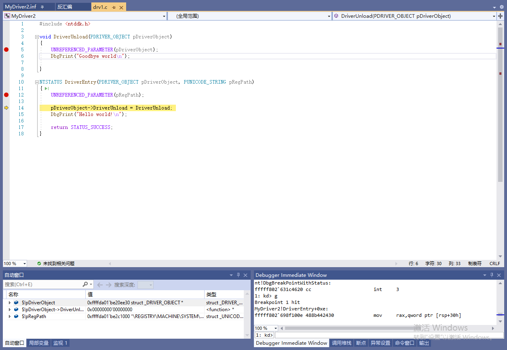
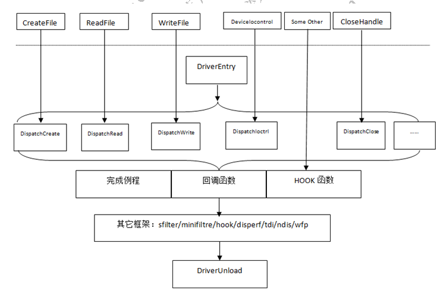

# 驱动开发

# Windows内核调试
## 虚拟机中新增用于调试的引导项
以管理员运行cmd, 执行:
```bat
bcdedit  /dbgsettings serial baudrate:115200 debugport:1

<!-- 产生新引导项DebugEntry, 执行后会打印新的guid -->
bcdedit  /copy {current} /d DebugEntry

bcdedit  /displayorder {current} {<新guid>}
bcdedit  /debug {<新guid>} ON

<!-- 如果要用网络调试, 则:  -->
bcdedit /dbgsettings net hostip:<调试机的IP> port:50000 key:1.2.3.4
```
可通过`Windows+R`运行`msconfig`看到引导设置.

## 调试工具设置
* vs2019
    * 添加设备(即目标虚拟机).
    
        

    * 附加到进程, 然后按暂停键. 

        
        
    
    * 可在驱动的源码中打断点. 之后在虚拟机中用`instdrv`启动驱动程序, 则程序将中断.

        

* windbg
    * `File->Kernel Debugging->COM`, 如下图配置.

        
    * 配置符号:
        * `srv "D:\win_symbols" http://msdl.microsoft.com/download/symbols`

## 其他
* 需要禁用驱动程序强制签名

        开始菜单, 按`shift`并点击重启按钮(或者开机选择引导项时进入'其他选项'). 找到问题修复->高级选项->启动设置, 并选择"禁用驱动程序强制签名".

        网上关于永久禁用驱动强制签名, 一般都是说执行`bcdedit /set testsigning on`和`bcdedit /set nointegritychecks on`, 但是在最新的win10中测试无效.

# NT驱动框架
* 驱动调用流程: 

    
* 驱动框架: R3操作一个文件: create -> read/write/deviceiocontrol -> clean -> close

    
* 设备对象接收IRP
* 驱动创建的所有设备对象会放在一条链上(`NextDevice`); 所有设备对象都会指向该驱动对象.
* 分发函数: (PDEVICE_OBJECT pObj, PIRP pIrp)
    * read: 应用层从内核层读取数据: 从`pIrp`拿缓存的地址和长度; 读写; 完成IRP.
    * write: 应用层向内核层写数据: 分配缓存(`ExAllocatePoolWithTag`), 拷贝数据(`RtlCopyMemory`).
    * ioCtl: 拿到应用层传来的控制码(控制码自己定义), 判断并执行相关操作.
* DriverUnload: 要清除设备对象(`IoDeleteDevice`).
* 加载驱动:
    * ff 
        ```c
        hServiceDDK = CreateService(
            hServiceMgr,
            lpszDriverName, //驱动程序的在注册表中的名字  
            lpszDriverName, // 注册表驱动程序的 DisplayName 值  
            SERVICE_ALL_ACCESS, // 加载驱动程序的访问权限  
            SERVICE_KERNEL_DRIVER,// 表示加载的服务是驱动程序  
            SERVICE_DEMAND_START, // 注册表驱动程序的 Start 值  
            SERVICE_ERROR_IGNORE, // 注册表驱动程序的 ErrorControl 值  
            szDriverImagePath, // 注册表驱动程序的 ImagePath 值  errcode:2 HKEY_LOCAL_MACHINE\SYSTEM\CurrentControlSet\ntmodelDrv\ImagePath
            NULL,  //GroupOrder HKEY_LOCAL_MACHINE\SYSTEM\CurrentControlSet\Control\GroupOrderList
            NULL,  
            NULL,  
            NULL,  
            NULL
        );  
        ```
    * 发命令:
        ```c
        HANDLE hDevice = CreateFile(
            "\\\\.\\NTmodeldrv", //\\.\NTmodeldrv,use your own name
            GENERIC_WRITE | GENERIC_READ,  
            0,  
            NULL,  
            OPEN_EXISTING,  
            0,  
            NULL
        );
        ```
* 驱动函数分类
    * ExXxx: Excute
    * IoXxx: IO
    * KeXxx: Kernel
    * MmXxx: Memory
    * ObXxx: Object
    * PsXxx: Process
    * RtlXxx: Runtime Library
    * ZwXxx: 
    * FltXxx: MiniFilter框架
    * NdisXxx: Ndis框架

* 驱动编写过程
    * `IoCreateDevice`
    * 指定R3和R0间读写的通信协议, `pDeviceObject->Flags = ...`
        * `DO_BUFFERED_IO`: 优点安全, 缺点效率低
        * `DO_DIRECT_IO`: 内存映射, 内核层和应用层操作同一块物理内存
        * `DO_NEITHER_IO`: R0直接访问R3处内存的数据. 可能产生提权漏洞.
    * 创建符号链接`IoCreateSymbolicLink`
    * `pDeviceObject->MajorFunction[...] = ...`, 注册分发函数.
    * `pDeviceObject->DriverUnload = ...`
* 内核漏洞产生原因
    * 不要使用 `MmIsAddressValid` 函数, 这个函数对于校验内存结果是不可靠的.
    * 在 `try_except` 内完成对于用户态内存的任何操作
    * 留心长度为 0 的缓存, 为 NULL 的缓存指针和缓存对齐
        * `ProbeForRead`, `ProbeForWrite`等函数的`Length`参数为0时, 它们不工作
        * 缓存指针为空. 不可放行此类空指针.
        * 缓存对齐. `ProbeForRead`的三参`Alig`.
    * 不正确的内核函数调用引发的问题, 如何防范
        * `ObReferenceObjectByHandle` 未指定类型
        * 不正确的 `ZwXXX` 函数调用不能将任何用户态内存通过调用 ZwXXX 函数传递给内核, 用户态内存未经过校验, 传递给 ZwXXX 会让系统忽略内存检查(因为 ZwXXX 调用时认为上个模式已经是内核模式) 
        * 不要接受任何用户输入的内核对象给内核函数. 接受用户输入的内核对象意味着可以轻易构造内核任意地址写入漏洞, 不要在设备控制中接受任何用户输入的内核对象并将其传递给内核函数. 
    * 驱动提供给应用层的功能性接口. 
    * 设 备 控 制 尽 量 使 用 BUFFERED IO, 而 且 一 定 要 使 用 SystemBuffer,如 果 不 能 用BUFFERED IO,对于 UserBuffer 必须非常小心地 Probe,同时注意 Buffer 中指针, 字符串引发的严重问题, 如果可能, 尽量禁止程序调用自己的驱动。
    * 使用 verifier(内核校验器)和 Fuzz 工具检查和测试驱动. 对于挂钩内核函数的驱动, 可以使用 BSOD HOOK 一类的 FUZZ 工具, 来检查内核函数的缺陷和漏洞.


# Windbg
* 屏蔽无用的调试信息: `ed nt!Kd_SXS_Mask 0`, `ed nt!Kd_FUSION_Mask 0`
* 线程
    * `.attach <pid>`: 
    * `.detach:` 断开调试
    * `~*`: 显示所有线程
    * `~<数字>`: 显示第<数字>个线程
    * `~.`: 显示活动线程
    * `~#`: 显示引起异常的线程
    * `!runaway`: 扩展显示有关每个线程使用的时间的信息
* 进程
    * `!process 0 0`: 系统所有进程(简).
    * `!process 0 7`: 系统所有进程(详).
    * `!process <EPROCESS> 7`: 进程详细信息.
    * `.process /p <EPROCESS>`: 进入进程上下文.
    * `!thread <ETHREAD>`: 查看线程.
    * `.thread <ETHREAD>`: 进入线程上下文.
* 断点
    * `bl <*|n|n1-n2>`: 列出断点
    * `bc <*|n|n1-n2>`: 清理断点
    * `bd <*|n|n1-n2>`: 禁用断点
    * `be <*|n|n1-n2>`: 启用断点
    * `bp <addr|model!func>`: `bp`要求模块已加载, 失败则转化为`bu`断点
    * `bu model!func`: u是unresolved.
    * `bm model!fu*c`: 
    * `ba <w4|r4|e4|i4> <addr>`: 内存断点. 读, 写, 执行, IO(端口, 寄存器). 地址可以写成0x8100xxxx这样.
    * `<bp|ba> </p|/t> <proc> <addr|func>`: 进程/线程断点, 只有该进程或线程执行到这个地方时才中断.
* 内存
    * `dt [nt!]_EPROCESS [<字段>] [<addr>]`: 查看`nt`模块的`_EPROCESS`结构. 加`-r`参数可以递归打印. 带`<addr>`则用该结构打印某地址块. 带`<字段>`则只打印该字段.
    * `<db(1字节)|dw(2)|dd(4)|dq(8)|dp|dD|df> <addr> <L20>`: 打印数字, 打印0x20个单位
    * `<da|du|ds|dS> <addr>`: 打印字符
    * `<dda|ddu|dds|ddp> <addr>`: 打印指针指向的数据. 第三个字符: p(DWORD或QWORD), a(ascii), u(unicode), s(symbol).
    * `<da|du|ds|dS> <addr>`: 打印字符
    * 修改内存: 把d改成e, 如`eb <addr> <val>`.
    * `kb`: 查看栈.
    * `kv`: 查看栈.
    * `kp`: 查看栈(显示函数参数).
* 其他命令
    * `lm`: 列出加载的模块
    * `lm m sth*`: 按名称列出加载的模块
    * `.reload`: 加载符号表. `/user`则只加载用户层的符号.
    * `g`: 继续运行
    * `du <地址>`: 查看内存中值(unicode)
    * `.reload /i:` 忽略pdb文件和sys文件时间戳的不同, 强制加载符号文件
    * `x nt!kes*des*table`: ssdt表
    * 查看shadowSsdt表: 先切换到进程上下文, 然后`x nt!kes*des*table`, 拿第一行的地址, 对其用`dd`, 打印出来的第二行的前4个字节即是该表地址.
    * `uf <addr>`: 反汇编
    * `.open -a <函数名>+<偏移>`: 调出源文件
* 快捷键
    * f9: 断点
    * f10: 单步执行
    * f11: 单步步入
* 反调试
    * `EPROCESS`结构中的`DebugPort`成员为调试端口, 将之清零以防止调试
    * `KdDisable`
    * HOOK以下函数: 
        * `NtOpenThread`:
        * `NtOpenProcess`:
        * `KiAttachProcess`:
        * `NtReadVirtualMemory`:
        * `NtWriteVirtualMemory`:
* 反反调试
* 花指令
    * OLLVM
        * 控制流平展模式
        * 指令替换模式
        * 控制流伪造模式

# 蓝屏分析
* 系统崩溃后产生DUMP文件. 设置: 电脑 -> 系统属性 -> 启动和故障恢复
* windbg分析dump文件
    * open crash dump
    * 设置符号文件路径
    * `!analyze -v`
        * `STACK_TEXT`调用栈信息.
    * `<kv|kp|kb>`
    * `.open -a <函数名>+<偏移>`
* 常见原因
    * 关闭了无效HANDLE
    * 在没有`ObReferenceObject(pFileObject)`的情况下`ObDeferenceObject(pFileObject)`
    * 引用NULL指针
    * 内存访问越界
    * 高中断级访问了缺页内存

# 字符串
```c
typedef struct _UNICODE_STRING {
    USHORT Length; // 字节数
    USHORT MaximumLength; // 字节数, 告诉系统函数最多有多少字节可用
    PWSTR Buffer; // PWSTR等价于WCHAR *
} UNICODE_STRING, *PUNICODE_STRING;
typedef struct _STRING {
    USHORT Length; 
    USHORT MaximumLength;
    PCHAR Buffer; 
} ANSI_STRING, *PANSI_STRING;

// 初始化方式1
UNICODE_STRING uStr = {0};
WCHAR *sz = L"Hello";
RtlInitUnicodeString(&uStr, sz);
// 或
DECLARE_CONST_UNICODE_STRING(uStr, L"Hello")

// 初始化方式2: 栈上buffer
UNICODE_STRING uStr = {0};
WCHAR sz[512] = L"Hello";
uStr.Buffer = sz;
uStr.Length = wcslen(L"Hello");
uStr.MaximumLength = sizeof(sz);

// 初始化方式2: 栈上buffer
UNICODE_STRING uStr = {0};
ULONG ulLen = wcslen(L"Hello") * sizeof(WCHAR);
WCHAR sz[512] = L"Hello";
uStr.Buffer = sz;
uStr.Length = wcslen(L"Hello");
uStr.MaximumLength = sizeof(sz);

```

# 错误记录
* 构建wdm项目时出现`Device driver does not install on any devices, use primitive driver if this is intended`
    
        把项目的`inf`文件中`[Manufacture]`节下面的内容删了(`[Manufacture]`得保留)

* 编译报错：LNK2019 无法解析的外部符号 DriverEntry，该符号在函数 FxDriverEntryWorker 中被引用

        原因: 驱动函数一般采用__stdcall约定
        解决: 函数定义前加extern "C"