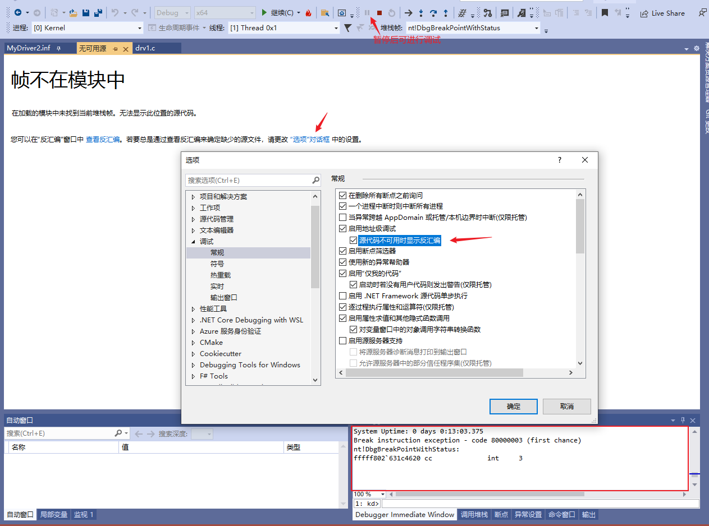
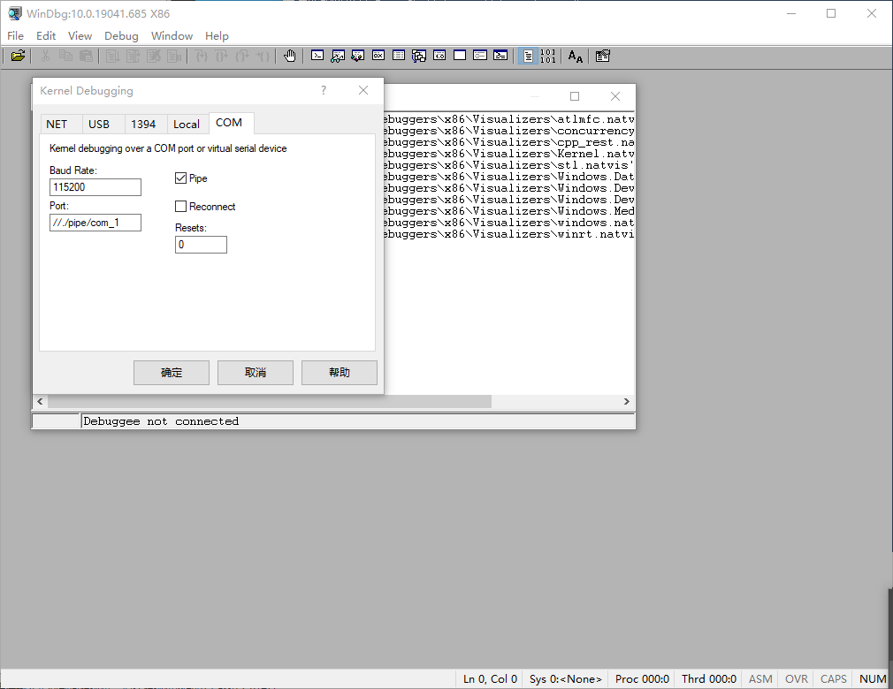
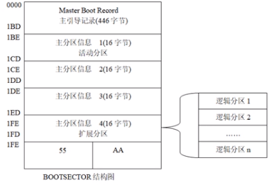
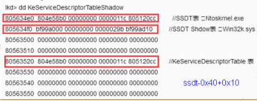

# 驱动开发

# Windows内核调试
## 虚拟机中新增用于调试的引导项
以管理员运行cmd, 执行:
```bat
bcdedit  /dbgsettings serial baudrate:115200 debugport:1

<!-- 产生新引导项DebugEntry, 执行后会打印新的guid -->
bcdedit  /copy {current} /d DebugEntry

bcdedit  /displayorder {current} {<新guid>}
bcdedit  /debug {<新guid>} ON

<!-- 如果要用网络调试, 则:  -->
bcdedit /dbgsettings net hostip:<调试机的IP> port:50000 key:1.2.3.4
```
可通过`Windows+R`运行`msconfig`看到引导设置.

若是用串口通信, 则虚拟机需要添加串口, 选com1口, 并添加管道文件路径.

## 调试工具设置
* vs2019
    * 添加设备(即目标虚拟机).
    
        

    * 附加到进程, 然后按暂停键. 

        

        
    
    * 可在驱动的源码中打断点. 之后在虚拟机中用`instdrv`启动驱动程序, 则程序将中断.

        

* windbg
    * `File->Kernel Debugging->COM`, 如下图配置.

        

    * 配置符号, `File -> Symbol File Path`, 填写: `<自己写的驱动编译后产生的pdb文件的路径>;srv*D:\win_symbols*http://msdl.microsoft.com/download/symbols`. 其他符号链接: http://sym.ax2401.com:9999/symbols

* vscode(替代visual studio)
    * 参考: [VSCode搭建轻量驱动开发环境](https://bbs.pediy.com/thread-260380.htm)
    * 需要安装: wdk, sdk, [FindWdk](https://github.com/SergiusTheBest/FindWDK.git), 还有Visual Studio 生成工具(即从vs_buildtools安装的东西, 在 https://visualstudio.microsoft.com/zh-hans/downloads/ 找)
    * 需要安装vscode插件: cmake, cmake tools

## 其他
* 需要禁用驱动程序强制签名

        开始菜单, 按`shift`并点击重启按钮(或者开机选择引导项时进入'其他选项'). 找到问题修复->高级选项->启动设置, 并选择"禁用驱动程序强制签名".

        网上关于永久禁用驱动强制签名, 一般都是说执行`bcdedit /set testsigning on`和`bcdedit /set nointegritychecks on`, 但是在最新的win10中测试无效.

* Windows平台普通程序开发
    * [配置vscode](https://code.visualstudio.com/docs/cpp/config-msvc)

# NT驱动框架
* 驱动调用流程: 

    
* 驱动框架: R3操作一个文件: create -> read/write/deviceiocontrol -> clean -> close

    
* 驱动运行流程
    * (在R3层)创建一个服务
        * 注册表项: `HKEY_LOCAL_MACHINE\SYSTEM\CurrentControlSet\Sevices\<服务名>`
        * 启动的GROUP与`StartType`决定了驱动. `StartType`值越小越早启动. `StartType`值相同则按GroupOrder顺序启动(`HKEY_LOCAL_MACHINE\SYSTEM\CurrentControlSet\Control\GroupOrderList`). `StartType`值如下:
            * 0(`SERVICE_BOOT_START`): 由核心装载器装载. 在内核刚初始化之后, 加载的都是系统核心有关的重要驱动程序(如磁盘驱动)
            * 1(`SERVICE_SYSTEM_START`): 由I/O子系统装载. 
            * 2(`SERVICE_AUTO_START`): 自动启动. 在登录界面出现的时候. 
            * 3(`SERVICE_DEMAND_START`): 手工启动.
            * 4(`SERVICE_DISABLED`): 禁止启动.
    * (在R3层)对象管理器生成驱动对象(`DriverObject`), 将之传递给`DriverEntry`函数, 执行之.
    * 创建控制设备对象(`IoCreateDevice`, 设备名形如`"\\device\\myDrv"`. 创建的设备对象被赋予其一参)
    * 创建控制设备符号链接(R3可见)(`IoCreateSymbolicLink`, 符号链接名形如`"\\dosdevices\\myDrv"`)
    * 若是过滤驱动, 创建过滤设备对象, 绑定
    * 注册分发函数
    * 其他初始化
    * 应用程序打开驱动的设备对象(`CreateFile`, 一参为形如`"\\\\.\\myDrv"`的设备路径(也是符号链接名), 得到一个`Handle`), 向驱动设备对象发送各种请求(`IRP`)
* 应用层调用驱动的相关接口
    * 安装驱动: `OpenSCManager`打开服务控制管理器, `CreateService`安装驱动, `OpenService`打开驱动服务, `StartService`启动服务. 关闭管理器和驱动服务的句柄用`CloseServiceHandle`.
    * 卸载驱动: 先`OpenSCManager`, `OpenService`; 用`ControlService`(带`SERVICE_CONTROL_STOP`参数)停止驱动; `DeleteService`卸载驱动.
* 设备对象接收IRP(I/ORequest Packets))
    * 可以理解为: 
        * 一个放置 I/O 请求的容器
        * 一个与线程无关的调用栈
    * API
        * `IoMarkIrpPending(pIrp)`: 挂起Irp请求(驱动程序的分发函数中则返回`STATUS_PENDING`)
        * `IoSetCancelRoutine(Irp, CancelRoutine)`: 若二参是NULL, 则取消Irp请求. 如果Irp有设置了取消例程, 则返回该取消例程(`Irp->CancelRoutine`), 否则返回NULL.

* 驱动创建的所有设备对象会放在一条链上(`NextDevice`); 所有设备对象都会指向该驱动对象.
* 分发函数: `(PDEVICE_OBJECT pObj, PIRP pIrp)`
    * read: 应用层从内核层读取数据: 从`pIrp`拿缓存的地址和长度; 读写; 完成IRP.
    * write: 应用层向内核层写数据: 分配缓存(`ExAllocatePoolWithTag`), 拷贝数据(`RtlCopyMemory`).
    * ioCtl: 拿到应用层传来的控制码(控制码自己定义), 判断并执行相关操作.
        * 自定义CTL_CODE: `#define MY_CODE_1 CTL_CODE(DeviceType, Function, Method, Access)`
            * MY_CODE_1: 生成的IRP的MinorFunction
            * DeviceType: 设备对象的类型.
            * Function: 自定义的IO控制码, 取0x800到0xFFF. (0x0到0x7FF为微软保留)
            * Method: 数据的操作模式. 
                * `METHOD_BUFFERED`: 缓冲区模式(用户的输入输出都经过`pIrp->AssociatedIrp.SystemBuffer`来缓冲)
                * `METHOD_IN_DIRECT`: 直接写模式
                * `METHOD_OUT_DIRECT`: 直接读模式
                * `METHOD_NEITHER`: Neither模式
                * 更多关于通信: https://www.cnblogs.com/lsh123/p/7354573.html
            * Access: 访问权限, 可取值有: 
                * `FILE_ANY_ACCESS`: 表明用户拥有所有的权限
                * `FILE_READ_DATA`: 表明权限为只读
                * `FILE_WRITE_DATA`: 表明权限为可写
            
* DriverUnload: 要清除设备对象(`IoDeleteDevice`).
* 驱动函数分类
    * ExXxx: Excute
    * IoXxx: IO
    * KeXxx: Kernel
    * MmXxx: Memory
    * ObXxx: Object
    * PsXxx: Process
    * RtlXxx: Runtime Library
    * ZwXxx: 和NtXxx一样, 不过在内核编程中调用的都是ZwXxx. ZwXxx会先将Previous Mode设置为Kernel Mode, 再调用相应的NtXxx.
    * FltXxx: MiniFilter框架
    * NdisXxx: Ndis框架
* 在R0中可用和不可用的函数
    * 不可用: `printf, scanf, fopen, fclose, fwrite, fread, malloc, free`
    * 可用: `sprintf, strlen, strcpy, wcslen(返回宽字符串中的字符数), wcscpy, memcpy, memset`
* 内存分配: 
    * PagedPool: 分页内存, 物理内存不够时, 这片内存会被移到磁盘上. 总量多. 通常可申请一大片来存数据.
    * NonPagedPool: 总量有限(物理内存).
    * `ExAllocatePoolWithTag(PoolType,NumberOfBytes,Tag)`: `Tag`是四个字节的数据(形如'TSET'), 用来防止溢出(溢出时其会被覆盖).


* 驱动编写过程
    * `IoCreateDevice`
    * 指定R3和R0间读写的通信协议, `pDeviceObject->Flags = ...`
        * `DO_BUFFERED_IO`: 优点安全, 缺点效率低
        * `DO_DIRECT_IO`: 内存映射, 内核层和应用层操作同一块物理内存
        * `DO_NEITHER_IO`: R0直接访问R3处内存的数据. 可能产生提权漏洞.
    * 创建符号链接`IoCreateSymbolicLink`
    * `pDeviceObject->MajorFunction[...] = ...`, 注册分发函数.
    * `pDeviceObject->DriverUnload = ...`

* 内核漏洞产生原因
    * 不要使用 `MmIsAddressValid` 函数, 这个函数对于校验内存结果是不可靠的.
    * 在 `try_except` 内完成对于用户态内存的任何操作
    * 留心长度为 0 的缓存, 为 NULL 的缓存指针和缓存对齐
        * `ProbeForRead`, `ProbeForWrite`等函数的`Length`参数为0时, 它们不工作
        * 缓存指针为空. 不可放行此类空指针.
        * 缓存对齐. `ProbeForRead`的三参`Alig`.
    * 不正确的内核函数调用引发的问题, 如何防范
        * `ObReferenceObjectByHandle` 未指定类型
        * 不正确的 `ZwXXX` 函数调用不能将任何用户态内存通过调用 ZwXXX 函数传递给内核, 用户态内存未经过校验, 传递给 ZwXXX 会让系统忽略内存检查(因为 ZwXXX 调用时认为上个模式已经是内核模式) 
        * 不要接受任何用户输入的内核对象给内核函数. 接受用户输入的内核对象意味着可以轻易构造内核任意地址写入漏洞, 不要在设备控制中接受任何用户输入的内核对象并将其传递给内核函数. 
    * 驱动提供给应用层的功能性接口. 
    * 设备控制尽量使用BUFFERED IO, 而且一定要使用 SystemBuffer,如果不能用BUFFERED IO,对于 UserBuffer 必须非常小心地 Probe,同时注意 Buffer 中指针, 字符串引发的严重问题, 如果可能, 尽量禁止程序调用自己的驱动. 
    * 使用 verifier(内核校验器)和 Fuzz 工具检查和测试驱动. 对于挂钩内核函数的驱动, 可以使用 BSOD HOOK 一类的 FUZZ 工具, 来检查内核函数的缺陷和漏洞.


# Windbg
* 屏蔽无用的调试信息: `ed nt!Kd_SXS_Mask 0`, `ed nt!Kd_FUSION_Mask 0`
* 线程
    * `.attach <pid>`: 
    * `.detach:` 断开调试
    * `~*`: 显示所有线程
    * `~<数字>`: 显示第<数字>个线程
    * `~.`: 显示活动线程
    * `~#`: 显示引起异常的线程
    * `!runaway`: 扩展显示有关每个线程使用的时间的信息
* 进程
    * `!process`
        * `/m <名称加通配符>`
        * `!process 0 0`: 系统所有进程(简). 第一个0可替换为别的进程ID(16进制). 后面可以加要查找的程序的全称.
        * `!process -1 0`: 当前进程信息.
        * `!process 0 7`: 系统所有进程(详).
        * `!process <EPROCESS> 7`: 进程详细信息.
    * `.process /p <EPROCESS>`: 进入进程上下文. (`<EPROCESS>`表示进程的EPROCESS块的地址)
    * `!thread <ETHREAD>`: 查看线程.
    * `.thread <ETHREAD>`: 进入线程上下文.
* 断点
    * `bl <*|n|n1-n2>`: 列出断点
    * `bc <*|n|n1-n2>`: 清理断点
    * `bd <*|n|n1-n2>`: 禁用断点
    * `be <*|n|n1-n2>`: 启用断点
    * `bp <addr|model!func>`: 设置断点. `bp`要求模块已加载, 失败则转化为`bu`断点
    * `bu model!func`: u是unresolved.
    * `bm model!fu*c`: 
    * `ba <w4|r4|e4|i4> <addr>`: 内存断点. 读, 写, 执行, IO(端口, 寄存器). 地址可以写成0x8100xxxx这样.
    * `<bp|ba> </p|/t> <proc> <addr|func>`: 进程/线程断点, 只有该进程或线程执行到这个地方时才中断.
* 内存
    * `dt [nt!]_EPROCESS [<字段>] [<addr>]`: 查看`nt`模块的`_EPROCESS`结构. 加`-r`参数可以递归打印. 带`<addr>`则用该结构打印某地址块. 带`<字段>`则只打印该字段.
    * `<db(1字节)|dw(2)|dd(4)|dq(8)|dp|dD|df> <addr> <L20>`: 打印数字, 打印0x20个单位
    * `<da|du|ds|dS> <addr>`: 打印字符
    * `<dpa|dpu|dps|dpp> <addr>`: 打印指针指向的数据. 第二个字符: d(32位指针), q(64位指针), **p(标准指针大小, 取决于处理器架构)**. 第三个字符: p(DWORD或QWORD), a(ascii), u(unicode), s(symbol).
    * 修改内存: 把d改成e, 如`eb <addr> <val>`.
    * `kb`: 查看栈.
    * `kv`: 查看栈.
    * `kp`: 查看栈(显示函数参数).
* 调试
    * `g`: 继续运行
    * `p`: 执行一条指令(如果打开了source mode, 则执行一行源码)
    * `pa <addr>`: 执行到addr处
    * `t <次数>`: 多次单步执行, 遇到函数会进入
* 其他命令
    * `lm`: 列出加载的模块
    * `lm m sth*`: 按名称列出加载的模块
    * `.reload`: 加载符号表. `/user`则只加载用户层的符号. `f`可以强制加载(而非延迟加载).
    * `.reload /i:` 忽略pdb文件和sys文件时间戳的不同, 强制加载符号文件
    * `x nt!kes*des*table`: ssdt表
    * 查看shadowSsdt表: 先切换到进程上下文, 然后`x nt!kes*des*table`, 拿第一行的地址, 对其用`dd`, 打印出来的第二行的前4个字节即是该表地址.
    * `u`: 查看当前汇编
    * `uf <addr>`: 反汇编
    * `.open -a <函数名>+<偏移>`: 调出源文件
    * `!pte <虚拟地址>`: 将虚拟地址转为物理地址
    * `!vtop <进程基地址> <虚拟地址>`: 将虚拟地址转为物理地址
* 快捷键
    * f9: 断点
    * f10: 单步执行
    * f11: 单步步入
* 反调试
    * `EPROCESS`结构中的`DebugPort`成员为调试端口, 将之清零以防止调试
    * `KdDisable`
    * HOOK以下函数: 
        * `NtOpenThread`:
        * `NtOpenProcess`:
        * `KiAttachProcess`:
        * `NtReadVirtualMemory`:
        * `NtWriteVirtualMemory`:
* 反反调试
* 花指令
    * OLLVM
        * 控制流平展模式
        * 指令替换模式
        * 控制流伪造模式

# 蓝屏分析
* 系统崩溃后产生DUMP文件. 设置: `电脑 -> 系统属性 -> 启动和故障恢复`: 1. 把`系统自动重启`的勾去掉; 2. `写入调试信息`选`核心内存转储`
* windbg分析dump文件
    * open crash dump
    * 设置符号文件路径
    * `!analyze -v`
        * `STACK_TEXT`调用栈信息.
    * `<kv|kp|kb>`
    * `.open -a <模块名>!<函数名>+<偏移>`
* 常见原因
    * 关闭了无效HANDLE
    * 在没有`ObReferenceObject(pFileObject)`的情况下`ObDeferenceObject(pFileObject)`
    * 引用NULL指针
    * 内存访问越界
    * 高中断级访问了缺页内存

* 例子
```c
UNICODE_STRING uStr = {0};
uStr.Buffer = ExAllocatePoolWithTag(PagedPool, wcslen(L"Nice to meet u")+sizeof(WCHAR), 'POCU');
if (uStr.Buffer == NULL) return;
RtlZeroMemory(uStr.Buffer, wcslen(L"Nice to meet u")+sizeof(WCHAR));
RtlInitUnicodeString(&uStr, L"Nice to meet u"); // 会直接将L"Nice to meet u"的地址赋给uStr.Buffer, 而该地址在静态常量区
DbgPrint("%wZ\n", &uStr);
ExFreePool(uStr.Buffer); // 导致蓝屏
```

# 字符串
* Unicode字符串数据类型(https://blog.csdn.net/aishuirenjia/article/details/88996228). L表示long, P表示指针,C表示constant, T表示指针指向的字符占的字节数取决于Unicode是否定义, W表示wide, STR就是string的意思. 
    * `LPSTR`: 32bit指针 指向一个字符串, 每个字符占1字节. 相当于　`char * `
    * `LPCSTR`: 32-bit指针 指向一个常字符串, 每个字符占1字节. 相当于　`const char * `
    * `LPTSTR`: 32-bit指针 每字符可能占1字节或2字节, 取决于Unicode是否定义 
    * `LPCTSTR`:32-bit指针 指向一个常字符串,每字符可能占1字节或2字节, 取决于Unicode是否定义 
    * `LPWSTR`: 32-bit指针, 指向一个unicode字符串的指针,每个字符占2字节. 
    * `LPCWSTR`:32-bit指针, 指向一个unicode字符串常量的指针,每个字符占2字节. 

```c
typedef struct _UNICODE_STRING {
    USHORT Length; // Buffer中字符串的字节数(不含结尾的NULL)
    USHORT MaximumLength; // Buffer的大小(字节数)
    PWSTR Buffer; // PWSTR等价于WCHAR *
} UNICODE_STRING, *PUNICODE_STRING;
typedef struct _STRING {
    USHORT Length; 
    USHORT MaximumLength;
    PCHAR Buffer; 
} ANSI_STRING, *PANSI_STRING;

// 初始化方式1
UNICODE_STRING uStr = {0};
WCHAR *sz = L"Hello";
RtlInitUnicodeString(&uStr, sz);
// 或
DECLARE_CONST_UNICODE_STRING(uStr, L"Hello")

// 初始化方式2: 栈上buffer
UNICODE_STRING uStr = {0};
WCHAR sz[512] = L"Hello";
uStr.Buffer = sz;
uStr.Length = wcslen(L"Hello");
uStr.MaximumLength = sizeof(sz);

// 初始化方式2: 栈上buffer
UNICODE_STRING uStr = {0};
ULONG ulLen = wcslen(L"Hello") * sizeof(WCHAR);
WCHAR sz[512] = L"Hello";
uStr.Buffer = sz;
uStr.Length = wcslen(L"Hello");
uStr.MaximumLength = sizeof(sz);

```

* 常用API
    ```c
    UNICODE_STRING uStr1 = {0};
    WCHAR buff[100] = "Hello";
    uStr1.Length = 10;
    uStr1.Buffer = buff;

    WCHAR *str1 = "world";

    UNICODE_STRING uStr2 = {0};
    uStr1.Length = 10;
    uStr1.Buffer = str1;

    // 常用API
    RtlInitUnicodeString(&uStr1, str1);
    RtlCopyUnicodeString(&uStr1, &uStr2);
    RtlAppendUnicodeToString(&uStr1, str2);
    RtlAppendUnicodeStringToString(&uStr1, &uStr2);
    RtlCompareUnicodeString(&uStr1, &uStr2, TRUE/FALSE); // 三参表示是否忽略大小写
    RtlAnsiStringToUnicodeString(&uStr1, &aStr1, TRUE/FALSE); // 三参TRUE则由系统分配内存.有溢出风险.
    RtlFreeUnicodeString(&uStr1); // 三参TRUE则由系统分配内存

    // 安全函数, 能检测溢出
    #include <ntstrsafe.h>
    RtlUnicodeStringInit(&uStr1, str1);
    RtlUnicodeStringCopy(&uStr1, &str1);
    RtlUnicodeStringCat(&uStr1, &str1);

    ```

* UNICODE_STRING常见问题
    * 计算length时, 少了`*sizeof(WCHAR)`
    * 计算字符数时, 少了`/sizeof(WCHAR)`
    * 使用了`wcscmp, wccscpy`等函数操作

# 文件
* 文件的表示
    * 应用层: `"c:\\doc\\a.txt"`
    * 内核: `L"\\??\\c:\\a.txt"` -> `"\\device\\harddiskvolume3\\a.txt"`, 前面问号是卷设备对象的符号链接名.
    * R3: 设备名: `L"\\\\.\\xxDrv"`
    * R0: 设备名: `L"\\device\\xxDrv"`; 符号链接名: `"\\dosdevices\\xxDrv"` -> `"\\??\\xxDrv"`
* 内核文件操作API
    * 打开文件获得handle -> 基于handle读写查删 -> 关闭
    * `InitializeObjectAttributes`宏: 初始化一个`OBJECT_ATTRIBUTES` 结构体
    * `ZwCreateFile`: 打开文件
    * `ZwWriteFile`
    * `ZwReadFile`
    * `ZwQueryInformationFile`读取文件属性, `ZwSetInformationFile`: 可用于删文件
        * 第五参
            * FileBasicInformation
            * FileStandardInformation
            * FileRenameInformation: 重命名文件时用
            * FileDispositionInformation: 删文件时用
    * `ZwQueryFullAttributesFile`: (irp_mj_set_information). 可删除和重命名文件
    * `ZwClose`
    * `ZwQueryDirectoryFile`: 遍历文件夹
    * `RtlVolumnDeviceToDosName(fileObject->DeviceObject, &DosDeviceName)`: 得到文件所属设备的名称(如`C:`)
* 其他知识点
    * 8个扇区 == 1个簇

# 系统引导和磁盘分区
* BIOS和MBR
    * 流程
        * 启动电源, 硬件初始化检查.
        * 根据CMPS的设置, BIOS加载启动盘, 将MBR的引导代码载入内存, 然后启动过程由MBR来执行.
        * 搜索MBR中的分区表DPT, 找到活动分区, 将其VBR中的引导代码载入内存`0x07c00`处.
        * 引导代码检测当前使用的文件系统, 查找ntldr文件, 启动之.
        * BIOS将控制权转交给ntldr, 由它完成操作系统的启动. (Win7是BootMgr)
    * MBR: 物理硬盘第一扇区0柱面0磁头.
    * VBR: 卷引导记录, 为每个非扩展分区及逻辑分区的第一个扇区.
    * DBR(DOS Boot Record): 操作系统进入文件系统后可以访问的第一个扇区. 包括一个引导程序和一个被称为BPB(BIOS Parameter Block)的本分区参数记录表.
    * EBR(Extended Boot Record): 扩展分区的每个逻辑驱动器的类似MBR的引导记录.
    * LBA(logical block address 32位): 一个扇区512字节(2^9), 最大支持分区: 2^32 * 2^9 = 2T

        

* UEFI(Unified Extensible Firmware Interface, 统一的可扩展固件接口)和GPT
    * LBA(64位), 分区数量无限制, MS128个分区.
    * UEFI相当于一个微型操作系统. 具备文件系统的支持, 能直接读取FAT分区中的文件, 可开发处直接在UEFI下运行的应用程序(以efi结尾). 可将windows安装程序做成efi程序, 然后把它放任意分区中直接运行.
    * 不需要主引导记录, 不需要活动分区, 只要复制一个安装文件到一个FAT32(主)分区或U盘中, 然后从中启动.
    * PMBR的作用: 使用不支持GPT的分区工具时, 整个影片将显示为一个受保护的分区, 以防分区表及硬盘数据遭到破坏.
    * SecureBoot(防恶意软件): 主板出厂的时候, 可内置一些可靠的公钥. 任何要在这块主板上加载的操作系统或硬件驱动, 都要用对应的私钥签署过.


        

# 注册表
* 路径
    * `"\\Registry\\Machine\\software"` -> HKEY_LOCAL_MACHINE
    * `"\\REGISTRY\\User\\"` -> HKEY_USERS
* 数据类型
    * `REG_SZ`: 字符串
    * `REG_BINARY`: 二进制数据
    * `REG_DWORD`: 4字节无符号整数
    * `REG_EXPAND_SZ`: 扩展字符串, 其中带环境变量, 如"%systemtoor%\c.doc". 应用层函数`ExpandEnvironmentStrings`可展开之.
    * `REG_MULTI_SZ`: 多字符串(每个字符串间用NULL隔开)
        * 构造: `sprintf(buf, "%s%c%s%c%c%", "1.1.1.1", 0, "1.1.1.1", 0, 0)`
        * 用于删除和重命名: `MoveFileEx(szTemp, NULL, MOVEFILE_DELAY_UNTIL_REBOOT)`, 重启替换`szTemp`文件. 如替换dll文件. 每次调用, 一参和二参会被写到`\\Registry\\Machine\\SYSTEM\CurrentContrilSet\Control\Session Manager\PendingFileRenameOperations`
        * UNC(Universal Naming Convention, 通用命名规则)
            * 用于局域网共享文件夹
            * `\HKEY_LOCAL_MACHINE\SYSTEM\CurrentControlSet\Services\LanmanServer\Shares` 记录本机共享的文件夹的信息. 
* 存储
    * HIVE文件
        * 由多个巢箱(BIN)组成
        * 注册表解析: https://www.52pojie.cn/thread-41492-1-1.html
        * 缺省放在`%systemroot%/System32/config`下, 6个文件: DEFAULT, SAM, SECURITY, SOFTWARE, USERDIFF, SYSTEM
* 注册表操作
    * 参考: http://www.lcx4.com/?post=112
    * 创建: `ZwCreatKey`. `InitializeObjectAttributes`时, 其四参指定父键的handle(可由`ZwOpenKey`获得)
    * 查询: `ZwQueryKey`查询键下子键, `ZwQueryValueKey`查询键下的某个键值对的值(传入参数包括键的句柄, 键值对的键名)
    * 枚举: 
        <!-- * `ZwEnumerateKey`: 枚举子键
        * `ZwEnumerateValueKey`: 枚举键下的键值对 -->
        * 先调用一次`ZwQueryKey`获得数据长度(三参设为NULL)
        * 再次调用`ZwQueryKey`获得数据(三参设为`ExAllocatePoolWithTag`分配得到的buffer, 记为pfi). for循环以`pfi->SubKeys`为总数时, 循环体中`ZwEnumerateKey`获得子键的信息. `pfi->Values`则对应`ZwEnumerateValueKey`.
        * `ZwQueryValueKey`, `ZwEnumerateKey`, `ZwEnumerateValueKey`同理
    * 删除: `ZwDeleteKey`, `ZwDeleteValueKey`
    * 设置: `ZwSetValueKey`新增键值对

# 强删文件
* R0层关句柄
    * 打开文件: `IoCreateFile`(比`ZwCreateFile`更底层)
    * 删除独占文件
        * 从全局句柄表找到打开这个文件的进程和文件的句柄
            * `ZwQuerySystemInformation( SystemHandleInformation, buf, size, NULL )`. 因为没法得到全局句柄表的大小, 所以要逐渐递增buf大小. 注: `ZwQuerySystemInformation`这个函数在ntdll中, 内核层编程时可在头文件声明一下, 声明头加上`NTSYSAPI`和`NTAPI`. `SystemHandleInformation`值为16.
        * 把句柄拷贝过来: `ZwDuplicateObject`, `DUPLICATE_CLOSE_SOURCE`则表示同时在目标进程中把文件句柄关掉
        * 再次打开文件, 得到handle
        * 通过handle得到fileObject(用`ObReferenceObjectByHandle`)
        * `IoGetRelatedDeviceObject(fileObject)`得到设备对象deviceObject
        * 初始化事件`KeInitializeEvent`; 初始化用来删除文件的Irp
        * 为Irp设置一个例程(回调)(`IoSetCompletionRoutine`), 当下层驱动完成文件的删除时, 会通知执行该例程.
        * 下发Irp(交给下层的文件系统驱动处理): `IoCallDriver(DeviceObject, Irp)`
        * 等待完成: `KeWaitForSingleObject`
    * 删除正在运行的exe文件
        * 系统会检查`fileObject->SectionObjectPointer`中的`ImageSectionObject`和`DataSectionObject`, 都不为0则表示exe正在运行. 
        * 因此强删的方法是先把上述两项设为0, 欺骗系统.

* R3层关句柄
    * 原理与R0层类似
    * 用线程处理死锁
        * `NtQueryObject`会导致某些句柄hang住
        * `GetFileType(hFile)`也是

# 线程的IRQL(Interrupt Request Level)
* 如果某个中断产生了, 且IRQL <= 目前处理器的IRQL, 那么将不会影响目前程序的运行; 否则执行中断程序.
* 中断: 硬件产生的一个电信号
    * 异常: 由CPU产生. IF(中断标志位, 用来开关中断)维持不变, 不会关闭中断
        * 故障(FALT): 除零, 缺页, 越界, 堆栈段错误等
        * 陷阱(TRAP): 程序员用的, 如int 3, 溢出
    * 中断: IF标志清零, 关中断
        * 非屏蔽中断: 计算机内部硬件出错引起的异常
        * 屏蔽中断: 外围设备产生
    * 中断向量
        * 0~31: 异常和非屏蔽中断
        * 32(0x20)~47(0x2f): IO引起的屏蔽中断
        * 48(0x30)~255(0xff): 软中断, 如linux的0x80系统调用`system_call`进入内核
    * 中断优先级: 在同一处理器上, 线程只能被更高级别IRQL的线程能中断
        * 无中断
            * `PASSIVE_LEVEL`(0): 和文件, 注册表读写相关的操作. 可访问分页内存.
        * 软中断
            * `APC_LEVEL`(1)
            * `DISPATCH_LEVEL`(2): 不能访问分页内存
        * 硬中断
            * `DIRQL`: 设备中断请求级处理程序执行
            * `PROFILE_LEVEL`: 配置文件定时器
            * `CLOCK2_LEVEL`: 时钟
            * `SYNCH_LEVEL`: 同步级
            * `IPI_LEVEL`: 处理器之间中断级
            * `POWER_LEVEL`: 电源故障级
        * 遵守中断级别要求
            * PASSIVE级别可访问任何函数和内存
            * DISPATCH级别只能访问运行在DISPATCH级别的API和非分页内存(NONPAGEDPOOL)
            * NONPAGEDPOOL可在任何级别使用
            * PAGEDPOOL只能在PASSIVE和APC级别使用
                * 在这两个级别的代码中用`PAGED_CODE`宏(其调用`KeGetCurrentIrql`), 其会检测当前代码IRQL是否高于APC, 是则异常.
            * 补充
                * 系统在APC_LEVEL处理缺页中断, 所以, 执行在>=APC_LEVEL上的代码必须存放在NON-PGAE内存中
        
        |调用源|一般的运行中断级|运行环境|
        |-|-|-|
        |`DriverEntry`, `DriverUnload`|Passive级|单线程|
        |各种分发函数`DispatchXxx`|Passive级|多线程|
        |完成函数|Dispatch级|多线程|
        |各种NDIS回调函数|Dispatch级|多线程|
* 多线程
    * 内核创建多线程: `PsCreateSystemThread`
    * 同步(A告诉B发生了什么事)
        * KEVENT: 用于线程同步
            * Event两个状态: Signaled, Non-signaled
            * Event两个类别: Notification事件(不自动恢复, 比如从Signaled转为Non-Signaled要手动设置), synchronization事件(自动恢复)
            * 代码
                ```c
                // 线程A
                KEVENT waitEvent;
                KeInitializeEvent(&waitEvent, NotificationEvent, FALSE);

                // 内核中创建自命名事件则如下
                RtlInitUnicodeString(&EventName, L"\\BaseNamedObjects\\ProcEvent");
                PKEVENT Event = IoCreateNotificationEvent(&EventName, &Handle); // 生成的事件的句柄放到Handle中
                KeClearEvent(Event);

                // 触发事件
                KeSetEvent(&waitEvent, IO_NO_INCREMENT, FALSE); 

                // 线程B
                KeWaitForSingleObject(&waitEvent, Executive, KernelMode, False, NULL); // NULL无限等待, 0立即返回
                ...
                KeClearEvent(&waitEvent); // 将事件设为non-signaled状态
                KeResetEvent(&waitEvent);

                // 应用层等待事件则如下
                HANDLE hProcessEvent = ::OpenEventW(SYNCHRONIZE, FALSE, L"Global\\ProcEvent");  // 注意得到的句柄为0时会让下面的代码死循环, 所以要判断0
                while (true) {
                    ::WaitForSingleObject(hProcessEvent, INFINITE)
                    ...
                }
                ```
        * `KeWaitForSingleObject`, `KeWaitForMultiObjects`
            * 可等待的对象: `KEVENT`, `KMUTEX/KMUTANT`, `KPROCESS`, `KQUEUE`, `KSEMAPHORE`, `KTHREAD`, `KTIMER`(它们都带dispatcher header). 
            * 不可等待: `fileobject`/`driverobject`
        * R0到R3同步通信
            * 内核层
                * 创建Event: `IoCreateNotificationEvent`, `L"\\BaseNamedObjects\\ProcEvent"`
                * (z: 1:24)
            * 应用层
                * 事件名: `L"Global\\ProcEvent"`
    * 互斥(A和B只能一个访问)
        * KSPIN_LOCK: 自旋锁
            * 代码
                ```cpp
                KIRQL OldIrql;
                KSPIN_LOCK mySpinLockProc;

                // 获得
                KeAquireSpinLock(&mySpinLockProc, &OldIrql);
                
                // 访问数据
                g_i++;

                // 释放
                KeReleaseSpinLock(&mySpinLockProc, OldIrql);
                ```
            * 注意事项
                * 多CPU共享安全
                * 提升IRQL到DPC
                * 禁止访问分页内存
                * 获得时间越短越好
            * 和Mutex的区别

            |SpinLock|Mutex|
            |-|-|
            |忙等, 不会睡眠(不阻塞). 忙等线程会占着CPU, 一直轮询. 适用于等待时间不长的情况(如小于25微秒)|会阻塞请求线程. 若要长时间串行化访问一个对象, 应首先考虑使用互斥量而非自旋锁|
            |SpinLock请求成功之后, CPU的执行级别会提升到Dispatch级别. DL及以下级别可请求SpinLock|Mutex通常在PL请求, 在DL上Timeout要设为0|
            |非递归锁(不能递归获得该锁)|递归锁|
            |主要用于多CPU, 但效率不高, 使用ERESOURCE较好|-|

        * ERESOURCE(读写共享锁)(2:14)

        * FAST_MUTEX
            * 用于互斥
            * APC级别
            * 非递归锁
            * 代码
                ```c
                FAST_MUTEX fm;
                ExInitializeFastMutex(&fm);
                ```

        * KSEMAPHORE(信号量)(2:24)
            * 相当于资源池
            * 代码
                ```cpp
                KSEMAPHORE ks;
                KeInitializeSemaphore(
                    &ks,
                    1, // 信号量的初始值, 资源数
                    2 // 信号量的最大值
                );
                
                LARGE_INTEGER waitTime = {0};
                waitTime.QuadPart = -1 * 10000000i64;
                KeWaitForSingleObject(&ks, Executive, KernelMode, FALSE, &waitTime); // 0立即返回, 
                KeReleaseSemaphore(&ks, IO_NO_INCREMENT, 1, FALSE); // 0立即返回, 
                ```
        * R0同步互斥总结
            * Dispatch级别: SpinLock
            * APC/PASSIVE级别:
                * 互斥: ERESOURCE/FAST_MUTEX
                * 同步: KEVENT/KSEMAPHORE
            * R3和R0同步通信: KEVENT
            * 整数增减: `InterlockedExchanged`, `Interlockedincrement(&i)`可对整数i进行原子性加
            
        * critical_section(临界区)(2:50)
        ```cpp
        typedef struct _RTL_CRITICAL_SECTION {
            PRTL_CRITICAL_SECTION_DEBUG DebugInfo;
            LONG LockCount; // 初始为-1, 大于等于0时表示被临界区占用. 它跟RecursionCount的差值表示有多少其他线程在等待获得临界区
            LONG RecursionCount; // 所有者线程递归获取的次数
            HANDLE OwningThread;        // 所有者线程的id ClientId->UniqueThread
            HANDLE LockSemaphore; // 这是一个自复位事件而非信号量. 用于通知操作系统, 临界区已空闲. 临界区被占时, 若有另一个线程尝试获取, os会创建之. 最后要用DeleteCriticalSection释放.
            ULONG_PTR SpinCount;        // 仅用于多处理器. 若临界区不可用, 调用线程将在对与该临界区相关的信号执行等待操作前, 选择SpinCount次. 若期间临界区变为可用, 调用线程就避免了等待操作. 默认为0.
        } RTL_CRITICAL_SECTION, *PRTL_CRITICAL_SECTION;
        RTL_CRITICAL_SECTION cs;
        EnterCriticalSection(&cs);
            ...
            //   操作dwTime
            ...
        LeaveCriticalSection(&cs);
        ```

        * 用临界区实现CAutoClock(自动锁)
        ```c
        class CLock
        {
        public:
            CLock()
            {
                InitializeCriticalSection(&m_cs);
            }
            ~CLock()
            {
                DeleteCriticalSection(&m_cs);
            }
            void Lock()
            {
                EnterCriticalSection(&m_cs);
            }
            void UnLock()
            {
                LeaveCriticalSection(&m_cs);
            }

        private:
            CRITICAL_SECTION m_cs;

        };
        class CAutoLock
        {
        public:
            CAutoLock(CLock *pLock):m_pLock(pLock)
            {
                m_pLock->Lock();
            }
            ~CAutoLock()
            {
                m_pLock->UnLock();
            }
        private:
            CLock *m_pLock;
        };

        CLock g;
        {
            CAutoClock a(&g);

            // 从这个单元出去后a的析构函数被调用, 即可解锁
        }
        ```
        
        * 死锁
            * Dijkstra哲学家用餐问题解决方法
                * 服务生同意才能拿
                * 资源分级: 筷子编号, 每个哲学家总是先试图拿编号最小的筷子
            * windbg检测死锁
                * `!deadlock`
                * `!locks`: 列出锁的信息, `LockCount`大于0的锁对应的线程比较可疑.
                * 用 `~` 列出线程, `~<tid> kb` 查看调用栈, 找到`RtlWaitForCriticalSection`之类的函数的参 数

# 内核数据结构
* LIST_ENTRY结构体(构成双向循环链表)
    * 在结点结构体中添加该结构体类型的成员
    * `CONTAINING_RECORD(addr, type, field)`: 返回一个结构实例的基地址, 该结构的类型和结构所包含的一个域(成员)地址已知
        ```c
        #define CONTAINING_RECORD(address, type, field) ((type *)( \
        (PCHAR)(address) - \
        (ULONG_PTR)(&((type *)0)->field)))
        ```
    * 使用方法
        * `LIST_ENTRY`结构体: 其中有`Flink`(指向下一个节点)`Blink`(指向上一个节点)
        * `PLIST_ENTRY`: 头结点
        * `InitializeHeadList`
        * `InsertHeadList`: 结点头插入
        * `InsertTailList`: 结点尾插入
        * `RemoveHeadList`
        * `RemoveTailList`
        * `IsListEmpty`

    

* HASH表
    * 应用
        * FileMon存储: fileobject -> 文件名
        * SwapContext: EPROCESS -> 进程数据
        * O(1)

* TREE, 平衡树
    * `RTL_AVL_TABLE`
    * `RtlInitializeGenericTableAvl`

* LookAside结构: 用于防止内存碎片化的机制
    * 类别
        * PAGED_LOOKASIDE_LIST
        * NPAGED_LOOKASIDE_LIST
    * `ExInitializePagedLookasideList`

# 强杀进程
* `NtTerminateProcess` -> `PsTerminateProcess`(系统未导出) -> `PspTerminateProcess`  ->`PspTerminateThreadByPointer` -> `PspExitThread` 
* 暴力搜索未导出函数PsTerminateProcess
    * 获取特征值
        * windbg中, 加载上系统符号, dd <函数名> L4, 获得前16个字节的特征值
    * 内核地址空间
        * `NtQuerySystemInformation`(win8以后不支持了)或`AnuKlibQueryModuleInformation`: 查内核起始地址

# 进程相关API
* `PsGetCurrentProcessId`: 获取当前线程所属进程的pid. 在DispatchIoControl函数中实际是获得向驱动发出请求的进程的id.
* `PsGetCurrentProcess`宏: 即`IoGetCurrentProcess`函数, 返回当前进程的EPROCESS结构的指针.
* `PsLookupProcessByProcessId(pid, &pEProcess)`: 根据pid获取进程EPROCESS结构
* `KeStackAttachProcess(pEProcess, &ApcState)`: 将当前线程附加到目标进程控件. 对应函数`KeUnstackDetachProcess(&ApcState)`. `ApcState`直接初始化为`{0}`, 或者`PKAPC_STATE pApcState = (PKAPC_STATE)ExAllocatePool(NonPagedPool, sizeof(PKAPC_STATE)); ApcState = *pApcState;`. `KeAttachProcess(pEProcess)`是旧方法.
* `ZwQueryInformationFile(<进程句柄>, ProcessImageFileName, lpBuffer, nSize, &nSize)`: 得到进程路径(`\device\harddiskvolumn1\Xxx`). 可先将三四参设为NULL调用一次, 得到`nSize`, 并分配`lpBuffer`. `lpBuffer`接收`UNICODE_STRING`结构的进程路径.
* `NtCurrentProcess()`宏: 返回表示当前进程的特殊句柄值
* ``: 
* ``: 

# 主防
* 弹窗
    * R3某进程发生某操作
        * 对象: 文件, 注册表, 驱动, 进程
        * 动作: 创建, 删除, 修改, 重命名, 启动
    * 获取进程全路径的步骤
        * 通过pid得到eprocess
        * 执行`KeStackAttachProcess`进入进程上下文
        * 执行`ZwQueryInformationProcess`(`2参为ProcessImageFileName`)得到`\\device\\harddiskvolume1\\Xxx`
        * 使用上面得到路径, 执行`ZwCreateFile`, 得到文件handle
        * 对该文件handle执行`ObReferenceObjectByHandle`得到对应的fileObject
        * `RtlVolumeDeviceToDosName(fileObject->DeviceObject, &DosDeviceName)`得到盘符("C:"), 放到`DosDeviceName`中.
        * `ZwQueryInformationFile`(5参为`FileNameInformation`)得到文件相对路径
        * 把盘符和文件相对路径拼接起来得到完整路径.
    * 获取目标对象全路径
        * 先有对象的handle
        * `ObReferenceObjectByHandle`
        * `IoQueryFileDosDeviceName`, `ObQueryNameString`
    * 短名转长名: 
        * 短名例子: `DLV~1`, 实际名称(长名)可能是`DLVBLABLA`. 查看的方法是dos命令: `dir /x`
        * 先`ZwCreatFile`打开父目录, 得到其句柄, 然后将句柄和子目录的短名(作为倒数第二个参数)传给`ZwQueryDirectoryFile`, 其buffer参数即得到完整长名
        * 按上述步骤逐步得到文件完整目录
    * 符号链接名和设备名的转换
        * `\\??\C:` <--> `\\device\\harddiskvolume1`
        * 符号链接名转设备名: `ZwOpenSymbolicLinkObject`, `ZwQuerySymbolicLinkObject`
        * 设备名转符号链接名: 枚举A-Z盘符对应的设备名看是否和目标盘符一致
    * 模式匹配
        ```c
        FsRtlIsNameInExpression(
            Expression,
            Name,
            IgnoreCase, //如果这里设置为TRUE,那么Expression必须是大写的
            NULL
        ); 
        ```
        * 保存规则: 放到一个.dat文件中, 加密
    * 放行
        * 内核模式的: 判断: `ExGetPreviousMode() == KernelMode`或`Irp->RequestorMode == KernelMode`
        * 本进程的: 在`DeviceIoctrlFilter`中记录`PsGetCurrentProcessId`
        * 系统进程的: `DriverEntry`里`PsGetCurrentProcessId`拿到的就是; `KeGetCurrentIrql() > APC_LEVEL`; 白名单中的.
        * 如何放行
            * HOOK直接调用原API
            * IRP: `IoSkipCurrentIrpStackLocation(IpIrp)`, `IoCallDriver()`
* 其他
    * 应用层异步读文件
        ```cpp
        OVERLAPPED Overlapped;
        HANDLE g_hOverlappedEvent = CreateEvent(NULL, FALSE, FALSE, NULL);
        Overlapped.hEvent = g_hOverlappedEvent;
        ReadFile(gh_Device, &OpInfo, sizeof(OP_INFO), &ulBytesReturn, &Overlapped);
        ...
        WaitForSingleObject(Overlapped.hEvent, INFINITE);

        // 当驱动程序完成IO, 调用IoCompleteRequest后, 上面Overlapped.hEvent会被激发, WaitForSingleObject会返回
        ```
    * 同步非阻塞: 虽然和同步阻塞一样IO不会立即返回, 但它是有数据时才IO. 实现方式包括IO多路复用.

# x86hook
* (24: 00): 各种hook对应的函数名在调用栈中的示例
* 调用链:
    * API -> Kernel32.dll -> ntdll.dll -> sysenter -> Nt*
    * Zw* -> Nt*: 内核层程序一般不直接调用`Nt*`函数. `Zw*`会把`kthread`中的`PreviousMode`设为`KernelMode`, `Nt*`中则没这一步.
* hook三步
    * 找到该函数
    * 实现一个新的函数替换之
    * 恢复该函数
* ssdt hook
    * 导入服务描述表: `__declspec(dllimport)  ServiceDescriptorTableEntry_t KeServiceDescriptorTable;` `KeServiceDescriptorTable`是由`ntoskrnl.exe`导出的.
    * 获取`Zw*`索引号: `NtReadFile index = *(DWORD *) ((unsigned char *) ZwReadFile + 1)`, 因为`Zw*`函数的第一条指令是`mov eax, <索引号>`, 这条指令5个字节, 操作码1个字节, 后4个字节是操作数.
    * 得到ssdt表中函数的地址
        * x86: `KeServiceDescriptortable + 4 * index`
        * x64: `KeServiceDescriptortable + ((KeServiceDescriptortable + 4 * index) >> 4)`
    * 或者用这个宏根据Zw函数获取Nt函数的地址: `#define SYSTEMSERVICE(_function) KeServiceDescriptorTable.ServiceTableBase[ *(PULONG)((PUCHAR)_function+1)]`. `_function`是NtXxx对应的ZwXxx. `(PUCHAR)_function+1`的目的是取ZwXxx函数开始处的第二个字节(注意ZwXxx函数的第一条指令是`mov eax, <索引号>`), 这个数字即是其在ssdt中的序号.
    * 用`typedef`定义一个目标Nt函数的原型, 然后声明一个函数指针变量, 存放原Nt函数.
    ```cpp
    #define SDT SYSTEMSERVICE

    typedef NTSTATUS (*ZWOPENPROCESS)(
        OUT PHANDLE            ProcessHandle,
        IN ACCESS_MASK          AccessMask,
        IN POBJECT_ATTRIBUTES  ObjectAttributes,
        IN PCLIENT_ID          ClientId );

    static ZWOPENPROCESS OldZwOpenProcess;


    NTSTATUS Hook_ZwOpenProcess(
        OUT PHANDLE            ProcessHandle,
        IN ACCESS_MASK          AccessMask,
        IN POBJECT_ATTRIBUTES  ObjectAttributes,
        IN PCLIENT_ID          ClientId )
    {
        NTSTATUS rc;

        rc = OldZwOpenProcess(ProcessHandle,AccessMask,ObjectAttributes,ClientId);
        return rc;
    }

    // 下面的方法在多核环境下不安全
    void StartHook (void) {
        __asm { // x86才能这么写(x64中要写在单独asm文件中: https://www.mallocfree.com/basic/asm/asm-4-x64.htm)
            push eax
            mov eax, CR0
            and eax, 0FFFEFFFFh // CR0寄存器的第16位是对内核的写保护标志(为1则不能改内核)
            mov CR0, eax
            pop eax
        }

        // 通过InterlockedExchange把SDT中的函数地址替换成自己的钩子函数. 返回旧的函数地址.
        // 注意OldZwOpenProcess的值其实是NtOpenProcess的地址
        OldZwOpenProcess = (ZWOPENPROCESS)InterlockedExchange((PLONG)&SDT(ZwOpenProcess), (LONG)Hook_ZwOpenProcess);

        //关闭
        __asm {
            push eax
            mov eax, CR0
            or eax, NOT 0FFFEFFFFh
            mov CR0, eax
            pop eax
        }
    }

    // 移除钩子则如下(前后仍要加如上的asm代码)
    // 多核环境下不安全, IRP包可能被挂起, 没返回, 这时若卸载钩子时IRP返回并执行SSDT中自定义的钩子函数(已不存在), 可能引起蓝屏
    InterlockedExchange( (PLONG) &SDT (ZwOpenProcess), (LONG) OldZwOpenProcess);
    // 可以设置一个引用计数, 其值为0时才允许卸载钩子

    // 安全的方法
    NTSTATUS RtlSuperCopyMemory(IN VOID UNALIGNED *Dst,
    IN CONST VOID UNALIGNED *Src,
    IN ULONG Length)
    {
        // MDL(memory descriptor list)是一个对物理内存的描述, 负责把虚拟内存映射到物理内存
        // IoAllocateMdl分配一块足以匹配缓存大小的内存(Dst, Length分别是缓存的地址和大小)
        PMDL pmdl = IoAllocateMdl(Dst, Length, 0, 0, NULL);
        if(pmdl==NULL)
            return STATUS_UNSUCCESSFUL;
        // MmBuildMdlForNonPagedPool更新创建在非分页内存上的MDL
        MmBuildMdlForNonPagedPool(pmdl); 
        unsigned int *Mapped = (unsigned int *)MmMapLockedPages(pmdl, KernelMode); // 锁死内存页, 防止被修改
        if(!Mapped)
        {
            IoFreeMdl(pmdl);
            return STATUS_UNSUCCESSFUL;
        }

        KIRQL kirql = KeRaiseIrqlToDpcLevel();

        RtlCopyMemory(Mapped, Src, Length);

        KeLowerIrql(kirql);

        MmUnmapLocked((PVOID)Mapped,pmdl);
        IoFreeMdl(pmdl);

        return STATUS_SUCCESS;
    }
    Rtlsupercopymemory(&SDT(ZwOpenProcess), &Hook_ZwOpenProcess, 4);
    Rtlsupercopymemory(&SDT(ZwOpenProcess), &OldZwOpenProcess, 4);
    ```
    * 应用
        * 监控进程创建: `NtCreateSection`.
            * 其最后一个参数是进程的文件handle, 使用`ObReferenceObjectByHandle`得到fileObject, 再使用`IoQueryFileDosDeviceName`得到完整文件路径.
        * 进程保护: `NtTerminateProcess`, `NtOpeneProcess`.
        * 驱动加载监控: 
            * `NtLoadDriver`
            * `NtSetSystemInformation`
            * 设置回调: `PsSetLoadImageNotifyRoutine`
                ```cpp
                UCHAR f[] = "\xB8\x22\x00\x00\xC0\xC3";
                VxkCopyMemory(DriverEntry, f, sizeof(f));
                // 相当于把DriverEntry开头换成如下两条指令, 直接返回status_access_denied
                // mov eax, 0xc0000022
                // ret
                ```
            * 问题: 用instDrv.exe加载驱动时, 得到的当前进程是"service.exe"
                * 原因: 通过`NdrClientCall`来发送RPC请求给 Services.exe
                * 解决: 挂钩`NtAlpcSendWaitReceivePort`. instDrv.exe会通过该函数向service.exe发LPC请求.
        * 注册表监控
        * 锁主页
            * `HKEY_CURRENT_USER\Software\Microsoft\Internet Explorer\Main`, `"Start Page"="http://www.hao123.com"`
            * 各种方法(按效果从高到低排列, 查杀越来越难)
                * 改hosts文件
                * hook winsock
                * hook进程创建api
                * hook用户层注册表查询api
                * hook `KiFastSystemCall`
                    * 360思路: 系统调用99%最终会调用`KiFastSystemCall`, hook这个函数, 从中对注册表查询下手
                * hook ssdt
                    * 可hook`ZwOpenKey, ZwQueryValueKey, ZwSetValueKey, ZwClose`
            * 其他方法
                * hook `GetCommandLineW`: 这个函数在进程创建时被调用. 可改`peb->ProcessParameters->CommandLine.Buffer`, 放入主页网址.
                * 在内核层, 可通过`PsSetCreateProcessNotifyRoutine`的回调函数拿到PEB, 然后同上.
                * 在内核层对DNS协议下手: TDI获取浏览器进程名, NDIS修改IP进行DNS过滤, 目的端口53, UDP协议
                    * TDI和NDIS通过MDL共享内存通信, TDI获得NDIS建立的共享内存地址.


* shadow ssdt: 多为和图形相关的函数
    * 窗口保护

        

    * 安全输入(2:54)
        * `NtUserSendInput`: 模拟按键
        * `NtUserGetAsyncKeyState`: 获取键盘按键状态
        * `NtUserOpenDesktop`: 打开安全桌面
        * `NtUserTranslateMessage`: 虚假按键还原成真实的按键
        * `NtUserSetWindowsHookEx`: 保护键盘钩子
    * 防截屏: `NtGdiStretchBlt`, `NtGdiBitBlt`
    * hook shadow表
        * 获取shadow表地址
            * 用硬编码: 它和ssdt表挨着, `KeServiceDescriptorTable - 0x40 + 0x10` (winxp), `KeServiceDescriptorTable + 0x40 + 0x10` (winxp)

                

            * 注: 可用`dd`或`dps`指令查看`KeServiceDescriptorTable`和`KeServiceDescriptorTableShadow`. 这两个表每一项的长度都是16个字节(前4个字节是对应的`服务表`的基址), 且它们的第一项相同, 都是`KiServiceTable`(即所谓ssdt表)的信息. 而`KeServiceDescriptorTableShadow`表的第二项则是`win32k`表的相关信息.

        * 找到csrss进程并进入其上下文: system进程并没有载入`win32k.sys`, 也就没有shadowssdt表. 所以, 要访问shadowssdt表, 必须先`KeStackAttachProcess`到一个有GUI线程的进程中, 如csrss.exe进程(管理windows图形相关任务). 之后shadowssdt才有值可拿, 并可进行修改(`InterlockedExchange`).
            * 找到该进程的方法: 句柄表中, 有这样一个句柄, 它的`ObjectTypeNumber`值为21(win7是0x24), 
        * 通过硬编码的index值找到目标函数的地址: `&KeServiceDescriptorTableShadow->ServiceTableBase[index]`

    * shadowssdt和ssdt的区别: 
        * 参考 https://blog.csdn.net/liujiayu2/article/details/72874928. ssdt主要处理 `Kernel32.dll`中的系统调用，如`openProcess`,`ReadFile`等，shadowssdt主要处理 `user32.dll`, `GDI32.dll`中调用的函数，如`postMessage`, `SendMessage`, `FindWindow`, 主要在`win32k.sys`中实现. 微软未给出`win32k`代码.
        * ssdt只包含`ntoskrnl.exe`中的导出函数, shadowssdt包含`ntoskrnl.exe`和`win32k.sys`中的导出函数.


* inline hook

    

    * 步骤
        * 获得要inline hook的函数在内存中的地址
            * 未导出函数: 暴力搜索
            * 导出函数: 直接引用; 用`MmGetSystemRoutineAddress`
        * 实现T_MyFunc和MyFunc函数, 在T_MyFunc函数中将原函数中的参数压栈并调用MyFunc处理.
            * naked call: 编译器不会给这种函数添加初始化和清理代码, 不能用return返回返回值, 只能插入汇编返回结果
        * hook: 保存函数开头的指令到某个内存中, 并在该内存末尾附加JMP指令跳到开头指令后面的指令. 将开头指令替换为 `JMP <T_MyFunc地址>`
        * 在T_MyFunc执行完MyFunc后, 调用保存的指令, 跳回去.
* irp
* sysenter
* idt
* object
* r3
    * dll开发和劫持
        * win32系统保证内存只有一份dll. 其先被调入win32系统的全局堆. 通过文件映射, 给多个进程使用.
        * 工程生成的文件
            * dll文件: 包含实际的函数和数据
            * lib文件: 包含被dll导出的函数的名称和位置. exe程序可使用之链接到dll文件.
        * 调用dll
            * 隐式链接(可直接调用函数)
                * 把dll文件拷贝到exe的目录下
                * `#include "myDll.h"`
                * `#pragma comment(lib, "myDll.lib")`
            * 显式链接
                * 定义函数指针类型: `typedef int (*MYFUNC)(void);`
                * `HMODULE hMod = LoadLibrary(_T("myDll.dll"));`
                * `if(hMod) {MYFUNC myFunc = (MYFUNC)GetProcess(hMod, "fnMyFunc"); myFunc();}`
                * 注意  
                    * 如果dll是cpp编译, 注意name mangling(c++为支持函数重载, 会该函数名), 这时直接使用原名会拿不到函数. 需要在dll的源文件的函数声明头部加`extern "C"`, 告诉编译器不要改名.
                    * `LoadLibrary`使用的是相对路径, windows会按一定顺序找目录, 有劫持漏洞. 
                        * 搜索顺序: 
                            * 程序所在目录
                            * **加载dll时所在当前目录**
                            * system32
                            * windows
                            * PATH环境变量中目录
                        * 可构造一个同名dll, 执行恶意代码后再执行原始代码. 可用于提权(绕过UAC).
                        * 防范
                            * 启用安全DLL查找模式: 设置`HKEY_LOCAL_MACHINE\System\CurrentControlSet\Control\Session Manager\SafeDllSearchMode`, 会把"加载dll时所在当前目录"的搜索优先级降到第4.
                            * 规定只能在system32中加载的dll: `\HKEY_LOCAL_MACHINE\SYSTEM\CurrentControlSet\Control\Session Manager\KnownDLLs`. 但`ExcludeFromKnownDlls`可排除部分DLL, 不从system32加载.
                            * 使用绝对路径
                            * 白名单, 签名
                            * `SetDllDirectory()`把当前目录从搜索范围内去掉. 打KB2533623补丁的系统才可用.
    * 全局钩子
        * 用`SetWindowsHookEx`监控一些消息
            * `HHOOK SetWindowsHookEx( int idHook, HOOKPROC lpfn,HINSTANCEhMod,DWORD dwThreadId );` 参数: 钩子类型, 回调函数, 包含lpfn的实例句柄, 线程ID(0则监控所有线程)
                * 钩子类型
                    * WH_CALLWNDPROC和WH_CALLWNDPROCRET: 
                    * WH_DEBUG: 
                    * WH_KEYBOARD_LL: 低级键盘钩子, 在系统处理前处理
                    * WH_KEYBOARD: 在系统处理后处理
                    * WH_MOUSE_LL: 
                    * WH_KEYBOARD: 
                    * 其他
                * 回调函数原型: `LRESULT CALLBACK ShellProc( int nCode, WPARAM wParam,LPARAMlParam );`
                * 回调函数处理完消息后, 用`CallNextHookEx(g_Hook, nCode, wParam, lParam);` `g_hook`是前面`SetWindowsHookEx`的返回值
                * 代码
                ```cpp
                #include "stdafx.h"
                #include<iostream>
                #include<windows.h>
                using namespace std;

                HHOOK g_Hook;
                LRESULT CALLBACK LowLevelKeyboardProc(INT nCode, WPARAM wParam, LPARAM lParam)
                {
                    KBDLLHOOKSTRUCT *pkbhs = (KBDLLHOOKSTRUCT *)lParam;
                    BOOL bControlKeyDown = 0;
                    
                    switch (nCode)
                    {
                    case HC_ACTION:
                        {
                            // Check to see if the CTRL key is pressed
                            bControlKeyDown = GetAsyncKeyState (VK_CONTROL) >> ((sizeof(SHORT) * 8) - 1);

                            //Disable CTRL+ESC
                            if (pkbhs->vkCode == VK_ESCAPE && bControlKeyDown)
                                return 1;
                            if(wParam == WM_KEYUP)
                                printf("%c", pkbhs->vkCode);

                            break;
                        }
                    }
                    return CallNextHookEx(g_Hook, nCode, wParam, lParam); 
                }


                int _tmain(int argc, _TCHAR* argv[])
                {
                    MSG msg;
                    g_Hook=(HHOOK)SetWindowsHookEx(WH_KEYBOARD_LL,
                        (HOOKPROC)LowLevelKeyboardProc, GetModuleHandleW(0),0); 
                    while(GetMessageW(&msg,0,0,0))DispatchMessageW(&msg);
                    return 0;
                }
                ```
            * 防护
                * shadow ssdt中的`NtUserSetWindowsHookEx`
    * dll注入 
        * 示例: Robert Kuster的libspy, hookspy, winspy
        * PE共享节, 其中变量可供进程的多个实例访问. 可在不同数据间传数据.
            ```cpp
            #pragma data_seg(".shared")
            ULONG g_ulNum;
            #pragma data_seg()
            #pragma comment(linker, "/SECTION:.shared,RWS")
            ```
        * 强制目标进程调用`LoadLibrary`, 载入目标dll
        * 直接注入dll: 
            * `OpenProcess`打开目标进程
            * 获取待注入的dll路径, 在目标进程内分配一块内存(`VirtualAllocateEx`), 将路径拷贝到该内存中
            * 获取kernel32中的`LoadLibraryA`地址
            * 调用`CreateRemoteThread`, 在目标进程中执行`LoadLibrary`及dll动作
            * DllMain执行(hook, 拷贝一些进程数据)
            * 释放分配的目标进程内存
            * 获取kernel32中`FreeLibrary`地址
            * 调用`CreateRemoteThread`, 在目标进程中执行`FreeLibrary`及dll动作
        * 通过memload注入dll
            * 自己实现LoadLibrary: 解析PE, 构建内存节, 重定位修复, 导入表, IAT表初始化, 如果该dll文件调用了其它dll则需`LdrLoadDll`加载那些dll, 最后执行dllmain
        * 通过驱动注入
    * r3跨进程hook
        * 现有引擎: nthookengine, mhook, Detour(微软的)
        * 总体流程
            * 一个dll文件, 调用hook引擎hook目标api
            * 一个hooker(监控软件)负责把dll文件注入到目标进程
            * 一个hookee程序, 获得其pid并被hooker成功打开, 被hooker注入dll
        * r3为什么需要dll注入才能hook其它进程
            * r3进程是私有地址空间, 在自己进程hook了api, 无法影响其它进程中的api.


# 错误记录
* vs构建wdm项目时出现`Device driver does not install on any devices, use primitive driver if this is intended`
    
        把项目的`inf`文件中`[Manufacture]`节下面的内容删了(`[Manufacture]`得保留)

* 编译报错: `LNK2019 无法解析的外部符号 DriverEntry, 该符号在函数 FxDriverEntryWorker 中被引用`

        原因: 驱动函数一般采用__stdcall约定
        解决: 函数定义前加extern "C"

* WinDbg中, `!process`时出现`NT symbols are incorrect, please fix symbols`

        .symfix D:\win_symbols
        .reload /o

* `DriverEntry`中执行`IoCreateSymbolicLink`时出现错误码`C000003A`:

        注意字符串格式:
        DosDevicename 格式为 L"\\DosDevices\\暴露的符号名"
        DeviceName 格式为 L"\\Device\\内部驱动名"

* vs中代码出错`"const char *" 类型的实参与 "char *" 类型的形参不兼容`

        项目属性-> C/C++ ->语言 -> 符合模式, 选否

* vs中代码出错`无法从“char*转换为“LPCWSTR”`

        工程属性->高级->字符集, 改为未设置

* windbg不能在源文件设置断点

        先lm看看对应的模块的pdb载入了没有(要确保文件已在虚拟机中打开运行, 比如驱动程序, 要已经在虚拟机中安装和运行). 要确保已经用.reload载入符号文件. (在驱动已载入(即已存在于image list)后, 可 .reload Xxx.sys 来载入驱动的符号(前提是符号路径已经正确设置))

        对于用户层文件, 要先把程序跑起来, 然后中断, 在windbg通过 .process /p 进入进程上下文, 再执行 .reload /f /user 来把用户层程序的pdb加载进来.

* windbg内核模式下, 能在用户层设断点, 但进去不

        经过反复尝试, 需严格执行以下每个步骤:
        1. !prcess <pid> 0, (进程id可用process hacker查看, 比较方便. 记得转成16进制) 列出要调试的进程的信息, 得到其eprocess的地址
        2. .process /p /i <eprocess地址>, 切换进程上下文. 记得执行g命令完成切换.
        3. 设置好应用层程序的符号路径, 然后 .reload /f /user
        4. 用lm命令看应用层程序符号加载了没有

* vs2019编译的程序无法运行, 报0xc000007b的错

        配置属性 -> 高级 -> 使用调试库 -> 否

* 在windbg中, 无法对vs2019编译的程序的源代码设置断点

        配置属性 -> C/C++ -> 常规 -> 调试信息格式 -> 程序数据库(/Zi)

* 运行程序时提示缺少某dll文件(如ucrtbased.dll, vcruntime140d.dll等)

        到网上下载相应dll文件, 并放到 C:\\Windows\\System32 目录. 如果放到这个目录后还是找不到文件, 就先在控制台 echo %PATH% 打印出系统搜索库的路径, 找一个合适的用户目录(或者自己建一个, 然后加到PATH变量中), 把dll文件放里面.

* windbg执行 `~` 相关命令出现"语法错误"的提示

        这个是R3调试时用线程命令, 在调试内核时用不了.

* windbg中`.reload`时出现`Unable to enumerate user-mode unloaded modules`

        要用 .process /p <进程id> 转入进程上下文, 再 .reload /f /user 加载用户层符号.

* DbgPrint没有打印出来(DbgView)

        字符串末尾要有"\n"换行符.