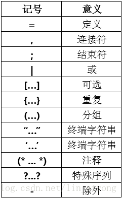
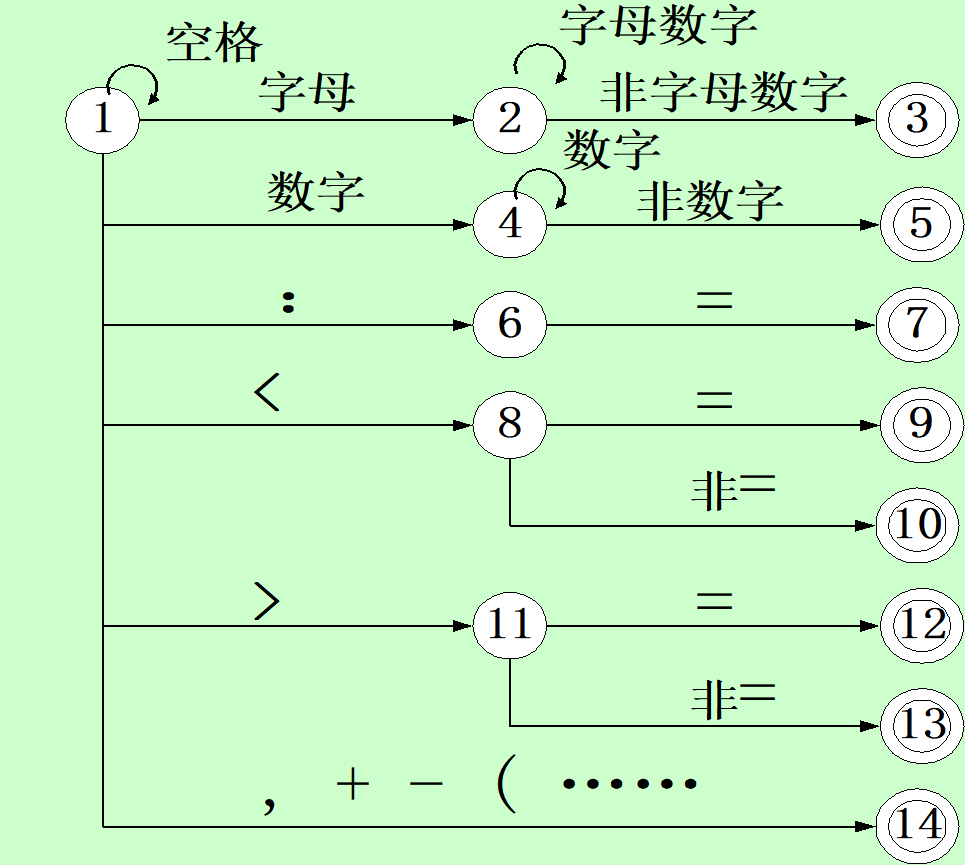
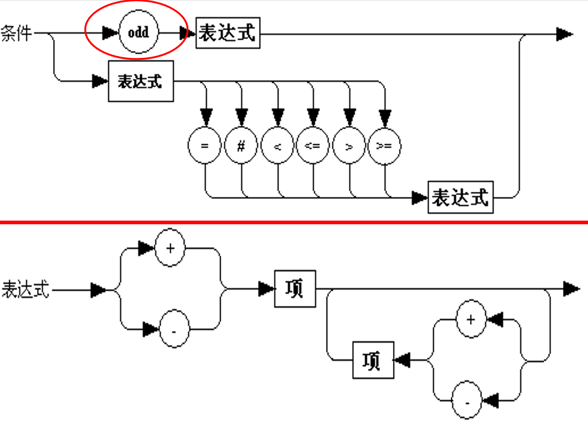

# 工具
Flex: 一个用C语言编写的词法(Lexer)分析工具
Bison: 语法(Parser)分析工具

# 概述
* 词法分析: 字符序列 -> 单词序列
* 语法分析: 单词序列 -> 各类语法短语(程序, 语句, 表达式)；生成抽象语法树AST
* 语义分析: 语义审查(类型审查, 强制转换)
* 生成中间代码: 三元式, 四元式, 树结构
* 优化代码
    * 合并已知量, 改变计算顺序, 共享子表达式, 降低运算强度(乘方 -> 乘)
    * 循环不变部分外提, 下标地址计算优化
    * 使用特殊指令
* 生成目标代码

# 文法(grammar)和语言

文法: $G[S] = \{V_N, V_T, P, S\}$. 对应: {非终结符集, 终结符集, 规则集合, 识别(开始)符号}

$\alpha \rarr \beta$意思是$\alpha$定义为$\beta$

文法类型:

* 0型(短语文法): $\alpha \rarr \beta$中, $\alpha$至少包含一个非终结符`(递归可枚举)`(所有文法都是0型)
* 1型(上下文有关): $\alpha \rarr \beta$中, $|\alpha| \le |\beta|$, 仅$S \rarr \epsilon$除外. `(左边长度小于右边)`
* 2型(上下文无关): $\alpha \rarr \beta$中, $\alpha$
* 3型(正规文法): $\alpha \rarr \beta$中, $\alpha$

## EBNF

# 词法分析
自动机: $M = (\Sigma, Q, q0, F, \delta)$, 对应(字母集, 有限状态集, 初始状态, 终结状态集, 从$Q \times\Xi$到Q的映射)

状态转换矩阵(转换表): 每一项为$\delta(q_i, a_j)$, 即状态$q_i$接受输入$a_j$后得到新状态.

DFA(deterministic finite automata): 有限自动机

NFA(non-deterministic): 

# 语法分析
## 自顶向下
### 递归子程序法

# PL/0
一个类Pascal语言.

词法分析的DFA如下: 

