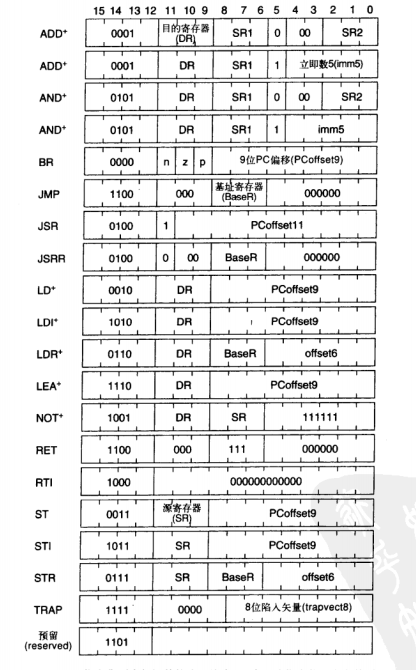
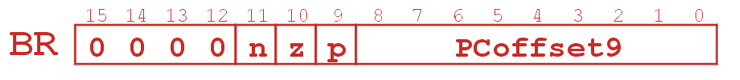

# LC-3
参考: [https://blog.csdn.net/weixin_44176696/article/details/105773303](https://blog.csdn.net/weixin_44176696/article/details/105773303)

在线模拟器: [https://spacetech.github.io/LC3Simulator/](https://spacetech.github.io/LC3Simulator/)

## 指令

ADD ： 加, 注意是立即数模式还是源目模式

AND ： 按位与, 注意是立即数模式还是源目模式

LD ： 直接寻址, 读内存（PC+偏移）存储的值到目的寄存器DR, 即 DR = M[pc + offset]

ST ：直接寻址, 将寄存器SR的值写入到目的地址对应的内存, 即 M[pc + offset] = SR

LDI ： 间接寻址（指针）, 读内存（PC+偏移）存储的值作为地址（指针）p, 再读取p对应的内存值到目的寄存器DR, 即DR = *M[pc + offset]

STI ：间接寻址（指针）, 将寄存器SR的值写入指针p（pc+偏移地址存放的值）对应的内存中, 即 *M[pc + offset] = SR

LDR ：基址+偏移寻址, 将【base寄存器的值+offset】地址存储的数据读取到目的寄存器DR, 即DR = M[R[base] + offset], 其中 R[base] 表示取base寄存器存放的值

STR ：基址+偏移寻址, 将源寄存器SR的值写入到内存的【base寄存器的值+offset】地址里, 即 M[R[base] + offset] = SR

LEA ：计算有效地址, 将pc+offset的值存放到寄存器DR, 不访问内存, 只是做加法



## 条件码与BR语句

条件码是跳转语句BR所依赖的条件, 有三个标志位表示状态, 这三个状态分别是 N,Z,P, 代表负数, 正数, 零, 而这个状态的来源是最近一次写入的寄存器

BR语句决定了下一次是否跳转, 根据条件码来决定, 而跳转的目标地址是 pc+offset, 具体是什么情况跳转, 取决于 BR[11:9] 里面的nzp的值



## 注意事项
* 状态来源于最近一次被写入的寄存器
* 跳转的目标地址是 pc+offset
* 一共有7条语句可以修改条件码, 他们分别是：ADD, AND, LD, LDI, LDR, LEA, NOT

## 编译过程
* 找到.ORIG; 初始化LC(位置计数器, 用于追踪当前指令)
* 对每一行, 若有label, 则将其与LC记入符号表; LC自增(若是.BLKW或.STRINGZ, 则加分配的单词的个数. 一个字符2字节; .BLKW应该是定义整数数组的, 后面是整数个数, 一个整数2字节；.FILL应该是1字节)
* .END处结束
* 记表过程: 遇到BR类指令时先把符号记入表, 地址留空(填问号); 等遇到代码块的符号时再地址填入

* 将汇编语句转换为机器指令(若语句中有label, 就会查看符号表)


## 示例
```as
.ORIG x3000     ；指示第一条指令的位置
LD R2, NUM
AND R3, R3, #0
AND R5, R5, #0
LOOP
ADD R4, R2, #-2
BRz DONE
ADD R3, R3, R5
ADD R5, R5, #1
ADD R2, R2, #-1
ST R2, ARRAY
BRp LOOP
DONE HALT
NUM .FILL 10
ARRAY .BLKW 3
NUM2 .FILL 16
.END        ； 指示结束位置
```

# x86
## 运算相关
* `aaa`(adjust after addition)
    * 用于在两个未打包的BCD值相加后, 调整al和ah寄存器的内容
    * 具体算法(参考: https://blog.csdn.net/liudongdong19/article/details/80551132)
        1. 如果al的低4位是在0到9之间, 保留低4位, 清除高4位, 如果al的低4位在10到15之间, 则通过加6, 来使得低4位在0到9之间, 然后再对高4位清零。
        2. 如果al的低4位是在0到9之间, ah值不变, CF和AF标志清零, 否则, ah=ah+1, 并设置CF和AF标志。

## 浮点数相关
* `fstenv <mem>`: 保存控制寄存器, 状态寄存器, 标记寄存器, FPU指令指针偏移量, FPU数据指针, FPU最后执行的操作码到内存中
* `fnstenv <mem>`: 把FpuSaveState结构体保存到内存
    ```c
    struct FpuSaveState{
    uint32_t control_word;
    uint32_t status_word;
    uint32_t tag_word；
    uint32_t fpu_instruction_pointer;
    uint32_t fpu_instruction_selector;
    uint32_t fpu_opcode;
    uint32_t fpu_operand_pointer;
    uint16_t fpu_operand_selector;
    uint16_t reserved;
    };
    ```