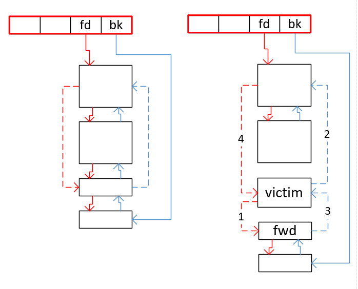
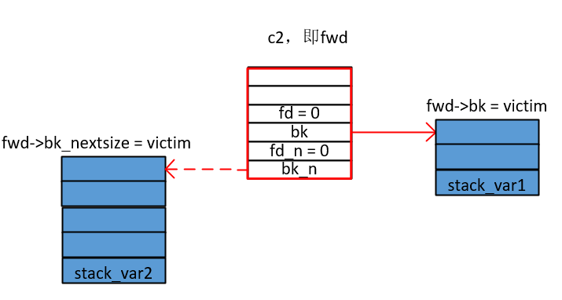

利用malloc引起的空闲块从unsorted bins移出并插入large bins时的赋值操作, 修改任意可写地址.

**预备知识**

malloc函数中, 从large bins中取块的代码中, 有如下这么一块.
```c
[...]

            else
            {
                victim->fd_nextsize = fwd;    // 1
                victim->bk_nextsize = fwd->bk_nextsize;    // 2
                fwd->bk_nextsize = victim;    // 3
                victim->bk_nextsize->fd_nextsize = victim;    // 4
            }
            bck = fwd->bk;

[...]

mark_bin (av, victim_index);
victim->bk = bck;
victim->fd = fwd;
fwd->bk = victim;
bck->fd = victim;
```
下图表示一个`新的大小的空闲块`进入large bins链时的情形, 左图是进入前, 右图是进入后. 红实线表示fd方向, 蓝实线表示bk方向, 红虚线表示fd_nextsize方向, 蓝虚线表示bk_nextsize方向. 右图中线上数字对应上面代码的else块中的四行代码的执行结果. 之后再是对fd和bk的重新赋值, 图中没有画出.



**条件**
1. UAF

**利用过程**
1. 分配3个大块c1, c2, c3(malloc(0x420), malloc(0x500), malloc(0x500)). 为防止释放时发生合并, 每分配一个大块后还要分配一个小块(malloc(0x20)).
2. 释放c1, c2.
3. 分配一个比c1稍小的块(malloc(0x90)), 造成c1分裂, 而c2进入large bins.
4. 释放c3.
5. 如下图, 对c2进行修改. 左右两蓝块表示栈上空间, 其上的表达式即是所利用的赋值表达式.

    

6. 分配小块(malloc(0x90)), 导致c3入large bins, 此时的fwd即是c2, victim即是c3, 如上图, stack_var1和stack_var2的值将变为c3的地址.
