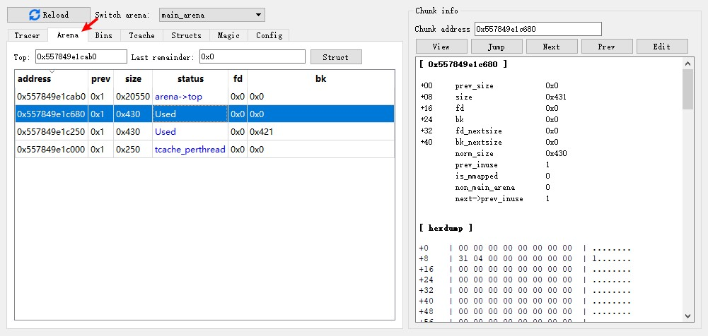
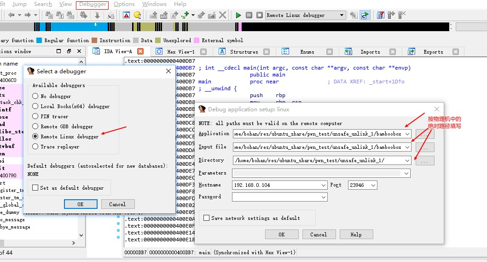
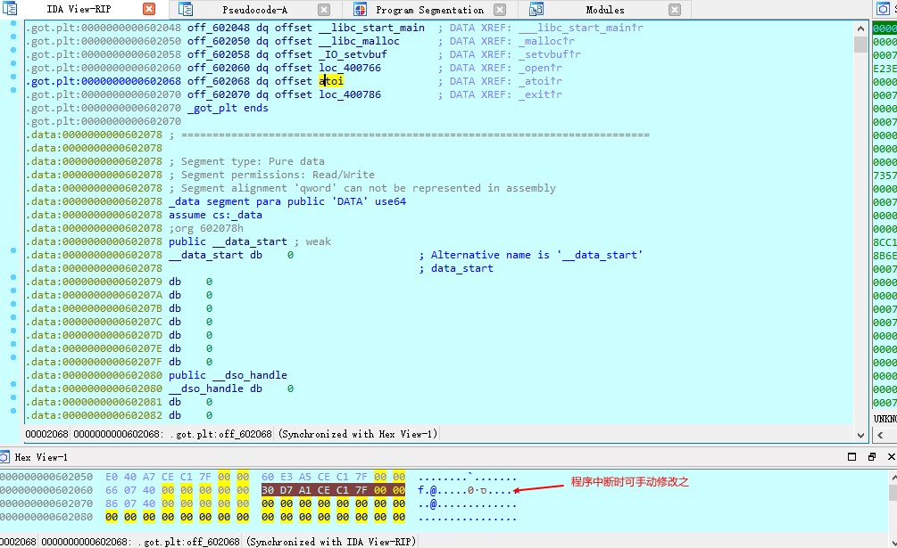
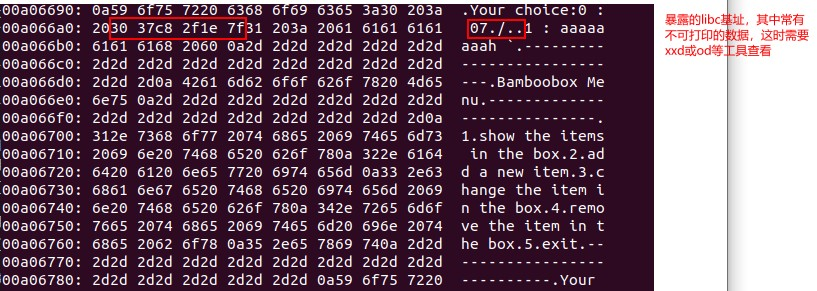
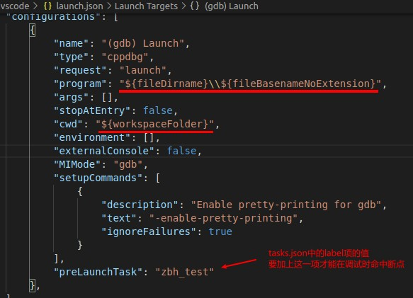
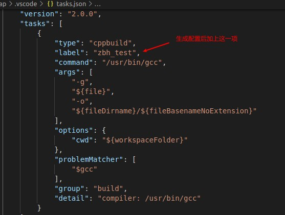
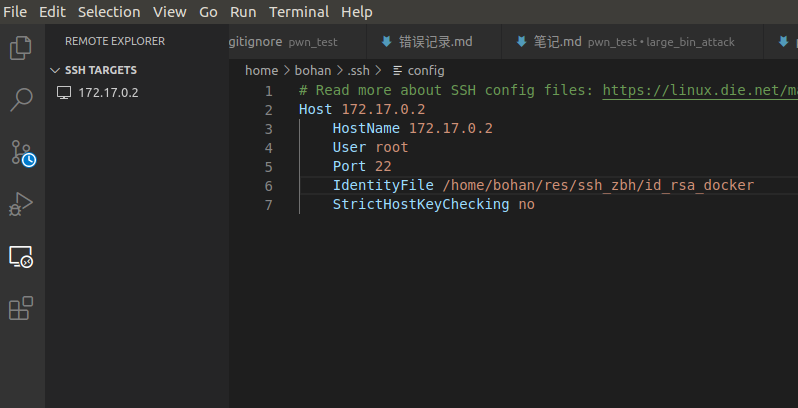
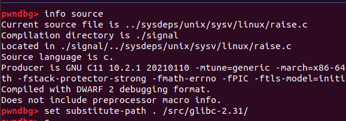
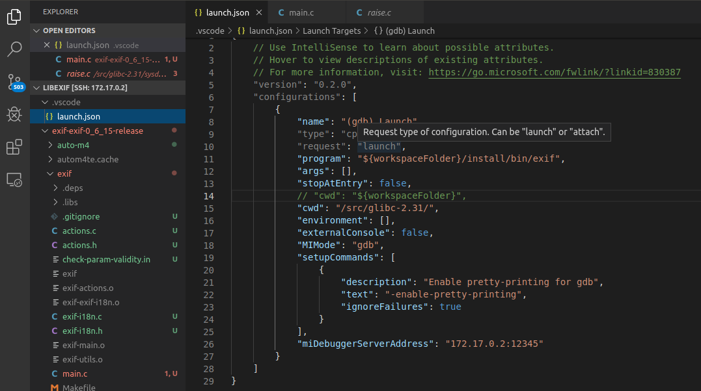

# ctf pwn题目程序调试
## 环境
1. Ubuntu, 作为物理机
2. 虚拟机,安装Win10, 其中安装ida 7, ida中安装插件heap viewer作为辅助插件
3. python 3, jupyter notebook
4. linux_server, 从ida/dbgsrv目录中获取并放在物理机中, 配合ida的动态调试使用

heap viewer如下, 可使用快捷键`ctrl+h`调出, 调出时需要程序处于挂起状态, 比如命中断点时. 在调试过程中, 可以在需要查看堆的状况时, 点击ida调试面板中的暂停按钮, 然后在heap viewer面板中点击reload刷新堆信息.



## 流程
### 方法一: 使用python的subprocess模块
1. 启动linux_server服务(要使用能被虚拟机访问的IP地址). 这里使用python的subprocess模块运行linux_server64, 并读写其管道与之通信. 
```python
linux_server = subprocess.Popen(
   ['linux_server64', '-i192.168.0.104'],  
   stdin=subprocess.PIPE, 
   stdout=subprocess.PIPE,
   shell=True,
)
fcntl.fcntl(linux_server.stdout.fileno(), fcntl.F_SETFL, os.O_NONBLOCK)
```

ida debugger配置:



2. 在ida中运行程序(快捷键f9). 可先按`f5`得到反编译的伪代码并设置断点. 全局变量的值需要在程序中断挂起时才能看到. 这时也可在hex_view窗口中按`f2`修改内存中的数据.



3. 对linux_server的输入输出流读写数据, 从而与目标程序进行交互.
```py
# 获取目标程序在终端打印的信息
lines = linux_server.stdout.readlines()

# 向目标程序写数据, 
linux_server.stdin.write(s)
linux_server.stdin.flush()
```

### 方法二: 使用管道
达到的效果是, 目标程序仍在终端中显示, 而我们可在别的程序中向终端发送数据(好处是可以发送不可打印的数据, 尤其是payload)

1. 创建命名管道:
```py
w_pipe = os.open('../p1', os.O_SYNC | os.O_CREAT | os.O_RDWR)
```
2. 重定向linux_server的输入输出, 使用刚创建的管道代替标准输入流, 并将输出接到xxd(方便查看不可打印的值).
```bash
linux_server64 -i192.168.0.104 < ./p1 |xxd
```



# 用vscode调试C++源码
## 配置
* 需要配置`launch.json`和`tasks.json`. 在`tasks.json`中配置`label`项, 填写task名；在`launch.json`中配置`preLaunchTask`项, 填写task名, 这样才能**在调试时命中断点**.

  

  

* 以`sudo`调试程序
  * 创建一个sh脚本, 其中加上这行: `pkexec /ust/bin/gdb "$@"`
  * 修改`launch.json`, 加上`miDebuggerPath`配置项, 填sh脚本**绝对路径**. 
  * 调试程序时, 会弹框要求输入用户密码, 然后就会`sudo`运行程序. 
* 想在调试时停在入口处, 则把`stopAtEntry`设为true. 

## 调试
* 按f5开始调试, f10单步执行.
* 在debug console窗口中, 若要执行gdb的命令, 需要先加上`-exec`. 
* 调试无源码可执行程序: 
  * 将`launch.json`中`stopAtEntry`设为true, `program`设为可执行程序路径. 
  * 点开可执行程序, F5运行. 
  * 来到`launch.json`文件, 按`ctrl+shift+p`, 输入`Open Disassembly View`, 回车, 即可进入反汇编界面并逐指令运行. 


## 远程调试docker容器中的程序
* vscode中安装插件: remote-ssh(**vscodium中使用会报错说"未认证的客户端", vscode中则不会**). 要先在本地用ssh-keygen生成密钥文件, 并把pub文件改名为authorized_keys, 放到容器的用户目录下. 虚拟机中`/etc/ssh/sshd_config`文件中添加如下配置:
  ```
    PermitRootLogin yes
    RSAAuthentication yes
    PubkeyAuthentication yes
  ```

  
* VM中安装ssh服务, 之后执行`/etc/init.d/ssh start`
* VM中编译gdb及gdbserver(都在gdb源码目录中)
* 在VM中启动gdbserver: `gdbserver 172.17.0.2:12345 ./test`
* 在vscode中通过ssh打开docker容器中的目标程序目录, 之后`run->start debugging`, 会先在目标目录下新建一个`.vscode`目录, 并新增一个``launch.json``文件. 手动设置`program`和`miDebuggerServerAddress`项. 最后打开VM中的程序源代码, 打上断点, 即可开始调试.
* 出现找不到源文件的问题(如`../sysdeps/unix/sysv/linux/raise.c: No such file or directory.`):
  * 先确保`/etc/apt/sources.list`文件中有`deb-src`行, 没有的话添加并执行`apt update`. 确保已经安装`dpkg-dev`. 之后cd到要保存源代码的目录并执行`apt source libc6`.
  * 若是在gdb中调试, 先`info source`查看源码路径, 如下图中提示`Compilation directory is ./signal`, 则`set substitute-path . /src/glibc-2.31/`设置libc的源码路径 

    

  * 若是在vscode中, 可改`launch.json`中的`cwd`项为libc源码路径.

    


# 其他
使用subprocess模块与另一个控制台进程通信, 参考: https://pymotw.com/2/subprocess/#interacting-with-another-command 

使用fcntl解决readlines阻塞的问题: https://stackoverflow.com/questions/8980050/persistent-python-subprocess

解决pwn题目加载指定libc版本的问题 https://www.cnblogs.com/bhxdn/p/14541441.html

## 下载不同版本的libc等库文件
```sh
git clone https://github.com/matrix1001/glibc-all-in-one
cd glibc-all-in-one/

# 下载可下载的版本清单
python ./update_list

# 下载
./download <版本>
```

## 指定.so文件路径
若题目给定了单独的.so文件(如libc), 则要让程序加载之(而不是使用系统库文件).
参考: https://www.cnblogs.com/ar-cheng/p/13225342.html

* 方法一: 设置环境变量`LD_LIBRARY_PATH`. 由于linux_server运行可能因新加载的so文件不兼容而无法运行, 故不用此法. 
* 方法二: 用patchelf给程序添加rpath:
```bash
patchelf --set-rpath '$ORIGIN/' <程序>
```
* 方法三: 在编译时指定rpath:
```bash
gcc heap.c -o heap_libc_2_23 -Wl,--rpath=/home/bohan/res/ubuntu_share/tools/glibc-all-in-one/libs/2.23-0ubuntu3_amd64 -Wl,--dynamic-linker=/home/bohan/res/ubuntu_share/tools/glibc-all-in-one/libs/2.23-0ubuntu3_amd64/ld-linux-x86-64.so.2
```

## fcntl
https://blog.csdn.net/martin_liang/article/details/8363251

1、获取文件的flags，即open函数的第二个参数:

   flags = fcntl(fd,F_GETFL,0);

2、设置文件的flags:

  fcntl(fd,F_SETFL,flags);

3、增加文件的某个flags，比如文件是阻塞的，想设置成非阻塞:

   flags = fcntl(fd,F_GETFL,0);

   flags |= O_NONBLOCK;

  fcntl(fd,F_SETFL,flags);

4、取消文件的某个flags，比如文件是非阻塞的，想设置成为阻塞:

  flags = fcntl(fd,F_GETFL,0);

  flags &= ~O_NONBLOCK;

  fcntl(fd,F_SETFL,flags);
