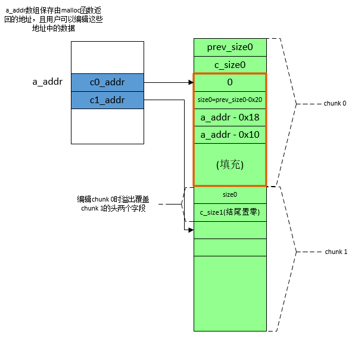
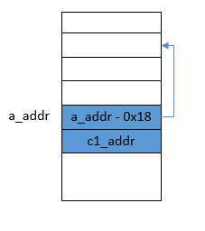

# 条件
1. 堆块可溢出, 且至少能溢出0x10个字节(**为了覆盖下一个堆块头部的前两个字段**)
# 利用过程
* 如图1, 红色部分以及chunk1的前0x10个字节都需要用户精心构造. 在操作过程中, 用户可编辑c0_addr地址处的内存, 并且可溢出到chunk0后面的0x10个字节. 
* 构造假块: 红色部分为在chunk0中伪造的假chunk, 其大小为调用`malloc`生成chunk0时指定的大小, 即chunk0大小减去头部两个字段大小（0x10）所得数值. 在有tcache的版本中, chunk的大小要大于0x420, 以防释放时被放到tcache中. 
* 将chunk1释放. 由于chunk1的`size`字段(值为c_size1)结尾为0, 所以libc认为chunk1前面的堆块是空闲的, 因此执行后向合并操作. libc看到chunk1的`prev_size`字段大小为size0, 通过计算(`chunk1起始地址 - size0`)后得到假chunk的起始地址, 因此把假chunk认为是要合并的空闲chunk. 于是libc会**对假chunk进行unlink操作, 把它从bins链取下, 与chunk1进行合并.**
* 在unlink操作中, 按`unlink_chunk`宏中的赋值顺序(如下), **最后a_addr处的值将会是FD, 也就是说它的值将从原来的c0_addr变为a_addr - 0x18**(如图2所示). **之后对块0的编辑操作就变成对a_addr - 0x18处的编辑操作**. 
    ```c
        FD->bk = BK; 
        BK->fd = FD;
    ```
    * 图1: 构造假块并向chunk1溢出. <br>
        

    * 图2: 执行`free(c1_addr)`将chunk1释放(将进行unlink操作以合并chunk0和chunk1)后, 全局数组的状况. 此时`a_addr[0]`存放的指针指向了`a_addr - 0x18`处. <br>
        

# 下一步利用(假设已知目标程序使用atoi函数处理输入值)
1. 再次编辑块0, 即编辑从**a_addr - 0x18**开始的内存空间, 将a_addr处的值改为got表中`atoi`函数的地址, 通过打印块中内容的操作, 打印出`atoi`函数在目标进程中的实际载入地址. 
2. 再根据libc库的符号表中记录的`atoi`函数和`system`函数的虚拟地址, 计算二者的距离, 并使用上述`atoi`函数的实际地址计算`system`函数的实际地址. 
3. 再次编辑块0, 此时编辑的是`atoi`函数的got表项, 将其替换为`system`函数的地址. 之后发送字符串“/bin/sh\n”, 向目标机器发送shell命令. 
