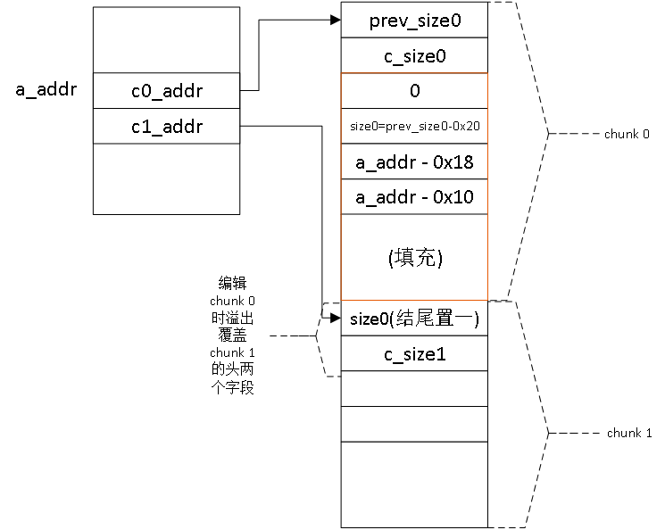

红色部分为在chunk 0中伪造的假chunk，大小为在malloc得到chunk0时指定的大小，即chunk 0大小减去头部两个字段大小（0x10）。有tcache的版本中，chunk大小要大于0x420，以防释放时被放到tcache中。
将chunk 1释放。由于其prev_size字段中结尾为1，libc认为其前面的堆块是空闲的，因此发生后向合并。libc看到这个字段大小为size0，因此把假chunk认为是要合并的空闲chunk。
unlink操作中，按如下unlink_chunk宏中的赋值顺序，**最后a_addr处的值是FD，即a_addr - 0x18**。**之后对块0的编辑操作就变成对a_addr - 0x18处的编辑操作**。

FD->bk = BK; BK->fd = FD;

下一步利用（假设已知目标程序使用atoi函数处理输入值）：

1.再次编辑块0，即编辑从**a_addr - 0x18**开始的内存空间，将a_addr处值改为atoi函数的got表项地址，通过打印块中内容的操作，打印出atoi函数在目标进程中的实际载入地址。
2.再根据libc库的符号表中记录的atoi函数和system函数的虚拟地址，计算二者的距离，并使用上述atoi函数的实际地址计算system函数的实际地址。
3.再次编辑块0，此时编辑的是atoi函数的got表项，将其替换为system函数的地址。之后发送字符串“/bin/sh\n”，向目标机器发送shell命令。
