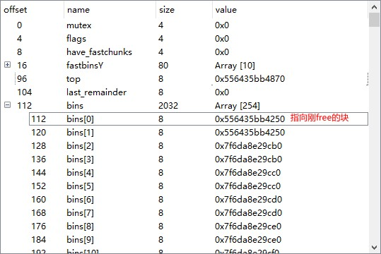
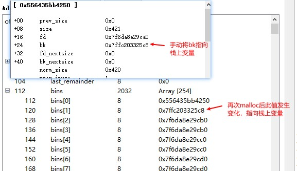
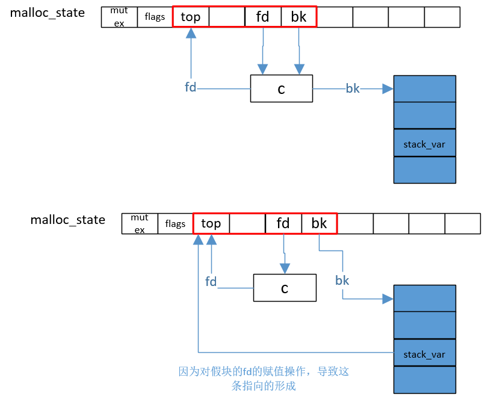

利用从unsortedbins链中取块后进行重新链接时发生的赋值操作, 修改任意可写地址.

**预备知识**
1. unsorted bins链是malloc_state结构体的bins数组的前两个元素bins[0]和bins[1]
2. 从unsorted bins链中取出块的源码如下.
    ```c
    /* remove from unsorted list */
    unsorted_chunks(av)->bk = bck;
    bck->fd = unsorted_chunks(av);
    ```

**条件**
1. 存在UAF

**利用过程**
1. 分配堆块c(需确保其不会在释放后进入fastbin, 大小如0x410), 再分配一个以防释放后的c和top合并.
2. 释放c, 并修改其bk指向目标位置stack_var.
3. malloc(0x410), 再次将c分配. 此过程会导致stack_var的值变为malloc_state的top成员的位置.

    下面两张图分别展示malloc前后malloc_state中unsorted bins的情况.

    

    



**用途**
1. 向目标位置写入一个大值(如, 7f打头的值)
2. 篡改top块(?)