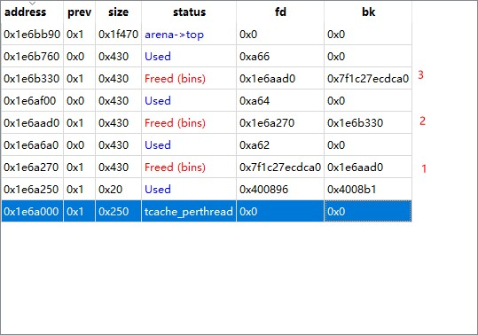
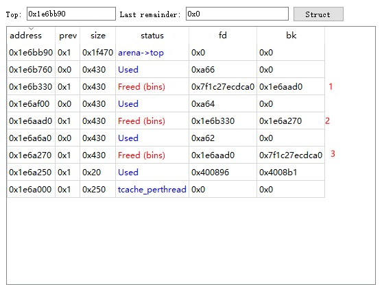
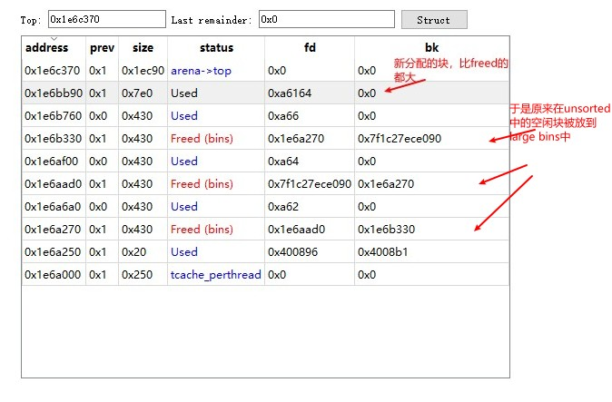
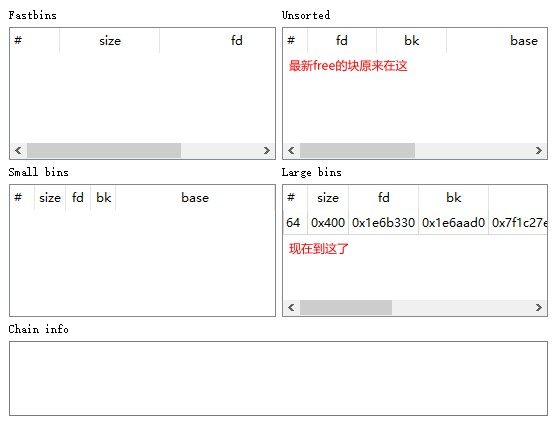
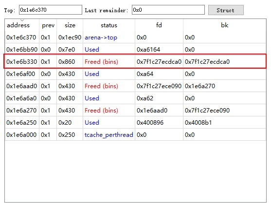
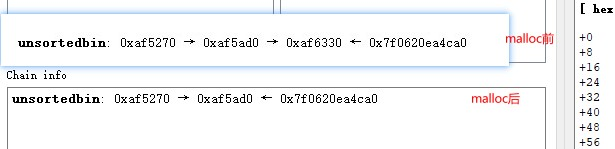
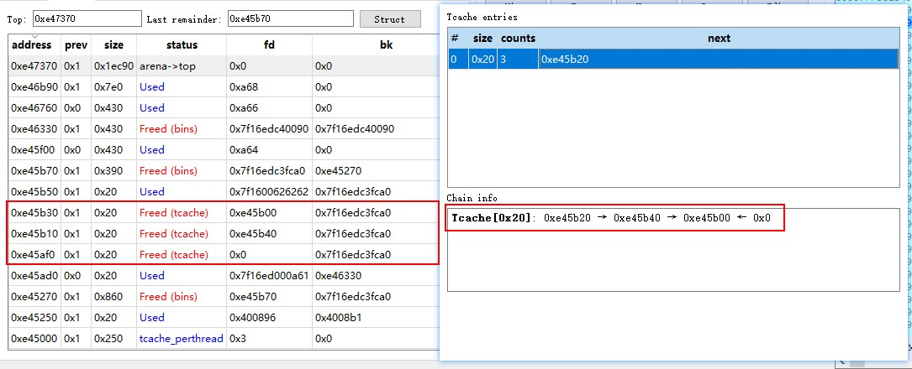

bk指针指向新入链的块, 即沿着bk的方向, 越往后的块是更晚进bins的块. 如下图, 数字表示free的顺序.

新分配块没能在unsorted链中找到时, unsorted链中的空闲块都会根据其大小放到small或large链中

新free一块, 它的相邻freed块在large链中, 进行合并, 得到新的空闲块如下红框所示. 新的块还是在unsorted链中

在有peda插件的gdb中, 显示bins链时, 箭头所指方向都是更早free的块, **箭头也即fd方向**.

malloc如果从bins链中取空闲块时, 取的是fd方向的最前端, 如下图.

# libc堆管理中的'向前'和'向后'
libc的块(chunk)头部中, 有两个字段fd和bk, 意思分别是**向前forward和向后backward**.
在向前合并和向后合并中, 操作对象有两个: 原有的在bins中的某个空闲区块, 新free的块. 这两个块物理相邻, 即处于连续的地址空间中. 而**主语应该是bins中的某个空闲块**.

## 向后合并
在unsafe unlink中出现的consolidate backward即向后合并, 如下图, 白框是空闲块, 绿框是使用中的块. 对块1进行free, 因libc发现与块1相邻的块0是空闲的, 因此"块0向后合并块1". 

## 向前合并
如下图. 对块2进行free, 因libc发现与块2相邻的块3是空闲的, 因此"块3向前合并块2". 

向前合并的逻辑: 要free的块是p, 则检查p的下一块的下一块的size字段的prev_inuse位, 以确认p的下一块是否在使用中.

# 其他
放入tcache中的相邻的空闲块没有合并(?). 

