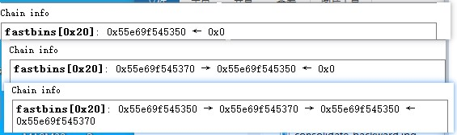
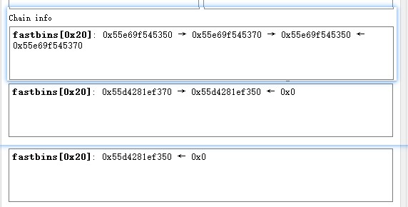

bk指针指向新入链的块, 即沿着bk的方向, 越往后的块是更晚进bins的块. 如下图, 数字表示free的顺序.

新分配块没能在unsorted链中找到时, unsorted链中的空闲块都会根据其大小放到small或large链中

新free一块, 它的相邻freed块在large链中, 进行合并, 得到新的空闲块如下红框所示. 新的块还是在unsorted链中

在有peda插件的gdb中, 显示bins链时, 箭头所指方向都是更早free的块, **箭头也即fd方向**.

malloc如果从bins链中取空闲块时, 取的是fd方向的最前端, 如下图.

# fastbin
单链表, 以fd指针相连, 沿着fd的指向往后的块越早进链, 最新进链的块是链表的头部.

出链时, 最新进链的块先出. 所以这是LIFO结构.

# 其他
放入tcache中的相邻的空闲块没有合并(?). 

