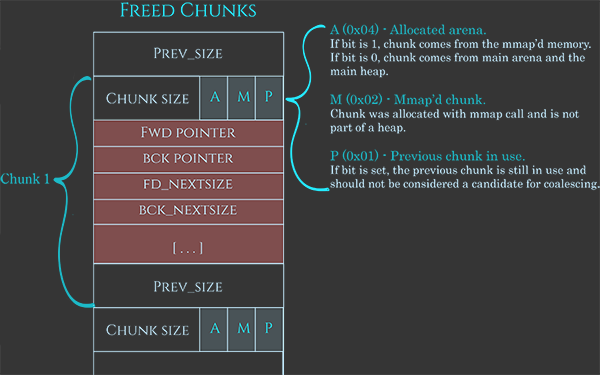
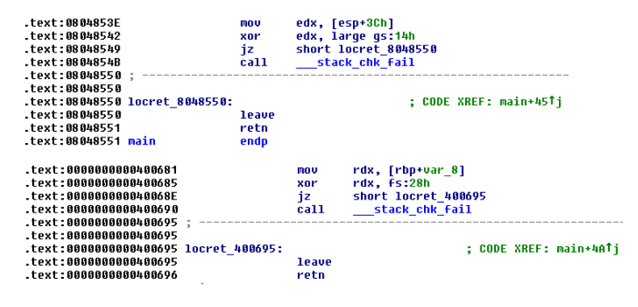

**堆溢出基础**: 
参考:
* [堆溢出-Glibc堆结构](https://kabeor.cn/堆溢出-Glibc堆结构)
* https://azeria-labs.com/heap-exploitation-part-2-glibc-heap-free-bins/
* [堆漏洞基础](https://heap-exploitation.dhavalkapil.com/)
* [Nightmare](https://guyinatuxedo.github.io/): 一个CTF二进制安全和逆向工程的教学.

# 堆中的元数据
**heap_info**: 
```c
struct _heap_info
{
  mstate ar_ptr;           // Arena for this heap. <--- Malloc State pointer
  struct _heap_info *prev; // Previous heap.
  size_t size;            // Current size in bytes.
  size_t mprotect_size;   // Size in bytes that has been mprotected
  char pad[-6 * SIZE_SZ & MALLOC_ALIGN_MASK]; // Proper alignment
} heap_info; 
```

**arena**

指每个线程独自拥有的一块内存区域. `main arena`则代表程序的初始堆. 每个arena有一个`mutex`来控制访问权限. 操作arena前线程需要获得锁(某些操作如`访问fastbins`除外).

每个chunk的size字段的倒数第三位(N)如果被设置为1, 则表示该块属于非主arena, 否则就是在主arena.

非主arena的堆的底部是heap_info, 其中的第一个字段`ar_ptr`指向arena.


**块chunk**



* 当前块是否为"使用中", 取决于紧邻的下一块的prev_inuse位是否为1.


**常量**
|Parameter|32 bit|i386|64 bit|
|--|--|--|--|
|MALLOC_ALIGNMENT | 8 | 16 | 16
|MIN_CHUNK_SIZE | 16 | 16 | 32
|MAX_FAST_SIZE | 80 | 80 | 160
|MAX_TCACHE_SIZE | 516 | 1,020 | 1,032
|MIN_LARGE_SIZE | 512 | 1,008 | 1,024
|DEFAULT_MMAP_THRESHOLD | 131,072 | 131,072 | 131,072
|DEFAULT_MMAP_THRESHOLD_MAX | 524,288 | 524,288 | 33,554,432
|HEAP_MIN_SIZE | 32,768 | 32,768 | 32,768
|HEAP_MAX_SIZE | 1,048,576 | 1,048,576 | 67,108,864(0x4000000)

# libc堆管理中的'向前'和'向后'
libc的块(chunk)头部中, 有两个字段fd和bk, 意思分别是**向前forward和向后backward**.
在向前合并和向后合并中, 操作对象有两个: 原有的在bins中的某个空闲区块, 新free的块. 这两个块物理相邻, 即处于连续的地址空间中. 而**主语应该是bins中的某个空闲块**.

## 向后合并
在unsafe unlink中出现的consolidate backward即向后合并, 如下图, 白框是空闲块, 绿框是使用中的块. 对块1进行free, 因libc发现与块1相邻的块0是空闲的, 因此"块0向后合并块1". 


## 向前合并
如下图. 对块2进行free, 因libc发现与块2相邻的块3是空闲的, 因此"块3向前合并块2". 


向前合并的逻辑: 要free的块是p, 则检查p的下一块的下一块的size字段的prev_inuse位, 以确认p的下一块是否在使用中.


# top块
* top块处于高地址. 其有一个size字段, 记录可分配空间的大小, 如果malloc需要更多内存空间时, 该字段会改变.
* 实验中观察到发生malloc时, top块的`地址`也会发生变化. malloc得到的新块是向高地址扩展的, top块的首地址也会向高地址发展.

    
    <br>
    

# bins
* small bins: 62个, 大小不超过512(16, 24, 32, ..., 504)或1024(32, 48, 64, ..., 1008)字节.
* large bins: 63个, 大小大于512或1024字节.
* unsorted bin: 1个, 存刚刚free的块, 或者刚刚合并产生的空闲块
* fast bins: 10个单链, 暂存小块(16, 24, 32, 40, 48, 56, 64, 72, 80, 88), **不作合并操作(块的P位不置1)**. 可将fastbins中的块视为不是真正空闲的块, 每当有malloc请求的块没法由fastbins提供, 或者释放超过64KB的块, 或调用`malloc_trim`或`mallopt`函数时, 堆管理器会进行一次合并操作, 把fastbins清空.
* tcache bins: 每个线程有64个tcache单链(大小为12\~512或24\~1032)；每个bin链`最多包含7个块`. 为了减缓锁带来的性能下降问题, 堆管理器通常做法是为每个线程分配一个arena, 同时每个线程有自己的tcache(这样就不用和其他线程同步取块, 也就不用获取堆锁). tcache和fastbins性质差不多.

## 取块的流程
1. 请求的大小在tcache的范围内, 且tcache中有块, 则直接取.
2. 请求的块过大, 则通过mmap.
3. 否则获取堆锁, 然后按序执行:
    1. fastbins/smallbins
        * 大小对应于fastbins, 则在fastbins中找块. 同时从fastbins中取块, 填入tcache.
        * 否则在smallbins找. 同上填tcache.
    2. 处理延迟释放的块
        * 对fastbins中的块做真正的释放, 移到unsortedbin中.
        * 从unsortedbin中遍历取块. 如果看到的块不合适, 则按它的大小放到smallbins或largebins中(同上用小块填tcache).
    3. 基本回收策略:
        * 请求的大小属于largebins, 则到largebins找块.
    4. 新建块:
        * 没有可获取的块, 直接尝试从堆顶获取.
        * 堆不够大, 则调用`sbrk`扩充.
        * 无法扩大延伸堆空间, 则用`mmap`新建和原堆不连续的扩展空间, 并从哪里分配块.
    5. 失败则返回NULL.

## 释放的流程
1. 传给`free`的参数为NULL, 则无事发生.
2. 块大于64KB, 
3. 对块做完整性检查, 检查失败则终止流程.
4. 块大小符合tcache则存入tcache.
5. 块设置了M标志位, 则用`munmap`回收.
6. 否则获取堆锁, 然后:
    1. 块大小符合fastbins则存入fastbins, 结束.
    2. 块大于64KB, 则把fastbins中的块合并, 放到unsortedbin中.
    3. 对smallbins, largebins, unsortedbin中的块作前/后向合并.
    4. 如果得到的块紧邻堆顶, 则直接并入堆顶.
    5. 否则将块保存进unsortedbin(之后malloc时可能会把unsortedbin中的块放到smallbins或largebins中).


## fastbinsY数组存储fastbins的规则
https://blog.csdn.net/qq_41453285/article/details/96865321

* 每个fast bin链表都是单链表（**`使用fd指针`**）。因此，fast bin中无论是添加还是移除fast chunk，都是对“链表尾”进行操作，而不会对某个中间的fast chunk进行操作。
* 单个fastbin链表中的chunk大小都是相同的，各个fastbin链表中的chunk大小是不同的。
* fastbinY数组中的每个bin链表的排序，是按照链表元素的大小进行排序的。数组的第一个元素的fast bin链表中的每个chunk的大小是32字节，数组的第二个元素的fast bin链表中的每个chunk的大小是48字节......每个元素都比前面的fast bin链大`16字节`，以此类推进行排序。


## large bins
chunk中使用了两个新指针:
  * `fd_nextsize` 指向前一个与当前 chunk 大小不同的第一个空闲块，不包含 bin 的头指针。
  * `bk_nextsize` 指向后一个与当前 chunk 大小不同的第一个空闲块，不包含 bin 的头指针。

以下large bins管理方法引用自[https://zhuanlan.zhihu.com/p/78340329](https://zhuanlan.zhihu.com/p/78340329):

* 堆块从大到小排序。
* 对于相同大小的堆块，最`先释放的堆块会成为堆头`，其fd_nextsize与bk_nextsize会被赋值，其余的堆块释放后都会插入到该堆头结点的下一个结点，通过fd与bk链接，形成了先释放的在链表后面的排序方式，且其fd_nextsize与bk_nextsize都为0。
* 不同大小的堆块通过堆头串联，即堆头中`fd_nextsize指向比它小的堆块的堆头`，bk_nextsize指向比它大的堆块的堆头，从而形成了第一点中的从大到小排序堆块的方式。同时最大的堆块的堆头的bk_nextsize指向最小的堆块的堆头，最小堆块的堆头的fd_nextsize指向最大堆块的堆头，以此形成循环双链表。

分析源码可知的其他信息:
* 从large bins寻找合适的块:
  * 从最小的开始找(即沿着bk链找, 通过bk_nextside索取更大的块)
  * 
  * 

## bin链出入顺序
|链|出入顺序 |
|--|--|
|fast bins| LIFO, 在链表的头部进行增删操作. |
|small bins| FIFO, 头部添加, 尾部删除. |
|large bins| (?) 降序排列, 大块在头, 小块在尾. |

# 保护机制

保护和绕过方法: https://www.cnblogs.com/yidianhan/p/13996928.html

## RELRO
为减少对GOT表的攻击, 程序启动时就解析并绑定了所有动态符号, 并设为只读.
partial RELRO时如下, got表中存在不少'loc_'开头的地址, 指向plt表, 这些函数都是还未被调用的函数, 所以未绑定到实际地址.


full RELRO时如下, got表中绑定的地址中没有'loc_'开头的地址, 很多都是'unk_'开头的, 指向函数实际地址.


## PIE(position-independent executable)
内存地址随机化. 程序在每次加载时都变换加载基址，从而使位于程序本身的gadget也失效.

绕过: https://zhuanlan.zhihu.com/p/78076171

## Canary
参考:
* [https://zhuanlan.zhihu.com/p/99321839](https://zhuanlan.zhihu.com/p/99321839):
* [https://j00ru.vexillium.org/slides/2015/insomnihack.pdf](https://j00ru.vexillium.org/slides/2015/insomnihack.pdf):



canary是linux下的保护机制，它会保存在栈的某个位置上，一般来说64位的话会在`rbp-0x8`的位置，32位则在`ebp-0x4`的位置。当我们进行栈溢出的时候如果覆盖了canary值，程序就会调用`stack_chk_fail`来打印报错信息。在做题的时候最烦的就是这种，大大增加了栈溢出时的难度。通常有以下几种绕过方法：

1、通过read函数泄露canary。关键的一点就是read函数读取字符串的时候不会在末尾加上“\x00”,这就是gets函数不能用来泄露canary的原因（有些输出函数遇到‘\0’会截断）。

2、暴力破解canary。这种方法利用起来有限制，就是一般要程序中有fork函数创造出子进程，因为子进程是父进程复制出来的，所以canary也就跟父进程相同，在子进程中覆盖canary后报错就会退回到父进程，此时canary的值是不会改变的。

3、劫持stack_chk_fail。因为canary被覆盖的时候会调用这个函数，所以如果我们可以利用程序中的漏洞（比如格式化字符串）改got表中stack_chk_fail的地址为one_gadget的地址就能getshell。

4、利用stack_chk_fail的报错信息。在报错信息中，会将你发生栈溢出的程序名调用输出，其位置位于argv[0]，我们可以将argv[0]的地址改写为我们想要获取的内容的地址，使它随着错误提示一起输出。
