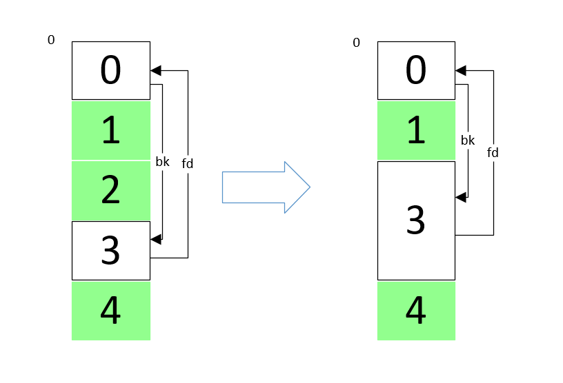

**堆溢出基础**: 
* https://kabeor.cn/堆溢出-Glibc堆结构
* https://azeria-labs.com/heap-exploitation-part-2-glibc-heap-free-bins/
* https://heap-exploitation.dhavalkapil.com/
* https://guyinatuxedo.github.io/

# 堆中的元数据
**heap_info**: 
```c
struct _heap_info
{
  mstate ar_ptr;           // Arena for this heap. <--- Malloc State pointer
  struct _heap_info *prev; // Previous heap.
  size_t size;            // Current size in bytes.
  size_t mprotect_size;   // Size in bytes that has been mprotected
  char pad[-6 * SIZE_SZ & MALLOC_ALIGN_MASK]; // Proper alignment
} heap_info; 
```

**arena**

指每个线程独自拥有的一块内存区域. `main arena`则代表程序的初始堆. 每个arena有一个`mutex`来控制访问权限. 操作arena前线程需要获得锁(某些操作如`访问fastbins`除外).

每个chunk的size字段的倒数第三位(N)如果被设置为1, 则表示该块属于非主arena, 否则就是在主arena.

非主arena的堆的底部是heap_info, 其中的第一个字段`ar_ptr`指向arena.


**常量**
|Parameter|32 bit|i386|64 bit|
|--|--|--|--|--|
|MALLOC_ALIGNMENT | 8 | 16 | 16
|MIN_CHUNK_SIZE | 16 | 16 | 32
|MAX_FAST_SIZE | 80 | 80 | 160
|MAX_TCACHE_SIZE | 516 | 1,020 | 1,032
|MIN_LARGE_SIZE | 512 | 1,008 | 1,024
|DEFAULT_MMAP_THRESHOLD | 131,072 | 131,072 | 131,072
|DEFAULT_MMAP_THRESHOLD_MAX | 524,288 | 524,288 | 33,554,432
|HEAP_MIN_SIZE | 32,768 | 32,768 | 32,768
|HEAP_MAX_SIZE | 1,048,576 | 1,048,576 | 67,108,864(0x4000000)

# libc堆管理中的'向前'和'向后'
libc的块(chunk)头部中, 有两个字段fd和bk, 意思分别是**向前forward和向后backward**.
在向前合并和向后合并中, 操作对象有两个: 原有的在bins中的某个空闲区块, 新free的块. 这两个块物理相邻, 即处于连续的地址空间中. 而**主语应该是bins中的某个空闲块**.

## 向后合并
在unsafe unlink中出现的consolidate backward即向后合并, 如下图, 白框是空闲块, 绿框是使用中的块. 对块1进行free, 因libc发现与块1相邻的块0是空闲的, 因此"块0向后合并块1". 


## 向前合并
如下图. 对块2进行free, 因libc发现与块2相邻的块3是空闲的, 因此"块3向前合并块2". 



向前合并的逻辑: 要free的块是p, 则检查p的下一块的下一块的size字段的prev_inuse位, 以确认p的下一块是否在使用中.


# top块
* top块处于高地址. 其有一个size字段, 记录可分配空间的大小, 如果malloc需要更多内存空间时, 该字段会改变.
* 实验中观察到发生malloc时, top块的`地址`也会发生变化. malloc得到的新块是向高地址扩展的, top块的首地址也会向高地址发展.

    
    <br>
    

# fastbinsY数组存储fastbins的规则
https://blog.csdn.net/qq_41453285/article/details/96865321

    每个fast bin链表都是单链表（**使用fd指针**）。因此，fast bin中无论是添加还是移除fast chunk，都是对“链表尾”进行操作，而不会对某个中间的fast chunk进行操作。
    单个fastbin链表中的chunk大小都是相同的，各个fastbin链表中的chunk大小是不同的。
    fastbinY数组中的每个bin链表的排序，是按照链表元素的大小进行排序的。数组的第一个元素的fast bin链表中的每个chunk的大小是32字节的，数组的第二个元素的fast bin链表中的每个chunk的大小是48字节的......每个元素都比前面的fast bin链大16字节，以此类推进行排序。


# large bins
chunk中使用了两个新指针:
  * `fd_nextsize` 指向前一个与当前 chunk 大小不同的第一个空闲块，不包含 bin 的头指针。
  * `bk_nextsize` 指向后一个与当前 chunk 大小不同的第一个空闲块，不包含 bin 的头指针。

以下large bins管理方法引用自[https://zhuanlan.zhihu.com/p/78340329](https://zhuanlan.zhihu.com/p/78340329):

    * 堆块从大到小排序。
    * 对于相同大小的堆块，最先释放的堆块会成为堆头，其fd_nextsize与bk_nextsize会被赋值，其余的堆块释放后都会插入到该堆头结点的下一个结点，通过fd与bk链接，形成了先释放的在链表后面的排序方式，且其fd_nextsize与bk_nextsize都为0。
    * 不同大小的堆块通过堆头串联，即堆头中fd_nextsize指向比它小的堆块的堆头，bk_nextsize指向比它大的堆块的堆头，从而形成了第一点中的从大到小排序堆块的方式。同时最大的堆块的堆头的bk_nextsize指向最小的堆块的堆头，最小堆块的堆头的fd_nextsize指向最大堆块的堆头，以此形成循环双链表。

分析源码可知的其他信息:
* 从large bins寻找合适的块:
  * 从最小的开始找(即沿着bk链找, 通过bk_nextside索取更大的块)
  * 
  * 

# bin链出入顺序
| | |
|--|--|
|fast bins| LIFO, 在链表的头部进行增删操作. |
|small bins| FIFO, 头部添加, 尾部删除. |
|large bins| (?) 降序排列, 大块在头, 小块在尾. |

# 保护机制

保护和绕过方法: https://www.cnblogs.com/yidianhan/p/13996928.html

## RELRO
为减少对GOT表的攻击, 程序启动时就解析并绑定了所有动态符号, 并设为只读.
partial RELRO时如下, got表中存在不少'loc_'开头的地址, 指向plt表, 这些函数都是还未被调用的函数, 所以未绑定到实际地址.


full RELRO时如下, got表中绑定的地址中没有'loc_'开头的地址, 很多都是'unk_'开头的, 指向函数实际地址.


# PIE(position-independent executable)
内存地址随机化. 程序在每次加载时都变换加载基址，从而使位于程序本身的gadget也失效.

绕过: https://zhuanlan.zhihu.com/p/78076171
