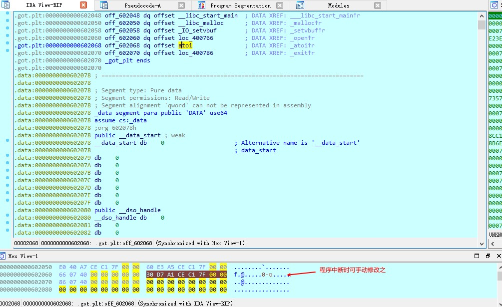
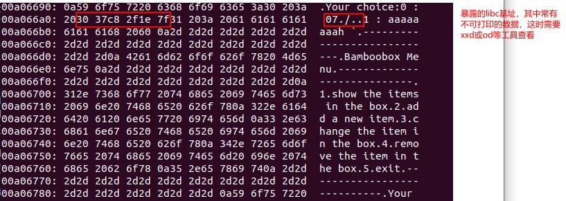

# ctf pwn题目程序调试
## 环境
1. Ubuntu, 作为物理机
2. 虚拟机,安装Win10, 其中安装ida 7, ida中安装插件heap viewer作为辅助插件
3. python 3, jupyter notebook
4. linux_server, 从ida/dbgsrv目录中获取并放在物理机中, 配合ida的动态调试使用


## 流程
### 方法一: 使用python的subprocess模块
1. 启动linux_server服务(要使用能被虚拟机访问的IP地址). 这里使用python的subprocess模块运行linux_server64, 并读写其管道与之通信. 
```python
linux_server = subprocess.Popen(
   ['linux_server64', '-i192.168.0.104'],  
   stdin=subprocess.PIPE, 
   stdout=subprocess.PIPE,
   shell=True,
)
fcntl.fcntl(linux_server.stdout.fileno(), fcntl.F_SETFL, os.O_NONBLOCK)
```

ida debugger配置:


2. 在ida中运行程序(快捷键f9). 可先按f5得到反编译的伪代码并设置断点. 全局变量的值需要在程序中断挂起时才能看到. 这时也可在hex_view窗口中按f2修改内存中的数据.


3. 对linux_server的输入输出流读写数据, 从而与目标程序进行交互.
```py
# 获取目标程序在终端打印的信息
lines = linux_server.stdout.readlines()

# 向目标程序写数据, 
linux_server.stdin.write(s)
linux_server.stdin.flush()
```

### 方法二: 使用管道
达到的效果是, 目标程序仍在终端中显示, 而我们可在别的程序中向终端发送数据(好处是可以发送不可打印的数据, 尤其是payload)

1. 创建命名管道:
```py
w_pipe = os.open('../p1', os.O_SYNC | os.O_CREAT | os.O_RDWR)
```
2. 重定向linux_server的输入输出, 使用刚创建的管道代替标准输入流, 并将输出接到xxd(方便查看不可打印的值).
```bash
linux_server64 -i192.168.0.104 < ./p1 |xxd
```



# 其他
使用subprocess模块与另一个控制台进程通信, 参考: https://pymotw.com/2/subprocess/#interacting-with-another-command 

使用fcntl解决readlines阻塞的问题: https://stackoverflow.com/questions/8980050/persistent-python-subprocess

解决pwn题目加载指定libc版本的问题 https://www.cnblogs.com/bhxdn/p/14541441.html

堆溢出基础: 
https://kabeor.cn/堆溢出-Glibc堆结构
https://azeria-labs.com/heap-exploitation-part-2-glibc-heap-free-bins/
https://heap-exploitation.dhavalkapil.com/

## fcntl
https://blog.csdn.net/martin_liang/article/details/8363251

1、获取文件的flags，即open函数的第二个参数:

   flags = fcntl(fd,F_GETFL,0);

2、设置文件的flags:

  fcntl(fd,F_SETFL,flags);

3、增加文件的某个flags，比如文件是阻塞的，想设置成非阻塞:

   flags = fcntl(fd,F_GETFL,0);

   flags |= O_NONBLOCK;

  fcntl(fd,F_SETFL,flags);

4、取消文件的某个flags，比如文件是非阻塞的，想设置成为阻塞:

  flags = fcntl(fd,F_GETFL,0);

  flags &= ~O_NONBLOCK;

  fcntl(fd,F_SETFL,flags);

